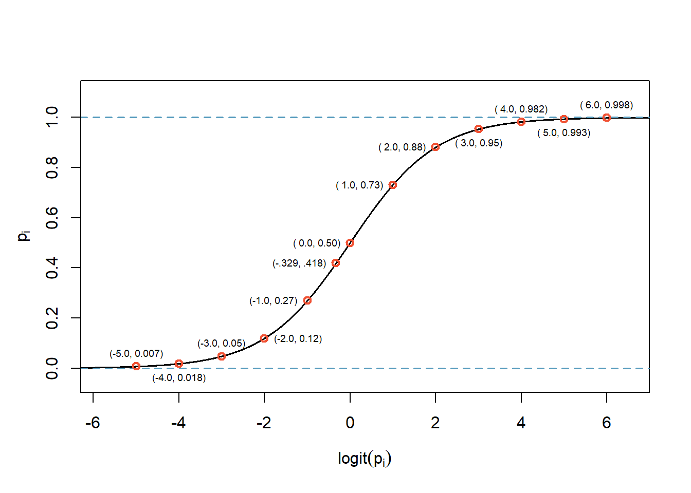

# Logistic Regression {#LOGREG}

## Objectives

1) Using `R`, conduct logistic regression and interpret the output and perform model selection.  
2) Write the logistic regression model and predict outputs for given inputs.  
3) Find confidence intervals for parameter estimates and predictions.  
4) Create and interpret a confusion matrix.  

## Logistic regression introduction

In this lesson we introduce **logistic regression** as a tool for building models when there is a categorical response variable with two levels. Logistic regression is a type of **generalized linear model** (GLM) for response variables where the assumptions of normally distributed errors is not appropriate. We are prepping you for advanced statistical models and machine learning, where we will explore predictive models of many different types of response variables including ones that don't assume an underlying functional relationship between inputs and outputs. So cool!

GLMs can be thought of as a two-stage modeling approach. We first model the response variable using a probability distribution, such as the binomial or Poisson distribution. Second, we model the parameter of the distribution using a collection of predictors and a special form of multiple regression.

To explore and explain these ideas, we will again use the Ebay auctions of a video game called **Mario Kart** for the Nintendo Wii. Remember, the data set is in the file `mariokart.csv` and includes results from 141 auctions.^[Diez DM, Barr CD, and \c{C}etinkaya-Rundel M. 2012. `openintro`: OpenIntro data sets and supplemental functions. http://cran.r-project.org/web/packages/openintro] 

In this chapter, we want the outcome variable of interest to be game condition, `cond`. In Chapter \@ref(LRMULTI) we used the total price of an auction as the response. We are moving from a quantitative response to a binary qualitative variable. If we were only interested in determining if an association exists between the variables `cond` and `total_pr`, we could use linear regression with `total_pr` as the response. However, in this problem we want to predict game condition. We will start by reviewing some of the previous models and then introduce logistic regression. We will finish with a multiple logistic regression model, more than one predictor. 

### Mario Kart data

Read the data and summarize. 


```r
mariokart <-read_csv("data/mariokart.csv", col_types = list(col_character()))
head(mariokart,n=10)
```

```
## # A tibble: 10 x 12
##    id        duration n_bids cond  start_pr ship_pr total_pr ship_sp seller_rate
##    <chr>        <dbl>  <dbl> <chr>    <dbl>   <dbl>    <dbl> <chr>         <dbl>
##  1 15037742~        3     20 new       0.99    4        51.6 standa~        1580
##  2 26048337~        7     13 used      0.99    3.99     37.0 firstC~         365
##  3 32043234~        3     16 new       0.99    3.5      45.5 firstC~         998
##  4 28040522~        3     18 new       0.99    0        44   standa~           7
##  5 17039222~        1     20 new       0.01    0        71   media           820
##  6 36019515~        3     19 new       0.99    4        45   standa~      270144
##  7 12047772~        1     13 used      0.01    0        37.0 standa~        7284
##  8 30035550~        1     15 new       1       2.99     54.0 upsGro~        4858
##  9 20039206~        3     29 used      0.99    4        47   priori~          27
## 10 33036416~        7      8 used     20.0     4        50   firstC~         201
## # ... with 3 more variables: stock_photo <chr>, wheels <dbl>, title <chr>
```


```r
inspect(mariokart)
```

```
## 
## categorical variables:  
##          name     class levels   n missing
## 1          id character    143 143       0
## 2        cond character      2 143       0
## 3     ship_sp character      8 143       0
## 4 stock_photo character      2 143       0
## 5       title character     80 142       1
##                                    distribution
## 1 110439174663 (0.7%) ...                      
## 2 used (58.7%), new (41.3%)                    
## 3 standard (23.1%), upsGround (21.7%) ...      
## 4 yes (73.4%), no (26.6%)                      
## 5  (%) ...                                     
## 
## quantitative variables:  
##             name   class   min      Q1 median      Q3       max         mean
## ...1    duration numeric  1.00   1.000    3.0    7.00     10.00     3.769231
## ...2      n_bids numeric  1.00  10.000   14.0   17.00     29.00    13.538462
## ...3    start_pr numeric  0.01   0.990    1.0   10.00     69.95     8.777203
## ...4     ship_pr numeric  0.00   0.000    3.0    4.00     25.51     3.143706
## ...5    total_pr numeric 28.98  41.175   46.5   53.99    326.51    49.880490
## ...6 seller_rate numeric  0.00 109.000  820.0 4858.00 270144.00 15898.419580
## ...7      wheels numeric  0.00   0.000    1.0    2.00      4.00     1.146853
##                sd   n missing
## ...1 2.585693e+00 143       0
## ...2 5.878786e+00 143       0
## ...3 1.506745e+01 143       0
## ...4 3.213179e+00 143       0
## ...5 2.568856e+01 143       0
## ...6 5.184032e+04 143       0
## ...7 8.471829e-01 143       0
```

We are again only interested in `total_pr`, `cond`, `stock_photo`, `duration`, and `wheels`. These variables are described in the following list:

1. `total_pr`: final auction price plus shipping costs, in US dollars  
2. `cond`: a two-level categorical factor variable  
3. `stock_photo`: a two-level categorical factor variable  
4. `duration`: the length of the auction, in days, taking values from 1 to 10  
5. `wheels`: the number of Wii wheels included with the auction (a **Wii wheel** is a plastic racing wheel that holds the Wii controller and is an optional but helpful accessory for playing Mario Kart) 

Remember that we removed a couple of outlier sales that included multiple items. Before we start let's clean up the data again to include removing those outliers.


```r
mariokart <- mariokart %>%
  filter(total_pr <= 100) %>% 
  mutate(cond=factor(cond),
         stock_photo=factor(stock_photo)) %>% 
  select(cond,stock_photo,total_pr,duration,wheels)
```

Next let's summarize the data.


```r
inspect(mariokart)
```

```
## 
## categorical variables:  
##          name  class levels   n missing
## 1        cond factor      2 141       0
## 2 stock_photo factor      2 141       0
##                                    distribution
## 1 used (58.2%), new (41.8%)                    
## 2 yes (74.5%), no (25.5%)                      
## 
## quantitative variables:  
##          name   class   min Q1 median    Q3 max      mean        sd   n missing
## ...1 total_pr numeric 28.98 41  46.03 53.99  75 47.431915 9.1136514 141       0
## ...2 duration numeric  1.00  1   3.00  7.00  10  3.751773 2.5888663 141       0
## ...3   wheels numeric  0.00  0   1.00  2.00   4  1.148936 0.8446146 141       0
```

### Analyzing contingency table  

As a review and introduction to logistic regression, let's analyze the relationship between game condition and stock photo. 


```r
tally(cond~stock_photo,data=mariokart
      ,margins = TRUE,format = "proportion")
```

```
##        stock_photo
## cond           no       yes
##   new   0.1111111 0.5238095
##   used  0.8888889 0.4761905
##   Total 1.0000000 1.0000000
```

We could analyze this by comparing the proportion of new condition games for each stock photo value using both randomization, empirical p-values, and the central limit theorem. We will just use an exact permutation test, **Fisher Exact Test**, which just uses the hypergeometric distribution.  


```r
fisher.test(tally(~cond+stock_photo,data=mariokart))
```

```
## 
## 	Fisher's Exact Test for Count Data
## 
## data:  tally(~cond + stock_photo, data = mariokart)
## p-value = 9.875e-06
## alternative hypothesis: true odds ratio is not equal to 1
## 95 percent confidence interval:
##  0.02766882 0.35763723
## sample estimates:
## odds ratio 
##  0.1152058
```
Clearly, these variables are not independent of each other. This model does not gives us much more information so let's move to logistic regression.  

### Modeling the probability of an event

The outcome variable for a GLM is denoted by $Y_i$, where the index $i$ is used to represent observation $i$. In the Mario Kart application, $Y_i$ will be used to represent whether the game condition $i$ is new ($Y_i=1$) or used ($Y_i=0$). 

The predictor variables are represented as follows: $x_{1,i}$ is the value of variable 1 for observation $i$, $x_{2,i}$ is the value of variable 2 for observation $i$, and so on.

Logistic regression is a generalized linear model where the outcome is a two-level categorical variable. The outcome, $Y_i$, takes the value 1 (in our application, this represents a game in new condition but we could easily switch and make the outcome of interest a used game) with probability $p_i$ and the value 0 with probability $1-p_i$. It is the probability $p_i$ that we model in relation to the predictor variables.

The logistic regression model relates the probability a game is new ($p_i$) to values of the predictors $x_{1,i}$, $x_{2,i}$, ..., $x_{k,i}$ through a framework much like that of multiple regression:

$$
\text{transformation}(p_{i}) = \beta_0 + \beta_1x_{1,i} + \beta_2 x_{2,i} + \cdots \beta_k x_{k,i}
$$ 

We want to choose a transformation that makes practical and mathematical sense. For example, we want a transformation that makes the range of possibilities on the left hand side of the above equation equal to the range of possibilities for the right hand side. If there was no transformation for this equation, the left hand side could only take values between 0 and 1, but the right hand side could take values outside of this range. A common transformation for $p_i$ is the **logit transformation**, which may be written as

$$
\text{logit}(p_i) = \log_{e}\left( \frac{p_i}{1-p_i} \right)
$$  

Below, we expand the equation using the logit transformation of $p_i$:

$$
\log_{e}\left( \frac{p_i}{1-p_i} \right)
	= \beta_0 + \beta_1 x_{1,i} + \beta_2 x_{2,i} + \cdots + \beta_k x_{k,i}
$$  

Solving for $p_i$ we get the logistic function:

$$
p_i 	= \frac{1}{1+e^{-(\beta_0 + \beta_1 x_{1,i} + \beta_2 x_{2,i} + \cdots + \beta_k x_{k,i})}}
$$

The logistic function is shown in Figure \@ref(fig:logit-fig). 

<div class="figure">

<p class="caption">(\#fig:logit-fig)Logitstic function with some example points plotted.</p>
</div>

Notice the output of the `logistic` function restricts the values between 0 and 1. The curve is fairly flat on the edges with a sharp rise in the center. There are other functions that achieve this same result. However, for reasons beyond the scope of this book, the logit function has desirable mathematical properties that relate to making sure all the common GLMs fall within the exponential family of distributions. This topic is at the graduate school level and not needed for our studies. 

In our Mario Kart example, there are 4 predictor variables, so $k = 4$. This nonlinear model isn't very intuitive, but it still has some resemblance to multiple regression, and we can fit this model using software. In fact, once we look at results from software, it will start to feel like we're back in multiple regression, even if the interpretation of the coefficients is more complex.

### First model - intercept only

Here we create a model with just an intercept.  

In `R` we use the `glm()` function to fit a logistic regression model. It has the same formula format as `lm` but also requires a `family` argument. Since our response is binary, we use `binomial`. If we wanted to use `glm()` for linear regression assuming normally distributed residual, the family argument would be `gaussian`. This implies that multiple linear regression with the assumption of normally distributed errors is a special case of a generalized linear model. In `R`, the response is a 0/1 variable, we can control the outcome of interest, the 1, by using a logical argument in the formula.

First to understand the output of logistic regression, let's just run a model with an intercept term. Notice in the code chunk that the left hand side of the formula has a logical argument, this gives a 0/1 output with 1 being the value we want to predict.


```r
mario_mod1 <- glm(cond=="new"~1,data=mariokart,
                 family="binomial")
```

Let's get regression output using the `summary()` function.  


```r
summary(mario_mod1)
```

```
## 
## Call:
## glm(formula = cond == "new" ~ 1, family = "binomial", data = mariokart)
## 
## Deviance Residuals: 
##    Min      1Q  Median      3Q     Max  
## -1.041  -1.041  -1.041   1.320   1.320  
## 
## Coefficients:
##             Estimate Std. Error z value Pr(>|z|)  
## (Intercept)  -0.3292     0.1707  -1.928   0.0538 .
## ---
## Signif. codes:  0 '***' 0.001 '**' 0.01 '*' 0.05 '.' 0.1 ' ' 1
## 
## (Dispersion parameter for binomial family taken to be 1)
## 
##     Null deviance: 191.7  on 140  degrees of freedom
## Residual deviance: 191.7  on 140  degrees of freedom
## AIC: 193.7
## 
## Number of Fisher Scoring iterations: 4
```

This looks similar to the regression output we saw in previous chapters. However, the model has a different, nonlinear, form. Remember, Equation \@ref(eq:logistic) is the general form of the model.

\begin{equation} 
  \log_{e}\left( \frac{p_i}{1-p_i} \right)
	= \beta_0 + \beta_1 x_{1,i} + \beta_2 x_{2,i} + \cdots + \beta_k x_{k,i}
  (\#eq:logistic)
\end{equation} 

Thus using the output of `R`, Equation \@ref(eq:logistic2) is the estimated model.

\begin{equation}
\log\left( \frac{p_i}{1-p_i} \right) = -0.329 
  (\#eq:logistic2)
\end{equation} 

Solving Equation \@ref(eq:logistic2) for $p_i$: $\frac{e^{-0.329}}{1 + e^{-0.329}} = 0.418$. This is the estimated probability of the game condition being new. This point is plotted in Figure \@ref(fig:logit-fig). We can also check this result using a summary table.


```r
tally(~cond,data=mariokart,format="proportion")
```

```
## cond
##       new      used 
## 0.4184397 0.5815603
```


### Second model - stock_photo

Now that we are starting to understand the logistic regression model. Let's add a predictor variable, `stock_photo`. Again, we have many methods to determine if a relationship between two categorical variables exists, logistic regression is another method. 


```r
mario_mod2 <- glm(cond=="new"~stock_photo,data=mariokart,
                 family="binomial")
```


```r
summary(mario_mod2)
```

```
## 
## Call:
## glm(formula = cond == "new" ~ stock_photo, family = "binomial", 
##     data = mariokart)
## 
## Deviance Residuals: 
##     Min       1Q   Median       3Q      Max  
## -1.2181  -1.2181  -0.4854   1.1372   2.0963  
## 
## Coefficients:
##                Estimate Std. Error z value Pr(>|z|)    
## (Intercept)     -2.0794     0.5303  -3.921 8.81e-05 ***
## stock_photoyes   2.1748     0.5652   3.848 0.000119 ***
## ---
## Signif. codes:  0 '***' 0.001 '**' 0.01 '*' 0.05 '.' 0.1 ' ' 1
## 
## (Dispersion parameter for binomial family taken to be 1)
## 
##     Null deviance: 191.70  on 140  degrees of freedom
## Residual deviance: 170.44  on 139  degrees of freedom
## AIC: 174.44
## 
## Number of Fisher Scoring iterations: 4
```

Examining the **p-value** associated with the coefficient for `stock_photo`, we can see that it is significant. Thus we reject the null hypothesis that the coefficient is zero. There is a relationship between `cond` and `stock_photo`, as we found with the Fisher's test.

We can use the **broom** package to summarize the output and generate model fits.


```r
tidy(mario_mod2)
```

```
## # A tibble: 2 x 5
##   term           estimate std.error statistic   p.value
##   <chr>             <dbl>     <dbl>     <dbl>     <dbl>
## 1 (Intercept)       -2.08     0.530     -3.92 0.0000881
## 2 stock_photoyes     2.17     0.565      3.85 0.000119
```

Let's convert these coefficients to estimated probabilities using the `augment()` function. We need to specify the output as the *response*, this returns a probability, or else we will get the logit of the probability, the link value.


```r
augment(mario_mod2,
        newdata=tibble(stock_photo=c("yes","no")),
        type.predict="response")
```

```
## # A tibble: 2 x 2
##   stock_photo .fitted
##   <chr>         <dbl>
## 1 yes           0.524
## 2 no            0.111
```

These are the conditional probability of a new condition based on status of `stock_photo`. We can see this using the `tally()` function.


```r
tally(cond~stock_photo,data=mariokart,margins = TRUE,format="proportion")
```

```
##        stock_photo
## cond           no       yes
##   new   0.1111111 0.5238095
##   used  0.8888889 0.4761905
##   Total 1.0000000 1.0000000
```

Or from the model coefficients.


```r
exp(-2.079442)/(1+exp(-2.079442))
```

```
## [1] 0.1111111
```

```r
exp(-2.079442+2.174752)/(1+exp(-2.079442+2.174752))
```

```
## [1] 0.5238095
```

> **Exercise**: 
Fit a logistic regression model with `cond` as used and `stock_photo` as a predictor.

We repeat the code from above.


```r
mario_mod3 <- glm(cond=="used"~stock_photo,data=mariokart,
                 family="binomial")
```


```r
tidy(mario_mod3)
```

```
## # A tibble: 2 x 5
##   term           estimate std.error statistic   p.value
##   <chr>             <dbl>     <dbl>     <dbl>     <dbl>
## 1 (Intercept)        2.08     0.530      3.92 0.0000881
## 2 stock_photoyes    -2.17     0.565     -3.85 0.000119
```

Again, let's convert these coefficients to estimated probabilities using the `augment()` function. 


```r
augment(mario_mod3,
        newdata=tibble(stock_photo=c("yes","no")),
        type.predict="response")
```

```
## # A tibble: 2 x 2
##   stock_photo .fitted
##   <chr>         <dbl>
## 1 yes           0.476
## 2 no            0.889
```

This matches the output from the `tally()` function we observed above.  

Notice that it was not important whether we select new or used condition as the desired outcome. In either case, the logistic regression model returns the conditional probability given the value of the predictor.  

### Interpreting the coefficients  

At this point it seems that we created a great deal of work just to get the same results that we had from other methods. However, the logistic regression model allows us to add other predictors and it also gives us standard errors for the parameter estimates.  

Let's first discuss the interpretation of coefficients. As a reminder, the fitted coefficients are reported from the model summary.  


```r
tidy(mario_mod2)
```

```
## # A tibble: 2 x 5
##   term           estimate std.error statistic   p.value
##   <chr>             <dbl>     <dbl>     <dbl>     <dbl>
## 1 (Intercept)       -2.08     0.530     -3.92 0.0000881
## 2 stock_photoyes     2.17     0.565      3.85 0.000119
```

The variable `stock_photo` takes on the values 0 and 1, the value 1 of indicates the sale had a stock photo. The logistic regression model we are fitting is Equation \@ref(eq:logistic4).


\begin{equation} 
  \log_{e}\left( \frac{p_{new}}{1-p_{new}} \right)
	= \beta_0 + \beta_1 \mbox{stock_photo}  
  (\#eq:logistic4)
\end{equation} 

If the photo is not a stock photo then the model is Equation \@ref(eq:logistic5). The left-hand side is the natural logarithm of the odds, where odds are the ratio of the probability of success divided by the probability of failure.   
$$
\log_{e}\left( \frac{p_{\mbox{new|stock photo}}}{1-p_{\mbox{new|stock photo}}} \right)
	= \beta_0 + \beta_1   
$$

\begin{equation} 
  \log_{e}\left( \frac{p_{\mbox{new|no stock photo}}}{1-p_{\mbox{new|no stock photo}}} \right)
	= \beta_0   
  (\#eq:logistic5)
\end{equation} 

If we have a stock photo, the variable `stock_photo` is 1. Then Equation \@ref(eq:logistic6) is the resulting model.

\begin{equation} 
 \log_{e}\left( \frac{p_{\mbox{new|stock photo}}}{1-p_{\mbox{new|stock photo}}} \right)
	= \beta_0 + \beta_1   
  (\#eq:logistic6)
\end{equation} 

Thus the difference of these gives an interpretation of the $\beta_1$ coefficient, it is the log odds ratio as is shown in the derivation that follows.  

$$
\log_{e}\left( \frac{p_{\mbox{new|stock photo}}}{1-p_{\mbox{new|stock photo}}} \right) 
- 
\log_{e}\left( \frac{p_{\mbox{new|no stock photo}}}{1-p_{\mbox{new|no stock photo}}} \right) = \beta_1 
$$
$$
\log_{e}\left(\frac{\frac{p_{\mbox{new|stock photo}}}{1-p_{\mbox{new|stock photo}}}}{\frac{p_{\mbox{new|no stock photo}}}{1-p_{\mbox{new|no stock photo}}}} \right) 
 = \beta_1 
$$

For our problem, the log odds more than double if the photo is a stock photo. It is easier to interpret odds ratios, so often analysts use $e^{\beta_1}$ as the odds ratio. Again, for our problem, the odds of a new condition game increase by a factor of 8.8 if a stock photo is used. Note that an odds ratio is not a relative risk. Relative risk is the ratio of the probability of a new game with stock photo to the probability of a new game without a stock photo. Be careful in your interpretation.

$$
\text{Relative Risk} = \left(\frac{p_{\mbox{new|stock photo}}}{p_{\mbox{new|no stock photo}}} \right) 
$$

### Comparing models  

Just as is the case for linear regression, we can compare nested models. When we examine the output of model there is a line with the **residual deviance**. This model is not fit using least squares but using maximum likelihood. Deviance is 2 times the negative of the log likelihood. We negate the log likelihood so that maximizing the log likelihood is equivalent to minimizing the negation. This allows the same thought process of minimizing deviance as we had for minimizing residual sum of squares. The multiplication by 2 is because an asymptotic argument shows that 2 times the negative log likelihood is approximately distributed as a Chi-square random variable. 


```r
summary(mario_mod2)
```

```
## 
## Call:
## glm(formula = cond == "new" ~ stock_photo, family = "binomial", 
##     data = mariokart)
## 
## Deviance Residuals: 
##     Min       1Q   Median       3Q      Max  
## -1.2181  -1.2181  -0.4854   1.1372   2.0963  
## 
## Coefficients:
##                Estimate Std. Error z value Pr(>|z|)    
## (Intercept)     -2.0794     0.5303  -3.921 8.81e-05 ***
## stock_photoyes   2.1748     0.5652   3.848 0.000119 ***
## ---
## Signif. codes:  0 '***' 0.001 '**' 0.01 '*' 0.05 '.' 0.1 ' ' 1
## 
## (Dispersion parameter for binomial family taken to be 1)
## 
##     Null deviance: 191.70  on 140  degrees of freedom
## Residual deviance: 170.44  on 139  degrees of freedom
## AIC: 174.44
## 
## Number of Fisher Scoring iterations: 4
```

Similar to linear regression, we can use the `anova()` function to compare nested models. 


```r
anova(mario_mod1,mario_mod2,test="Chisq")
```

```
## Analysis of Deviance Table
## 
## Model 1: cond == "new" ~ 1
## Model 2: cond == "new" ~ stock_photo
##   Resid. Df Resid. Dev Df Deviance Pr(>Chi)    
## 1       140     191.70                         
## 2       139     170.44  1    21.26 4.01e-06 ***
## ---
## Signif. codes:  0 '***' 0.001 '**' 0.01 '*' 0.05 '.' 0.1 ' ' 1
```

Adding, `stock_photo` is a statistically significant result. The p-value is different from the `summary()` function, because it assumes the coefficient follows a normal distribution. Different assumptions, but the same conclusion.   

The use of p-value to pick a best model uses statistical assumptions to select the features. Another approach is to use a predictive measure. In machine learning contexts, we use many different predictive performance measures for model selection but many are based on a **confusion matrix**.  

A confusion matrix generates a 2 by 2 matrix of predicted outcomes versus actual outcomes. For logistic regression, the output is a probability of success. To convert this to 0/1 outcome we pick a threshold. It is common to use 0.5 as the threshold. Probabilities above 0.5 are considered a success, in the context of our problem a new game. Let's generate the confusion matrix.


```r
augment(mario_mod2,type.predict = "response") %>%
  rename(actual=starts_with('cond')) %>%
  transmute(result=as.integer(.fitted>0.5),
            actual=as.integer(actual)) %>%
  table()
```

```
##       actual
## result  0  1
##      0 32  4
##      1 50 55
```

One single number summary metric is accuracy. In this case the model was correct on $32 + 55$ out of the 141 cases, or 61.7% are correct.

This looks like the same table we get comparing `cond` to `stock_photo`. This is the case because of the binary nature of the predictor. We only have two probability values in our prediction. 


```r
tally(~cond+stock_photo,data=mariokart)
```

```
##       stock_photo
## cond   no yes
##   new   4  55
##   used 32  50
```

If we change the threshold we get a different accuracy. In a machine learning course, we learn about other metrics such as area under the ROC curve. Back to our problem, let's add another variable to see if we can improve the model.  

## Multiple logistic regression  

Let's add `total_pr` to the model. This model is something that we could not have done in the previous models we learned about.  


```r
mario_mod4 <- glm(cond=="new"~stock_photo+total_pr,
                  data=mariokart,
                 family="binomial")
```

Notice that we use the same formula syntax as we had done with linear regression. 


```r
summary(mario_mod4)
```

```
## 
## Call:
## glm(formula = cond == "new" ~ stock_photo + total_pr, family = "binomial", 
##     data = mariokart)
## 
## Deviance Residuals: 
##     Min       1Q   Median       3Q      Max  
## -2.3699  -0.6479  -0.2358   0.6532   2.5794  
## 
## Coefficients:
##                 Estimate Std. Error z value Pr(>|z|)    
## (Intercept)    -11.31951    1.88333  -6.010 1.85e-09 ***
## stock_photoyes   2.11633    0.68551   3.087  0.00202 ** 
## total_pr         0.19348    0.03562   5.431 5.60e-08 ***
## ---
## Signif. codes:  0 '***' 0.001 '**' 0.01 '*' 0.05 '.' 0.1 ' ' 1
## 
## (Dispersion parameter for binomial family taken to be 1)
## 
##     Null deviance: 191.70  on 140  degrees of freedom
## Residual deviance: 119.21  on 138  degrees of freedom
## AIC: 125.21
## 
## Number of Fisher Scoring iterations: 5
```
From the summary, both `stock_photo` and `total_pr` are statistically significant.  

> **Exercise**:  
Interpret the coefficient associated with the predictor `total_pr`. 

For one dollar increase in total price of the auction, the odds ratio increases by $exp(\beta_2)$, 1.21, for a given condition of the stock photo variable.  

This is similar to an interpretation we had for multiple linear regression. We had to specify that the other predictors are held constant and then we increased the variable of interest by one unit.     

Besides using individual predictor p-values to assess the model, can also use a confusion matrix.


```r
augment(mario_mod4,type.predict = "response") %>%
  rename(actual=starts_with('cond')) %>%
  transmute(result=as.integer(.fitted>0.5),
            actual=as.integer(actual)) %>%
  table()
```

```
##       actual
## result  0  1
##      0 71 16
##      1 11 43
```
For our new model, the accuracy improved to $71 + 43$ out of the 141 cases, or 80.9.7%. Without a measure of variability, we don't know if this is significant improvement or just the variability in the modeling procedure. On the surface, it appears to be an improvement.    

As we experiment to improve the model, let's use a quadratic term in our model.


```r
mario_mod5 <- glm(cond=="new"~stock_photo+poly(total_pr,2),
                  data=mariokart,
                 family="binomial")
```

Using the individual p-values, it appears that a quadratic term is significant but it is marginal. 


```r
summary(mario_mod5)
```

```
## 
## Call:
## glm(formula = cond == "new" ~ stock_photo + poly(total_pr, 2), 
##     family = "binomial", data = mariokart)
## 
## Deviance Residuals: 
##     Min       1Q   Median       3Q      Max  
## -2.1555  -0.6511  -0.1200   0.5987   2.6760  
## 
## Coefficients:
##                    Estimate Std. Error z value Pr(>|z|)    
## (Intercept)         -2.4407     0.6347  -3.845  0.00012 ***
## stock_photoyes       2.0411     0.6494   3.143  0.00167 ** 
## poly(total_pr, 2)1  23.7534     4.5697   5.198 2.01e-07 ***
## poly(total_pr, 2)2  -9.9724     4.1999  -2.374  0.01758 *  
## ---
## Signif. codes:  0 '***' 0.001 '**' 0.01 '*' 0.05 '.' 0.1 ' ' 1
## 
## (Dispersion parameter for binomial family taken to be 1)
## 
##     Null deviance: 191.70  on 140  degrees of freedom
## Residual deviance: 114.05  on 137  degrees of freedom
## AIC: 122.05
## 
## Number of Fisher Scoring iterations: 6
```

We get a similar result if we use the `anova()` function.  


```r
anova(mario_mod4,mario_mod5,test="Chi")
```

```
## Analysis of Deviance Table
## 
## Model 1: cond == "new" ~ stock_photo + total_pr
## Model 2: cond == "new" ~ stock_photo + poly(total_pr, 2)
##   Resid. Df Resid. Dev Df Deviance Pr(>Chi)  
## 1       138     119.21                       
## 2       137     114.05  1   5.1687    0.023 *
## ---
## Signif. codes:  0 '***' 0.001 '**' 0.01 '*' 0.05 '.' 0.1 ' ' 1
```

Finally, the confusion matrix results in a slight improvement in accuracy to 82.3%.


```r
augment(mario_mod5,type.predict = "response") %>%
  rename(actual=starts_with('cond')) %>%
  transmute(result=as.integer(.fitted>0.5),
            actual=as.integer(actual)) %>%
  table()
```

```
##       actual
## result  0  1
##      0 69 12
##      1 13 47
```


Almost any classifier will have some error. In the model above, we have decided that it is okay to allow up to 9\%, 13 out of 141, of the games for sale to be classified as new when they are really used. If we wanted to make it a little harder to classify an item as new, we could use a cutoff, threshold, of 0.75. This would have two effects. Because it raises the standard for what can be classified as new, it reduces the number of used games that are classified as new. However, it will also fail to correctly classify an increased fraction of new games as new, see the code below. No matter the complexity and the confidence we might have in our model, these practical considerations are absolutely crucial to making a helpful classification model. Without them, we could actually do more harm than good by using our statistical model. This tradeoff is similar to the one we found between Type 1 and Type 2 errors. Notice that the accuracy has also dropped slightly.  


```r
augment(mario_mod5,type.predict = "response") %>%
  rename(actual=starts_with('cond')) %>%
  transmute(result=as.integer(.fitted>0.75),
            actual=as.integer(actual)) %>%
  table()
```

```
##       actual
## result  0  1
##      0 78 22
##      1  4 37
```

In a machine learning course, we learn about better methods to assess predictive accuracy as well as more sophisticated methods to transform and adapt our predictor variables.  

> **Exercise** Find the probability that an auctioned game is new if the total price is 50 and it uses a stock photo.  

It is not clear how to use the coefficients in the regression output since `R` is performing a transformation on `total_pr` variable. Let's approach this in two ways. First we will use the `augment()` function to do the hard work.


```r
augment(mario_mod5,
        newdata = tibble(stock_photo="yes",total_pr=50),
        type.predict = "response")
```

```
## # A tibble: 1 x 3
##   stock_photo total_pr .fitted
##   <chr>          <dbl>   <dbl>
## 1 yes               50   0.693
```

We predict that the probability of the game being new if it uses a stock photo and the total price is 50 is 69.3%.

If we want to recreate the calculation, we need to use a **raw** polynomial.  


```r
mario_mod6 <- glm(cond=="new"~stock_photo+total_pr+I(total_pr^2),
                  data=mariokart,
                 family="binomial")
tidy(mario_mod6)
```

```
## # A tibble: 4 x 5
##   term            estimate std.error statistic  p.value
##   <chr>              <dbl>     <dbl>     <dbl>    <dbl>
## 1 (Intercept)    -30.7       9.08        -3.38 0.000732
## 2 stock_photoyes   2.04      0.649        3.14 0.00167 
## 3 total_pr         0.969     0.343        2.83 0.00470 
## 4 I(total_pr^2)   -0.00760   0.00320     -2.37 0.0176
```
We can calculate the link as a linear combination, an inner product of coefficients and values.

$$
-30.67 + 2.04 + 0.969 * 50 -0.007*50^2 = 0.814
$$

```r
tidy(mario_mod6) %>%
  select(estimate) %>% 
  pull() %*% c(1,1,50,50^2)
```

```
##           [,1]
## [1,] 0.8140013
```

Using the inverse transform of the logit function, we find the probability of the game being new given the predictor values.

$$
\frac{\ e^{.814}\ }{\ 1\ +\ e^{.814}\ } = 0.693
$$ 


```r
exp(.814)/(1+exp(.814))
```

```
## [1] 0.6929612
```

### Diagnostics for logistic regression

The assumptions for logistic regression and the diagnostic tools are similar to what we found for linear regression. However, with the binary nature of the outcome, we often need large data sets to check. We will not devote much time to performing diagnostics for logistic regression because we are interested in using it as a predictive model. The assumptions are: 

1. Each predictor $x_i$ is linearly related to logit$(p_i)$ if all other predictors are held constant. This is similar to our linear fit diagnostic in linear multiple regression.  
2. Each outcome $Y_i$ is independent of the other outcomes.  
3. There are no influential data points.  
4. Multicollinearity is minimal.  

## Confidence intervals  

In this section we will generate confidence intervals. This section is experimental since we are not sure how `do()` from the **mosaic** package will work with the `glm()` function, but let's experiment.  

### Confidence intervals for a parameter

First, let's use the `R` built-in function `confint()` to find the confidence interval for the simple logistic regression model coefficients.


```r
confint(mario_mod4)
```

```
## Waiting for profiling to be done...
```

```
##                      2.5 %     97.5 %
## (Intercept)    -15.4048022 -7.9648042
## stock_photoyes   0.8888216  3.6268545
## total_pr         0.1297024  0.2705395
```

These are not symmetric around the estimate because the method is using a profile-likelihood method. We can get symmetric intervals based on the central limit theorem using the function `confint.default()`. 


```r
confint.default(mario_mod4)
```

```
##                      2.5 %     97.5 %
## (Intercept)    -15.0107641 -7.6282654
## stock_photoyes   0.7727450  3.4599054
## total_pr         0.1236583  0.2632982
```

These results are close. We recommend using the profile-likelihood method. 

Now, let's work with the `do()` function to determine if we can get similar results.


```r
do(1)*mario_mod4
```

```
##   Intercept stock_photoyes  total_pr .row .index
## 1 -11.31951       2.116325 0.1934783    1      1
```


```r
tidy(mario_mod4)
```

```
## # A tibble: 3 x 5
##   term           estimate std.error statistic       p.value
##   <chr>             <dbl>     <dbl>     <dbl>         <dbl>
## 1 (Intercept)     -11.3      1.88       -6.01 0.00000000185
## 2 stock_photoyes    2.12     0.686       3.09 0.00202      
## 3 total_pr          0.193    0.0356      5.43 0.0000000560
```

It looks like `do()` is performing as expected. Let's now perform one resample to see what happens.


```r
do(1)*glm(cond=="new"~stock_photo+total_pr,
                  data=resample(mariokart),
                 family="binomial")
```

```
##   Intercept stock_photoyes  total_pr .row .index
## 1 -11.05487       1.058763 0.2046713    1      1
```

Again, it looks like what we expect. Now let's bootstrap the coefficients and summarize the results.


```r
set.seed(5011)
results <- do(1000)*glm(cond=="new"~stock_photo+total_pr,
                  data=resample(mariokart),
                 family="binomial")
```

```
## Warning: glm.fit: fitted probabilities numerically 0 or 1 occurred
```


```r
head(results)
```

```
##   Intercept stock_photoyes  total_pr .row .index
## 1 -11.22155       1.665492 0.1986654    1      1
## 2 -13.25708       1.889510 0.2371109    1      2
## 3 -11.54544       2.871460 0.1867757    1      3
## 4 -19.25785       5.816050 0.2829247    1      4
## 5 -10.86631       3.255767 0.1672335    1      5
## 6 -13.62425       1.842765 0.2533934    1      6
```

Now we will plot the bootstrap sampling distribution on the  parameter associated with `total_pr`.


```r
results %>%
  gf_histogram(~total_pr,fill="cyan",color = "black") %>%
  gf_theme(theme_bw()) %>%
  gf_labs(title="Bootstrap sampling distribtuion",
          x="total price paramater estimate")
```


The printout from the logistic regression model assumes normality for the sampling distribution of the `total_pr` coefficient, but it appears to be positively skewed, skewed to the right. The 95% confidence interval found using `cdata()`. 


```r
cdata(~total_pr,data=results)
```

```
##          lower     upper central.p
## 2.5% 0.1388783 0.3082659      0.95
```

This result is closer to the result from profile-likelihood. Since the interval does not include the value of zero, we can be 95% confident that it is not zero. This is close to what we found using the `R` function `confint()`.

### Confidence intervals for probability of success

We can use the results from the bootstrap to get a confidence interval on probability of success. We will calculate a confidence for a game with a stock photo and total price of $50. As a reminder, the probability of the game being new is 0.69. 


```r
augment(mario_mod5,
        newdata = tibble(stock_photo="yes",total_pr=50),
        type.predict = "response")
```

```
## # A tibble: 1 x 3
##   stock_photo total_pr .fitted
##   <chr>          <dbl>   <dbl>
## 1 yes               50   0.693
```

The key is to use the coefficient from each resampled data set to calculate a probability of success. 


```r
head(results)
```

```
##   Intercept stock_photoyes  total_pr .row .index
## 1 -11.22155       1.665492 0.1986654    1      1
## 2 -13.25708       1.889510 0.2371109    1      2
## 3 -11.54544       2.871460 0.1867757    1      3
## 4 -19.25785       5.816050 0.2829247    1      4
## 5 -10.86631       3.255767 0.1672335    1      5
## 6 -13.62425       1.842765 0.2533934    1      6
```


```r
results_pred <- results %>% 
  mutate(pred=1/(1+exp(-1*(Intercept+stock_photoyes+50*total_pr))))
```


```r
cdata(~pred,data=results_pred)
```

```
##        lower     upper central.p
## 2.5% 0.50388 0.7445598      0.95
```

We are 95% confident that expected probability a game with a stock photo and a total price of $50 is between 50.4\% and 74.4\%.


## Summary  

In this chapter, we learned how to extend linear models to outcomes that are binary. We built and interpreted models. We also used resampling to find confidence intervals. 

## Homework Problems

1. Possum classification 

Let's investigate the `possum` data set again. This time we want to model a binary outcome variable. As a reminder, the common brushtail possum of the Australia region is a bit cuter than its distant cousin, the American opossum. We consider 104 brushtail possums from two regions in Australia, where the possums may be considered a random sample from the population. The first region is Victoria, which is in the eastern half of Australia and traverses the southern coast. The second region consists of New South Wales and Queensland, which make up eastern and northeastern Australia.

We use logistic regression to differentiate between possums in these two regions. The outcome variable, called `pop`, takes value `Vic` when a possum is from Victoria and `other` when it is from New South Wales or Queensland. We consider five predictors: `sex`, `head_l`, `skull_w`, `total_l`, and `tail_l`. 

a. Explore the data by making histograms or boxplots of the quantitative variables, and bar charts of the discrete variables.   
Are there any outliers that are likely to have a very large influence on the logistic regression model?  
b. Build a logistic regression model with all the variables. Report a summary of the model.  
c. Using the p-values decide if you want to remove a variable(s) and if so build that model.  
d. For any variable you decide to remove, build a 95% confidence interval for the parameter.  
e. Explain why the remaining parameter estimates change between the two models.  
f. Write out the form of the model. Also identify which of the following variables are positively associated (when controlling for other variables) with a possum being from Victoria: `head_l`, `skull_w`, `total_l`, and `tail_l`.  
g. Suppose we see a brushtail possum at a zoo in the US, and a sign says the possum had been captured in the wild in Australia, but it doesn't say which part of Australia. However, the sign does indicate that the possum is male, its skull is about 63 mm wide, its tail is 37 cm long, and its total length is 83 cm. What is the reduced model's computed probability that this possum is from Victoria? How confident are you in the model's accuracy of this probability calculation?

2. Medical school admission

The file `MedGPA.csv` in the `data` folder has information on medical school admission status and GPA and standardized test scores gathered on 55 medical school applicants from a liberal arts college in the Midwest.

The variables are:

`Accept Status`: A=accepted to medical school or D=denied admission  
`Acceptance`:	Indicator for Accept: 1=accepted or 0=denied  
`Sex`: F=female or M=male  
`BCPM`:	Bio/Chem/Physics/Math grade point average  
`GPA`:	College grade point average  
`VR`:	Verbal reasoning (subscore)  
`PS`:	Physical sciences (subscore)  
`WS`:	Writing sample (subcore)  
`BS`:	Biological sciences (subscore)  
`MCAT`:	Score on the MCAT exam (sum of CR+PS+WS+BS)  
`Apps`:	Number of medical schools applied to  

a. Build a logistic regression model to predict if a student where denied admission from `GPA` and `Sex`.  
b. Generate a 95% confidence interval for the coefficient associated with `GPA`.  
c. Fit a model with a polynomial of degree 2 in the `GPA`. Drop `Sex` from the model.  Does a quadratic fit improve the model?   
d. Fit a model with just `GPA` and interpret the coefficient.  
e. Try to add different predictors to come up with your best model.  
f. Generate a confusion matrix for the best model you have developed.  
g. Find a 95% confidence interval for the probability a female student with a 3.5 GPA, a `BCPM` of 3.8, a verbal reasoning score of 10, a physical sciences score of 9, a writing sample score of 8, a biological score of 10, a MCAT score of 40, and who applied to 5 medical schools.  


