--- 
title: "Computational Probability and Statistics"
author: 
- Matthew Davis
- Brianna Hitt
- Ken Horton
- Bradley Warner
date: "2022-06-14"
header-includes:
   - \usepackage{multirow}
   - \usepackage{multicol}
site: bookdown::bookdown_site
documentclass: book
bibliography: [book.bib, packages.bib]
biblio-style: apalike
link-citations: yes
cover-image: "figures/Cover.png"
description: "This is a set of notes used for Math 377 starting in the fall of 2020 that has been compiled into a book."
---

\input{latex/math-definitions.tex}

# Preface {-}


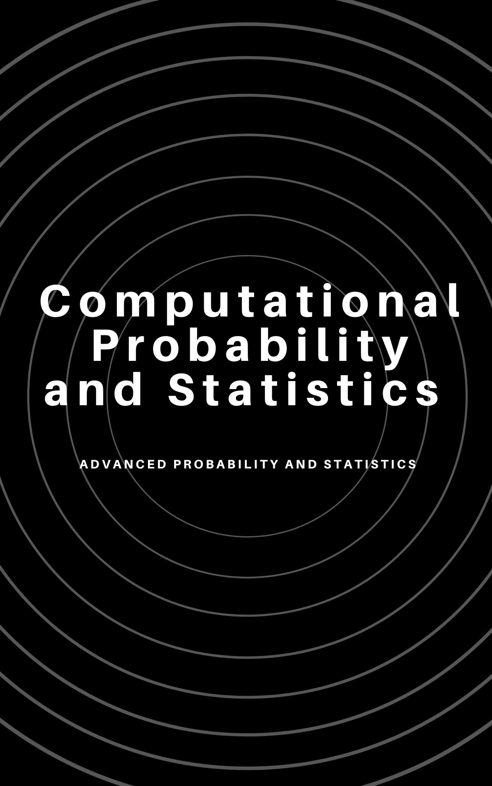
  

This book is based on the notes we created for our students as part of a one semester course on probability and statistics. We developed these notes from three primary resources. The most important is the Openintro Introductory Statistics with Randomization and Simulation [@ointrorand] book. In parts, we have used their notes and homework problems. However, in most cases we have altered their work to fit our needs. The second most important book for our work is Introduction to Probability and Statistics Using R [@ipsur]. Finally, we have used some examples, code, and ideas from the first addition of Prium's book Foundations and Applications of Statistics: An Introduction Using R [@pruim2011foundations].  

## Who is this book for?

We designed this book for study of statistics that maximizes computational ideas while minimizing algebraic symbol manipulation. Although we do discuss traditional small-sample, normal-based inference and some of the classical probability distributions, we rely heavily on ideas such as simulation, permutations, and bootstrap. This means that students with a background in differential and integral calculus will be successful with this book. 

The book makes extensive using of the `R` programming language. In particular we focus both on the **tidyverse** and **mosaic** packages. We include a significant amount of code in our notes and frequently demonstrate multiple ways of completing a task. We have used this book for juniors and sophomores.

## Book structure and how to use it

This book is divided into 4 parts. Each part starts with a case study that introduces many of the main ideas of each part. Each chapter is designed to be a standalone 50 minute lesson. Within each lesson, we give exercises that can be worked in class and we provide learning objectives. 

This book assumes students have access to `R`. Finally, we keep the number of homework problems to a reasonable level and assign all problems.

The four parts of the book are:

1. Descriptive Statistical Modeling: This part introduces the student to data collection methods, summary statistics, visual summaries, and exploratory data analysis. 

2. Probability: We discuss the foundational ideas of probability, counting methods, and common distributions. We use both calculus and simulation to find moments and probabilities. We introduce basic ideas of multivariate probability. We include method of moments and maximum likelihood estimators.

3. Statistical Inference: We discuss many of the basic inference ideas found in a traditional introductory statistics class but we add ideas of bootstrap and permutation methods. 

4. Statistical Prediction: The final part introduces prediction methods mainly in the form of linear regression. This part also includes inference for regression.


The learning outcomes for this course are to use computational and mathematical statistical/probabilistic concepts for:

a.	Developing probabilistic models 
b.	Developing statistical models for description, inference, and prediction  
c.	Advancing practical and theoretical analytic experience and skills


## Prerequisites

To take this course, students are expected to have completed calculus up through and including integral calculus. We do have multivariate ideas in the course but they are easily taught and don't require calculus III.  We don't assume the students have any programming experience and thus, we include a great deal of code. We have historically supplemented the course with [Data Camp](http://datacamp.com/) courses. We have also used [RStudio Cloud](http://rstudio.cloud) to help students get started without the burden of loading and maintaining software.

## Packages

These notes make use of the following packages in `R`: **knitr** [@R-knitr], **rmarkdown** [@R-rmarkdown], **mosaic** [@R-mosaic], **mosaicCalc** [@R-mosaicCalc], **tidyverse** [@R-tidyverse], **ISLR** [@R-ISLR], **vcd** [@R-vcd], **ggplot2** [@R-ggplot2], **MASS** [@R-MASS], **openintro** [@R-openintro], **broom** [@R-broom], **infer** [@R-infer],  **kableExtra** [@R-kableExtra], and **DT** [@R-DT].

## Acknowledgements 

We have been lucky to have numerous open sources to help facilitate this work. Thank you to those who helped to correct mistakes to include Skyler Royse.

This book was written using the **bookdown** package [@R-bookdown].


This book is licensed under the [Creative Commons Attribution-NonCommercial-ShareAlike 4.0 International License](http://creativecommons.org/licenses/by-nc-sa/4.0/).


## File Creation Information 

  * File creation date: 2022-06-14
  * R version 4.1.3 (2022-03-10)


<!--chapter:end:index.Rmd-->

# (PART) Descriptive Statistical Modeling {-} 

# Case Study {#CS1}


## Objectives

1) Use R for basic analysis and visualization.  
2) Compile a report using `knitr`.


## Introduction to descriptive statistical modeling

In this first block of material, we will focus on data types, collection methods, summaries, and visualizations. We also intend to introduce computing via the `R` package. Programming in `R` requires some focus early in the course and we will supplement with some online courses. There is relatively little mathematics in this first block.

## The data analytic process

Scientists seek to answer questions using rigorous methods and careful observations. These observations -- collected from the likes of field notes, surveys, and experiments -- form the backbone of a statistical investigation and are called **data**. Statistics is the study of how best to collect, analyze, and draw conclusions from data. It is helpful to put statistics in the context of a general process of investigation:  

1. Identify a question or problem. 

2. Collect relevant data on the topic. 

3. Explore and understand the data. 

4. Analyze the data. 

5. Form a conclusion. 

6. Make decisions based on the conclusion. 

This is typical of an explanatory process because it starts with a research question and proceeds. However, sometimes an analysis is exploratory in nature. There is data but not necessarily a research question. The purpose of the analysis is to find interesting features in the data and sometimes generate hypotheses. In this course we focus on the explanatory aspects of analysis.

Statistics as a subject focuses on making stages 2-5 objective, rigorous, and efficient. That is, statistics has three primary components: 

* How best can we collect data?  
* How should it be analyzed?  
* And what can we infer from the analysis?

The topics scientists investigate are as diverse as the questions they ask. However, many of these investigations can be addressed with a small number of data collection techniques, analytic tools, and fundamental concepts in statistical inference. This lesson provides a glimpse into these and other themes we will encounter throughout the rest of the course. 

  
## Case study

In this lesson we will consider an experiment that studies effectiveness of stents in treating patients at risk of stroke. ^[[Chimowitz MI, Lynn MJ, Derdeyn CP, et al. 2011. Stenting versus Aggressive Medical Therapy for Intracranial Arterial Stenosis. New England Journal of Medicine 365:993-1003.](http://www.nejm.org/doi/full/10.1056/NEJMoa1105335)] ^[[NY Times article reporting on the study](http://www.nytimes.com/2011/09/08/health/research/08stent.html)] Stents are small mesh tubes that are placed inside narrow or weak arteries to assist in patient recovery after cardiac events and reduce the risk of an additional heart attack or death. Many doctors have hoped that there would be similar benefits for patients at risk of stroke. We start by writing the principal question the researchers hope to answer:  

### Research question

> Does the use of stents reduce the risk of stroke?

### Collect the relevant data

The researchers who asked this question collected data on 451 at-risk patients. Each volunteer patient was randomly assigned to one of two groups:

**Treatment group**. Patients in the treatment group received a stent and medical management. The medical management included medications, management of risk factors, and help in lifestyle modification.

**Control group**. Patients in the control group received the same medical management as the treatment group but did not receive stents.

Researchers randomly assigned 224 patients to the treatment group and 227 to the control group. In this study, the control group provides a reference point against which we can measure the medical impact of stents in the treatment group. 

This is an experiment and not an observational study. We will learn more about these ideas in this block.

Researchers studied the effect of stents at two time points: 30 days after enrollment and 365 days after enrollment. 

### Import data 

We begin our first use of `R`.

If you need to install a package, most likely it will be on CRAN, the Comprehensive R Archive Network. Before
a package can be used, it must be installed on the computer (once per computer or account) and loaded into a session (once per `R` session). When you exit `R`, the package stays installed on the computer but will not be reloaded when `R` is started again.

In summary, `R` has packages that can be downloaded and installed from online repositories such as CRAN. When you install a package, which only needs to be done once per computer or account, in `R` all it is doing is placing the source code in a library folder designated during the installation of `R`. Packages are typically collections of functions and variables that are specific to a certain task or subject matter. 

For example, to install the **mosaic** package, enter:

```
install.packages("mosaic") # fetch package from CRAN
```

In RStudio, there is a *Packages* tab that makes it easy to add and maintain packages.

To use a package in a session, we must load it. This makes it available to the current session only. When you start `R` again, you will have to load packages again. The command `library()` with the package name supplied as the argument is all that is needed. For this session, we will load **tidyverse** and **mosaic**. Note: the box below is executing the `R` commands, this is known as reproducible research since you can see the code and then you can run or modify as you need.


```r
library(tidyverse)
library(mosaic)
```


Next read in the data into the working environment.


```r
stent_study <- read_csv("data/stent_study.csv")
```

Let's break this code down. We are reading from a .csv file and assigning the results into an object called `stent_study`. The assignment arrow `<-` means we assign what is on the right to what is on the left. The `R` function we use in this case is `read_csv()`. When using `R` functions, you should ask yourself:  

1. What do I want `R` to do? 

2. What information must I provide for `R` to do this? 

We want `R` to read in a .csv file. We can get help on this function by typing `?read_csv` or `help(read_csv)` at the prompt. The only required input to `read_csv()` is the file location. We have our data stored in a folder called "data" under the working directory. We can determine the working directory by typing `getwd()` at the prompt.


```r
getwd()
```

Similarly, if we wish to change the working directory, we can do so by using the `setwd()` function:


```r
setwd('C:/Users/Brad.Warner/Documents/Classes/Prob Stat/Another Folder')
```

In `R` if you use the `view()`, you will see the data in what looks like a standard spreadsheet.


```r
view(stent_study)
```


### Explore data

Before we attempt to answer the research question, let's look at the data. We want `R` to print out the first 10 rows of the data. The appropriate function is `head()` and it needs the data object. By default, `R` will output the first 6 rows. By using the `n =` argument, we can specify how many rows we want to view.


```r
head(stent_study, n = 10)
```

```
## # A tibble: 10 x 3
##    group   outcome30 outcome365
##    <chr>   <chr>     <chr>     
##  1 control no_event  no_event  
##  2 trmt    no_event  no_event  
##  3 control no_event  no_event  
##  4 trmt    no_event  no_event  
##  5 trmt    no_event  no_event  
##  6 control no_event  no_event  
##  7 trmt    no_event  no_event  
##  8 control no_event  no_event  
##  9 control no_event  no_event  
## 10 control no_event  no_event
```

We also want to "inspect" the data. The function is `inspect()` and `R` needs the data object `stent_study`.


```r
inspect(stent_study)
```

```
## 
## categorical variables:  
##         name     class levels   n missing
## 1      group character      2 451       0
## 2  outcome30 character      2 451       0
## 3 outcome365 character      2 451       0
##                                    distribution
## 1 control (50.3%), trmt (49.7%)                
## 2 no_event (89.8%), stroke (10.2%)             
## 3 no_event (83.8%), stroke (16.2%)
```


To keep things simple, we will only look at the `outcome30` variable in this case study. We will summarize the data in a table. Later in the course, we will learn to do this using the **tidy** package; for now we use the **mosaic** package. This package makes use of the modeling formula that you will use extensively later in this course. The modeling formula is also used in Math 378.

We want to summarize the data by making a table. From `mosaic`, we use the `tally()` function. Before using this function, we have to understand the basic formula notation that `mosaic` uses. The basic format is:

```
goal(y ~ x, data = MyData, ...) # pseudo-code for the formula template
```

We read `y ~ x` as “y tilde x” and interpret it in the equivalent forms: “y broken down by x”; “y modeled by x”; “y explained by x”; “y depends on x”; or “y accounted for by x.” For graphics, it’s reasonable to read the formula as “y vs. x”, which is exactly the convention used for coordinate axes. 

For this exercise, we want to apply `tally()` to the variables `group` and `outcome30`. In this case it does not matter which we call `y` and `x`; however, it is more natural to think of `outcome30` as a dependent variable. 


```r
tally(outcome30 ~ group, data = stent_study, margins = TRUE)
```

```
##           group
## outcome30  control trmt
##   no_event     214  191
##   stroke        13   33
##   Total        227  224
```

The `margins` option totals the columns.

Of the 224 patients in the treatment group, 33 had a stroke by the end of the first month. Using these two numbers, we can use `R` to compute the proportion of patients in the treatment group who had a stroke by the end of their first month. 


```r
33 / (33 + 191)
```

```
## [1] 0.1473214
```

> **Exercise**:  
What proportion of the control group had a stroke by the end of the first month? And why is this answer different from what `inspect()` reports?    


Let's have `R` calculate proportions for us. Use `?` or `help()` to look at the help menu for `tally()`. Note that one of the option arguments of the `tally()` function is `format =`. Setting this equal to `proportion` will output the proportions instead of the counts. 


```r
tally(outcome30 ~ group, data = stent_study, format = 'proportion', margins = TRUE)
```

```
##           group
## outcome30     control       trmt
##   no_event 0.94273128 0.85267857
##   stroke   0.05726872 0.14732143
##   Total    1.00000000 1.00000000
```

We can compute summary statistics from the table. A **summary statistic** is a single number summarizing a large amount of data.^[Formally, a summary statistic is a value computed from the data. Some summary statistics are more useful than others.] For instance, the primary results of the study after 1 month could be described by two summary statistics: the proportion of people who had a stroke in the treatment group and the proportion of people who had a stroke in the control group.

* Proportion who had a stroke in the treatment (stent) group: $33/224 = 0.15 = 15\%$ 

* Proportion who had a stroke in the control group: $13/227 = 0.06 = 6\%$ 

### Visualize the data 

It is often important to visualize the data. The table is a type of visualization, but in this section we will introduce a graphical method called bar charts.

We will use the [**ggformula**](https://cran.r-project.org/web/packages/ggformula/vignettes/ggformula-blog.html) package to visualize the data. It is a wrapper to the **ggplot2** package which is becoming the industry standard for generating professional graphics. However, the interface for **ggplot2** can be difficult to learn and we will ease into it by using `ggformula`, which makes use of the formula notation introduced above. The **ggformula** package was loaded when we loaded `mosaic`.^[https://cran.r-project.org/web/packages/ggformula/vignettes/ggformula-blog.html]

To generate a basic graphic, we need to ask ourselves what information we are trying to see, what particular type of graph is best, what corresponding `R` function to use, and what information that `R` function needs in order to build a plot. For categorical data, we want a bar chart and the `R` function `gf_bar()` needs the data object and the variable(s) of interest.

Here is our first attempt. In Figure \@ref(fig:first-fig), we leave the `y` portion of our formula blank. Doing this implies that we simply want to view the number/count of `outcome30` by type. We will see the two levels of `outcome30` on the x-axis and counts on the y-axis.

(ref:ggfbold) Using **ggformula** to create a bar chart. 


```r
gf_bar(~ outcome30, data = stent_study)
```

<div class="figure">

<p class="caption">(\#fig:first-fig)(ref:ggfbold)</p>
</div>

> **Exercise**:  
Explain Figure \@ref(fig:first-fig).

This plot graphically shows us the total number of "stroke" and the total number of "no_event". However, this is not what we want. We want to compare the 30-day outcomes for both treatment groups. So, we need to break the data into different groups based on treatment type. In the formula notation, we now update it to the form:

```
goal(y ~ x|z, data = MyData, ...) # pseudo-code for the formula template
```

We read `y ~ x|z` as “y tilde x by z” and interpret it in the equivalent forms: “y modeled by x for each z”; “y explained by x within each z”; or “y accounted for by x within z.” For graphics, it’s reasonable to read the formula as “y vs. x for each z”. Figure \@ref(fig:split-fig) shows the results.

(ref:groupvar) Bar charts conditioned on the `group` variable.


```r
gf_bar(~ outcome30 | group, data = stent_study) 
```

<div class="figure">

<p class="caption">(\#fig:split-fig)(ref:groupvar)</p>
</div>


#### More advanced graphics

As a prelude for things to come, the above graphic needs work. The labels don't help and there is no title. We could add color. Does it make more sense to use proportions? Here is the code and results for a better graph, see Figure \@ref(fig:cs1-fig). Don't worry if this seems a bit advanced, but feel free to examine each new component of this code.


```r
stent_study %>%
gf_props(~ group, fill = ~ outcome30, position = 'fill') %>%
  gf_labs(title = "Impact of Stents of Stroke",
          subtitle = 'Experiment with 451 Patients',
          x = "Experimental Group",
          y = "Number of Events") %>%
  gf_theme(theme_bw())
```

<div class="figure">
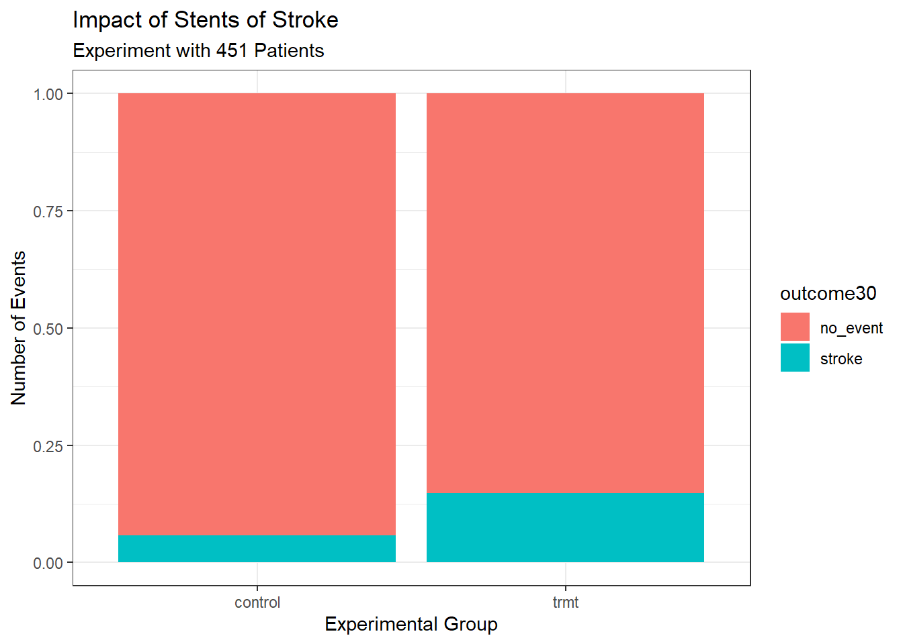
<p class="caption">(\#fig:cs1-fig)Better graph.</p>
</div>

Notice that we used the pipe operator, `%>%`. This operator allows us to string functions together in a manner that makes it easier to read the code. In the above code, we are sending the data object `stent_study` into the function `gf_props()` to use as data, so we don't need the `data =` argument. In math, this is a composition of functions. Instead of `f(g(x))` we could use a pipe `f(g(x)) = g(x) %>% f()`.

### Conclusion

These two summary statistics (the proportions of people who had a stroke) are useful in looking for differences in the groups, and we are in for a surprise: an additional 9\% of patients in the treatment group had a stroke! This is important for two reasons. First, it is contrary to what doctors expected, which was that stents would *reduce* the rate of strokes. Second, it leads to a statistical question: do the data show a **real** difference due to the treatment?

This second question is subtle. Suppose you flip a coin 100 times. While the chance a coin lands heads in any given coin flip is 50\%, we probably won't observe exactly 50 heads. This type of fluctuation is part of almost any type of data generating process. It is possible that the 9\% difference in the stent study is due to this natural variation. However, the larger the difference we observe (for a particular sample size), the less believable it is that the difference is due to chance. So what we are really asking is the following: is the difference so large that we should reject the notion that it was due to chance? 

This is a preview of step 4, analyze the data, and step 5, form a conclusion, of the analysis cycle. While we haven't yet covered statistical tools to fully address these steps, we can comprehend the conclusions of the published analysis: there was compelling evidence of harm by stents in this study of stroke patients.

**Be careful:** do not generalize the results of this study to all patients and all stents. This study looked at patients with very specific characteristics who volunteered to be a part of this study and who may not be representative of all stroke patients. In addition, there are many types of stents and this study only considered the self-expanding Wingspan stent (Boston Scientific). However, this study does leave us with an important lesson: we should keep our eyes open for surprises.


## Homework Problems 

Create an Rmd file `01 Data Case Study Application.Rmd` in R (it may be provided), and start by inserting your name in the header. Code blocks below can be inserted and then you can complete the code and answer the questions. When you are done, `knit` it into a pdf file.

To create an `R` code chunk, use CTRL-ALT-I or on the `insert` tab of the window, use the drop down to select `R`. Anything between the dashes is interpreted as `R` code.

For more on RMarkdown, see the following video: https://www.youtube.com/watch?v=DNS7i2m4sB0. This video assumes you are using `R` on your computer, but we are using RStudio Cloud. Thus we can `knit` to a pdf since it is setup for us. You can also take the first chapter of the Data Camp course, *Reporting with R Markdown*, to learn more.

1. **Stent study continued**. Complete a similar analysis for the stent data, but this time use the one year outcome. In particular,

  a. Read the data into your working directory.
  
```
stent_study <- read_csv(___)
```
  

  b. Complete similar steps as in the class notes. The start of code is provided below.  
    i. Use `inspect` on the data.  
    ii. Create a table of `outcome365` and `group`. Comment on the results.  
    iii. Create a barchart of the data.  
    

Using `inspect`:  

```
inspect(___)
```

The table: 

```
tally(outcome365 ~ ___, data = stent_study, format = ___, margins = TRUE)
```

Barchart:  

```
stent_study %>%
  gf_props(~ ___, fill = ~ ___, position = 'fill') %>%
  gf_labs(title = ___,
          subtitle = ___,
          x = ___,
          y = ___)
```

2. **Migraine and acupuncture**.  A migraine is a particularly painful type of headache, which patients sometimes wish to treat with acupuncture. To determine whether acupuncture relieves migraine pain, researchers conducted a randomized controlled study where 89 females diagnosed with migraine headaches were randomly assigned to one of two groups: treatment or control. 43 patients in the treatment group received acupuncture that is specifically designed to treat migraines. 46 patients in the control group received placebo acupuncture (needle insertion at nonacupoint locations). 24 hours after patients received acupuncture, they were asked if they were pain free.^[G. Allais et al. [“Ear acupuncture in the treatment of migraine attacks:  a randomized trial on the efficacy of appropriate versus inappropriate acupoints”.](http://www.ncbi.nlm.nih.gov/pubmed/21533739) In: Neurological Sci. 32.1 (2011), pp. 173–175.]


The data is in the file `migraine_study.csv` in the `data` folder.

Complete the following work:

  a. Read the data into an object called `migraine_study`.  
  
```
migraine_study <- read_csv("data/___")
```
  
```
head(migraine_study)
```
  

  b. Create a table of the data.
  
```
tally(___)
```
   
  
  c. Report the percent of patients in the treatment group who were pain free 24 hours after receiving acupuncture.  
  d. Repeat for the control group.  
  e. At first glance, does acupuncture appear to be an effective treatment for migraines? Explain your reasoning.  
  f. Do the data provide convincing evidence that there is a real pain reduction for those patients in the treatment group? Or do you think that the observed difference might just be due to chance?  
  
Compile, `knit`, this report into an html and a pdf. In order to `knit` the report into a pdf, you may need to install the `knitr` and `tinytex` packages in `R`.


<!--chapter:end:01-Data-Case-Study.Rmd-->

# Data Basics {#DB}

## Objectives

1) Define and use properly in context all new terminology to include, but not limited to, case, observational unit, variables, data frame, associated variables, independent, and discrete and continuous variables.   
2) Identify and define the different types of variables.  
3) Given a study description, explain the research question.  
4) Create a scatterplot in `R` and determine the association of two numerical variables from the plot.

## Data basics

Effective presentation and description of data is a first step in most analyses. This lesson introduces one structure for organizing data, as well as some terminology that will be used throughout this course.

### Observations, variables, and data matrices

For reference we will be using a data set concerning 50 emails received in 2012. These observations will be referred to as the `email50` data set, and they are a random sample from a larger data set. This data is in the **openintro** package so let's install and then load this package.


```r
install.packages("openintro")
library(openintro)
```


Table \@ref(tab:db1-tab) shows 4 rows of the `email50` data set and we have elected to only list 5 variables for ease of observation. 

Each row in the table represents a single email or **case**.^[A case is also sometimes called a **unit of observation** or an **observational unit**.] The columns represent characteristics, called **variables**, for each of the emails. For example, the first row represents email 1, which is not spam, contains 21,705 characters, 551 line breaks, is written in HTML format, and contains only small numbers.

<table>
<caption>(\#tab:db1-tab)First 5 rows of email data frame</caption>
 <thead>
  <tr>
   <th style="text-align:left;"> spam </th>
   <th style="text-align:right;"> num_char </th>
   <th style="text-align:right;"> line_breaks </th>
   <th style="text-align:left;"> format </th>
   <th style="text-align:left;"> number </th>
  </tr>
 </thead>
<tbody>
  <tr>
   <td style="text-align:left;"> 0 </td>
   <td style="text-align:right;"> 21.705 </td>
   <td style="text-align:right;"> 551 </td>
   <td style="text-align:left;"> 1 </td>
   <td style="text-align:left;"> small </td>
  </tr>
  <tr>
   <td style="text-align:left;"> 0 </td>
   <td style="text-align:right;"> 7.011 </td>
   <td style="text-align:right;"> 183 </td>
   <td style="text-align:left;"> 1 </td>
   <td style="text-align:left;"> big </td>
  </tr>
  <tr>
   <td style="text-align:left;"> 1 </td>
   <td style="text-align:right;"> 0.631 </td>
   <td style="text-align:right;"> 28 </td>
   <td style="text-align:left;"> 0 </td>
   <td style="text-align:left;"> none </td>
  </tr>
  <tr>
   <td style="text-align:left;"> 0 </td>
   <td style="text-align:right;"> 15.829 </td>
   <td style="text-align:right;"> 242 </td>
   <td style="text-align:left;"> 1 </td>
   <td style="text-align:left;"> small </td>
  </tr>
</tbody>
</table>

Let's look at the first 10 rows of data from `email50` using `R`. Remember to ask the two questions:  

*What do we want `R` to do?* and  

*What must we give `R` for it to do this?*  

We want the first 10 rows so we use `head()` and `R` needs the data object and the number of rows. The data object is called `email50` and is accessible once the **openintro** package is loaded.


```r
head(email50, n = 10)
```

```
## # A tibble: 10 x 21
##    spam  to_multiple from     cc sent_email time                image attach
##    <fct> <fct>       <fct> <int> <fct>      <dttm>              <dbl>  <dbl>
##  1 0     0           1         0 1          2012-01-04 06:19:16     0      0
##  2 0     0           1         0 0          2012-02-16 13:10:06     0      0
##  3 1     0           1         4 0          2012-01-04 08:36:23     0      2
##  4 0     0           1         0 0          2012-01-04 10:49:52     0      0
##  5 0     0           1         0 0          2012-01-27 02:34:45     0      0
##  6 0     0           1         0 0          2012-01-17 10:31:57     0      0
##  7 0     0           1         0 0          2012-03-17 22:18:55     0      0
##  8 0     0           1         0 1          2012-03-31 07:58:56     0      0
##  9 0     0           1         1 1          2012-01-10 18:57:54     0      0
## 10 0     0           1         0 0          2012-01-07 12:29:16     0      0
## # ... with 13 more variables: dollar <dbl>, winner <fct>, inherit <dbl>,
## #   viagra <dbl>, password <dbl>, num_char <dbl>, line_breaks <int>,
## #   format <fct>, re_subj <fct>, exclaim_subj <dbl>, urgent_subj <fct>,
## #   exclaim_mess <dbl>, number <fct>
```

In practice, it is especially important to ask clarifying questions to ensure important aspects of the data are understood. For instance, it is always important to be sure we know what each variable means and the units of measurement. Descriptions of all variables in the `email50` data set are given in its documentation which can be accessed in `R` by using the `?` command:

```
?email50
```

(Note that not all data sets will have associated documentation; the authors of **openintro** package included this documentation with the `email50` data set contained in the package.) 

The data in `email50` represent a **data matrix**, or in `R` terminology a **data frame** or **tibble** ^[A tibble is a data frame with attributes for such things as better display and printing.], which is a common way to organize data. Each row of a data matrix corresponds to a unique case, and each column corresponds to a variable. This is called **tidy data**.^[For more information on tidy data, see the [blog](https://simplystatistics.org/2016/02/17/non-tidy-data/) and the [book](https://r4ds.had.co.nz/tidy-data.html#pivoting).] The data frame for the stroke study introduced in the previous lesson had patients as the cases and there were three variables recorded for each patient. If we are thinking of patients as the unit of observation, then this data is tidy. 


```
## # A tibble: 10 x 3
##    group   outcome30 outcome365
##    <chr>   <chr>     <chr>     
##  1 control no_event  no_event  
##  2 trmt    no_event  no_event  
##  3 control no_event  no_event  
##  4 trmt    no_event  no_event  
##  5 trmt    no_event  no_event  
##  6 control no_event  no_event  
##  7 trmt    no_event  no_event  
##  8 control no_event  no_event  
##  9 control no_event  no_event  
## 10 control no_event  no_event
```

If we think of an outcome as a unit of observation, then it is not tidy since the two outcome columns are variable values (month or year). The tidy data for this case would be:


```
## # A tibble: 10 x 4
##    patient_id group   time  result  
##         <int> <chr>   <chr> <chr>   
##  1          1 control month no_event
##  2          1 control year  no_event
##  3          2 trmt    month no_event
##  4          2 trmt    year  no_event
##  5          3 control month no_event
##  6          3 control year  no_event
##  7          4 trmt    month no_event
##  8          4 trmt    year  no_event
##  9          5 trmt    month no_event
## 10          5 trmt    year  no_event
```


There are three interrelated rules which make a data set tidy:  

1. Each variable must have its own column.  
2. Each observation must have its own row.  
3. Each value must have its own cell.  

Why ensure that your data is tidy? There are two main advantages:

1. There’s a general advantage to picking one consistent way of storing data. If you have a consistent data structure, it’s easier to learn the tools that work with it because they have an underlying uniformity.

2. There’s a specific advantage to placing variables in columns because it allows `R`’s vectorized nature to shine. This will be more clear as we progress in our studies. Since most built-in `R` functions work with vectors of values, it makes transforming tidy data feel particularly natural.


Data frames are a convenient way to record and store data. If another individual or case is added to the data set, an additional row can be easily added. Similarly, another column can be added for a new variable.

> **Exercise**:    
We consider a publicly available data set that summarizes information about the 3,142 counties in the United States, and we create a data set called `county_subset` data set. This data set will include information about each county: its name, the state where it resides, its population in 2000 and 2010, per capita federal spending, poverty rate, and four additional characteristics. We create this data object in the code following this description. The parent data set is part of the `usdata` library and is called `county_complete`. The variables are summarized in the help menu built into the **usdata** package^[[These data were collected from the US Census website.](http://quickfacts.census.gov/qfd/index.html)]. How might these data be organized in a data matrix? ^[Each county may be viewed as a case, and there are ten pieces of information recorded for each case. A table with 3,142 rows and 10 columns could hold these data, where each row represents a county and each column represents a particular piece of information.]


Using `R` we will create our data object. First we load the library `usdata`.


```r
library(usdata)
```


We only want a subset of the columns and we will use the `select` verb in `dplyr` to select and rename columns. We also create a new variable which is federal spending per capita using the `mutate` function.  


```r
county_subset <- county_complete %>% 
  select(name, state, pop2000, pop2010, fed_spend = fed_spending_2009, 
         poverty = poverty_2010, homeownership = homeownership_2010, 
         multi_unit = housing_multi_unit_2010, income = per_capita_income_2010, 
         med_income = median_household_income_2010) %>%
  mutate(fed_spend = fed_spend / pop2010)
```

Using `R`, we will display seven rows of the `county_subset` data frame. 


```r
head(county_subset, n = 7)
```

```
##             name   state pop2000 pop2010 fed_spend poverty homeownership
## 1 Autauga County Alabama   43671   54571  6.068095    10.6          77.5
## 2 Baldwin County Alabama  140415  182265  6.139862    12.2          76.7
## 3 Barbour County Alabama   29038   27457  8.752158    25.0          68.0
## 4    Bibb County Alabama   20826   22915  7.122016    12.6          82.9
## 5  Blount County Alabama   51024   57322  5.130910    13.4          82.0
## 6 Bullock County Alabama   11714   10914  9.973062    25.3          76.9
## 7  Butler County Alabama   21399   20947  9.311835    25.0          69.0
##   multi_unit income med_income
## 1        7.2  24568      53255
## 2       22.6  26469      50147
## 3       11.1  15875      33219
## 4        6.6  19918      41770
## 5        3.7  21070      45549
## 6        9.9  20289      31602
## 7       13.7  16916      30659
```

### Types of variables

Examine the `fed_spend`, `pop2010`, and `state` variables in the `county` data set. Each of these variables is inherently different from the others, yet many of them share certain characteristics.

First consider `fed_spend`. It is said to be a **numerical variable** since it can take a wide range of numerical values, and it is sensible to add, subtract, or take averages with those values. On the other hand, we would not classify a variable reporting telephone area codes as numerical; even though area codes are made up of numerical digits, their average, sum, and difference have no clear meaning.

The `pop2010` variable is also numerical; it is sensible to add, subtract, or take averages with those values, although it seems to be a little different than `fed_spend`. This variable of the population count can only be a whole non-negative number ($0$, $1$, $2$, $...$). For this reason, the population variable is said to be **discrete** since it can only take specific numerical values. On the other hand, the federal spending variable is said to be **continuous**. Now technically, there are no truly continuous numerical variables since all measurements are finite up to some level of accuracy or measurement precision. However, in this course we will treat both types of numerical variables the same, that is as continuous variables for statistical modeling. The only place this will be different in this course is in probability models, which we see in the probability modeling section.

The variable **state** can take up to 51 values, after accounting for Washington, DC, and are summarized as: *Alabama*, *Alaska*, ..., and *Wyoming*. Because the responses themselves are categories, `state` is called a **categorical** variable,^[Sometimes also called a **nominal** variable.] and the possible values are called the variable's **levels**.

<div class="figure">

<p class="caption">(\#fig:tax-fig)Taxonomy of Variables.</p>
</div>


Finally, consider a hypothetical variable on education, which describes the highest level of education completed and takes on one of the values *noHS*, *HS*, *College* or *Graduate_school*. This variable seems to be a hybrid: it is a categorical variable but the levels have a natural ordering. A variable with these properties is called an **ordinal** variable. A categorical variable with levels that do not have a natural ordering is called a **nominal** variable. To simplify analyses, any ordinal variables in this course will be treated as nominal categorical variables. In `R`, categorical variables can be treated in different ways; one of the key differences is that we can leave them as character values or as factors. When `R` handles factors, it is only concerned about the *levels* of values of the factors. We will learn more about this as we progress.

Figure \@ref(fig:tax-fig) captures this classification of variables we have described.

> **Exercise**:    
Data were collected about students in a statistics course. Three variables were recorded for each student: number of siblings, student height, and whether the student had previously taken a statistics course. Classify each of the variables as continuous numerical, discrete numerical, or categorical.

The number of siblings and student height represent numerical variables. Because the number of siblings is a count, it is discrete. Height varies continuously, so it is a continuous numerical variable. The last variable classifies students into two categories -- those who have and those who have not taken a statistics course -- which makes this variable categorical.

> **Exercise**:    
Consider the variables `group` and `outcome30` from the stent study in the case study lesson. Are these numerical or categorical variables? ^[There are only two possible values for each variable, and in both cases they describe categories. Thus, each is a categorical variable.]


### Relationships between variables

Many analyses are motivated by a researcher looking for a relationship between two or more variables. This is the heart of statistical modeling. A social scientist may like to answer some of the following questions:

1. Is federal spending, on average, higher or lower in counties with high rates of poverty?  
2. If homeownership is lower than the national average in one county, will the percent of multi-unit structures in that county likely be above or below the national average?   

To answer these questions, data must be collected, such as the `county_complete` data set. Examining summary statistics could provide insights for each of the two questions about counties. Graphs can be used to visually summarize data and are useful for answering such questions as well.

Scatterplots are one type of graph used to study the relationship between two numerical variables. Figure \@ref(fig:pov1-fig) compares the variables `fed_spend` and `poverty`. Each point on the plot represents a single county. For instance, the highlighted dot corresponds to County 1088 in the `county_subset` data set: Owsley County, Kentucky, which had a poverty rate of 41.5\% and federal spending of \$21.50 per capita. The dense cloud in the scatterplot suggests a relationship between the two variables: counties with a high poverty rate also tend to have slightly more federal spending. We might brainstorm as to why this relationship exists and investigate each idea to determine which is the most reasonable explanation.

<div class="figure">

<p class="caption">(\#fig:pov1-fig)A scatterplot showing fed_spend against poverty. Owsley County of Kentucky, with a poverty rate of 41.5% and federal spending of $21.50 per capita, is highlighted.</p>
</div>

> **Exercise**:    
Examine the variables in the `email50` data set. Create two research questions about the relationships between these variables that are of interest to you.^[Two sample questions: (1) Intuition suggests that if there are many line breaks in an email then there would also tend to be many characters: does this hold true? (2) Is there a connection between whether an email format is plain text (versus HTML) and whether it is a spam message?]

The `fed_spend` and `poverty` variables are said to be associated because the plot shows a discernible pattern. When two variables show some connection with one another, they are called **associated variables**. Associated variables can also be called **dependent** variables and vice-versa.

> *Example*:    
The relationship between the homeownership rate and the percent of units in multi-unit structures (e.g. apartments, condos) is visualized using a scatterplot in Figure \@ref(fig:homeown-fig). Are these variables associated?

It appears that the larger the fraction of units in multi-unit structures, the lower the homeownership rate. Since there is some relationship between the variables, they are associated.

<div class="figure">

<p class="caption">(\#fig:homeown-fig)A scatterplot of the homeownership rate versus the percent of units that are in multi-unit structures for all 3,143 counties.</p>
</div>

Because there is a downward trend in Figure \@ref(fig:homeown-fig) -- counties with more units in multi-unit structures are associated with lower homeownership -- these variables are said to be **negatively associated**. A **positive association** is shown in the relationship between the `poverty` and `fed_spend` variables represented in Figure \@ref(fig:pov1-fig), where counties with higher poverty rates tend to receive more federal spending per capita.

If two variables are not associated, then they are said to be **independent**. That is, two variables are independent if there is no evident relationship between the two.

> A pair of variables are either related in some way (associated) or not (independent). No pair of variables is both associated and independent.

### Creating a scatterplot


In this section, we will create a simple scatterplot and then ask you to create one on your own. First, we will recreate the scatterplot seen in Figure \@ref(fig:pov1-fig). This figure uses the `county_subset` data set.

Here are two questions:

*What do we want `R` to do?* and

*What must we give `R` for it to do this?*   

We want `R` to create a scatterplot and to do this it needs, at a minimum, the data object, what we want on the $x$-axis, and what we want on the $y$-axis. More information on [**ggformula**](https://cran.r-project.org/web/packages/ggformula/vignettes/ggformula-blog.html) can be found by clicking on the link.^[https://cran.r-project.org/web/packages/ggformula/vignettes/ggformula-blog.html]

(ref:ggfbold2) Scatterplot with **ggformula**.


```r
county_subset %>%
  gf_point(fed_spend ~ poverty)
```

<div class="figure">
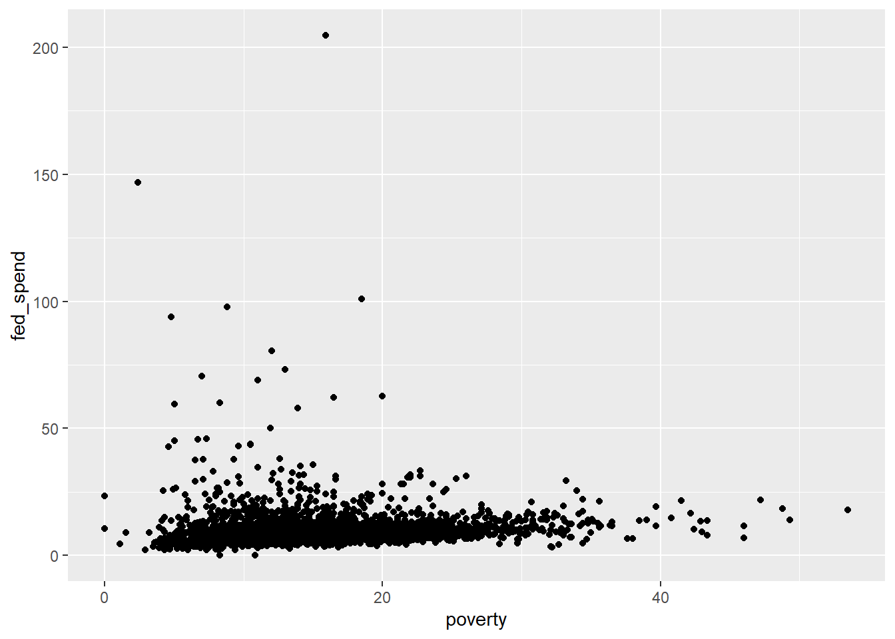
<p class="caption">(\#fig:pov2-fig)(ref:ggfbold2)</p>
</div>

Figure \@ref(fig:pov2-fig) is bad. There are poor axis labels, no title, dense clustering of points, and the $y$-axis is being driven by a couple of extreme points. We will need to clear this up. Again, try to read the code and use `help()` or `?` to determine the purpose of each command in Figure \@ref(fig:pov3-fig).


```r
county_subset %>%
  filter(fed_spend < 32) %>%
  gf_point(fed_spend ~ poverty,
           xlab = "Poverty Rate (Percent)", 
           ylab = "Federal Spending Per Capita",
           title = "A scatterplot showing fed_spend against poverty", 
           cex = 1, alpha = 0.2) %>%
  gf_theme(theme_classic())
```

<div class="figure">

<p class="caption">(\#fig:pov3-fig)Better example of a scatterplot.</p>
</div>

> **Exercise**:    
Create the scatterplot in Figure \@ref(fig:homeown-fig).

## Homework Problems 

**Identify study components** 

Identify (i) the cases, (ii) the variables and their types, and (iii) the main research question in the studies described below.

1. Researchers collected data to examine the relationship between pollutants and preterm births in Southern California. During the study, air pollution levels were measured by air quality monitoring stations. Specifically, levels of carbon monoxide were recorded in parts per million, nitrogen dioxide and ozone in parts per hundred million, and coarse particulate matter (PM$_{10}$) in $\mu g/m^3$. Length of gestation data were collected on 143,196 births between the years 1989 and 1993, and air pollution exposure during gestation was calculated for each birth. The analysis suggested that increased ambient PM$_{10}$ and, to a lesser degree, CO concentrations may be associated with the occurrence of preterm births.^[B. Ritz et al. [“Effect of air pollution on preterm birth among children born in Southern California
between 1989 and 1993”](http://journals.lww.com/epidem/Abstract/2000/09000/Effect_of_Air_Pollution_on_Preterm_Birth_Among.4.aspx).  In:  Epidemiology 11.5 (2000), pp. 502–511.]


2. The Buteyko method is a shallow breathing technique developed by Konstantin Buteyko, a Russian doctor, in 1952. Anecdotal evidence suggests that the Buteyko method can reduce asthma symptoms and improve quality of life. In a scientific study to determine the effectiveness of this method, researchers recruited 600 asthma patients aged 18-69 who relied on medication for asthma treatment. These patients were split into two research groups: one practiced the Buteyko method and the other did not. Patients were scored on quality of life, activity, asthma symptoms, and medication reduction on a scale from 0 to 10. On average, the participants in the Buteyko group experienced a significant reduction in asthma symptoms and an improvement in quality of life.^[J. McGowan. "Health Education: Does the Buteyko Institute Method make a difference?" In: Thorax 58 (2003).]

3. In the package **Stat2Data** is a data set called `Election16`. Create a scatterplot for the percent of advanced degree versus per capita income in the state. Describe the relationship between these two variables. Note: you may have to load the library.
 


<!--chapter:end:02-Data-Basics.Rmd-->

# Overview of Data Collection Principles {#ODCP}


## Objectives

1) Define and use properly in context all new terminology.  
2) From a description of a research project, at a minimum be able to describe the population of interest, the generalizability of the study, the response and predictor variables, differentiate whether it is observational or experimental, and determine the type of sample.  
3) Explain in the context of a problem how to conduct a sample for the different types of sampling procedures.  


## Overview of data collection principles

The first step in conducting research is to identify topics or questions that are to be investigated. A clearly laid out research question is helpful in identifying what subjects or cases should be studied and what variables are important. It is also important to consider *how* data are collected so that they are reliable and help achieve the research goals.

### Populations and samples


Consider the following three research questions:

1. What is the average mercury content in swordfish in the Atlantic Ocean?  
2. Over the last 5 years, what is the average time to complete a degree for Duke undergraduate students?  
3. Does a new drug reduce the number of deaths in patients with severe heart disease?  


Each research question refers to a target **population**. In the first question, the target population is all swordfish in the Atlantic Ocean, and each fish represents a case. It is usually too expensive to collect data for every case in a population. Instead, a sample is taken. A **sample** represents a subset of the cases and is often a small fraction of the population. For instance, 60 swordfish (or some other number) in the population might be selected, and this sample data may be used to provide an estimate of the population average and answer the research question.

> **Exercise**:  
For the second and third questions above, identify the target population and what represents an individual case.^[ 2) Notice that the first question is only relevant to students who complete their degree; the average cannot be computed using a student who never finished her degree. Thus, only Duke undergraduate students who have graduated in the last five years represent cases in the population under consideration. Each such student would represent an individual case. 3) A person with severe heart disease represents a case. The population includes all people with severe heart disease.]

### Anecdotal evidence

Consider the following possible responses to the three research questions:

1. A man on the news got mercury poisoning from eating swordfish, so the average mercury concentration in swordfish must be dangerously high. 
2. I met two students who took more than 7 years to graduate from Duke, so it must take longer to graduate at Duke than at many other colleges. 
3. My friend's dad had a heart attack and died after they gave him a new heart disease drug, so the drug must not work.

Each conclusion is based on data. However, there are two problems. First, the data only represent one or two cases. Second, and more importantly, it is unclear whether these cases are actually representative of the population. Data collected in this haphazard fashion are called **anecdotal evidence**.

(ref:quote1) In February 2010, some media pundits cited one large snow storm as evidence against global warming. As comedian Jon Stewart pointed out, *'It's one storm, in one region, of one country.'*

<div class="figure" style="text-align: center">

<p class="caption">(\#fig:unnamed-chunk-1)(ref:quote1)</p>
</div>


> **Anecdotal evidence**: 
Be careful of data collected haphazardly. Such evidence may be true and verifiable, but it may only represent extraordinary cases.

Anecdotal evidence typically is composed of unusual cases that we recall based on their striking characteristics. For instance, we are more likely to remember the two people we met who took 7 years to graduate than the six others who graduated in four years. Instead of looking at the most unusual cases, we should examine a sample of many cases that represent the population.

### Sampling from a population

We might try to estimate the time to graduation for Duke undergraduates in the last 5 years by collecting a sample of students. All graduates in the last 5 years represent the *population*, and graduates who are selected for review are collectively called the *sample*. In general, we always seek to *randomly* select a sample from a population. The most basic type of random selection is equivalent to how raffles are conducted. For example, in selecting graduates, we could write each graduate's name on a raffle ticket and draw 100 tickets. The selected names would represent a random sample of 100 graduates. This is illustrated in Figure \@ref(fig:randsamp-fig). 

<div class="figure">

<p class="caption">(\#fig:randsamp-fig)In this graphic, five graduates are randomly selected from the population to be included in the sample.</p>
</div>


Why pick a sample randomly? Why not just pick a sample by hand? Consider the following scenario.

> **Example**:  
Suppose we ask a student who happens to be majoring in nutrition to select several graduates for the study. What kind of students do you think she might collect? Do you think her sample would be representative of all graduates?
^[Perhaps she would pick a disproportionate number of graduates from health-related fields. Or perhaps her selection would be well-representative of the population. When selecting samples by hand, we run the risk of picking a *biased* sample, even if that bias is unintentional or difficult to discern.]

<div class="figure">
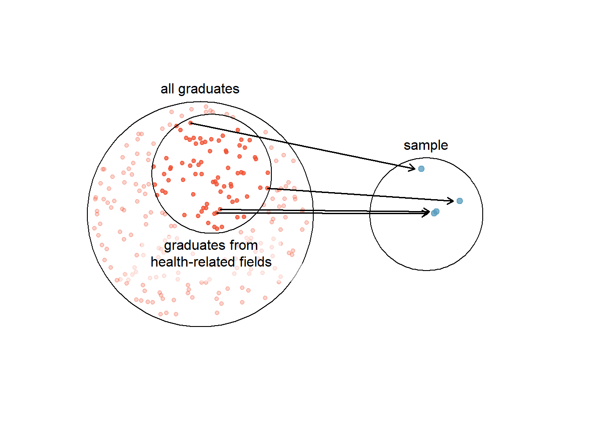
<p class="caption">(\#fig:biased-fig)Instead of sampling from all graduates equally, a nutrition major might inadvertently pick graduates with health-related majors disproportionately often.</p>
</div>


If someone was permitted to pick and choose exactly which graduates were included in the sample, it is entirely possible that the sample could be skewed to that person's interests, which may be entirely unintentional. This introduces **bias** into a sample, see Figure \@ref(fig:biased-fig). Sampling randomly helps resolve this problem. The most basic random sample is called a **simple random sample**, which is equivalent to using a raffle to select cases. This means that each case in the population has an equal chance of being included and there is no implied connection between the cases in the sample.

Sometimes a simple random sample is difficult to implement and an alternative method is helpful. One such substitute is a **systematic sample**, where one case is sampled after letting a fixed number of others, say 10 other cases, pass by. Since this approach uses a mechanism that is not easily subject to personal biases, it often yields a reasonably representative sample. This course will focus on simple random samples since the use of systematic samples is uncommon and requires additional considerations of the context.

The act of taking a simple random sample helps minimize bias. However, bias can crop up in other ways. Even when people are picked at random, e.g. for surveys, caution must be exercised if the **non-response** is high. For instance, if only 30\% of the people randomly sampled for a survey actually respond, and it is unclear whether the respondents are **representative** of the entire population, the survey might suffer from **non-response bias**.

<div class="figure">

<p class="caption">(\#fig:convsamp-fig)Due to the possibility of non-response, surveys studies may only reach a certain group within the population. It is difficult, and often impossible, to completely fix this problem</p>
</div>

Another common pitfall is a **convenience sample**, where individuals who are easily accessible are more likely to be included in the sample, see Figure \@ref(fig:convsamp-fig) . For instance, if a political survey is done by stopping people walking in the Bronx, it will not represent all of New York City. It is often difficult to discern what sub-population a convenience sample represents.

>**Exercise**:  
We can easily access ratings for products, sellers, and companies through websites. These ratings are based only on those people who go out of their way to provide a rating. If 50\% of online reviews for a product are negative, do you think this means that 50\% of buyers are dissatisfied with the product?^[Answers will vary. From our own anecdotal experiences, we believe people tend to rant more about products that fell below expectations than rave about those that perform as expected. For this reason, we suspect there is a negative bias in product ratings on sites like Amazon. However, since our experiences may not be representative, we also keep an open mind.]

### Explanatory and response variables

Consider the following question for the `county` data set:

Is federal spending, on average, higher or lower in counties with high rates of poverty?

If we suspect poverty might affect spending in a county, then poverty is the **explanatory** variable and federal spending is the **response** variable in the relationship.^[Sometimes the explanatory variable is called the **independent** variable and the response variable is called the **dependent** variable. However, this becomes confusing since a *pair* of variables might be independent or dependent, so be careful and consider the context when using or reading these words.] If there are many variables, it may be possible to consider a number of them as explanatory variables.

> **Explanatory** and **response** variables  
To identify the explanatory variable in a pair of variables, identify which of the two is suspected of affecting the other.

> **Caution**: 
Association does not imply causation. Labeling variables as *explanatory* and *response* does not guarantee the relationship between the two is actually causal, even if there is an association identified between the two variables. We use these labels only to keep track of which variable we suspect affects the other. We also use this language to help in our use of `R` and the formula notation.

In some cases, there is no explanatory or response variable. Consider the following question:

If homeownership in a particular county is lower than the national average, will the percent of multi-unit structures in that county likely be above or below the national average?

It is difficult to decide which of these variables should be considered the explanatory and response variable; i.e. the direction is ambiguous, so no explanatory or response labels are suggested here.

### Introducing observational studies and experiments

There are two primary types of data collection: observational studies and experiments.

Researchers perform an **observational study** when they collect data in a way that does not directly interfere with how the data arise. For instance, researchers may collect information via surveys, review medical or company records, or follow a **cohort** of many similar individuals to study why certain diseases might develop. In each of these situations, researchers merely observe what happens. In general, observational studies can provide evidence of a naturally occurring association between variables, but by themselves, they cannot show a causal connection.

When researchers want to investigate the possibility of a causal connection, they conduct an **experiment**. Usually there will be both an explanatory and a response variable. For instance, we may suspect administering a drug will reduce mortality in heart attack patients over the following year. To check if there really is a causal connection between the explanatory variable and the response, researchers will collect a sample of individuals and split them into groups. The individuals in each group are *assigned* a treatment. When individuals are randomly assigned to a treatment group, the experiment is called a **randomized experiment**. For example, each heart attack patient in the drug trial could be randomly assigned, perhaps by flipping a coin, into one of two groups: the first group receives a **placebo** (fake treatment) and the second group receives the drug. The case study at the beginning of the semester is another example of an experiment, though that study did not employ a placebo. Math 359 is a course on the design and analysis of experimental data, DOE. In the Air Force these types of experiments are an important part of test and evaluation. Many Air Force analysts are expert practitioners of DOE. In this course we will minimize our discussion of DOE.

> Association $\neq$ Causation  
Again, association does not imply causation. In a data analysis, association does not imply causation, and causation can only be inferred from a randomized experiment. Although, a hot field is the analysis of causal relationships in observational data. This is important because consider cigarette smoking, how do we know it causes lung cancer? We only have observational data and clearly cannot do an experiment. We think analysts will be charged in the near future with using causal reasoning on observational data.


## Homework Problems 

1. **Generalizability and causality**. Identify the population of interest and the sample in the studies described below. These are the same studies from the previous lesson. Also comment on whether or not the results of the study can be generalized to the population and if the findings of the study can be used to establish causal relationships.

a. Researchers collected data to examine the relationship between pollutants and preterm births in Southern California. During the study air pollution levels were measured by air quality monitoring stations. Specifically, levels of carbon monoxide were recorded in parts per million, nitrogen dioxide and ozone in parts per hundred million, and coarse particulate matter (PM$_{10}$) in $\mu g/m^3$. Length of gestation data were collected on 143,196 births between the years 1989 and 1993, and air pollution exposure during gestation was calculated for each birth. The analysis suggested that increased ambient PM$_{10}$ and, to a lesser degree, CO concentrations may be associated with the occurrence of preterm births.^[B. Ritz et al. [“Effect of air pollution on preterm birth among children born in Southern California
between 1989 and 1993”](http://journals.lww.com/epidem/Abstract/2000/09000/Effect_of_Air_Pollution_on_Preterm_Birth_Among.4.aspx).  In:  Epidemiology 11.5 (2000), pp. 502–511.]  
b. The Buteyko method is a shallow breathing technique developed by Konstantin Buteyko, a Russian doctor, in 1952. Anecdotal evidence suggests that the Buteyko method can reduce asthma symptoms and improve quality of life. In a scientific study to determine the effectiveness of this method, researchers recruited 600 asthma patients aged 18-69 who relied on medication for asthma treatment. These patients were split into two research groups: one practiced the Buteyko method and the other did not. Patients were scored on quality of life, activity, asthma symptoms, and medication reduction on a scale from 0 to 10. On average, the participants in the Buteyko group experienced a significant reduction in asthma symptoms and an improvement in quality of life.^[J. McGowan. "Health Education: Does the Buteyko Institute Method make a difference?" In: Thorax 58 (2003).]

\pagebreak

2. **GPA and study time**. A survey was conducted on 55 undergraduates from Duke University who took an introductory statistics course in Spring 2012. Among many other questions, this survey asked them about their GPA and the number of hours they spent studying per week. The scatterplot below displays the relationship between these two variables.

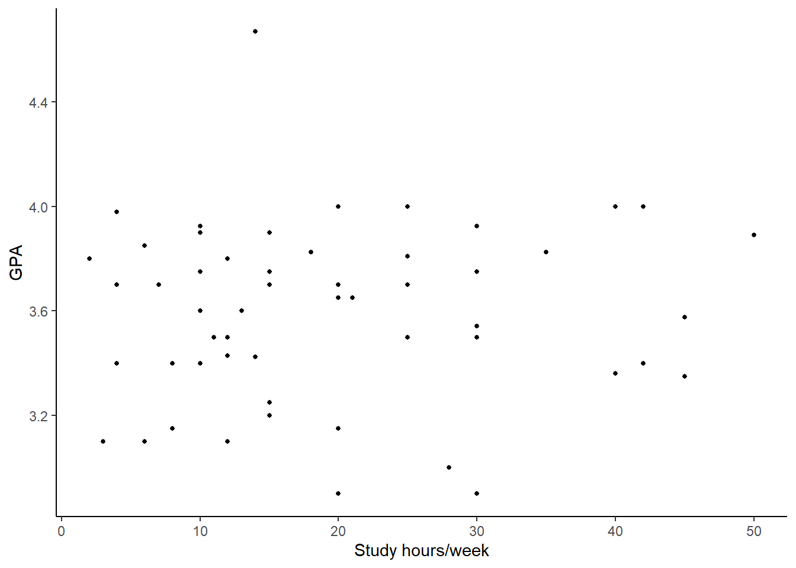


a. What is the explanatory variable and what is the response variable?
b. Describe the relationship between the two variables. Make sure to discuss unusual observations, if any.
c. Is this an experiment or an observational study?
d. Can we conclude that studying longer hours leads to higher GPAs?  

\pagebreak

3. **Income and education** The scatterplot below shows the relationship between per capita income (in thousands of dollars) and percent of population with a bachelor's degree in 3,143 counties in the US in 2010.


a. What are the explanatory and response variables?  
b. Describe the relationship between the two variables. Make sure to discuss unusual observations, if any.  
c. Can we conclude that having a bachelor's degree increases one's income?  


<!--chapter:end:03-Overview-of-Data-Collection-Principles.Rmd-->

# Studies {#STUDY}

## Objectives

1) Define and use properly in context all new terminology.  
2) Given a study description, be able to identify and explain the study using correct terms.  
3) Given a scenario, describe flaws in reasoning and propose study and sampling designs.


## Observation studies, sampling strategies, and experiments

### Observational studies

Generally, data in observational studies are collected only by monitoring what occurs, while experiments require the primary explanatory variable in a study be assigned for each subject by the researchers.

Making causal conclusions based on experiments is often reasonable. However, making the same causal conclusions based on observational data can be treacherous and is not recommended. Thus, observational studies are generally only sufficient to show associations.

>**Exercise**:  
Suppose an observational study tracked sunscreen use and skin cancer, and it was found that the more sunscreen someone used, the more likely the person was to have skin cancer. Does this mean sunscreen *causes* skin cancer?^[No. See the paragraph following the exercise for an explanation.]


Some previous research^[http://www.sciencedirect.com/science/article/pii/S0140673698121682   
http://archderm.ama-assn.org/cgi/content/abstract/122/5/537    
Study with a similar scenario to that described here:  
http://onlinelibrary.wiley.com/doi/10.1002/ijc.22745/full] tells us that using sunscreen actually reduces skin cancer risk, so maybe there is another variable that can explain this hypothetical association between sunscreen usage and skin cancer. One important piece of information that is absent is sun exposure. If someone is out in the sun all day, she is more likely to use sunscreen *and* more likely to get skin cancer. Exposure to the sun is unaccounted for in the simple investigation.

<div class="figure">
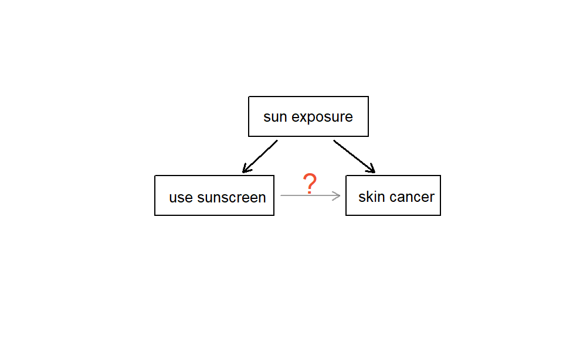
<p class="caption">(\#fig:confound-fig)Sun exposure is a confounding variable because it is related to both response and explanatory variables.</p>
</div>

Sun exposure is what is called a **confounding variable**,^[Also called a **lurking variable**, **confounding factor**, or a **confounder**.] which is a variable that is correlated with both the explanatory and response variables, see Figure \@ref(fig:confound-fig) . While one method to justify making causal conclusions from observational studies is to exhaust the search for confounding variables, there is no guarantee that all confounding variables can be examined or measured.

Let's look at an example of confounding visually. Using the `SAT` data from the **mosaic** package let's look at expenditure per pupil versus SAT scores. Figure \@ref(fig:confound2-fig) is a plot of the data.

> **Exercise**:    
What conclusion to you reach from the plot in Figure \@ref(fig:confound2-fig)?^[It appears that average SAT score declines as expenditures per student increases.]

<div class="figure">

<p class="caption">(\#fig:confound2-fig)Average SAT score versus expenditure per pupil; reminder: each observation represents an individual state.</p>
</div>

The implication that spending less might give better results is not justified. Expenditures are confounded with the proportion of students who take the exam, and scores are higher in states where fewer students take the exam.

It is interesting to look at the original plot if we place the states into two groups depending on whether more or
fewer than 40% of students take the SAT. Figure \@ref(fig:conditional-fig) is a plot of the data broken down into the 2 groups.


<div class="figure">

<p class="caption">(\#fig:conditional-fig)Average SAT score versus expenditure per pupil; broken down by level of participation.</p>
</div>

Once we account for the fraction of students taking the SAT, the relationship between expenditures and SAT scores changes.

In the same way, the `county` data set is an observational study with confounding variables, and its data cannot easily be used to make causal conclusions.

> **Exercise**:  
Figure \@ref(fig:homeown2-fig) shows a negative association between the homeownership rate and the percentage of multi-unit structures in a county. However, it is unreasonable to conclude that there is a causal relationship between the two variables. Suggest one or more other variables that might explain the relationship in the Figure \@ref(fig:homeown2-fig).^[Answers will vary. Population density may be important. If a county is very dense, then a larger fraction of residents may live in multi-unit structures. Additionally, the high density may contribute to increases in property value, making homeownership infeasible for many residents.]


<div class="figure">

<p class="caption">(\#fig:homeown2-fig)A scatterplot of the homeownership rate versus the percent of units that are in multi-unit structures for all 3,143 counties.</p>
</div>


Observational studies come in two forms: prospective and retrospective studies. A **prospective study** identifies individuals and collects information as events unfold. For instance, medical researchers may identify and follow a group of similar individuals over many years to assess the possible influences of behavior on cancer risk. One example of such a study is The Nurses Health Study, started in 1976 and expanded in 1989.^[http://www.channing.harvard.edu/nhs/] This prospective study recruits registered nurses and then collects data from them using questionnaires.  

**Retrospective studies** collect data after events have taken place; e.g. researchers may review past events in medical records. Some data sets, such as `county`, may contain both prospectively- and retrospectively-collected variables. Local governments prospectively collect some variables as events unfolded (e.g. retail sales) while the federal government retrospectively collected others during the 2010 census (e.g. county population).

### Three sampling methods 

Almost all statistical methods are based on the notion of implied randomness. If observational data are not collected in a random framework from a population, results from these statistical methods are not reliable. Here we consider three random sampling techniques: simple, stratified, and cluster sampling. Figures \@ref(fig:simprand-fig) , \@ref(fig:stratsamp2-fig) , and \@ref(fig:clussamp4-fig) provides a graphical representation of these techniques.

<div class="figure">
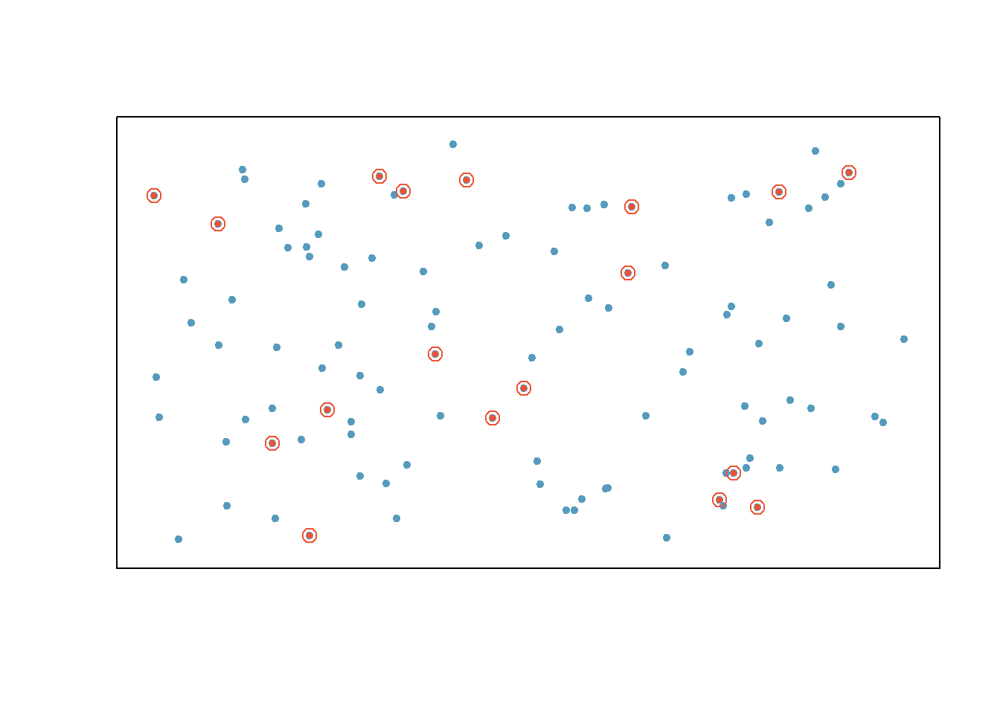
<p class="caption">(\#fig:simprand-fig)Examples of simple random sampling. In this figure, simple random sampling was used to randomly select the 18 cases.</p>
</div>


<div class="figure">

<p class="caption">(\#fig:stratsamp2-fig)In this figure, stratified sampling was used: cases were grouped into strata, and then simple random sampling was employed within each stratum.</p>
</div>

<div class="figure">
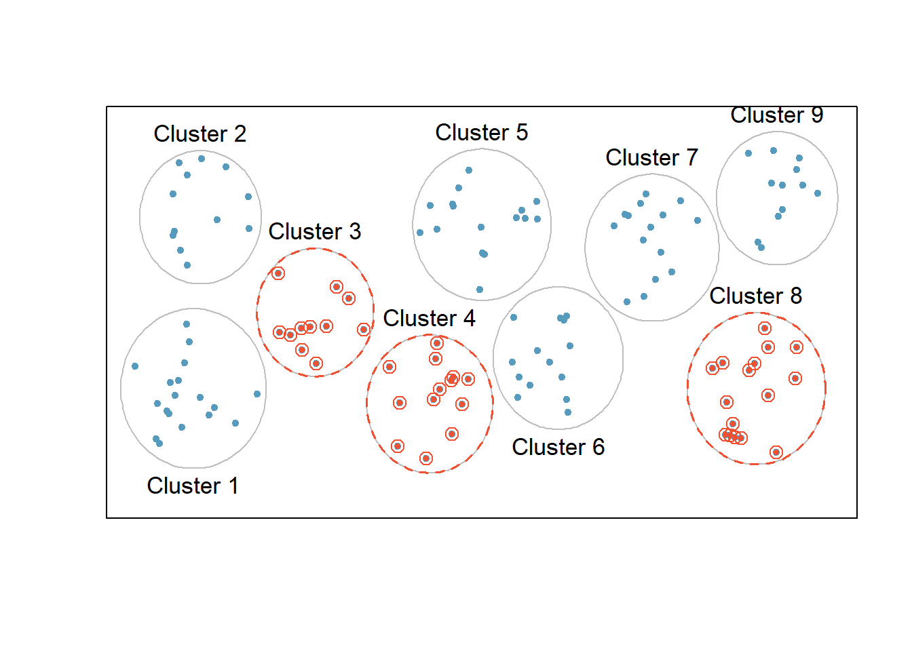
<p class="caption">(\#fig:clussamp4-fig)In this figure, cluster sampling was used, where data were binned into nine clusters, and three of the clusters were randomly selected.</p>
</div>

**Simple random sampling** is probably the most intuitive form of random sampling. Consider the salaries of Major League Baseball (MLB) players, where each player is a member of one of the league's 30 teams. To take a simple random sample of 120 baseball players and their salaries from the 2010 season, we could write the names of that season's 828 players onto slips of paper, drop the slips into a bucket, shake the bucket around until we are sure the names are all mixed up, then draw out slips until we have the sample of 120 players. In general, a sample is referred to as ``simple random'' if each case in the population has an equal chance of being included in the final sample *and* knowing that a case is included in a sample does not provide useful information about which other cases are included.

**Stratified sampling** is a divide-and-conquer sampling strategy. The population is divided into groups called **strata**. The strata are chosen so that similar cases are grouped together, then a second sampling method, usually simple random sampling, is employed within each stratum. In the baseball salary example, the teams could represent the strata; some teams have a lot more money (we're looking at you, Yankees). Then we might randomly sample 4 players from each team for a total of 120 players.

Stratified sampling is especially useful when the cases in each stratum are very similar with respect to the outcome of interest. The downside is that analyzing data from a stratified sample is a more complex task than analyzing data from a simple random sample. The analysis methods introduced in this course would need to be extended to analyze data collected using stratified sampling.

>**Example**:  
Why would it be good for cases within each stratum to be very similar?^[We might get a more stable estimate for the subpopulation in a stratum if the cases are very similar. These improved estimates for each subpopulation will help us build a reliable estimate for the full population.]


In **cluster sampling**, we group observations into clusters, then randomly sample some of the clusters. Sometimes cluster sampling can be a more economical technique than the alternatives. Also, unlike stratified sampling, cluster sampling is most helpful when there is a lot of case-to-case variability within a cluster but the clusters themselves don't look very different from one another. For example, if neighborhoods represented clusters, then this sampling method works best when the neighborhoods are very diverse. A downside of cluster sampling is that more advanced analysis techniques are typically required, though the methods in this course can be extended to handle such data.

>**Example**:  
Suppose we are interested in estimating the malaria rate in a densely tropical portion of rural Indonesia. We learn that there are 30 villages in that part of the Indonesian jungle, each more or less similar to the next. What sampling method should be employed?^[A simple random sample would likely draw individuals from all 30 villages, which could make data collection extremely expensive. Stratified sampling would be a challenge since it is unclear how we would build strata of similar individuals. However, cluster sampling seems like a very good idea. We might randomly select a small number of villages. This would probably reduce our data collection costs substantially in comparison to a simple random sample and would still give us helpful information.]

Another technique called **multistage sampling** is similar to cluster sampling, except that we take a simple random sample within each selected cluster. For instance, if we sampled neighborhoods using cluster sampling, we would next sample a subset of homes within each selected neighborhood if we were using multistage sampling.


### Experiments

Studies where the researchers assign treatments to cases are called **experiments**. When this assignment includes randomization, e.g. using a coin flip to decide which treatment a patient receives, it is called a **randomized experiment**. Randomized experiments are fundamentally important when trying to show a causal connection between two variables.

#### Principles of experimental design  


Randomized experiments are generally built on four principles.

1. **Controlling**. Researchers assign treatments to cases, and they do their best to **control** any other differences in the groups. For example, when patients take a drug in pill form, some patients take the pill with only a sip of water while others may have it with an entire glass of water. To control for the effect of water consumption, a doctor may ask all patients to drink a 12 ounce glass of water with the pill.

2. **Randomization**. Researchers randomize patients into treatment groups to account for variables that cannot be controlled. For example, some patients may be more susceptible to a disease than others due to their dietary habits. Randomizing patients into the treatment or control group helps even out such differences, and it also prevents accidental bias from entering the study.

3. **Replication**. The more cases researchers observe, the more accurately they can estimate the effect of the explanatory variable on the response. In a single study, we **replicate** by collecting a sufficiently large sample. Additionally, a group of scientists may replicate an entire study to verify an earlier finding. You replicate to the level of variability you want to estimate. For example, in flight test, we can run the same flight conditions again to get a replicate; however, if the same plane and pilot are being used, the replicate is not getting the pilot-to-pilot or the plane-to-plane variability.

4. **Blocking**. Researchers sometimes know or suspect that variables, other than the treatment, influence the response. Under these circumstances, they may first group individuals based on this variable and then randomize cases within each block to the treatment groups. This strategy is often referred to as **blocking**. For instance, if we are looking at the effect of a drug on heart attacks, we might first split patients into low-risk and high-risk **blocks**, then randomly assign half the patients from each block to the control group and the other half to the treatment group, as shown in Figure \@ref(fig:exp4-fig). This strategy ensures each treatment group has an equal number of low-risk and high-risk patients.


<div class="figure">

<p class="caption">(\#fig:exp4-fig)Blocking using a variable depicting patient risk. Patients are first divided into low-risk and high-risk blocks, then each block is evenly divided into the treatment groups using randomization. This strategy ensures an equal representation of patients in each treatment group from both the low-risk and high-risk categories.</p>
</div>


It is important to incorporate the first three experimental design principles into any study, and this course describes methods for analyzing data from such experiments. Blocking is a slightly more advanced technique, and statistical methods in this course may be extended to analyze data collected using blocking. Math 359 is an entire course devoted to the design and analysis of experiments.

#### Reducing bias in human experiments  

Randomized experiments are the gold standard for data collection, but they do not ensure an unbiased perspective into the cause and effect relationships in all cases. Human studies are perfect examples where bias can unintentionally arise. Here we reconsider a study where a new drug was used to treat heart attack patients.^[Anturane Reinfarction Trial Research Group. 1980. Sulfinpyrazone in the prevention of sudden death after myocardial infarction. New England Journal of Medicine 302(5):250-256.] In particular, researchers wanted to know if the drug reduced deaths in patients.

These researchers designed a randomized experiment because they wanted to draw causal conclusions about the drug's effect. Study volunteers^[Human subjects are often called **patients**, **volunteers**, or **study participants**.] were randomly placed into two study groups. One group, the **treatment group**, received the drug. The other group, called the **control group**, did not receive any drug treatment.

Put yourself in the place of a person in the study. If you are in the treatment group, you are given a fancy new drug that you anticipate will help you. On the other hand, a person in the other group doesn't receive the drug and sits idly, hoping her participation doesn't increase her risk of death. These perspectives suggest there are actually two effects: the one of interest is the effectiveness of the drug, and the second is an emotional effect that is difficult to quantify.

Researchers aren't usually interested in the emotional effect, which might bias the study. To circumvent this problem, researchers do not want patients to know which group they are in. When researchers keep the patients uninformed about their treatment, the study is said to be **blind**. But there is one problem: if a patient doesn't receive a treatment, she will know she is in the control group. The solution to this problem is to give fake treatments to patients in the control group. A fake treatment is called a **placebo**, and an effective placebo is the key to making a study truly blind. A classic example of a placebo is a sugar pill that is made to look like the actual treatment pill. Often times, a placebo results in a slight but real improvement in patients. This effect has been dubbed the **placebo effect**.

The patients are not the only ones who should be blinded: doctors and researchers can accidentally bias a study. When a doctor knows a patient has been given the real treatment, she might inadvertently give that patient more attention or care than a patient that she knows is on the placebo. To guard against this bias, which again has been found to have a measurable effect in some instances, most modern studies employ a **double-blind** setup where doctors or researchers who interact with patients are, just like the patients, unaware of who is or is not receiving the treatment.^[There are always some researchers in the study who do know which patients are receiving which treatment. However, they do not interact with the study's patients and do not tell the blinded health care professionals who is receiving which treatment.]

>**Exercise**:  
Look back to the stent study in the first lesson where researchers were testing whether stents were effective at reducing strokes in at-risk patients. Is this an experiment? Was the study blinded? Was it double-blinded?^[The researchers assigned the patients into their treatment groups, so this study was an experiment. However, the patients could distinguish what treatment they received, so this study was not blind. The study could not be double-blind since it was not blind.]

## Homework Problems

1. **Propose a sampling strategy**.  A large college class has 160 students. All 160 students attend the lectures together, but the students are divided into 4 groups, each of 40 students, for lab sections administered by different teaching assistants. The professor wants to conduct a survey about how satisfied the students are with the course, and he believes that the lab section a student is in might affect the student's overall satisfaction with the course.

a. What type of study is this?  
b. Suggest a sampling strategy for carrying out this study. 

2. **Flawed reasoning**.  Identify the flaw in reasoning in the following scenarios. Explain what the individuals in the study should have done differently if they wanted to make such strong conclusions.

a. Students at an elementary school are given a questionnaire that they are required to return after their parents have completed it. One of the questions asked is, *Do you find that your work schedule makes it difficult for you to spend time with your kids after school?* Of the parents who replied, 85% said *no*. Based on these results, the school officials conclude that a great majority of the parents have no difficulty spending time with their kids after school.  
b. A survey is conducted on a simple random sample of 1,000 women who recently gave birth, asking them about whether or not they smoked during pregnancy. A follow-up survey asking if the children have respiratory problems is conducted 3 years later, however, only 567 of these women are reached at the same address. The researcher reports that these 567 women are representative of all mothers.

3. **Sampling strategies**.  A statistics student who is curious about the relationship between the amount of time students spend on social networking sites and their performance at school decides to conduct a survey. Four research strategies for collecting data are described below. In each, name the sampling method proposed and any bias you might expect.

a. He randomly samples 40 students from the study's population, gives them the survey, asks them to fill it out and bring it back the next day.  
b. He gives out the survey only to his friends, and makes sure each one of them fills out the survey.   
c. He posts a link to an online survey on his Facebook wall and asks his friends to fill out the survey.  
d. He stands outside the QRC and asks every third person that walks out the door to fill out the survey.


\pagebreak

4. **Vitamin supplements**. In order to assess the effectiveness of taking large doses of vitamin C in reducing the duration of the common cold, researchers recruited 400 healthy volunteers from staff and students at a university. A quarter of the patients were assigned a placebo, and the rest were evenly divided between 1g Vitamin C,  3g Vitamin C, or 3g Vitamin C plus additives to be taken at onset of a cold for the following two days. All tablets had identical appearance and packaging. The nurses who handed the prescribed pills to the patients knew which patient received which treatment, but the researchers assessing the patients when they were sick did not. No significant differences were observed in any measure of cold duration or severity between the four medication groups, and the placebo group had the shortest duration of symptoms.

a. Was this an experiment or an observational study? Why?  
b. What are the explanatory and response variables in this study?  
c. Were the patients blinded to their treatment?  
d. Was this study double-blind?  
e. Participants are ultimately able to choose whether or not to use the pills prescribed to them. We might expect that not all of them will adhere and take their pills. Does this introduce a confounding variable to the study? Explain your reasoning.  

5. **Exercise and mental health**.  A researcher is interested in the effects of exercise on mental health and she proposes the following study: Use stratified random sampling to ensure representative proportions of 18-30, 31-40 and 41-55 year olds from the population. Next, randomly assign half the subjects from each age group to exercise twice a week, and instruct the rest not to exercise. Conduct a mental health exam at the beginning and at the end of the study, and compare the results.

a. What type of study is this?  
b. What are the treatment and control groups in this study?  
c. Does this study make use of blocking? If so, what is the blocking variable?  
d. Does this study make use of blinding?  
e. Comment on whether or not the results of the study can be used to establish a causal relationship between exercise and mental health, and indicate whether or not the conclusions can be generalized to the population at large.  
f. Suppose you are given the task of determining if this proposed study should get funding. Would you have any reservations about the study proposal?

<!--chapter:end:04-Studies.Rmd-->

# Numerical Data {#NUMDATA}


## Objectives

1) Define and use properly in context all new terminology.  
2) Generate in `R` summary statistics for a numeric variable including breaking down by cases.  
3) Generate in `R` appropriate graphical summaries of numerical variables.  
4) Be able to interpret and explain output both graphically and numerically.  


## Numerical Data

This lesson introduces techniques for exploring and summarizing numerical variables, and the `email50` and `mlb` data sets from the **openintro** package and a subset of `county_complete` from `usdata` provide rich opportunities for examples. Recall that outcomes of numerical variables are numbers on which it is reasonable to perform basic arithmetic operations. For example, the `pop2010` variable, which represents the populations of counties in 2010, is numerical since we can sensibly discuss the difference or ratio of the populations in two counties. On the other hand, area codes and zip codes are not numerical.


### Scatterplots for paired data 

A **scatterplot** provides a case-by-case view of data for two numerical variables. In Figure \@ref(fig:scat5-fig), we again present a scatterplot used to examine how federal spending and poverty were related in the `county` data set. 

<div class="figure">
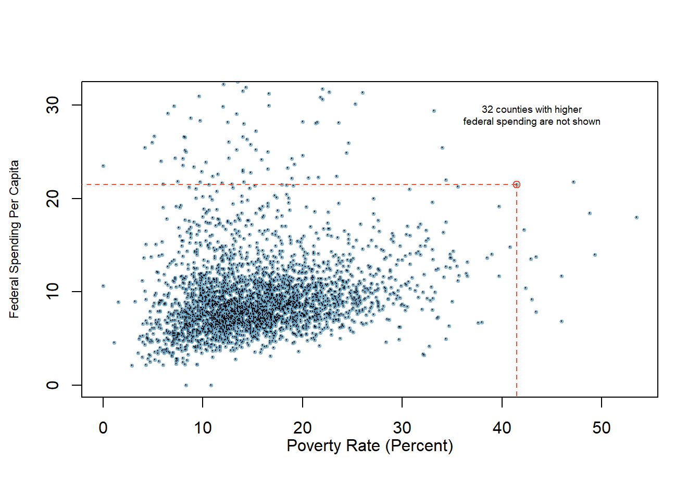
<p class="caption">(\#fig:scat5-fig)A scatterplot showing fed_spend against poverty. Owsley County of Kentucky, with a poverty rate of 41.5% and federal spending of $21.50 per capita, is highlighted.</p>
</div>

Another scatterplot is shown in Figure \@ref(fig:scat52-fig), comparing the number of line breaks `line_breaks` and number of characters `num_char` in emails for the `email50` data set. In any scatterplot, each point represents a single case. Since there are 50 cases in `email50`, there are 50 points in Figure \@ref(fig:scat52-fig).

<div class="figure">

<p class="caption">(\#fig:scat52-fig)A scatterplot of `line_breaks` versus `num_char` for the `email50` data.</p>
</div>


To put the number of characters in perspective, this paragraph has 357 characters. Looking at Figure  \@ref(fig:scat52-fig), it seems that some emails are incredibly long! Upon further investigation, we would actually find that most of the long emails use the HTML format, which means most of the characters in those emails are used to format the email rather than provide text.

\pagebreak

> **Exercise**:  
What do scatterplots reveal about the data, and how might they be useful?^[Answers may vary. Scatterplots are helpful in quickly spotting associations between variables, whether those associations represent simple or more complex relationships.]

> *Example*:   
Consider a new data set of 54 cars with two variables: vehicle price and weight.^[Subset of data from http://www.amstat.org/publications/jse/v1n1/datasets.lock.html] A scatterplot of vehicle price versus weight is shown in Figure \@ref(fig:scat53-fig). What can be said about the relationship between these variables?

<div class="figure">

<p class="caption">(\#fig:scat53-fig)A scatterplot of *price* versus *weight* for 54 cars.</p>
</div>


The relationship is evidently nonlinear, as highlighted by the dashed line. This is different from previous scatterplots we've seen which show relationships that are very linear.

> **Exercise**:    
Describe two variables that would have a horseshoe shaped association in a scatterplot.^[Consider the case where your vertical axis represents something ``good'' and your horizontal axis represents something that is only good in moderation. Health and water consumption fit this description since water becomes toxic when consumed in excessive quantities.]

### Dot plots and the mean

Sometimes two variables are one too many: only one variable may be of interest. In these cases, a dot plot provides the most basic of displays. A **dot plot** is a one-variable scatterplot; an example using the number of characters from 50 emails is shown in Figure \@ref(fig:dot5-fig).

<div class="figure">

<p class="caption">(\#fig:dot5-fig)A dot plot of `num_char` for the `email50` data set.</p>
</div>


The **mean**, sometimes called the average, is a common way to measure the center of a **distribution** of data. To find the mean number of characters in the 50 emails, we add up all the character counts and divide by the number of emails. For computational convenience, the number of characters is listed in the thousands and rounded to the first decimal.

$$\bar{x} = \frac{21.7 + 7.0 + \cdots + 15.8}{50} = 11.6$$

The sample mean is often labeled $\bar{x}$, a bar over the letter, and the letter $x$ is being used as a generic placeholder for the variable of interest, `num_char`. 

> **Mean**  
The sample mean of a numerical variable is the sum of all of the observations divided by the number of observations, Equation \@ref(eq:mean5).

\begin{equation} 
  \bar{x} = \frac{x_1+x_2+\cdots+x_n}{n}
  (\#eq:mean5)
\end{equation} 

where $x_1, x_2, \dots, x_n$ represent the $n$ observed values.


> **Exercise**:  
Examine the two equations above. What does $x_1$ correspond to? And $x_2$? Can you infer a general meaning to what $x_i$ might represent?^[$x_1$ corresponds to the number of characters in the first email in the sample (21.7, in thousands), $x_2$ to the number of characters in the second email (7.0, in thousands), and $x_i$ corresponds to the number of characters in the $i^{th}$ email in the data set.]


> **Exercise**:  
What was $n$ in this sample of emails?^[The sample size was $n=50$.]

The `email50` data set is a sample from a larger population of emails that were received in January and March. We could compute a mean for this population in the same way as the sample mean. However, there is a difference in notation: the population mean has a special label: $\mu$. The symbol $\mu$ is the Greek letter *mu* and represents the average of all observations in the population. Sometimes a subscript, such as $_x$, is used to represent which variable the population mean refers to, e.g. $\mu_x$.

> *Example*:
The average number of characters across all emails can be estimated using the sample data. Based on the sample of 50 emails, what would be a reasonable estimate of $\mu_x$, the mean number of characters in all emails in the `email` data set? (Recall that `email50` is a sample from `email`.)

The sample mean, 11.6, may provide a reasonable estimate of $\mu_x$. While this number will not be perfect, it provides a **point estimate** of the population mean. Later in the text, we will develop tools to characterize the accuracy of point estimates, and we will find that point estimates based on larger samples tend to be more accurate than those based on smaller samples.


> *Example*:  
We might like to compute the average income per person in the US. To do so, we might first think to take the mean of the per capita incomes from the 3,143 counties in the `county` data set. What would be a better approach? 

The `county` data set is special in that each county actually represents many individual people. If we were to simply average across the `income` variable, we would be treating counties with 5,000 and 5,000,000 residents equally in the calculations. Instead, we should compute the total income for each county, add up all the counties' totals, and then divide by the number of people in all the counties. If we completed these steps with the `county` data, we would find that the per capita income for the US is \$27,348.43. Had we computed the *simple* mean of per capita income across counties, the result would have been just \$22,504.70!


This previous example used what is called a **weighted mean**, which will be a key topic in the probability section. As a look ahead, the probability mass function gives the population proportions of each value and thus to find the population mean $\mu$, we will use a weighted mean.

### Histograms and shape

Dot plots show the exact value of each observation. This is useful for small data sets, but they can become hard to read with larger samples. Rather than showing the value of each observation, think of the value as belonging to a *bin*. For example, in the `email50` data set, we create a table of counts for the number of cases with character counts between 0 and 5,000, then the number of cases between 5,000 and 10,000, and so on. Observations that fall on the boundary of a bin (e.g. 5,000) are allocated to the lower bin. This tabulation is shown below. 


```
## 
##   (0,5]  (5,10] (10,15] (15,20] (20,25] (25,30] (30,35] (35,40] (40,45] (45,50] 
##      19      12       6       2       3       5       0       0       2       0 
## (50,55] (55,60] (60,65] 
##       0       0       1
```


These binned counts are plotted as bars in Figure \@ref(fig:hist5-fig) into what is called a **histogram**.

<div class="figure">

<p class="caption">(\#fig:hist5-fig)A histogram of `num_char`. This distribution is very strongly skewed to the right.</p>
</div>


Histograms provide a view of the **data density**. Higher bars represent where the data are relatively more dense. For instance, there are many more emails between 0 and 10,000 characters than emails between 10,000 and 20,000 characters in the data set. The bars make it easy to see how the density of the data changes relative to the number of characters.

Histograms are especially convenient for describing the shape of the data distribution. Figure \@ref(fig:hist5-fig) shows that most emails have a relatively small number of characters, while fewer emails have a very large number of characters. When data trail off to the right in this way and have a longer right **tail**, the shape is said to be **right skewed**.^[Other ways to describe data that are skewed to the right: **skewed to the right**, **skewed to the high end**, or **skewed to the positive end**.]

Data sets with the reverse characteristic -- a long, thin tail to the left -- are said to be **left skewed**. We also say that such a distribution has a long left tail. Data sets that show roughly equal trailing off in both directions are called **symmetric**.

> **Long tails to identify skew**  
When data trail off in one direction, the distribution has a **long tail**. If a distribution has a long left tail, it is left skewed. If a distribution has a long right tail, it is right skewed.


> **Exercise**:  
Take a look at the dot plot above, Figure \@ref(fig:dot5-fig). Can you see the skew in the data? Is it easier to see the skew in this histogram or the dot plots?^[The skew is visible in all both plots, though the dot plot is the least useful.]

> **Exercise**:   
Besides the mean, what can you see in the dot plot that you cannot see in the histogram?^[Character counts for individual emails.]

#### Making our own histogram  


Let's take some time to make a simple histogram. We will use the **ggformula** package which is a wrapper for the **ggplot** package. 

Here are two questions:  
*What do we want `R` to do?* and   
*What must we give `R` for it to do this?*   

We want `R` to make a histogram. In `ggformula` the plots have the form `gf_XXXX` so we will use the `gf_histogram`. To find options and more information type:
```
?gf_histogram
```

To start we just have to give the formulas and data to `R`.


```r
gf_histogram(~num_char,data=email50,color="black",fill="cyan")
```


> **Exercise**:   
Look at the help menu for `gf_histogram` and change the x-axis label, change the bin width to 5, and have the left bin start at 0.

Here is the code for the exercise  
```
email50 %>%
   gf_histogram(~num_char,binwidth = 5,boundary=0,
   xlab="The Number of Characters (in thousands)"
   ,color="black",fill="cyan") %>%
   gf_theme(theme_classic())
```

In addition to looking at whether a distribution is skewed or symmetric, histograms can be used to identify modes. A **mode** is represented by a prominent peak in the distribution.^[Another definition of mode, which is not typically used in statistics, is the value with the most occurrences. It is common to have *no* observations with the same value in a data set, which makes this other definition useless for many real data sets.] There is only one prominent peak in the histogram of `num_char`.

Figure \@ref(fig:histmulti-fig) show histograms that have one, two, or three prominent peaks. Such distributions are called **unimodal**, **bimodal**, and **multimodal**, respectively. Any distribution with more than 2 prominent peaks is called multimodal. Notice that there was one prominent peak in the unimodal distribution with a second less prominent peak that was not counted since it only differs from its neighboring bins by a few observations.


<div class="figure">

<p class="caption">(\#fig:histmulti-fig)Histograms that demonstrate unimodal, bimodal, and multimodal data.</p>
</div>


> **Exercise**:   
Height measurements of young students and adult teachers at a K-3 elementary school were taken. How many modes would you anticipate in this height data set?^[There might be two height groups visible in the data set: one of the students and one of the adults. That is, the data are probably bimodal. But it could be multimodal because within each group we may be able to see a difference in males and females.]

> **Looking for modes**   
Looking for modes isn't about finding a clear and correct answer about the number of modes in a distribution, which is why **prominent** is not rigorously defined in these notes. The important part of this examination is to better understand your data and how it might be structured.

### Variance and standard deviation

The mean is used to describe the center of a data set, but the *variability* in the data is also important. Here, we introduce two measures of variability: the **variance** and the **standard deviation**. Both of these are very useful in data analysis, even though the formulas are a bit tedious to calculate by hand. The standard deviation is the easier of the two to conceptually understand, and it roughly describes how far away the typical observation is from the mean. Equation \@ref(eq:var5) is the equation for sample variance. We will demonstrate it with data so that the notation is easier to understand.


\begin{equation} 
  s^2 = \sum_{i=1}^{n}\frac{(x_i-\bar{x})^2}{n-1}=\frac{(x_1-\bar{x})^2 + (x_2-\bar{x})^2 + (x_3-\bar{x})^2 + \cdots + (x_n-\bar{x})^2}{n-1}
  (\#eq:var5)
\end{equation} 

where $x_1, x_2, \dots, x_n$ represent the $n$ observed values.


We call the distance of an observation from its mean its **deviation**. Below are the deviations for the $1^{st}$, $2^{nd}$, $3^{rd}$, and $50^{th}$ observations in the `num_char` variable. For computational convenience, the number of characters is listed in the thousands and rounded to the first decimal.

$$
\begin{aligned}
x_1^{}-\bar{x} &= 21.7 - 11.6 = 10.1 \hspace{5mm}\text{ } \\
x_2^{}-\bar{x} &= 7.0 - 11.6 = -4.6 \\
x_3^{}-\bar{x} &= 0.6 - 11.6 = -11.0 \\
			&\ \vdots \\
x_{50}^{}-\bar{x} &= 15.8 - 11.6 = 4.2
\end{aligned}
$$


If we square these deviations and then take an average, the result is equal to the **sample variance**, denoted by $s_{}^2$:
$$
\begin{aligned}
s_{}^2 &= \frac{10.1_{}^2 + (-4.6)_{}^2 + (-11.0)_{}^2 + \cdots + 4.2_{}^2}{50-1} \\
	&= \frac{102.01 + 21.16 + 121.00 + \cdots + 17.64}{49} \\
	&= 172.44
\end{aligned}
$$

We divide by $n-1$, rather than dividing by $n$, when computing the variance; you need not worry about this mathematical nuance yet. Notice that squaring the deviations does two things. First, it makes large values much larger, seen by comparing $10.1^2$, $(-4.6)^2$, $(-11.0)^2$, and $4.2^2$. Second, it gets rid of any negative signs.

The sample **standard deviation** $s$ is the square root of the variance:
$$s=\sqrt{172.44} = 13.13$$
The sample standard deviation of the number of characters in an email is 13.13 thousand. A subscript of $_x$ may be added to the variance and standard deviation, i.e. $s_x^2$ and $s_x^{}$, as a reminder that these are the variance and standard deviation of the observations represented by $x_1^{}$, $x_2^{}$, ..., $x_n^{}$. The $_{x}$ subscript is usually omitted when it is clear which data the variance or standard deviation is referencing.

> **Variance and standard deviation**   
The variance is roughly the average squared distance from the mean. The standard deviation is the square root of the variance and describes how close the data are to the mean.

Formulas and methods used to compute the variance and standard deviation for a population are similar to those used for a sample.^[The only difference is that the population variance has a division by $n$ instead of $n-1$.] However, like the mean, the population values have special symbols: $\sigma_{}^2$ for the variance and $\sigma$ for the standard deviation. The symbol $\sigma$ is the Greek letter *sigma*.


> **Tip: standard deviation describes variability**  
Focus on the conceptual meaning of the standard deviation as a descriptor of variability rather than the formulas. Usually 70\% of the data will be within one standard deviation of the mean and about 95\% will be within two standard deviations. However, as we have seen, these percentages are not strict rules.


<div class="figure">
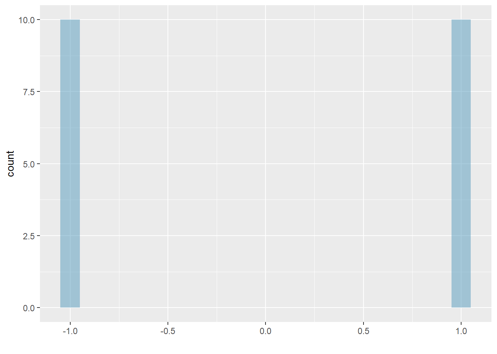
<p class="caption">(\#fig:hist53-fig)The first of three very different population distributions with the same mean, 0, and standard deviation, 1.</p>
</div>

<div class="figure">

<p class="caption">(\#fig:hist54-fig)The second plot with mean 0 and standard deviation 1.</p>
</div>

<div class="figure">

<p class="caption">(\#fig:hist55-fig)The final plot with mean 0 and standard deviation 1.</p>
</div>


> **Exercise**:  
Earlier the concept of shape of a distribution was introduced. A good description of the shape of a distribution should include modality and whether the distribution is symmetric or skewed to one side. Using the three figures, Figures \@ref(fig:hist53-fig), \@ref(fig:hist54-fig), and \@ref(fig:hist55-fig) as an example, explain why such a description is important.^[Starting with Figure \@ref(fig:hist53-fig), the three figures show three distributions that look quite different, but all have the same mean, variance, and standard deviation. Using modality, we can distinguish between the first plot (bimodal) and the last two (unimodal). Using skewness, we can distinguish between the last plot (right skewed) and the first two. While a picture, like a histogram, tells a more complete story, we can use modality and shape (symmetry/skew) to characterize basic information about a distribution.]

> *Example*:   
Describe the distribution of the `num_char` variable using the histogram in Figure \@ref(fig:hist5-fig). The description should incorporate the center, variability, and shape of the distribution, and it should also be placed in context: the number of characters in emails. Also note any especially unusual cases.^[The distribution of email character counts is unimodal and very strongly skewed to the high end. Many of the counts fall near the mean at 11,600, and most fall within one standard deviation (13,130) of the mean. There is one exceptionally long email with about 65,000 characters.]

In practice, the variance and standard deviation are sometimes used as a means to an end, where the *end* is being able to accurately estimate the uncertainty associated with a sample statistic. For example, later in the course we will use the variance and standard deviation to assess how close the sample mean is to the population mean.

### Box plots, quartiles, and the median

A **box plot** summarizes a data set using five statistics while also plotting unusual observations. Figure \@ref(fig:box-fig) provides a vertical dot plot alongside a box plot of the `num_char` variable from the `email50` data set.


<div class="figure">

<p class="caption">(\#fig:box-fig)A vertical dot plot next to a labeled box plot for the number of characters in 50 emails. The median (6,890), splits the data into the bottom 50% and the top 50%, marked in the dot plot by horizontal dashes and open circles, respectively.</p>
</div>


The first step in building a box plot is drawing a dark line denoting the **median**, which splits the data in half. Figure \@ref(fig:box-fig) shows 50\% of the data falling below the median (red dashes) and the other 50\% falling above the median (blue open circles). There are 50 character counts in the data set (an even number) so the data are perfectly split into two groups of 25. We take the median in this case to be the average of the two observations closest to the $50^{th}$ percentile: $(\text{6,768} + \text{7,012}) / 2 = \text{6,890}$. When there are an odd number of observations, there will be exactly one observation that splits the data into two halves, and in this case that observation is the median (no average needed).

> **Median: the number in the middle**   
If the data are ordered from smallest to largest, the **median** is the observation right in the middle. If there are an even number of observations, there will be two values in the middle, and the median is taken as their average.

The second step in building a box plot is drawing a rectangle to represent the middle 50\% of the data. The total length of the box, shown vertically in Figure \@ref(fig:box-fig), is called the **interquartile range** (IQR, for short). It, like the standard deviation, is a measure of variability in data. The more variable the data, the larger the standard deviation and IQR. The two boundaries of the box are called the **first quartile** (the $25^{th}$ percentile, i.e. 25\% of the data fall below this value) and the **third quartile** (the $75^{th}$ percentile), and these are often labeled $Q_1$ and $Q_3$, respectively.

> **Interquartile range (IQR)**   
The IQR is the length of the box in a box plot. It is computed as
$$ IQR = Q_3 - Q_1 $$
where $Q_1$ and $Q_3$ are the $25^{th}$ and $75^{th}$ percentiles.


> **Exercise**:   
What percent of the data fall between $Q_1$ and the median? What percent is between the median and $Q_3$?^[Since $Q_1$ and $Q_3$ capture the middle 50% of the data and the median splits the data in the middle, 25% of the data fall between $Q_1$ and the median, and another 25% falls between the median and $Q_3$.]


Extending out from the box, the **whiskers** attempt to capture the data outside of the box, however, their reach is never allowed to be more than $1.5\times IQR$.^[While the choice of exactly 1.5 is arbitrary, it is the most commonly used value for box plots.] They capture everything within this reach. In Figure \@ref(fig:box-fig), the upper whisker does not extend to the last three points, which are beyond $Q_3 + 1.5\times IQR$, and so it extends only to the last point below this limit. The lower whisker stops at the lowest value, 33, since there is no additional data to reach; the lower whisker's limit is not shown in the figure because the plot does not extend down to $Q_1 - 1.5\times IQR$. In a sense, the box is like the body of the box plot and the whiskers are like its arms trying to reach the rest of the data.

Any observation that lies beyond the whiskers is labeled with a dot. The purpose of labeling these points -- instead of just extending the whiskers to the minimum and maximum observed values -- is to help identify any observations that appear to be unusually distant from the rest of the data. Unusually distant observations are called **outliers**. In this case, it would be reasonable to classify the emails with character counts of 41,623, 42,793, and 64,401 as outliers since they are numerically distant from most of the data.

> **Outliers are extreme**   
An **outlier** is an observation that is extreme relative to the rest of the data.


> **Why it is important to look for outliers**   
Examination of data for possible outliers serves many useful purposes, including  
1. Identifying **strong skew** in the distribution.  
2. Identifying data collection or entry errors. For instance, we re-examined the email purported to have 64,401 characters to ensure this value was accurate.  
3. Providing insight into interesting properties of the data.

> **Exercise**:   
The observation with value 64,401, an outlier, was found to be an accurate observation. What would such an observation suggest about the nature of character counts in emails?^[That occasionally there may be very long emails.]

> **Exercise**:   
Using Figure \@ref(fig:box-fig), estimate the following values for `num_char` in the `email50` data set:  
(a) $Q_1$,  
(b) $Q_3$, and  
(c) IQR.^[These visual estimates will vary a little from one person to the next: $Q_1$ ~ 3,000, $Q_3$ ~ 15,000, IQR=$Q_3 - Q_1$ ~ 12,000. (The true values: $Q_1=$ 2,536, $Q_3=$ 15,411, IQR =  12,875.)]

Of course `R` can calculate these summary statistics for us. First we will do these calculations individually and then in one function call. Remember to ask what you want `R` to do and what it needs.


```r
mean(~num_char,data=email50)
```

```
## [1] 11.59822
```

```r
sd(~num_char,data=email50)
```

```
## [1] 13.12526
```

```r
quantile(~num_char,data=email50)
```

```
##       0%      25%      50%      75%     100% 
##  0.05700  2.53550  6.88950 15.41075 64.40100
```

```r
iqr(~num_char,data=email50)
```

```
## [1] 12.87525
```


```r
favstats(~num_char,data=email50)
```

```
##    min     Q1 median       Q3    max     mean       sd  n missing
##  0.057 2.5355 6.8895 15.41075 64.401 11.59822 13.12526 50       0
```


### Robust statistics 

How are the *sample statistics* of the `num_char` data set affected by the observation with value 64,401? What would have happened if this email wasn't observed? What would happen to these *summary statistics* if the observation at 64,401 had been even larger, say 150,000? These scenarios are plotted alongside the original data in Figure \@ref(fig:box2-fig), and sample statistics are computed in `R`.

<div class="figure">
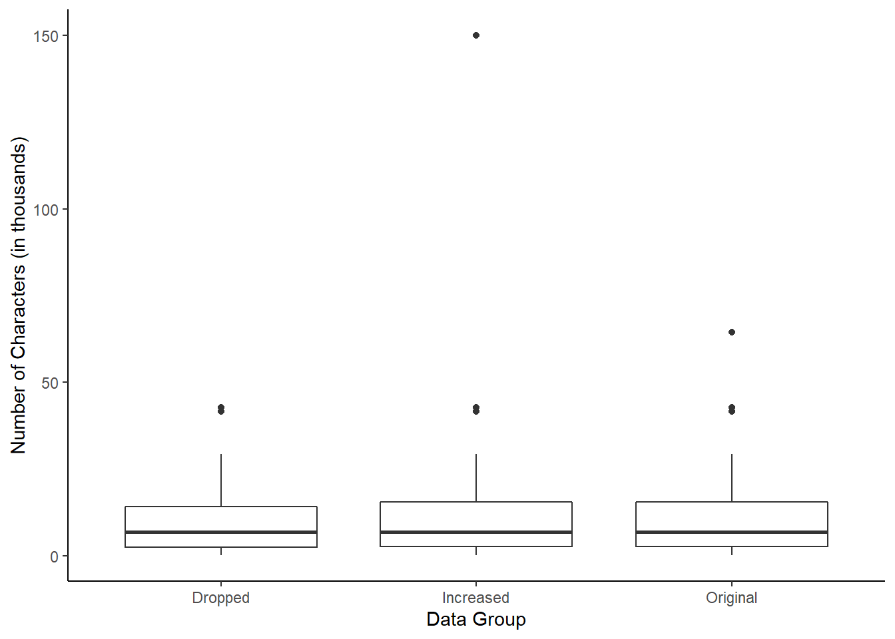
<p class="caption">(\#fig:box2-fig)Box plots of the original character count data and two modified data sets.</p>
</div>


```
##       group   min     Q1 median       Q3     max     mean       sd  n missing
## 1   Dropped 0.057 2.4540 6.7680 14.15600  42.793 10.52061 10.79768 49       0
## 2 Increased 0.057 2.5355 6.8895 15.41075 150.000 13.31020 22.43436 50       0
## 3  Original 0.057 2.5355 6.8895 15.41075  64.401 11.59822 13.12526 50       0
```

The code used to generate this table is


```r
p1 <- email50$num_char
p2 <- p1[-which.max(p1)]
p3 <- p1
p3[which.max(p1)] <- 150

robust <- data.frame(value= c(p1,p2,p3),group=c(rep("Original",50),rep("Dropped",49),rep("Increased",50)))

favstats(value~group,data=robust)
```

Notice by using the formula notation, we were able to calculate the summary statistics for each group.

> **Exercise**:    
(a) Which is more affected by extreme observations, the mean or median? The data summary may be helpful.  
(b) Is the standard deviation or IQR more affected by extreme observations?^[(a) Mean is affected more. (b) Standard deviation is affected more.]

The median and IQR are called **robust estimates** because extreme observations have little effect on their values. The mean and standard deviation are much more affected by changes in extreme observations.

> *Example*:   
The median and IQR do not change much under the three scenarios above. Why might this be the case?^[The median and IQR are only sensitive to numbers near $Q_1$, the median, and $Q_3$. Since values in these regions are relatively stable -- there aren't large jumps between observations -- the median and IQR estimates are also quite stable.]


> **Exercise**:   
The distribution of vehicle prices tends to be right skewed, with a few luxury and sports cars lingering out into the right tail. If you were searching for a new car and cared about price, should you be more interested in the mean or median price of vehicles sold, assuming you are in the market for a regular car?^[Buyers of a *regular car* should be concerned about the median price. High-end car sales can drastically inflate the mean price while the median will be more robust to the influence of those sales.]


### Transforming data 

When data are very strongly skewed, we sometimes transform them so they are easier to model. Consider the histogram of salaries for Major League Baseball players' salaries from 2010, which is shown in Figure \@ref(fig:hist510-fig).

<div class="figure">
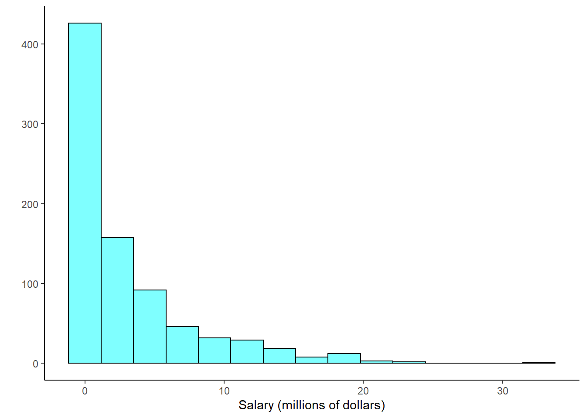
<p class="caption">(\#fig:hist510-fig)Histogram of MLB player salaries for 2010, in millions of dollars.</p>
</div>


> *Example*:   
The histogram of MLB player salaries is useful in that we can see the data are extremely skewed and centered (as gauged by the median) at about \$1 million. What isn't useful about this plot?^[Most of the data are collected into one bin in the histogram and the data are so strongly skewed that many details in the data are obscured.]


There are some standard transformations that are often applied when much of the data cluster near zero (relative to the larger values in the data set) and all observations are positive. A **transformation** is a rescaling of the data using a function. For instance, a plot of the natural logarithm^[Statisticians often write the natural logarithm as $\log$. You might be more familiar with it being written as $\ln$.] of player salaries results in a new histogram in Figure \@ref(fig:hist512-fig). Transformed data are sometimes easier to work with when applying statistical models because the transformed data are much less skewed and outliers are usually less extreme.

<div class="figure">

<p class="caption">(\#fig:hist512-fig)Histogram of the log-transformed MLB player salaries for 2010.</p>
</div>


Transformations can also be applied to one or both variables in a scatterplot. A scatterplot of the `line_breaks` and `num_char` variables is shown in Figure \@ref(fig:scat52-fig) above. We can see a positive association between the variables and that many observations are clustered near zero. Later in this text, we might want to use a straight line to model the data. However, we'll find that the data in their current state cannot be modeled very well. Figure \@ref(fig:scat513-fig) shows a scatterplot where both the `line_breaks` and `num_char` variables have been transformed using a log (base $e$) transformation. While there is a positive association in each plot, the transformed data show a steadier trend, which is easier to model than the untransformed data.

<div class="figure">

<p class="caption">(\#fig:scat513-fig)A scatterplot of `line_breaks` versus `num_char` for the `email50` data but where each variable has been log-transformed.</p>
</div>

Transformations other than the logarithm can be useful, too. For instance, the square root ($\sqrt{\text{original observation}}$) and inverse ($\frac{1}{\text{original observation}}$) are used by statisticians. Common goals in transforming data are to see the data structure differently, reduce skew, assist in modeling, or straighten a nonlinear relationship in a scatterplot.


## Homework Problems

Create an Rmd file for the work including headers, file creation data, and explanation of your work. Make sure your plots have a title and the axes are labeled. 

1. **Mammals exploratory**  

Data were collected on 39 species of mammals distributed over 13 orders.  The data is in the **openintro** package as `mammals`

a. Using help, report the units for the variable `brain_Wt`.  
b. Using `inspect` how many variables are numeric?  
c. What type of variable is `danger`?
d. Create a histogram of `total_sleep` and describe the distribution.  
e. Create a boxplot of `life_span` and describe the distribution.  
f. Report the mean and median life span of a mammal.  
g. Calculate the summary statistics for `life_span` broken down by `danger`. What is the standard deviation of life span in danger outcome 5?

2. **Mammals life spans**  

Continue using the `mammals` data set.

a. Create side-by-side boxplots for `life_span` broken down by `exposure`. Note: you will have to change `exposure` to a `factor()`. Report on any findings.  
b. What happened to the median and third quartile in exposure group 4?
c. Create faceted histograms. What are the shortcomings of this plot?
d. Create a new variable `exposed` that is a factor with level `Low` if exposure is `1` or `2` and `High` otherwise.
e. Repeat part c with the new variable. Explain what you see in the plot.


3. **Mammals life spans continued**  

a. Create a scatterplot of life span versus length of gestation.  
b. What type of an association is apparent between life span and length of gestation?   
c. What type of an association would you expect to see if the axes of the plot were reversed, i.e. if we plotted length of gestation versus life span?
d. Create the new scatterplot suggested in c.  
e. Are life span and length of gestation independent? Explain your reasoning.


<!--chapter:end:05-Numerical-Data.Rmd-->

# Categorical Data {#CATDATA}


## Objectives

1) Define and use properly in context all new terminology. 
2) Generate in `R` tables for categorical variable(s).  
3) Generate in `R` appropriate graphical summaries of categorical and numerical variables.  
4) Be able to interpret and explain output both graphically and numerically.


## Categorical data

Like numerical data, categorical data can also be organized and analyzed. This section introduces tables and other basic tools for categorical data. Remember at the beginning of this block of material, our case study had categorical data so we have seen some of the ideas in this lesson. 

The `email50` data set represents a sample from a larger email data set called `email`. This larger data set contains information on 3,921 emails. In this section we will use the email data set to examine whether the presence of numbers, small or large, in an email provides any useful value in classifying email as spam or not spam.

### Contingency tables and bar plots

In the `email` data set we have two variables: `spam` and `number` that we want to summarize. Let's use `inspect()` to get information and insight about the two variables. We can also type `?email` to learn more about the data. First load the `openintro` library.


```r
library(openintro)
```


```r
email %>%
  select(spam,number) %>%
  inspect()
```

```
## 
## categorical variables:  
##     name  class levels    n missing
## 1   spam factor      2 3921       0
## 2 number factor      3 3921       0
##                                    distribution
## 1 0 (90.6%), 1 (9.4%)                          
## 2 small (72.1%), none (14%) ...
```

Notice the use of the `pipe` operator and how it adds to the ease of reading the code. The `select()` function allows us to narrow the variables down to the two of interest. Then `inspect()` gives us information about those variables. We read from top line; we start with the data set `email`, input it into `select()` and select variables from it, and then use `inspect()` to summarize the variables.

As is indicated `number` is a categorical variable that describes whether an email contains no numbers, only small numbers (values under 1 million), or at least one big number (a value of 1 million or more). The variable `spam` is a numeric variable where `1` indicates the email is spam. To treat it as categorical we will want to change it to a **factor** but first we will build a table that summarizes data for the two variables, see Table \@ref(tab:contin1-tab). This table is called a **contingency table**. Each value in the table represents the number of times a particular combination of variable outcomes occurred. We will show you the code to generate the contingency table.

<table>
<caption>(\#tab:contin1-tab)A contingency table for the `email` data.</caption>
 <thead>
<tr>
<th style="border-bottom:hidden;padding-bottom:0; padding-left:3px;padding-right:3px;text-align: center; " colspan="1"><div style="border-bottom: 1px solid #ddd; padding-bottom: 5px; ">Spam</div></th>
<th style="border-bottom:hidden;padding-bottom:0; padding-left:3px;padding-right:3px;text-align: center; " colspan="3"><div style="border-bottom: 1px solid #ddd; padding-bottom: 5px; ">Number</div></th>
<th style="empty-cells: hide;border-bottom:hidden;" colspan="1"></th>
</tr>
  <tr>
   <th style="text-align:left;">   </th>
   <th style="text-align:right;"> none </th>
   <th style="text-align:right;"> small </th>
   <th style="text-align:right;"> big </th>
   <th style="text-align:right;"> Total </th>
  </tr>
 </thead>
<tbody>
  <tr>
   <td style="text-align:left;"> 0 </td>
   <td style="text-align:right;"> 400 </td>
   <td style="text-align:right;"> 2659 </td>
   <td style="text-align:right;"> 495 </td>
   <td style="text-align:right;"> 3554 </td>
  </tr>
  <tr>
   <td style="text-align:left;"> 1 </td>
   <td style="text-align:right;"> 149 </td>
   <td style="text-align:right;"> 168 </td>
   <td style="text-align:right;"> 50 </td>
   <td style="text-align:right;"> 367 </td>
  </tr>
  <tr>
   <td style="text-align:left;"> Total </td>
   <td style="text-align:right;"> 549 </td>
   <td style="text-align:right;"> 2827 </td>
   <td style="text-align:right;"> 545 </td>
   <td style="text-align:right;"> 3921 </td>
  </tr>
</tbody>
</table>


```r
tally(~spam+number,data=email,margins = TRUE)
```

```
##        number
## spam    none small  big Total
##   0      400  2659  495  3554
##   1      149   168   50   367
##   Total  549  2827  545  3921
```

The value 149 corresponds to the number of emails in the data set that are spam *and* had no number listed in the email. Row and column totals are also included. The **row totals**  provide the total counts across each row (e.g. $149 + 168 + 50 = 367$), and **column totals** are total counts down each column. The row and column totals are known as **marginal** counts and the values in the table, such as 149, as **joint** counts.

Let's turn `spam` into a factor and update the `email` data object. We will use `mutate()` to do this.


```r
email <- email %>%
  mutate(spam = factor(email$spam,levels=c(1,0),labels=c("spam","not spam")))
```

Now checking the data again.


```r
email %>%
  select(spam,number) %>%
  inspect()
```

```
## 
## categorical variables:  
##     name  class levels    n missing
## 1   spam factor      2 3921       0
## 2 number factor      3 3921       0
##                                    distribution
## 1 not spam (90.6%), spam (9.4%)                
## 2 small (72.1%), none (14%) ...
```

Let's generate the table again.


```r
tally(~spam+number,data=email,margins = TRUE)
```

```
##           number
## spam       none small  big Total
##   spam      149   168   50   367
##   not spam  400  2659  495  3554
##   Total     549  2827  545  3921
```


A table for a single variable is called a **frequency table**. The table below is a frequency table for the `number` variable. 


```r
tally(~number,data=email)
```

```
## number
##  none small   big 
##   549  2827   545
```


If we replaced the counts with percentages or proportions, the table would be called a **relative frequency table**.


```r
tally(~number,data=email,format='proportion')
```

```
## number
##      none     small       big 
## 0.1400153 0.7209895 0.1389952
```


```r
round(tally(~number,data=email,format='percent'),2)
```

```
## number
##  none small   big 
##  14.0  72.1  13.9
```

A bar plot is a common way to display a single categorical variable. Figure \@ref(fig:bar61-fig) shows a **bar plot** for the `number` variable. 

(ref:quote61) Bar chart of the `number` variable.


```r
email %>%
  gf_bar(~number) %>%
  gf_theme(theme_bw()) %>%
  gf_labs(x="Size of Number",y="Count")
```

<div class="figure">
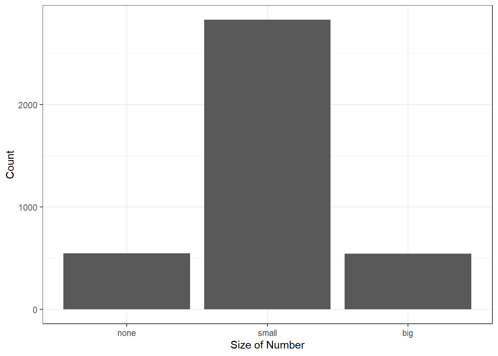
<p class="caption">(\#fig:bar61-fig)(ref:quote61)</p>
</div>


Next the counts are converted into proportions (e.g. $549/3921=0.140$ for `none`) in Figure \@ref(fig:bar62-fig).

(ref:quote62) Bar chart of the `number` variable as a proportion.


```r
email %>%
  gf_props(~number) %>%
  gf_theme(theme_bw()) %>%
  gf_labs(x="Size of Number",y="Proportion")
```

<div class="figure">

<p class="caption">(\#fig:bar62-fig)(ref:quote62)</p>
</div>

Again, let's clean up the plot into a style that we could use in a report.


```r
email %>%
  gf_props(~number,title="The proportions of emails with a number in it",
           subtitle="From 2012",xlab="Type of number in the email",
           ylab="Proportion of emails") %>%
  gf_theme(theme_bw())
```

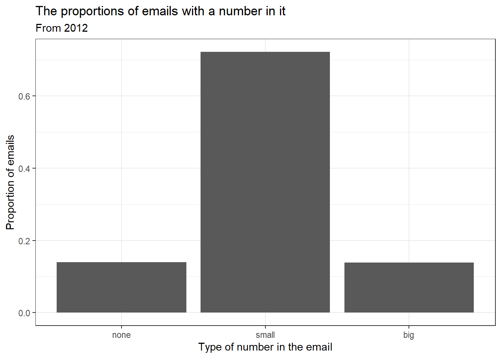


### Column proportions

The table below shows the column proportions. The **column proportions** are computed as the counts divided by their column totals. The value 149 at the intersection of *spam* and *none* is replaced by $149/549=0.271$, i.e. 149 divided by its column total, 549. So what does 0.271 represent? It corresponds to the proportion of emails in the sample with no numbers that are spam. We are **conditioning**, restricting, on emails with no number. This rate of spam is much higher than emails with only small numbers (5.9\%) or big numbers (9.2\%). Because these spam rates vary between the three levels of `number` (*none*, *small*, *big*), this provides evidence that the `spam` and `number` variables are associated.


```r
tally(spam~number,data=email,margins = TRUE,format='proportion')
```

```
##           number
## spam             none      small        big
##   spam     0.27140255 0.05942695 0.09174312
##   not spam 0.72859745 0.94057305 0.90825688
##   Total    1.00000000 1.00000000 1.00000000
```


The `tally()` function will always condition on the variable on the right hand side of the tilde, ~, when calculating proportions and thus only generate column proportions. The more general `table()` function of `R` will allow either column or row proportions.

> **Exercise**:   
Create a table of column proportions where the variable `spam` is the column variable.


```r
tally(number~spam,data=email,margins = TRUE,format='proportion')
```

```
##        spam
## number       spam  not spam
##   none  0.4059946 0.1125492
##   small 0.4577657 0.7481711
##   big   0.1362398 0.1392797
##   Total 1.0000000 1.0000000
```

> **Exercise**:   
In the table you just created, what does 0.748 represent?^[0.748 represents the proportions of emails with no spam that had a small number in it.] 


>*Example*:  
Data scientists use statistics to filter spam from incoming email messages. By noting specific characteristics of an email, a data scientist may be able to classify some emails as spam or not spam with high accuracy. One of those characteristics is whether the email contains no numbers, small numbers, or big numbers. Another characteristic is whether or not an email has any HTML content. A contingency table for the `spam` and `format` variables is needed.  
1 Make `format` into a categorical factor variable.The levels should be "text" and "HTML".^[From the help menu on the data HTML is coded as a 1]  
2 Create a contingency table from the `email` data set with `format` in the columns and `spam` in the rows.  

In deciding which variable to use as a column, the data scientist would be interested in how the proportion of spam changes within each email format. This corresponds to column proportions based on `format`: the proportion of spam in plain text emails and the proportion of spam in HTML emails.


```r
email <- email %>%
  mutate(format = factor(email$format,levels=c(1,0),labels=c("HTML","text")))
```


```r
tally(spam~format,data=email,margins = TRUE,format="proportion")
```

```
##           format
## spam             HTML       text
##   spam     0.05796038 0.17489540
##   not spam 0.94203962 0.82510460
##   Total    1.00000000 1.00000000
```


In generating the column proportions, we can see that a higher fraction of plain text emails are spam ($209/1195 = 17.5\%$) than compared to HTML emails ($158/2726 = 5.8\%$). This information on its own is insufficient to classify an email as spam or not spam, as over 80\% of plain text emails are not spam. Yet, when we carefully combine this information with many other characteristics, such as `number` and other variables, we stand a reasonable chance of being able to classify some email as spam or not spam. 

In constructing a table, we need to think about which variable we want in the column and which in the row. The formula format in some way makes us think about the response and predictor variables. However in some cases, it is not clear which variable should be in the column and row and the analyst must decide the point to be made with the table. Before settling on one form for a table, it is important to consider the audience and the message they are to receive from the table.

> **Exercise**:  
Create two tables with `number` and `spam` where each are in the column, so two tables where you change which variable is in the column. Which would be more useful to someone hoping to identify spam emails using the `number` variable?^[The column proportions with `number` in the columns will probably be most useful, which makes it easier to see that emails with small numbers are spam about 5.9\% of the time (relatively rare). We would also see that about 27.1\% of emails with no numbers are spam, and 9.2\% of emails with big numbers are spam.]


```r
tally(spam~number,email,format='proportion',margin=TRUE)
```

```
##           number
## spam             none      small        big
##   spam     0.27140255 0.05942695 0.09174312
##   not spam 0.72859745 0.94057305 0.90825688
##   Total    1.00000000 1.00000000 1.00000000
```


```r
tally(number~spam,email,format='proportion',margin=TRUE)
```

```
##        spam
## number       spam  not spam
##   none  0.4059946 0.1125492
##   small 0.4577657 0.7481711
##   big   0.1362398 0.1392797
##   Total 1.0000000 1.0000000
```

### Segmented bar and mosaic plots

Contingency tables using column proportions are especially useful for examining how two categorical variables are related. Segmented bar and mosaic plots provide a way to visualize the information in these tables.

A **segmented bar plot** is a graphical display of contingency table information. For example, a segmented bar plot representing the table with `number` in the column is shown in Figure \@ref(fig:barseg61-fig), where we have first created a bar plot using the `number` variable and then separated each group by the levels of `spam`. 

(ref:quote63) Segmented bar plot for numbers found in `emails`, where the counts have been further broken down by `spam`.


```r
email %>%
  gf_bar(~number,fill=~spam) %>%
  gf_theme(theme_bw()) %>%
  gf_labs(x="Size of Number",y="Count")
```

<div class="figure">

<p class="caption">(\#fig:barseg61-fig)(ref:quote63)</p>
</div>


The column proportions of the table have been translated into a standardized segmented bar plot in Figure \@ref(fig:barseg62-fig), which is a helpful visualization of the fraction of spam emails in each level of `number`.

(ref:quote64) Standardized version of Figure \@ref(fig:barseg61-fig).


```r
email %>%
  gf_props(~number,fill=~spam,position='fill') %>%
  gf_theme(theme_bw()) %>%
  gf_labs(x="Size of Number",y="Proportion")
```

<div class="figure">

<p class="caption">(\#fig:barseg62-fig)(ref:quote64)</p>
</div>


> *Example*:  
Examine both of the segmented bar plots. Which is more useful?

Figure \@ref(fig:barseg61-fig)  contains more information, but Figure \@ref(fig:barseg62-fig) presents the information more clearly. This second plot makes it clear that emails with no number have a relatively high rate of spam email -- about 27\%! On the other hand, less than 10\% of email with small or big numbers are spam.

Since the proportion of spam changes across the groups in Figure \@ref(fig:barseg62-fig), we can conclude the variables are dependent, which is something we were also able to discern using table proportions. Because both the `none` and `big` groups have relatively few observations compared to the `small` group, the association is more difficult to see in Figure \@ref(fig:barseg61-fig).

In some other cases, a segmented bar plot that is not standardized will be more useful in communicating important information. Before settling on a particular segmented bar plot, create standardized and non-standardized forms and decide which is more effective at communicating features of the data.


A **mosaic plot** is a graphical display of contingency table information that is similar to a bar plot for one variable or a segmented bar plot when using two variables. It seems strange, but mosaic plots are not part of the **mosaic** package. We must load another set of packages called **vcd** and **vcdExtra**. Mosaic plot displays help to visualize the pattern of associations among variables in two-way and larger tables. Mosaic plots are controversial since they rely on the perception of area. Human vision is not good at distinguishing areas. 


We will introduce mosaic plots because it is another way to visualize contingency tables. Figure \@ref(fig:mosaic61-fig) shows a mosaic plot for the `number` variable. Each row represents a level of `number`, and the row heights correspond to the proportion of emails of each number type. For instance, there are fewer emails with no numbers than emails with only small numbers, so the `none` outcome row is shorter in height. In general, mosaic plots use box *areas* to represent the number of observations. Since there is only one variable, the widths are all constant. Thus area is simply related to row height making this visual easy to read.


```r
library(vcd)
```

(ref:quote65) Mosaic plot where emails are grouped by the `number` variable.


```r
mosaic(~number,data=email)
```

<div class="figure">

<p class="caption">(\#fig:mosaic61-fig)(ref:quote65)</p>
</div>

This one-variable mosaic plot can be further divided into pieces as in Figure \@ref(fig:mosaic62-fig) using the `spam` variable. The first variable in the formula is used to determine row height. That is, each row is split proportionally according to the fraction of emails in each number category, these heights are similar to Figure \@ref(fig:mosaic61-fig). Next each row is split horizontally according to the proportion of emails that were spam in that number group. For example, the second row, representing emails with only small numbers, was divided into emails that were spam (left) and not spam (right). The area of the rectangles is proportional to the proportions in the table where each cell count is divided by the total count. First we will generate the table and then represent it as a mosaic plot.


```r
tally(~number+spam,data=email,format='proportion')
```

```
##        spam
## number        spam   not spam
##   none  0.03800051 0.10201479
##   small 0.04284621 0.67814333
##   big   0.01275185 0.12624331
```

(ref:quote66) Mosaic plot with `number` as the first variable.  


```r
mosaic(~number+spam,data=email)
```

<div class="figure">

<p class="caption">(\#fig:mosaic62-fig)(ref:quote66)</p>
</div>

These plots are hard to use in a visual comparison of area. For example, is the area for *small* number *spam* emails different from *none* number *spam* emails? The rectangles have different shapes but from the table we can tell the areas are close.

An important use of the mosaic plot is to determine if an association between variables may be present. The bottom of the first column represents spam emails that had big numbers, and the bottom row of the second column represents regular emails that had big numbers. We can again use this plot to see that the `spam` and `number` variables are associated since some rows are divided in different vertical locations than others, which was the same technique used for checking an association in the standardized version of the segmented bar plot.

In a similar way, a mosaic plot representing column proportions where *spam* is in the column could be constructed. To completely understand the mosaic plot as shown in Figure \@ref(fig:mosaic63-fig) let's first find the proportions of `spam`. 


```r
tally(~spam,data=email,format="proportion")
```

```
## spam
##       spam   not spam 
## 0.09359857 0.90640143
```

So the row heights will be split 90-10. Next let's find the proportions of number within each value of spam. In the spam row, *none* will be 41\%, *small* will be 46\%, and *big* will be 13\%.


```r
tally(number~spam,data=email,margins = TRUE,format="proportion")
```

```
##        spam
## number       spam  not spam
##   none  0.4059946 0.1125492
##   small 0.4577657 0.7481711
##   big   0.1362398 0.1392797
##   Total 1.0000000 1.0000000
```

However, because it is more insightful for this application to consider the fraction of spam in each category of the `number` variable, we prefer Figure \@ref(fig:mosaic62-fig).

(ref:quote67) Mosaic plot with `spam` as the first variable


```r
mosaic(~spam+number,data=email)
```

<div class="figure">

<p class="caption">(\#fig:mosaic63-fig)(ref:quote67)</p>
</div>


### The only pie chart you will see in this course, hopefully

While pie charts are well known, they are not typically as useful as other charts in a data analysis. A **pie chart** is shown in Figure \@ref(fig:pie61-fig). It is generally more difficult to compare group sizes in a pie chart than in a bar plot, especially when categories have nearly identical counts or proportions. In the case of the *none* and *big* categories, the difference is so slight you may be unable to distinguish any difference in group sizes.


```r
pie(table(email$number), col=COL[c(3,1,2)], radius=0.75)
```

<div class="figure">

<p class="caption">(\#fig:pie61-fig)A pie chart number for the email data set.</p>
</div>

Pie charts are popular in the Air Force due to the ease of generating them in Excel and PowerPoint. However, the values for each slice are often printed on top of the chart making the chart irrelevant. We recommend a minimum use of pie charts in your work.

### Comparing numerical data across groups

Some of the more interesting investigations can be considered by examining numerical data across groups. This is the case where one variable is categorical and the other is numerical. The methods required here aren't really new. All that is required is to make a numerical plot for each group. Here two convenient methods are introduced: side-by-side box plots and density plots.

We will take a look again at the subset of `county_complete` data set and compare the median household income for counties that gained population from 2000 to 2010 versus counties that had no gain. While we might like to make a causal connection here, remember that these are observational data and so such an interpretation would be unjustified.

This section will give us a chance to perform some data wrangling. We will be using the `tidyverse` verbs in the process. Data wrangling is an important part of analysis work and typically takes a significant portion of the analysis work.

Here is the code to generate the data we need.


```r
library(usdata)
```


```r
county_tidy <- county_complete %>% 
  select(name, state, pop2000, pop2010, fed_spend=fed_spending_2009, poverty=poverty_2010, 
         homeownership = homeownership_2010, multi_unit = housing_multi_unit_2010, 
         income = per_capita_income_2010, med_income = median_household_income_2010) %>%
  mutate(fed_spend=fed_spend/pop2010)
```


First, as a reminder, let's look at the data. 

*What do we want `R` to do*? We want to select the variables `pop2000`, `pop2010`, and `med_income`.  

*What does `R` need*? It needs the data object, and variable names.

We will use the `select()` and `inspect()` functions. 


```r
county_tidy %>%
  select(pop2000,pop2010,med_income) %>%
  inspect()
```

```
## 
## quantitative variables:  
##            name   class   min       Q1 median    Q3     max     mean        sd
## ...1    pop2000 numeric    67 11223.50  24621 61775 9519338 89649.99 292547.67
## ...2    pop2010 numeric    82 11114.50  25872 66780 9818605 98262.04 312946.70
## ...3 med_income numeric 19351 36956.25  42450 49144  115574 44274.12  11547.49
##         n missing
## ...1 3139       3
## ...2 3142       0
## ...3 3142       0
```

Notice that three counties are missing population values, reported as `NA`. Let's remove them and find which counties increased population by creating a new variable.


```r
cc_reduced <- county_tidy %>%
  drop_na(pop2000) %>%
  select(pop2000,pop2010,med_income) %>%
  mutate(pop_gain = sign(pop2010-pop2000))
```


```r
tally(~pop_gain,data=cc_reduced)
```

```
## pop_gain
##   -1    0    1 
## 1097    1 2041
```


There were 2,041 counties where the population increased from 2000 to 2010, and there were 1,098 counties with no gain, only 1 county had a net of zero, or a loss. Let's just look at the counties with a gain or loss in side-by-side boxplot. Again, we will use `filter()` to select the two groups and then make the variable `pop_gain` into a categorical variable, more data wrangling.


```r
cc_reduced <- cc_reduced %>%
  filter(pop_gain != 0) %>%
  mutate(pop_gain = factor(pop_gain,levels=c(-1,1),labels=c("Loss","Gain")))
```


```r
inspect(cc_reduced)
```

```
## 
## categorical variables:  
##       name  class levels    n missing
## 1 pop_gain factor      2 3138       0
##                                    distribution
## 1 Gain (65%), Loss (35%)                       
## 
## quantitative variables:  
##            name   class   min       Q1  median      Q3     max     mean
## ...1    pop2000 numeric    67 11217.25 24608.0 61783.5 9519338 89669.37
## ...2    pop2010 numeric    82 11127.00 25872.0 66972.0 9818605 98359.23
## ...3 med_income numeric 19351 36950.00 42443.5 49120.0  115574 44253.24
##             sd    n missing
## ...1 292592.28 3138       0
## ...2 313133.28 3138       0
## ...3  11528.95 3138       0
```

The **side-by-side box plot** is a traditional tool for comparing across groups. An example is shown in Figure \@ref(fig:sbysbox61-fig) where there are two box plots, one for each group and drawn on the same scale.


```r
cc_reduced %>%
  gf_boxplot(med_income~pop_gain,
             subtitle="The income data were collected between 2006 and 2010.",
             xlab="Population change from 2000 to 2010",
             ylab="Median Household Income") %>%
  gf_theme(theme_bw())
```

<div class="figure">
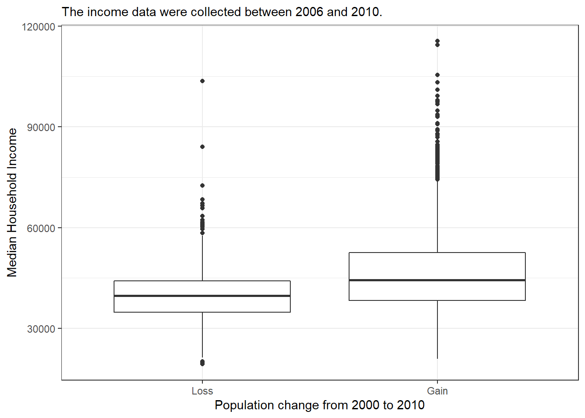
<p class="caption">(\#fig:sbysbox61-fig)Side-by-side box plot for median household income, where the counties are split by whether there was a population gain or loss from 2000 to 2010.</p>
</div>


Another useful plotting method uses **density plots** to compare numerical data across groups. A histogram bins data but is highly dependent on the number and boundary of the bins. A density plot also estimates the distribution of a numerical variable but does this by estimating the density of data points in a small window around each data point. The overall curve is the sum of this small density estimate. A density plot can be thought of as a smooth version of the histogram. Several options go into a density estimate such as the width of the window and type of smoothing function. These ideas are beyond the point here and we will just use the default options. Figure \@ref(fig:dens61-fig) is a plot of the two density curves.


```r
cc_reduced %>%
  gf_dens(~med_income,color=~pop_gain,lwd=1) %>%
  gf_theme(theme_bw()) %>%
  gf_labs(x="Median household income",y="",col="Population \nChange")
```

<div class="figure">

<p class="caption">(\#fig:dens61-fig)Density plots of median household income for counties with population gain versus population loss</p>
</div>


> **Exercise**:  
Use the box plots and density plots to compare the incomes for counties across the two groups. What do you notice about the approximate center of each group? What do you notice about the variability between groups? Is the shape relatively consistent between groups? How many *prominent* modes are there for each group?^[Answers may vary a little. The counties with population gains tend to have higher income (median of about \$45,000) versus counties without a gain (median of about \$40,000). The variability is also slightly larger for the population gain group. This is evident in the IQR, which is about 50\% bigger in the *gain* group. Both distributions show slight to moderate right skew and are unimodal. There is a secondary small bump at about \$60,000 for the *no gain* group, visible in the density plot, that seems out of place. (Looking into the data set, we would find that 8 of these 15 counties are in Alaska and Texas.) The box plots indicate there are many observations far above the median in each group, though we should anticipate that many observations will fall beyond the whiskers when using such a large data set.]


> **Exercise**:   
What components of each plot in Figures 8 and 9 do you find most useful?^[The side-by-side box plots are especially useful for comparing centers and spreads, while the density plots are more useful for seeing distribution shape, skew, and groups of anomalies.]


## Homework Problems

Create an Rmd file for the work including headers, file creation data, and explanation of your work. Make sure your plots have a title and the axes are labeled.

1. **Views on immigration**

910 randomly sampled registered voters from Tampa, FL were asked if they thought workers who have illegally entered the US should be (i) allowed to keep their jobs and apply for US citizenship, (ii) allowed to keep their jobs as temporary guest workers but not allowed to apply for US citizenship, or (iii) lose their jobs and have to leave the country.

The data is in the **openintro** package in the `immigration` data object.

a. How many levels of *political* are there?  
b. Create a table using `tally`.
c. What percent of these Tampa, FL voters identify themselves as conservatives?
d. What percent of these Tampa, FL voters are in favor of the citizenship option?
e. What percent of these Tampa, FL voters identify themselves as conservatives and are in favor of the citizenship option?
f. What percent of these Tampa, FL voters who identify themselves as conservatives are also in favor of the citizenship option? What percent of moderates and liberal share this view?
g. Create a stacked bar chart.
h. Using your plot, do political ideology and views on immigration appear to be independent? Explain your reasoning.


2. **Views on the DREAM Act** The same survey from Exercise 1 also asked respondents if they support the DREAM Act, a proposed law which would provide a path to citizenship for people brought illegally to the US as children. 

The data is in the **openintro** package in the `dream` data object.

a. Create a **mosaic** plot.
b. Based on the mosaic plot, are views on the DREAM Act and political ideology independent?

\pagebreak

3. **Heart transplants**

The Stanford University Heart Transplant Study was conducted to determine whether an experimental heart transplant program increased lifespan. Each patient entering the program was designated an official heart transplant candidate, meaning that he was gravely ill and would most likely benefit from a new heart. Some patients got a transplant and some did not. The variable *transplant* indicates which group the patients were in; patients in the treatment group got a transplant and those in the control group did not. Another variable called *survived* was used to indicate whether or not the patient was alive at the end of the study.

The data is in the **openintro** package and is called `heart_transplant`.

a. Create a **mosaic** plot.
b. Based on the mosaic plot, is survival independent of whether or not the patient got a transplant? Explain your reasoning.
c. Using the variable `survtime`, create side-by-side boxplots for the control and treatment groups.
d. What do the box plots suggest about the efficacy (effectiveness) of transplants?


<!--chapter:end:06-Categorical-Data.Rmd-->

---
output:
  html_document: default
  pdf_document: default
---
# (PART) Probability Modeling {-} 

# Case Study {#CS2}


## Objectives

1) Use R to simulate a probabilistic model.  
2) Use basic counting methods.


## Introduction to probability models

In this second block of material we will focus on probability models. We will take two approaches, one is mathematical and the other is computational. In some cases we can use both methods on a problem and in others only the computational approach is feasible. The mathematical approach to probability modeling allows us insight into the problem and the ability to understand the process. Simulation has a much greater ability to generalize but can be time intensive to run and often requires the writing of custom functions.

This case study is extensive and may seem overwhelming, do not worry we will discuss these ideas again in the many lessons we have coming up this block.

## Probability models

Probability models are an important tool for data analysts. They are used to explain variation in outcomes that cannot be explained by other variables. We will use these ideas in the Statistical Modeling Block to help us make decisions about our statistical models. 

Often probability models are used to answer a question of the form "What is the chance that .....?" This means that we typically have an experiment or trial where multiple outcomes are possible and we only have an idea of the frequency of those outcomes. We use this frequency as a measure of the probability of a particular outcome.

For this block we will focus just on probability models. To apply a probability model we will need to 

1. Select the experiment and its possible outcomes.
2. Have probability values for the outcomes which may include **parameters** that determine the probabilities.
3. Understand the assumptions behind the model.  


## Case study

There is a famous example of a probability question that we will attack in this case study. The question we want to answer is "In a room of $n$ people what is the chance that at least two people have the same birthday?"

> **Exercise**:  
The typical classroom at USAFA has 18 students in it. What do you think the chance that at least two students have the same birthday?^[The answer is around 34.7\%, how close were you?]  


### Break down the question

The first action we should take is to understand what is being asked.

1. What is the experiment or trial?
2. What does it mean to have the same birthday?
3. What about leap years?
4. What about the frequency of births? Are some days less likely than others?

> **Exercise**:  
Discuss these questions and others that you think are relevant.^[Another question may be What does it mean at least two people have matching birthdays?]

The best first step is to make a simple model, often these are the only ones that will have a mathematical solution. For our problem this means we answer the above questions.

1. We have a room of 18 people and we look at their birthdays. We either have two or more birthdays matching or not; thus there are two outcomes.
2. We don't care about the year, only the day and month. Thus two people born on May 16th are a match.
3. We will ignore leap years.
4. We will assume that a person has equal probability of being born on any of the 365 days of the year.
5. At least two means we could have multiple matches on the same day or several different days where multiple people have matching birthdays.


### Simulate (computational)

Now that we have an idea about the structure of the problem, we next need to think about how we would simulate a single classroom. We have 18 students in the classroom and they all could have any of the 365 days of the year as a birthday. What we need to do is sample birthdays for each of the 18 students. But how do we code the days of the year?

An easy solution is to just label the days from 1 to 365. The function `seq()` does this for us.


```r
days <- seq(1,365)
```

Next we need to pick one of the days using the sample function. Note that we set the seed to get repeatable results, this is not required.


```r
set.seed(2022)
sample(days,1)
```

```
## [1] 228
```

The first person was born on the 228th day of the year.

Since `R` works on vectors, we don't have to write a loop to select 18 days, we just have `sample()` do it for us.


```r
class <- sample(days,size=18,replace = TRUE)
class
```

```
##  [1] 206 311 331 196 262 191 206 123 233 270 248   7 349 112   1 307 288 354
```

What do we want `R` to do? Sample from the numbers 1 to 365 with replacement, which means a number can be picked more than once.

Notice in our sample we have at least one match, although it is difficult to look at this list and see the match. Let's sort them to make it easier for us to see.


```r
sort(class)
```

```
##  [1]   1   7 112 123 191 196 206 206 233 248 262 270 288 307 311 331 349 354
```

The next step is to find a way in `R` for the code to detect that there is a match.

>**Exercise**:  
What idea(s) can we use to determine if a match exists?

We could sort the data and look at differences in sequential values and then check if the set of differences contains a zero. This seems to be computationally expensive. Instead we will use the function `unique()` which gives a vector of unique values in an object. The function `length()` gives the number of elements in the vector.


```r
length(unique(class))
```

```
## [1] 17
```

Since we only have 17 unique values in a vector of size 18, we have a match. Now let's put this all together to generate another classroom of size 18.


```r
length(unique(sample(days,size=18,replace = TRUE)))
```

```
## [1] 16
```

The next problem that needs to be solved is how to repeat the classrooms and keep track of those that have a match. There are several functions we could use to include `replicate()` but we will use `do()` from the **mosaic** package because it returns a data frame so we can use `tidyverse` verbs to wrangle the data.

The `do()` function allows us to repeat an operation many times. The following template

```
do(n) * {stuff to do}              # pseudo-code
```

where {stuff to do} is typically a single `R` command, but may be something more complicated. 

Load the libraries.


```r
library(mosaic)
library(tidyverse)
```


```r
do(5)*length(unique(sample(days,size=18,replace = TRUE)))
```

```
##   length
## 1     18
## 2     17
## 3     17
## 4     17
## 5     18
```

Let's repeat for a larger number of simulated classroom, remember you should be asking yourself:

*What do I want `R` to do?*   
*What does `R` need to do this?*


```r
(do(1000)*length(unique(sample(days,size=18,replace = TRUE)))) %>%
  mutate(match=if_else(length==18,0,1)) %>%
  summarise(prob=mean(match))
```

```
##   prob
## 1 0.36
```

This is within 2 decimal places of the mathematical solution we develop shortly.

How many classrooms do we need to simulate to get an accurate estimate of the probability of a match? That is a statistical modeling question and it depends on how much variability we can accept. We will discuss these ideas later in the semester. For now, you can run the code multiple times and see how the estimate varies. If computational power is cheap, you can increase the number of simulations.


```r
(do(10000)*length(unique(sample(days,size=18,replace = TRUE)))) %>%
  mutate(match=if_else(length==18,0,1)) %>%
  summarise(prob=mean(match))
```

```
##     prob
## 1 0.3442
```

### Plotting  

By the way, the method we have used to create the data allows us to summarize the number of unique birthdays using a table or bar chart. Let's do that now. Note that since the first argument in `tally()` is not data then the **pipe** operator will not work without some extra effort. We must tell `R` that the data is the previous argument in the pipeline and thus use the symbol **.** to denote this.


```r
(do(1000)*length(unique(sample(days,size=18,replace = TRUE)))) %>%
  tally(~length,data=.)
```

```
## length
##  14  15  16  17  18 
##   1   7  52 253 687
```

Figure \@ref(fig:bar71-fig) is a plot of the number of unique birthdays in our sample.


```r
(do(1000)*length(unique(sample(days,size=18,replace = TRUE)))) %>%
  gf_bar(~length) %>%
  gf_theme(theme_bw()) %>%
  gf_labs(x="Number of unique birthdays",y="Count")
```

<div class="figure">

<p class="caption">(\#fig:bar71-fig)Bar chart of the number of unique birthdays in the sample.</p>
</div>


> **Exercise**:  
What does it mean if the length of unique birthdays is 16, in terms of matches?^[It is possible that 3 people all have the same birthday or two sets of 2 people have the same birthday but different from the other pair.]

### Mathematical solution  

To solve this problem mathematically, we will step through the logic one step at a time. One of the key ideas that we will see many times is the idea of the **multiplication** rule. This idea is the foundation for **permutation** and **combinations** which are counting methods frequently used in probability calculations.

The first step that we take is to understand the idea of 2 or more people with the same birthday. With 18 people, there are a great deal of possibilities for 2 or more birthdays. We could have exactly 2 people with the same birthday. We could have 18 people with the same birthday, We could have 3 people with the same birthday and another 2 people with the same birthday but different from the other 3. Accounting for all these possibilities is too large a counting process. Instead, we will take the approach of finding the probability of no one having a matching birthday. Then the probability of at least 2 people having a matching birthday is 1 minus the probability that no one has a matching birthday. This is known as a **complementary** probability. A simpler example is to think about rolling a single die. The probability of rolling a 6 is equivalent to 1 minus the probability of not rolling a 6.

We first need to think about all the different ways we could get 18 birthdays. This is going to be our denominator in the probability calculation. First let's just look at 2 people. The first person could have 365 different days for their birthday. The second person could also have 365 different birthdays. So for each birthday of the first person there could be 365 birthdays for the second. Thus for 2 people there are $365^2$ possible sets of birthdays. This is an example of the *multiplication rule*. For 18 people there are $365^{18}$ sets of birthdays. That is a large number. Again, this will be our denominator in calculating the probability. 

The numerator is the number of sets of birthdays with no matches. Again, let's consider 2 people. The first person can have a birthday on any day of the year, so 365 possibilities. Since we don't want a match, the second person can only have 364 possibilities for a birthday. Thus we have $365 \times 364$ possibilities for two people to have different birthdays.

> Exercise:  
What is the number of possibilities for 18 people so that no one has the same birthday.  

The answer for 18 people is $365 \times 364 \times 363 ... \times 349 \times 348$. This looks like a truncated factorial. Remember a factorial, written as $n!$ with an explanation point, is the product of successive positive integers. As an example $3!$ is $3 \times 2 \times 1$ or 6. We could write the multiplication for the numerator as $$\frac{365!}{(365-n)!}$$ As we will learn, the multiplication rule for the numerator is known as a **permutation**.

We are ready to put it all together. For 18 people, the probability of 2 or more people with the same birthday is 1 minus the probability that no one has the same birthday, which is

$$1 - \frac{\frac{365!}{(365-18)!}}{365^{18}}$$ or 

$$1 - \frac{\frac{365!}{347!}}{365^{18}}$$

In `R` there is a function called `factorial()` but factorials get large fast and we will **overflow** the memory. Try `factorial(365)` in `R` to see what happens.


```r
factorial(365)
```

```
## [1] Inf
```

It is returning *infinity* because the number is too large for the buffer. As is often the case we will have when using a computational method, we must be clever about our approach. Instead of using factorials we can make use of `R`s ability to work on vectors. If we provide `R` with a vector of values, the `prod()` will perform a product of all the elements.


```r
365*364
```

```
## [1] 132860
```


```r
prod(365:364)
```

```
## [1] 132860
```


```r
1- prod(365:348)/(365^18)
```

```
## [1] 0.3469114
```

### General solution 

We now have the mathematics to understand the problem. We can easily generalize this to any number of people. To do this, we have to write a function in `R`. As with everything in `R`, we save a function as an object. The general format for creating a function is


```r
my_function <- function(parameters){
  code for function
}
```

For this problem we will call the function `birthday_prob()`. The only parameter we need is the number of people in the room, `n`. Let's write this function.


```r
birthday_prob <- function(n=20){
  1- prod(365:(365-(n-1)))/(365^n)
}
```

Notice we assigned the function to the name `birthday_prob`, we told `R` to expect one argument to the function, which we are calling `n`, and then we provide `R` with the code to find the probability. We set a default value for `n` in case one is not provided to prevent an error when the function is run. We will learn more about writing functions over this and the next semester.

Test the code with a know answer.


```r
birthday_prob(18)
```

```
## [1] 0.3469114
```

Now we can determine the probability for any size room. You may have heard that it only takes about 23 people in a room to have a 50\% probability of at least 2 people matching birthdays.


```r
birthday_prob(23)
```

```
## [1] 0.5072972
```

Let's create a plot of the probability versus number of people in the room. To do this, we need to apply the function to a vector of values. The function `sapply()` will work or we can also use `Vectorize()` to alter our existing function. We choose the latter option.

First notice what happens if we input a vector into our function.


```r
birthday_prob(1:20)
```

```
## Warning in 365:(365 - (n - 1)): numerical expression has 20 elements: only the
## first used
```

```
##  [1] 0.0000000 0.9972603 0.9999925 1.0000000 1.0000000 1.0000000 1.0000000
##  [8] 1.0000000 1.0000000 1.0000000 1.0000000 1.0000000 1.0000000 1.0000000
## [15] 1.0000000 1.0000000 1.0000000 1.0000000 1.0000000 1.0000000
```

It only uses the first value. There are several ways to solve this problem. We can use the `map()` function in the **purrr** package. This idea of mapping a function to a vector is important in data science. It is used in scenarios where there is a lot of data. In this case the idea of map-reduce is used to make the analysis amenable to parallel computing.


```r
map_dbl(1:20,birthday_prob)
```

```
##  [1] 0.000000000 0.002739726 0.008204166 0.016355912 0.027135574 0.040462484
##  [7] 0.056235703 0.074335292 0.094623834 0.116948178 0.141141378 0.167024789
## [13] 0.194410275 0.223102512 0.252901320 0.283604005 0.315007665 0.346911418
## [19] 0.379118526 0.411438384
```


We could also just vectorize the function.


```r
birthday_prob <- Vectorize(birthday_prob)
```

Now notice what happens.


```r
birthday_prob(1:20)
```

```
##  [1] 0.000000000 0.002739726 0.008204166 0.016355912 0.027135574 0.040462484
##  [7] 0.056235703 0.074335292 0.094623834 0.116948178 0.141141378 0.167024789
## [13] 0.194410275 0.223102512 0.252901320 0.283604005 0.315007665 0.346911418
## [19] 0.379118526 0.411438384
```

We are good to go. Let's create our line plot, Figure \@ref(fig:line71-fig).


```r
gf_line(birthday_prob(1:100)~ seq(1,100),
        xlab="Number of People",
        ylab="Probability of Match",
        title="Probability of at least 2 people with matching birthdays") %>%
  gf_theme(theme_bw())
```

<div class="figure">

<p class="caption">(\#fig:line71-fig)The probability of at least 2 people having mathcing birthdays</p>
</div>

Is this what you expected the curve to look like? We, the authors, did not expect this. It has a sigmodial shape with a large increase in the middle range and flatten in the tails.


### Data science approach

The final approach we will take is one based on data, a data science approach. In the **mosaicData** package is a data set called `Births` that contains the number of births in the US from 1969 to 1988. This data will allow us to estimate the number of births on any day of the year. This allows us to eliminate the reliance on the assumption that each day is equally likely. Let's first `inspect()` the data object.


```r
inspect(Births)
```

```
## 
## categorical variables:  
##   name   class levels    n missing
## 1 wday ordered      7 7305       0
##                                    distribution
## 1 Wed (14.3%), Thu (14.3%), Fri (14.3%) ...    
## 
## Date variables:  
##   name class      first       last min_diff max_diff    n missing
## 1 date  Date 1969-01-01 1988-12-31   1 days   1 days 7305       0
## 
## quantitative variables:  
##              name   class  min   Q1 median    Q3   max        mean          sd
## ...1       births integer 6675 8792   9622 10510 12851 9648.940178 1127.315229
## ...2         year integer 1969 1974   1979  1984  1988 1978.501027    5.766735
## ...3        month integer    1    4      7    10    12    6.522930    3.448939
## ...4  day_of_year integer    1   93    184   275   366  183.753593  105.621885
## ...5 day_of_month integer    1    8     16    23    31   15.729637    8.800694
## ...6  day_of_week integer    1    2      4     6     7    4.000274    1.999795
##         n missing
## ...1 7305       0
## ...2 7305       0
## ...3 7305       0
## ...4 7305       0
## ...5 7305       0
## ...6 7305       0
```

It could be argued that we could randomly pick one year and use it. Let's see what happens if we just used 1969. Figure \@ref(fig:scat71-fig) is a scatter plot of the number of births in 1969 for each day of the year.


```r
Births %>%
  filter(year == 1969) %>%
  gf_point(births~day_of_year) %>%
  gf_theme(theme_bw()) %>%
  gf_labs(x="Day of the Year",y="Number of Births")
```

<div class="figure">
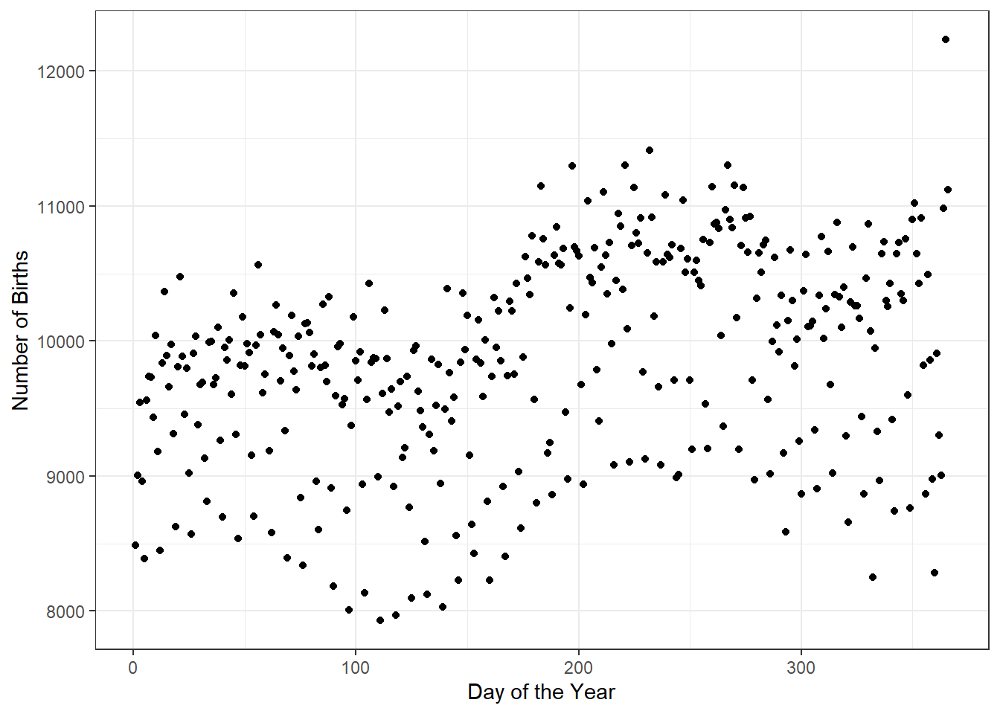
<p class="caption">(\#fig:scat71-fig)The number of births for each day of the year in 1969</p>
</div>

> **Exercise**:  
What patterns do you see in Figure \@ref(fig:scat71-fig)? What might explain them?

There are definitely bands appearing in the data which could be the day of the week; there are less birthdays on the weekend. There is also seasonality with more birthdays in the summer and fall. There is also probably an impact from holidays. 

Quickly, let's look at the impact of day of the week by using color for day of the week. Figure \@ref(fig:scat72-fig) makes it clear that the weekends have less number of births as compared to the work week.


```r
Births %>%
  filter(year == 1969) %>%
  gf_point(births~day_of_year,color=~factor(day_of_week)) %>%
  gf_labs(x="Day of the Year",col="Day of Week") %>%
  gf_theme(theme_bw())
```

<div class="figure">

<p class="caption">(\#fig:scat72-fig)The number of births for each day of the year in 1969 broken down by day of the week</p>
</div>


By only using one year, this data might give poor results since holidays will fall on certain days of the week and the weekends will also be impacted. Note that we also still have the problem of leap years.


```r
Births %>%
  group_by(year) %>%
  summarise(n=n())
```

```
## # A tibble: 20 x 2
##     year     n
##    <int> <int>
##  1  1969   365
##  2  1970   365
##  3  1971   365
##  4  1972   366
##  5  1973   365
##  6  1974   365
##  7  1975   365
##  8  1976   366
##  9  1977   365
## 10  1978   365
## 11  1979   365
## 12  1980   366
## 13  1981   365
## 14  1982   365
## 15  1983   365
## 16  1984   366
## 17  1985   365
## 18  1986   365
## 19  1987   365
## 20  1988   366
```

The years 1972, 1976, 1980, 1984, and 1988 are all leap years. At this point, to make the analysis easier, we will drop those years.


```r
Births %>%
  filter(!(year %in% c(1972,1976,1980,1984,1988))) %>%
  group_by(year) %>%
  summarise(n=n())
```

```
## # A tibble: 15 x 2
##     year     n
##    <int> <int>
##  1  1969   365
##  2  1970   365
##  3  1971   365
##  4  1973   365
##  5  1974   365
##  6  1975   365
##  7  1977   365
##  8  1978   365
##  9  1979   365
## 10  1981   365
## 11  1982   365
## 12  1983   365
## 13  1985   365
## 14  1986   365
## 15  1987   365
```

Notice in `filter()` we used the `%in%` argument. This is a **logical** argument checking if `year` is one of the values. The `!` at the front negates this in a sense requiring `year` not to be one of those values.`

We are almost ready to simulate. We need to get the count of `births` on each day of the year for the non-leap years.


```r
birth_data <- Births %>%
  filter(!(year %in% c(1972,1976,1980,1984,1988))) %>%
  group_by(day_of_year) %>%
  summarise(n=sum(births)) 
```


```r
head(birth_data)
```

```
## # A tibble: 6 x 2
##   day_of_year      n
##         <int>  <int>
## 1           1 120635
## 2           2 129042
## 3           3 135901
## 4           4 136298
## 5           5 137319
## 6           6 140044
```

Let's look at a plot of the number of births versus day of the year. We combined years in Figure \@ref(fig:scat73-fig). 


```r
birth_data %>%
  gf_point(n~day_of_year,
          xlab="Day of the year",
          ylab="Number of births") %>%
  gf_theme(theme_bw())
```

<div class="figure">

<p class="caption">(\#fig:scat73-fig)Number of births by day of the year for all years.</p>
</div>

This curve has the seasonal cycling we would expect. The smaller scale cycling is unexpected. Maybe because we are dropping the leap years, we are getting some days appearing in our time interval more frequently on weekends. We leave it to you to investigate this phenomenon. 

We use these counts as weights in a sampling process. Days with more births will have a higher probability of being selected. Days such as Christmas and Christmas Eve have a lower probability of being selected. Let's save the weights in an object to use in the `sample()` function.


```r
birth_data_weights <- birth_data %>%
  select(n) %>%
  pull()
```

The `pull()` function pulls the vectors of values out of the data frame format into a vector format which the `sample()` needs.

Now let's simulate the problem. The probability of a match should change slightly, maybe go down slightly?, but not much since most of the days have about the same probability or number of occurrences.


```r
set.seed(20)
(do(1000)*length(unique(sample(days,size=18,replace = TRUE,prob=birth_data_weights)))) %>%
  mutate(match=if_else(length==18,0,1)) %>%
  summarise(prob=mean(match))
```

```
##    prob
## 1 0.352
```

We could not solve this problem of varying frequency of birth days using mathematics, at least as far as we know.

Cool stuff, let's get to learning more about probability models in the next chapters.


## Homework Problems

1. **Exactly 2 people with the same birthday - Simulation**. Complete a similar analysis for case where exactly 2 people in a room of 23 people have the same birthday. In this exercise you will use a computational simulation.

a. Create a new R Markdown file and create a report. Yes, we know you could use this file but we want you to practice generating your own report.  
b. Simulate having 23 people in the class with each day of the year equally likely. Find the cases where exactly 2 people have the same birthday, you will have to alter the code from the Notes more than changing 18 to 23.  
c. Plot the frequency of occurrences as a bar chart.  
d. Estimate the probability of exactly two people having the same birthday.


2. **Exactly 2 people with the same birthday - Mathematical**.  Repeat problem 1 but do it mathematically. As a big hint, you will need to use the `choose()` function. The idea is that with 23 people we need to choose 2 of them to match. We thus need to multiply, the multiplication rule again, by `choose(23,2)`. If you are having trouble, work with a total of 3 people in the room first.

a. Find a formula to determine the exact probability of exactly 2 people in a room of 23 having the same birthday.  
b. Generalize your solution to any number `n` people in the room and create a function.   
c. Vectorize the function.  
d. Plot the probability of exactly 2 people having the same birthday versus number of people in the room.  
e. Comment on the shape of the curve and explain it.  

<!--chapter:end:07-Probability-Case-Study.Rmd-->

# Probability Rules {#PROBRULES}

\newcommand{\E}{\mbox{E}}
\newcommand{\Var}{\mbox{Var}}
\newcommand{\Cov}{\mbox{Cov}}
\newcommand{\Prob}{\mbox{P}}
\newcommand*\diff{\mathop{}\!\mathrm{d}}


## Objectives

1) Define and use properly in context all new terminology related to probability to include but not limited to: outcome, event, sample space, probability.  
2) Apply basic probability and counting rules to find probabilities.  
3) Describe the basic axioms of probability.  
4) Use `R` to calculate and simulate probabilities of events.  

## Probability vs Statistics

As a review, remember this course is divided into four general blocks: data collection/summary, probability models, inference and statistical modeling/prediction. This second block, probability, is the study of stochastic (random) processes and their properties. Specifically, we will explore random experiments. As its name suggests, a random experiment is an experiment whose outcome is not predictable with exact certainty. In the statistical models we develop in the last two blocks of this course, we will use other variables to explain the variance of the outcome of interest. Any remaining variance is modeled with probability models. 

Even though an outcome is determined by chance, this does not mean that we know nothing about the random experiment. Our favorite simple example is that of a coin flip. If we flip a coin, the possible outcomes are heads and tails. We don't know for sure what outcome will occur, but this doesn't mean we don't know anything about the experiment. If we assume the coin is fair, we know that each outcome is equally likely. Also, we know that if we flip the coin 100 times (independently), we are likely, the highest frequency event, to see around 50 heads, and very unlikely to see 10 heads or fewer. 

It is important to distinguish probability from inference and modeling. In probability, we consider a known random experiment, including knowing the parameters, and answer questions about what we expect to see from this random experiment. In statistics (inference and modeling), we consider data (the results of a mysterious random experiment) and infer about the underlying process. For example, suppose we have a coin and we are unsure whether this coin is fair or unfair, the parameter is unknown. We flipped it 20 times and it landed on heads 14 times. Inferential statistics will help us answer questions about the underlying process (could this coin be unfair?). 

This block (9 lessons or so) is devoted to the study of random experiments. First, we will explore simple experiments, counting rule problems, and conditional probability. Next, we will introduce the concept of a random variable and the properties of random variables. Following this, we will cover common distributions of discrete and continuous random variables. We will end the block on multivariate probability (joint distributions and covariance). 

## Basic probability terms  

We will start our work with some definitions and examples.

### Sample space

Suppose we have a random experiment. The *sample space* of this experiment, $S$, is the set of all possible results of that experiment. For example, in the case of a coin flip, we could write $S=\{H,T\}$. Each element of the sample space is considered an *outcome*. An *event* is a set of outcomes, it is a subset of the sample space.  

> *Example*:  
Let's let `R` flip a coin for us and record the number of heads and tails. We will have `R` flip the coin twice. What is the sample space, what is an example of an outcome, and what is an example of an event.

We will load the **mosaic** package as it has a function `rflip()` that will simulate flipping a coin.


```r
library(mosaic)
```


```r
set.seed(18)
rflip(2)
```

```
## 
## Flipping 2 coins [ Prob(Heads) = 0.5 ] ...
## 
## H H
## 
## Number of Heads: 2 [Proportion Heads: 1]
```

The sample space is $S=\{HH, TH, HT, TT\}$, an example of an outcome is $HH$ which we see in the output from `R`, and finally an example of an event is the number of heads, which in this case takes on the values 0, 1, and 2. Another example of an event is "At least one heads". In this case the event would be $\{HH,TH, HT\}$. Also notice that $TH$ is different from $HT$ as an outcome; this is because those are different outcomes from flipping a coin twice.

> *Example of Event*:  
Suppose you arrive at a rental car counter and they show you a list of available vehicles, and one is picked for you at random. The sample space in this experiment is 
$$
S=\{\mbox{red sedan}, \mbox{blue sedan}, \mbox{red truck}, \mbox{grey truck}, \mbox{grey SUV}, \mbox{black SUV}, \mbox{blue SUV}\}.
$$ 

Each vehicle represents a possible outcome of the experiment. Let $A$ be the event that a blue vehicle is selected. This event contains the outcomes `blue sedan` and `blue SUV`. 

### Union and intersection

Suppose we have two events $A$ and $B$. 

1) $A$ is considered a *subset* of $B$ if all of the outcomes of $A$ are also contained in $B$. This is denoted as $A \subset B$. 

2) The *intersection* of $A$ and $B$ is all of the outcomes contained in both $A$ and $B$. This is denoted as $A \cap B$. 

3) The *union* of $A$ and $B$ is all of the outcomes contained in either $A$ or $B$, or both. This is denoted as $A \cup B$. 

4) The *complement* of $A$ is all of the outcomes not contained in $A$. This is denoted as $A^C$ or $A'$. 

Note: Here we are treating events as sets and the above definitions are basic set operations.

It is sometimes helpful when reading probability notation to think of Union as an *or* and Intersection as an *and*.

> *Example*:  
Consider our rental car example above. Let $A$ be the event that a blue vehicle is selected, let $B$ be the event that a black vehicle is selected, and let $C$ be the event that an SUV is selected.  

First, let's list all of the outcomes of each event. $A = \{\mbox{blue sedan},\mbox{blue SUV}\}$, $B=\{\mbox{black SUV}\}$, and $C= \{\mbox{grey SUV}, \mbox{black SUV}, \mbox{blue SUV}\}$.  

Since all outcomes in $B$ are contained in $C$, we know that $B$ is a subset of $C$, or $B\subset C$. Also, since $A$ and $B$ have no outcomes in common, $A \cap B = \emptyset$. Note that $\emptyset = \{ \}$ is the empty set and contains no elements. Further, $A \cup C = \{\mbox{blue sedan}, \mbox{grey SUV}, \mbox{black SUV}, \mbox{blue SUV}\}$. 

## Probability

*Probability* is a number assigned to an event or outcome that describes how likely it is to occur. A probability model assigns a probability to each element of the sample space. What makes a probability model is not just the values assigned to each element but the idea this model contains all the information about the outcomes and there are no other explanatory variables involved.

A probability model can be thought of as a function that maps outcomes, or events, to a real number in the interval $[0,1]$.

There are some basic axioms of probability you should know, although this list is not complete. Let $S$ be the sample space of a random experiment and let $A$ be an event where $A\subset S$. 

1) $\Prob(A) \geq 0$. 

2) $\Prob(S) = 1$. 


These two axioms essentially say that probability must be positive, and the probability of all outcomes must sum to 1. 


### Probability properties

Let $A$ and $B$ be events in a random experiment. Most of these can be proven fairly easily. 

1) $\Prob(\emptyset)=0$

2) $\Prob(A')=1-\Prob(A)$ We used this in the case study.

3) If $A\subset B$, then $\Prob(A)\leq \Prob(B)$. 

4) $\Prob(A\cup B) = \Prob(A)+\Prob(B)-\Prob(A\cap B)$. This property can be generalized to more than two events. The intersection is subtracted because outcomes in both events $A$ and $B$ get counted twice in the first sum.

5) Law of Total Probability: Let $B_1, B_2,...,B_n$ be **mutually exclusive**, this means disjoint or no outcomes in common, and **exhaustive**, this means the union of all the events labeled with a $B$ is the sample space. Then 

$$
\Prob(A)=\Prob(A\cap B_1)+\Prob(A\cap B_2)+...+\Prob(A\cap B_n)
$$

A specific application of this law appears in Bayes' Rule (more to follow). It says that $\Prob(A)=\Prob(A \cap B)+\Prob(A \cap B')$. Essentially, it points out that $A$ can be partitioned into two parts: 1) everything in $A$ and $B$ and 2) everything in $A$ and not in $B$. 

> *Example*:  
Consider rolling a six sided die. Let event $A$ be the number showing is less than 5. Let event $B$ be the number is even. Then  

$$\Prob(A)=\Prob(A \cap B) + \Prob(A \cap B')$$ 

$$
\Prob(< 5)=\Prob(<5 \cap Even)+\Prob(<5 \cap Odd)
$$


6) DeMorgan's Laws: 
$$
\Prob((A \cup B)')=\Prob(A' \cap B')
$$
$$
\Prob((A \cap B)')=\Prob(A' \cup B')
$$

### Equally likely scenarios

In some random experiments, outcomes can be defined such that each individual outcome is equally likely. In this case, probability becomes a counting problem. Let $A$ be an event in an experiment where each outcome is equally likely. 
$$
\Prob(A)=\frac{\mbox{# of outcomes in A}}{\mbox{# of outcomes in S}}
$$

> *Example*:  
Suppose a family has three children, with each child being either a boy (B) or girl (G). Assume that the likelihood of boys and girls are equal and **independent**, this is the idea that the probability of the gender of the second child does not change based on the gender of the first child. The sample space can be written as:
$$
S=\{\mbox{BBB},\mbox{BBG},\mbox{BGB},\mbox{BGG},\mbox{GBB},\mbox{GBG},\mbox{GGB},\mbox{GGG}\}
$$
What is the probability that the family has exactly 2 girls? 

This only happens in three ways: BGG, GBG, and GGB. Thus, the probability of exactly 2 girls is 3/8 or 0.375. 

### Using `R` (Equally likely scenarios)

The previous example above is an example of an "Equally Likely" scenario, where the sample space of a random experiment contains a list of outcomes that are equally likely. In these cases, we can sometimes use `R` to list out the possible outcomes and count them to determine probability. We can also use `R` to simulate. 

> *Example*:  
Use `R` to simulate the family of three children where each child has the same probability of being a boy or a girl. 

Instead of writing our own function, we can use `rflip()` in the **mosaic** package. We will let $H$ stand for girl.

First simulate one family. 


```r
set.seed(73)
rflip(3)
```

```
## 
## Flipping 3 coins [ Prob(Heads) = 0.5 ] ...
## 
## T T H
## 
## Number of Heads: 1 [Proportion Heads: 0.333333333333333]
```

In this case we got 1 girl. Next we will use the `do()` function to repeat this simulation.


```r
results <- do(10000)*rflip(3)
head(results)
```

```
##   n heads tails      prop
## 1 3     1     2 0.3333333
## 2 3     3     0 1.0000000
## 3 3     3     0 1.0000000
## 4 3     3     0 1.0000000
## 5 3     1     2 0.3333333
## 6 3     1     2 0.3333333
```

Next we can visualize the distribution of the number of girls, heads, in Figure \@ref(fig:bar81-fig).


```r
results %>%
  gf_bar(~heads) %>%
  gf_theme(theme_bw()) %>%
  gf_labs(x="NUmber of girls",y="Count")
```

<div class="figure">

<p class="caption">(\#fig:bar81-fig)Number of girls in a family of size 3.</p>
</div>

Finally we can estimate the probability of exactly 2 girls. We need the **tidyverse** library.


```r
library(tidyverse)
```


```r
results %>%
  filter(heads==2) %>%
  summarize(prob=n()/10000)
```

```
##     prob
## 1 0.3782
```

Or slightly different code.


```r
results %>%
  count(heads) %>%
  mutate(prop=n/sum(n))
```

```
##   heads    n   prop
## 1     0 1241 0.1241
## 2     1 3786 0.3786
## 3     2 3782 0.3782
## 4     3 1191 0.1191
```


Not a bad estimate of the exact probability.

Let's now use an example of cards to simulate some probabilities as well as learning more about counting. The file `Cards.csv` contains the data for cards from a 52 card deck. Let's read it in and summarize.


```r
Cards <- read_csv("data/Cards.csv")
inspect(Cards)
```

```
## 
## categorical variables:  
##   name     class levels  n missing
## 1 rank character     13 52       0
## 2 suit character      4 52       0
##                                    distribution
## 1 10 (7.7%), 2 (7.7%), 3 (7.7%) ...            
## 2 Club (25%), Diamond (25%) ...                
## 
## quantitative variables:  
##       name   class        min         Q1     median         Q3        max
## ...1 probs numeric 0.01923077 0.01923077 0.01923077 0.01923077 0.01923077
##            mean sd  n missing
## ...1 0.01923077  0 52       0
```


```r
head(Cards)
```

```
## # A tibble: 6 x 3
##   rank  suit   probs
##   <chr> <chr>  <dbl>
## 1 2     Club  0.0192
## 2 3     Club  0.0192
## 3 4     Club  0.0192
## 4 5     Club  0.0192
## 5 6     Club  0.0192
## 6 7     Club  0.0192
```


We can see 4 suits, and 13 ranks, the value on the face of the card.


> *Example*:  
Suppose we draw one card out of a standard deck. Let $A$ be the event that we draw a Club. Let $B$ be the event that we draw a 10 or a face card (Jack, Queen, King or Ace). We can use `R` to define these events and find probabilities. 

Let's find all the Clubs.


```r
Cards %>%
  filter(suit == "Club") %>%
  select(rank,suit)
```

```
## # A tibble: 13 x 2
##    rank  suit 
##    <chr> <chr>
##  1 2     Club 
##  2 3     Club 
##  3 4     Club 
##  4 5     Club 
##  5 6     Club 
##  6 7     Club 
##  7 8     Club 
##  8 9     Club 
##  9 10    Club 
## 10 J     Club 
## 11 Q     Club 
## 12 K     Club 
## 13 A     Club
```

So just by counting, we find the probability of drawing a Club is $\frac{13}{52}$ or 0.25.

We can do this by simulation, this is over kill but gets the idea of simulation across.

Remember, ask what do we want `R` to do and what does `R` need to do this?


```r
results <- do(10000)*sample(Cards,1)
head(results)
```

```
## # A tibble: 6 x 6
##   rank  suit   probs orig.id  .row .index
##   <chr> <chr>  <dbl> <chr>   <int>  <dbl>
## 1 9     Spade 0.0192 47          1      1
## 2 5     Club  0.0192 4           1      2
## 3 5     Spade 0.0192 43          1      3
## 4 7     Heart 0.0192 32          1      4
## 5 4     Club  0.0192 3           1      5
## 6 A     Spade 0.0192 52          1      6
```


```r
results %>%
  filter(suit == "Club") %>%
  summarize(prob=n()/10000)
```

```
## # A tibble: 1 x 1
##    prob
##   <dbl>
## 1 0.243
```


```r
results %>%
  count(suit) %>%
  mutate(prob=n/sum(n))
```

```
## # A tibble: 4 x 3
##   suit        n  prob
##   <chr>   <int> <dbl>
## 1 Club     2432 0.243
## 2 Diamond  2558 0.256
## 3 Heart    2417 0.242
## 4 Spade    2593 0.259
```


Now let's count the number of outcomes in $B$.


```r
Cards %>%
  filter(rank %in% c(10, "J", "Q", "K", "A")) %>%
  select(rank,suit)
```

```
## # A tibble: 20 x 2
##    rank  suit   
##    <chr> <chr>  
##  1 10    Club   
##  2 J     Club   
##  3 Q     Club   
##  4 K     Club   
##  5 A     Club   
##  6 10    Diamond
##  7 J     Diamond
##  8 Q     Diamond
##  9 K     Diamond
## 10 A     Diamond
## 11 10    Heart  
## 12 J     Heart  
## 13 Q     Heart  
## 14 K     Heart  
## 15 A     Heart  
## 16 10    Spade  
## 17 J     Spade  
## 18 Q     Spade  
## 19 K     Spade  
## 20 A     Spade
```

So just by counting, we find the probability of drawing a 10 or greater is $\frac{20}{52}$ or 0.3846154.

>**Exercise**:  
Using simulation to estimate the probability of 10 or higher.


```r
results <- do(10000)*sample(Cards,1)
head(results)
```

```
## # A tibble: 6 x 6
##   rank  suit   probs orig.id  .row .index
##   <chr> <chr>  <dbl> <chr>   <int>  <dbl>
## 1 10    Heart 0.0192 35          1      1
## 2 6     Heart 0.0192 31          1      2
## 3 8     Spade 0.0192 46          1      3
## 4 J     Heart 0.0192 36          1      4
## 5 Q     Spade 0.0192 50          1      5
## 6 10    Club  0.0192 9           1      6
```


```r
results %>%
  filter(rank %in% c(10, "J", "Q", "K", "A")) %>%
  summarize(prob=n()/10000)
```

```
## # A tibble: 1 x 1
##    prob
##   <dbl>
## 1 0.389
```

Notice that this code is not robust to change the number of simulations. If we change from 10000, then we have to change the denominator in the `summarize()` function. We can change this by using `mutate()` instead of `filter()`.


```r
results %>%
  mutate(face=rank %in% c(10, "J", "Q", "K", "A"))%>%
  summarize(prob=mean(face))
```

```
## # A tibble: 1 x 1
##    prob
##   <dbl>
## 1 0.389
```

Notice that in the `mutate()` function, we are creating a new logical variable called `face`. This variable takes on the values of TRUE and FALSE. In the next line we use a `summarize()` command with the function `mean()`. In `R` a function that requires numeric input takes a logical variable and converts the TRUE into 1 and the FALSE into 0. Thus the `mean()` will find the proportion of TRUE values and that is why we report it as a probability.

Next, let's find a card that is 10 or greater **and** a club.


```r
Cards %>%
  filter(rank %in% c(10, "J", "Q", "K", "A"),suit=="Club") %>%
  select(rank,suit)
```

```
## # A tibble: 5 x 2
##   rank  suit 
##   <chr> <chr>
## 1 10    Club 
## 2 J     Club 
## 3 Q     Club 
## 4 K     Club 
## 5 A     Club
```


We find the probability of drawing a 10 or greater club is $\frac{5}{52}$ or 0.0961538.

>**Exercise**:  
Simulate drawing one card and estimate the probability of a club that is 10 or greater.


```r
results %>%
  mutate(face=(rank %in% c(10, "J", "Q", "K", "A"))&(suit=="Club"))%>%
  summarize(prob=mean(face))
```

```
## # A tibble: 1 x 1
##     prob
##    <dbl>
## 1 0.0963
```


### Note

We have been using `R` to count the number of outcomes in an event. This helped us to determine probabilities. We limited the problems to simple ones. In our cards example, it would be more interesting for us to explore more complex events such as drawing 5 cards from a standard deck. Each draw of 5 cards is equally likely, so in order to find the probability of a flush (5 cards of the same suit), we could simply list all the possible flushes and compare that to the sample space. Because of the large number of possible outcomes, this becomes difficult. Thus we need to explore counting rules in more detail to help us solve more complex problems. In this course we will limit our discussion to three basic cases. You should know that there are entire courses on discrete math and counting rules, so we will still be limited in our methods and the type of problems we can solve in this course.

## Counting rules 

There are three types of counting problems we will consider. In each case, the multiplication rule is being used and all that changes is whether an element is allowed to be reused, replacement, and whether the order of selection matters. This latter question is difficult.  Each case will be demonstrated with an example. 

### Multiplication rule 1: Order matters, sample with replacement 

The multiplication rule is at the center of each of the three methods. In this first case we are using the idea that order matters and items can be reused. Let's use an example to help. 

> *Example*:  
A license plate consists of three numeric digits (0-9) followed by three single letters (A-Z). How many possible license plates exist? 

We can divide this problem into two sections. In the numeric section, we are selecting 3 objects from 10, with replacement. This means that a number can be used more than once. Order clearly matters because a license plate starting with "432" is distinct from a license plate starting with "234". There are $10^3 = 1000$ ways to select the first three digits; 10 for the first, 10 for the second, and 10 for the third. Why do you multiply and not add?^[Multiplication is repeated adding so in a sense we are adding. However in a more serious tone, for this problem for every first number there are 10 possibilities for the second number and for every second number there are 10 possibilities for the third numbers. This is multiplication.] 

In the alphabet section, we are selecting 3 objects from 26, where order matters. Thus, there are $26^3=17576$ ways to select the last three letters of the plate. Combined, there are $10^3 \times 26^3 = 17576000$ ways to select license plates. Visually, 
$$
\underbrace{\underline{\quad 10 \quad }}_\text{number} \times \underbrace{\underline{\quad 10 \quad }}_\text{number} \times \underbrace{\underline{\quad 10 \quad }}_\text{number} \times \underbrace{\underline{\quad 26 \quad }}_\text{letter} \times \underbrace{\underline{\quad 26 \quad }}_\text{letter} \times \underbrace{\underline{\quad 26 \quad }}_\text{letter} = 17,576,000
$$

Next we are going to use this new counting method to find a probability.

> *Exercise*:  
What is the probability a license plate starts with the number "8" or "0" and ends with the letter "B"? 

In order to find this probability, we simply need to determine the number of ways to select a license plate starting with "8" or "0" and ending with the letter "B". We can visually represent this event:
$$
\underbrace{\underline{\quad 2 \quad }}_\text{8 or 0} \times \underbrace{\underline{\quad 10 \quad }}_\text{number} \times \underbrace{\underline{\quad 10 \quad }}_\text{number} \times \underbrace{\underline{\quad 26 \quad }}_\text{letter} \times \underbrace{\underline{\quad 26 \quad }}_\text{letter} \times \underbrace{\underline{\quad 1 \quad }}_\text{B} = 135,200
$$

Dividing this number by the total number of possible license plates yields the probability of this event occurring. 


```r
denom<-10*10*10*26*26*26
num<-2*10*10*26*26*1
num/denom
```

```
## [1] 0.007692308
```

The probability of obtaining a license plate starting with "8" or "0" and ending with "B" is 0.0077. Simulating this would be difficult because we would need special functions to check the first number and last letter. This gets into **text mining** an important subject in data science but unfortunately we don't have much time in this course for the topic.

### Multiplication rule 2 (Permutation): Order Matters, Sampling Without Replacement

Consider a random experiment where we sample from a group of size $n$, **without** replacement, and the outcome of the experiment depends on the order of the outcomes. The number of ways to select $k$ objects is given by $n(n-1)(n-2)...(n-k+1)$. This is known as a permutation and is sometimes written as
$$
{}_nP_{k} = \frac{n!}{(n-k)!}
$$

Recall that $n!$ is read as $n$ factorial and represents the number of ways to arrange $n$ objects. 

> *Example*:  
Twenty-five friends participate in a Halloween costume party. Three prizes are given during the party: most creative costume, scariest costume, and funniest costume. No one can win more than one prize. How many possible ways can the prizes by distributed? 

There are $k=3$ prizes to be assigned to $n=25$ people. Once someone is selected for a prize, they are removed from the pool of eligibles. In other words, we are sampling without replacement. Also, order matters. For example, if Tom, Mike, and Jane, win most creative, scariest and funniest costume, respectively, this is a different outcome than if Mike won creative, Jane won scariest and Tom won funniest. Thus, the number of ways the prizes can be distributed is given by ${}_{25}P_3 = \frac{25!}{22!} = 13,800$. A more visually pleasing way to express this would be: 
$$
\underbrace{\underline{\quad 25 \quad }}_\text{most creative} \times \underbrace{\underline{\quad 24 \quad }}_\text{scariest} \times \underbrace{\underline{\quad 23 \quad }}_\text{funniest} = 13,800
$$

Notice that it is sometime difficult to determine if order matters or not in a problem, but in this example the name of the prize was a hint that indeed order matters.  

Let's use the idea of a permutation to calculate a probability.

>*Exercise*:   
Assume that all 25 participants are equally likely to win any one of the three prizes. What is the probability that Tom doesn't win any of them? 

Just like in the previous probability calculation, we simply need to count the number of ways Tom doesn't win any prize. In other words, we need to count the number of ways that prizes are distributed without Tom. So, remove Tom from the group of 25 eligible participants. The number of ways Tom doesn't get a prize is ${}_{24}P_3 = \frac{24!}{21!}=12,144$. Again visually:
$$
\underbrace{\underline{\quad 24 \quad }}_\text{most creative} \times \underbrace{\underline{\quad 23 \quad }}_\text{scariest} \times \underbrace{\underline{\quad 22 \quad }}_\text{funniest} = 12,144
$$

The probability Tom doesn't get a prize is simply the second number divided by the first:

```r
denom<-factorial(25)/factorial(25-3)
# Or, denom<-25*24*23
num<-24*23*22
num/denom
```

```
## [1] 0.88
```

### Multiplication rule 3 (Combination): Order Does Not Matter, Sampling Without Replacement

Consider a random experiment where we sample from a group of size $n$, without replacement, and the outcome of the experiment does not depend on the order of the outcomes. The number of ways to select $k$ objects is given by $\frac{n!} {(n-k)!k!}$. This is known as a combination and is written as:
$$
\binom{n}{k} = \frac{n!}{(n-k)!k!} 
$$

This is read as "$n$ choose $k$". Take a moment to compare combinations to permutations, discussed in Rule 2. The difference between these two rules is that in a combination, order no longer matters. A combination is equivalent to a permutation divided by $k!$, the number of ways to arrange the $k$ objects selected. 

> *Example*:  
Suppose we draw 5 cards out of a standard deck (52 cards, no jokers). How many possible 5 card hands are there? 

In this example, order does not matter. I don't care if I receive 3 jacks then 2 queens or 2 queens then 3 jacks. Either way, it's the same collection of 5 cards. Also, we are drawing without replacement. Once a card is selected, it cannot be selected again. Thus, the number of ways to select 5 cards is given by:
$$
\binom{52}{5} = \frac{52!}{(52-5)!5!} = 2,598,960
$$

>*Example*:  
When drawing 5 cards, what is the probability of drawing a "flush" (5 cards of the same suit)? 

Let's determine how many ways to draw a flush. There are four suits (clubs, hearts, diamonds and spades). Each suit has 13 cards. We would like to pick 5 of those 13 cards and 0 of the remaining 39. Let's consider just one of those suits (clubs):
$$
\Prob(\mbox{5 clubs})=\frac{\binom{13}{5}\binom{39}{0}}{\binom{52}{5}}
$$

The second part of the numerator ($\binom{39}{0}$) isn't necessary, since it simply represents the number of ways to select 0 objects from a group (1 way), but it helps clearly lay out the events. This brings up the point of what $0!$ equals. By definition it is 1. This allows us to use $0!$ in our work.

Now, we expand this to all four suits by multiplying by 4, or $\binom{4}{1}$ since we are selecting 1 suit out of the 4:
$$
\Prob(\mbox{flush})=\frac{\binom{4}{1}\binom{13}{5}\binom{39}{0}}{\binom{52}{5}}
$$


```r
num<-4*choose(13,5)*1
denom<-choose(52,5)
num/denom
```

```
## [1] 0.001980792
```

There is a probability of 0.0020 of drawing a flush in a draw of 5 cards from a standard deck of cards. 

> **Exercise**:  
When drawing 5 cards, what is the probability of drawing a "full house" (3 cards of the same rank and the other 2 of the same rank)?

This problem uses several ideas from this lesson. We need to pick the rank of the three of a kind. Then pick 3 cards from the 4 possible. Next we pick the rank of the pair from the remaining 12 ranks. Finally pick 2 cards of that rank from the 4 possible.

$$
\Prob(\mbox{full house})=\frac{\binom{13}{1}\binom{4}{3}\binom{12}{1}\binom{4}{2}}{\binom{52}{5}}
$$


```r
num<-choose(13,1)*choose(4,3)*choose(12,1)*choose(4,2)
denom<-choose(52,5)
num/denom
```

```
## [1] 0.001440576
```

Why not use $\binom{13}{2}$ instead of $\binom{13}{1}\binom{12}{1}$?^[Because this implies the order selection of the ranks does not matter. In other words, this assumes that for example 3 Kings and 2 fours is the same full house as 3 fours and 2 Kings. This is not true so we break the rank selection about essentially making it a permutation.]

We have just determined that a full house has a lower probability of occurring than a flush. This is why in gambling, a flush is valued less than a full house.


## Homework Problems

1. Let $A$, $B$ and $C$ be events such that $\Prob(A)=0.5$, $\Prob(B)=0.3$, and $\Prob(C)=0.4$. Also, we know that $\Prob(A \cap B)=0.2$, $\Prob(B \cap C)=0.12$, $\Prob(A \cap C)=0.1$, and $\Prob(A \cap B \cap C)=0.05$. Find the following: 

  a. $\Prob(A\cup B)$  
  b. $\Prob(A\cup B \cup C)$  
  c. $\Prob(B'\cap C')$  
  d. $\Prob(A\cup (B\cap C))$  
  e. $\Prob((A\cup B \cup C)\cap (A\cap B \cap C)')$

2. Consider the example of the family in the reading. What is the probability that the family has at least one boy? 


3. The Birthday Problem Revisited. 

a. Suppose there are $n=20$ students in a classroom. My birthday, the instructor, is April 3rd. What is the probability that at least one student shares my birthday? Assume only 365 days in a year and assume that all birthdays are equally likely.   
b. In `R`, find the probability that at least one other person shares my birthday for each value of $n$ from 1 to 300. Plot these probabilities with $n$ on the $x$-axis and probability on the $y$-axis. At what value of $n$ would the probability be at least 50%?   


4. Thinking of the cards again. Answer the following questions:

a. Define two events that are mutually exclusive.  
b. Define two events that are independent.  
c. Define an event and its complement.  

5. Consider the license plate example from the reading. 

a. What is the probability that a license plate contains **exactly** one "B"?   
b. What is the probability that a license plate contains **at least one** "B"?  


6. Consider the party example in the reading. 

a. Suppose 8 people showed up to the party dressed as zombies. What is the probability that all three awards are won by people dressed as zombies?   
b. What is the probability that zombies win "most creative" and "funniest" but not "scariest"? 


7. Consider the cards example from the reading. 

a. How many ways can we obtain a "two pairs" (2 of one number, 2 of another, and the final different)?   
b.  What is the probability of drawing a "four of a kind" (four cards of the same value)?   

8. Advanced Question: Consider rolling 5 dice. What is the **probability** of a pour resulting in a full house?


<!--chapter:end:08-Probability-Rules.Rmd-->

# Conditional Probability {#CONDPROB}


## Objectives

1) Define conditional probability and distinguish it from joint probability.  
2) Find a conditional probability using its definition.   
3) Using conditional probability, determine whether two events are independent.   
4) Apply Bayes' Rule mathematically and via simulation. 

## Conditional Probability

So far, we've covered the basic axioms of probability, the properties of events (set theory) and counting rules. Another important concept, perhaps one of the most important, is conditional probability. Often, we know a certain event or sequence of events has occurred and we are interested in the probability of another event. 

> *Example*:  
Suppose you arrive at a rental car counter and they show you a list of available vehicles, and one is picked for you at random. The sample space in this experiment is 
$$
S=\{\mbox{red sedan}, \mbox{blue sedan}, \mbox{red truck}, \mbox{grey truck}, \mbox{grey SUV}, \mbox{black SUV}, \mbox{blue SUV}\}.
$$ 

>What is the probability that a blue vehicle is selected, given a sedan was selected? 

Since we know that a sedan was selected, our sample space has been reduced to just "red sedan" and "blue sedan". The probability of selecting a blue vehicle out of this sample space is simply 1/2. 

In set notation, let $A$ be the event that a blue vehicle is selected. Let $B$ be the event that a sedan is selected. We are looking for $\Prob(A \mbox{ given } B)$, which is also written as $\Prob(A|B)$. By definition,
$$
\Prob(A|B)=\frac{\Prob(A \cap B)}{\Prob(B)}
$$

It is important to distinguish between the event $A|B$ and $A \cap B$. This is a common misunderstanding about probability. $A \cap B$ is the event that an outcome was selected at random from the total sample space, and that outcome was contained in both $A$ and $B$. On the other hand, $A|B$ assumes the $B$ has occurred, and an outcome was drawn from the remaining sample space, and that outcome was contained in $A$. 

Another common misunderstanding involves the direction of conditional probability. Specifically, $A|B$ is NOT the same event as $B|A$. For example, consider a medical test for a disease. The probability that someone tests positive given they had the disease is different than the probability that someone has the disease given they tested positive. We will explore this example further in our Bayes' Rule section. 

## Independence

Two events, $A$ and $B$, are said to be independent if the probability of one occurring does not change whether or not the other has occurred. We looked at this last lesson but now we have another way of looking at it using conditional probabilities. For example, let's say the probability that a randomly selected student has seen the latest superhero movie is 0.55. What if we randomly select a student and we see that he/she is wearing a black backpack? Does that probability change? Likely not, since movie attendance is probably not related to choice of backpack color. These two events are independent. 

Mathematically, $A$ and $B$ are considered independent if and only if
$$
\Prob(A|B)=\Prob(A)
$$

*Result*: $A$ and $B$ are independent if and only if
$$
\Prob(A\cap B)=\Prob(A)\Prob(B)
$$

This follows from the definition of conditional probability and from above: 
$$
\Prob(A|B)=\frac{\Prob(A\cap B)}{\Prob(B)}=\Prob(A)
$$

Thus, $\Prob(A\cap B)=\Prob(A)\Prob(B)$. 

> *Example*:
Consider the example above. Recall events $A$ and $B$. Let $A$ be the event that a blue vehicle is selected. Let $B$ be the event that a sedan is selected. Are $A$ and $B$ independent? 

No. First, recall that $\Prob(A|B)=0.5$. The probability of selecting a blue vehicle ($\Prob(A)$) is $2/7$ (the number of blue vehicles in our sample space divided by 7, the total number vehicles in $S$). This value is different from 0.5; thus, $A$ and $B$ are not independent.  

We could also use the result above to determine whether $A$ and $B$ are independent. Note that $\Prob(A)= 2/7$. Also, we know that $\Prob(B)=2/7$. So, $\Prob(A)\Prob(B)=4/49$. But, $\Prob(A\cap B) = 1/7$, since there is just one blue sedan in the sample space. $4/49$ is not equal to $1/7$; thus, $A$ and $B$ are not independent. 

## Bayes' Rule

As mentioned in the introduction to this section, $\Prob(A|B)$ is not the same quantity as $\Prob(B|A)$. However, if we are given information about $A|B$ and $B$, we can use Bayes' Rule to find $\Prob(B|A)$. Let $B_1, B_2, ..., B_n$ be mutually exclusive and exhaustive events and let $\Prob(A)>0$. Then,
$$
\Prob(B_k|A)=\frac{\Prob(A|B_k)\Prob(B_k)}{\sum_{i=1}^n \Prob(A|B_i)\Prob(B_i)}
$$

Let's use an example to dig into where this comes from. 

> *Example*:  
Suppose a doctor has developed a blood test for a certain rare disease (only one out of every 10,000 people have this disease). After careful and extensive evaluation of this blood test, the doctor determined the test's sensitivity and specificity.  

**Sensitivity** is the probability of detecting the disease for those who actually have it. Note that this is a conditional probability.  

**Specificity** is the probability of correctly identifying "no disease" for those who do not have it. Again, another conditional probability.  

See Figure \@ref(fig:sens) for a visual representation of these terms and others related to what is termed a **confusion matrix**.

(ref:quote2) A table of true results and test results for a hypothetical disease. The terminology is included in the table. These ideas are important when evaluating machine learning classification models.

<div class="figure" style="text-align: center">

<p class="caption">(\#fig:sens)(ref:quote2)</p>
</div>

In fact, this test had a sensitivity of 100% and a specificity of 99.9%. Now suppose a patient walks in, the doctor administers the blood test, and it returns positive. What is the probability that that patient actually has the disease? 

This is a classic example of how probability could be misunderstood. Upon reading this question, you might guess that the answer to our question is quite high. After all, this is a nearly perfect test. After exploring the problem more in depth, we find a different result. 

### Approach using whole numbers  

Without going directly to the formulaic expression above, let's consider a collection of 100,000 randomly selected people. What do we know? 

1) Based on the prevalence of this disease (one out of every 10,000 people have this disease), we know that 10 of them should have the disease. 

2) This test is perfectly sensitive. Thus, of the 10 people that have the disease, all of them test positive. 

3) This test has a specificity of 99.9%. Of the 99,990 that don't have the disease, $0.999*99990\approx 99890$ will test negative. The remaining 100 will test positive. 

Thus, of our 100,000 randomly selected people, 110 will test positive. Of these 110, only 10 actually have the disease. Thus, the probability that someone has the disease given they've tested positive is actually around $10/110 = 0.0909$. 

### Mathematical approach  

Now let's put this in context of Bayes' Rule as stated above. First, let's define some events. Let $D$ be the event that someone has the disease. Thus, $D'$ would be the event that someone does not have the disease. Similarly, let $T$ be the event that someone has tested positive. What do we already know?
$$
\Prob(D) = 0.0001 \hspace{1cm} \Prob(D')=0.9999 
$$
$$
\Prob(T|D)= 1 \hspace{1cm} \Prob(T'|D)=0
$$
$$
\Prob(T'|D')=0.999 \hspace{1cm} \Prob(T|D') = 0.001
$$

We are looking for $\Prob(D|T)$, the probability that someone has the disease, given he/she has tested positive. By the definition of conditional probability,
$$
\Prob(D|T)=\frac{\Prob(D \cap T)}{\Prob(T)}
$$

The numerator can be rewritten, again utilizing the definition of conditional probability: $\Prob(D\cap T)=\Prob(T|D)\Prob(D)$. 

The denominator can be rewritten using the Law of Total Probability (discussed [here][Probability properties]) and then the definition of conditional probability: $\Prob(T)=\Prob(T\cap D) + \Prob(T \cap D') = \Prob(T|D)\Prob(D) + \Prob(T|D')\Prob(D')$. So, putting it all together,
$$
\Prob(D|T)=\frac{\Prob(T|D)\Prob(D)}{\Prob(T|D)\Prob(D) + \Prob(T|D')\Prob(D')}
$$

Now we have stated our problem in the context of quantities we know: 
$$
\Prob(D|T)=\frac{1\cdot 0.0001}{1\cdot 0.0001 + 0.001\cdot 0.9999} = 0.0909
$$

Note that in the original statement of Bayes' Rule, we considered $n$ partitions, $B_1, B_2,...,B_n$. In this example, we only have two: $D$ and $D'$. 

### Simulation  

To do the simulation, we can think of it as flipping a coin. First let's assume we are pulling 1,000,000 people from the population. The probability that any one person has the disease is 0.0001. We will use `rflip()` to get the 1,000,000 people and designate as no disease or disease.


```r
set.seed(43)
results <- rflip(1000000,0.0001,summarize = TRUE)
results
```

```
##       n heads  tails  prob
## 1 1e+06   100 999900 1e-04
```

In this case 100 people had the disease. Now let's find the positive test results. Of the 100 with the disease, all will test positive. Of those without disease, there is a 0.001 probability of testing positive.


```r
rflip(as.numeric(results['tails']),prob=.001,summarize = TRUE)
```

```
##        n heads  tails  prob
## 1 999900   959 998941 0.001
```

Now 959 tested positive. Thus the probability of having the disease given a positive test result is approximately:


```r
100/(100+959)
```

```
## [1] 0.09442871
```

## Homework Problems

1. Consider: $A$, $B$ and $C$ are events such that $\Prob(A)=0.5$, $\Prob(B)=0.3$, $\Prob(C)=0.4$, $\Prob(A \cap B)=0.2$, $\Prob(B \cap C)=0.12$, $\Prob(A \cap C)=0.1$, and $\Prob(A \cap B \cap C)=0.05$.

a. Are $A$ and $B$ independent?   
b. Are $B$ and $C$ independent? 


2. Suppose I have a biased coin (the probability I flip a heads is 0.6). I flip that coin twice. Assume that the coin is memoryless (flips are independent of one another). 

a. What is the probability that the second flip results in heads?   
b. What is the probability that the second flip results in heads, given the first also resulted in heads?  
c. What is the probability both flips result in heads?   
d. What is the probability exactly one coin flip results in heads?   
e. Now assume I flip the coin five times. What is the probability the result is 5 heads?   
f. What is the probability the result is exactly 2 heads (out of 5 flips)? 

3. Suppose there are three assistants working at a company: Moe, Larry and Curly. All three assist with a filing process. Only one filing assistant is needed at a time. Moe assists 60% of the time, Larry assists 30% of the time and Curly assists the remaining 10% of the time. Occasionally, they make errors (misfiles); Moe has a misfile rate of 0.01, Larry has a misfile rate of 0.025, and Curly has a rate of 0.05. Suppose a misfile was discovered, but it is unknown who was on schedule when it occurred. Who is most likely to have committed the misfile? Calculate the probabilities for each of the three assistants. 

4. You are playing a game where there are two coins. One coin is fair and the other comes up *heads* 80% of the time. One coin is flipped 3 times and the result is three *heads*, what is the probability that the coin flipped is the fair coin? You will need to make an assumption about the probability of either coin being selected.

a. Use Bayes formula to solve this problem.  
b. Use simulation to solve this problem.

<!--chapter:end:09-Conditional-Probability.Rmd-->

# Random Variables {#RANDVAR}


## Objectives

1) Define and use properly in context all new terminology.  
2) Given a discrete random variable, obtain the pmf and cdf, and use them to obtain probabilities of events.  
3) Simulate random variable for a discrete distribution.  
4) Find the moments of a discrete random variable.  
5) Find the expected value of a linear transformation of a random variable. 

## Random variables

We have already discussed random experiments. We have also discussed $S$, the sample space for an experiment. A random variable essentially maps the events in the sample space to the real number line. For a formal definition: A random variable $X$ is a function $X: S\rightarrow \mathbb{R}$ that assigns exactly one number to each outcome in an experiment.  

> *Example*:  
Suppose you flip a coin three times. The sample space, $S$, of this experiment is 
$$
S=\{\mbox{HHH}, \mbox{HHT}, \mbox{HTH}, \mbox{HTT}, \mbox{THH}, \mbox{THT}, \mbox{TTH}, \mbox{TTT}\}
$$ 

Let the random variable $X$ be the number of heads in three coin flips. Whenever introduced to a new random variable, you should take a moment to think about what possible values can $X$ take? When tossing a coin 3 times, we can get no heads, one head, two heads or three heads. The random variable $X$ assigns each outcome in our experiment to one of these values. Visually: 
$$
S=\{\underbrace{\mbox{HHH}}_{X=3}, \underbrace{\mbox{HHT}}_{X=2}, \underbrace{\mbox{HTH}}_{X=2}, \underbrace{\mbox{HTT}}_{X=1}, \underbrace{\mbox{THH}}_{X=2}, \underbrace{\mbox{THT}}_{X=1}, \underbrace{\mbox{TTH}}_{X=1}, \underbrace{\mbox{TTT}}_{X=0}\}
$$ 

The sample space of $X$, sometimes referred to as the support, is the list of numerical values that $X$ can take. 
$$
S_X=\{0,1,2,3\}
$$

Because the sample space of $X$ is a countable list of numbers, we consider $X$ to be a *discrete* random variable (more on that later). 

### How does this help?

Sticking with our example, we can now frame a problem of interest in the context of our random variable $X$. For example, suppose we wanted to know the probability of at least two heads. Without our random variable, we have to write this as:
$$
\Prob(\mbox{at least two heads})= \Prob(\{\mbox{HHH},\mbox{HHT},\mbox{HTH},\mbox{THH}\})
$$

In the context of our random variable, this simply becomes $\Prob(X\geq 2)$. It may not seem important in a case like this, but imagine if we were flipping a coin 50 times and wanted to know the probability of obtaining at least 30 heads. It would be unfeasible to write out all possible ways to obtain at least 30 heads. It is much easier to write $\Prob(X\geq 30)$ and explore the distribution of $X$. 

Essentially, a random variable often helps us reduce a complex random experiment to a simple variable that is easy to characterize.  

### Discrete vs Continuous

A *discrete* random variable has a sample space that consists of a countable set of values. $X$ in our example above is a discrete random variable. Note that "countable" does not necessarily mean "finite". For example, a random variable with a Poisson distribution (a topic for a later lesson) has a sample space of $\{0,1,2,...\}$. This sample space is unbounded, but it is considered *countably* infinite, and thus the random variable would be considered discrete. 

A *continuous* random variable has a sample space that is a continuous interval. For example, let $Y$ be the random variable corresponding to the height of a randomly selected individual. $Y$ is a continuous random variable because a person could measure 68.1 inches, 68.2 inches, or perhaps any value in between. Note that when we measure height, our precision is limited by our measuring device, so we are technically "discretizing" height. However, even in these cases, we typically consider height to be a continuous random variable. 

A *mixed* random variable is exactly what it sounds like. It has a sample space that is both discrete and continuous. How could such a thing occur? Consider an experiment where a person rolls a standard six-sided die. If it lands on anything other than one, the result of the die roll is recorded. If it lands on one, the person spins a wheel, and the angle in degrees of the resulting spin, divided by 360, is recorded. If our random variable $Z$ is the number that is recorded in this experiment, the sample space of $Z$ is $[0,1] \cup \{2,3,4,5,6\}$. We will not be spending much time on mixed random variables. However they do occur in practice, consider the job of analyzing bomb error data. If the bomb hits within a certain radius, the error is 0. Otherwise it is measured in a radial direction. This data is mixed.


### Discrete distribution functions

Once we have defined a random variable, we need a way to describe its behavior and we will use probabilities for this purpose. 

*Distribution functions* describe the behavior of random variables. We can use these functions to determine the probability that a random variable takes a value or a range of values. For discrete random variables, there are two distribution functions of interest: the *probability mass function* (pmf) and the *cumulative distribution function* (cdf). 

### Probability mass function

Let $X$ be a discrete random variable. The probability mass function (pmf) of $X$, given by $f_X(x)$, is a function that assigns probability to each possible outcome of $X$. 
$$
f_X(x)=\Prob(X=x)
$$

Note that the pmf is a *function*. Functions have input and output. The input of a pmf is any real number. The output of a pmf is the probability that the random variable takes the inputted value. The pmf must follow the axioms of probability described in the Probability Rules lesson. Primarily,

1) For all $x \in \mathbb{R}$, $0 \leq f_X(x) \leq 1$.

2) $\sum_x f_X(x) = 1$, where the $x$ in the index of the sum simply denotes that we are summing across the entire domain or support of $X$. 

> *Example*:  
Recall our example again. You flip a coin three times and let $X$ be the number of heads in those three coin flips. We know that $X$ can only take values 0, 1, 2 or 3. But at what probability does it take these three values? In that example, we had listed out the possible outcomes of the experiment and denoted what value of $X$ corresponds to each outcome. 
$$
S=\{\underbrace{\mbox{HHH}}_{X=3}, \underbrace{\mbox{HHT}}_{X=2}, \underbrace{\mbox{HTH}}_{X=2}, \underbrace{\mbox{HTT}}_{X=1}, \underbrace{\mbox{THH}}_{X=2}, \underbrace{\mbox{THT}}_{X=1}, \underbrace{\mbox{TTH}}_{X=1}, \underbrace{\mbox{TTT}}_{X=0}\}
$$ 

Each of these eight outcomes is equally likely (each with a probability of $\frac{1}{8}$). Thus, building the pmf of $X$ becomes a matter of counting the number of outcomes associated with each possible value of $X$: 
$$
f_X(x)=\left\{ \renewcommand{\arraystretch}{1.4} \begin{array}{ll} \frac{1}{8}, & x=0 \\
\frac{3}{8}, & x=1 \\
\frac{3}{8}, & x=2 \\
\frac{1}{8}, & x=3 \\
0, & \mbox{otherwise} \end{array} \right . 
$$

Note that this function specifies the probability that $X$ takes any of the four values in the sample space (0, 1, 2, and 3). Also, it specifies that the probability that $X$ takes any other value is 0. 

Graphically, the pmf is not terribly interesting. The pmf is 0 at all values of $X$ except for 0, 1, 2 and 3, Figure \@ref(fig:pmf101-fig). 

<div class="figure">

<p class="caption">(\#fig:pmf101-fig)Probability Mass Function of $X$ from Coin Flip Example</p>
</div>

> *Example*:   
We can use a pmf to answer questions about an experiment. For example, consider the same context. What is the probability that we flip at least one heads? We can write this in the context of $X$:
$$
\Prob(\mbox{at least one heads})=\Prob(X\geq 1)=\Prob(X=1)+\Prob(X=2)+\Prob(X=3)=\frac{3}{8} + \frac{3}{8}+\frac{1}{8}=\frac{7}{8}
$$

Alternatively, we can recognize that $\Prob(X\geq 1)=1-\Prob(X=0)=1-\frac{1}{8}=\frac{7}{8}$. 

### Cumulative distribution function

Let $X$ be a discrete random variable. The cumulative distribution function (cdf) of $X$, given by $F_X(x)$, is a function that assigns to each value of $X$ the probability that $X$ takes that value or lower:
$$
F_X(x)=\Prob(X\leq x)
$$

Again, note that the cdf is a *function* with an input and output. The input of a cdf is any real number. The output of a cdf is the probability that the random variable takes the inputted value *or less*.

If we know the pmf, we can obtain the cdf:
$$
F_X(x)=\Prob(X\leq x)=\sum_{y\leq x} f_X(y)
$$

Like the pmf, the cdf must be between 0 and 1. Also, since the pmf is always non-negative, the cdf must be non-decreasing. 

> *Example*:  
Obtain and plot the cdf of $X$ of the previous example. 
$$
F_X(x)=\Prob(X\leq x)=\left\{\renewcommand{\arraystretch}{1.4} \begin{array}{ll} 0, & x <0 \\
\frac{1}{8}, & 0\leq x < 1 \\
\frac{4}{8}, & 1\leq x < 2 \\
\frac{7}{8}, & 2\leq x < 3 \\
1, & x\geq 3 \end{array}\right .
$$

Visually, the cdf of a discrete random variable has a stairstep appearance. In this example, the cdf takes a value 0 up until $X=0$, at which point the cdf increases to 1/8. It stays at this value until $X=1$, and so on. At and beyond $X=3$, the cdf is equal to 1, Figure \@ref(fig:cdf101-fig). 

<div class="figure">

<p class="caption">(\#fig:cdf101-fig)Cumulative Distribution Function of $X$ from Coin Flip Example</p>
</div>

### Simulating random variables  

We can simulate values from a random variable using the cdf, we will use a similar idea for continuous random variables. Since the range of the cdf is in the interval $[0,1]$ we will generate a random number in that same interval and then use the inverse function to find the value of the random variable. The pseudo code is:  
1) Generate a random number, $U$.  
2) Find the index $k$ such that $\sum_{j=1}^{k-1}f_X(x_{j}) \leq U < \sum_{j=1}^{k}f_X(x_{j})$ or $F_x(k-1) \leq U < F_{x}(k)$.

> *Example*:  
Simulate a random variable for the number of heads in flipping a coin three times.

First we will create the pmf.


```r
pmf <- c(1/8,3/8,3/8,1/8)
values <- c(0,1,2,3)
pmf
```

```
## [1] 0.125 0.375 0.375 0.125
```

We get the cdf from the cumulative sum.


```r
cdf <- cumsum(pmf)
cdf
```

```
## [1] 0.125 0.500 0.875 1.000
```

Next, we will generate a random number between 0 and 1.


```r
set.seed(1153)
ran_num <- runif(1)
ran_num
```

```
## [1] 0.7381891
```

Finally, we will find the value of the random variable. We will do each step separately first so you can understand the code.


```r
ran_num < cdf
```

```
## [1] FALSE FALSE  TRUE  TRUE
```


```r
which(ran_num < cdf)
```

```
## [1] 3 4
```


```r
which(ran_num < cdf)[1]
```

```
## [1] 3
```


```r
values[which(ran_num < cdf)[1]]
```

```
## [1] 2
```

Let's make this a function.


```r
simple_rv <- function(values,cdf){
ran_num <- runif(1)
return(values[which(ran_num < cdf)[1]])
}
```

Now let's generate 10000 values from this random variable.


```r
results <- do(10000)*simple_rv(values,cdf)
inspect(results)
```

```
## 
## quantitative variables:  
##           name   class min Q1 median Q3 max   mean       sd     n missing
## ...1 simple_rv numeric   0  1      2  2   3 1.5048 0.860727 10000       0
```


```r
tally(~simple_rv,data=results,format="proportion")
```

```
## simple_rv
##      0      1      2      3 
## 0.1207 0.3785 0.3761 0.1247
```

Not a bad approximation.

## Moments

Distribution functions are excellent characterizations of random variables. The pmf and cdf will tell you exactly how often the random variables takes particular values. However, distribution functions are often a lot of information. Sometimes, we may want to describe a random variable $X$ with a single value or small set of values. For example, we may want to know the average or some measure of center of $X$. We also may want to know a measure of spread of $X$. *Moments* are values that summarize random variables with single numbers. Since we are dealing with the population, these moments are population values and not summary statistics as we used in the first block of material.

### Expectation

At this point, we should define the term *expectation*. Let $g(X)$ be some function of a discrete random variable $X$. The expected value of $g(X)$ is given by:
$$
\E(g(X))=\sum_x g(x) \cdot f_X(x)
$$


### Mean 

The most common moments used to describe random variables are *mean* and *variance*. The mean (often referred to as the expected value of $X$), is simply the average value of a random variable. It is denoted as $\mu_X$ or $\E(X)$. In the discrete case, the mean is found by:
$$
\mu_X=\E(X)=\sum_x x \cdot f_X(x)
$$

The mean is also known as the first moment of $X$ around the origin. It is a weighted sum with the weight being the probability. If each outcome were equally likely, the expected value would just be the average of the values of the random variable since each weight is the reciprocal of the number of values.  

> *Example*:  
Find the expected value (or mean) of $X$: the number of heads in three flips of a fair coin. 
$$
\E(X)=\sum_x x\cdot f_X(x) = 0*\frac{1}{8} + 1*\frac{3}{8} + 2*\frac{3}{8} + 3*\frac{1}{8}=1.5
$$

We are using $\mu$ because it is a population parameter.

From our simulation above, we can find the mean as an estimate of the expected value. This is really a statistic since our simulation is data from the population and thus will have variance from sample to sample.


```r
mean(~simple_rv,data=results)
```

```
## [1] 1.5048
```


### Variance  
Variance is a measure of spread of a random variable. The variance of $X$ is denoted as $\sigma^2_X$ or $\Var(X)$. It is equivalent to the average squared deviation from the mean:
$$
\sigma^2_X=\Var(X)=\E[(X-\mu_X)^2]
$$

In the discrete case, this can be evaluated by:
$$
\E[(X-\mu_X)^2]=\sum_x (x-\mu_X)^2f_X(x)
$$

Variance is also known as the second moment of $X$ around the mean. 

The square root of $\Var(X)$ is denoted as $\sigma_X$, the standard deviation of $X$. The standard deviation is often reported because it is measured in the same units as $X$, while the variance is measured in squared units and is thus harder to interpret. 

> *Example*:  
Find the variance of $X$: the number of heads in three flips of a fair coin. 

$$
\Var(X)=\sum_x (x-\mu_X)^2 \cdot f_X(x) 
$$ 

$$
= (0-1.5)^2 \times \frac{1}{8} + (1-1.5)^2 \times \frac{3}{8}+(2-1.5)^2 \times \frac{3}{8} + (3-1.5)^2\times \frac{1}{8}
$$
In `R` this is:


```r
(0-1.5)^2*1/8 + (1-1.5)^2*3/8 + (2-1.5)^2*3/8 + (3-1.5)^2*1/8
```

```
## [1] 0.75
```

The variance of $X$ is 0.75. 

We can find the variance of the simulation but `R` uses the sample variance and this is the population variance. So we need to multiply by $\frac{n-1}{n}$


```r
var(~simple_rv,data=results)*(10000-1)/10000
```

```
## [1] 0.740777
```


### Mean and variance of Linear Transformations

**Lemma**: Let $X$ be a discrete random variable, and let $a$ and $b$ be constants. Then:
$$
\E(aX+b)=a\E(X)+b
$$
and 
$$
\Var(aX+b)=a^2\Var(X)
$$

The proof of this is left as a homework problem. 

## Homework Problems

1. Suppose we are flipping a fair coin, and the result of a single coin flip is either heads or tails. Let $X$ be a random variable representing the number of flips until the first heads. 

a. Is $X$ discrete or continuous? What is the domain, support, of $X$?  
b. What values do you *expect* $X$ to take? What do you think is the average of $X$? Don't actually do any formal math, just think about if you were flipping a regular coin, how long it would take you to get the first heads.  
c. Advanced: In `R`, generate 10,000 observations from $X$. What is the empirical, from the simulation, pmf? What is the average value of $X$ based on this simulation? Create a bar chart of the proportions. Note: Unlike the example in the Notes, we don't have the pmf, so you will have to simulate the experiment and using `R` to find the number of flips until the first heads.  

Note: There are many ways to do this. Below is a description of one approach. It assumes we are extremely unlikely to go past 1000 flips. 

* First, let's sample with replacement from the vector c("H","T"), 1000 times with replacement, use `sample()`. 

* As we did in the reading, use `which()` and a logical argument to find the first occurrence of a heads. 

d. Find the theoretical distribution, use math to come up with a closed for solution for the pmf.

&nbsp;


2. Repeat Problem 1,except part d, but with a different random variable, $Y$: the number of coin flips until the *fifth* heads.  


&nbsp;

\pagebreak 

3. Suppose you are a data analyst for a large international airport. Your boss, the head of the airport, is dismayed that this airport has received negative attention in the press for inefficiencies and sluggishness. In a staff meeting, your boss gives you a week to build a report addressing the "timeliness" at the airport. Your boss is in a big hurry and gives you no further information or guidance on this task. 

Prior to building the report, you will need to conduct some analysis. To aid you in this, create a list of at least three random variables that will help you address timeliness at the airport. For each of your random variables, 

a. Determine whether it is discrete or continuous.  
b. Report its domain.    
c. What is the experimental unit?   
d. Explain how this random variable will be useful in addressing timeliness at the airport. 

We will provide one example:

Let $D$ be the difference between a flight's actual departure and its scheduled departure. This is a continuous random variable, since time can be measured in fractions of minutes. A flight can be early or late, so domain is any real number. The experimental unit is each individual (non-canceled) flight. This is a useful random variable because the average value of $D$ will describe whether flights take off on time. We could also find out how often $D$ exceeds 0 (implying late departure) or how often $D$ exceeds 30 minutes, which could indicate a "very late" departure. 

4. Consider the experiment of rolling two fair six-sided dice. Let the random variable $Y$ be the absolute difference between the two numbers that appear upon rolling the dice. 

a. What is the domain/support of $Y$?   
b. What values do you *expect* $Y$ to take? What do you think is the average of $Y$? Don't actually do any formal math, just think about the experiment.  
c. Find the probability mass function and cumulative distribution function of $Y$.  
d. Find the expected value and variance of $Y$.   
e. Advanced: In `R`, obtain 10,000 realizations of $Y$. In other words, simulate the roll of two fair dice, record the absolute difference and repeat this 10,000 times. Construct a frequency table of your results (what percentage of time did you get a difference of 0? difference of 1? etc.) Find the mean and variance of your simulated sample of $Y$. Were they close to your answers in part d? 


&nbsp;


5. Prove the Lemma from the Notes: Let $X$ be a discrete random variable, and let $a$ and $b$ be constants. Show $\E(aX + b)=a\E(X)+b$.   


&nbsp;


6. We saw that $\Var(X)=\E[(X-\mu_X)^2]$. Show that $\Var(X)$ is also equal to $\E(X^2)-[\E(X)]^2$. 

<!--chapter:end:10-RandomVariables.Rmd-->

# Continuous Random Variables {#CONRANDVAR}


## Objectives

1) Define and properly use the new terms to include probability density function (pdf) and cumulative distribution function (cdf) for continuous random variables.  
2) Given a continuous random variable, find probabilities using the pdf and/or the cdf.  
3) Find the mean and variance of a continuous random variable. 


## Continuous random variables

In the last lesson, we introduced random variables, and explored discrete random variables. In this lesson, we will move into continuous random variables, their properties, their distribution functions, and how they differ from discrete random variables. 

Recall that a continuous random variable has a domain that is a continuous interval (or possibly a group of intervals). For example, let $Y$ be the random variable corresponding to the height of a randomly selected individual. While our measurement will necessitate "discretizing" height to some degree, technically, height is a continuous random variable since a person could measure 67.3 inches or 67.4 inches or anything in between. 

### Continuous distribution functions

So how do we describe the randomness of continuous random variables? In the case of discrete random variables, the probability mass function (pmf) and the cumulative distribution function (cdf) are used to describe randomness. However, recall that the pmf is a function that returns the probability that the random variable takes the inputted value. Due to the nature of continuous random variables, the probability that a continuous random variable takes on any one individual value is technically 0. Thus, a pmf cannot apply to a continuous random variable. 

Rather, we describe the randomness of continuous random variables with the *probability density function* (pdf) and the *cumulative distribution function* (cdf). Note that the cdf has the same interpretation and application as in the discrete case. 

\newpage
### Probability density function

Let $X$ be a continuous random variable. The probability density function (pdf) of $X$, given by $f_X(x)$ is a function that describes the behavior of $X$. It is important to note that in the continuous case, $f_X(x)\neq \Prob(X=x)$, as the probability of $X$ taking any one individual value is 0. 

The pdf is a *function*. The input of a pdf is any real number. The output is known as the density. The pdf has three main properties: 

1) $f_X(x)\geq 0$ 

2) $\int_{S_X} f_X(x)\diff x = 1$

3) $\Prob(X\in A)=\int_{x\in A} f_X(x)\diff x$ or another way to write this $\Prob(a \leq X \leq b)=\int_{a}^{b} f_X(x)\diff x$ 

Properties 2) and 3) imply that the area underneath a pdf represents probability. The pdf is a non-negative function, it cannot have negative values.

### Cumulative distribution function

The cumulative distribution function (cdf) of a continuous random variable has the same interpretation as it does for a discrete random variable. It is a *function*. The input of a cdf is any real number, and the output is the probability that the random variable takes a value less than or equal to the inputted value. It is denoted as $F$ and is given by:
$$
F_X(x)=\Prob(X\leq x)=\int_{-\infty}^x f_x(t) \diff t
$$

> *Example*:  
Let $X$ be a continuous random variable with $f_X(x)=2x$ where $0 \leq x \leq 1$. Verify that $f$ is a valid pdf. Find the cdf of $X$. Also, find the following probabilities: $\Prob(X<0.5)$, $\Prob(X>0.5)$, and $\Prob(0.1\leq X < 0.75)$. Finally, find the median of $X$. 

To verify that $f$ is a valid pdf, we simply note that $f_X(x) \geq 0$ on the range $0 \leq x \leq 1$. Also, we note that $\int_0^1 2x \diff x = x^2\bigg|_0^1 = 1$. 

Using `R`, we find


```r
integrate(function(x)2*x,0,1)
```

```
## 1 with absolute error < 1.1e-14
```

Or we can use the **mosaicCalc** package to find the anti-derivative. If the package is not installed, you can use the `Packages` tab in `RStudio` or type `install.packages("mosaicCalc")` at the command prompt. Load the library.


```r
library(mosaicCalc)
```


```r
(Fx<-antiD(2*x~x))
```

```
## function (x, C = 0) 
## 1 * x^2 + C
```


```r
Fx(1)-Fx(0)
```

```
## [1] 1
```


Graphically, the pdf is displayed in Figure \@ref(fig:plot111-fig):
<div class="figure" style="text-align: center">
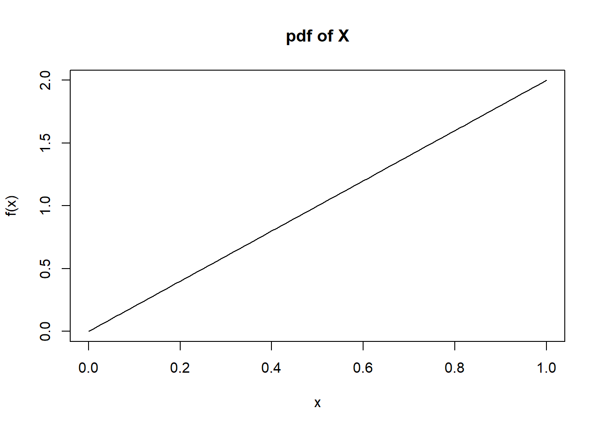
<p class="caption">(\#fig:plot111-fig)pdf of $X$</p>
</div>

\newpage 
The cdf of $X$ is found by 
$$
\int_0^x 2t \diff t = t^2\bigg|_0^x = x^2
$$
This is `antiD` found from the calculations above.  

So,
$$
F_X(x)=\left\{ \begin{array}{ll} 0, & x<0 \\ x^2, & 0\leq x \leq 1 \\ 1, & x>1 \end{array}\right.
$$

The plot of the cdf of $X$ is shown in Figure \@ref(fig:plot112-fig).  

<div class="figure" style="text-align: center">
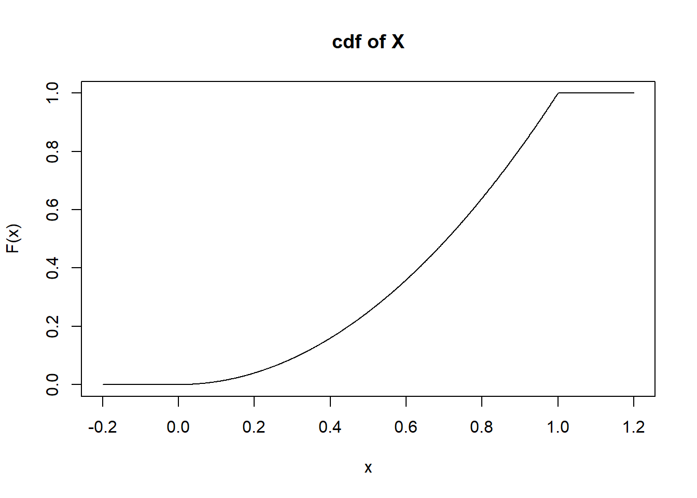
<p class="caption">(\#fig:plot112-fig)cdf of $X$</p>
</div>

Probabilities are found either by integrating the pdf or using the cdf:

$\Prob(X < 0.5)=\Prob(X\leq 0.5)=F_X(0.5)=0.5^2=0.25$. See Figure \@ref(fig:plot113-fig).

<div class="figure" style="text-align: center">

<p class="caption">(\#fig:plot113-fig)Probability represented by shaded area</p>
</div>

$\Prob(X > 0.5) = 1-\Prob(X\leq 0.5)=1-0.25 = 0.75$ See Figure \@ref(fig:plot114-fig).


<div class="figure" style="text-align: center">

<p class="caption">(\#fig:plot114-fig)Probability represented by shaded area</p>
</div>

$\Prob(0.1\leq X < 0.75) = \int_{0.1}^{0.75}2x\diff x = 0.75^2 - 0.1^2 = 0.5525$ See Figure \@ref(fig:plot115-fig).


```r
integrate(function(x)2*x,.1,.75)
```

```
## 0.5525 with absolute error < 6.1e-15
```


Alternatively, $\Prob(0.1\leq X < 0.75) = \Prob(X < 0.75) -\Prob(x \leq  0.1) = F(0.75)-F(0.1)=0.75^2-0.1^2 =0.5525$


```r
Fx(0.75)-Fx(0.1)
```

```
## [1] 0.5525
```

Notice for a continuous random variable, we are loose with the use of the `=` sign. This is because for a continuous random variable $\Prob(X=x)=0$. Do not get sloppy when working with discrete random variables.

<div class="figure" style="text-align: center">

<p class="caption">(\#fig:plot115-fig)Probability represented by shaded area</p>
</div>

The median of $X$ is the value $x$ such that $\Prob(X\leq x)=0.5$, the area under a single point is 0. So we simply solve $x^2=0.5$ for $x$. Thus, the median of $X$ is $\sqrt{0.5}=0.707$. 

Or using `R`


```r
uniroot(function(x)(Fx(x)-.5),c(0,1))$root
```

```
## [1] 0.7071067
```


### Simulation 

As in the case of the discrete random variable, we can simulate a continuous random variable if we have an inverse for the cdf. The range of the cdf is $[0,1]$, so we generate a random number in this interval and then apply the inverse cdf to obtain a random variable. In a similar manner, for a continuous random variable, we use the following pseudo code:  
1. Generate a random number in the interval $[0,1]$, $U$.  
2. Find the random variable $X$ from $F_{X}^{-1}(U)$.  
In `R` for our example, this looks like the following.


```r
sqrt(runif(1))
```

```
## [1] 0.6137365
```


```r
results <- do(10000)*sqrt(runif(1))
```

\pagebreak 


```r
inspect(results)
```

```
## 
## quantitative variables:  
##      name   class         min        Q1    median        Q3       max      mean
## ...1 sqrt numeric 0.005321359 0.4977011 0.7084257 0.8656665 0.9999873 0.6669452
##             sd     n missing
## ...1 0.2358056 10000       0
```

\pagebreak 

Figure \@ref(fig:plot116-fig) is a density plot of the simulated density function.


```r
results %>%
  gf_density(~sqrt,xlab="X") %>%
  gf_theme(theme_bw()) %>%
  gf_labs(x="X",y="")
```

<div class="figure">

<p class="caption">(\#fig:plot116-fig)Density plot of the simulated random variable.</p>
</div>


## Moments

As with discrete random variables, moments can be calculated to summarize characteristics such as center and spread. In the discrete case, expectation is found by multiplying each possible value by its associated probability and summing across the domain ($\E(X)=\sum_x x\cdot f_X(x)$). In the continuous case, the domain of $X$ consists of an infinite set of values. From your calculus days, recall that the sum across an infinite domain is represented by an integral. 

Let $g(X)$ be any function of $X$. The expectation of $g(X)$ is found by:
$$
\E(g(X)) = \int_{S_X} g(x)f_X(x)\diff x
$$

### Mean and variance

Let $X$ be a continuous random variable. The mean of $X$, or $\mu_X$, is simply $\E(X)$. Thus, 
$$
\E(X)=\int_{S_X}x\cdot f_X(x)\diff x
$$

As in the discrete case, the variance of $X$ is the expected squared difference from the mean, or $\E[(X-\mu_X)^2]$. Thus,
$$
\sigma^2_X = \Var(X)=\E[(X-\mu_X)^2]= \int_{S_X} (x-\mu_X)^2\cdot f_X(x) \diff x
$$

Recall homework problem 6 from the last chapter. In this problem, you showed that $\Var(X)=\E(X^2)-\E(X)^2$. Thus,
$$
\Var(X)=\E(X^2)-\E(X)^2 = \int_{S_X} x^2\cdot f_X(x)\diff x - \mu_X^2 
$$

> *Example*:  
Consider the random variable $X$ from above. Find the mean and variance of $X$. 
$$
\mu_X= \E(X)=\int_0^1 x\cdot 2x\diff x = \frac{2x^3}{3}\bigg|_0^1 = \frac{2}{3}=0.667
$$

Side note: Since the mean of $X$ is smaller than the median of $X$, we say that $X$ is skewed to the left, or negatively skewed. 

Using `R`.


```r
integrate(function(x)x*2*x,0,1)
```

```
## 0.6666667 with absolute error < 7.4e-15
```

Or using `antiD()`


```r
Ex<-antiD(2*x^2~x)
Ex(1)-Ex(0)
```

```
## [1] 0.6666667
```


Using our simulation.


```r
mean(~sqrt,data=results)
```

```
## [1] 0.6669452
```


$$
\sigma^2_X = \Var(X)= \E(X^2)-\E(X)^2 = \int_0^1 x^2\cdot 2x\diff x - \left(\frac{2}{3}\right)^2 = \frac{2x^4}{4}\bigg|_0^1-\frac{4}{9}=\frac{1}{2}-\frac{4}{9}=\frac{1}{18}=0.056
$$


```r
integrate(function(x)x^2*2*x,0,1)$value-(2/3)^2
```

```
## [1] 0.05555556
```

or


```r
Vx<-antiD(x^2*2*x~x)
Vx(1)-Vx(0)-(2/3)^2
```

```
## [1] 0.05555556
```


```r
var(~sqrt,data=results)*9999/10000
```

```
## [1] 0.05559873
```


And finally, the standard deviation of $X$ is $\sigma_X = \sqrt{\sigma^2_X}=\sqrt{1/18}=0.236$. 

## Homework Problems

1. Let $X$ be a continuous random variable on the domain $-k \leq X \leq k$. Also, let $f(x)=\frac{x^2}{18}$. 

a. Assume that $f(x)$ is a valid pdf. Find the value of $k$.  
b. Plot the pdf of $X$.   
c. Find and plot the cdf of $X$.  
d. Find $\Prob(X<1)$.   
e. Find $\Prob(1.5<X\leq 2.5)$.  
f. Find the 80th percentile of $X$ (the value $x$ for which 80% of the distribution is to the left of that value).   
g. Find the value $x$ such that $\Prob(-x \leq X \leq x)=0.4$.   
h. Find the mean and variance of $X$.   
i. Simulate 10000 values from this distribution and plot the density.


2. Let $X$ be a continuous random variable. Prove that the cdf of $X$, $F_X(x)$ is a non-decreasing function. (Hint: show that for any $a < b$, $F_X(a) \leq F_X(b)$.)


<!--chapter:end:11-Continuous-Random-Variables.Rmd-->

# Named Discrete Distributions {#DISCRETENAMED}


## Objectives

1) Recognize and setup for use common discrete distributions (Uniform, Binomial, Poisson, Hypergeometric) to include parameters, assumptions, and moments.   
2) Use `R` to calculate probabilities and quantiles involving random variables with common discrete distributions. 


## Named distributions

In the previous two lessons, we introduced the concept of random variables, distribution functions, and expectations. In some cases, the nature of an experiment may yield random variables with common distributions. In these cases, we can rely on easy-to-use distribution functions and built-in `R` functions in order to calculate probabilities and quantiles. 

### Discrete uniform distribution

The first distribution we will discuss is the discrete uniform distribution. It is not a very commonly used distribution, especially compared to its continuous counterpart. A discrete random variable has the discrete uniform distribution if probability is evenly allocated to each value in the sample space. A variable with this distribution has parameters $a$ and $b$ representing the minimum and maximum of the sample space, respectively. (By default, that sample space is assumed to consist of integers only, but that is by no means always the case.) 

> *Example*:  
Rolling a fair die is an example of the discrete uniform. Each side of the die has an equal probability.

Let $X$ be a discrete random variable with the uniform distribution. If the sample space is consecutive integers, this distribution is denoted as $X\sim\textsf{DUnif}(a,b)$. The pmf of $X$ is given by:
$$
f_X(x)=\left\{\begin{array}{ll}\frac{1}{b-a+1}, & x \in \{a, a+1,...,b\} \\ 
0, & \mbox{otherwise} \end{array}\right.
$$

For the die:  
$$
f_X(x)=\left\{\begin{array}{ll}\frac{1}{6-1+1} = \frac{1}{6}, & x \in \{1, 2,...,6\} \\ 
0, & \mbox{otherwise} \end{array}\right.
$$

The expected value of $X$ is found by:
$$
\E(X)=\sum_{x=a}^b x\cdot\frac{1}{b-a+1}= \frac{1}{b-a+1} \cdot \sum_{x=a}^b x=\frac{1}{b-a+1}\cdot\frac{b-a+1}{2}\cdot (a+b) = \frac{a+b}{2}
$$

Where the sum of consecutive integers is a common result from discrete math, research it for more information.

The variance of $X$ is found by: (derivation not included)
$$
\Var(X)=\E[(X-\E(X))^2]=\frac{(b-a+1)^2-1}{12}
$$

Summarizing for the die:  

Let $X$ be the result of a single roll of a fair die. We will report the distribution of $X$, the pmf, $\E(X)$ and $\Var(X)$. 

The sample space of $X$ is $S_X=\{1,2,3,4,5,6\}$. Since each of those outcomes is equally likely, $X$ follows the discrete uniform distribution with $a=1$ and $b=6$. Thus, 
$$
f_X(x)=\left\{\begin{array}{ll}\frac{1}{6}, & x \in \{1,2,3,4,5,6\} \\ 
0, & \mbox{otherwise} \end{array}\right.
$$

Finally, $\E(X)=\frac{1+6}{2}=3.5$. Also, $\Var(X)=\frac{(6-1+1)^2-1}{12}=\frac{35}{12}=2.917$. 

### Simulating

To simulate the discrete uniform, we use `sample()`.

> *Example*:  
To simulate rolling a die 4 times, we use `sample()`.


```r
set.seed(61)
sample(1:6,4,replace=TRUE)
```

```
## [1] 4 2 2 1
```


Let's roll it 10,000 times and find 


```r
results<-do(10000)*sample(1:6,1,replace=TRUE)
```


```r
tally(~sample,data=results,format="percent")
```

```
## sample
##     1     2     3     4     5     6 
## 16.40 16.46 16.83 17.15 16.92 16.24
```


```r
mean(~sample,data=results)
```

```
## [1] 3.5045
```


```r
var(~sample,data=results)*(10000-1)/10000
```

```
## [1] 2.87598
```
Again as a reminder, we multiply by $\frac{(10000-1)}{10000}$ because the function `var()` is calculating a sample variance using $n-1$ in the denominator but we need the population variance. 


### Binomial distribution

The binomial distribution is extremely common, and appears in many situations. In fact, we have already discussed several examples where the binomial distribution is heavily involved. 

Consider an experiment involving repeated *independent trials* of a binary process (two outcomes), where in each trial, there is a *constant probability* of "success" (one of the outcomes which is arbitrary). If the random variable $X$ represents the number of successes out of $n$ independent trials, then $X$ is said to follow the binomial distribution with parameters $n$ and $p$ (the probability of a success in each trial). 

The pmf of $X$ is given by:
$$
f_X(x)=\Prob(X=x)={n\choose{x}}p^x(1-p)^{n-x}
$$

for $x \in \{0,1,...,n\}$ and 0 otherwise. 

Let's take a moment to dissect this pmf. We are looking for the probability of obtaining $x$ successes out of $n$ trials. The $p^x$ represents the probability of $x$ successes, using the multiplication rule because of the independence assumption. The term $(1-p)^{n-x}$ represents the probability of the remainder of the trials as failures. Finally, the $n\choose x$ term represents the number of ways to obtain $x$ successes out of $n$ trials. For example, there are three ways to obtain 1 success out of 3 trials (one success followed by two failures; one success, one failure then one success; or two failures followed by a success). 

The expected value of a binomially distributed random variable is given by $\E(X)=np$ and the variance is given by $\Var(X)=np(1-p)$. 

> *Example*:  
Let $X$ be the number of heads out of 20 independent flips of a fair coin. Note that this is a binomial because the trials are independent and the probability of success, in this case a heads, is constant, and there are two outcomes. Find the distribution, mean and variance of $X$. Find $\Prob(X=8)$. Find $\Prob(X\leq 8)$. 

$X$ has the binomial distribution with $n=20$ and $p=0.5$. The pmf is given by:
$$
f_X(x)=\Prob(X=x)={20 \choose x}0.5^x (1-0.5)^{20-x}
$$

Also, $\E(X)=20*0.5=10$ and $\Var(X)=20*0.5*0.5=5$. 

To find $\Prob(X=8)$, we can simply use the pmf: 
$$
\Prob(X=8)=f_X(8)={20\choose 8}0.5^8 (1-0.5)^{12}
$$

```r
choose(20,8)*0.5^8*(1-0.5)^12
```

```
## [1] 0.1201344
```

To find $\Prob(X\leq 8)$, we would need to find the cumulative probability: 
$$
\Prob(X\leq 8)=\sum_{x=0}^8 {20\choose 8}0.5^x (1-0.5)^{20-x}
$$

```r
x<-0:8
sum(choose(20,x)*0.5^x*(1-.5)^(20-x))
```

```
## [1] 0.2517223
```

### Software Functions

One of the advantages of using named distributions is that most software packages have built-in functions that compute probabilities and quantiles for common named distributions. Over the course of this lesson, you will notice that each named distribution is treated similarly in `R`. There are four main functions tied to each distribution. For the binomial distribution, these are `dbinom()`, `pbinom()`, `qbinom()`, and `rbinom()`. 

`dbinom()`: This function is equivalent to the probability mass function. We use this to find $\Prob(X=x)$ when $X\sim \textsf{Binom}(n,p)$. This function takes three inputs: `x` (the value of the random variable), `size` (the number of trials, $n$), and `prob` (the probability of success, $p$). So,
$$
\Prob(X=x)={n\choose{x}}p^x(1-p)^{n-x}=\textsf{dbinom(x,n,p)}
$$

`pbinom()`: This function is equivalent to the cumulative distribution function. We use this to find $\Prob(X\leq x)$ when $X\sim \textsf{Binom}(n,p)$. This function takes the same inputs as `dbinom()` but returns the cumulative probability: 
$$
\Prob(X\leq x)=\sum_{k=0}^x{n\choose{k}}p^k(1-p)^{n-k}=\textsf{pbinom(x,n,p)}
$$

`qbinom()`: This is the inverse of the cumulative distribution function and will return a percentile. This function has three inputs: `p` (a probability), `size` and `prob`. It returns the smallest value $x$ such that $\Prob(X\leq x) \geq p$. 

`rbinom()`: This function is used to randomly generate values from the binomial distribution. It takes three inputs: `n` (the number of values to generate), `size` and `prob`. It returns a vector containing the randomly generated values. 

To learn more about these functions, type `?` followed the function in the console.

> **Exercise**:  
Use the built-in functions for the binomial distribution to plot the pmf of $X$ from the previous example. Also, use the built-in functions to compute the probabilities from the example. 

Figure \@ref(fig:binom-fig)


```r
gf_dist("binom",size=20,prob=.5) %>%
  gf_theme(theme_bw()) %>%
  gf_labs(x="X",y="P(X=x)")
```

<div class="figure" style="text-align: center">

<p class="caption">(\#fig:binom-fig)The pmf of a binomial random variable</p>
</div>


```r
###P(X=8)
dbinom(8,20,0.5)
```

```
## [1] 0.1201344
```

```r
###P(X<=8)
pbinom(8,20,0.5)
```

```
## [1] 0.2517223
```

```r
## or 
sum(dbinom(0:8,20,0.5))
```

```
## [1] 0.2517223
```

### Poisson distribution

The Poisson distribution is very common when considering count or arrival data. Consider a random process where events occur according to some rate over time (think arrivals to a retail register). Often, these events are modeled with the *Poisson process*. The Poisson process assumes a consistent rate of arrival and a memoryless arrival process (the time until the next arrival is independent of time since the last arrival). If we assume a particular process is a Poisson process, then there are two random variables that take common named distributions. The number of arrivals in a specified amount of time follows the *Poisson* distribution. Also, the amount of time until the next arrival follows the *exponential* distribution. We will defer discussion of the exponential distribution until the next lesson. What is random in the *Poisson* is the number of occurrences while the interval is fixed. That is why it is a discrete distribution. The parameter $\lambda$ is the average number of occurrences in the specific interval, note that the interval must be the same as is specified in the random variable. 

Let $X$ be the number of arrivals in a length of time, $T$, where arrivals occur according to a Poisson process with an average of $\lambda$ arrivals in length of time $T$. Then $X$ follows a Poisson distribution with parameter $\lambda$:
$$
X\sim \textsf{Poisson}(\lambda)
$$

The pmf of $X$ is given by:
$$
f_X(x)=\Prob(X=x)=\frac{\lambda^xe^{-\lambda}}{x!}, \hspace{0.5cm} x=0,1,2,...
$$

One unique feature of the Poisson distribution is that $\E(X)=\Var(X)=\lambda$.

> *Example*:  
Suppose fleet vehicles arrive to a maintenance garage at an average rate of 0.4 per day. Let's assume that these vehicles arrive according to a Poisson process. Let $X$ be the number of vehicles that arrive to the garage in a week (7 days). Notice that the time interval has changed! What is the random variable $X$? What is the distribution (with parameter) of $X$. What are $\E(X)$ and $\Var(X)$? Find $\Prob(X=0)$, $\Prob(X\leq 6)$, $\Prob(X \geq 2)$, and $\Prob(2 \leq X \leq 8)$. Also, find the median of $X$, and the 95th percentile of $X$ (the value of $x$ such that $\Prob(X\leq x)\geq 0.95$). Further, plot the pmf of $X$. 

Since vehicles arrive according to a Poisson process, the probability question leads us to define the random variable $X$ as *The number of vehicles that arrive in a week*. 

We know that $X\sim \textsf{Poisson}(\lambda=0.4*7=2.8)$. Thus, $\E(X)=\Var(X)=2.8$. 

The parameter is the average number of vehicles that arrive in a **week**.  

$$
\Prob(X=0)=\frac{2.8^0 e^{-2.8}}{0!}=e^{-2.8}=0.061
$$

Alternatively, we can use the built-in `R` functions for the Poisson distribution:

```r
##P(X=0)
dpois(0,2.8)
```

```
## [1] 0.06081006
```

```r
##P(X<=6)
ppois(6,2.8)
```

```
## [1] 0.9755894
```

```r
## or
sum(dpois(0:6,2.8))
```

```
## [1] 0.9755894
```

```r
##P(X>=2)=1-P(X<2)=1-P(X<=1)
1-ppois(1,2.8)
```

```
## [1] 0.7689218
```

```r
## or
sum(dpois(2:1000,2.8))
```

```
## [1] 0.7689218
```

Note that when considering $\Prob(X\geq 2)$, we recognize that this is equivalent to $1-\Prob(X\leq 1)$. We can use `ppois()` to find this probability. 

When considering $\Prob(2\leq X \leq 8)$, we need to make sure we formulate this correctly. Below are two possible methods: 

```r
##P(2 <= X <= 8) = P(X <= 8)-P(X <= 1)
ppois(8,2.8)-ppois(1,2.8)
```

```
## [1] 0.766489
```

```r
## or
sum(dpois(2:8,2.8))
```

```
## [1] 0.766489
```

To find the median and the 95th percentiles, we use `qpois`:

```r
qpois(0.5,2.8)
```

```
## [1] 3
```

```r
qpois(0.95,2.8)
```

```
## [1] 6
```

Figure \@ref(fig:pois-fig) is a plot of the pmf of a Poisson random variable.


```r
gf_dist("pois",lambda=2.8) %>%
  gf_theme(theme_bw()) %>%
  gf_labs(x="X",y="P(X=x)")
```

<div class="figure" style="text-align: center">
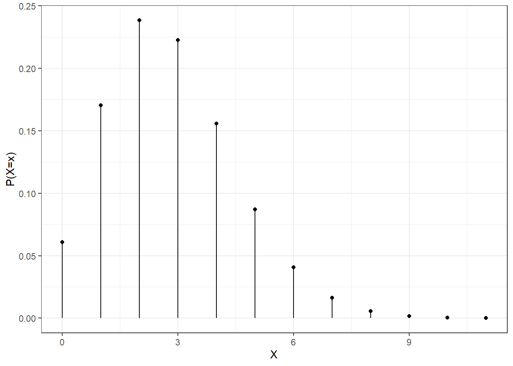
<p class="caption">(\#fig:pois-fig)The pmf of a Poisson random variable.</p>
</div>

Figure \@ref(fig:pois2-fig) is the cdf of the same Poisson random variable in Figure \@ref(fig:pois-fig).

(ref:quote121) The cdf of the Poisson random variable in Figure \@ref(fig:pois-fig)


```r
gf_dist("pois",lambda=2.8,kind="cdf") %>%
  gf_theme(theme_bw()) %>%
  gf_labs(x="X",y="P(X<=x)")
```

<div class="figure" style="text-align: center">

<p class="caption">(\#fig:pois2-fig)(ref:quote121)</p>
</div>


### Hypergeometric

Consider an experiment where $k$ objects are to be selected from a larger, but finite, group consisting of $m$ "successes" and $n$ "failures". This is similar to the binomial process; after all, we are selecting successes and failures. However, in this case, the results are effectively selected *without replacement*. If the random variable $X$ represents the number of successes selected in our sample of size $k$, then $X$ follows a hypergeometric distribution with parameters $m$, $n$, and $k$. The pmf of $X$ is given by:

$$
f_X(x) = \frac{{m \choose{x}}{n \choose{k-x}}}{{m+n \choose{k}}}, \qquad x = 0,1,...,m
$$

Also, $\E(X)=\frac{km}{m+n}$ and $\Var(X)=k\frac{m}{m+n}\frac{n}{m+n}\frac{m+n-k}{m+n-1}$

If you draw on your knowledge of combinations, you can see why this pmf makes sense. 

> *Example*:  
Suppose a bag contains 12 red chips and 8 black chips. I reach in blindly and randomly select 6 chips. What is the probability I select no black chips? All black chips? Between 2 and 5 black chips? 

First we should identify a random variable that will help us with this problem. Let $X$ be the number of black chips selected when randomly selecting 6 from the bag. Then $X\sim \textsf{HyperGeom}(8,12,6)$. We can use `R` to find these probabilities. 

First, the plot of the pmf of the hypergeometric is in Figure \@ref(fig:hyper-fig).


```r
gf_dist("hyper",m=8,n=12,k=6) %>%
  gf_theme(theme_bw()) %>%
  gf_labs(x="X",y="P(X=x)")
```

<div class="figure" style="text-align: center">
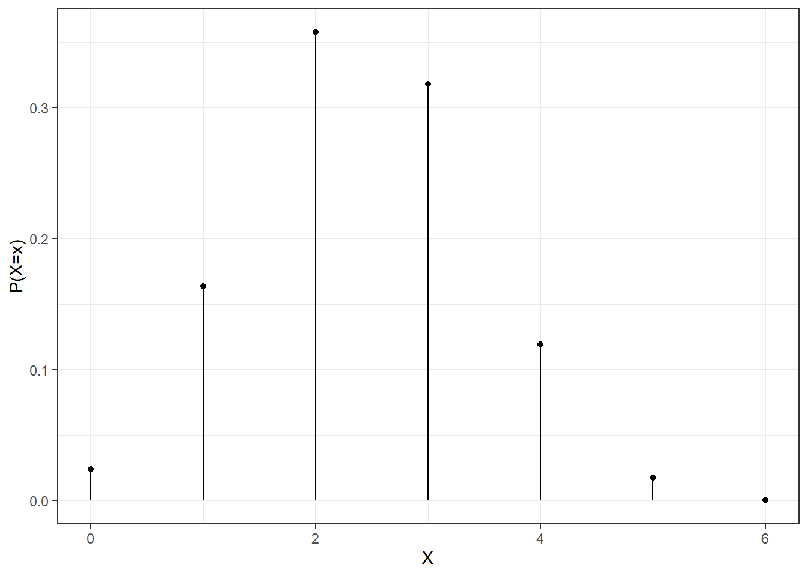
<p class="caption">(\#fig:hyper-fig)The pmf of a hypergeometric random variable.</p>
</div>


```r
##P(X=0)
dhyper(0,8,12,6)
```

```
## [1] 0.02383901
```

```r
##P(X=6)
dhyper(6,8,12,6)
```

```
## [1] 0.0007223942
```

```r
##P(2 <= X <=5)
sum(dhyper(2:5,8,12,6))
```

```
## [1] 0.8119711
```


## Homework Problems

For each of the problems below, **_1)_** define a random variable that will help you answer the question, **_2)_** state the distribution and parameters of that random variable; **_3)_** determine the expected value and variance of that random variable, and **_4)_** use that random variable to answer the question. 

We will demonstrate using 1a and 1b. 

1. The T-6 training aircraft is used during UPT. Suppose that on each training sortie, aircraft return with a maintenance-related failure at a rate of 1 per 100 sorties. 

a. Find the probability of no maintenance failures in 15 sorties. 

$X$: the number of maintenance failures in 15 sorties. 

$X\sim \textsf{Bin}(n=15,p=0.01)$

$\E(X)=15*0.01=0.15$ and $\Var(X)=15*0.01*0.99=0.1485$. 

$\Prob(\mbox{No mainteance failures})=\Prob(X=0)={15\choose 0}0.01^0(1-0.01)^{15}=0.99^{15}$

```r
0.99^15
```

```
## [1] 0.8600584
```

```r
## or 
dbinom(0,15,0.01)
```

```
## [1] 0.8600584
```

This probability makes sense, since the expected value is fairly low. Because, on average, only 0.15 failures would occur every 15 trials, 0 failures would be a very common result. Graphically, the pmf looks like Figure \@ref(fig:hw1a). 


```r
gf_dist("binom",size=15,prob=0.01) %>%
  gf_theme(theme_bw()) %>%
  gf_labs(x="X",y="P(X=x)")
```

<div class="figure" style="text-align: center">

<p class="caption">(\#fig:hw1a)The pmf for binomail in Homework Problem 1a.</p>
</div>

b. Find the probability of at least two maintenance failures in 15 sorties. 

We can use the same $X$ as above. Now, we are looking for $\Prob(X\geq 2)$. This is equivalent to finding $1-\Prob(X\leq 1)$:

```r
## Directly
1-(0.99^15 + 15*0.01*0.99^14)
```

```
## [1] 0.009629773
```

```r
## or, using R
sum(dbinom(2:15,15,0.01))
```

```
## [1] 0.009629773
```

```r
## or
1-sum(dbinom(0:1,15,0.01))
```

```
## [1] 0.009629773
```

```r
## or
1-pbinom(1,15,0.01)
```

```
## [1] 0.009629773
```

```r
## or 
pbinom(1,15,0.01,lower.tail = F)
```

```
## [1] 0.009629773
```

c. Find the probability of at least 30 successful (no mx failures) sorties before the first failure.  
d. Find the probability of at least 50 successful sorties before the third failure. 


2. On a given Saturday, suppose vehicles arrive at the USAFA North Gate according to a Poisson process at a rate of 40 arrivals per hour. 

a. Find the probability no vehicles arrive in 10 minutes.  
b. Find the probability at least 50 vehicles arrive in an hour.  
c. Find the probability that at least 5 minutes will pass before the next arrival.

3. Suppose there are 12 male and 7 female cadets in a classroom. I select 5 completely at random (without replacement). 

a. Find the probability I select no female cadets.  
b. Find the probability I select more than 2 female cadets. 

<!--chapter:end:12-Named-Discrete-Distributions.Rmd-->

# Named Continuous Distributions {#CONTNNAMED}


## Objectives

1) Recognize when to use common continuous distributions (Uniform, Exponential, Gamma, Normal, Weibull, and Beta), identify parameters, and find moments.   
2) Use `R` to calculate probabilities and quantiles involving random variables with common continuous distributions.  
3) Understand the relationship between the Poisson process and the Poisson & Exponential distributions.   
4) Know when to apply and then use the memoryless property. 

## Continuous distributions 

In this lesson we will explore continuous distributions. This means we work with probability density functions and use them to find probabilities. Thus we must integrate, either numerically, graphically, or mathematically. The cumulative distribution function will also play an important role in this lesson. 

There are many more distributions than the ones in this lesson but these are the most common and will set you up to learn and use any others in the future.

### Uniform distribution

The first continuous distribution we will discuss is the uniform distribution. By default, when we refer to the uniform distribution, we are referring to the continuous version. When referring to the discrete version, we use the full term "discrete uniform distribution."

A continuous random variable has the uniform distribution if probability density is constant, **uniform**. The parameters of this distribution are $a$ and $b$, representing the minimum and maximum of the sample space. This distribution is commonly denoted as $U(a,b)$.

Let $X$ be a continuous random variable with the uniform distribution. This is denoted as $X\sim \textsf{Unif}(a,b)$. The pdf of $X$ is given by:
$$
f_X(x)=\left\{\begin{array}{ll} \frac{1}{b-a}, & a\leq x \leq b \\ 0, & \mbox{otherwise} \end{array}\right.
$$

The mean of $X$ is $\E(X)=\frac{a+b}{2}$ and the variance is $\Var(X)=\frac{(b-a)^2}{12}$. The derivation of the mean is left to the exercises.   

The most common uniform distribution is $U(0,1)$ which we have already used several times in this book. Again, notice in Figure \@ref(fig:uni-fig) that the plot of the **pdf** is a constant or uniform value.


```r
gf_dist("unif",title="Pdf of Uniform random variable",ylab="f(x)") %>%
  gf_theme(theme_bw())
```

<div class="figure">

<p class="caption">(\#fig:uni-fig)The pdf of Uniform random variable.</p>
</div>

To check that it is a proper pdf, all values must be non-negative and the total probability must be 1. In `R` the function for probability density will start with the letter **d** and have some short descriptor for the distribution. For the uniform we use `dunif()`.


```r
integrate(function(x)dunif(x),0,1)
```

```
## 1 with absolute error < 1.1e-14
```


### Exponential distribution

Recall from the lesson on named discrete distributions, we discussed the Poisson process. If arrivals follow a Poisson process, we know that the number of arrivals in a specified amount of time follows a Poisson distribution, and the time until the next arrival follows the *exponential* distribution. In the Poisson distribution, the number of arrivals is random and the interval is fixed. In the exponential distribution we change this, the interval is random and the arrivals are fixed at 1. This is a subtle point but worth the time to make sure you understand. 

Let $X$ be the number of arrivals in a time interval $T$, where arrivals occur according to a Poisson process with an average of $\lambda$ arrivals per unit time interval. From the previous lesson, we know that $X\sim \textsf{Poisson}(\lambda T)$. Now let $Y$ be the time until the next arrival. Then $Y$ follows the exponential distribution with parameter $\lambda$ which has units of inverse base time:

$$
Y \sim \textsf{Expon}(\lambda)
$$

Note on $\lambda$: One point of confusion involving the parameters of the Poisson and exponential distributions. The parameter of the Poisson distribution (usually denoted as $\lambda$) represents the average number of arrivals in whatever amount of time specified by the random variable. In the case of the exponential distribution, the parameter (also denoted as $\lambda$) represents the average number of arrivals per unit time. For example, suppose arrivals follow a Poisson process with an average of 10 arrivals per day. $X$, the number of arrivals in 5 days, follows a Poisson distribution with parameter $\lambda=50$, since that is the average number of arrivals in the amount of time specified by $X$. Meanwhile, $Y$, the time in days until the next arrival, follows an exponential distribution with parameter $\lambda=10$ (the average number of arrivals per day). 

The pdf of $Y$ is given by:
$$
f_Y(y)=\lambda e^{-\lambda y}, \hspace{0.3cm} y>0
$$

The mean and variance of $Y$ are: $\E(Y)=\frac{1}{\lambda}$ and $\Var(Y)=\frac{1}{\lambda^2}$. You should be able to derive these results but they require integration by parts and can be lengthy algebraic exercises. 

> *Example*:  
Suppose at a local retail store, customers arrive to a checkout counter according to a Poisson process with an average of one arrival every three minutes. Let $Y$ be the time (in minutes) until the next customer arrives to the counter. What is the distribution (and parameter) of $Y$? What are $\E(Y)$ and $\Var(Y)$? Find $\Prob(Y>5)$, $\Prob(Y\leq 3)$, and $\Prob(1 \leq Y < 5)$? Also, find the median and 95th percentile of $Y$. Finally, plot the pdf of $Y$. 

Since one arrival shows up every three minutes, the average number of arrivals per unit time is 1/3 arrival per minute. Thus, $Y\sim \textsf{Expon}(\lambda=1/3)$. This means that $\E(Y)=3$ and $\Var(Y)=9$. 

To find $\Prob(Y>5)$, we could integrate the pdf of $Y$:
$$
\Prob(Y>5)=\int_5^\infty \frac{1}{3}e^{-\frac{1}{3}y}\diff y = \lim_{a \to +\infty}\int_5^a \frac{1}{3}e^{-\frac{1}{3}y}\diff y = $$


$$\lim_{a \to +\infty} -e^{-\frac{1}{3}y}\bigg|_5^a=\lim_{a \to +\infty} -e^{-\frac{a}{3}}-(-e^{-\frac{5}{3}})= 0 + 0.189 = 0.189
$$

Alternatively, we could use `R`:

```r
##Prob(Y>5)=1-Prob(Y<=5)
1-pexp(5,1/3)
```

```
## [1] 0.1888756
```

Or using `integrate()`


```r
integrate(function(x)1/3*exp(-1/3*x),5,Inf)
```

```
## 0.1888756 with absolute error < 8.5e-05
```


For the remaining probabilities, we will use `R`:

```r
##Prob(Y<=3)
pexp(3,1/3)
```

```
## [1] 0.6321206
```

```r
##Prob(1<=Y<5)
pexp(5,1/3)-pexp(1,1/3)
```

```
## [1] 0.5276557
```

The median is $y$ such that $\Prob(Y\leq y)=0.5$. We can find this by solving the following for $y$:
$$
\int_0^y \frac{1}{3}e^{-\frac{1}{3}y}\diff y = 0.5
$$

Alternatively, we can use `qexp` in `R`:

```r
##median
qexp(0.5,1/3)
```

```
## [1] 2.079442
```

```r
##95th percentile
qexp(0.95,1/3)
```

```
## [1] 8.987197
```


<div class="figure" style="text-align: center">

<p class="caption">(\#fig:exp-fig)pdf of exponential random varible $Y$</p>
</div>

Both from Figure \@ref(fig:exp-fig) and the mean and median, we know that the exponential distribution is skewed to the right.

### Memoryless property

The Poisson process is known for its *memoryless* property. Essentially, this means that the time until the next arrival is independent of the time since last arrival. Thus, the probability of an arrival within the next 5 minutes is the same regardless of whether an arrival just occurred or an arrival has not occurred for a long time. 

To show this let's consider random variable $Y$ ( time until the next arrival in minutes) where $Y\sim\textsf{Expon}(\lambda)$. We will show that, given it has been at least $t$ minutes since the last arrival, the probability we wait at least $y$ additional minutes is equal to the marginal probability that we wait $y$ additional minutes. 

First, note that the cdf of $Y$, $F_Y(y)=\Prob(Y\leq y)=1-e^{-\lambda y}$, you should be able to derive this. So,
$$
\Prob(Y\geq y+t|Y\geq t) = \frac{\Prob(Y\geq y+t \cap Y\geq t)}{\Prob(Y\geq t)}=\frac{\Prob(Y\geq y +t)}{\Prob(Y\geq t)} = \frac{1-(1-e^{-(y+t)\lambda})}{1-(1-e^{-t\lambda})}
$$
$$
=\frac{e^{-\lambda y }e^{-\lambda t}}{e^{-\lambda t }}=e^{-\lambda y} = 1-(1-e^{-\lambda y})=\Prob(Y\geq y). 
\blacksquare
$$


Let's simulate values for a Poisson. The Poisson is often used in modeling customer service situations such as service at Chipotle. However, some people have the mistaken idea that arrivals will be equally spaced. In fact, arrivals will come in clusters and bunches. Maybe this is the root of the common expression, "Bad news comes in threes"?  


<div class="figure">

<p class="caption">(\#fig:sim-fig)Simulations of Poisson random variable.</p>
</div>

In Figure \@ref(fig:sim-fig), the number of events in a box is $X\sim \textsf{Poisson}(\lambda = 5)$. As you can see, some boxes have more than 5 and some less because 5 is the average number of arrivals. Also note that the spacing is not equal. The 8 different runs are just repeated simulations of the same process. We can see spacing and clusters in each run.


### Gamma distribution

The gamma distribution is a generalization of the exponential distribution. In the exponential distribution, the parameter $\lambda$ is sometimes referred to as the *rate* parameter. The gamma distribution is sometimes used to model wait times (as with the exponential distribution), but in cases without the memoryless property. The gamma distribution has two parameters, *rate* and *shape*. In some texts, *scale* (the inverse of rate) is used as an alternative parameter to rate. 

Suppose $X$ is a random variable with the gamma distribution with shape parameter $\alpha$ and rate parameter $\lambda$:
$$
X \sim \textsf{Gamma}(\alpha,\lambda)
$$

$X$ has the following pdf:
$$
f_X(x)=\frac{\lambda^\alpha}{\Gamma (\alpha)}x^{\alpha-1}e^{-\lambda x}, \hspace{0.3cm} x>0
$$

and 0 otherwise. The mean and variance of $X$ are $\E(X)=\frac{\alpha}{\lambda}$ and $\Var(X)=\frac{\alpha}{\lambda^2}$. Looking at the pdf, the mean and the variance, one can easily see that if $\alpha=1$, the resulting distribution is equivalent to $\textsf{Expon}(\lambda)$.  

#### Gamma function

You may have little to no background with the Gamma function ($\Gamma (\alpha)$). This is different from the gamma distribution. The gamma function is simply a function and is defined by:
$$
\Gamma (\alpha)=\int_0^\infty t^{\alpha-1}e^{-t}\diff t
$$

There are some important properties of the gamma function. Notably, $\Gamma (\alpha)=(\alpha-1)\Gamma (\alpha -1)$, and if $\alpha$ is a non-negative integer, $\Gamma(\alpha)=(\alpha-1)!$. 

Suppose $X \sim \textsf{Gamma}(\alpha,\lambda)$. The pdf of $X$ for various values of $\alpha$ and $\lambda$ is shown in Figure \@ref(fig:gamma-fig). 

<div class="figure" style="text-align: center">

<p class="caption">(\#fig:gamma-fig)pdf of Gamma for various values of alpha and lambda</p>
</div>


> *Example*:  
Let $X \sim \textsf{Gamma}(\alpha=5,\lambda=1)$. Find the mean and variance of $X$. Also, compute $\Prob(X\leq 2)$ and $\Prob(1\leq X < 8)$. Find the median and 95th percentile of $X$. 

The mean and variance of $X$ are $\E(X)=5$ and $\Var(X)=5$. To find probabilities and quantiles, integration will be difficult, so it's best to use the built-in `R` functions:


```r
## Prob(X<=2)
pgamma(2,5,1)
```

```
## [1] 0.05265302
```

```r
##Prob(1 <= X < 8)
pgamma(8,5,1)-pgamma(1,5,1)
```

```
## [1] 0.8967078
```

```r
## median
qgamma(0.5,5,1)
```

```
## [1] 4.670909
```

```r
## 95th percentile
qgamma(0.95,5,1)
```

```
## [1] 9.153519
```

### Weibull distribution

Another common distribution used in modeling is the Weibull distribution. Like the gamma, the Weibull distribution is a generalization of the exponential distribution and is meant to model wait times. A random variable with the Weibull distribution has parameters $\alpha$ and $\beta$. In `R`, these are referred to as `shape` and `scale` respectively. Note that in some resources, these are represented by $k$ and $\lambda$ or even $k$ and $\theta$. 
Let $X \sim \textsf{Weibull}(\alpha,\beta)$. The pdf of $X$ is given by:
$$
f_X(x)=\frac{\alpha}{\beta} \left(\frac{x}{\beta}\right)^{\alpha-1} e^{-\left(\frac{x}{\beta}\right)^\alpha}, \hspace{0.3cm} x\geq 0
$$

The mean and variance of a random variable with a Weibull distribution can be found by consulting `R` documentation. Look them up and make sure you can use them.


### Normal distribution

The normal distribution (also referred to as Gaussian) is a common distribution found in natural processes. You have likely seen a *bell curve* in various contexts. The bell curve is often indicative of an underlying normal distribution. There are two parameters of the normal distribution: $\mu$ (the mean of $X$) and $\sigma$ (the standard deviation of $X$). 

Suppose a random variable $X$ has a normal distribution with parameters $\mu$ and $\sigma$. The pdf of $X$ is given by: 

$$
f_X(x)=\frac{1}{\sigma\sqrt{2\pi}}e^{-\frac{(x-\mu)^2}{2\sigma^2}}, \hspace{0.3cm} -\infty < x <\infty
$$

Some plots of normal distributions for different parameters are plotted in Figure \@ref(fig:norm-fig).

<div class="figure" style="text-align: center">

<p class="caption">(\#fig:norm-fig)pdf of Normal for various values of mu and sigma</p>
</div>

#### Standard normal

When random variable $X$ is normally distributed with $\mu=0$ and $\sigma=1$, $X$ is said to follow the *standard normal* distribution. Sometimes, the standard normal pdf is denoted by $\phi(x)$. 

Note that any normally distributed random variable can be transformed to have the standard normal distribution. Let $X \sim \textsf{Norm}(\mu,\sigma)$. Then,
$$
Z=\frac{X-\mu}{\sigma} \sim \textsf{Norm}(0,1)
$$

Partially, one can show this is true by noting that the mean of $Z$ is 0 and the variance (and standard deviation) of $Z$ is 1:
$$
\E(Z)=\E\left(\frac{X-\mu}{\sigma}\right)=\frac{1}{\sigma}\left(\E(X)-\mu\right)=\frac{1}\sigma(\mu-\mu)=0
$$
$$
\Var(Z)=\Var\left(\frac{X-\mu}{\sigma}\right)=\frac{1}{\sigma^2}\left(\Var(X)-0\right)=\frac{1}{\sigma^2} \sigma^2=1
$$

Note that this does not prove that $Z$ follows the standard normal distribution; we have merely shown that $Z$ has a mean of 0 and a variance of 1. We will discuss transformation of random variables in a later lesson. 

> *Example*:  
Let $X \sim \textsf{Norm}(\mu=200,\sigma=15)$. Compute $\Prob(X\leq 160)$, $\Prob(180\leq X < 230)$, and $\Prob(X>\mu+\sigma)$. Find the median and 95th percentile of $X$. 

As with the gamma distribution, to find probabilities and quantiles, integration will be difficult, so it's best to use the built-in `R` functions:

```r
## Prob(X<=160)
pnorm(160,200,15)
```

```
## [1] 0.003830381
```

```r
##Prob(180 <= X < 230)
pnorm(230,200,15)-pnorm(180,200,15)
```

```
## [1] 0.8860386
```

```r
##Prob(X>mu+sig)
1-pnorm(215,200,15)
```

```
## [1] 0.1586553
```

```r
## median
qnorm(0.5,200,15)
```

```
## [1] 200
```

```r
## 95th percentile
qnorm(0.95,200,15)
```

```
## [1] 224.6728
```

### Beta distribution

The last common continuous distribution we will study is the beta distribution. This has a unique application in that the domain of a random variable with the beta distribution is $[0,1]$. Thus it is typically used to model proportions. The beta distribution has two parameters, $\alpha$ and $\beta$. (In `R`, these are denoted not so cleverly as `shape1` and `shape2`.) 

Let $X \sim \textsf{Beta}(\alpha,\beta)$. The pdf of $X$ is given by: 
$$
f_X(x)=\frac{\Gamma(\alpha + \beta)}{\Gamma(\alpha)\Gamma(\beta)}x^{\alpha-1}(1-x)^{\beta-1}, \hspace{0.3cm} 0\leq x \leq 1
$$

Yes, our old friend the Gamma function.  In some resources, $\frac{\Gamma(\alpha + \beta)}{\Gamma(\alpha)\Gamma(\beta)}$ is written as $\frac{1}{B(\alpha,\beta)}$, where $B$ is known as the beta function. 

Note that $\E(X)=\frac{\alpha}{\alpha+\beta}$ and $\Var(X)=\frac{\alpha \beta}{(\alpha+\beta)^2(\alpha+\beta+1)}$. 

For various values $\alpha$ and $\beta$, the pdf of a beta distributed random variable is shown in Figure \@ref(fig:beta-fig). 

<div class="figure" style="text-align: center">

<p class="caption">(\#fig:beta-fig)pdf of Beta for various values of alpha and beta</p>
</div>

>**Exercise**  
What is the distribution if $\alpha=\beta=1$?  

It is the uniform. It is easy to verify that $\Gamma(1)=1$ so that $B(1,1)=1$.


##  Homework Problems

For problems 1-3 below, **_1)_** define a random variable that will help you answer the question, **_2)_** state the distribution and parameters of that random variable; **_3)_** determine the expected value and variance of that random variable, and **_4)_** use that random variable to answer the question. 

1. On a given Saturday, suppose vehicles arrive at the USAFA North Gate according to a Poisson process at a rate of 40 arrivals per hour. 

a. Find the probability no vehicles arrive in 10 minutes.   
b. Find the probability that at least 5 minutes will pass before the next arrival.  
c. Find the probability that the next vehicle will arrive between 2 and 10 minutes from now.   
d. Find the probability that at least 7 minutes will pass before the next arrival, given that 2 minutes have already passed. Compare this answer to part (b). This is an example of the memoryless property of the exponential distribution.  
e. Fill in the blank. There is a probability of 90% that the next vehicle will arrive within __ minutes. This value is known as the 90% percentile of the random variable.  
f. Use the function `stripplot()` to visualize the arrival of 30 vehicles using a random sample from the appropriate exponential distribution.

2. Suppose time until computer errors on the F-35 follows a Gamma distribution with mean 20 hours and variance 10.  

a. Find the probability that 20 hours pass without a computer error.  
b. Find the probability that 45 hours pass without a computer error, given that 25 hours have already passed. Does the memoryless property apply to the Gamma distribution?   
c. Find $a$ and $b$: There is a 95% probability time until next computer error will be between $a$ and $b$. (note: technically, there are many answers to this question, but find $a$ and $b$ such that each tail has equal probability.) 


\pagebreak

3. Suppose PFT scores in the cadet wing follow a normal distribution with mean 330 and standard deviation 50. 

a. Find the probability a randomly selected cadet has a PFT score higher than 450.   
b. Find the probability a randomly selected cadet has a PFT score within 2 standard deviations of the mean.  
c. Find $a$ and $b$ such that 90% of PFT scores will be between $a$ and $b$.   
d. Find the probability a randomly selected cadet has a PFT score higher than 450 given he/she is among the top 10% of cadets. 


4. Let $X \sim \textsf{Beta}(\alpha=1,\beta=1)$. Show that $X\sim \textsf{Unif}(0,1)$. Hint: write out the beta distribution pdf where $\alpha=1$ and $\beta=1$.


5. When using `R` to calculate probabilities related to the gamma distribution, we often use `pgamma`. Recall that `pgamma` is equivalent to the cdf of the gamma distribution. If $X\sim\textsf{Gamma}(\alpha,\lambda)$, then
$$
\Prob(X\leq x)=\textsf{pgamma(x,alpha,lambda)}
$$
The `dgamma` function exists in `R` too. In plain language, explain what `dgamma` returns. I'm not looking for the definition found in `R` documentation. I'm looking for a simple description of what that function returns. Is the output of `dgamma` useful? If so, how?

6. Advanced. You may have heard of the 68-95-99.7 rule. This is a helpful rule of thumb that says if a population has a normal distribution, then 68% of the data will be within one standard deviation of the mean, 95% of the data will be within two standard deviations and 99.7% of the data will be within three standard deviations. Create a function in `R` that has two inputs (a mean and a standard deviation). It should return a vector with three elements: the probability that a randomly selected observation from the normal distribution with the inputted mean and standard deviation lies within one, two and three standard deviations. Test this function with several values of the `mu` and `sd`. You should get the same answer each time.  


7. Derive the mean of a general uniform distribution, $U(a,b)$.  

<!--chapter:end:13-Named-Continuous-Distributions.Rmd-->

# Multivariate Distributions {#MULTIDISTS}


## Objectives

1) Define (and distinguish between) the terms joint probability mass/density function, marginal pmf/pdf, and conditional pmf/pdf.  
2) Given a joint pmf/pdf, obtain the marginal and conditional pmfs/pdfs.  
3) Use joint, marginal and conditional pmfs/pdfs to obtain probabilities. 

## Multivariate distributions  

Multivariate situations are the more common in practice. We are often dealing with more than one variable. We have seen this in the previous block of material and will see multivariate distributions in the remainder of the book.

The basic idea is that we want to determine the relationship between two or more variables to include variable(s) conditional on variables. 

## Joint probability

Thus far, we have only considered situations involving one random variable. In some cases, we might be concerned with the behavior of multiple random variables simultaneously. This chapter and the next are dedicated to jointly distributed random variables. 

### Discrete random variables

In the discrete case, joint probability is described by the *joint probability mass function*. In the bivariate case, suppose $X$ and $Y$ are discrete random variables. The joint pmf is given by $f_{X,Y}(x,y)$ and represents $\Prob(X=x,Y=y) = \Prob(X=x \cap Y=y)$. Note: it is common in statistical and probability models to use a comma to represent **and**, in fact the `select()` function in `tidyverse` does this.

The same rules of probability apply to the joint pmf. Each value of $f$ must be between 0 and 1, and the total probability must sum to 1:
$$
\sum_{x\in S_X}\sum_{y \in S_Y} f_{X,Y}(x,y) = 1
$$
This notation means that if we sum the joint probabilities over all values of the random variables $X$ and $Y$ we will get 1.  

If given a joint pmf, one can obtain the *marginal pmf* of individual variables. The marginal pmf is simply the mass function of an individual random variable, summing over the possible values of all the other variables. In the bivariate case, the marginal pmf of $X$, $f_X(x)$ is found by:
$$
f_X(x)=\sum_{y \in S_Y}f_{X,Y}(x,y)
$$

Notice that in the above summation, we summed over only the $y$ values.

Similarly,
$$
f_Y(y)=\sum_{x \in S_X}f_{X,Y}(x,y)
$$

The marginal pmf must be distinguished from the *conditional pmf*. The conditional pmf describes a discrete random variable given other random variables have taken particular values. In the bivariate case, the conditional pmf of $X$, given $Y=y$, is denoted as $f_{X|Y=y}(x)$ and is found by:
$$
f_{X|Y=y}(x)=\Prob(X=x|Y=y)=\frac{\Prob(X=x,Y=y)}{\Prob(Y=y)}=\frac{f_{X,Y}(x,y)}{f_Y(y)}
$$

> *Example*:  
Let $X$ and $Y$ be discrete random variables with joint pmf below. 

$$
\begin{array}{cc|ccc} & & & \textbf{Y} &
\\ & & 0 & 1 & 2  
\\&\hline0 & 0.10 & 0.08 & 0.11  
\\\textbf{X} &2 & 0.18 & 0.20 & 0.12  
\\&4 & 0.07 & 0.05 & 0.09 
\end{array} 
$$

a) Find the marginal pmfs of $X$ and $Y$.

b) Find $f_{X|Y=0}(x)$ and $f_{Y|X=2}(y)$. 

The marginal pmfs can be found by summing across the other variable. So, to find $f_X(x)$, we simply sum across the rows: 

$$
f_X(x)=\left\{\begin{array}{ll} 0.10+0.08+0.11, & x=0 \\
0.18+0.20+0.12, & x=2 \\
0.07+0.05+0.09, & x=4 \\
0, & \mbox{otherwise} 
\end{array}\right. = \left\{\begin{array}{ll} 0.29, & x=0 \\
0.50, & x=2 \\
0.21, & x=4 \\
0, & \mbox{otherwise} 
\end{array}\right.
$$

Similarly, $f_Y(y)$ can be found by summing down the columns of the joint pmf:
$$
f_Y(y)=\left\{\begin{array}{ll} 0.35, & y=0 \\
0.33, & y=1 \\
0.32, & y=2 \\
0, & \mbox{otherwise} 
\end{array}\right.
$$

To find the conditional pmf of $X$ given $Y=0$, it helps to recognize that once we know that $Y=0$, the overall sample space has changed. Now the only outcomes we consider are in the first column (corresponding to $Y=0$): 


We are looking for the distribution of $X$ within the circled area. So, we need to find the proportion of probability assigned to each outcome of $X$. Mathematically:
$$
f_{X|Y=0}(x)=\Prob(X=x|Y=0)=\frac{\Prob(X=x,Y=0)}{\Prob(Y=0)}=\frac{f_{X,Y}(x,0)}{f_Y(0)}
$$

Above, we found the marginal pmf of $Y$. We know that $f_Y(0)=0.35$. So,
$$
\renewcommand{\arraystretch}{1.25} 
f_{X|Y=0}(x)=\left\{\begin{array}{ll} \frac{0.10}{0.35}, & x=0 \\
\frac{0.18}{0.35}, & x=2 \\
\frac{0.07}{0.35}, & x=4 \\
0, & \mbox{otherwise} 
\end{array}\right. = \left\{\begin{array}{ll} 0.286, & x=0 \\
0.514, & x=2 \\
0.200, & x=4 \\
0, & \mbox{otherwise} 
\end{array}\right.
$$

Note that the probabilities in this pmf sum to 1. It is always wise to confirm this to ensure we did not make a simple computational error along the way. 

Similarly, we can find $f_{Y|X=2}(y)$. First we recognize that $f_X(2)=0.5$. 
$$
\renewcommand{\arraystretch}{1.25} 
f_{Y|X=2}(x)=\left\{\begin{array}{ll} \frac{0.18}{0.50}, & y=0 \\
\frac{0.20}{0.50}, & y=1 \\
\frac{0.12}{0.50}, & y=2 \\
0, & \mbox{otherwise} 
\end{array}\right. = \left\{\begin{array}{ll} 0.36, & y=0 \\
0.40, & y=1 \\
0.24, & y=2 \\
0, & \mbox{otherwise} 
\end{array}\right.
$$

Together, these pmfs can be used to find relevant probabilities. For example, see the homework exercises. 

### Continuous random variables

Many of the ideas above for discrete random variables also apply to the case of multiple continuous random variables. Suppose $X$ and $Y$ are continuous random variables. Their joint probability is described by the *joint probability density function*. As in the discrete case, the joint pdf is represented by $f_{X,Y}(x,y)$. Recall that while pmfs return probabilities, pdfs return *densities*, which are not equivalent to probabilities. In order to obtain probability from a pdf, one has to integrate the pdf across the applicable subset of the domain. 

The rules of a joint pdf are analogous to the univariate case. For all $x$ and $y$, $f_{X,Y}(x,y)\geq 0$ and the probability must sum to one:
$$
\int_{S_X}\int_{S_Y}f_{X,Y}(x,y)\diff y \diff x = 1
$$

The marginal pdf is the density function of an individual random variable, integrating out all others. In the bivariate case, the marginal pdf of $X$, $f_X(x)$, is found by *summing*, integrating, across the other variable:
$$
f_X(x)=\int_{S_Y}f_{X,Y}(x,y)\diff y
$$

Similarly,
$$
f_Y(y)=\int_{S_X}f_{X,Y}(x,y)\diff x
$$

The conditional pdf of $X$, given $Y=y$ is denoted as $f_{X|Y=y}(x)$ and is found in the same way as in the discrete case:
$$
f_{X|Y=y}(x)=\frac{f_{X,Y}(x,y)}{f_Y(y)}
$$

Similarly,
$$
f_{Y|X=x}(y)=\frac{f_{X,Y}(x,y)}{f_X(x)}
$$

Note that we are working with the pdf and not probabilities in this case. That is because we can't determine the probability at a point for a continuous random variable. Thus we work with conditional pdfs to find probabilities for conditional statements.  


> *Example*:  
Let $X$ and $Y$ be continuous random variables with joint pdf:  
$$
f_{X,Y}(x,y)=xy
$$
for $0\leq x \leq 2$ and $0 \leq y \leq 1$. 

a) Verify $f$ is a valid joint pdf.

We need to ensure the total volume under the pdf is 1. Note that the double integral with constant limits of integration is just like doing single integrals. We just treat the other variable as a constant. In this book  we will not work with limits of integration that have variables in them, this is the material of Calc III. 

For our simple case of constant limits of integration, the order of integration does not matter.  We will arbitrarily integrate $x$ first, treating $y$ as a constant. Then integrate with respect to $y$.  

$$
\int_0^1 \int_0^2 xy \diff x \diff y = \int_0^1 \frac{x^2y}{2}\bigg|_0^2 \diff y = \int_0^1 2y\diff y = y^2\bigg|_0^1 = 1
$$

Using `R` to do this requires a new package **cubature**. You can install it from `RStudio` package tab or the command line using `install.packages("cubature")`.  Then we can use it as follows:


```r
 library(cubature) # load the package "cubature"
```


```r
f <- function(x) { (x[1] * x[2]) } # "x" is vector
adaptIntegrate(f, lowerLimit = c(0, 0), upperLimit = c(1, 2))
```

```
## $integral
## [1] 1
## 
## $error
## [1] 0
## 
## $functionEvaluations
## [1] 17
## 
## $returnCode
## [1] 0
```

Notice the function `adaptIntegrate` returned four objects. You can read the help menu to learn more about them but we are only interested in the result contained in the object `integral`.

b) Find $\Prob(X > 1, Y \leq 0.5)$.
$$
\Prob(X>1,Y\leq 0.5)=\int_0^{0.5}\int_1^2 xy \diff x \diff y = \int_0^{0.5} \frac{x^2 y}{2}\bigg|_1^2 \diff y = \int_0^{0.5}2y - \frac{y}{2}\diff y 
$$
$$
= \frac{3y^2}{4}\bigg|_0^{0.5}=0.1875
$$


```r
f <- function(x) { (x[1] * x[2]) } # "x" is vector
adaptIntegrate(f, lowerLimit = c(1, 0), upperLimit = c(2, 1/2))
```

```
## $integral
## [1] 0.1875
## 
## $error
## [1] 2.775558e-17
## 
## $functionEvaluations
## [1] 17
## 
## $returnCode
## [1] 0
```

c) Find the marginal pdfs of $X$ and $Y$.
$$
f_X(x)=\int_0^1 xy \diff y = \frac{xy^2}{2}\bigg|_0^1=\frac{x}{2}
$$

where $0 \leq x \leq 2$. 


$$
f_Y(y)=\int_0^2 xy \diff x = \frac{x^2y}{2}\bigg|_0^2= 2y
$$

where $0 \leq y \leq 1$. 

d) Find the conditional pdfs of $X|Y=y$ and $Y|X=x$. 
$$
f_{X|Y=y}(x)=\frac{f_{X,Y}(x,y)}{f_Y(y)}=\frac{xy}{2y}=\frac{x}{2}
$$

where $0 \leq x \leq 2$. 

Similarly, 
$$
f_{Y|X=x}(y)=\frac{f_{X,Y}(x,y)}{f_X(x)}=\frac{xy}{\frac{x}{2}}=2y
$$

where $0 \leq y \leq 1$. 

## Homework Problems

1. Let $X$ and $Y$ be continuous random variables with joint pdf: 
$$
f_{X,Y}(x,y)=x + y
$$

where $0 \leq x \leq 1$ and $0 \leq y \leq 1$. 

a. Verify that $f$ is a valid pdf.  
b. Find the marginal pdfs of $X$ and $Y$.   
c. Find the conditional pdfs of $X|Y=y$ and $Y|X=x$.  
d. Find the following probabilities: $\Prob(X<0.5)$; $\Prob(Y>0.8)$; $\Prob(X<0.2,Y\geq 0.75)$; $\Prob(X<0.2|Y\geq 0.75)$; $\Prob(X<0.2|Y= 0.25)$; Optional - $\Prob(X\leq Y)$. 

&nbsp;


2. In the reading, we saw an example where $f_X(x)=f_{X|Y=y}(x)$ and $f_Y(y)=f_{Y|X=x}(y)$. This is not common and is important. What does this imply about $X$ and $Y$?  


\newpage

3. ADVANCED: Recall on an earlier assignment, we came up with random variables to describe timeliness at an airport. Suppose over the course of 210 days, on each day we recorded the number of customer complaints regarding timeliness. Also on each day, we recorded the weather (our airport is located somewhere without snow and without substantial wind). The data are displayed below. 


$$
\begin{array}{cc|cc} & & &\textbf{Weather Status}\\ 
& & \mbox{Clear} & \mbox{Light Rain} & \mbox{Rain}  \\
 & \hline0 & 28 & 11 & 4  \\
& 1 & 18 & 15 & 8  \\
& 2 & 17 & 25 & 12  \\
\textbf{# of complaints} & 3 & 13 & 15 & 16  \\
& 4 & 8 & 8 & 10 \\
& 5 & 0 & 1 & 1 \\
\end{array} 
$$


First, define two random variables for this scenario. One of them (# of complaints) is essentially already a random variable. For the other (weather status) you will need to assign a number to each status. 

a. Use the table above to build an empirical joint pmf of the two random variables.   
b. Find the marginal pmfs of each random variable.   
c. Find the probability of fewer than 3 complaints.   
d. Find the probability of fewer than 3 complaints given there is no rain. 


&nbsp;

**Optional** for those of you that like Calc III and want a challenge. 

4. Let $X$ and $Y$ be continuous random variables with joint pmf: 
$$
f_{X,Y}(x,y)=1
$$

where $0 \leq x \leq 1$ and $0 \leq y \leq 2x$. 

a. Verify that $f$ is a valid pdf.   
b. Find the marginal pdfs of $X$ and $Y$.   
c. Find the conditional pdfs of $X|Y=y$ and $Y|X=x$.   
d. Find the following probabilities: $\Prob(X<0.5)$; $\Prob(Y>1)$; $\Prob(X<0.5,Y\leq 0.8)$; Optional $\Prob(X<0.5|Y= 0.8)$; $\Prob(Y\leq 1-X)$. (It would probably help to draw some pictures.)


<!--chapter:end:14-Multivariate-Distributions.Rmd-->

# Multivariate Expectation {#MULTIEXP}


## Objectives

1) Given a joint pmf/pdf, obtain means and variances of random variables and functions of random variables.  
2) Define the terms covariance and correlation, and given a joint pmf/pdf, obtain the covariance and correlation between two random variables.  
3) Given a joint pmf/pdf, determine whether random variables are independent of one another.   
4) Find conditional expectations.


## Expectation - moments

Computing expected values of random variables in the joint context is similar to the univariate case. Let $X$ and $Y$ be discrete random variables with joint pmf $f_{X,Y}(x,y)$. Let $g(X,Y)$ be some function of $X$ and $Y$. Then:
$$
\E[g(X,Y)]=\sum_x\sum_y g(x,y)f_{X,Y}(x,y)
$$

(Note that $\sum\limits_{x}$ is shorthand for the sum across all possible values of $x$.) 

In the case of continuous random variables with a joint pdf $f_{X,Y}(x,y)$, expectation becomes:
$$
\E[g(X,Y)]=\int_x\int_y g(x,y)f_{X,Y}(x,y)\diff y \diff x
$$

### Expectation of discrete random variables

Given a joint pmf, one can find the mean of $X$ by using the joint function or by finding the marginal pmf first and then using that to find $\E(X)$. In the end, both ways are the same. For the discrete case:
$$
\E(X)=\sum_x\sum_y xf_{X,Y}(x,y) = \sum_x x \sum_y f_{X,Y}(x,y)
$$

The $x$ can be moved outside the inner sum since the inner sum is with respect to variable $y$ and $x$ is a constant with respect to $y$. Note that the inner sum is the marginal pmf of $X$. So,
$$
\E(X)=\sum_x x \sum_y f_{X,Y}(x,y)=\sum_x x f_X(x)
$$

\newpage

> *Example*:  
Let $X$ and $Y$ be discrete random variables with joint pmf below. 

$$
\begin{array}{cc|ccc} & & & \textbf{Y} &
\\ & & 0 & 1 & 2  
\\&\hline0 & 0.10 & 0.08 & 0.11  
\\\textbf{X} &1 & 0.18 & 0.20 & 0.12  
\\&2 & 0.07 & 0.05 & 0.09 
\end{array} 
$$


Find $\E(X)$ 

First we will use the joint pmf directly, then we find the marginal pmf of $X$ and use that as we would in a univariate case. 
 
$$
\E(X)=\sum_{x=0}^2 \sum_{y=0}^2 x f_{X,Y}(x,y)=0*0.10+0*0.08+0*0.11+1*0.18+...+2*0.09 = 0.92
$$

The marginal pmf of $X$ is 
$$
f_X(x)=\left\{\begin{array}{ll} 0.10+0.08+0.11, & x=0 \\
0.18+0.20+0.12, & x=1 \\
0.07+0.05+0.09, & x=2 \\
0, & \mbox{otherwise} 
\end{array}\right. = \left\{\begin{array}{ll} 0.29, & x=0 \\
0.50, & x=1 \\
0.21, & x=2 \\
0, & \mbox{otherwise} 
\end{array}\right.
$$

So, $\E(X)=0*0.29+1*0.5+2*0.21=0.92$. 

## Exercises to apply what we learned

> **Exercise**:
Let $X$ and $Y$ be defined above. Find $\E(Y)$, $\E(X+Y)$, $\E(XY)$, and $\E\left(\frac{1}{2X+Y+1}\right)$. 

### E(Y)

As with $\E(X)$, $\E(Y)$ can be found in two ways. We will use the marginal pmf of $Y$, which we will not derive:  

$$
\E(Y)=\sum_{y=0}^2 y \cdot f_Y(y)=0*0.35+1*0.33+2*0.32 = 0.97
$$

### E(X+Y)

To find $\E(X+Y)$ we will use the joint pmf. In the discrete case, it helps to first identify all of the possible values of $X+Y$ and then figure out what probabilities are associated with each value. This problem is really a transformation problem where we are finding the distribution of $X+Y$. In this example, $X+Y$ can take on values 0, 1, 2, 3, and 4. The value 0 only happens when $X=Y=0$ and the probability of this outcome is 0.10. The value 1 occurs when $X=0$ and $Y=1$ or when $X=1$ and $Y=0$. This occurs with probability 0.08 + 0.18. We continue in this manner: 
$$
\E(X+Y)=\sum_{x=0}^2\sum_{y=0}^2 (x+y)f_{X,Y}(x,y) = 0*0.1+1*(0.18+0.08)+2*(0.11+0.07+0.20)
$$
$$
+3*(0.12+0.05)+4*0.09 = 1.89
$$

Note that $\E(X+Y)=\E(X)+\E(Y)$. (The proof of this is left to the reader.)

### E(XY)

$$
\E(XY)=\sum_{x=0}^2\sum_{y=0}^2 xyf_{X,Y}(x,y) = 0*(0.1+0.08+0.11+0.18+0.07)+1*0.20
$$
$$
+2*(0.12+0.05)+4*0.09= 0.9
$$

Note that $\E(XY)$ is not necessarily equal to $\E(X)\E(Y)$. 

### E(1/2X+Y+1)


$$
\E\left(\frac{1}{2X+Y+1}\right) = \sum_{x=0}^2\sum_{y=0}^2 \frac{1}{2x+y+1}f_{X,Y}(x,y) = 1*0.1+\frac{1}{2}*0.08+\frac{1}{3}*(0.11+0.18)
$$
$$
+\frac{1}{4}*0.20+\frac{1}{5}*(0.12+0.07)+\frac{1}{6}*0.05+\frac{1}{7}*0.09 = 0.3125
$$

### Expectation of continuous random variables

Let's consider an example with continuous random variables where summation is replaced with integration:

> *Example*:  
Let $X$ and $Y$ be continuous random variables with joint pdf:
$$
f_{X,Y}(x,y)=xy
$$
for $0\leq x \leq 2$ and $0 \leq y \leq 1$. 

## Exercises to apply what we learned

> **Exercise**: 
Find $\E(X)$, $\E(X+Y)$, $\E(XY)$, and $\Var(XY)$. 

### E(X)

We found the marginal pdf of $X$ in a previous lesson, so we should use that now: 
$$
\E(X)=\int_0^2 x\frac{x}{2}\diff x = \frac{x^3}{6}\bigg|_0^2= \frac{4}{3} 
$$
Or using `R`


```r
fractions(integrate(function(x){x^2/2},0,2)$value)
```

```
## [1] 4/3
```


### E(X+Y)  

To find $\E(X+Y)$, we could use the joint pdf directly, or use the marginal pdf of $Y$ to find $\E(Y)$ and then add the result to $\E(X)$. The reason this is valid is because when we integrate $x$ with the joint pdf, integrating with respect to $y$ first, we can treat $x$ as a constant and bring it out side the integral. Then we are integrating the joint pdf with respect $y$ which results in the marginal pdf of $X$.  

We'll use the joint pdf:
$$
\E(X+Y)=\int_0^2\int_0^1 (x+y)xy\diff y \diff x=\int_0^2\int_0^1 (x^2y+xy^2)\diff y \diff x = \int_0^2 \frac{x^2y^2}{2}+\frac{xy^3}{3} \bigg|_{y=0}^{y=1}\diff x
$$

$$
= \int_0^2 \frac{x^2}{2}+\frac{x}{3} \diff x= \frac{x^3}{6}+\frac{x^2}{6}\bigg|_0^2=\frac{8}{6}+\frac{4}{6}=2
$$

Or using `R`: 


```r
adaptIntegrate(function(x){(x[1]+x[2])*x[1]*x[2]},lowerLimit = c(0,0),upperLimit = c(1,2))$integral
```

```
## [1] 2
```


If we wanted to use simulation to find this expectation, we could simulate variables from the marginal of $X$ and $Y$ and then add them together to create a new variable. 

The cdf for $X$ is $\frac{x^2}{4}$ so we simulate a random variable from $X$ by sampling from a random uniform and then taking the inverse of the cdf. For $Y$ the cdf is $y^2$ and do a similar simulation.


```r
set.seed(1820)
new_data <- data.frame(x=2*sqrt(runif(10000)),y=sqrt(runif(10000)))
new_data %>%
  mutate(z=x+y) %>%
  summarize(Ex=mean(x),Ey=mean(y),Explusy = mean(z))
```

```
##         Ex        Ey  Explusy
## 1 1.338196 0.6695514 2.007748
```

We can see that $E(X + Y) = E(X) + E(Y)$.

### E(XY)  

Next, we have

$$
\E(XY)=\int_0^2\int_0^1 xy*xy\diff y \diff x = \int_0^2 \frac{x^2y^3}{3}\bigg|_0^1 \diff x = \int_0^2 \frac{x^2}{3}\diff x
$$
$$
=\frac{x^3}{9}\bigg|_0^2 = \frac{8}{9}
$$

Using `R`: 


```r
fractions(adaptIntegrate(function(x){(x[1]*x[2])*x[1]*x[2]},lowerLimit = c(0,0),upperLimit = c(1,2))$integral)
```

```
## [1] 8/9
```

Or by simulating, we have: 


```r
set.seed(191)
new_data <- data.frame(x=2*sqrt(runif(10000)),y=sqrt(runif(10000)))
new_data %>%
  mutate(z=x*y) %>%
  summarize(Ex=mean(x),Ey=mean(y),Extimesy = mean(z))
```

```
##        Ex        Ey  Extimesy
## 1 1.33096 0.6640436 0.8837552
```

### V(XY)  

Recall that the variance of a random variable is the expected value of the squared difference from its mean. So,
$$
\Var(XY)=\E\left[\left(XY-\E(XY)\right)^2\right]=\E\left[\left(XY-\frac{8}{9}\right)^2\right]
$$
$$
=\int_0^2\int_0^1 \left(xy-\frac{8}{9}\right)^2 xy\diff y \diff x =\int_0^2\int_0^1 \left(x^2y^2-\frac{16xy}{9}+\frac{64}{81}\right)xy\diff y \diff x 
$$

Yuck!! But we will continue because we are determined to integrate after so much Calculus in our core curriculum.

$$
=\int_0^2\int_0^1 \left(x^3y^3-\frac{16x^2y^2}{9}+\frac{64xy}{81}\right)\diff y \diff x 
$$

$$
=\int_0^2 \frac{x^3y^4}{4}-\frac{16x^2y^3}{27}+\frac{32xy^2}{81}\bigg|_0^1 \diff x 
$$

$$
= \int_0^2 \frac{x^3}{4}-\frac{16x^2}{27}+\frac{32x}{81}\diff x 
$$


$$
= \frac{x^4}{16}-\frac{16x^3}{81}+\frac{16x^2}{81}\bigg|_0^2 
$$
$$
=\frac{16}{16}-\frac{128}{81}+\frac{64}{81}=\frac{17}{81}
$$

Using `R`: 


```r
fractions(adaptIntegrate(function(x){(x[1]*x[2]-8/9)^2*x[1]*x[2]},lowerLimit = c(0,0),upperLimit = c(1,2))$integral)
```

```
## [1] 17/81
```

Next we will estimate the variance using a simulation: 


```r
set.seed(816)
new_data <- data.frame(x=2*sqrt(runif(10000)),y=sqrt(runif(10000)))
new_data %>%
  mutate(z=(x*y-8/9)^2) %>%
  summarize(Var = mean(z))
```

```
##         Var
## 1 0.2098769
```

That was much easier. Notice that we are really just estimating these expectations with the simulations. The mathematical answers are the true population values while our simulations are sample estimates. In a few lessons we will discuss estimators in more detail.

## Covariance/Correlation

We have discussed expected values of random variables and functions of random variables in a joint context. It would be helpful to have some kind of consistent measure to describe *how* two random variables are related to one another. *Covariance* and *correlation* do just that. It is important to understand that these are measures of a linear relationship between variables.

Consider two random variables $X$ and $Y$. (We could certainly consider more than two, but for demonstration, let's consider only two for now). The covariance between $X$ and $Y$ is denoted as $\Cov(X,Y)$ and is found by:
$$
\Cov(X,Y)=\E\left[(X-\E(X))(Y-\E(Y))\right]
$$

We can simplify this expression to make it a little more usable:
$$
\begin{align}
\Cov(X,Y) & = \E\left[(X-\E(X))(Y-\E(Y))\right] \\
 & = \E\left[XY - Y\E(X) - X\E(Y) + \E(X)\E(Y)\right] \\
 & = \E(XY) - \E(Y\E(X)) - \E(X\E(Y)) + \E(X)\E(Y) \\
 & = \E(XY)-\E(X)\E(Y)-\E(X)\E(Y)+\E(X)\E(Y) \\
 & = \E(XY)-\E(X)\E(Y)
\end{align}
$$

Thus,
$$
\Cov(X,Y)=\E(XY)-\E(X)\E(Y)
$$

This expression is a little easier to use, since it's typically straightforward to find each of these quantities. 

It is important to note that while variance is a positive quantity, covariance can be positive or negative. A positive covariance implies that as the value of one variable increases, the other tends to increase. This is a statement about a linear relationship. Likewise, a negative covariance implies that as the value of one variable increases, the other tends to decrease. 

> *Example*:  
An example of positive covariance is human height and weight. As height increase, weight tends to increase. An example of negative covariance is gas mileage and car weight. As car weight increases, gas mileage decreases. 

Remember that if $a$ and $b$ are constants, $\E(aX+b) =a\E(X)+b$ and $\Var(aX+b)=a^2\Var(X)$. Similarly, if $a$, $b$, $c$, and $d$ are all constants,
$$
\Cov(aX+b,cY+d)=ac\Cov(X,Y)
$$

One disadvantage of covariance is its dependence on the scales of the random variables involved. This makes it difficult to compare covariances of multiple sets of variables. *Correlation* avoids this problem. Correlation is a scaled version of covariance. It is denoted by $\rho$ and found by:
$$
\rho = \frac{\Cov(X,Y)}{\sqrt{\Var(X)\Var(Y)}}
$$

While covariance could take on any real number, correlation is bounded by -1 and 1. Two random variables with a correlation of 1 are said to be perfectly positively correlated, while a correlation of -1 implies perfect negative correlation. Two random variables with a correlation (and thus covariance) of 0 are said to be uncorrelated, that is they do not have a linear relationship but could have a non-linear relationship. This last point is important; random variables with no relationship will have a 0 covariance. However, a 0 covariance only implies that the random variables do not have a linear relationship. 

Let's look at some plots, Figures \@ref(fig:cor1-fig), \@ref(fig:cor2-fig), \@ref(fig:cor3-fig), and \@ref(fig:cor4-fig) of different correlations. Remember that the correlation we are calculating in this section is for the population, while the plots are showing sample points from a population.


<div class="figure" style="text-align: center">

<p class="caption">(\#fig:cor1-fig)Correlation of 1</p>
</div>

<div class="figure" style="text-align: center">

<p class="caption">(\#fig:cor2-fig)Correlation of .8</p>
</div>

<div class="figure" style="text-align: center">

<p class="caption">(\#fig:cor3-fig)Correlation of .5</p>
</div>

<div class="figure" style="text-align: center">

<p class="caption">(\#fig:cor4-fig)Correlation of 0</p>
</div>

\newpage 

### Variance of sums

Suppose $X$ and $Y$ are two random variables. Then,
$$
\Var(X+Y)=\E\left[(X+Y-\E(X+Y))^2\right]=\E[(X+Y)^2]-\left[\E(X+Y)\right]^2
$$

In the last step, we are using the alternative expression for variance ($\Var(X)=\E(X^2)-\E(X)^2$). Evaluating:
$$
\Var(X+Y)=\E(X^2)+\E(Y^2)+2\E(XY)-\E(X)^2-\E(Y)^2-2\E(X)\E(Y)
$$

Regrouping the terms:
$$
=\E(X^2)-\E(X)^2+\E(Y^2)-\E(Y)^2+2\left(\E(XY)-\E(X)\E(Y)\right)
$$

$$
=\Var(X)+\Var(Y)+2\Cov(X,Y)
$$

> *Example*:  
Let $X$ and $Y$ be defined as above. Find $\Cov(X,Y)$, $\rho$, and $\Var(X+Y)$.  

$$
\Cov(X,Y)=\E(XY)-\E(X)\E(Y)=0.9-0.92*0.97=0.0076
$$

$$
\rho=\frac{\Cov(X,Y)}{\sqrt{\Var(X)\Var(Y)}}
$$

Quickly, $\Var(X)=\E(X^2)-\E(X)^2= 1.34-0.92^2 =0.4936$ and $\Var(Y)=0.6691$. So,
$$
\rho=\frac{0.0076}{\sqrt{0.4936*0.6691}}=0.013
$$

With such a low $\rho$, we would say that $X$ and $Y$ are only slightly positively correlated. 

$$
\Var(X+Y)=\Var(X)+\Var(Y)+2\Cov(X,Y)=0.4936+0.6691+2*0.0076=1.178
$$

## Independence

Two random variables $X$ and $Y$ are said to be *independent* if their joint pmf/pdf is the product of their marginal pmfs/pdfs:
$$
f_{X,Y}(x,y)=f_X(x)f_Y(y)
$$

If $X$ and $Y$ are independent, then $\Cov(X,Y) = 0$. The converse is not necessarily true, however because they could have a non-linear relationship.

For a discrete distribution, you must check that each cell, joint probabilities, are equal to the product of the marginal probability. Back to our joint pmf from above:

$$
\begin{array}{cc|ccc} & & & \textbf{Y} &
\\ & & 0 & 1 & 2  
\\&\hline0 & 0.10 & 0.08 & 0.11  
\\\textbf{X} &1 & 0.18 & 0.20 & 0.12  
\\&2 & 0.07 & 0.05 & 0.09 
\end{array} 
$$

The marginal pmf of $X$ is 

$$
f_X(x) = \left\{\begin{array}{ll} 0.29, & x=0 \\
0.50, & x=1 \\
0.21, & x=2 \\
0, & \mbox{otherwise} 
\end{array}\right.
$$
The marginal pmf of $Y$ is 

$$
f_Y(y) = \left\{\begin{array}{ll} 0.35, & y=0 \\
0.33, & y=1 \\
0.32, & y=2 \\
0, & \mbox{otherwise} 
\end{array}\right.
$$
Checking the first cell, we immediately see that $f_{X,Y}(x=0,y=0) \neq f_{X}(x=0)\cdot f_{Y}(y=0)$ so $X$ and $Y$ are not independent.  

An easy way to determine if continuous variables are independent is to first check that the domain only contains constants, it is rectangular, and second that the joint pdf can be written as a product of a function of $X$ only and a function of $Y$ only.

Thus for our examples above even though the domains were rectangular, in $f(x,y)=xy$, $X$ and $Y$ were independent while $f(x,y)=x+y$ they were not.

## Conditional expectation  

An important idea in graph theory, network analysis, Bayesian networks, and queuing theory is conditional expectation. We will only briefly introduce the ideas here so that you have a basic understanding. This does not imply it is not an important topic.

Let's start with a simple example to illustrate the ideas.

> *Example*:  
Sam will read either one chapter of his history book or one chapter of his philosophy book. If the number of misprints in a chapter of his history book is Poisson with mean 2 and if the number of misprints in a chapter of his philosophy book is Poisson with mean 5, then assuming Sam is equally likely to choose either book, what is the expected number of misprints that Sam will find?  

Note: in the next chapter we are working with transformations and could attack the problem using that method. 

First let's use simulation to get an idea what value the answer should be and then use algebraic techniques and definitions we have learned in this book.  

Simulate 5000 reads from the history book and 5000 from philosophy and combine:


```r
set.seed(2011)
my_data<-data.frame(misprints=c(rpois(5000,2),rpois(5000,5)))
```


```r
head(my_data)
```

```
##   misprints
## 1         1
## 2         1
## 3         2
## 4         1
## 5         2
## 6         4
```


```r
dim(my_data)
```

```
## [1] 10000     1
```


Figure \@ref(fig:hist151-fig) is a histogram of the data.


```r
gf_histogram(~misprints,data=my_data,breaks=seq(-0.5, 15.5, by=1)) %>%
  gf_theme(theme_classic()) %>%
  gf_labs(x="Number of Misprints")
```

<div class="figure">

<p class="caption">(\#fig:hist151-fig)Misprints from combined history and philosphy books.</p>
</div>

Or as a bar chart in Figure \@ref(fig:bar151-fig)


```r
gf_bar(~misprints,data=my_data)%>%
  gf_theme(theme_classic()) %>%
  gf_labs(x="Number of Misprints")
```

<div class="figure">

<p class="caption">(\#fig:bar151-fig)Misprints from combined history and philosphy books as a bar chart.</p>
</div>


And now find the average.


```r
mean(~misprints,data=my_data)
```

```
## [1] 3.4968
```

Now for a mathematical solution. Let $X$ stand for the number of misprints and $Y$ for the book, to make $Y$ a random variable let's call 0 history and 1 philosophy. Then $E[X|Y]$ is the expected number of misprints given the book. This is a conditional expectation. For example $E[X|Y=0]$ is the expected number of misprints in the history book.  

Now here is the tricky part, without specifying a value of $Y$, called a realization, this expectation function is a random variable that depends on $Y$. In other words, if we don't know the book, the expected number of misprints depends on $Y$ and thus is a random variable. If we take the expected value of this random variable we get

$$E[X]=E[E[X|Y]]$$

The inner expectation in the right hand side is for the conditional distribution and the outer is for the marginal with respect to $Y$. This seems confusing, so let's go back to our example.

$$E[X]=E[E[X|Y]]$$
$$=E[X|Y=0] \cdot \Prob(Y=0)+E[X|Y=1] \cdot \Prob(Y=1)$$
$$=2*\frac{1}{2}+5*\frac{1}{2}=\frac{7}{2}=3.5$$
These ideas are going to be similar for continuous random variables. There is so much more that you can do with conditional expectations, but these are beyond the scope of the book. 

##  Homework Problems

1. Let $X$ and $Y$ be continuous random variables with joint pdf: 
$$
f_{X,Y}(x,y)=x + y
$$

where $0 \leq x \leq 1$ and $0 \leq y \leq 1$. 

a. Find $\E(X)$ and $\E(Y)$.   
b. Find $\Var(X)$ and $\Var(Y)$.   
c. Find $\Cov(X,Y)$ and $\rho$. Are $X$ and $Y$ independent?   
d. Find $\Var(3X+2Y)$. 


2. Optional - not difficult but does have small Calc III idea. Let $X$ and $Y$ be continuous random variables with joint pmf: 
$$
f_{X,Y}(x,y)=1
$$


3. Suppose $X$ and $Y$ are *independent* random variables. Show that $\E(XY)=\E(X)\E(Y)$. 

4. You are playing a game with a friend. Each of you roll a fair sided die and record the result.

a. Write the joint probability mass function.

b. Find the expected value of the product of your score and your friend's score.

c. Verify the previous part using simulation.

d. Using simulation, find the expected value of the maximum number on the two roles. 

5. A miner is trapped in a mine containing three doors. The first door leads to a tunnel that takes him to safety after two hours of travel. The second door leads to a tunnel that returns him to the mine after three hours of travel. The third door leads to a tunnel that returns him to his mine after five hours. Assuming that the miner is at all times equally likely to choose any one of the doors, yes a bad assumption but it makes for a nice problem, what is the expected length of time until the miner reaches safety?


6. ADVANCED: Let $X_1,X_2,...,X_n$ be independent, identically distributed random variables. (This is often abbreviated as "iid"). Each $X_i$ has mean $\mu$ and variance $\sigma^2$ (i.e., for all $i$, $\E(X_i)=\mu$ and $\Var(X_i)=\sigma^2$). 

Let $S=X_1+X_2+...+X_n=\sum_{i=1}^n X_i$. And let $\bar{X}={\sum_{i=1}^n X_i \over n}$. 

Find $\E(S)$, $\Var(S)$, $\E(\bar{X})$ and $\Var(\bar{X})$. 


<!--chapter:end:15-Multivariate-Expectation.Rmd-->

# Transformations {#TRANS}


\newcommand{\E}{\mbox{E}}
\newcommand{\Var}{\mbox{Var}}
\newcommand{\Cov}{\mbox{Cov}}
\newcommand{\Prob}{\mbox{P}}
\newcommand{\diff}{\,\mathrm{d}}


## Objectives

1) Given a discrete random variable, determine the distribution of a transformation of that random variable.  
2) Given a continuous random variable, use the cdf method to determine the distribution of a transformation of that random variable.   
3) Use simulation methods to find the distribution of a transform of single or multivariate random variables.

## Transformations

Throughout our coverage of random variables, we have mentioned transformations of random variables. These have been in the context of linear transformations. We have discussed expected value and variance of linear transformations. Recall that $\E(aX+b)=a\E(X)+b$ and $\Var(aX+b)=a^2\Var(X)$. 

In this chapter, we will discuss transformations of random variables in general, beyond the linear case. 

### Transformations of discrete random variables

Let $X$ be a discrete random variable and let $g$ be a function. The variable $Y=g(X)$ is a discrete random variable with pmf:
$$
f_Y(y)=\Prob(Y=y)=\sum_{\forall x: g(x)=y}\Prob(X=x)=\sum_{\forall x: g(x)=y}f_X(x)
$$

An example would help since the notation can be confusing. 

> *Example*:  
Suppose $X$ is a discrete random variable with pmf:
$$
f_X(x)=\left\{\begin{array}{ll} 0.05, & x=-2 \\ 
0.10, & x=-1 \\
0.35, & x=0 \\
0.30, & x=1 \\
0.20, & x=2 \\
0, & \mbox{otherwise} \end{array}\right.
$$

Find the pmf for $Y=X^2$. 

It helps to identify the support of $Y$, that is where $f_{Y}(y)>0$. Since the support of $X$ is $S_X=\{-2,-1,0,1,2\}$, the support of $Y$ is $S_Y=\{0,1,4\}$. 
$$
f_Y(0)=\sum_{x^2=0}f_X(x)=f_X(0)=0.35
$$

$$
f_Y(1)=\sum_{x^2=1}f_X(x)=f_X(-1)+f_X(1)=0.1+0.3=0.4
$$
$$
f_Y(4)=\sum_{x^2=4}f_X(x)=f_X(-2)+f_X(2)=0.05+0.2=0.25
$$

So,
$$
f_Y(y)=\left\{\begin{array}{ll} 0.35, & y=0 \\ 
0.4, & y=1 \\
0.25, & y=4 \\
0, & \mbox{otherwise} \end{array}\right.
$$

It also helps to confirm that these probabilities add to one, which they do. This is the pmf of $Y=X^2$. 

The key idea is to find the support of the new random variable and then go back to the original random variable and sum all the probabilities that get mapped into that new support element. 

### Transformations of continuous random variables

The methodology above will not work directly in the case of continuous random variables. This is because in the continuous case, the pdf, $f_X(x)$, represents **density** and not **probability**. 

### The cdf method

The **cdf method** is one of several methods that can be used for transformations of continuous random variables. The idea is to find the cdf of the new random variable and then find the pdf by way of the fundamental theorem of calculus.

Suppose $X$ is a continuous random variable with cdf $F_X(x)$. Let $Y=g(X)$. We can find the cdf of $Y$ as:

$$
F_Y(y)=\Prob(Y\leq y)=\Prob(g(X)\leq y)=\Prob(X\leq g^{-1}(y))=F_X(g^{-1}(y))
$$

To get the pdf of $Y$ we would need to take the derivative of the cdf. Note that $g^{-1}(y)$ is the function inverse while $g(y)^{-1}$ is the multiplicative inverse.

This method requires the transformation function to have an inverse. Sometimes we can break the domain of the original random variables into regions where an inverse of the transformation function exists.

> *Example*:
Let $X\sim \textsf{Unif}(0,1)$ and let $Y=X^2$. Find the pdf of $Y$. 

Before we start, let's think about the distribution of $Y$. We are randomly taking numbers between 0 and 1 and then squaring them. Squaring a positive number less than 1 makes it even smaller. We thus suspect the pdf of $Y$ will have larger density near 0 than 1. The shape is hard to determine so let's do some math.

Since $X$ has the uniform distribution, we know that $f_X(x)$ and $F_X(x)=x$ for $0\leq x \leq 1$. So,
$$
F_Y(y)=\Prob(Y\leq y)=\Prob(X^2\leq y)=\Prob(X\leq \sqrt{y})=F_X\left(\sqrt{y}\right)=\sqrt{y}
$$

Taking the derivative of this yields:
$$
f_Y(y)=\frac{1}{2\sqrt{y}}
$$

for $0 < y \leq 1$ and 0 otherwise. Notice we can't have $y=0$ since we would be dividing by zero. This is not a problem since we have a continuous distribution. We could verify this a proper pdf by determining if the pdf integrates to 1 over the domain: 
$$
\int_0^1 \frac{1}{2\sqrt{y}} \diff y = \sqrt{y}\bigg|_0^1 = 1
$$
We can also do this using `R` but we first have to create a function that can take vector input.


```r
y_pdf <- function(y) {
  1/(2*sqrt(y))
}
```


```r
y_pdf<- Vectorize(y_pdf)
```


```r
integrate(y_pdf,0,1)
```

```
## 1 with absolute error < 2.9e-15
```

Notice that since the domain of the original random variable was non-negative, the squared function had an inverse.

The pdf of the random variable $Y$ is plotted in Figure \@ref(fig:pdf161-fig).

(ref:quote161) The pdf of the transformed random variable $Y$.  


```r
gf_line(y_pdf(seq(0.01,1,.01))~seq(0.01,1,.01),xlab="Y",ylab=expression(f(y))) %>%
  gf_theme(theme_bw())
```

<div class="figure">

<p class="caption">(\#fig:pdf161-fig)(ref:quote161)</p>
</div>

We can see that the density is much larger at we approach 0.

### The pdf method

The cdf method of transforming continuous random variables also yields to another method called the **pdf method**. Recall that the cdf method tells us that if $X$ is a continuous random variable with cdf $F_X$, and $Y=g(X)$, then 

$$
F_Y(y)=F_X(g^{-1}(y))
$$

We can find the pdf of $Y$ by differentiating the cdf:
$$
f_Y(y)=\frac{\diff}{\diff y}F_Y(y)=\frac{\diff}{\diff y} F_X(g^{-1}(y)) = f_X(g^{-1}(y))\bigg| \frac{\diff}{\diff y}  g^{-1}(y) \bigg|
$$

So, as long as $g^{-1}$ is differentiable, we can use this method to directly obtain the pdf of $Y$. 

Note that in some texts, the portion of this expression $\frac{\diff}{\diff y} g^{-1}(y)$ is sometimes referred to as the *Jacobian*. We need to take the absolute value of the transformation function $g(x)$ because if it is a decreasing function, we have 

$$
F_Y(y)=\Prob(Y\leq y)=\Prob(g(X) \leq y)=\Prob(X \geq g^{-1}(y))= 1 - F_X(g^{-1}(y))
$$


> **Exercise**:  
Repeat the previous example using the pdf method.  


Since $X$ has the uniform distribution, we know that $f_X(x)=1$ for $0\leq x \leq 1$. Also, $g(x)=x^2$ and $g^{-1}(y)=\sqrt{y}$, which is differentiable. So,

$$
f_Y(y)=f_X(\sqrt{y})\bigg|\frac{\diff}{\diff y} \sqrt{y}\bigg| = \frac{1}{2\sqrt{y}}
$$

### Simulation  

We can also get an estimate of the distribution by simulating the random variable. If we have the cdf and can find its inverse, then just like we did in an earlier lesson, we sample from a uniform distribution and apply the inverse to get the distribution.

In an earlier chapter we had the example:

> Let $X$ be a continuous random variable with $f_X(x)=2x$ where $0 \leq x \leq 1$.  

Now let's find an approximation to the distribution of $Y = \ln{X}$ using simulation.

The cdf of $X$ is $F_X(x)=x^2$ where $0 \leq x \leq 1$. We will draw a uniform random variable and then take the square root to simulate a random variable from $f_X(x)$. We will replicate this 10,000 times. In `R` our code, which we have done before, is:


```r
results <- do(10000)*sqrt(runif(1))
```

Remember, we are using the square root because we want the inverse of the cdf and not, for this method, the inverse of the transformation function as when we were using the mathematical method. This can be a point of confusion. 


```r
inspect(results)
```

```
## 
## quantitative variables:  
##      name   class         min        Q1    median        Q3       max      mean
## ...1 sqrt numeric 0.004675867 0.5072335 0.7078661 0.8696528 0.9999747 0.6697756
##             sd     n missing
## ...1 0.2350824 10000       0
```

Figure \@ref(fig:dens161-fig) is a density plot of the simulated original random variable.


```r
results %>%
  gf_density(~sqrt,xlab="X") %>%
  gf_theme(theme_bw()) %>%
  gf_labs(y="")
```

<div class="figure">
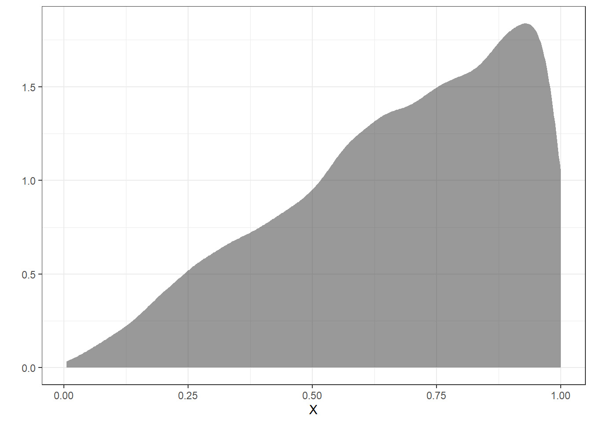
<p class="caption">(\#fig:dens161-fig)The density plot of the original using simulation.</p>
</div>

Now to find the distribution of $Y$ we just apply the transformation.


```r
y_results <- results %>%
  transmute(y=log(sqrt))
```

Figure \@ref(fig:dens162-fig) is the density plot of the transformed random variable from the simulation. We can see that the support for $Y$ is $-\infty < y \leq 0$ and the density is tight near zero but skewed to the left.


```r
y_results %>%
  gf_density(~y,xlab="X")  %>%
  gf_theme(theme_bw()) %>%
  gf_labs(y="")
```

<div class="figure">
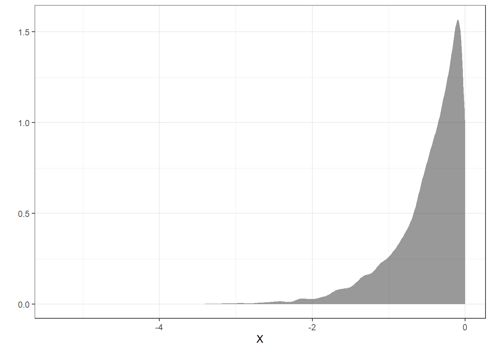
<p class="caption">(\#fig:dens162-fig)The density plot of the transformed random variable from the simulation.</p>
</div>


```r
inspect(y_results)
```

```
## 
## quantitative variables:  
##      name   class       min         Q1     median         Q3           max
## ...1    y numeric -5.365341 -0.6787839 -0.3455003 -0.1396613 -2.527336e-05
##            mean        sd     n missing
## ...1 -0.4940434 0.4979518 10000       0
```


### Multivariate Transformations 

For the discrete case, if you have the joint pmf, then if the transformation is to a univariate random variable, the process is similar to what see learned above. For continuous random variables, the mathematics are a little more difficult so we will just use simulation. 

Here's the scenario. Suppose $X$ and $Y$ are independent random variables, both uniformly distributed on $[5,6]$. 
$$
X\sim \textsf{Unif}(5,6)\hspace{1.5cm} Y\sim \textsf{Unif}(5,6)
$$

Let $X$ be your arrival time for dinner and $Y$ your friends arrival time. We picked 5 to 6 because this is the time in the evening we want to meet. Also assume you both travel independently.

Define $Z$ as a transformation of $X$ and $Y$ such that $Z=|X-Y|$. Thus $Z$ is the absolute value of the difference between your arrival times. The units for $Z$ are hours. We would like to explore the distribution of $Z$. We could do this via calc III methods but we will simulate instead.

We can use `R` to obtain simulated values from $X$ and $Y$ (and thus find $Z$). 

First, simulate 100,000 observations from the uniform distribution with parameters 5 and 6. Assign those random observations to a variable. Next, repeat that process, assigning those to a different variable. These two vectors represent your simulated values from $X$ and $Y$. Finally, obtain your simulated values of $Z$ by taking the absolute value of the difference.

> **Exercise**:  

Complete the code on your own before looking at the code below.


```r
set.seed(354)
results <- do(100000)*abs(diff(runif(2,5,6)))
```


```r
head(results)
```

```
##          abs
## 1 0.03171229
## 2 0.77846706
## 3 0.29111599
## 4 0.06700434
## 5 0.08663187
## 6 0.40622840
```


Figure \@ref(fig:dens163-fig) is a plot of the estimated density of the transformation. 


```r
results %>%
  gf_density(~abs) %>%
  gf_theme(theme_bw()) %>%
  gf_labs(x="|X-Y|",y="")
```

<div class="figure">

<p class="caption">(\#fig:dens163-fig)The density of the absolute value of the difference in uniform random variables.</p>
</div>

Or as a histogram in Figure \@ref(fig:hist163-fig).


```r
results %>%
  gf_histogram(~abs)%>%
  gf_theme(theme_bw()) %>%
  gf_labs(x="|X-Y|",y="")
```

<div class="figure">
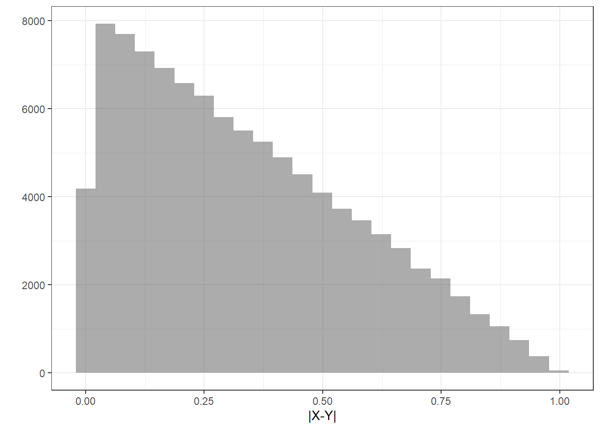
<p class="caption">(\#fig:hist163-fig)Histogram of the absolute value of the difference in random variables.</p>
</div>


```r
inspect(results)
```

```
## 
## quantitative variables:  
##      name   class          min       Q1    median        Q3       max     mean
## ...1  abs numeric 1.265667e-06 0.133499 0.2916012 0.4990543 0.9979459 0.332799
##             sd      n missing
## ...1 0.2358863 100000       0
```

>**Exercise**:  
Now suppose whomever arrives first will only wait 5 minutes and then leave. What is the probability you eat together?  


```r
data.frame(results) %>%
  summarise(mean(abs<=5/60))
```

```
##   mean(abs <= 5/60)
## 1           0.15966
```

> **Exercise**:  
How long should the first person wait so that there is at least a 50% probability of you eating together?

Let's write a function to find the cdf.  


```r
z_cdf <- function(x) {
  mean(results$abs<=x)
}
```


```r
z_cdf<- Vectorize(z_cdf)
```
Now test for 5 minutes to make sure our function is correct since we determined above that this value should be 0.15966.


```r
z_cdf(5/60)
```

```
## [1] 0.15966
```

Let's plot to see what the cdf looks like.


```r
gf_line(z_cdf(seq(0,1,.01))~seq(0,1,.01),xlab="Time Difference",ylab="CDF") %>%
  gf_theme(theme_bw())
```

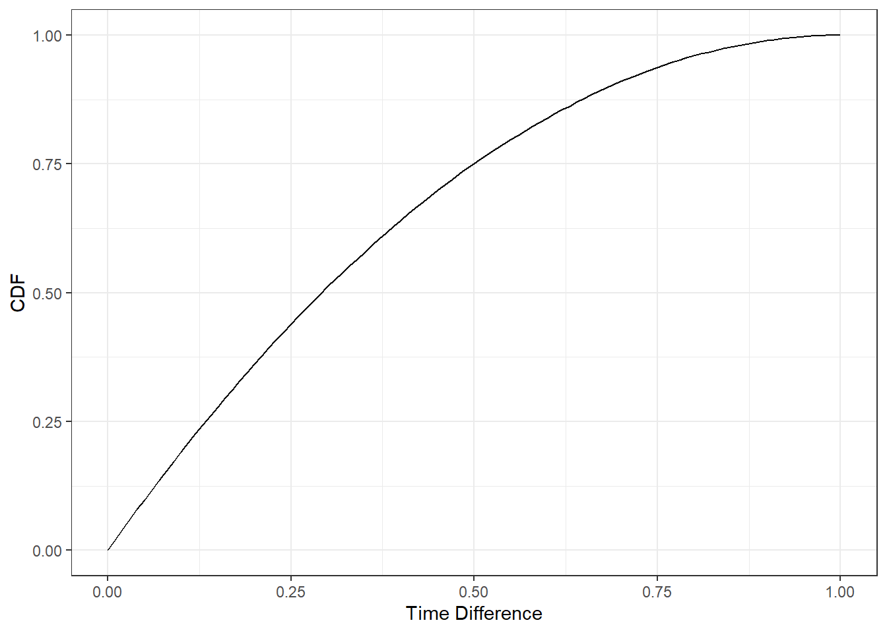

It looks like somewhere around 15 minutes, a quarter of an hour. But we will find a better answer by finding the root. In the code that follows we want to find where the cdf equals 0.5. The function `uniroot()` solves the given equations for roots so we want to put in the cdf minus 0.5. In other words, `uniroot()` solves $f(x)=0$ for x.


```r
uniroot(function(x)z_cdf(x)-.5,c(.25,35))$root
```

```
## [1] 0.2916077
```

So it is actually 0.292 hours, 17.5 minutes. So round up and wait 18 minutes.

## Homework Problems

1. Let $X$ be a random variable and let $g$ be a function. By this point, it should be clear that $\E[g(X)]$ is not necessarily equal to $g(\E[X])$. 

Let $X\sim \textsf{Expon}(\lambda=0.5)$ and $g(X)=X^2$. We know that $\E(X)=\frac{1}{0.5}=2$ so $g(\E(X))=\E(X)^2=4$. Use `R` to find $\E[g(X)]$. Make use of the fact that `R` has `rexp()` built into it, so you don't have to create your own random variable generator.


2. Let $X\sim \textsf{Binom}(n,\pi)$. What is the pmf for $Y = X+3$? Make sure you specify the domain of $Y$. [Note, we have used $p$ for the probability of success in a binomial distribution in past chapters but some references use $\pi$ instead.]


3. Let $X\sim \textsf{Expon}(\lambda)$. Let $Y=X^2$. Find the pdf of $Y$. 


4. OPTIONAL: In exercise 3, you found the pdf of $Y=X^2$ when $X\sim \textsf{Expon}(\lambda)$. Rearrange the pdf to show that $Y\sim \textsf{Weibull}$ and find the parameters of that distribution. 

5. You are on a team of two. You are both tasked to complete an exercise. The time it takes you, $T_1$, and likewise, your teammate, $T_2$, to complete the exercise are independent random variables. Exercise completion time, in minutes, is distributed with the following pdf:

$$
f_T(t)= \frac{-t}{200}+\frac{3}{20}; 10 \leq t \leq30
$$

Figure \@ref(fig:fig1) is a plot of the pdf.

<div class="figure" style="text-align: center">
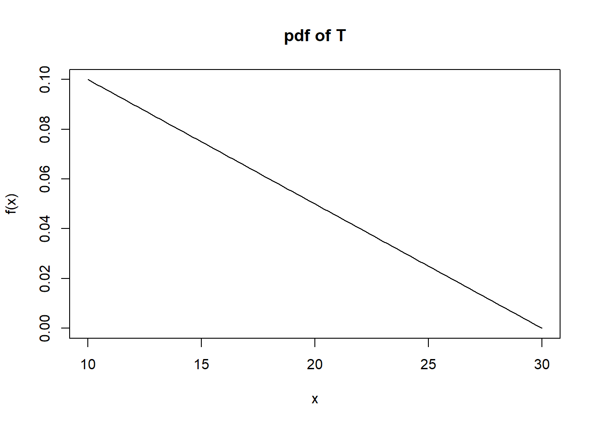
<p class="caption">(\#fig:fig1)pdf of $T$</p>
</div>

We want to find the probability our combined time is less than 40 minutes, $\Prob(T_1 + T_2 < 40)$. We will solve this in steps in this problem. We are going to use a computational method because the mathematics is long and algebra intensive. You are welcome to try a mathematical solution if you like but we will not provide a mathematical solution.  

a. Use the `integrate()` function to confirm this is a valid pdf.  


b. Find the cdf of $T$ mathematically.


c. To use the cdf to simulate random variables from this distribution, we need the inverse of the cdf which means we have to solve a quadratic equation. We can do this mathematically or just use the function `uniroot()`. So first, we will make sure we understand how to use `uniroot()`.   

As a check, we know the median of the distribution is approximately 15.857. Here is code to show that 15.857 is approximately the median. We are integrating the pdf from 10 to 15.857 to confirm that this is 0.5.


```r
integrate(function(x)-x/200+3/20,10,15.857)
```

```
## 0.4999389 with absolute error < 5.6e-15
```

Use `uniroot()` and your cdf to confirm that 15.857 is the median.


d. We will create a function to take a random uniform variable on the interval $[0,1]$ and return a value of our random variable, $T$, exercise time. We can then use this function to simulate each of the exercise times and then create a new random variable that is the sum. Complete the `R` code and check that it returns the median.  

```
T <- function(y){
  uniroot(function(x)"YOUR CDF HERE as a function of x"-y,c(10,30))$root
}
```

We made it a function of $y$ since we are using $x$ in our cdf. There are two function calls here, can you see why?

e. Vectorize the function you just created using the `Vectorize()` function. Check that it is vectorized by entering `c(.5,.75)` into the function. You should get 15.85786 20.00000 as an output.


f. We are ready. Let's create a data frame with 10000 simulation for our time and another 10000 for our teammates. Remember to set a seed. At this point it may be hard to remember what we have done. The function we created takes as input a vector of random number from a uniform distribution and then applies the inverse cdf to generate a random sample from our given pdf.  

g. Do a numerical summary of the data and plot a density plot of your exercise times to give us confidence that we simulated the process correctly.

h. Create the new variable that is the sum of the two exercise time and then find the probability that the sum is less than 40.  


<!--chapter:end:16-Transformations.Rmd-->

# Estimation Methods {#EST}


\newcommand{\E}{\mbox{E}}
\newcommand{\Var}{\mbox{Var}}
\newcommand{\Cov}{\mbox{Cov}}
\newcommand{\Prob}{\mbox{P}}
\newcommand{\diff}{\,\mathrm{d}}


## Objectives

1) Obtain a method of moments estimate of a parameter or set of parameters.    
2) Given a random sample from a distribution, obtain the likelihood function.   
3) Obtain a maximum likelihood estimate of a parameter or set of parameters.  
4) Determine if an estimator is unbiased. 

## Transition

We started this book with descriptive models of data and then moved onto probability models. In these probability models, we have been characterizing experiments and random processes using both theory and simulation. These models are using a model about a random event to make decisions about data. These models are about the population and are used to make decisions about samples and data. For example, suppose we flip a fair coin 10 times, and record the number of heads. The population is the collection of all possible outcomes of this experiment. In this case, the population is infinite, as we could run this experiment repeatedly without limit. If we assume, model, the number of heads as a binomial distribution, we know the exact distribution of the outcomes. For example, we know that exactly 24.61% of the time, we will obtain 5 heads out of 10 flips of a fair coin. We can also use the model to characterize the variance, that is when it does not equal 5 and how much different from 5 it will be.  However, these probability models are highly dependent on the assumptions and the values of the parameters. 

From this point on in the book, we will focus on *statistical* models.  Statistical models describe one or more variables and their relationships. We use these models to make decisions about the population, to predict  future outcomes, or both. Often we don't know the true underlying process; all we have is a *sample* of observations and perhaps some context. Using *inferential* statistics, we can draw conclusions about the underlying process. For example, suppose we are given a coin and we don't know whether it is fair. So, we flip it a number of times to obtain a sample of outcomes. We can use that sample to decide whether the coin could be fair. 

In some sense, we've already explored some of these concepts. In our simulation examples, we have drawn observations from a population of interest and used those observations to estimate characteristics of another population or segment of the experiment. For example, we explored random variable $Z$, where $Z=|X - Y|$ and $X$ and $Y$ were both uniform random variables. Instead of dealing with the distribution of $Z$ directly, we simulated many observations from $Z$ and used this simulation to describe the behavior of $Z$. 

Statistical models and probability models are not separate. In statistical models we find relationships, the explained portion of variation, and use probability models for the remaining random variation. In Figure \@ref(fig:prob-stats), we demonstrate this relationship between the two types of models. In the first part of our studies, we will use univariate data in statistical models to estimate the parameters of a probability model. From there we will develop more sophisticated models to include multivariate models.

<div class="figure" style="text-align: center">

<p class="caption">(\#fig:prob-stats)A graphical representation of probability and statistics. In probability, we describe what we expect to happen if we know that underlying process; in statistics, we don't know the underlying process, and must infer based on representative samples.</p>
</div>


## Estimation  
Recall that in probability models, we have complete information about the population and we use that to describe the expected behavior of samples from that population. In statistics we are given a sample from a population about which we know little or nothing. 

In this lesson, we will discuss *estimation*. Given a sample, we would like to estimate population parameters. There are several ways to do that. We will discuss two methods: *method of moments* and *maximum likelihood*. 

## Method of Moments

Recall earlier we discussed moments. We can refer to $\E(X) = \mu$ as the first moment or mean. Further, we can refer to $\E(X^k)$ as the $k$th central moment and $\E[(X-\mu)^k]$ as the $k$ moment around the mean. The second moment around the mean is also known as variance. It is important to point out that these are **POPULATION** moments and are typically some function of the parameters of a probability model. 

Suppose $X_1,X_2,...,X_n$ is a sequence of independent, identically distributed random variables with some distribution and parameters $\boldsymbol{\theta}$. When provided with a random sample of data, we will not know the population moments. However, we can obtain *sample moments*. The $k$th central sample moment is denoted by $\hat{\mu}_k$ and is given by
$$
\hat{\mu}_k = \frac{1}{n}\sum_{i=1}^n x_i^k
$$

The $k$th sample moment around the mean is denoted by $\hat{\mu}'_k$ and is given by
$$
\hat{\mu}'_k=\frac{1}{n} \sum_{i=1}^n (x_i-\bar{x})^k
$$

The value $\hat{\mu}$ is read "mu-hat". The hat denotes that the value is an estimate. 

We can use the sample moments to estimate the population moments since the population moments are usually functions of a distribution's parameters, $\boldsymbol{\theta}$. Thus, we can solve for the parameters to obtain method of moments estimates of $\boldsymbol{\theta}$. 

This is all technical, so let's look at an example. 

> *Example*:  
Suppose $x_1,x_2,...,x_n$ is an iid, independent and identically distributed, sample from a uniform distribution $\textsf{Unif}(0,\theta)$, and we don't know $\theta$. That is, our data consists of positive random numbers but we don't know the upper bound. Find the method of moments estimator for $\theta$, the upper bound. 

We know that if $X\sim \textsf{Unif}(a,b)$, then $\E(X)=\frac{a+b}{2}$. So, in this case, $\E(X)={\theta \over 2}$. This is the first population moment. We can estimate this with the first *sample* moment, which is just the sample mean:
$$
\hat{\mu}_1=\frac{1}{n}\sum_{i=1}^n x_i = \bar{x}
$$

Our best guess for the first population moment ($\theta/2$) is the first sample moment ($\bar{x}$). From a common sense perspective, we are hoping that the sample moment will be close in value to the population moment, so we can set them equal and solve for the unknown population parameter. This is essentially what we were doing in our simulations of probability models. Solving for $\theta$ yields our method of moments estimator for $\theta$:
$$
\hat{\theta}_{MoM}=2\bar{x}
$$

Note that we could have used the second moments about the mean as well. This is less intuitive but still applicable. In this case we know that if $X\sim \textsf{Unif}(a,b)$, then $\Var(X)=\frac{(b -   a)^2}{12}$. So, in this case, $\Var(X)=\frac{\theta ^2}{ 12}$. We use the second sample moment about the mean $\hat{\mu}'_2=\frac{1}{n} \sum_{i=1}^n (x_i-\bar{x})^2$ which is not quite the sample variance. In fact, the sample variance is related to the second sample moment about the mean by $\hat{\mu}'_2 = s^2 \frac{n}{n-1}$. Setting the population moment and sample moment equal and solving we get 

$$
\hat{\theta}_{MoM}=\sqrt{\frac{12n}{n-1}}s
$$

To decide which is better we need a criteria of comparison. This is beyond the scope of this book, but some common criteria are *unbiased* and *minimum variance*.

The method of moments can be used to estimate more than one parameter as well. We simply would have to incorporate higher order moments. 

> *Example*:  
Suppose we take an iid sample from the normal distribution with parameters $\mu$ and $\sigma$. Find method of moments estimates of $\mu$ and $\sigma$. 

First, we remember that we know two population moments for the normal distribution:
$$
\E(X)=\mu \hspace{1cm} \Var(X)=\E[(X-\mu)^2]=\sigma^2
$$

Setting these equal to the sample moments yields:
$$
\hat{\mu}_{MoM}=\bar{x} \hspace{1cm} \hat{\sigma}_{MoM} = \sqrt{\frac{1}{n}\sum_{i=1}^n (x_i-\bar{x})^2}
$$

Again, we notice that the estimate for $\sigma$ is different from sample standard deviation discussed earlier in the book. The reason for this is a property of estimators called *unbiased*. Notice that if we treat the data points as random variables then the estimators are random variables. We can then take the expected value of the estimator and if this equals the parameter being estimated, then it is unbiased. Mathematically, this is written
$$
E(\hat{\theta})=\theta
$$
Unbiased is not a required property for an estimated but many practitioners find it desirable. In words, unbiased means that on average the estimator will equal the true value. Sample variance using $n-1$ in the denominator is an unbiased estimate of the population variance.

> *Exercise*:  
You shot 25 free throws and make 21. Assuming a binomial model fits. Find an estimate of the probability of making a free throw.

There are two ways to approach this problem depending on how we define the random variable. In the first case we will use a binomial random variable, $X$ the number of made free throws in 25 attempts. In this case, we only ran the experiment once and have the observed result of 21. Recall for the binomial $E(X)=np$ where $n$ is the number of attempts and $p$ is the probability of success. The sample mean is 21 since we only have one data point. Using the method of moments, we set the first population mean equal to the first sample mean $np=\frac{\sum{x_i}}{m}$, notice $n$ is the number of trials 25 and $m$ is the number of data points 1, or $25 \hat{p} = 21$. Thus $\hat{p} = \frac{21}{25}$.

A second approach is to let $X_i$ be a single free throw, we have a Bernoulli random variable. This variable takes on the values of 0 if we miss and 1 if we make the free throw. Thus we have 25 data points. For a Bernoulli random variable $E(X)=p$. The sample is $\bar{x} = \frac{21}{25}$. Using the method of moments, we set the sample mean equal to the population mean. We have $E(X) = \hat{p} = \bar{x} = \frac{21}{25}$. This is a natural estimate; we estimate our probability of success as the number of made free throws divided by the number of shots. As a side note, this is an unbiased estimator since
$$
E(\hat{p})=E\left( \sum{\frac{X_i}{n}} \right)
$$

$$
=  \sum{E\left( \frac{X_i}{n} \right)}= \sum{ \frac{E\left(X_i\right)}{n}}=\sum{\frac{p}{n}}=\frac{np}{n}=p
$$

## Maximum likelihood

Recall that using method of moments involves finding values of the parameters that cause the population moments to be equal to the sample moments. Solving for the parameters yields method of moments estimates. 

Next we will discuss one more estimation method, *maximum likelihood estimation*. In this method, we are finding values of parameters that would make the observed data most "likely". In order to do this, we first need to introduce the *likelihood function*. 

### Likelihood Function

Suppose $x_1,x_2,...,x_n$ is an iid random sample from a distribution with mass/density function $f_{X}(x;\boldsymbol{\theta})$ where $\boldsymbol{\theta}$ are the parameters. Let's take a second to explain this notation. We are using a bold symbol for $\boldsymbol{\theta}$ to indicate it is a vector, that it can be one or more values. However, in the pmf/pdf $x$ is not bold since it is a scalar variable. In our probability models we know $\boldsymbol{\theta}$ and then use to model to make decision about the random variable $X$.

The likelihood function is denoted as $L(\boldsymbol{\theta};x_1,x_2,...,x_n) = L(\boldsymbol{\theta};\boldsymbol{x})$. Now we have multiple instances of the random variable, we use $\boldsymbol{x}$. Since our random sample is iid, independent and identically distributed, we can write the likelihood function as a product of the pmfs/pdfs:
$$
L(\boldsymbol{\theta};\boldsymbol{x})=\prod_{i=1}^n f_X(x_i;\boldsymbol{\theta})
$$

The likelihood function is really the pmf/pdf except instead of the variables being random and the parameter(s) fixed, the values of the variable are known and the parameter(s) are unknown. A note on notation, we are using the semicolon in the pdf and likelihood function to denote what is known or given. In the pmf/pdf the parameters are known and thus follow the semicolon. The opposite is the case in the likelihood function. 

Let's do an example to help understand these ideas.

> *Example*:  
Suppose we are presented with a coin and are unsure of its fairness. We toss the coin 50 times and obtain 18 heads and 32 tails. Let $\pi$ be the probability that a coin flip results in heads, we could use $p$ but we are getting you used to the two different common ways to represent a binomial parameter. What is the likelihood function of $\pi$? 

This is a binomial process, but each individual coin flip can be thought of as a Bernoulli experiment. That is, $x_1,x_2,...,x_{50}$ is an iid sample from $\textsf{Binom}(1,\pi)$ or, in other words, $\textsf{Bernoulli}(\pi)$. Each $x_i$ is either 1 or 0. The pmf of $X$, a Bernoulli random variable, is simply:
$$
f_X(x;\pi)= \binom{1}{x} \pi^x(1-\pi)^{1-x} = \pi^x(1-\pi)^{1-x}
$$

Notice this makes sense

$$
f_X(1)=P(X=1)= \pi^1(1-\pi)^{1-1}=\pi
$$

and 


$$
f_X(0)=P(X=0)= \pi^0(1-\pi)^{1-0}=(1-\pi)
$$


Generalizing for any sample size $n$, the likelihood function is:
$$
L(\pi;\boldsymbol{x})=\prod_{i=1}^{n} \pi^{x_i}(1-\pi)^{1-x_i} = \pi^{\sum_{i=1}^{n} x_i}(1-\pi)^{n-\sum_{i=1}^{n} x_i}
$$

For our example $n=50$ and the

$$
L(\pi;\boldsymbol{x})=\prod_{i=1}^{50} \pi^{x_i}(1-\pi)^{1-x_i} = \pi^{18}(1-\pi)^{32}
$$

which makes sense because we had 18 successes, heads, and 32 failures, tails. The likelihood function is a function of the unknown parameter $\pi$.


### Maximum Likelihood Estimation

Once we have a likelihood function $L(\boldsymbol{\theta},\boldsymbol{x})$, we need to figure out which value of $\boldsymbol{\theta}$ makes the data most likely. In other words, we need to maximize $L$ with respect to $\boldsymbol{\theta}$. 

Most of the time (but not always), this will involve simple optimization through calculus (i.e., take the derivative with respect to the parameter, set to 0 and solve for the parameter). When maximizing the likelihood function through calculus, it is often easier to maximize the log of the likelihood function, denoted as $l$ and often referred to as the "log-likelihood function":
$$
l(\boldsymbol{\theta};\boldsymbol{x})= \log L(\boldsymbol{\theta};\boldsymbol{x}) 
$$
Note that since logarithm is one-to-one, onto and increasing, maximizing the log-likelihood function is equivalent to maximizing the likelihood function, and the maximum will occur at the same values of the parameters. We are using `log` because now we can take the derivative of a sum instead of a product, thus making it much easier.

> *Example*:  
Continuing our example. Find the maximum likelihood estimator for $\pi$. 

Recall that our likelihood function is 
$$
L(\pi;\boldsymbol{x})= \pi^{\sum x_i}(1-\pi)^{n-\sum x_i}
$$

Figure \@ref(fig:lik1-fig) is a plot of the likelihood function as a function of the unknown parameter $\pi$.


```
## Warning: geom_vline(): Ignoring `mapping` because `xintercept` was provided.
```

<div class="figure">

<p class="caption">(\#fig:lik1-fig)Likelihood function for 18 successes in 50 trials</p>
</div>

By visual inspection, the value of $\pi$ that makes our data most likely, maximizes the likelihood function, is something a little less than 0.4, the actual value is 0.36 as indicated by the blue line in Figure \@ref(fig:lik1-fig).

To maximize by mathematical methods, we need to take the derivative of the likelihood function with respect to $\pi$. We can do this because the likelihood function is a continuous function. Even though the binomial is a discrete random variable, its likelihood is a continuous function. 

We can find the derivative of the likelihood function by applying the product rule:
$$
{\diff L(\pi;\boldsymbol{x})\over \diff \pi} = \left(\sum x_i\right) \pi^{\sum x_i -1}(1-\pi)^{n-\sum x_i} + \pi^{\sum x_i}\left(\sum x_i -n\right)(1-\pi)^{n-\sum x_i -1}
$$

We could simplify this, set to 0, and solve for $\pi$. However, it may be easier to use the log-likelihood function:
$$
l(\pi;\boldsymbol{x})=\log L(\pi;\boldsymbol{x})= \log \left(\pi^{\sum x_i}(1-\pi)^{n-\sum x_i}\right) = \sum x_i \log \pi + (n-\sum x_i)\log (1-\pi)
$$

Now, taking the derivative does not require the product rule:
$$
{\diff l(\pi;\boldsymbol{x})\over \diff \pi}= {\sum x_i \over \pi} - {n-\sum x_i\over (1-\pi)}
$$

Setting equal to 0 yields:
$$
{\sum x_i \over \pi} ={n-\sum x_i\over (1-\pi)}
$$

Solving for $\pi$ yields
$$
\hat{\pi}_{MLE}={\sum x_i \over n}
$$

Note that technically, we should confirm that the function is concave down at our critical value, ensuring that $\hat{\pi}_{MLE}$ is, in fact, a maximum: 
$$
{\diff^2 l(\pi;\boldsymbol{x})\over \diff \pi^2}= {-\sum x_i \over \pi^2} - {n-\sum x_i\over (1-\pi)^2}
$$

This value is negative for all relevant values of $\pi$, so $l$ is concave down and $\hat{\pi}_{MLE}$ is a maximum. 

In the case of our example (18 heads out of 50 trials), $\hat{\pi}_{MLE}=18/50=0.36$. 

This seems to make sense. Our best guess for the probability of heads is the number of observed heads divided by our number of trials. That was a great deal of algebra and calculus for what appears to be an obvious answer. However, in more difficult problems, it is not as obvious what to use for a MLE.


### Numerical Methods

When obtaining MLEs, there are times when analytical methods (calculus) are not feasible or not possible. In the Pruim book [@pruim2011foundations], there is a good example regarding data from Old Faithful at Yellowstone National Park. We need to load the **fastR2** package for this example. 


```r
library(fastR2)
```


The `faithful` data set is preloaded into `R` and contains 272 observations of 2 variables: eruption time in minutes and waiting time until next eruption. If we plot eruption durations, we notice that the distribution appears bimodal, see Figure \@ref(fig:hist171-fig).

<div class="figure">

<p class="caption">(\#fig:hist171-fig)Histogram of eruption durations of Old Faithful.</p>
</div>

Within each section, the distribution appears somewhat bell-curve-ish so we'll model the eruption time with a mixture of two normal distributions. In this mixture, a proportion $\alpha$ of our eruptions belong to one normal distribution and the remaining $1-\alpha$ belong to the other normal distribution. The density function of eruptions is given by:
$$
\alpha f(x;\mu_1,\sigma_1)+(1-\alpha)f(x;\mu_2,\sigma_2)
$$

where $f$ is the pdf of the normal distribution with parameters specified. 

We have five parameters to estimate: $\alpha, \mu_1, \mu_2, \sigma_1, \sigma_2$. Obviously, estimation through differentiation is not feasible and thus we will use numerical methods. This code is less in the spirit of `tidyverse` but we want you to see the example. Try to work your way through the code below:


```r
# Define function for pdf of eruptions as a mixture of normals
dmix<-function(x,alpha,mu1,mu2,sigma1,sigma2){
  if(alpha < 0) dnorm(x,mu2,sigma2)
  if(alpha > 1) dnorm(x,mu1,sigma1)
  if(alpha >= 0 && alpha <=1){
    alpha*dnorm(x,mu1,sigma1)+(1-alpha)*dnorm(x,mu2,sigma2)
  }
}
```

Next write a function for the log-likelihood function. `R` is a vector based programming language so we send `theta` into the function as a vector argument. 


```r
# Create the log-likelihood function
loglik<-function(theta,x){
  alpha=theta[1]
  mu1=theta[2]
  mu2=theta[3]
  sigma1=theta[4]
  sigma2=theta[5]
  density<-function(x){
    if(alpha<0) return (Inf)
    if(alpha>1) return (Inf)
    if(sigma1<0) return (Inf)
    if(sigma2<0) return (Inf)
    dmix(x,alpha,mu1,mu2,sigma1,sigma2)
  }
  sum(log(sapply(x,density)))
}
```

Find the sample mean and standard deviation of the eruption data to use as starting points in the optimization routine.


```r
m<-mean(faithful$eruptions)
s<-sd(faithful$eruptions)
```

Use the function `nlmax()` to maximize the non-linear log-likelihood function. 


```r
mle<-nlmax(loglik,p=c(0.5,m-1,m+1,s,s),x=faithful$eruptions)$estimate
mle
```

```
## [1] 0.3484040 2.0186065 4.2733410 0.2356208 0.4370633
```

So, according to our MLEs, about 34.84% of the eruptions belong to the first normal distribution (the one on the left). Furthermore the parameters of that first distribution are a mean of 2.019 and a standard deviation of 0.236. Likewise, 65.16% of the eruptions belong to the second normal with mean of 4.27 and standard deviation of 0.437.  

Plotting the density atop the histogram shows a fairly good fit: 


```r
dmix2<-function(x) dmix(x,mle[1],mle[2],mle[3],mle[4],mle[5])
#y_old<-dmix2(seq(1,6,.01))
#x_old<-seq(1,6,.01)
#dens_data<-data.frame(x=x_old,y=y_old)
#faithful%>%
#gf_histogram(~eruptions,fill="cyan",color = "black") %>%
#  gf_curve(y~x,data=dens_data)%>%
#  gf_theme(theme_bw()) %>%
#  gf_labs(x="Duration in minutes",y="Count") 
hist(faithful$eruptions,breaks=40,freq=F,main="",xlab="Duration in minutes.")
curve(dmix2,from=1,to=6,add=T)
```

<div class="figure">

<p class="caption">(\#fig:hist172-fig)Histogram of eruption duration with estimated mixture of normals plotted on top.</p>
</div>

This is a fairly elaborate example but it is cool. You can see the power of the method and the software. 

## Homework Problems


1. In the Notes, we found that if we take a sample from the uniform distribution $\textsf{Unif}(0,\theta)$, the method of moments estimate of $\theta$ is $\hat{\theta}_{MoM}=2\bar{x}$. Suppose our sample consists of the following values: 
$$
0.2 \hspace{0.4cm} 0.9 \hspace{0.4cm} 1.9 \hspace{0.4cm} 2.2 \hspace{0.4cm} 4.7 \hspace{0.4cm} 5.1
$$

a) What is $\hat{\theta}_{MoM}$ for this sample?   
b) What is an wrong with this estimate?  
c) Show that this estimator is unbiased.  
d) ADVANCED: Use simulation in `R` to find out how often the method of moment estimator is less the maximum observed value, ($\hat{\theta}_{MoM} < \max x$). Report an answer for various sizes of samples. You can just pick an arbitrary value for $\theta$ when you sample from the uniform. However, the minimum must be 0.


2. Let $x_1,x_2,...,x_n$ be a simple random sample from an exponentially distributed population with parameter $\lambda$. Find $\hat{\lambda}_{MoM}$. 

3. Let $x_1,x_2,...,x_n$ be an iid random sample from an exponentially distributed population with parameter $\lambda$. Find $\hat{\lambda}_{MLE}$.

4. It is mathematically difficult to determine if the estimators found in questions 2 and 3 are unbiased. Since the sample mean is in the denominator; mathematically we may have to work with the joint pdf. So instead, use simulation to get an sense of whether the method of moments estimator for the exponential distribution is unbiased.


5. Find a maximum likelihood estimator for $\theta$ when $X\sim\textsf{Unif}(0,\theta)$. Compare this to the method of moments estimator we found. Hint: Do not take the derivative of the likelihood function. 


<!--chapter:end:17-Estimation-Methods.Rmd-->

# (PART) Statistical Modeling {-} 

# Case Study {#CS3}


## Objectives

1) Define and use properly in context all new terminology.   
2) Conduct a hypothesis test using a permutation test to include all 4 steps.

## Introduction 

We now have the foundation to move onto statistical modeling. First we will begin with inference where we use the ideas of estimation and the variance of estimates to make decisions about the population. We will also briefly introduce the ideas of prediction. Then in the final block of material, we will examine some common linear models and use them both in prediction situations as well as inference.

## Foundation for inference  

Suppose a professor randomly splits the students in class into two groups: students on the left and students on the right. If $\hat{p}_{_L}$ and $\hat{p}_{_R}$ represent the proportion of students who own an Apple product on the left and right, respectively, would you be surprised if $\hat{p}_{_L}$ did not *exactly* equal $\hat{p}_{_R}$?

While the proportions would probably be close to each other, they are probably not exactly the same. We would probably observe a small difference due to *chance*.

> **Exercise**:  
If we don't think the side of the room a person sits on in class is related to whether the person owns an Apple product, what assumption are we making about the relationship between these two variables?^[We would be assuming that these two variables are **independent**, meaning they are unrelated.]

Studying randomness of this form is a key focus of statistical modeling. In this block, we'll explore this type of randomness in the context of several applications, and we'll learn new tools and ideas that can be applied to help make decisions from data.

## Randomization case study: gender discrimination 

We consider a study investigating gender discrimination in the 1970s, which is set in the context of personnel decisions within a bank.^[Rosen B and Jerdee T. 1974. "Influence of sex role stereotypes on personnel decisions." Journal of Applied Psychology 59(1):9-14.] The research question we hope to answer is, "Are females discriminated against in promotion decisions made by male managers?"

### Variability within data

The participants in this study were 48 male bank supervisors attending a management institute at the University of North Carolina in 1972. They were asked to assume the role of the personnel director of a bank and were given a personnel file to judge whether the person should be promoted to a branch manager position. The files given to the participants were identical, except that half of them indicated the candidate was male and the other half indicated the candidate was female. These files were randomly assigned to the subjects.

> **Exercise**:  
Is this an observational study or an experiment? How does the type of study impact what can be inferred from the results?^[The study is an experiment, as subjects were randomly assigned a male file or a female file. Since this is an experiment, the results can be used to evaluate a causal relationship between gender of a candidate and the promotion decision.]

For each supervisor we recorded the gender associated with the assigned file and the promotion decision. Using the results of the study summarized in the table below, we would like to evaluate if females are unfairly discriminated against in promotion decisions. In this study, a smaller proportion of females are promoted than males (0.583 versus 0.875), but it is unclear whether the difference provides **convincing evidence** that females are unfairly discriminated against.

$$
\begin{array}{cc|ccc} & & &\textbf{Decision}\\ 
& & \mbox{Promoted} & \mbox{Not Promoted} & \mbox{Total}  \\
& \hline \mbox{male} & 21 & 3 & 24  \\
\textbf{Gender}& \mbox{female} & 14 & 10 & 24  \\
& \mbox{Total} & 35 & 13 & 48  \\
\end{array} 
$$


> *Thought Question*:  
Statisticians are sometimes called upon to evaluate the strength of evidence. When looking at the rates of promotion for males and females in this study, why might we be tempted to immediately conclude that females are being discriminated against?  

The large difference in promotion rates (58.3\% for females versus 87.5\% for males) suggest there might be discrimination against women in promotion decisions. Most people come to this conclusion because they think these sample statistics are the actual population parameters. We cannot yet be sure if the observed difference represents discrimination or is just from random variability. Generally there is fluctuation in sample data; if we conducted the experiment again, we would get different values. We also wouldn't expect the sample proportions to be **exactly** equal, even if the truth was that the promotion decisions were independent of gender. To make a decision, we must understand the random variability and compare it with the observed difference.

This question is a reminder that the observed outcomes in the sample may not perfectly reflect the true relationships between variables in the underlying population. The table shows there were 7 fewer promotions in the female group than in the male group, a difference in promotion rates of 29.2\% $\left( \frac{21}{24} - \frac{14}{24} = 0.292 \right)$. This observed difference is what we call a *point estimate* of the true effect. The point estimate of the difference is large, but the sample size for the study is small, making it unclear if this observed difference represents discrimination or whether it is simply due to chance. We label these two competing claims, chance or discrimination, as $H_0$ and $H_A$:


$H_0$: **Null hypothesis.** The variables *gender* and *decision* are independent. They have no relationship, and the observed difference between the proportion of males and females who were promoted, 29.2\%, was due to chance.  
$H_A$: **Alternative hypothesis.** The variables *gender* and *decision* are **not** independent. The difference in promotion rates of 29.2\% was not due to chance, and equally qualified females are less likely to be promoted than males.  

> Hypothesis testing  
These hypotheses are part of what is called a **hypothesis test**. A hypothesis test is a statistical technique used to evaluate competing claims using data. Often times, the null hypothesis takes a stance of **no difference** or **no effect** and thus is `skeptical` of the research claim. If the null hypothesis and the data notably disagree, then we will reject the null hypothesis in favor of the alternative hypothesis.

Don't worry if you aren't a master of hypothesis testing at the end of this lesson. We'll discuss these ideas and details many times in this block.

What would it mean if the null hypothesis, which says the variables *gender* and *decision* are unrelated, is true? It would mean each banker would decide whether to promote the candidate without regard to the gender indicated on the file. That is, the difference in the promotion percentages would be due to the way the files were randomly divided to the bankers, and the randomization just happened to give rise to a relatively large difference of 29.2\%.

Consider the alternative hypothesis: bankers were influenced by which gender was listed on the personnel file. If this was true, and especially if this influence was substantial, we would expect to see some difference in the promotion rates of male and female candidates. If this gender bias was against females, we would expect a smaller fraction of promotion recommendations for female personnel files relative to the male files.

We will choose between these two competing claims by assessing if the data conflict so much with $H_0$ that the null hypothesis cannot be deemed reasonable. If this is the case, and the data support $H_A$, then we will reject the notion of independence and conclude that these data provide strong evidence of discrimination. Again, we will do this by determining how much difference in promotion rates would happen by random variation and compare this with the observed difference. We will make a decision based on probability considerations.

### Simulating the study  

The table of data shows that 35 bank supervisors recommended promotion and 13 did not. Now, suppose the bankers' decisions were independent of gender, that is the null hypothesis is true. Then, if we conducted the experiment again with a different random assignment of files, differences in promotion rates would be based only on random fluctuation. We can actually perform this **randomization**, which simulates what would have happened if the bankers' decisions had been independent of gender but we had distributed the files differently.^[The test procedure we employ in this section is formally called a **permutation test**.] We will walk through the steps next.

First let's import the data.


```r
discrim <- read_csv("data/discrimination_study.csv")
```


```r
inspect(discrim)
```

```
## 
## categorical variables:  
##       name     class levels  n missing
## 1   gender character      2 48       0
## 2 decision character      2 48       0
##                                    distribution
## 1 female (50%), male (50%)                     
## 2 promoted (72.9%), not_promoted (27.1%)
```


```r
tally(~gender+decision,discrim,margins=TRUE)
```

```
##         decision
## gender   not_promoted promoted Total
##   female           10       14    24
##   male              3       21    24
##   Total            13       35    48
```

Let's do some categorical data cleaning. To get the `tally()` results to look like our table, we need to change to factors and reorder the levels.

We will use `mutate_if()` to convert characters to factors and `fct_relevel()` to change levels.


```r
discrim <- discrim %>%
  mutate_if(is.character,as.factor) %>%
  mutate(gender=fct_relevel(gender,"male"),
         decision=fct_relevel(decision,"promoted"))
```


```r
head(discrim)
```

```
## # A tibble: 6 x 2
##   gender decision    
##   <fct>  <fct>       
## 1 female not_promoted
## 2 female not_promoted
## 3 male   promoted    
## 4 female promoted    
## 5 female promoted    
## 6 female promoted
```


```r
tally(~gender+decision,discrim,margins = TRUE)
```

```
##         decision
## gender   promoted not_promoted Total
##   male         21            3    24
##   female       14           10    24
##   Total        35           13    48
```

Now that we have the data in form that we want, we are ready to conduct the *permutation test*. To think about this *simulation*, imagine we actually had the personnel files. We thoroughly shuffle 48 personnel files, 24 labeled *male* and 24 labeled *female*, and deal these files into two stacks. We will deal 35 files into the first stack, which will represent the 35 supervisors who recommended promotion. The second stack will have 13 files, and it will represent the 13 supervisors who recommended against promotion. Remember that the files are identical except for the listed gender. This simulation then assumes that gender is not important and thus we can randomly assign the files to any of the supervisors. Then, as we did with the original data, we tabulate the results and determine the fraction of *male* and *female* who were promoted. Since we don't actually physically have the files, we will do this shuffle via computer code.

Since the randomization of files in this simulation is independent of the promotion decisions, any difference in the two fractions is entirely due to chance. The following code shows the results of such a simulation.


```r
set.seed(101)
tally(~shuffle(gender)+decision,discrim,margins = TRUE)
```

```
##                decision
## shuffle(gender) promoted not_promoted Total
##          male         18            6    24
##          female       17            7    24
##          Total        35           13    48
```

The `shuffle()` function randomly rearranges the gender column while keeping the decision column the same. It is really a sampling without replacement.

> **Exercise**:
What is the difference in promotion rates between the two simulated groups? How does this compare to the observed difference 29.2\% from the actual study?^[$18/24 - 17/24=0.042$ or about 4.2\% in favor of the men. This difference due to chance is much smaller than the difference observed in the actual groups.]

Calculating by hand will not help in a simulation, so we must write a function or use an existing one. We will use `diffprop` from the **mosiac** package. The code to find the difference for the original data is:


```r
(obs<-diffprop(decision~gender,data=discrim))
```

```
##   diffprop 
## -0.2916667
```

Notice that this is subtracting proportion of males promoted from the proportion of females. This does not impact our results as this is an arbitrary decision. We just need to be consistent in our analysis. If we prefer to use positive values we can adjust the order easily.


```r
diffprop(decision~fct_relevel(gender,"female"),data=discrim)
```

```
##  diffprop 
## 0.2916667
```


Notice that what we have done here, we developed a single number metric to measure the relationship between *gender* and *decision*. This single value metric is called the **test statistic**. We could have used a number of different metrics to include just the difference in males and females. The key idea in hypothesis testing is that once you decide on a test statistic, you need to find the distribution of that test statistic assuming the null hypothesis is true. 

### Checking for independence 

We computed one possible difference under the null hypothesis in the exercise above, which represents one difference due to chance. Repeating the simulation, we get another difference due to chance: -0.042. And another: 0.208. And so on until we repeat the simulation enough times that we have a good idea of what represents the **distribution of differences from chance alone**. That is the difference if there really is no relationship between gender and the promotion decision. We are using a simulation when there is actually a finite number of permutations of the `gender` label. From our lesson on counting, we have 48 labels of which 24 are `male` and 24 are `female`. Thus the total number of ways to arrange the labels differently is:

$$
\frac{48!}{24!\cdot24!} \approx 3.2 \cdot 10^{13}
$$


```r
factorial(48)/(factorial(24)*factorial(24))
```

```
## [1] 3.22476e+13
```

This number of permutations is too large to find by hand or even via code and thus we will use a simulation. This is not quite accurate for what we are doing though. We only have 13 not promoted positions. So we could have anywhere between 0 females up to 13 females in the not promoted position. Thus to calculate the probabilities we could use a hypergeometric.

Let's simulate the experiment and plot the simulated values of the difference in the proportions of male and female files recommended for promotion.


```r
set.seed(2022)
results <- do(10000)*diffprop(decision~shuffle(gender),data=discrim)
```

In Figure \@ref(fig:teststat1-fig), we will insert a vertical line at the value of our observed difference.


```r
results %>%
  gf_histogram(~diffprop) %>%
  gf_vline(xintercept =-0.2916667 ) %>%
  gf_theme(theme_classic()) %>%
  gf_labs(x="Difference in proportions",y="Counts",
          title="Gender discrimination in hiring permutation test",
          subtitle="Test statistic is difference in promotion for female and male")
```

<div class="figure">

<p class="caption">(\#fig:teststat1-fig)Distribution of test statistic.</p>
</div>


Note that the distribution of these simulated differences is centered around 0 and is roughly symmetrical. It is centered on zero because we simulated differences in a way that made no distinction between men and women. This makes sense: we should expect differences from chance alone to fall around zero with some random fluctuation for each simulation under the assumption of the null hypothesis. The histogram also looks like a normal distribution; this is not a coincidence, it is a result of what is called the **Central Limit Theorem** which we will learn about in this block. 

> *Example*:  
How often would you observe a difference of at least -29.2\% (-0.292) according to the figure? (Often, sometimes, rarely, or never?)

It appears that a difference of at least -29.2\% due to chance alone would only happen rarely. We can estimate the probability using the `results` object. 


```r
results %>%
  summarise(p_value = mean(diffprop<=obs))
```

```
##   p_value
## 1  0.0257
```


In our simulations, only 2.6\% of the simulated test statistics were less than or equal to the observed test statistic, more extreme relative to the null hypothesis. Such a low probability indicates that observing such a large difference in proportions from chance alone is rare. This probability is known as a **p-value**. The p-value is a conditional probability, the probability of the observed value or more extreme given that the null hypothesis is true.

As noted above, we could have found the exact p-value using the hypergeometric. We want 10 or more women not promoted when we select 13 people from a pool of 24 men and 24 women and the selection is done without replacement.


```r
1-phyper(9,24,24,13)
```

```
## [1] 0.02449571
```

The observed difference of -29.2\% is a rare event if there really is no impact from listing gender in the candidates' files, which provides us with two possible interpretations of the study results:

$H_0$: **Null hypothesis.** Gender has no effect on promotion decision, and we observed a difference that is so large that it would only happen rarely.  
$H_A$: **Alternative hypothesis.** Gender has an effect on promotion decision, and what we observed was actually due to equally qualified women being discriminated against in promotion decisions, which explains the large difference of -29.2\%.  

When we conduct formal studies, we reject a skeptical position if the data strongly conflict with that position.^[This reasoning does not generally extend to anecdotal observations. Each of us observes incredibly rare events every day, events we could not possibly hope to predict. However, in the non-rigorous setting of anecdotal evidence, almost anything may appear to be a rare event, so the idea of looking for rare events in day-to-day activities is treacherous. For example, we might look at the lottery: there was only a 1 in 176 million chance that the Mega Millions numbers for the largest jackpot in history (March 30, 2012) would be (2, 4, 23, 38, 46) with a Mega ball of (23), but nonetheless those numbers came up! However, no matter what numbers had turned up, they would have had the same incredibly rare odds. That is, **any set of numbers we could have observed would ultimately be incredibly rare**. This type of situation is typical of our daily lives: each possible event in itself seems incredibly rare, but if we consider every alternative, those outcomes are also incredibly rare. We should be cautious not to misinterpret such anecdotal evidence.]  

In our analysis, we determined that there was only a ~ 2\% probability of obtaining a test statistic where the difference between female and male promotion proportions was 29.2\% or larger assuming gender had no impact. So we conclude the data provide evidence of gender discrimination against women by the supervisors. In this case, we reject the null hypothesis in favor of the alternative.

Statistical inference is the practice of making decisions and conclusions from data in the context of uncertainty. Errors do occur, just like rare events, and the data set at hand might lead us to the wrong conclusion. While a given data set may not always lead us to a correct conclusion, statistical inference gives us tools to control and evaluate how often these errors occur. 

Let's summarize what we did in this case study. We had a research question and some data to test the question. We then performed 4 steps:  

1. State the null and alternative hypotheses.  
2. Compute a test statistic.  
3. Determine the p-value.  
4. Draw a conclusion.  

We decided to use a randomization, a permutation test, to answer the question. When creating a randomization distribution, we attempted to satisfy 3 guiding principles.  

1. Be consistent with the null hypothesis.  
We need to simulate a world in which the null hypothesis is true. If we don’t do this, we won’t be testing our null hypothesis.  In our problem, we assumed gender and promotion were independent.  
2. Use the data in the original sample.  
The original data should shed light on some aspects of the distribution that are not determined by null hypothesis.  For our problem we used the difference in promotion rates. The data does not give us the distribution direction, but it gives us an idea that there is a large difference.  
3. Reflect the way the original data were collected.  
There were 48 files and 48 supervisors. A total of 35 files indicated promote. We keep this the same in our simulation. 

The remainder of this block expands on the ideas of this case study.

## Homework Problems

1. Side effects of Avandia  

Rosiglitazone is the active ingredient in the controversial type~2 diabetes medicine Avandia and has been linked to an increased risk of serious cardiovascular problems such as stroke, heart failure, and death. A common alternative treatment is pioglitazone, the active ingredient in a diabetes medicine called Actos. In a nationwide retrospective observational study of 227,571 Medicare beneficiaries aged  65 years or older, it was found that 2,593 of the 67,593 patients using rosiglitazone and 5,386 of the 159,978 using pioglitazone had serious cardiovascular problems. These data are summarized in the contingency table below.

$$
\begin{array}{cc|ccc} & & &\textit{Cardiovascular problems}\\ 
& & \text{Yes} 	& \text{No} & \textbf{Total}  \\
& \hline \text{Rosiglitazone} 	& 2,593	& 65,000		& 67,593 \\
\textit{Treatment}& \text{Pioglitazone}		& 5,386 	& 154,592 	& 159,978  \\
& \textbf{Total}			& 7,979	& 219,592		& 227,571 \\
\end{array} 
$$


Determine if each of the following statements is true or false. If false, explain why. \textit{Be careful:} The reasoning may be wrong even if the statement's conclusion is correct. In such cases, the statement should be considered false.


a. Since more patients on pioglitazone had cardiovascular problems (5,386 vs. 2,593), we can conclude that the rate of cardiovascular problems for those on a pioglitazone treatment is higher.  
b. The data suggest that diabetic patients who are taking rosiglitazone are more likely to have cardiovascular problems since the rate of incidence was (2,593 / 67,593 = 0.038) 3.8\% for patients on this treatment, while it was only (5,386 / 159,978 = 0.034) 3.4\% for patients on pioglitazone.  
c. The fact that the rate of incidence is higher for the rosiglitazone group proves that rosiglitazone causes serious cardiovascular problems.  
d. Based on the information provided so far, we cannot tell if the difference between the rates of incidences is due to a relationship between the two variables or due to chance.

2. Heart transplants  


The Stanford University Heart Transplant Study was conducted to determine whether an experimental heart transplant program increased lifespan. Each patient entering the program was designated an official heart transplant candidate, meaning that he was gravely ill and would most likely benefit from a new heart. Some patients got a transplant and some did not. The variable \texttt{group} indicates which group the patients were in; patients in the treatment group got a transplant and those in the control group did not. Another variable called \texttt{outcome} was used to indicate whether or not the patient was alive at the end of the study.

In the study, of the 34 patients in the control group, 4 were alive at the end of the study. Of the 69 patients in the treatment group, 24 were alive. The contingency table below summarizes these results.

$$
\begin{array}{cc|ccc} & & &\textit{Group}\\ 
& & \text{Control} 	& \text{Treatment}  & \textbf{Total}  \\
& \hline \text{Alive} 	& 4	 	& 24			& 28 \\
\textit{Outcome}& \text{Dead}	& 30		& 45	 		& 75  \\
& \textbf{Total}			& 34		& 69			& 103\\
\end{array} 
$$

The data is in a file called `Stanford_heart_study.csv`. Read the data in and answer the following questions.

a. What proportion of patients in the treatment group and what proportion of patients in the control group died?  

One approach for investigating whether or not the treatment is effective is to use a randomization technique.  

b. What are the claims being tested? Use the same null and alternative hypothesis notation used in the lesson notes.   
c.  The paragraph below describes the set up for such approach, if we were to do it without using statistical software. Fill in the blanks with a number or phrase, whichever is appropriate.


We write *alive* on _______ cards representing patients who were alive at the end of the study, and *dead* on _______ cards representing patients who were not. Then, we shuffle these cards and split them into two groups: one group of size _______ representing treatment, and another group of size _______ representing control. We calculate the difference between the proportion of \textit{dead} cards in the control and treatment groups (control - treatment), this is just so we have positive observed value, and record this value. We repeat this many times to build a distribution centered at _______. Lastly, we calculate the fraction of simulations where the simulated differences in proportions are _______ or _______. If this fraction of simulations, the empirical p-value, is low, we conclude that it is unlikely to have observed such an outcome by chance and that the null hypothesis should be rejected in favor of the alternative.


Next we will perform the simulation and use results to decide the effectiveness of the transplant program.


d.  Find observed value of the test statistic, which we decided to use the difference in proportions.  
f. Simulate 1000 values of the test statistic by using `shuffle()` on the variable `group`.  
g. Plot distribution of results. Include a vertical line for the observed value. Clean up the plot as if you were presenting to a decision maker.  
h. Find p-value. Think carefully about what more extreme would mean.  
i. Decide if the treatment is effective.

<!--chapter:end:18-Hypothesis-Testing-Case-Study.Rmd-->

# Hypothesis Testing {#HYPOTEST}

## Objectives

1) Know and properly use the terminology of a hypothesis test.  
2) Conduct all four steps of a hypothesis test using randomization.  
3) Discuss and explain the ideas of decision errors, one-sided versus two-sided, and choice of statistical significance. 


## Decision making under uncertainty  

At this point, it is useful to take a look at where we have been in this book and where we are going. We did this in the case study, but we want to discuss it again in a little more detail. We first looked at descriptive models to help us understand our data. This also required us to get familiar with software. We learned about graphical summaries, data collection methods, and summary metrics.

Next we learned about probability models. These models allowed us to use assumptions and a small number of parameters to make statements about data and also to simulate data. We found that there is a close tie between probability models and statistical models. In our first efforts at statistical modeling, we started to use data to create estimates for parameters of a probability model. This work resulted in point estimates via method of moments and maximum likelihood. 

Now we are moving more in depth into statistical models. This is going to tie all the ideas together. We are going to use data from a sample and ideas of randomization to make conclusions about a population. This will require probability models, descriptive models, and some new ideas and terminology. We will generate point estimates for a metric designed to answer the research question and then find ways to determine the variability in the metric.

**Computational/Mathematical and hypothesis testing/confidence intervals context**

We are going to be using data from a sample of the population to make decisions about the population. There are many approaches and techniques for this. In this course we will be introducing and exploring different approaches; we are establishing foundations. As you can imagine, these ideas are varied, subtle, and at times difficult. We will just be exposing you to the foundational ideas. We want to make sure you understand that to become an accomplished practitioner, you must master the fundamentals and continue to learn the advanced ideas after the course.  

Historically there have been two approaches to statistical decision making, hypothesis testing and confidence intervals. At their mathematical foundation, they are equivalent but sometimes in practice they offer different perspectives on the problem. We will learn about both of these.

The engines that drive the numeric results of a decision making model are either mathematical or computational. In reality, computational methods have mathematics behind them, and mathematical methods often require computer computations.  The real distinction between them is the assumptions we are making about our population. Mathematical solutions typically have stricter assumptions thus leading to a tractable mathematical solution to the sampling distribution of the test statistic while computational models relax assumptions but may require extensive computational power. Like all problems, there is a trade off when one is better than the other. There is no one universal best method, some methods perform better in certain contexts. Do not think that computational methods such as the **bootstrap** are all you need to know.

## Introduction  

In this chapter we will introduce hypothesis testing. It is really an extension of our last chapter, the case study. We will put more emphasis on terms and core concepts. In this chapter we will use a computational solution but this will lead us into thinking of mathematical solutions.^[In our opinion, this is how things developed historically. However, since computational tools prior to machine computers, humans in most cases, were limited and expensive, there was a shift to mathematical solutions. The relatively recent increase and availability in machine computational power has lead to a shift back to computational methods. Thus some people think mathematical methods predate computational but that is not the case.] The role of the analyst is always key regardless of the perceived power of the computer. The analyst must take the research question and translate it into a numeric metric for evaluation. The analyst must decide on the type of data and its collection to evaluate the question. The analyst must evaluate the variability in the metric and determine what that means in relation to the original research question. The analyst must propose an answer.

## Hypothesis testing

We will continue to emphasize the ideas of hypothesis testing through a data-driven example but also via analogy to the US court system. So let's begin our journey.

> **Example**:  
You are annoyed by TV commercials. You suspect that there were more commercials in the *basic* TV channels, typically the local area channels, than in the *premium* channels you pay extra for. To test this claim, hypothesis, you want to collect some data and decide. How would you collect his data?

Here is one approach, we watch 20 random half hour shows of TV. Ten of those hours are basic TV and the other 10 are premium. In each case you record the total length of commercials in each show. 

>**Exercise**: 
Is this enough data? You decide to have your friends help you, so you actually only watch 5 hours and got the rest of the data from your friends. Is this a problem?

We cannot determine if this is enough data without some type of subject matter knowledge. First we need to decide on what metric to use to determine if a difference exists, more to come on this, and second how big of a difference from a practical standpoint is of interest. Is a loss of 1 minute of TV show enough to say there is a difference? How about 5 minutes? These are not statistical questions, but depend on the context of the problem and often need subject matter expertise to answer. Often data is collected without thought to these considerations. There are several methods that attempt to answer these questions, they are loosely called sample size calculations. This book will not focus on sample size calculations and leave it to the reader to learn more from other sources. For the second question, the answer depends on the protocol and operating procedures used. If your friends are trained on how to measure the length of commercials, what counts as an ad, and their skills verified, then it is probably not a problem to use them to collect data. Consistency in measurement is the key.

The file `ads.csv` contains the data. Let's read the data into `R` and start to summarize. Remember to load the appropriate `R` packages.


```r
ads<-read_csv("data/ads.csv")
```


```r
ads
```

```
## # A tibble: 10 x 2
##    basic premium
##    <dbl>   <dbl>
##  1  6.95    3.38
##  2 10.0     7.8 
##  3 10.6     9.42
##  4 10.2     4.66
##  5  8.58    5.36
##  6  7.62    7.63
##  7  8.23    4.95
##  8 10.4     8.01
##  9 11.0     7.8 
## 10  8.52    9.58
```


```r
glimpse(ads)
```

```
## Rows: 10
## Columns: 2
## $ basic   <dbl> 6.950, 10.013, 10.620, 10.150, 8.583, 7.620, 8.233, 10.350, 11~
## $ premium <dbl> 3.383, 7.800, 9.416, 4.660, 5.360, 7.630, 4.950, 8.013, 7.800,~
```


Notice that this data may not be `tidy`, what does each row represent and is it a single observations? We don't know how the data was obtained, but if each row is a different friend who watches one basic and one premium channel, then it is possible this data is `tidy`. We want each observation to be a single show, wo let's clean up, `tidy`, our data. Remember to ask yourself "What do I want `R` to do?" and "What does it need to do this?" We want one column that specifies the channel type and the other to specify length. 

We need `R` to put, *pivot*, the data into a longer form. We need the function `pivot_longer()`. For more information type `vignette("pivot")` at the command prompt in `R`.


```r
ads <- ads %>%
  pivot_longer(cols=everything(),names_to="channel",values_to = "length")
ads
```

```
## # A tibble: 20 x 2
##    channel length
##    <chr>    <dbl>
##  1 basic     6.95
##  2 premium   3.38
##  3 basic    10.0 
##  4 premium   7.8 
##  5 basic    10.6 
##  6 premium   9.42
##  7 basic    10.2 
##  8 premium   4.66
##  9 basic     8.58
## 10 premium   5.36
## 11 basic     7.62
## 12 premium   7.63
## 13 basic     8.23
## 14 premium   4.95
## 15 basic    10.4 
## 16 premium   8.01
## 17 basic    11.0 
## 18 premium   7.8 
## 19 basic     8.52
## 20 premium   9.58
```

Looks good. Let's summarize the data.


```r
inspect(ads)
```

```
## 
## categorical variables:  
##      name     class levels  n missing
## 1 channel character      2 20       0
##                                    distribution
## 1 basic (50%), premium (50%)                   
## 
## quantitative variables:  
##        name   class   min     Q1 median      Q3    max    mean       sd  n
## ...1 length numeric 3.383 7.4525  8.123 9.68825 11.016 8.03215 2.121412 20
##      missing
## ...1       0
```

This summary is not what we want, since we want to break it down by `channel` type.


```r
favstats(length~channel,data=ads)
```

```
##   channel   min      Q1 median       Q3    max   mean       sd  n missing
## 1   basic 6.950 8.30375  9.298 10.30000 11.016 9.2051 1.396126 10       0
## 2 premium 3.383 5.05250  7.715  7.95975  9.580 6.8592 2.119976 10       0
```

>**Exercise**:
Visualize the data using a boxplot.


```r
ads %>%
  gf_boxplot(channel~length) %>%
  gf_labs(title="Commercial Length",subtitle = "Random 30 minute shows for 2 channel types",
          x="Length",y="Channel Type" ) %>%
  gf_theme(theme_bw)
```


It appears that the *premium* channels are skewed to the left. A `density` plot may help us compare the distributions and see the skewness, Figure \@ref(fig:dens191-fig).


```r
ads %>%
  gf_dens(~length,color = ~channel)%>%
  gf_labs(title="Commercial Length",subtitle = "Random 30 minute shows for 2 channel types",
          x="Length",y="Density",color="Channel Type" ) %>%
  gf_theme(theme_bw)
```

<div class="figure">

<p class="caption">(\#fig:dens191-fig)Commercial length broken down by channel type.</p>
</div>

From this data, it looks like there is a difference between the two type of channels, but we must put the research question into a metric that will allow us to reach a decision. We will do this in a hypothesis test. As a reminder, the steps are

1. State the null and alternative hypotheses.  
2. Compute a test statistic.  
3. Determine the p-value.  
4. Draw a conclusion.  

Before doing this, let's visit an example of hypothesis testing that has become *common* knowledge for us, the US criminal trial system, we could also use the cadet honor system. This analogy allows to remember and apply the steps.

### Hypothesis testing in the US court system

A US court considers two possible claims about a defendant: she is either innocent or guilty. Imagine you are the prosecutor. If we set these claims up in a hypothesis framework, the null hypothesis is that the defendant is innocent  and the alternative is guilty. Your job as the prosecutor is to use evidence to demonstrate to the jury that the alternative hypothesis is the reasonable conclusion.   

The jury considers whether the evidence under the null hypothesis, innocence, is so convincing (strong) that there is no reasonable doubt regarding the person's guilt. That is, the skeptical perspective (null hypothesis) is that the person is innocent until evidence is presented that convinces the jury that the person is guilty (alternative hypothesis). 

Jurors examine the evidence under the assumption of innocence to see whether the evidence is so unlikely that it convincingly shows a defendant is guilty. Notice that if a jury finds a defendant **not guilty**, this does not necessarily mean the jury is confident in the person's innocence. They are simply not convinced of the alternative that the person is guilty.

This is also the case with hypothesis testing: even if we fail to reject the null hypothesis, we typically do not accept the null hypothesis as truth. Failing to find strong evidence for the alternative hypothesis is not equivalent to providing evidence that the null hypothesis is true.

There are two types of mistakes, letting a guilty person go free and sending an innocent person to jail. The criteria for making the decision, reasonable doubt, establishes the likelihood of those errors.

Now back to our problem.  

### Step 1- State the null and alternative hypotheses  

The first step is to translate the research question into hypotheses. As a reminder, our research question is *do premium channels have less ad time than basic channels?* In collecting the data, we already decided the total length of time of commercials in a 30 minute shows was the correct data for answering this question. We believe that premium channels have less commercial time. However, the null hypothesis, the straw man, has to be the default case that makes it possible to generate a sampling distribution.


i. $H_0$: **Null hypothesis**. The distribution of length of commercials in premium and basic channels is the same.
ii. $H_A$: **Alternative hypothesis**. The distribution of length of commercials in premium and basic channels is different.


These hypotheses are vague, what does it mean to be different and how do we measure and summarize this? Let's move to the second step and then come back and modify our hypotheses. Notice that the null states the distributions are the same. When we generate our sampling distribution of the test statistic, we will sample under this null.


### Step 2 - Compute a test statistic. 

> **Exercise**:  
What type of metric could we use to test for a difference in commercials between the two channels?

There are many ways for the distributions of lengths of commercials to differ. The easiest is to think of the summary statistics such as mean, median, standard deviation, or some combination of all of these. Historically, for mathematical reasons, it has been common to look at differences in measures of centrality, mean or median. The second consideration is what kind of difference? For example a ratio or an actual difference, subtraction. Again for historical reasons, the difference in means has been used as a measure. To keep things interesting, and to force those with some high school stats experience to think about this problem differently, we are going to use a different metric than has historically been used and taught. This also requires us to write some of our own code. Later we will ask you to complete the same analysis with a different test statistic either with your own code or using code from `mosaic`.

Our metric is the ratio of the median length of commercials in basic channels to premium. Thus our hypotheses are now


$H_0$: **Null hypothesis**. The distribution of length of commercials in premium and basic channels is the same.   

$H_A$: **Alternative hypothesis**. The distribution of length of commercials in premium and basic channels are different because the median length of basic channels ads is bigger than premium.  

First let's calculate the median length of commercials for your data.


```r
median(length~channel,data=ads) 
```

```
##   basic premium 
##   9.298   7.715
```

so the ratio is


```r
median(length~channel,data=ads)[1]/median(length~channel,data=ads)[2]
```

```
##    basic 
## 1.205185
```

Let's put this into a function.


```r
metric <- function(x){
  temp<-x[1]/x[2]
  names(temp) <- "test_stat"
  return(temp)
}
```


```r
metric(median(length~channel,data=ads) )
```

```
## test_stat 
##  1.205185
```

Now the observed value of the test statistic is saved in an object.


```r
obs<-metric(median(length~channel,data=ads) )
obs
```

```
## test_stat 
##  1.205185
```

Here is what we have done; we needed a single number metric to use in evaluating the null and alternative hypotheses. The null is that they have the same distribution and the alternative is that they don't. To measure the alternative we decided to use a ratio of the medians. If the number is close to 1 then the medians are not different. There may be other ways in which the distributions are different but we have decided on the ratio of medians.

### Step 3 - Determine the p-value.

As a reminder, the **p-value** is the probability of our observed test statistic or more extreme given the null hypothesis. Since our null hypothesis is that the distributions are the same we can use a **randomization**, permutation, test. We will shuffle the channel labels since under the null they are irrelevant. Here is the code for one run.


```r
set.seed(371)
metric(median(length~shuffle(channel),data=ads))
```

```
## test_stat 
## 0.9957097
```

Let's generate our empirical sampling distribution of the test statistic we developed.


```r
results <- do(1000)*metric(median(length~shuffle(channel),data=ads))
```

Next we create a plot of the distribution of the ratio of medians commercial length in basic and premium channels assuming they come from the same population, Figure \@ref(fig:hist191-fig).


```r
results %>%
  gf_histogram(~test_stat) %>%
  gf_vline(xintercept =obs ) %>%
  gf_theme(theme_bw()) %>%
  gf_labs(x="Test statistic")
```

<div class="figure">

<p class="caption">(\#fig:hist191-fig)Historgram of the sampling distribution by an approxiamte permutation test</p>
</div>

Notice that this distribution is centered on 1 and appears to be roughly symmetrical. The vertical line is our observed value of the test statistic. It seems to be in the tail, larger than expected if the channels came from the same distribution. Let's calculate the p-value.


```r
results %>%
  summarise(p_value = mean(test_stat>=obs))
```

```
##   p_value
## 1   0.026
```

Before proceeding, we have a technical question: Should we include the observed data in the calculation of the p-value? The answer is that most people would conclude that the original data is one of the possible permutations and thus include it. This practice will also insure that the p-value from a randomization test is never zero. In practice, this simply means adding 1 to both the numerator and denominator. The **mosaic** package has done this with the `prop1()` function.


```r
prop1(~(test_stat>=obs),data=results)
```

```
##  prop_TRUE 
## 0.02697303
```


The test we performed is called a one-sided test since we only checked if the median length for the basic channels is larger than that of the premium. In this case of a one-sided test, more extreme meant a number much bigger than 1. A two-sided test is also common, in fact it is the more common, and is used if we did not apriori think one channel had longer commercials than the other. In this case we find the p-value by doubling the single-sided value. This is the case because more extreme could have happened in either tail. 

### Step 4 - Draw a conclusion 

In the last lesson we encountered a study from the 1970's that explored whether there was strong evidence that women were less likely to be promoted than men. The research question -- are females discriminated against in promotion decisions made by male managers? -- was framed in the context of hypotheses:  

i. $H_0$: Gender has no effect on promotion decisions.  
ii. $H_A$: Women are discriminated against in promotion decisions.  

We used a difference in promotion proportions as our test statistic. The null hypothesis ($H_0$) was a perspective of no difference. The data provided a point estimate of a -29.2\% difference in recommended promotion rates between men and women. We determined that such a difference from chance alone would be rare: it would only happen about 2 in 100 times. When results like these are inconsistent with $H_0$, we reject $H_0$ in favor of $H_A$. Here, we concluded there was evidence of discrimination against women.

The 2-in-100 chance is the p-value, which is a probability quantifying the strength of the evidence against the null hypothesis and in favor of the alternative. 

When the p-value is small, i.e. less than a previously set threshold, we say the results are **statistically significant**. This means the data provide such strong evidence against $H_0$ that we reject the null hypothesis in favor of the alternative hypothesis. The threshold, called the **significance level** and often represented by the Greek letter $\alpha$, is typically set to $\alpha = 0.05$, but can vary depending on the field or the application. Using a  significance level of $\alpha = 0.05$ in the discrimination study, we can say that the data provided statistically significant evidence against the null hypothesis.

> We say that the data provide statistically significant evidence against the null hypothesis if the p-value is less than some reference value, usually $\alpha=0.05$.

If the null hypothesis is true, unknown to us, the significance level $\alpha$ defines the probability that we will make a Type 1 Error, we will define errors in the next section.

> *Side note*: 
What's so special about 0.05? We often use a threshold of 0.05 to determine whether a result is statistically significant. But why 0.05? Maybe we should use a bigger number, or maybe a smaller number. If you're a little puzzled, that probably means you're reading with a critical eye -- good job! There are many [video clips](http://www.openintro.org/why05}{www.openintro.org/why05) that explain the use of 0.05. Sometimes it's also a good idea to deviate from the standard and it depends on the risk that the decision maker wants in terms of the two types of errors.

>**Exercise**:  
Using our p-value make a decision.

Based on our data, if there were really no difference in the distribution of lengths of commercials in 30 minute shows between basic and premium channels then the probability of finding our observed ratio of medians is 0.027. Since this is less than our significance level of 0.05, we reject the null in favor of the alternative that the basic channel has longer commercials.

### Decision errors

Hypothesis tests are not flawless. Just think of the court system: innocent people are sometimes wrongly convicted and the guilty sometimes walk free. Similarly, data can point to the wrong conclusion. However, what distinguishes statistical hypothesis tests from a court system is that our framework allows us to quantify and control how often the data lead us to the incorrect conclusion.

There are two competing hypotheses: the null and the alternative. In a hypothesis test, we make a statement about which one might be true, but we might choose incorrectly. There are four possible scenarios in a hypothesis test, which are summarized below.

$$
\begin{array}{cc|cc} & & &\textbf{Test Conclusion}\\ 
& & \text{do not reject } H_0 &  \text{reject } H_0 \text{ in favor of }H_A  \\
& \hline H_0 \text{ true} & \text{okay} &  \text{Type~1 Error}  \\
\textbf{Truth}& H_A \text{true} & \text{Type 2 Error} & \text{okay}  \\
\end{array} 
$$


A **Type 1** Error, also called a **false positive**, is rejecting the null hypothesis when $H_0$ is actually true. Since we rejected the null hypothesis in the gender discrimination and the commercial length studies, it is possible that we made a Type 1 Error in one or both of those studies. A **Type 2** Error, also called a **false negative**, is failing to reject the null hypothesis when the alternative is actually true.

>*Example*:  
In a US court, the defendant is either innocent ($H_0$) or  guilty ($H_A$). What does a Type 1 Error represent in this context? What does a Type 2 Error represent? 

If the court makes a Type 1 Error, this means the defendant is innocent ($H_0$ true) but wrongly convicted. A Type 2 Error means the court failed to reject $H_0$ (i.e. failed to convict the person) when she was in fact guilty ($H_A$ true).

>**Exercise**:  
Consider the commercial length study where we concluded basic channels had longer commercials than premium channels. What would a Type 1 Error represent in this context?^[Making a Type 1 Error in this context would mean that there is no difference in commercial length between basic and premium channels, despite the strong evidence (the data suggesting otherwise) found in the observational study. Notice that this does **not** necessarily mean something was wrong with the data or that we made a computational mistake. Sometimes data simply point us to the wrong conclusion, which is why scientific studies are often repeated to check initial findings. Replication is part of the scientific method.]

> **Exercise**:  
How could we reduce the Type 1 Error rate in US courts? What influence would this have on the Type 2 Error rate?

To lower the Type 1 Error rate, we might raise our standard for conviction from "beyond a reasonable doubt" to "beyond a conceivable doubt" so fewer people would be wrongly convicted. However, this would also make it more difficult to convict the people who are actually guilty, so we would make more Type 2 Errors.

> **Exercise**:  
How could we reduce the Type 2 Error rate in US courts? What influence would this have on the Type 1 Error rate?

To lower the Type 2 Error rate, we want to convict more guilty people. We could lower the standards for conviction from "beyond a reasonable doubt" to "beyond a little doubt". Lowering the bar for guilt will also result in more wrongful convictions, raising the Type 1 Error rate. Think about the cadet honor system, its metric of evaluation, and the impact on the types of errors.


These exercises provide an important lesson: if we reduce how often we make one type of error, we generally make more of the other type for given amount of data, information.

### Choosing a significance level

Choosing a significance level for a test is important in many contexts, and the traditional level is 0.05. However, it is sometimes helpful to adjust the significance level based on the application. We may select a level that is smaller or larger than 0.05 depending on the consequences of any conclusions reached from the test.

If making a Type 1 Error is dangerous or especially costly, we should choose a small significance level (e.g. 0.01 or 0.001). Under this scenario, we want to be very cautious about rejecting the null hypothesis, so we demand very strong evidence favoring the alternative $H_A$ before we would reject $H_0$.

If a Type 2 Error is relatively more dangerous or much more costly than a Type 1 Error, then we should choose a higher significance level (e.g. 0.10). Here we want to be cautious about failing to reject $H_0$ when the null is actually false. The significance level selected for a test should reflect the real-world consequences associated with making a Type 1 or Type 2 Error.

### Introducing two-sided hypotheses

So far we have explored whether women were discriminated against and whether commercials were longer depending on the type of channel. In these two case studies, we've actually ignored some possibilities:


1. What if **men** are actually discriminated against?  
2. What if ads on premium channels are actually **longer**?

These possibilities weren't considered in our hypotheses or analyses. This may have seemed natural since the data pointed in the directions in which we framed the problems. However, there are two dangers if we ignore possibilities that disagree with our data or that conflict with our worldview:  


1. Framing an alternative hypothesis simply to match the direction that the data point will generally inflate the Type 1 Error rate. After all the work we've done (and will continue to do) to rigorously control the error rates in hypothesis tests, careless construction of the alternative hypotheses can disrupt that hard work.  
2. If we only use alternative hypotheses that agree with our worldview, then we're going to be subjecting ourselves to **confirmation bias**, which means we are looking for data that supports our ideas. That's not very scientific, and we can do better!

The previous hypotheses we've seen are called **one-sided hypothesis tests** because they only explored one direction of possibilities. Such hypotheses are appropriate when we are exclusively interested in the single direction, but usually we want to consider all possibilities. To do so, let's discuss **two-sided hypothesis tests** in the context of a new study that examines the impact of using blood thinners on patients who have undergone CPR.

## Two-sided hypothesis test

It is important to distinguish between a *two-sided* hypothesis test and a *one-sided* test. In a two-sided test, we are concerned with whether or not the population parameter could take a particular value. For parameter $\theta$, a set of two-sided hypotheses looks like:

$$
H_0: \theta=\theta_0 \hspace{0.75cm} H_1: \theta\neq \theta_0
$$

In a one-sided test, we are concerned with whether a parameter exceeds or does not exceed a specific value. A set of one-sided hypotheses looks like:
$$
H_0: \theta = \theta_0 \hspace{0.75cm} H_1:\theta>\theta_0
$$
or
$$
H_0: \theta = \theta_0 \hspace{0.75cm} H_1:\theta<\theta_0
$$

In some texts, one-sided null hypotheses include an inequality ($\geq$ or $\leq$). We have demonstrated one-sided tests and in the next example we will use a two-sided test.

### Example CPR 

Cardiopulmonary resuscitation (CPR) is a procedure used on individuals suffering a heart attack when other emergency resources are unavailable. This procedure is helpful in providing some blood circulation to keep a person alive, but CPR chest compressions can also cause internal injuries. Internal bleeding and other injuries that can result from CPR complicate additional treatment efforts. For instance, blood thinners may be used to help release a clot that is causing the heart attack once a patient arrives in the hospital. However, blood thinners negatively affect internal injuries.

Here we consider an experiment with patients who underwent CPR for a heart attack and were subsequently admitted to a hospital.^["Efficacy and safety of thrombolytic therapy after initially unsuccessful cardiopulmonary resuscitation: a prospective clinical trial." The Lancet, 2001.] Each patient was randomly assigned to either receive a blood thinner (treatment group) or not receive a blood thinner (control group). The outcome variable of interest was whether the patient survived for at least 24 hours.

### Step 1- State the null and alternative hypotheses  

>**Exercise**:
Form hypotheses for this study in plain and statistical language. Let $p_c$ represent the true survival rate of people who do not receive a blood thinner (corresponding to the control group) and $p_t$ represent the survival rate for people receiving a blood thinner (corresponding to the treatment group).

We want to understand whether blood thinners are helpful or harmful. We'll consider both of these possibilities using a two-sided hypothesis test.

$H_0$: Blood thinners do not have an overall survival effect, experimental treatment is independent of survival rate. $p_c - p_t = 0$.  
$H_A$: Blood thinners have an impact on survival, either positive or negative, but not zero. $p_c - p_t \neq 0$.  

Notice here that we accelerated the process by already defining our test statistic, our metric, in the hypothesis. It is the difference in survival rates for the control and treatment groups. This is a similar metric to what we used in the case study. We could use others but this will allow us to use functions from the **mosaic** package and will also help us to understand metrics for mathematically derived sampling distributions.

There were 50 patients in the experiment who did not receive a blood thinner and 40 patients who did. The study results are in the file `blood_thinner.csv`.


```r
thinner <- read_csv("data/blood_thinner.csv")
```


```r
thinner
```

```
## # A tibble: 90 x 2
##    group     outcome 
##    <chr>     <chr>   
##  1 treatment survived
##  2 control   survived
##  3 control   died    
##  4 control   died    
##  5 control   died    
##  6 treatment survived
##  7 control   died    
##  8 control   died    
##  9 treatment died    
## 10 treatment survived
## # ... with 80 more rows
```


Let's put it in a table.


```r
tally(~group+outcome,data=thinner,margins = TRUE)
```

```
##            outcome
## group       died survived Total
##   control     39       11    50
##   treatment   26       14    40
##   Total       65       25    90
```


### Step 2 - Compute a test statistic. 

The test statistic we have selected is the difference in survival rate in the control group versus the treatment group. The following `R` finds the observed proportions.


```r
tally(outcome~group,data=thinner,margins = TRUE,format="proportion")
```

```
##           group
## outcome    control treatment
##   died        0.78      0.65
##   survived    0.22      0.35
##   Total       1.00      1.00
```

Notice the formula we used to get the correct variable in the column for the summary proportions.

The observed test statistic can now be found.^[Observed control survival rate: $p_c = \frac{11}{50} = 0.22$. Treatment survival rate: $p_t = \frac{14}{40} = 0.35$. Observed difference: $\hat{p}_c - \hat{p}_t = 0.22 - 0.35 = - 0.13$.]


```r
obs<-diffprop(outcome~group,data=thinner)
obs
```

```
## diffprop 
##    -0.13
```


Based on the point estimate, for patients who have undergone CPR outside of the hospital, an additional 13\% of these patients survive when they are treated with blood thinners. However, we wonder if this difference could be easily explainable by chance.

### Step 3 - Determine the p-value.

As we did in our past two studies, we will simulate what type of differences we might see from chance alone under the null hypothesis. By randomly assigning *simulated treatment* and *simulated control* stickers to the patients' files, we get a new grouping. If we repeat this simulation 10,000 times, we can build a **null distribution** of the differences, this is our empirical sampling distribution.


```r
set.seed(655)
results <- do(10000)*diffprop(outcome~shuffle(group),data=thinner)
```

Figure \@ref(fig:dens912-fig) is a histogram of the estimated sampling distribution.  


```r
results %>%
  gf_histogram(~diffprop) %>%
  gf_vline(xintercept =obs ) %>%
  gf_theme(theme_bw()) %>%
  gf_labs(x="Test statistic")
```

<div class="figure">

<p class="caption">(\#fig:dens912-fig)Histogram of the estiamted sampling distribution.</p>
</div>

Notice how it is centered on zero, the assumption of no difference. Also notice that it is unimodal and symmetrical. We will use this when we develop mathematical sampling distributions.  


```r
prop1(~(diffprop<=obs),data=results)
```

```
## prop_TRUE 
## 0.1283872
```


The left tail area is about 0.13. (Note: it is only a coincidence that we also have $\hat{p}_c - \hat{p}_t= - 0.13$.) However, contrary to how we calculated the p-value in previous studies, the p-value of this test is not 0.13!

The p-value is defined as the chance we observe a result at least as favorable to the alternative hypothesis as the result (i.e. the difference) we observe. In this case, any differences greater than or equal to 0.13 would also provide equally strong evidence favoring the alternative hypothesis as a difference of - 0.13. A difference of 0.13 would correspond to 13\% higher survival rate in the treatment group than the control group. 

There is something different in this study than in the past studies: in this study, we are particularly interested in whether blood thinners increase **or** decrease the risk of death in patients who undergo CPR before arriving at the hospital.^[Realistically, we probably are interested in either direction in the past studies as well, and so we should have used the approach we now discuss in this section. However, for simplicity and the sake of not introducing too many concepts at once, we skipped over these details in earlier sections.] 

For a two-sided test, take the single tail (in this case, 0.13) and double it to get the p-value: 0.26. 

### Step 4 - Draw a conclusion 

Since this p-value is larger than 0.05, we do not reject the null hypothesis. That is, we do not find statistically significant evidence that the blood thinner has any influence on survival of patients who undergo CPR prior to arriving at the hospital. Once again, we can discuss the causal conclusion since this is an experiment.

> **Default to a two-sided test** 
We want to be rigorous and keep an open mind when we analyze data and evidence. Use a one-sided hypothesis test only if you truly have interest in only one direction.

> **Computing a p-value for a two-sided test**  
First compute the p-value for one tail of the distribution, then double that value to get the two-sided p-value. That's it!

It is never okay to change two-sided tests to one-sided tests after observing the data. 


> **Hypothesis tests should be set up before seeing the data**      
After observing data, it is tempting to turn a two-sided test into a one-sided test. Avoid this temptation. Hypotheses should be set up **before** observing the data.

### How to use a hypothesis test

This is a summary of the general framework for using hypothesis testing. It is the same steps with just slightly different wording.

1. Frame the research question in terms of hypotheses.  

Hypothesis tests are appropriate for research questions that can be summarized in two competing hypotheses. The null hypothesis ($H_0$) usually represents a skeptical perspective or a perspective of no difference. The alternative hypothesis ($H_A$) usually represents a new view or a difference. 

2. Collect data with an observational study or experiment.  
If a research question can be formed into two hypotheses, we can collect data to run a hypothesis test. If the research question focuses on associations between variables but does not concern causation, we would run an observational study. If the research question seeks a causal connection between two or more variables, then an experiment should be used. 

3. Analyze the data.  
Choose an analysis technique appropriate for the data and identify the p-value. So far, we've only seen one analysis technique: randomization. We'll encounter several new methods suitable for many other contexts. 

4. Form a conclusion. 
Using the p-value from the analysis, determine whether the data provide statistically significant evidence against the null hypothesis. Also, be sure to write the conclusion in plain language so casual readers can understand the results.


## Homework Problems

1. Repeat the analysis of the commercial length in the notes. This time use a different test statistic.  

a. State the null and alternative hypotheses.  
b. Compute a test statistic.  Remember to use something different than what was used above.  
c. Determine the p-value.  
d. Draw a conclusion.    


2. Is yawning contagious? 

An experiment conducted by the \textit{MythBusters}, a science entertainment TV program on the Discovery Channel, tested if a person can be subconsciously influenced into yawning if another person near them yawns. 50 people were randomly assigned to two groups: 34 to a group where a person near them yawned (treatment) and 16 to a group where there wasn't a person yawning near them (control). The following table shows the results of this experiment. 


$$
\begin{array}{cc|ccc} & & &\textbf{Group}\\ 
& & \text{Treatment } &  \text{Control} & \text{Total}  \\
& \hline \text{Yawn}	&	10	 	& 4		& 14  \\
\textbf{Result} & \text{Not Yawn}	& 24	 	& 12 	 	& 36   \\
	&\text{Total}		& 34		& 16		& 50 \\
\end{array} 
$$

The data is in the file `yawn.csv`.

a. What are the hypotheses?
b. Calculate the observed difference between the yawning rates under the two scenarios. Yes we are giving you the test statistic.
c. Estimate the p-value using randomization.
d. Plot the empirical sampling distribution.
e. Determine the conclusion of the hypothesis test.
f. The traditional belief is that yawning is contagious -- one yawn can lead to another yawn, which might lead to another, and so on. In this exercise, there was the option of selecting a one-sided or two-sided test. Which would you recommend (or which did you choose)? Justify your answer in 1-3 sentences.
g. How did you select your level of significance? Explain in 1-3 sentences.


<!--chapter:end:19-Hypothesis-Testing.Rmd-->

# Empirical p-values {#PVALUES}


## Objective

Conduct all four steps of a hypothesis test using probability models.


## Hypothesis testing using probability models  

As a lead into the central limit theorem and mathematical sampling distributions, we will look at a class of hypothesis testing where the null hypothesis specifies a probability model. In some cases we can get an exact answer and in others we will use simulation to get an empirical p-value. By the way, a permutation test is an exact test; by this we mean we are finding all the possible permutations in the calculation of the p-value. However, since the complete enumeration of all permutations is often difficult, we approximate it with randomization, simulation. Thus the p-value from a randomization test is an approximation of the exact test.  

Let's use three examples to illustrate the ideas of this lesson.

## Tappers and listeners

Here's a game you can try with your friends or family: pick a simple, well-known song, tap that tune on your desk, and see if the other person can guess the song. In this simple game, you are the tapper, and the other person is the listener.

A Stanford University graduate student named Elizabeth Newton conducted an experiment using the tapper-listener game.^[This case study is described in http://www.openintro.org/redirect.php?go=made-to-stick&redirect=simulation_textbook_pdf_preliminary Made to Stick by Chip and Dan Heath.]  In her study, she recruited 120 tappers and 120 listeners into the study. About 50\% of the tappers expected that the listener would be able to guess the song. Newton wondered, is 50\% a reasonable expectation?

### Step 1- State the null and alternative hypotheses  

Newton's research question can be framed into two hypotheses:  


$H_0$: The tappers are correct, and generally 50\% of the time listeners are able to guess the tune. $p = 0.50$    
$H_A$: The tappers are incorrect, and either more than or less than 50\% of listeners will be able to guess the tune. $p \neq 0.50$  

>**Exercise**:
Is this a two-sided or one-sided hypothesis test? How many variables are in this model?

The tappers think that listeners will guess the song 50\% of the time, so this is a two-sided test since we don't know before hand if listeners will be better or worse than this value. 

There is only one variable, is the listener correct?

### Step 2 - Compute a test statistic. 

In Newton's study, only 42, (we changed the number to make this problem more interesting from an educational perspective) out of 120 listeners ($\hat{p} = 0.35$) were able to guess the tune! From the perspective of the null hypothesis, we might wonder, how likely is it that we would get this result from chance alone? That is, what's the chance we would happen to see such a small fraction if $H_0$ were true and the true correct-guess rate is 0.50?

Now before we use simulation, let's frame this as a probability model. The random variable $X$ is the number of correct out of 120. If the observations are independent and the probability of success is constant then we could use a binomial model. We can't answer the validity of these assumptions without knowing more about the experiment, the subjects, and the data collection. For educational purposes, we will assume they are valid. Thus our test statistic is the number of successes in 120 trials. The observed value is 42.

### Step 3 - Determine the p-value.

We now want to find the p-value as $2 \cdot \Prob(X \leq 42)$ where $X$ is a binomial with $p=0.5$ and $n=120$. Again, the p-value is the probability of the data or more extreme given the null hypothesis is true. Here the null hypothesis being true implies that the probability of success is 0.50. We will use `R` to get the one-sided p-value and then double to get the p-value for the problem. We selected $\Prob(X \leq 42)$ because more extreme means the observed values and values further from the value you would get if the null hypothesis were true, which is 60 for this problem.


```r
2*pbinom(42,120,prob=0.5)
```

```
## [1] 0.001299333
```

That is a small p-value.

### Step 4 - Draw a conclusion 

Based on our data, if the listeners were guessing correct 50\% of the time, there is less than a $0.0013$ probability that only 42 or less or 78 or more listeners would get it right. This is much less than 0.05, so we reject that the listeners are guessing correctly half of the time.

This decision region looks like the pmf in Figure \@ref(fig:dist201-fig), any observed values inside the red boundary lines would be consistent with the null hypothesis. Any values at the red line or more extreme would be in the rejection region. We also plotted the observed values in black.


```r
gf_dist("binom",size=120,prob=.5,xlim=c(50,115)) %>%
  gf_vline(xintercept = c(49,71),color="red") %>%
  gf_vline(xintercept = c(42),color="black") %>%
  gf_theme(theme_bw) %>%
  gf_labs(title="Binomial pmf",subtitle="Probability of success is 0.5",y="Probability")
```

<div class="figure">
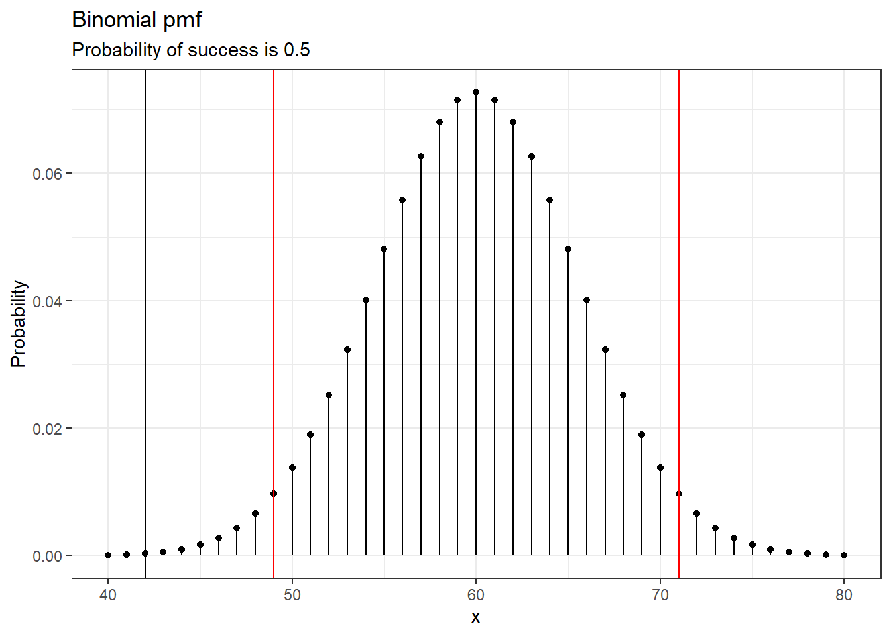
<p class="caption">(\#fig:dist201-fig)Binomial pmf</p>
</div>


### Repeat using simulation  

We will repeat the analysis using an empirical p-value. Step 1 is the same.

### Step 2 - Compute a test statistic. 

We will use the proportion of listeners that get the song correct instead of the number, this is a minor change since we are simply dividing by 120. 


```r
obs<-42/120
obs
```

```
## [1] 0.35
```


### Step 3 - Determine the p-value.

To simulate 120 games under the null hypothesis where $p = 0.50$, we could flip a coin 120 times. Each time the coin came up heads, this could represent the listener guessing correctly, and tails would represent the listener guessing incorrectly. For example, we can simulate 5 tapper-listener pairs by flipping a coin 5 times:  

$$
\begin{array}{ccccc} 
H & H & T & H & T \\
Correct & Correct & Wrong & Correct & Wrong \\
\end{array} 
$$

After flipping the coin 120 times, we got 56 heads for $\hat{p}_{sim} = 0.467$. As we did with the randomization technique, seeing what would happen with one simulation isn't enough. In order to evaluate whether our originally observed proportion of 0.35 is unusual or not, we should generate more simulations. Here we've repeated this simulation 10000 times:


```r
results <- rbinom(10000, 120, 0.5) / 120
```

Note, we could simulate it a number of ways. Here is a way using `do()` that will look like how we have coded for other randomization tests.


```r
set.seed(604)
results<-do(10000)*mean(sample(c(0,1),size=120,replace = TRUE))
```


```r
head(results)
```

```
##        mean
## 1 0.4250000
## 2 0.5250000
## 3 0.5916667
## 4 0.5000000
## 5 0.5250000
## 6 0.5083333
```


```r
results %>%
  gf_histogram(~mean,fill="cyan",color="black") %>%
  gf_vline(xintercept =c(obs,1-obs),color="black") %>%
  gf_theme(theme_bw()) %>%
  gf_labs(x="Test statistic")
```

<div class="figure">

<p class="caption">(\#fig:dens202-fig)The estimated sampling distribution.</p>
</div>

Notice in Figre \@ref(fig:dens202-fig) how the sampling distribution is centered at 0.5 and looks symmetrical.

The p-value is found using the `prop1` function, in this problem we really need the observed case added back in to prevent a p-value of zero.


```r
2*prop1(~(mean<=obs),data=results)
```

```
##  prop_TRUE 
## 0.00119988
```

### Step 4 - Draw a conclusion 

In these 10,000 simulations, we see very few results close to 0.35. Based on our data, if the listeners were guessing correct 50\% of the time, there is less than a $0.0012$ probability that only 35% or less or 65% or more listeners would get it right. This is much less than 0.05, so we reject that the listeners are guessing correctly half of the time.

>**Exercise**:
In the context of the experiment, what is the p-value for the hypothesis test?^[The p-value is the chance of seeing the data summary or something more in favor of the alternative hypothesis given that guessing has a probability of success of 0.5. Since we didn't observe many even close to just 42 correct, the p-value will be small, around 1-in-1000 or smaller.]

>**Exercise**:  
Do the data provide statistically significant evidence against the null hypothesis? State an appropriate conclusion in the context of the research question.^[The p-value is less than 0.05, so we reject the null hypothesis. There is statistically significant evidence, and the data provide strong evidence that the chance a listener will guess the correct tune is less than 50\%.]

## Cardiopulmonary resuscitation (CPR)

Let's return to the CPR example from last lesson. As a reminder, we will repeat the background material.

Cardiopulmonary resuscitation (CPR) is a procedure used on individuals suffering a heart attack when other emergency resources are unavailable. This procedure is helpful in providing some blood circulation to keep a person alive, but CPR chest compressions can also cause internal injuries. Internal bleeding and other injuries that can result from CPR complicate additional treatment efforts. For instance, blood thinners may be used to help release a clot that is causing the heart attack once a patient arrives in the hospital. However, blood thinners negatively affect internal injuries.

Here we consider an experiment with patients who underwent CPR for a heart attack and were subsequently admitted to a hospital.^["Efficacy and safety of thrombolytic therapy after initially unsuccessful cardiopulmonary resuscitation: a prospective clinical trial." The Lancet, 2001.] Each patient was randomly assigned to either receive a blood thinner (treatment group) or not receive a blood thinner (control group). The outcome variable of interest was whether the patient survived for at least 24 hours.

### Step 1- State the null and alternative hypotheses  


We want to understand whether blood thinners are helpful or harmful. We'll consider both of these possibilities using a two-sided hypothesis test.

$H_0$: Blood thinners do not have an overall survival effect, experimental treatment is independent of survival rate. $p_c - p_t = 0$.  
$H_A$: Blood thinners have an impact on survival, either positive or negative, but not zero. $p_c - p_t \neq 0$.


```r
thinner <- read_csv("data/blood_thinner.csv")
```


```r
head(thinner)
```

```
## # A tibble: 6 x 2
##   group     outcome 
##   <chr>     <chr>   
## 1 treatment survived
## 2 control   survived
## 3 control   died    
## 4 control   died    
## 5 control   died    
## 6 treatment survived
```


Let's put it in a table.


```r
tally(~group+outcome,data=thinner,margins = TRUE)
```

```
##            outcome
## group       died survived Total
##   control     39       11    50
##   treatment   26       14    40
##   Total       65       25    90
```

### Step 2 - Compute a test statistic. 

In this case the data is from a **hypergeometric** distribution, this is really a binomial from a finite population. We can calculate the p-value using this probability distribution. The random variable is the number of control patients that survived from a population of 90, where 50 are control patients and 40 are treatment patients, and where a total of 25 survived.

### Step 3 - Determine the p-value.

In this case we want to find $\Prob(X \leq 11)$ and double it since it is a two-sided test.


```r
2*phyper(11,50,40,25)
```

```
## [1] 0.2581356
```

Note: We could have picked the lower right cell as the reference cell. But now I want the $\Prob(X \geq 14)$ with the appropriate change in parameter values. Notice we get the same answer.


```r
2*(1-phyper(13,40,50,25))
```

```
## [1] 0.2581356
```

We could the same thing for the other two cells.


```r
2*phyper(26,40,50,65)
```

```
## [1] 0.2581356
```


```r
2*(1-phyper(38,50,40,65))
```

```
## [1] 0.2581356
```


Or `R` has a built in function, `fisher.test()`, that we could use.


```r
fisher.test(tally(~group+outcome,data=thinner))
```

```
## 
## 	Fisher's Exact Test for Count Data
## 
## data:  tally(~group + outcome, data = thinner)
## p-value = 0.2366
## alternative hypothesis: true odds ratio is not equal to 1
## 95 percent confidence interval:
##  0.6794355 5.4174460
## sample estimates:
## odds ratio 
##   1.895136
```

The p-value is slightly different since the **hypergeometric** is not symmetric. Doubling the p-value from the single side result is not quite right. The algorithm in `fisher.test()` finds and adds all probabilities less than or equal to value of $\Prob(X = 11)$, see Figure \@ref(fig:dens203-fig). This is the correct p-value.


```r
gf_dist("hyper",m=50,n=40,k=25) %>%
  gf_hline(yintercept = dhyper(11,50,40,25),color="red") %>%
  gf_labs(title="Hypergeometric pmf",subtitle="Red line is P(X=11)",y="Probability") %>%
  gf_theme(theme_bw())
```

<div class="figure">

<p class="caption">(\#fig:dens203-fig)Hypergeometric pmf showing the cutoff for p-value calculation.</p>
</div>

This is how `fisher.test()` is calculating the p-value:


```r
temp<-dhyper(0:25,50,40,25)
sum(temp[temp<=dhyper(11,50,40,25)])
```

```
## [1] 0.2365928
```


The randomization test in the last lesson yielded a p-value of 0.257 so all tests are consistent.

### Step 4 - Draw a conclusion 

Since this p-value is larger than 0.05, we do not reject the null hypothesis. That is, we do not find statistically significant evidence that the blood thinner has any influence on survival of patients who undergo CPR prior to arriving at the hospital. Once again, we can discuss the causal conclusion since this is an experiment.


Notice that in these first two examples, we had a test of a single proportion and a test of two proportions. The single proportion test did not have an equivalent randomization test since there is not a second variable to shuffle. We were able to get answers since we found a probability model that we could use in each case.  

## Golf Balls  

Our last example will be interesting because the distribution has multiple parameters and a test metric is not obvious at this point.

The owners of a residence located along a golf course collected the first 500 golf balls that landed on their property. Most golf balls are labeled with the make of the golf ball and a number, for example "Nike 1" or "Titleist 3". The numbers are typically between 1 and 4, and the owners of the residence wondered if these numbers are equally likely (at least among golf balls used by golfers of poor enough quality that they lose them in the yards of the residences along the fairway.)

We will use a significance level of $\alpha = 0.05$ since there is no reason to favor one error over the other.

### Step 1- State the null and alternative hypotheses  

We think that the numbers are not all equally likely. The question of one-sided versus two-sided is not relevant in this test, you will see this when we write the hypotheses. 

$H_0$: All of the numbers are equally likely.$\pi_1 = \pi_2 = \pi_3 = \pi_4$ Or $\pi_1 = \frac{1}{4}, \pi_2 =\frac{1}{4}, \pi_3 =\frac{1}{4}, \pi_4 =\frac{1}{4}$  
$H_A$: There is some other distribution of percentages in the population. At least one population proportion is not $\frac{1}{4}$.  

Notice that we switched to using $\pi$ instead of $p$ for the population parameter. There is no reason other than to make you aware that both are used. 

This problem is an extension of the binomial, instead of two outcomes, there are four outcomes. This is called a multinomial distribution. You can read more about it if you like, but our methods will not make it necessary to learn the probability mass function.


Of the 500 golf balls collected, 486 of them had a number between 1 and 4. Let's get the data from `golf_balls.csv".


```r
golf_balls <- read_csv("data/golf_balls.csv")
```


```r
inspect(golf_balls)
```

```
## 
## quantitative variables:  
##        name   class min Q1 median Q3 max     mean       sd   n missing
## ...1 number numeric   1  1      2  3   4 2.366255 1.107432 486       0
```


```r
tally(~number,data=golf_balls)
```

```
## number
##   1   2   3   4 
## 137 138 107 104
```

### Step 2 - Compute a test statistic. 

If all numbers were equally likely, we would expect to see 121.5 balls of each number, this is a point estimate and thus not an actual value that could be realized. Of course, in a sample we will have variation and thus departure from this state. We need a test statistic that will help us determine if the observed values are reasonable under the null hypothesis. Remember that the test statistics is a single number metric used to evaluate the hypothesis.

>**Exercise**:  
What would you propose for the test statistic?  

With four proportions, we need a way to combine them. This seems tricky, so let's just use a simple one. Let's take the maximum number of balls in any cell and subtract the minimum, this is called the range and we will denote the parameter as $R$. Under the null this should be zero. We could re-write our hypotheses as: 

$H_0$: $R=0$  
$H_A$: $R>0$  

Notice that $R$ will always be non-negative, thus this test is one-sided.

The observed range is 34, 138 - 104.


```r
obs<-diff(range(tally(~number,data=golf_balls)))
obs
```

```
## [1] 34
```

### Step 3 - Determine the p-value.

We don't know the distribution of our test statistic so we will use simulation. We will simulate data from a multinomial under the null hypothesis and calculate a new value of the test statistic. We will repeat this 10000 times and this we give us an estimate of the sampling distribution.

We will use the `sample()` function again to simulate the distribution of numbers under the null hypothesis. To help us understand the process and build the code, we are only initially using a sample size of 12 to keep the printout reasonable and easy to read.


```r
set.seed(3311)
diff(range(table(sample(1:4,size=12,replace=TRUE))))
```

```
## [1] 4
```

Notice this is not using `tidyverse` coding ideas. We don't think we need tibbles or data frames so we went with straight nested `R` code. You can break this code down by starting with the code in the center.


```r
set.seed(3311)
sample(1:4,size=12,replace=TRUE)
```

```
##  [1] 3 1 2 3 2 3 1 3 3 4 1 1
```


```r
set.seed(3311)
table(sample(1:4,size=12,replace=TRUE))
```

```
## 
## 1 2 3 4 
## 4 2 5 1
```


```r
set.seed(3311)
range(table(sample(1:4,size=12,replace=TRUE)))
```

```
## [1] 1 5
```


```r
set.seed(3311)
diff(range(table(sample(1:4,size=12,replace=TRUE))))
```

```
## [1] 4
```

We are now ready to ramp up to the full problem. Let's simulated the data under the null hypothesis. We are sampling 486 golf balls with the numbers 1 through 4 on them. Each number is equally likely. We then find the range, our test statistic. Finally we repeat this 10,000 to get an estimate of the sampling distribution of our test statistic. 


```r
results <- do(10000)*diff(range(table(sample(1:4,size=486,replace=TRUE))))
```

Figure \@ref(fig:dens204-fig) is a plot of the sampling distribution of the range.


```r
results %>%
  gf_histogram(~diff,fill="cyan",color = "black") %>%
  gf_vline(xintercept = obs,color="black") %>%
  gf_labs(title="Sampling Distribution of Range",subtitle="Multinomial with equal probability",
          x="Range") %>%
  gf_theme(theme_bw)
```

<div class="figure">
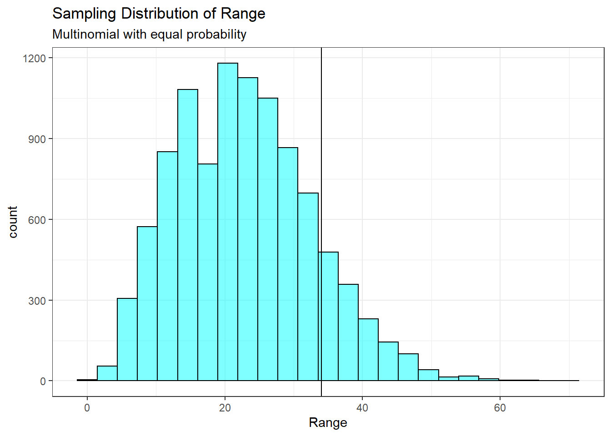
<p class="caption">(\#fig:dens204-fig)Sampling distribution of the range.</p>
</div>

Notice how this distribution is skewed to the right.

The p-value is 0.14, this value is greater than 0.05 so we fail to reject. However, it is not that much greater than 0.05, so the residents may want to repeat the study with more data.


```r
prop1(~(diff>=obs),data=results)
```

```
## prop_TRUE 
##  0.140286
```

### Step 4 - Draw a conclusion 

Since this p-value is larger than 0.05, we do not reject the null hypothesis. That is, based on our data, we do not find statistically significant evidence against the claim that the number on the golf balls are equally likely. 

## Repeat with a different test statistic

The test statistic we developed helped but it seems weak because we did not use the information in all four cells. So let's devise a metric that does this. We will jump to step 2.

### Step 2 - Compute a test statistic. 

If each number were equally likely, we would have 121.5 balls in each bin. We can find a test statistic by looking at the deviation in each cell from 121.5.


```r
tally(~number,data=golf_balls) -121.5
```

```
## number
##     1     2     3     4 
##  15.5  16.5 -14.5 -17.5
```

Now we need to collapse these into a single number. Just adding will always result in a value of 0, why? So let's take the absolute value and then add.


```r
obs<-sum(abs(tally(~number,data=golf_balls) -121.5))
obs
```

```
## [1] 64
```

This will be our test statistic.

### Step 3 - Determine the p-value.

We will use similar code from above with our new metric.


```r
set.seed(9697)
results <- do(10000)*sum(abs(table(sample(1:4,size=486,replace=TRUE))-121.5))
```

Figure \@ref(fig:dens205-fig) is a plot of the sampling distribution of the absolute value of deviations.


```r
results %>%
  gf_histogram(~sum,fill="cyan",color="black") %>%
  gf_vline(xintercept = obs,color="black") %>%
  gf_labs(title="Sampling Distribution of Absolute Deviations",
          subtitle="Multinomial with equal probability",
          x="Absolute deviations") %>%
  gf_theme(theme_bw)
```

<div class="figure">
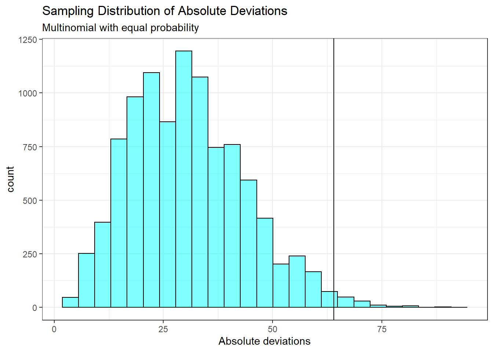
<p class="caption">(\#fig:dens205-fig)Sampling distribution of the absolute deviations.</p>
</div>

Notice how this distribution is skewed to the right and our test statistic seems to be more extreme.

The p-value is 0.014, this value is much smaller than our previous result. The test statistic matters in our decision process as nothing about this problem has changed except the test statistic.


```r
prop1(~(sum>=obs),data=results)
```

```
##  prop_TRUE 
## 0.01359864
```

### Step 4 - Draw a conclusion 

Since this p-value is smaller than 0.05, we reject the null hypothesis. That is, based on our data, we find statistically significant evidence against the claim that the number on the golf balls are equally likely. 

## Summary  

In this lesson we used probability models to help us make decisions from data. This lesson is different from the randomization section in that randomization had two variables and the null hypothesis of no difference. In the case of a 2 x 2 table, we were able to show that we could use the hypergeometric distribution to get an exact p-value under the assumptions of the model.

We also found that the choice of test statistic has an impact on our decision. Even though we get valid p-values and the desired Type 1 error rate, if the information in the data is not used to its fullest, we will lose power. Note: **power** is the probability of rejecting the null hypothesis when the alternative hypothesis is true.

In this next lesson we will learn about mathematical solutions to finding the sampling distribution. The key difference in all these methods is the selection of the test statistic and the assumptions made to derive a sampling distribution.


## Homework Problems

1. Repeat the analysis of the yawning data from last lesson but this time use the hypergeometric distribution.

Is yawning contagious? 

An experiment conducted by the \textit{MythBusters}, a science entertainment TV program on the Discovery Channel, tested if a person can be subconsciously influenced into yawning if another person near them yawns. 50 people were randomly assigned to two groups: 34 to a group where a person near them yawned (treatment) and 16 to a group where there wasn't a person yawning near them (control). The following table shows the results of this experiment. 

$$
\begin{array}{cc|ccc} & & &\textbf{Group}\\ 
& & \text{Treatment } &  \text{Control} & \text{Total}  \\
& \hline \text{Yawn}	&	10	 	& 4		& 14  \\
\textbf{Result} & \text{Not Yawn}	& 24	 	& 12 	 	& 36   \\
	&\text{Total}		& 34		& 16		& 50 \\
\end{array} 
$$

The data is in the file `yawn.csv`.

a. What are the hypotheses?  
b. Calculate the observed statistic, pick a cell.  
c. Find the p-value using the hypergeometric distribution.  
d. Plot the the sampling distribution.  
e. Determine the conclusion of the hypothesis test.  
f. Compare your results with the randomization test.  

2. Repeat the golf ball example using a different test statistic.

Use a level of significance of 0.05.

a. State the null and alternative hypotheses.  
b. Compute a test statistic.  
c. Determine the p-value.  
d. Draw a conclusion.  


3. Body Temperature

Shoemaker^[L. Shoemaker Allen (1996) What's Normal? – Temperature, Gender, and Heart Rate, Journal of Statistics Education, 4:2] cites a paper from the American Medical Association^[Mackowiak, P. A., Wasserman, S. S., and Levine, M. M. (1992), "A Critical Appraisal of 98.6 Degrees F, the Upper Limit of the Normal Body Temperature, and Other Legacies of Carl Reinhold August Wunderlich," Journal of the American Medical Association, 268, 1578-1580.] that questions conventional wisdom that the average body temperature of a human is 98.6. One of the main points of the original article – the traditional mean of 98.6 is, in essence, 100 years out of date. The authors cite problems with Wunderlich's original methodology, diurnal fluctuations (up to 0.9 degrees F per day), and unreliable thermometers. The authors believe the average temperature is less than 98.6. Test the hypothesis.

a. State the null and alternative hypotheses. 
b. State the significance level that will be used.  
c. Load the data from the file "temperature.csv" and generate summary statistics and a boxplot of the temperature data. We will not be using gender or heart rate for this problem.  
d. Compute a test statistic. We are going to help you with this part. We cannot do a randomization test since we don't have a second variable. It would be nice to use the mean as a test statistic but we don't yet know the sampling distribution of the sample mean.  

Let's get clever. If the distribution of the sample is symmetric, this is an assumption but look at the boxplot and summary statistics to determine if you are comfortable with it, then under the null hypothesis the observed values should be equally likely to either be greater or less than 98.6. Thus our test statistic is the number of cases that have a positive difference between the observed value and 98.6. This will be a binomial distribution with a probability of success of 0.5. You must also account for the possibility that there are observations of 98.6 in the data.

e. Determine the p-value.  
f. Draw a conclusion.

<!--chapter:end:20-Empirical-p-values.Rmd-->

# Central Limit Theorem {#CLT}


## Objectives

1) Explain the central limit theorem and when you can use it for inference.   
2) Conduct hypothesis tests of a single mean and proportion using the CLT and `R`.   
3) Explain how the chi-squared and $t$ distributions relate to the normal distribution, where we use them, and describe the impact on the shape of the distribution when the parameters are changed.   


## Central limit theorem

We've encountered several research questions and associated hypothesis tests so far in this block of material. While they differ in the settings, in their outcomes, and also in the technique we've used to analyze the data, many of them had something in common: for a certain class of test statistics, the general shape of the sampling distribution under the null hypothesis looks like a normal distribution.

### Null distribution

As a reminder, in the tapping and listening problem, we used the proportion of correct answers as our test statistic. Under the null hypothesis we assumed the probability of success was 0.5. The estimate of the sampling distribution of our test statistic is shown in Figure \@ref(fig:dens211-fig).  


<div class="figure">

<p class="caption">(\#fig:dens211-fig)Sampling distribution of the proportion.</p>
</div>

>**Exercise**:  
Describe the shape of the distribution and note anything that you find interesting.^[In general, the distribution is reasonably symmetric. It is unimodal and looks like a normal distribution.]

In the Figure \@ref(fig:dens212-fig) we have overlayed a normal distribution on the histogram of the estimated sampling distribution. This allows us to visually compare a normal probability density curve with the empirical distribution of the sampling distribution.

<div class="figure">

<p class="caption">(\#fig:dens212-fig)Sampling distribution of the sample proportion.</p>
</div>


This similarity between the empirical and theoretical distributions is not a coincidence, but rather, is guaranteed by  mathematical theory. This chapter will be a little more notation and algebra intensive than the previous chapters. However, the goal is to develop a tool that will help us find sampling distributions for test statistics and thus find p-values. This chapter is classical statistics often taught in AP high school classes as well as many introductory undergraduate statistics courses. Remember that before the advances of modern computing, these mathematical solutions were all that was available.

### Theorem - central limit theorem 

Theorem: Let $X_1,X_2,...,X_n$ be a sequence of iid, independent and identically distributed, random variables from a distribution with mean $\mu$ and standard deviation $\sigma<\infty$. Then,
$$
\bar{X} \overset{approx}{\sim}\textsf{Norm}\left(\mu,{\sigma\over\sqrt{n}}\right)
$$

There is a lot going on in this theorem. First notice we are drawing independent samples from the same parent population. The central limit theorem (CLT) does not specify the form of this parent distribution, only that it has a finite variance. Then if we form a new random variable that involves the sum of the individual random variables, in this case the sample mean, the distribution of the new random variable is approximately normal. In the case of the sample mean, the expected value is the same mean as the parent population and the variance is the variance of the parent population divided by the sample size. Let's summarize these ideas.

1. The process of creating a new random variable from the sum of independent identically distributed random variables is approximately normal.
2. The approximation to a normal distribution improves with sample size $n$.
3. The mean and variance of the sampling distribution are a function of the mean and variance of the parent population, the sample size $n$, and the form of the new random variable.

If you go back and review examples, exercises, and homework problems from the previous lessons on hypothesis testing, you will see that we get symmetric normal "looking" distributions when we created test statistics that involved the process of summing. The example of a skewed distribution was the golf ball example where our test statistic was the difference of the max and min. It is hard to overstate the historical importance of this theorem to the field of inferential statistics and science in general.

To get an understanding and some intuition of the central limit theorem, let's simulate some data and evaluate.

### Simulating data for CLT

For this section, we are going to use an artificial example where we know the population distribution and parameters. We will repeat sampling from this many times and plot the distribution of the summary statistic of interest, the sample mean, to demonstrate the CLT. This is purely an educational thought experiment to give ourselves confidence about the validity of the CLT.

Suppose there is an upcoming election in Colorado and Proposition A is on the ballot. Now suppose that 65% of Colorado voters support Proposition A. We poll a random sample of $n$ Colorado voters. Prior to conducting the sample, we can think about the sample as a sequence of iid random variables from the binomial distribution with one trial in each run and a probability of success (support for the measure) of 0.65. In other words, each random variable will take a value of 1 (support) or 0 (oppose). Figure \@ref(fig:dens213-fig) is a plot of the pmf of the parent distribution ($\textsf{Binom}(1,0.65)$):


```r
gf_dist("binom",size=1,prob=.65,plot_size=1) %>%
  gf_theme(theme_classic()) %>%
  gf_theme(scale_x_continuous(breaks = c(0,1))) %>%
  gf_labs(y="Probability",x="X")
```

<div class="figure">

<p class="caption">(\#fig:dens213-fig)Binomial pmf with 1 trial and probability of succes of 0.65.</p>
</div>

This is clearly not normal, it is in fact discrete. The mean of $X$ is 0.65 and the standard deviation is $\sqrt{0.65(1-0.65)}=0.477$. 

In our first simulation, we let the sample size be ten, $n=10$. This is typically too small for the CLT to apply but we will still use it as a starting point. In the code box below, we will obtain a sample of size 10 from this distribution and record the observed mean $\bar{x}$, which is our method of moments estimate of the probability of success. We will repeat this 10,000 times to get an empirical distribution of $\bar{X}$. (Note that $\bar{X}$ is a mean of 1s and 0s and can be thought of as a proportion of voters in the sample that support the measure. Often, population proportion is denoted as $\pi$ and the sample proportion is denoted as $\hat{\pi}$.) 


```r
set.seed(5501)
results<-do(10000)*mean(rbinom(10,1,0.65))
```

Since we are summing iid variables, the sampling distribution of the mean should look like a normal distribution. The mean should be close to 0.65, and the standard deviation $\sqrt{\frac{p(1-p)}{n}} = \sqrt{\frac{0.65(1-0.65)}{10}}=0.151$ 


```r
favstats(~mean,data=results)
```

```
##  min  Q1 median  Q3 max    mean        sd     n missing
##  0.1 0.5    0.7 0.8   1 0.64932 0.1505716 10000       0
```

Remember from our lessons on probability, these results for the mean and standard deviation do not depend on the CLT, they are results from the properties of expectation on independent samples. The distribution of the sample mean, the shape of the sampling distribution, is approximately normal as a result of the CLT, Figure \@ref(fig:dens214-fig).

<div class="figure">
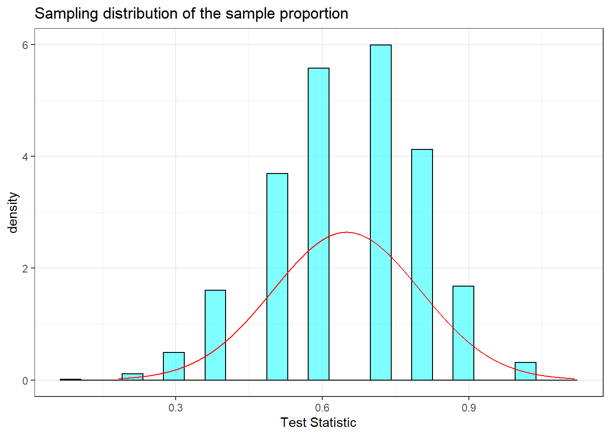
<p class="caption">(\#fig:dens214-fig)Sampling distribution of the sample proportion with sample size of 10.</p>
</div>

Note the sampling distribution of the sample mean has a bell-curvish shape, but with some skew to the left for this particular small sample size. That is why we state that the approximation improves with sample size. 

As a way to determine the impact of the sample size on the inference to the population, let's record how often a sample of 10 failed to indicate support for the measure. (How often was the sample proportion less than or equal to 0.5?) Remember, in this artificial example, we know that the population is in favor of the measure, 65% approval. However, if our point estimate is below 0.5, we would be led to believe that the population does not support the measure. 


```r
results %>%
 summarise(low_result=mean(~mean<=0.5))
```

```
##   low_result
## 1     0.2505
```

Even though we know that 65% of Colorado voters support the measure, a sample of size 10 failed to indicate support 25.05% of the time. 

Let's take a larger sample. In the code below, we will repeat the above but with a sample of size 25. Figure \@ref(fig:dens215-fig) plots the sampling distribution.


```r
set.seed(5501)
results<-do(10000)*mean(rbinom(25,1,0.65))
```


<div class="figure">

<p class="caption">(\#fig:dens215-fig)Sampling distribution of the sample proportion with sample size of 25.</p>
</div>


```r
results %>%
 summarise(low_result=mean(~mean<=0.5))
```

```
##   low_result
## 1     0.0623
```

When increasing the sample size to 25, the standard deviation of our sample proportion decreased. According to the central limit theorem, it should have decreased to $\sigma/\sqrt{25}=\sqrt{\frac{p(1-p)}{25}}=0.095$. Also, the skew became less severe. Further, the sample of size 25 failed to indicate support only 6.23% of the time. It reasonably follows that an even larger sample would continue these trends. Figure \@ref(fig:dens216-fig) demonstrates these trends.


```r
clt %>%
  gf_histogram(~mean,color="black",fill="cyan") %>%
  gf_facet_grid(~samp) %>%
  gf_theme(theme_bw())
```

<div class="figure">

<p class="caption">(\#fig:dens216-fig)Sampling distribution of the proportion for different trail sizes.</p>
</div>


### Summary of example

In this example, we knew the true proportion of voters who supported the proposition. Based on that knowledge, we simulated the behavior of the sample proportion. We did this by taking a sample of size $n$, recording the sample proportion, sample mean, and repeating that process thousands of times. In reality, we will not know the true underlying level of support; further, we will not take a sample repeatedly thousands of times from the parent population. Sampling can be expensive and time-consuming. Thus, we would take one random sample of size $n$, and acknowledge that the resulting sample proportion is but one observation from an underlying normal distribution. We would then determine what values of $\pi$ (the true unknown population proportion) could reasonably have resulted in the observed sample proportion. 


## Other distribution for estimators

Prior to using the CLT in hypothesis testing, we want to discuss other sampling distributions that are based on the CLT or normality assumptions. A large part of theoretical statistics has been about mathematically deriving the distribution of sample statistics. In these methods we obtain a sample statistic, determine the distribution of that statistic under certain conditions, and then use that information to make a statement about the population parameter. 

### Chi-sqaured

Recall that the central limit theorem tells us that for reasonably large sample sizes, $\bar{X}\overset{approx}{\sim}\textsf{Norm}(\mu,\sigma/\sqrt{n})$. However, this expression involves two unknowns: $\mu$ and $\sigma$. In the case of binary data, population variance is a function of population proportion ($\Var(X)=\pi(1-\pi)$), so there is really just one unknown. In the case of continuous data, the standard deviation would need to be estimated. 

Let $S^2$ be defined as:
$$
S^2={\sum (X_i-\bar{X})^2\over n-1}
$$

Recall that this is an unbiased estimate for $\sigma^2$. The sampling distribution of $S^2$ can be found using the following lemma:

Lemma: Let $X_1,X_2,...,X_n$ be an iid sequence of random variables from a normal population with mean $\mu$ and standard deviation $\sigma$. Then,
$$
{(n-1)S^2\over \sigma^2}\sim \textsf{Chisq}(n-1)
$$

The $\textsf{Chisq}(n-1)$ distribution is read as the "chi-squared" distribution ("chi" is pronounced "kye"). The chi-squared distribution has one parameter: degrees of freedom. The chi-squared distribution is used in other contexts such as goodness of fit problems like the golf ball example from last lesson, we will discuss this particular application in a later chapter.   

The proof of this lemma is outside the scope of this book, but it is not terribly complicated. It follows from the fact that the sum of $n$ squared random variables, each with the standard normal distribution, follows the chi-squared distribution with $n$ degrees of freedom. 

This lemma can be used to draw inferences about $\sigma^2$. For a particular value of $\sigma^2$, we know how $S^2$ should behave. So, for a particular value of $S^2$, we can figure out reasonable values of $\sigma^2$. 

In practice, one rarely estimates $\sigma$ for the purpose of inferring on $\sigma$. Typically, we are interested in estimating $\mu$ and we need to account for the added uncertainty in estimating $\sigma$ as well. That is what we will discuss in the next section. 

### Student's t

Let $X_1,X_2,...,X_n$ be an iid sequence of random variables, each with mean $\mu$ and standard deviation $\sigma$. Recall that the central limit theorem tells us that
$$
\bar{X}\overset{approx}{\sim}\textsf{Norm}(\mu,\sigma/\sqrt{n})
$$

Rearranging:
$$
{\bar{X}-\mu\over\sigma/\sqrt{n}}\overset{approx}{\sim}\textsf{Norm}(0,1)
$$

Again, $\sigma$ is unknown. Thus, we have to estimate it. We can estimate it with $S$, but now we need to know the distribution of ${\bar{X}-\mu\over S/\sqrt{n}}$. This *does not* follow the normal distribution. 

Lemma: Let $X_1,X_2,...,X_n$ be an iid sequence of random variables from a normal population with mean $\mu$ and standard deviation $\sigma$. Then,
$$
{\bar{X}-\mu\over S/\sqrt{n}} \sim \textsf{t}(n-1)
$$

The $\textsf{t}(n-1)$ distribution is read as the "$t$" distribution. The $t$ distribution has one parameter: degrees of freedom. The expression above $\left({\bar{X}-\mu\over S/\sqrt{n}}\right)$ is referred to as the $t$ statistic. 

Similar to the chi-squared distribution, we won't go over the proof, but it follows from some simple algebra and from the fact that the ratio between a standard normal random variable and the square root of a chi-squared random variable, divided by it's degrees of freedom follows a $t$ distribution. 

The $t$ distribution is very similar to the standard normal distribution, but has longer tails. This seems to make sense in the context of estimating $\mu$ since substituting $S$ for $\sigma$ adds variability to the random variable. 
Figure \@ref(fig:t211-fig) is a plot of the $t$ distribution, shown as a blue line, and has a bell shape that looks very similar to a normal distribution, red line. However, its tails are thicker, which means observations are more likely to fall beyond two standard deviations from the mean than under the normal distribution. When our sample is small, the value $s$ used to compute the standard error isn't very reliable. The extra thick tails of the $t$ distribution are exactly the correction we need to resolve this problem. When the degrees of freedom is about 30 or more, the $t$ distribution is nearly indistinguishable from the normal distribution.


```r
gf_dist("norm",color="red") %>%
  gf_dist("t",df=3,color="blue") %>%
  gf_theme(theme_bw())
```

<div class="figure">
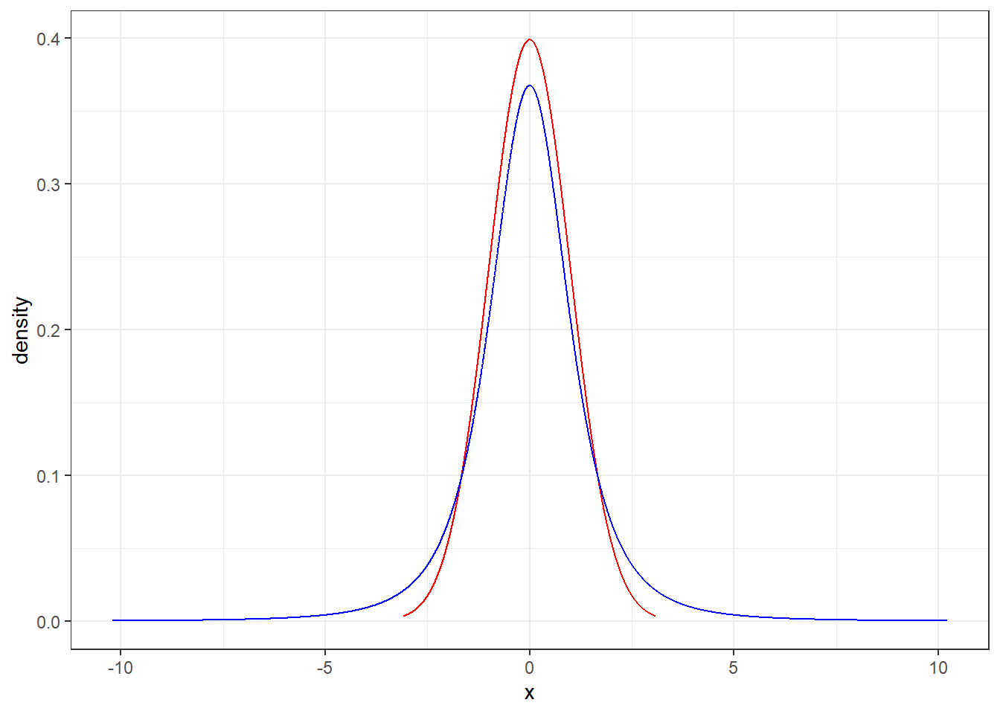
<p class="caption">(\#fig:t211-fig)The distibtion of t.</p>
</div>


### Important Note

You may have noticed an important condition in the two lemmas above. It was assumed that each $X_i$ in the sequence of random variables was *normally* distributed. While the central limit theorem has no such normality assumption, the distribution of the $t$-statistic is subject to the distribution of the underlying population. With a large enough sample size, this assumption is not necessary. There is no magic number, but some resources state that as long as $n$ is at least 30-40, the underlying distribution doesn't matter. For smaller sample sizes, the underlying distribution should be relatively symmetric and unimodal. 

One advantage of simulation-based inference methods is that these methods do not rely on any such distributional assumptions. However, the simulation-based methods may have a smaller power for the same sample size.

## Hypotheses tests using CLT

We are now ready to repeat some of our previous problems using the mathematically derived sampling distribution via the CLT.

### Tappers and listeners

#### Step 1- State the null and alternative hypotheses  

Here are the two hypotheses:  

$H_0$: The tappers are correct, and generally 50\% of the time listeners are able to guess the tune. $p = 0.50$  
$H_A$: The tappers are incorrect, and either more than or less than 50\% of listeners will be able to guess the tune. $p \neq 0.50$  

#### Step 2 - Compute a test statistic. 

The test statistic that we want to use is the sample mean $\bar{X}$, this is a method of moments estimate of the probability of success. Since these are independent samples from the same binomial distribution, by the CLT

$$
\bar{X} \overset{approx}{\sim}\textsf{Norm}\left(\pi,\sqrt\frac{\pi(1-\pi)}{n}\right)
$$

As we learned, this approximation improves with sample size. As a rule of thumb, most analysts are comfortable with using the CLT for this problem if the number of success and failures are both 10 or greater.

In our study 42 out of 120 listeners ($\bar{x}=\hat{p} = 0.35$) were able to guess the tune. This is the observed value of test statistic.


#### Step 3 - Determine the p-value.

We now want to find the p-value from the one-sided probability $\Prob(\bar{X} \leq 0.35)$ given the null hypothesis is true, the probability of success is 0.50. We will use `R` to get the one-sided value and then double it since the test is two-sided and the sampling distribution is symmetrical.


```r
2*pnorm(0.35,mean=.5,sd=sqrt(.5*.5/120))
```

```
## [1] 0.001015001
```

That is a small p-value and consistent with what we would got using both the exact binomial test and the simulation empirical p-values.

>**Important note**:
In the calculation of the standard deviation of the sampling distribution, we used the null hypothesized value of the probability of success. 

#### Step 4 - Draw a conclusion 

Based on our data, if the listeners were guessing correct 50\% of the time, there is less than a 1 in 1000 probability that only 42 or less or 78 or more listeners would get it right. This is much less than 0.05, so we reject that the listeners are guessing correctly half of the time.

Note that `R` has built in functions to perform this test. If you explore these functions, use `?prop.test` to learn more, you will find options to improve the performance of the test. You are welcome and should read about these methods. Again, before computers, researchers spent time optimizing the performance of the asymptotic methods such as the CLT.


Here is the test of a single proportion using `R`.


```r
prop.test(42,120)
```

```
## 
## 	1-sample proportions test with continuity correction
## 
## data:  42 out of 120
## X-squared = 10.208, df = 1, p-value = 0.001398
## alternative hypothesis: true p is not equal to 0.5
## 95 percent confidence interval:
##  0.2667083 0.4430441
## sample estimates:
##    p 
## 0.35
```

The p-value is small, reported as $0.0014$. We will study the confidence interval soon so don't worry about that part of the output. The alternative hypothesis is also listed.

>**Exercise**:  
How do you conduct a one-sided test? What if the null value where 0.45?^[We will only extract the p-value in this exercise]


```r
pval(prop.test(42,120,alternative="less",p=.45))
```

```
##   p.value 
## 0.0174214
```

The exact test uses the function `binom.test()`.


```r
binom.test(42,120)
```

```
## 
## 
## 
## data:  42 out of 120
## number of successes = 42, number of trials = 120, p-value = 0.001299
## alternative hypothesis: true probability of success is not equal to 0.5
## 95 percent confidence interval:
##  0.2652023 0.4423947
## sample estimates:
## probability of success 
##                   0.35
```

This is the same as 


```r
2*pbinom(42,120,.5)
```

```
## [1] 0.001299333
```


### Body temperature

We will repeat the body temperature analysis using the CLT. We will use $\alpha = 0.05$ 

#### Step 1- State the null and alternative hypotheses  

$H_0$: The average body temperature is 98.6; $\mu = 98.6$  
$H_A$: The average body temperature is less than 98.6; $\mu < 98.6$  

#### Step 2 - Compute a test statistic. 

We don't know the population variance, so we will use the $t$ distribution. Remember that 

$$
{\bar{X}-\mu\over S/\sqrt{n}} \sim \textsf{t}(n-1)
$$
thus our test statistic is 

$$
\frac{\bar{x}-98.6}{s/\sqrt{n}}
$$


```r
favstats(~temperature,data=temperature)
```

```
##   min   Q1 median   Q3   max     mean        sd   n missing
##  96.3 97.8   98.3 98.7 100.8 98.24923 0.7331832 130       0
```


```r
temperature %>%
  summarise(mean=mean(temperature),sd=sd(temperature),test_stat=(mean-98.6)/(sd/sqrt(130)))
```

```
## # A tibble: 1 x 3
##    mean    sd test_stat
##   <dbl> <dbl>     <dbl>
## 1  98.2 0.733     -5.45
```

We are over 5 standard deviation below the null hypothesis mean. We have some assumptions that we will discuss at the end of this problem. 

#### Step 3 - Determine the p-value.

We now want to find the p-value from $\Prob(t \leq -5.45)$ on 129 degrees of freedom, given the null hypothesis is true, which is that the probability of success is 0.50. We will use `R` to get the one-sided p-value.


```r
pt(-5.45,129)
```

```
## [1] 1.232178e-07
```

We could also use the `R` function `t_test()`.


```r
t_test(~temperature,data=temperature,mu=98.6,alternative="less")
```

```
## 
## 	One Sample t-test
## 
## data:  temperature
## t = -5.4548, df = 129, p-value = 1.205e-07
## alternative hypothesis: true mean is less than 98.6
## 95 percent confidence interval:
##      -Inf 98.35577
## sample estimates:
## mean of x 
##  98.24923
```

Notice this p-value is much smaller than the p-value from the method used in homework problem 3 in the last chapter. That is because this test statistic has more assumptions and uses the data as continuous and not discrete.

#### Step 4 - Draw a conclusion

Based our data, if the true mean body temperature is 98.6, then the probability of observing a mean of 98.25 or less is 0.00000012. This is too unlikely so we reject the hypothesis that the average body temperature is 98.6.


## Summary and rules of thumb

We have covered a great deal in this lesson. At its core, the central limit theorem is a statement about the distribution of a sum of independent identically distributed random variables. This sum is approximately normal. First we summarize rules of thumb for the use of the CLT and $t$ distribution.

### Numerical data

1. The central limit works regardless of the distribution. However, if the parent population is highly skewed, then more data is needed. The CLT works well once the sample sizes exceed 30 to 40. If the data is fairly symmetric, then less data is needed.

2. When estimating the mean and standard error from a sample of numerical data, the $t$ distribution is a little more accurate than the normal model. But there is an assumption that the parent population is normally distributed. This distribution works well even for small samples as long as the data is close to symmetrical and unimodal.

3. For medium samples, at least 15 data points, the $t$ distribution still works as long as the data is roughly symmetric and unimodal.

4. For large data sets 30-40 or more, the $t$ or even the normal can be used but we suggest you always use the $t$. 


Now, let's discuss the assumptions of the $t$ distribution and how to check them.

1. Independence of observations. This is a difficult assumption to verify. If we collect a simple random sample from less than 10\% of the population, or if the data are from an experiment or random process, we feel better about this assumption. If the data comes from an experiment, we can plot the data versus time collected to see if there are any patterns that indicate a relationship. A design of experiment course discusses these ideas.  

2. Observations come from a nearly normal distribution. This second condition is difficult to verify with small data sets. We often (i) take a look at a plot of the data for obvious departures from the normal model, usually in the form of prominent outliers, and (ii) consider whether any previous experiences alert us that the data may not be nearly normal. However, if the sample size is somewhat large, then we can relax this condition, e.g. moderate skew is acceptable when the sample size is 30 or more, and strong skew is acceptable when the size is about 60 or more.

A typical plot to use to evaluate the normality assumption is called the quantile-quantile plot. We form a scatterplot of the empirical quantiles from the data versus exact quantile values from the theoretical distribution. If the points fall along a line then the data match the distribution. An exact match is not realistic, so we look for major departures from the line. 

Figure \@ref(fig:qq211-fig) is our normal-quantile plot for the body temperature data. The largest value may be an outlier, we may want to verify it was entered correctly. The fact that the points are above the line for the larger values and below the line for the smaller values indicates that our data may have longer tails than the normal distribution. There are really only 3 values in the larger quantiles so in fact the data may be slightly skewed to the left, this was also indicated by a comparison of the mean and median. However, since we have 130 data points these results should not impact our findings. 


```r
gf_qq(~temperature,data=temperature) %>%
  gf_qqline(~temperature,data=temperature) %>%
  gf_theme(theme_bw())
```

<div class="figure">

<p class="caption">(\#fig:qq211-fig)Q-Q plot for body temperature data.</p>
</div>

Extreme data points, outliers, can be cause for concern. In later chapters, we will look for ways to detect outliers but we have seen them in our boxplots.  Outliers are problematic because normal distributions rarely have outliers so the presence of one may indicate a departure from normality. Second, outliers have a big impact on estimation methods for the mean and standard deviation whether it is a method of moments or maximum likelihood estimate.  

We can also check the impacts of the assumptions by using other methods for the hypothesis test. If all methods give the same conclusion, we can be confident in the results. Another way to check robustness to assumptions is to simulate data from different distributions and evaluate the performance of the test under the simulated data.

### Binary data  

The distribution of a binomial random variable or simple scalar transformations of it, such as the proportions of success found by dividing by the sample size, are approximately normal by the CLT. Since binomial random variables are bounded by zero and the number of trails, we have to make sure our probability of success is not close to zero or one, that is the number of successes is not close to 0 or $n$. A general rule of thumb is that the number of success and failures be at least 10.

## Homework Problems

1. Suppose we roll a fair six-sided die and let $X$ be the resulting number. The distribution of $X$ is discrete uniform. (Each of the six discrete outcomes is equally likely.) 

a. Suppose we roll the fair die 5 times and record the value of $\bar{X}$, the *mean* of the resulting rolls. Under the central limit theorem, what should be the distribution of $\bar{X}$?   
b. Simulate this process in `R`. Plot the resulting empirical distribution of $\bar{X}$ and report the mean and standard deviation of $\bar{X}$. Was it what you expected?   

(HINT: You can simulate a die roll using the `sample` function. Be careful and make sure you use it properly.)   
c. Repeat parts a) and b) for $n=20$ and $n=50$. Describe what you notice. Make sure all three plots are plotted on the same $x$-axis scale. You can use facets if you combine your data into one `tibble`.


2. The nutrition label on a bag of potato chips says that a one ounce (28 gram) serving of potato chips has 130 calories and contains ten grams of fat, with three grams of saturated fat. A random sample of 35 bags yielded a sample mean of 134 calories with a standard deviation of 17 calories. Is there evidence that the nutrition label does not provide an accurate measure of calories in the bags of potato chips? The conditions necessary for applying the normal model have been checked and are satisfied.


The question has been framed in terms of two possibilities: the nutrition label accurately lists the correct average calories per bag of chips or it does not, which may be framed as a hypothesis test.

a. Write the null and alternative hypothesis.  
b. What level of significance are you going to use?   
c. What is the distribution of the test statistic ${\bar{X}-\mu\over S/\sqrt{n}}$? Calculate the observed value.  
d. Calculate a p-value.  
e. Draw a conclusion.  

3. Exploration of the chi-squared and $t$ distributions. 

a. In `R`, plot the pdf of a random variable with the chi-squared distribution with 1 degree of freedom. On the same plot, include the pdfs with degrees of freedom of 5, 10 and 50. Describe how the behavior of the pdf changes with increasing degrees of freedom.   
b. Repeat part (a) with the $t$ distribution. Add the pdf of a standard normal random variable as well. What do you notice? 


4. In this lesson, we have used the expression *degrees of freedom* a lot. What does this expression mean? When we have sample of size $n$, why are there $n-1$ degrees of freedom for the $t$ distribution? Give a short concise answer (about one paragraph). You will likely have to do a little research on your own.  

5. Deborah Toohey is running for Congress, and her campaign manager claims she has more than 50\% support from the district's electorate. Ms. Toohey's opponent claimed that Ms. Toohey has **less** than 50\%. Set up a hypothesis test to evaluate who is right.

a. Should we run a one-sided or two-sided hypothesis test?  
b. Write the null and alternative hypothesis.  
c. What level of significance are you going to use?   
d. What are the assumptions of this test?  
e. Calculate the test statistic.  
e. Calculate a p-value.  
f. Draw a conclusion.  

Note: A newspaper collects a simple random sample of 500 likely voters in the district and estimates Toohey's support to be 52\%. 


<!--chapter:end:21-Central-Limit-Theorem.Rmd-->

# Confidence Intervals {#CI}


## Objectives

1) Using asymptotic methods based on the normal distribution, construct and interpret a confidence interval for an unknown parameter.   
2) Describe the relationships between confidence intervals, confidence level, and sample size.  
3) For proportions, be able to calculate the three different approaches for confidence intervals using `R`.  

## Confidence interval

A point estimate provides a single plausible value for a parameter. However, a point estimate is rarely perfect; usually there is some error in the estimate. In addition to supplying a point estimate of a parameter, a next logical step would be to provide a plausible **range of values** for the parameter.


### Capturing the population parameter 

A plausible range of values for the population parameter is called a **confidence interval**. Using only a point estimate is like fishing in a murky lake with a spear, and using a confidence interval is like fishing with a net. We can throw a spear where we saw a fish, but we will probably miss. On the other hand, if we toss a net in that area, we have a good chance of catching the fish.

If we report a point estimate, we probably will not hit the exact population parameter. On the other hand, if we report a range of plausible values -- a confidence interval -- we have a good shot at capturing the parameter.

>**Exercise**:
If we want to be very certain we capture the population parameter, should we use a wider interval or a smaller interval?^[If we want to be more certain we will capture the fish, we might use a wider net. Likewise, we use a wider confidence interval if we want to be more certain that we capture the parameter. A higher level of confidence implies a wider interval.]


### Constructing a confidence interval  

A point estimate is our best guess for the value of the parameter, so it makes sense to build the confidence interval around that value. The standard error, which is a measure of the uncertainty associated with the point estimate, provides a guide for how large we should make the confidence interval.

Generally, what you should know about building confidence intervals is laid out in the following steps:

1. Identify the parameter you would like to estimate (for example, $\mu$).  

2. Identify a good estimate for that parameter (sample mean, $\bar{X}$).  

3. Determine the distribution of your estimate or a function of your estimate.   

4. Use this distribution to obtain a range of feasible values (confidence interval) for the parameter. (For example if $\mu$ is the parameter of interest and we are using the CLT, then $\frac{\bar{X}-\mu}{\sigma/\sqrt{n}}\sim \textsf{Norm}(0,1)$. We can solve the equation for $\mu$ to find a reasonable range of feasible values.)

Let's do an example to solidify these ideas.

> Constructing a 95\% confidence interval for the mean  
When the sampling distribution of a point estimate can reasonably be modeled as normal, the point estimate we observe will be within 1.96 standard errors of the true value of interest about 95\% of the time. Thus, a **95\% confidence interval** for such a point estimate can be constructed:  

$$ \hat{\theta} \pm\ 1.96 \times SE_{\hat{\theta}}$$
Where $\hat{\theta}$ is our estimate of the parameter and $SE_{\hat{\theta}}$ is the standard error of that estimate. 

We can be **95\% confident** this interval captures the true value. The 1.96 can be found using the `qnorm()` function. If we want .95 in the middle, that leaves 0.025 in each tail. Thus we use .975 in the `qnorm()` function.


```r
qnorm(.975)
```

```
## [1] 1.959964
```


>**Exercise**:  
Compute the area between -1.96 and 1.96 for a normal distribution with mean 0 and standard deviation 1.  


```r
pnorm(1.96)-pnorm(-1.96)
```

```
## [1] 0.9500042
```

In mathematical terms, the derivation of this confidence is as follows:

Let $X_1,X_2,...,X_n$ be an iid sequence of random variables, each with mean $\mu$ and standard deviation $\sigma$. The central limit theorem tells us that
$$
\frac{\bar{X}-\mu}{\sigma/\sqrt{n}}\overset{approx}{\sim}\textsf{Norm}(0,1)
$$

If the significance level is $0\leq \alpha \leq 1$, then the confidence level is $1-\alpha$. Yes $\alpha$ is the same as the significance level in hypothesis testing. Thus
$$
\Prob\left(-z_{\alpha/2}\leq {\bar{X}-\mu\over \sigma/\sqrt{n}} \leq z_{\alpha/2}\right)=1-\alpha
$$

where $z_{\alpha/2}$ is such that $\Prob(Z\geq z_{\alpha/2})=\alpha/2$, where $Z\sim \textsf{Norm}(0,1)$, see Figure \@ref(fig:dens221-fig).

<div class="figure">

<p class="caption">(\#fig:dens221-fig)The pdf of a standard normal distribution showing idea of how to develop a confidence interval.</p>
</div>

So, we know that $(1-\alpha)*100\%$ of the time, ${\bar{X}-\mu\over \sigma/\sqrt{n}}$ will be between $-z_{\alpha/2}$ and $z_{\alpha/2}$. 

By rearranging the expression above and solving for $\mu$, we get:
$$
\Prob\left(\bar{X}-z_{\alpha/2}{\sigma\over\sqrt{n}}\leq \mu \leq \bar{X}+z_{\alpha/2}{\sigma\over\sqrt{n}}\right)=1-\alpha
$$

Be careful with the interpretation of this expression. As a reminder $\bar{X}$ is the random variable here. The population mean, $\mu$, is NOT a variable. It is an unknown parameter. Thus, the above expression is NOT a probabilistic statement about $\mu$, but rather about the random variable $\bar{X}$. 

Nonetheless, the above expression gives us a nice interval for "reasonable" values of $\mu$ given a particular sample. 

A $(1-\alpha)*100\%$ *confidence interval for the mean* is given by:
$$
\mu\in\left(\bar{x}\pm z_{\alpha/2}{\sigma\over\sqrt{n}}\right)
$$

Notice in this equation we are using the lower case $\bar{x}$, the sample mean, and thus nothing is random in the interval. Thus we will not use probabilistic statements about confidence intervals when we calculate numerical values from data for the upper and/or lower limits.   

In most applications, the most common value of $\alpha$ is 0.05. In that case, to construct a 95% confidence interval, we would need to find $z_{0.025}$ which can be found quickly with `qnorm()`:

```r
qnorm(1-0.05/2)
```

```
## [1] 1.959964
```


```r
qnorm(.975)
```

```
## [1] 1.959964
```


#### Unknown Variance

When inferring about the population mean, we usually will have to estimate the underlying standard deviation as well. This introduces an extra level of uncertainty. We found that while ${\bar{X}-\mu\over\sigma/\sqrt{n}}$ has an approximate normal distribution, ${\bar{X}-\mu\over S/\sqrt{n}}$ follows the $t$-distribution with $n-1$ degrees of freedom. This adds the additional assumption that the parent population, the distribution of $X$, must be normal. 

Thus, when $\sigma$ is unknown, a $(1-\alpha)*100\%$ confidence interval for the mean is given by: 
$$
\mu\in\left(\bar{x}\pm t_{\alpha/2,n-1}{s\over\sqrt{n}}\right)
$$

Similar to the case above, $t_{\alpha/2,n-1}$ can be found using the `qt()` function in `R`. 

In practice, if $X$ is close to symmetrical and unimodal, we can relax the assumption of normality. Always look at your sample data. Outliers or skewness can be causes of concern. You can always run other methods that don't require the assumption of normality and compare results.

For large sample sizes, the choice of using the normal distribution or the $t$ distribution is irrelevant since they are close to each other. The $t$ distribution requires you to use the degrees of freedom so be careful.


### Body Temperature Example  

>*Example*:  
Find a 95% confidence interval for the body temperature data from last lesson.


We need the mean, standard deviation, and sample size from this data. The following `R` code calculates the confidence interval, make sure you can follow the code.


```r
temperature %>%
  favstats(~temperature,data=.) %>%
  select(mean,sd,n) %>%
  summarise(lower_bound=mean-qt(0.975,129)*sd/sqrt(n),
            upper_bound=mean+qt(0.975,129)*sd/sqrt(n))
```

```
##   lower_bound upper_bound
## 1      98.122    98.37646
```

The 95% confidence interval for $\mu$ is $(98.12,98.38)$. We are 95% *confident* that $\mu$, the average human body temperature, is in this interval. Alternatively and equally relevant, we could say that 95% of similarly constructed intervals will contain the true mean, $\mu$. It is important to understand the use of the word confident and not the word probability.   

There is a link between hypothesis testing and confidence intervals. Remember when we used this data in a hypothesis test, the null hypothesis was $H_0$: The average body temperature is 98.6 $\mu = 98.6$. This null hypothesized value is not in the interval, so we could reject the null hypothesis with this confidence interval. 

We could also use `R` to find the confidence interval and conduct the hypothesis test. Read about the function `t_test()` in the help menu to determine why we used the `mu` option.


```r
t_test(~temperature,data=temperature,mu=98.6)
```

```
## 
## 	One Sample t-test
## 
## data:  temperature
## t = -5.4548, df = 129, p-value = 2.411e-07
## alternative hypothesis: true mean is not equal to 98.6
## 95 percent confidence interval:
##  98.12200 98.37646
## sample estimates:
## mean of x 
##  98.24923
```

Or if you just want the interval:


```r
confint(t_test(~temperature,data=temperature,mu=98.6))
```

```
##   mean of x  lower    upper level
## 1  98.24923 98.122 98.37646  0.95
```

In reviewing the hypothesis test for a single mean, you can see how this confidence interval was formed by *inverting* the test statistic. As a reminder, the following equation inverts the test statistic.

$$
\Prob\left(\bar{X}-z_{\alpha/2}{\sigma\over\sqrt{n}}\leq \mu \leq \bar{X}+z_{\alpha/2}{\sigma\over\sqrt{n}}\right)=1-\alpha
$$

### One-sided Intervals

If you remember the hypothesis test for temperature in the central limit theorem lesson, you may be crying foul. That was a one-sided hypothesis test and we just conducted a two-sided test. So far, we have discussed only "two-sided" intervals. These intervals have an upper and lower bound. Typically, $\alpha$ is apportioned equally between the two tails. (Thus, we look for $z_{\alpha/2}$.) 

In "one-sided" intervals, we only bound the interval on one side. We construct one-sided intervals when we are concerned with whether a parameter exceeds or stays below some threshold. Building a one-sided interval is similar to building two-sided intervals, except rather than dividing $\alpha$ into two, you simply apportion all of $\alpha$ to the relevant side. The difficult part is to determine if we need an upper bound or lower bound.

For the body temperature study, the alternative hypothesis was that the mean was less than 98.6. In our confidence interval, we want to find the largest value the mean could be and thus we want the upper bound. We are trying to reject the hypothesis by showing an alternative that is smaller than the null hypothesized value. Finding the lower limit does not help us since the confidence interval indicates an interval that starts at the lower value and is unbounded above. Let's just make up some numbers; suppose the lower confidence bound is 97.5. All we know is the true average temperature is this value or greater. This is not helpful. However, if we find an upper confidence bound and the value is 98.1, we know the true average temperature is most likely no larger than this value. This is much more helpful. 

Repeating the analysis with this in mind.


```r
temperature %>%
  favstats(~temperature,data=.) %>%
  select(mean,sd,n) %>%
  summarise(upper_bound=mean+qt(0.95,129)*sd/sqrt(n))
```

```
##   upper_bound
## 1    98.35577
```


```r
confint(t_test(~temperature,data=temperature,alternative="less"))
```

```
##   mean of x lower    upper level
## 1  98.24923  -Inf 98.35577  0.95
```

Notice the upper bound in the one-sided interval is smaller than the upper bound in the two-sided interval since all 0.05 is going into the upper tail.


## Confidence intervals for two proportions  

In hypothesis testing we had several examples of two proportions. We tested these problems with a permutation test or using a hypergeometric. In our chapters and homework, we have not presented the hypothesis test for two proportions using the asymptotic normal distribution, the central limit theorem. So in this chapter we will present three methods of answering our research question, a permutation test, a hypothesis test using the normal distribution, and a confidence interval.

Earlier this book, in fact in the first chapter, we encountered an experiment that examined whether implanting a stent in the brain of a patient at risk for a stroke helps reduce the risk of a stroke. The results from the first 30 days of this study, which included 451 patients, are summarized in the `R` code below. These results are surprising! The point estimate suggests that patients who received stents may have a **higher** risk of stroke: $p_{trmt} - p_{control} = 0.090$.


```r
stent <- read_csv("data/stent_study.csv")
```


```r
tally(~group+outcome30,data=stent,margins = TRUE)
```

```
##          outcome30
## group     no_event stroke Total
##   control      214     13   227
##   trmt         191     33   224
##   Total        405     46   451
```


```r
tally(outcome30~group,data=stent,margins = TRUE,format="proportion")
```

```
##           group
## outcome30     control       trmt
##   no_event 0.94273128 0.85267857
##   stroke   0.05726872 0.14732143
##   Total    1.00000000 1.00000000
```


```r
obs<-diffprop(outcome30~group,data=stent)
obs
```

```
##    diffprop 
## -0.09005271
```

Notice that because `R` uses the variables by names in alphabetic order we have $p_{control} - p_{trmt} = - 0.090$. This is not a problem. We could fix this by changing the variables to factors.

### Permutation test for two proportions  

We start with the null hypothesis which is two-sided since we don't know if the treatment is harmful or beneficial.

$H_0$: The treatment and outcome are independent. $p_{control} - p_{trmt} = 0$ or $p_{control} = p_{trmt}$.  
$H_A$: The treatment and outcome are dependent $p_{control} \neq p_{trmt}$.

We will use $\alpha = 0.05$.

The test statistic is the difference in proportions of patients with stroke in the control and treatment groups.


```r
obs<-diffprop(outcome30~group,data=stent)
obs
```

```
##    diffprop 
## -0.09005271
```

To calculate the p-value, we will shuffle the treatment and control labels because under the null hypothesis, there is no difference.


```r
set.seed(2027)
results <- do(10000)*diffprop(outcome30~shuffle(group),data=stent)
```

Figure \@ref(fig:dens222-fig) a visual summary of the distribution of the test statistics generated under the null hypothesis, the sampling distribution.


```r
results %>%
  gf_dhistogram(~diffprop,fill="cyan",color="black") %>%
  gf_vline(xintercept =obs ) %>%
  gf_theme(theme_classic()) %>%
  gf_labs(title="Sampling distribution of randomization test",
          x="Difference in proportions",y="")
```

<div class="figure">
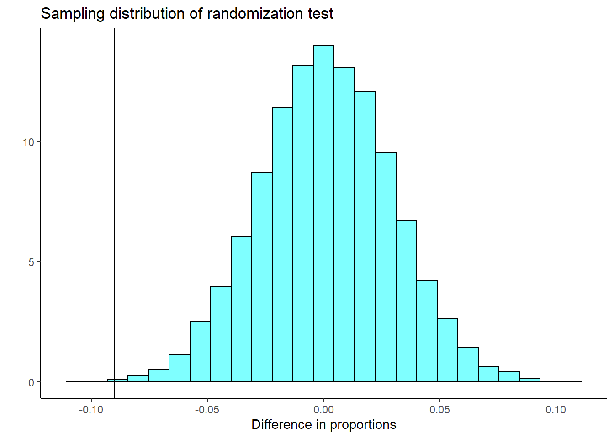
<p class="caption">(\#fig:dens222-fig)Sampling distribution of the difference in proportions.</p>
</div>

We next calculate the p-value. We will calculate it as if it were a one-sided test and then double the result to account for the fact that we would reject with a similar value in the opposite tail.  Note that the `prop1()` includes the observed value in the calculation of the p-value.  


```r
2*prop1(~(diffprop<=obs),data=results)
```

```
##  prop_TRUE 
## 0.00259974
```

Based on the data, if there were no difference between the treatment and control groups, the probability of the observed differences in proportion of strokes being - 0.09 or more extreme is 0.0026. This is too unlikely, so we reject that there is no difference between control and stroke groups.

### Hypothesis test for two proportions using normal model

We must check two conditions before applying the normal model to a generic test of $\hat{p}_1 - \hat{p}_2$. First, the sampling distribution for each sample proportion must be nearly normal, and secondly, the samples must be independent. Under these two conditions, the sampling distribution of $\hat{p}_1 - \hat{p}_2$ may be well approximated using the normal model.

The hypotheses are the same as above.

#### Conditions for the sampling distribution of $\hat{p}_1 - \hat{p}_2$ to be normal 

The difference $\hat{p}_1 - \hat{p}_2$ tends to follow a normal model when

a. each proportion separately follows a normal model, and  
b. the two samples are independent of each other  


#### Standard error 

For our research question the conditions must be verified. Because each group is a simple random sample from less than 10\% of the population, the observations are independent, both within the samples and between the samples. The success-failure condition also holds for each sample, at least 10 in each cell is the easiest way to think about it. Because all conditions are met, the normal model can be used for the point estimate of the difference in proportion of strokes

$$p_{control} - p_{trmt} = 0.05726872 - 0.14732143 = - 0.090$$
The standard error of the difference in sample proportions is
$$ SE_{\hat{p}_1 - \hat{p}_2}
	= \sqrt{SE_{\hat{p}_1}^2 + SE_{\hat{p}_2}^2}$$
$$	= \sqrt{\frac{p_1(1-p_1)}{n_1} + \frac{p_2(1-p_2)}{n_2}}$$
where $p_1$ and $p_2$ represent the population proportions, and $n_1$ and $n_2$ represent the sample sizes.

The calculation of the standard error for our problem must be done carefully. Remember in hypothesis testing, we assume the null hypothesis is true; this means the proportions of strokes must be the same. 

$$SE = \sqrt{\frac{p(1-p)}{n_{control}} + \frac{p(1-p)}{n_{trmt}}}$$
We don't know the stroke incidence rate, $p$, but we can obtain a good estimate of it by **pooling** the results of both samples:
$$\hat{p} = \frac{\text{# of successes}}{\text{# of cases}} = \frac{13 + 33}{451} = 0.102$$
This is called the *pooled estimate* of the sample proportion, and we use it to compute the standard error when the null hypothesis is that $p_{control} = p_{trmt}$. 

$$SE \approx \sqrt{\frac{\hat{p}(1-\hat{p})}{n_{control}} + \frac{\hat{p}(1-\hat{p})}{n_{trmt}}}$$


$$SE \approx \sqrt{\frac{0.102(1-0.102)}{227} + \frac{0.102(1-0.102)}{224}} = 0.0285$$

The test statistic is 
$$Z = \frac{\text{point estimate} - \text{null value}}{SE} = \frac{-.09 - 0}{0.0285} = - 3.16  $$  

The p-value is 


```r
2*pnorm(-3.16)
```

```
## [1] 0.001577691
```

Which is close to what we got with permutation test. This should not surprise us as the sampling distribution under the permutation test looked normal. 

Figure \@ref(fig:dens223-fig) plots the empirical sampling distribution from the permutation test again with a normal density curve overlayed.


```r
results %>%
  gf_dhistogram(~diffprop,fill="cyan",color="black") %>%
  gf_vline(xintercept =obs ) %>%
  gf_dist("norm",sd=0.0285,color="red") %>%
  gf_theme(theme_classic()) %>%
  gf_labs(title="Sampling distribution of randomization test",
          subtitle="Reference normal distribution in red",
          x="Difference in proportions")
```

<div class="figure">
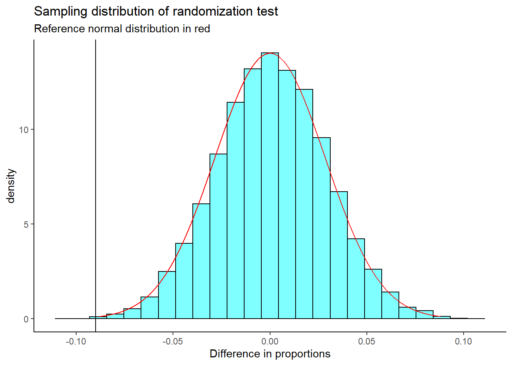
<p class="caption">(\#fig:dens223-fig)The sampling distribution of the randomization test with a normal distribution plotted in red.</p>
</div>

### Confidence interval for two proportions using normal model

The conditions for applying the normal model have already been verified, so we can proceed to the construction of the confidence interval. Remember the form of the confidence interval is

$$\text{point estimate} \ \pm\ z^{\star}SE$$ 

Our point estimate is -0.09. The standard error is different since we can't assume the proportion of strokes are equal. We will estimate the standard error from 

$$SE	= \sqrt{\frac{p_{control}(1-p_{control})}{n_{control}} + \frac{p_{trmt}(1-p_{trmt})}{n_{trmt}}}$$

$$SE \approx \sqrt{\frac{0.057(1-0.057)}{227} + \frac{0.15(1-0.15)}{224}} = 0.0284$$

It is close to the pooled value because of the nearly equal sample sizes.

The critical value is found from the normal quantile.


```r
qnorm(.975)
```

```
## [1] 1.959964
```

The 95% confidence interval is 

$$ - 0.09 \ \pm\ 1.96 \times  0.0284 \quad \to \quad (-0.146,- 0.034)$$
We are 95\% confident that the difference in proportions of strokes in the control and treatment groups is between -0.146 and -0.034. Since this does not include zero, we are confident they are different. This supports the hypothesis tests. This confidence interval is not an accurate method for smaller samples sizes. This is because the actual coverage rate, the percentage of intervals that contain the true population parameter, will not be the nominal coverage rate. This means it is not true that 95% of similarly constructed 95% confidence intervals will contain the true parameter.  This because the pooled estimate of the standard error is not accurate for small sample sizes. For the example above, the sample sizes are large and the performance of the method should be adequate.  

Of course, `R` has a built in function to calculate the hypothesis test and confidence interval for two proportions.


```r
prop_test(outcome30~group,data=stent)
```

```
## 
## 	2-sample test for equality of proportions with continuity correction
## 
## data:  tally(outcome30 ~ group)
## X-squared = 9.0233, df = 1, p-value = 0.002666
## alternative hypothesis: two.sided
## 95 percent confidence interval:
##  0.03022922 0.14987619
## sample estimates:
##    prop 1    prop 2 
## 0.9427313 0.8526786
```

The p-value is a little different from the one we calculated and closer to the randomization test, which is an approximation of the exact permutation test, because a correction factor was applied. Read online about this correction to learn more. We run the code below with the correction factor off and get the same p-value as we calculated above. The confidence interval is a little different because the function used *no stroke* as its success event, but since zero is not in the interval, we get the same conclusion.


```r
prop_test(outcome30~group,data=stent,correct=FALSE)
```

```
## 
## 	2-sample test for equality of proportions without continuity
## 	correction
## 
## data:  tally(outcome30 ~ group)
## X-squared = 9.9823, df = 1, p-value = 0.001581
## alternative hypothesis: two.sided
## 95 percent confidence interval:
##  0.03466401 0.14544140
## sample estimates:
##    prop 1    prop 2 
## 0.9427313 0.8526786
```

Essentially, confidence intervals and hypothesis tests serve similar purposes, but answer slightly different questions. A confidence interval gives you a range of feasible values of a parameter given a particular sample. A hypothesis test tells you whether a specific value is feasible given a sample. Sometimes you can informally conduct a hypothesis test simply by building an interval and observing whether the hypothesized value is contained in the interval. The disadvantage to this approach is that it does not yield a specific $p$-value. The disadvantage of the hypothesis test is that it does not give a range of values for the test statistic.

As with hypothesis tests, confidence intervals are imperfect. About 1-in-20 properly constructed 95\% confidence intervals will fail to capture the parameter of interest. This is a similar idea to our Type 1 error. 


## Changing the confidence level

Suppose we want to consider confidence intervals where the confidence level is somewhat higher than 95\%; perhaps we would like a confidence level of 99\%. Think back to the analogy about trying to catch a fish: if we want to be more sure that we will catch the fish, we should use a wider net. To create a 99\% confidence level, we must also widen our 95\% interval. On the other hand, if we want an interval with lower confidence, such as 90\%, we could make our original 95\% interval slightly slimmer.

The 95\% confidence interval structure provides guidance in how to make intervals with new confidence levels. Below is a general 95\% confidence interval for a point estimate that comes from a nearly normal distribution:

$$\text{point estimate}\ \pm\ 1.96\times SE $$

There are three components to this interval: the point estimate, "1.96", and the standard error. The choice of $1.96\times SE$, which is also called **margin of error**, was based on capturing 95\% of the data since the estimate is within 1.96 standard errors of the true value about 95\% of the time. The choice of 1.96 corresponds to a 95\% confidence level. 

>**Exercise**:
If $X$ is a normally distributed random variable, how often will $X$ be within 2.58 standard deviations of the mean?^[This is equivalent to asking how often a standard normal variable will be larger than -2.58 but less than 2.58. To determine this probability, look up -2.58 and 2.58 in `R` using `pnorm()` (0.0049 and 0.9951). Thus, there is a $0.9951-0.0049 \approx 0.99$ probability that the unobserved random variable $X$ will be within 2.58 standard deviations of the mean.]

To create a 99\% confidence interval, change 1.96 in the 95\% confidence interval formula to be $2.58$. 

The normal approximation is crucial to the precision of these confidence intervals. We will learn a method called the **bootstrap** that will allow us to find confidence intervals without the assumption of normality.

## Interpreting confidence intervals

A careful eye might have observed the somewhat awkward language used to describe confidence intervals. 

> Correct interpretation:  
We are XX\% confident that the population parameter is between...

**Incorrect** language might try to describe the confidence interval as capturing the population parameter with a certain probability. This is one of the most common errors: while it might be useful to think of it as a probability, the confidence level only quantifies how plausible it is that the parameter is in the interval.

Another especially important consideration of confidence intervals is that they **only try to capture the population parameter**. Our intervals say nothing about the confidence of capturing individual observations, a proportion of the observations, or about capturing point estimates. Confidence intervals only attempt to capture population parameters.


## Homework Problems

1. Chronic illness

In 2013, the Pew Research Foundation reported that "45\% of U.S. adults report that they live with one or more chronic conditions".^[http://pewinternet.org/Reports/2013/The-Diagnosis-Difference.aspx The Diagnosis Difference. November 26, 2013. Pew Research.] However, this value was based on a sample, so it may not be a perfect estimate for the population parameter of interest on its own. The study reported a standard error of about 1.2\%, and a normal model may reasonably be used in this setting. 

a. Create a 95\% confidence interval for the proportion of U.S. adults who live with one or more chronic conditions. Also interpret the confidence interval in the context of the study.  
b. Create a 99\% confidence interval for the proportion of U.S. adults who live with one or more chronic conditions. Also interpret the confidence interval in the context of the study.  
c. Identify each of the following statements as true or false. Provide an explanation to justify each of your answers.  

- We can say with certainty that the confidence interval from part a contains the true percentage of U.S. adults who suffer from a chronic illness.
- If we repeated this study 1,000 times and constructed a 95\% confidence interval for each study, then approximately 950 of those confidence intervals would contain the true fraction of U.S. adults who suffer from chronic illnesses.
- The poll provides statistically significant evidence (at the $\alpha = 0.05$ level) that the percentage of U.S. adults who suffer from chronic illnesses is not 50\%.
- Since the standard error is 1.2\%, only 1.2\% of people in the study communicated uncertainty about their answer.
- Suppose the researchers had formed a one-sided hypothesis, they believed that the true proportion is less than 50\%. We could find an equivalent one-sided 95\% confidence interval by taking the upper bound of our two-sided 95\% confidence interval.

\pagebreak 

2. Vegetarian college students 

Suppose that 8\% of college students are vegetarians. Determine if the following statements are true or false, and explain your reasoning.

a. The distribution of the sample proportions of vegetarians in random samples of size 60 is approximately normal since $n \ge 30$. 
b. The distribution of the sample proportions of vegetarian college students in random samples of size 50 is right skewed.
c. A random sample of 125 college students where 12\% are vegetarians would be considered unusual. 
d. A random sample of 250 college students where 12\% are vegetarians would be considered unusual.
e. The standard error would be reduced by one-half if we increased the sample size from 125 to~250.
f. A 99\% confidence will be wider than a 95\% because to have a higher confidence level requires a wider interval.


3. Orange tabbies 

Suppose that 90\% of orange tabby cats are male. Determine if the following statements are true or false, and explain your reasoning.  
a. The distribution of sample proportions of random samples of size 30 is left skewed.  
b. Using a sample size that is 4 times as large will reduce the standard error of the sample proportion by one-half.  
c. The distribution of sample proportions of random samples of size 140 is approximately normal.    
  

4. Working backwards 

A 90\% confidence interval for a population mean is (65,77). The population distribution is approximately normal and the population standard deviation is unknown. This confidence interval is based on a simple random sample of 25 observations. Calculate the sample mean, the margin of error, and the sample standard deviation.


5. Find the p-value 

An independent random sample is selected from an approximately normal population with an unknown standard deviation. Find the p-value for the given set of hypotheses and $T$ test statistic. Also determine if the null hypothesis would be rejected at $\alpha = 0.05$.

a. $H_{A}: \mu > \mu_{0}$, $n = 11$, $T = 1.91$  
b. $H_{A}: \mu < \mu_{0}$, $n = 17$, $T = - 3.45$  
c. $H_{A}: \mu \ne \mu_{0}$, $n = 7$, $T = 0.83$  
d. $H_{A}: \mu > \mu_{0}$, $n = 28$, $T = 2.13$  

 
\pagebreak 

6. Sleep habits of New Yorkers  

New York is known as "the city that never sleeps". A random sample of 25 New Yorkers were asked how much sleep they get per night. Statistical summaries of these data are shown below. Do these data provide strong evidence that New Yorkers sleep less than 8 hours a night on average?

$$
\begin{array}{ccccc} & & &\\ 
\hline
n 	& \bar{x}	& s		& min 	& max \\ 
 \hline
25 	& 7.73 		& 0.77 	& 6.17 	& 9.78 \\ 
  \hline
\end{array} 
$$


\begin{center}
\begin{tabular}{rrrrrr}
 \hline
n 	& $\bar{x}$	& s		& min 	& max \\ 
 \hline
25 	& 7.73 		& 0.77 	& 6.17 	& 9.78 \\ 
  \hline
\end{tabular}
\end{center}

a. Write the hypotheses in symbols and in words.  
b. Check conditions, then calculate the test statistic, $T$, and the associated degrees of freedom.  
c. Find and interpret the p-value in this context.   
d. What is the conclusion of the hypothesis test?  
e. Construct a 95\% confidence interval that corresponded to this hypothesis test, would you expect 8 hours to be in the interval?


7. Vegetarian college students II

From problem 2 part c, suppose that it has been reported that 8\% of college students are vegetarians. We think USAFA is not typical because of their fitness and health awareness, we think there are more vegetarians. We collect a random sample of 125 cadets and find 12\% claimed they are vegetarians. Is there enough evidence to claim that USAFA cadets are different?

a. Use `binom.test()` to conduct the hypothesis test and find a confidence interval.
b. Use `prop.test()` with `correct=FALSE` to conduct the hypothesis test and find a confidence interval.
c. Use `prop.test()` with `correct=TRUE` to conduct the hypothesis test and find a confidence interval.
d. Which test should you use?


<!--chapter:end:22-Confidence-Intervals.Rmd-->

# Bootstrap {#BOOT}


## Objectives

1) Use the bootstrap to estimate the standard error, the standard deviation, of the sample statistic.  
2) Using bootstrap methods, obtain and interpret a confidence interval for an unknown parameter, based on a random sample.   
3) Describe the advantages, disadvantages, and assumptions behind using bootstrapping for confidence intervals. 

## Confidence intervals

In the last chapter, we introduced the concept of confidence intervals. As a reminder, confidence intervals are used to describe uncertainty around an estimate of a parameter. A confidence interval can be interpreted as a range of feasible values for an unknown parameter, given a representative sample of the population. 

Recall the four general steps of building a confidence interval: 

1) Identify the parameter you would like to estimate. 

2) Identify a good estimate for that parameter. 

3) Determine the distribution of your estimate or a function of your estimate.  

4) Use this distribution to obtain a range of feasible values (confidence interval) for the parameter.  

We previously used the central limit theorem to determine the distribution of our estimate. This lesson, we will build *bootstrap distribution*s of sample estimates.

## Bootstrapping

In many contexts, the sampling distribution of a sample statistic is either unknown or subject to assumptions. For example, suppose we wanted to obtain a 95% confidence interval on the *median* of a population. The central limit theorem does not apply to the median; we don't know its distribution. 

The theory required to quantify the uncertainty of the sample median is complex. In an ideal world, we would sample data from the population again and recompute the median with this new sample. Then we could do it again. And again. And so on until we get enough median estimates that we have a good sense of the precision of our original estimate. This is an ideal world where sampling data is free or extremely cheap. That is rarely the case, which poses a challenge to this "resample from the population" approach.

However, we can sample from the sample. *Bootstrapping* allows us to simulate the sampling distribution by **resampling** from the sample. Suppose $x_1,x_2,...,x_n$ is an iid random sample from the population. First we define the empirical distribution function of $X$ by assigning an equal probability to each $x_i$. Then, we sample from this empirical probability mass function. In practice, this simply means sampling from your original sample *with replacement*. Thus we are treating our sample as a discrete uniform random variable. 

The general procedure for bootstrapping is to sample with replacement from your original sample, calculate and record the sample statistic for that bootstrapped sample, then repeat the process many times. The collection of sample statistics comprises a *bootstrap distribution* of the sample statistic. Generally, this procedure works quite well, provided that the sample is representative of the population. Otherwise, any bias or misrepresentation is simply amplified throughout the bootstrap process. Further, for very small sample sizes, bootstrap distributions become "choppy" and hard to interpret. Thus in small sample cases, we must use permutation or mathematical methods to determine the sampling distribution.   

Once you have completed the procedure, the bootstrap distribution can be used to build a confidence interval for the population parameter or estimate the standard error. We are not using the bootstrap to find p-values. 

## Bootstrap example

To help us understand the bootstrap, let's use an example of a single mean. We would like to estimate the mean height of students at a local college. We collect a sample of size 50 (stored in vector `heights` below). 

> **Exercise**
Using both a traditional method, via the CLT or the t-distribution, and the bootstrap method, find 95% confidence intervals for $\mu$. Compare the two intervals. 


```r
heights<-c(62.0,73.8,59.8,66.9,75.6,63.3,64.0,63.1,65.0,67.2,73.0,
     62.3,60.8,65.7,60.8,65.8,63.3,54.9,67.8,65.1,74.8,75.0,
     77.8,73.7,74.3,68.4,77.5,77.9,66.5,65.5,71.7,75.9,81.7,
     76.5,77.8,75.0,64.6,59.4,60.7,69.2,78.2,65.7,69.6,80.0,
     67.6,73.0,65.3,67.6,66.2,69.6)
```

Let's look at the data; Figures \@ref(fig:box231-fig) and \@ref(fig:dens231-fig).


```r
gf_boxplot(~heights) %>%
  gf_theme(theme_classic()) %>%
  gf_labs(y="Heights (in)")
```

<div class="figure">

<p class="caption">(\#fig:box231-fig)Boxplot of heights of local college students.</p>
</div>


```r
gf_density(~heights,fill="lightgrey",color="black") %>%
  gf_theme(theme_classic()) %>%
  gf_labs(x="Heights (in)",y="")
```

<div class="figure">

<p class="caption">(\#fig:dens231-fig)Density plot of heights of local college students.</p>
</div>

It looks bimodal since there are probably both men and women in this sample and thus we have two different population distributions of heights.


```r
favstats(~heights)
```

```
##   min   Q1 median     Q3  max   mean       sd  n missing
##  54.9 64.7   67.6 74.675 81.7 68.938 6.345588 50       0
```

### Using traditional mathematically methods    

The data comes from less that 10\% of the population so we feel good about the assumption of independence. However, the data is bimodal and clearly does not come from a normal distribution. The sample size is larger, so this may help us. We will use the t-distribution and compare with the answer from the CLT then compare with the bootstrap.


```r
confint(t_test(~heights))
```

```
##   mean of x   lower   upper level
## 1    68.938 67.1346 70.7414  0.95
```

We can also calculate by hand.


```r
## Using t
xbar<-mean(heights)
sd<-sd(heights)
n<-length(heights)
tval<-qt(0.975,n-1)
xbar+c(-1,1)*tval*sd/sqrt(n)
```

```
## [1] 67.1346 70.7414
```

If we want to use the `tidyverse`, we must convert to a `dataframe`.


```r
heights <- tibble(height=heights)
```


```r
head(heights)
```

```
## # A tibble: 6 x 1
##   height
##    <dbl>
## 1   62  
## 2   73.8
## 3   59.8
## 4   66.9
## 5   75.6
## 6   63.3
```


```r
heights %>%
  summarize(mean=mean(height),stand_dev=sd(height),n=n(),
            ci=mean+c(-1,1)*qt(0.975,n-1)*stand_dev/sqrt(n))
```

```
## # A tibble: 2 x 4
##    mean stand_dev     n    ci
##   <dbl>     <dbl> <int> <dbl>
## 1  68.9      6.35    50  67.1
## 2  68.9      6.35    50  70.7
```

Using the CLT we have 


```r
heights %>%
  summarize(mean=mean(height),stand_dev=sd(height),n=n(),
            ci=mean+c(-1,1)*qnorm(0.975)*stand_dev/sqrt(n))
```

```
## # A tibble: 2 x 4
##    mean stand_dev     n    ci
##   <dbl>     <dbl> <int> <dbl>
## 1  68.9      6.35    50  67.2
## 2  68.9      6.35    50  70.7
```

This is not much different from the results using the $t$ distribution.  

### Bootstrap

The idea behind the bootstrap is that we will get an estimate of the distribution of the statistic of interest by sampling the original data with replacement. We must sample under the same regime as the original data was collected. In `R`, we will use the `resample()` function from the **mosaic** package. There are entire packages dedicated to resampling such as **boot** and this is a great deal of information about these types of packages online.

When applied to a dataframe, the `resample()` function samples rows with replacement to produce a new data
frame with the same number of rows as the original, but some rows will be duplicated and others missing.

To illustrate, let's use `resample()` on the first 10 positive integers.


```r
set.seed(305)
resample(1:10)
```

```
##  [1] 8 7 8 1 4 4 2 2 6 9
```

Notice that 8, 4 and 2 appeared at least twice. The number 3 did not appear. This is a single bootstrap replicate of the data.

We then calculate a point estimate on the bootstrap replicate. We repeat this process a large number of times, 1000 or maybe even 10000. The collection of the point estimates is called the bootstrap distribution. For the sample mean, ideally, the bootstrap distribution should be unimodal, roughly symmetric, and centered at the original estimate.

Here we go with our problem.


```r
set.seed(2115)
boot_results<-do(1000)*mean(~height,data=resample(heights))
```

The first few rows of the results are:


```r
head(boot_results)
```

```
##     mean
## 1 68.390
## 2 68.048
## 3 67.732
## 4 68.534
## 5 70.980
## 6 68.424
```

The `do()` function by default gives the column name to the last function used, in this case *mean*. This is an unfortunate name as it can cause us some confusion.

Figure \@ref(fig:boot231-fig) is a plot of the bootstrap sampling distribution. 


```r
boot_results %>%
  gf_histogram(~mean,fill="cyan",color="black") %>%
  gf_vline(xintercept = 68.938) %>%
  gf_theme(theme_classic) %>%
  gf_labs(x="Sample mean")
```

<div class="figure">
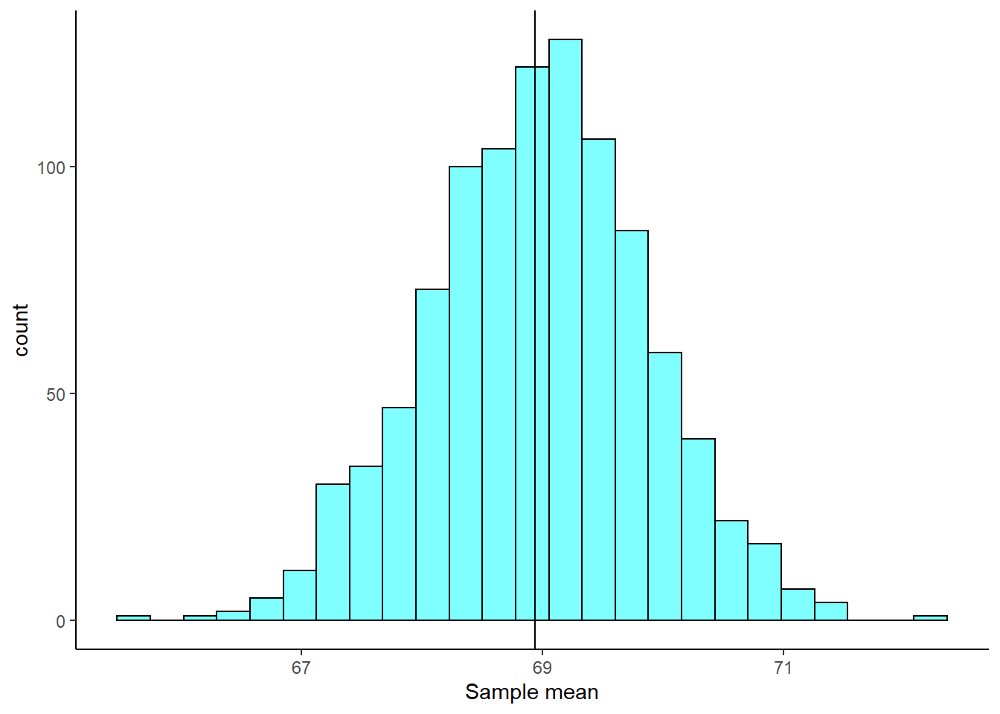
<p class="caption">(\#fig:boot231-fig)The sampling distribution approximated using a bootstrap distribution.</p>
</div>

And a summary of the bootstrap distribution:  


```r
favstats(~mean,data=boot_results)
```

```
##     min      Q1 median    Q3  max     mean        sd    n missing
##  65.684 68.3915 68.976 69.55 72.3 68.96724 0.9040555 1000       0
```

Now there are two ways we could go from here to calculate a confidence interval. The first is called the percentile method where we go into the bootstrap distribution and find the appropriate quantiles. The second is call the t interval with bootstrap error. In this second method you construct a confidence interval like you would using the CLT except you use the bootstrap estimate of standard error.

#### Bootstrap percentile

The function `cdata()` makes this easy for us.


```r
cdata(~mean,data=boot_results,p=0.95)
```

```
##        lower   upper central.p
## 2.5% 67.2197 70.7964      0.95
```
Or we can use the `qdata()`.


```r
qdata(~mean,data=boot_results,p=c(0.025,0.975))
```

```
##    2.5%   97.5% 
## 67.2197 70.7964
```
#### t interval with bootstrap standard error  

Since the bootstrap distribution looks like a $t$ distribution, we can use a $t$ interval with the bootstrap standard error. The standard deviation of the bootstrap distribution is the standard error of the sample mean. We will not have to divide by $\sqrt{n}$ since we are dealing with the distribution of the mean directly.


```r
xbar<-mean(boot_results$mean)
SE<-sd(boot_results$mean)
xbar+c(-1,1)*qt(.975,49)*SE
```

```
## [1] 67.15047 70.78401
```

You could of course use `tidyverse` but we must change the column name.


```r
boot_results %>%
  mutate(stat=mean) %>%
  summarise(mean=mean(stat),stand_dev=sd(stat),ci=mean+c(-1,1)*qt(0.975,49)*stand_dev)
```

```
##       mean stand_dev       ci
## 1 68.96724 0.9040555 67.15047
## 2 68.96724 0.9040555 70.78401
```

Of course there is a function to make this easier for us.


```r
confint(boot_results, method = c("percentile", "stderr"))
```

```
##   name    lower    upper level     method estimate margin.of.error df
## 1 mean 67.21970 70.79640  0.95 percentile   68.938              NA NA
## 2 mean 67.15047 70.78401  0.95     stderr   68.938        1.816768 49
```


The three intervals are very similar. 

## Non-standard sample statistics

One of the huge advantages of simulation-based methods is the ability to build confidence intervals for parameters whose estimates don't have known sampling distributions or the distributions are difficult to derive. 

### Example median

Consider the height data again, we would like to know the median student height and use a confidence interval for the estimate. However, we have no idea of the sampling distribution of the median. We can use bootstrapping to obtain an empirical distribution of the median.

>**Exercise**:  
Find a 90\% confidence interval for the median height of the students at a local college.


```r
set.seed(427)
boot_results<-do(10000)*median(~height,data=resample(heights))
```


```r
boot_results %>%
  gf_histogram(~median,fill="cyan",color="black") %>%
  gf_vline(xintercept = 67.6) %>%
  gf_theme(theme_classic) %>%
  gf_labs(x="Sample median")
```

<div class="figure">

<p class="caption">(\#fig:boot232-fig)The sampling distribution approximated using a bootstrap distribution.</p>
</div>

From Figure \@ref(fig:boot232-fig), the bootstrap sampling distribution is not symmetrical so we may not want to use the t interval approach. We will still calculate the confidence interval based on both approaches to compare the results. 


```r
cdata(~median,data=boot_results,p=0.90)
```

```
##    lower upper central.p
## 5%  65.8 70.65       0.9
```


```r
confint(boot_results, method = c("percentile", "stderr"),level=0.9)
```

```
##     name   lower   upper level     method estimate margin.of.error
## 1 median 65.8000 70.6500   0.9 percentile     67.6              NA
## 2 median 65.4648 70.1297   0.9     stderr     67.6        2.332455
```

There is a little difference between these two methods but not as large as we may have expected. 

### Summary bootstrap

The key idea behind the bootstrap is that we estimate the population with the sample, this is called the *plug in principle*, if something is unknown then substitute an estimate of it. We can then generate new samples from this population estimate. The bootstrap does not improve the accuracy of the original estimate, in fact the bootstrap distribution is centered on the original sample estimate. Instead we only get information about the variability of the sample estimate. Some people are suspicious that we are using the data over and over. But remember we are just getting estimates of variability. In traditional statistics, when we calculate the sample standard deviation, we are using sample mean. Thus we are using the data twice. Always think of the bootstrap as providing a way to find the variability in an estimate.


## Confidence interval for difference in means

To bring all the ideas we have learned so far in this block we will work an example of testing for a difference of two means. In our opinion, the easiest method to understand is the permutation test and the most difficult is the one based on the mathematical derivation, because of the assumptions necessary to get a mathematical solution for the sampling distribution.  We will also introduce how to use the bootstrap to get a confidence interval.

### Health evaluation and linkage of primary care

The HELP study was a clinical trial for adult inpatients recruited from a detoxification unit. Patients with no primary care physician were randomized to receive a multidisciplinary assessment and a brief motivational intervention or usual care, with the goal of linking them to primary medical care.

We are interested if there is a difference between male and female ages.


```r
data("HELPrct")
```


```r
HELP_sub <- HELPrct %>%
  select(age,sex)
```


```r
favstats(age~sex,data=HELP_sub)
```

```
##      sex min Q1 median   Q3 max     mean       sd   n missing
## 1 female  21 31     35 40.5  58 36.25234 7.584858 107       0
## 2   male  19 30     35 40.0  60 35.46821 7.750110 346       0
```


```r
HELP_sub %>%
  gf_boxplot(age~sex) %>%
  gf_theme(theme_classic()) %>%
  gf_labs(x="Gender",y="Age (years)")
```

<div class="figure">

<p class="caption">(\#fig:box232-fig)The distribution of age in the HELP study by gender.</p>
</div>


```r
HELP_sub %>%
  gf_dhistogram(~age|sex,fill="cyan",color="black") %>%
  gf_theme(theme_classic()) %>%
  gf_labs(x="Age",y="")
```

<div class="figure">

<p class="caption">(\#fig:hist232-fig)The distribution of age in the HELP study by gender.</p>
</div>


Figures \@ref(fig:box232-fig) and \@ref(fig:hist232-fig) indicate there might be a slight difference in the means, but is it statistically significant?

### Permutation test

The permutation test is ideally suited for a hypothesis test. So we will conduct this first and then see if we can generate a confidence interval.

The hypotheses are: 

$H_0$: There is no difference in average age for men and women in the detoxification unit. In statistical notation: $\mu_{male} - \mu_{female} = 0$, where $\mu_{female}$ represents female inpatients and $\mu_{male}$ represents the male inpatients.  
$H_A$: There is some difference in average age for men and women in the detoxification unit ($\mu_{male} - \mu_{female} \neq 0$).

Let's perform a randomization, permutation, test.


```r
favstats(age~sex,data=HELP_sub)
```

```
##      sex min Q1 median   Q3 max     mean       sd   n missing
## 1 female  21 31     35 40.5  58 36.25234 7.584858 107       0
## 2   male  19 30     35 40.0  60 35.46821 7.750110 346       0
```


```r
obs_stat<-diffmean(age~sex,data=HELP_sub)
obs_stat
```

```
##   diffmean 
## -0.7841284
```


```r
set.seed(345)
results <- do(10000)*diffmean(age~shuffle(sex),data=HELP_sub)
```


```r
favstats(~diffmean,data=results)
```

```
##        min         Q1     median     Q3      max        mean        sd     n
##  -3.378154 -0.5638809 0.01120955 0.5863 3.486224 0.009350908 0.8492454 10000
##  missing
##        0
```

The sampling distribution is centered on the null value of 0, more or less, and the standard deviation is 0.849. This is an estimate of the variability of the difference in mean ages.


```r
results %>%
  gf_histogram(~diffmean,color="black",fill="cyan") %>%
  gf_vline(xintercept=obs_stat,color="red") %>%
  gf_theme(theme_classic()) %>%
  gf_labs(x="Difference of means",title="Sampling distribution of difference of two means",
  subtitle="Null assumes equal means")
```

<div class="figure">

<p class="caption">(\#fig:hist233-fig)The approximate sampling distribution of the difference of means from a bootstrap process.</p>
</div>

Our test statistic does not appear to be too extreme, Figure \@ref(fig:hist233-fig).


```r
2*prop1(~(diffmean <= obs_stat),data=results)
```

```
## prop_TRUE 
## 0.3523648
```

Based on this p-value, we would fail to reject the null hypothesis.

Now to construct a confidence interval we have to be careful and think about this. The object `results` has the distribution of difference in means assuming there is no difference. To get a confidence interval, we want to center this difference on the observed difference in means and not on zero.


```r
cdata(~(diffmean+obs_stat),data=results)
```

```
##          lower     upper central.p
## 2.5% -2.449246 0.8789368      0.95
```

We are 95% confident that the true difference in mean ages between female and male participants in the study is between -2.45 and 0.88. Since 0 in in the confidence interval, we would fail to reject the null hypothesis.

We are assuming that the test statistic can be transformed. It turns out that the percentile method is transformation invariant so we can do the transform of shifting the null distribution by the observed value.

### Traditional mathematical methods  

Using the CLT or the $t$ distribution becomes difficult because we have to find a way to calculate the standard error. There have been many proposed methods, you are welcome to research them, but we will only present a couple of ideas in this section. Let's summarize the process for both hypothesis testing and confidence intervals in the case of the difference of two means using the $t$ distribution.

### Hypothesis tests 

When applying the $t$ distribution for a hypothesis test, we proceed as follows:  
1. Write appropriate hypotheses.  
2. Verify conditions for using the $t$ distribution.   
 For a difference of means when the data are not paired: each sample mean must separately satisfy the one-sample conditions for the $t$ distribution, and the data in each group must also be independent. Just like in the one-sample case, slight skewness will not be a problem for larger sample sizes. We can have moderate skewness and be fine if our sample is 30 or more. We can have extreme skewness if our sample is 60 or more.  
3. Compute the point estimate of interest, the standard error, and the degrees of freedom.  
4. Compute the T score and p-value.   
5. Make a conclusion based on the p-value, and write a conclusion in context and in plain language so anyone can understand the result.  

We added the extra step of checking the assumptions.

### Confidence intervals  

Similarly, the following is how we generally computed a confidence interval using a $t$ distribution:  
1. Verify conditions for using the $t$ distribution. (See above.)   
2. Compute the point estimate of interest, the standard error, the degrees of freedom, and $t^{\star}_{df}$.   
3. Calculate the confidence interval using the general formula, point estimate $\pm\ t_{df}^{\star} SE$.   
4. Put the conclusions in context and in plain language so even non-statisticians can understand the results.  

If the assumptions above are met, each sample mean can itself be modeled using a $t$ distribution and if the samples are independent, then the sample difference of two means, $\bar{x}_1 - \bar{x}_2$, can be modeled using the $t$ distribution and the standard error
$$SE_{\bar{x}_{1} - \bar{x}_{2}} = \sqrt{\frac{s_1^2}{n_1} + \frac{s_2^2}{n_2}}$$

To calculate the degrees of freedom, use statistical software or conservatively use the smaller of $n_1 - 1$ and $n_2 - 1$.

#### Results  

Back to our study, the men and women were independent of each other. Additionally, the distributions in each population don't show any clear deviations from normality, some slight skewness but the sample size reduces this concern, Figure \@ref(fig:qq231-fig). Finally, within each group we also need independence. If they represent less that 10\% of the population, we are good to go on this. This condition might be difficult to verify.


```r
HELP_sub %>%
  gf_qq(~age|sex) %>%
  gf_qqline(~age|sex) %>%
  gf_theme(theme_bw())
```

<div class="figure">

<p class="caption">(\#fig:qq231-fig)The quantile-quantile plots to check normality assumption.</p>
</div>

The distribution of males tends to have longer tails than a normal and the female distribution is skewed to the right. The sample sizes are large enough that this does not worry us.


```r
favstats(age~sex,data=HELP_sub)
```

```
##      sex min Q1 median   Q3 max     mean       sd   n missing
## 1 female  21 31     35 40.5  58 36.25234 7.584858 107       0
## 2   male  19 30     35 40.0  60 35.46821 7.750110 346       0
```


Let's find the confidence interval first. 


```r
(35.47-36.25)+c(-1,1)*qt(.975,106)*sqrt(7.58^2/107+7.75^2/346)
```

```
## [1] -2.4512328  0.8912328
```

This result is very close to what we got with the permutation test.

Now let's find the p-value for the hypothesis test.

The test statistic is: 
$$T = \frac{\text{point estimate} - \text{null value}}{SE}$$ 

$$ = \frac{(35.47 - 36.25) - 0}{\sqrt{\left( \frac{7.58^2}{107}+ \frac{7.75^2}{346}\right)}} = - 0.92976 $$
We use the smaller of $n_1-1$ and $n_2-1$ as the degrees of freedom: $df=106$. 

The p-value is:


```r
2*pt(-0.92976,106)
```

```
## [1] 0.3546079
```

Of course, there is a function that does this for us.


```r
t_test(age~sex,data=HELP_sub)
```

```
## 
## 	Welch Two Sample t-test
## 
## data:  age by sex
## t = 0.92976, df = 179.74, p-value = 0.3537
## alternative hypothesis: true difference in means between group female and group male is not equal to 0
## 95 percent confidence interval:
##  -0.8800365  2.4482932
## sample estimates:
## mean in group female   mean in group male 
##             36.25234             35.46821
```

Notice that the degrees of freedom are not an integer, this is because it is a weighted average of the two different samples sizes and standard deviations. This method is called the Satterwaite approximation. 

#### Pooled standard deviation

Occasionally, two populations will have standard deviations that are so similar that they can be treated as identical. This is an assumption of equal variance in each group. For example, historical data or a well-understood biological mechanism may justify this strong assumption. In such cases, we can make the $t$ distribution approach slightly more precise by using a pooled standard deviation.

The **pooled standard deviation** of two groups is a way to use data from both samples to better estimate the standard deviation and standard error. If $s_1^{}$ and $s_2^{}$ are the standard deviations of groups 1 and 2 and there are good reasons to believe that the population standard deviations are equal, then we can obtain an improved estimate of the group variances by pooling their data:

$$ s_{pooled}^2 = \frac{s_1^2\times (n_1-1) + s_2^2\times (n_2-1)}{n_1 + n_2 - 2}$$

where $n_1$ and $n_2$ are the sample sizes, as before. To use this new statistic, we substitute $s_{pooled}^2$ in place of $s_1^2$ and $s_2^2$ in the standard error formula, and we use an updated formula for the degrees of freedom:
$$df = n_1 + n_2 - 2$$

The benefits of pooling the standard deviation are realized through obtaining a better estimate of the standard deviation for each group and using a larger degrees of freedom parameter for the $t$ distribution. Both of these changes may permit a more accurate model of the sampling distribution of $\bar{x}_1 - \bar{x}_2$.

> **Caution**  
Pooling standard deviations should be done only after careful research  

A pooled standard deviation is only appropriate when background research indicates the population standard deviations are nearly equal. When the sample size is large and the condition may be adequately checked with data, the benefits of pooling the standard deviations greatly diminishes.

In `R` we can before the difference of two means with equal variance using `var.equal`.


```r
t_test(age~sex,data=HELP_sub,var.equal=TRUE)
```

```
## 
## 	Two Sample t-test
## 
## data:  age by sex
## t = 0.91923, df = 451, p-value = 0.3585
## alternative hypothesis: true difference in means between group female and group male is not equal to 0
## 95 percent confidence interval:
##  -0.8922735  2.4605303
## sample estimates:
## mean in group female   mean in group male 
##             36.25234             35.46821
```

Since our sample sizes were so large, this did not have a big impact on the results. 

### Bootstrap  

Finally, we will construct a confidence interval through the use of the bootstrap distribution. In this problem we have to be careful and sample within each group. Compare the following two sets of samples. 


```r
favstats(age ~ sex, data = resample(HELP_sub))
```

```
##      sex min Q1 median    Q3 max     mean       sd   n missing
## 1 female  21 30     33 38.75  50 34.64706 6.267387 102       0
## 2   male  19 29     33 39.00  59 34.74359 7.833066 351       0
```
 
and
 

```r
favstats(age ~ sex, data = resample(HELP_sub,groups=sex))
```

```
##      sex min Q1 median   Q3 max     mean       sd   n missing
## 1 female  22 31     34 39.5  57 35.60748 6.901951 107       0
## 2   male  20 31     35 41.0  60 35.94798 8.039227 346       0
```
 
Notice in the second line of code, we are keeping the samples the same size within the `sex` variable.

Let's get our bootstrap distribution.


```r
set.seed(2527)
results <- do(1000) * diffmean(age ~ sex, data = resample(HELP_sub, groups = sex))
```

Figure \@ref(fig:boot235-fig) is our sampling distribution from the bootstrap.


```r
results %>%
  gf_histogram(~diffmean,fill="cyan",color="black") %>%
  gf_theme(theme_classic) %>%
  gf_labs(x="Difference in means",y="")
```

<div class="figure">

<p class="caption">(\#fig:boot235-fig)Sampling distribution of the difference in means.</p>
</div>


```r
cdata( ~ diffmean, p = 0.95, data = results)
```

```
##          lower     upper central.p
## 2.5% -2.394406 0.8563786      0.95
```

Again, similar results.


## Frequently asked questions

1. There are more types of bootstrap techniques, right?  

Yes! There are many excellent bootstrap techniques. We have only chosen to present two bootstrap techniques that could be explained in a single lesson and that are also reasonably reliable. There are many adjustments that can be made to speed up and improve accuracy. Packages such as **resample** and **boot** are more appropriate for these situations.


2. I've heard the percentile bootstrap is very robust.  

It is a **commonly** held belief that the percentile bootstrap is a robust bootstrap method. That is false. The percentile method is one of the least reliable bootstrap methods. However, it is easy to use and understand and can give a first attempt at a solution before more accurate methods are used.

3. I should use 1000 replicates in my bootstrap and permutation tests.  

The  randomization and bootstrap distributions involve a random component from the sampling process and thus p-values and confidence intervals computed from the same data will vary. The amount of this **Monte Carlo** variability depends on the number of replicates used to create the randomization or bootstrap distribution. It is important that we not use too few as this will introduce too much random noise into p-value and confidence interval calculations. But each replicate costs time, and the marginal gain for each additional replicate decreases as the number of replicates increases. There is little reason to use millions of replicates (unless the goal is to estimate
very small p-values). We generally use roughly 1000 for routine or preliminary work and increase this to 10,000
when we want to reduce the effects of Monte Carlo variability.


## Homework Problems

1. Poker  
An aspiring poker player recorded her winnings and losses over 50 evenings of play, the data is in the `data` folder in the file `poker.csv`. The poker player would like to better understand the volatility in her long term play.

a. Load the data and plot a histogram.  
b. Find the summary statistics.  
c.  *Mean absolute deviation* or *MAD* is a more intuitive measure of spread than variance. It directly measures the average distance from the mean. It is found by the formula:
$$mad = \sum_{i=1}^{n}\frac{\left| x_{i} - \bar{x} \right|}{n}$$
Write a function and find the *MAD* of the data.  
d. Find the bootstrap distribution of the *MAD* using 1000 replicates.  
e. Plot a histogram of the bootstrap distribution.  
f. Report a 95% confidence interval on the MAD.  
g. ADVANCED: Do you think sample MAD is an unbiased estimator of population MAD? Why or why not?   

2. Bootstrap hypothesis testing  

Bootstrap hypothesis testing is relatively undeveloped, and is generally not as accurate as permutation testing. Therefore in general avoid it. But for our problem in the reading above, it may work. We will sample in a way that is consistent with the null hypothesis, then calculate a p-value as a tail probability like we do in permutation tests. This example does not generalize well to other applications like relative risk, correlation, regression, or categorical data.

a. Using the `HELPrct` data, the null hypothesis requires the means of each group to be equal. Pick one group to adjust, either `male` or `female`. First zero the mean of the selected group by subtracting the sample mean of this group from data points only in this group. Then add the sample mean of the other group to each data point in the selected group. Store in a new object called `HELP_null`. set, store the observed value of the difference of means for male and female.
b. The null hypothesis requires the means of each group to be equal. Pick one group to adjust, either `male` or `female`. First zero the mean of the selected group by subtracting the sample mean of this group from data points only in this group. Then add the sample mean of the other group to each data point in the selected group. Store in a new object called `HELP_null`.  
c. Run `favstats()` to check that the means are equal.  
d. On this new adjusted data set, generate a bootstrap distribution of the difference in sample means.  
e. Plot the bootstrap distribution and a line at the observed difference in sample means.  
f. Find a p-value.  
g. How does the p-value compare with those in the reading.

3. Paired data  

Are textbooks actually cheaper online? Here we compare the price of textbooks at the University of California, Los Angeles' (UCLA's) bookstore and prices at Amazon.com. Seventy-three UCLA courses were randomly sampled in Spring 2010, representing less than 10\% of all UCLA courses. When a class had multiple books, only the most expensive text was considered.

The data is in the file `textbooks.csv` under the data folder.

Each textbook has two corresponding prices in the data set: one for the UCLA bookstore and one for Amazon. Therefore, each textbook price from the UCLA bookstore has a natural correspondence with a textbook price from Amazon. When two sets of observations have this special correspondence, they are said to be **paired**.

To analyze paired data, it is often useful to look at the difference in outcomes of each pair of observations. In  `textbooks`, we look at the difference in prices, which is represented as the `diff` variable. It is important that we always subtract using a consistent order; here Amazon prices are always subtracted from UCLA prices. 

a. Is this data tidy? Explain.  
b. Make a scatterplot of the UCLA price versus the Amazon price. Add a 45 degree line to the plot.  
c. Make a histogram of the differences in price.   

The hypotheses are:  
$H_0$: $\mu_{diff}=0$. There is no difference in the average textbook price.  
$H_A$: $\mu_{diff} \neq 0$. There is a difference in average prices.
 
d. To use a $t$ distribution, the variable `diff` has to independent and normally distributed. Since the 73 books represent less than 10\% of the population, the assumption that the random sample is independent is reasonable. Check normality using `qqnorsim()` from the **openintro** package. It generates 8 qq plots of simulated normal data that you can use to judge the `diff` variable.  
e. Run a $t$ test on the `diff` variable. Report the p-value and conclusion.  
f. Create a bootstrap distribution and generate a 95\% confidence interval on the mean of the differences, the `diff` column.  
g. If there is really no differences between book sources, the variable `more` is a binomial and under the null the probably of success is $\pi = 0.5$. Run a hypothesis test using the variable `more`.  
h. Could you use a permutation test on this example? Explain.  

<!--chapter:end:23-Bootstrap.Rmd-->

# Additional Hypothesis Tests {#ADDTESTS}

## Objectives

1) Conduct and interpret a hypothesis test for equality of two or more means using both permutation and the $F$ distribution.   
2) Conduct and interpret a goodness of fit test using both Pearson's chi-squared and randomization to evaluate the independence between two categorical variables.   
3) Conduct and interpret a hypothesis test for the equality of two variances.   
4) Know and check assumptions for the tests in the reading.

## Introduction

The purpose of this chapter is to put all we learned in this block into perspective and then to also add a couple of new tests to demonstrate other statistical tests.

Remember that we have been using data to answer research questions. So far we can do this with hypothesis tests or confidence intervals. There is a close link between these two methods. The key ideas have been to generate a single number metric to use in answering our research question and then to obtain the sampling distribution of this metric. 

In obtaining the sampling distribution we used randomization as an approximation to permutation exact tests, probability models, mathematical models, and the bootstrap. Each of these had different assumptions and different areas where they could be applied. In some cases, several methods can be applied to the problem to get a sense of the robustness to the different assumptions. For example, if you run a randomization test and a test using the CLT and they both give you similar results, you can feel better about your decision.

Finding a single number metric to answer our research question can be difficult. For example, in the homework for last chapter, we wanted to determine if the prices of books at a campus bookstore were different from Amazon's prices. The metric we decided to use was the mean of the differences in prices. But is this the best way to answer the question? This metric has been used historically because of the need to use the $t$ distribution. However, there are other ways in which the prices of books can differ. Jack Welch was the CEO of GE for years and he made the claim that customers don't care about average but they do care about variability. The average temperature setting of your GE refrigerator could be off and you would adapt. However if the temperature had great variability, then you would be upset. So maybe metrics that incorporate variability might be good. In our bootstrap notes, we looked at the ages of males and females in the HELP study. In using a randomization permutation test, we assumed there was no difference in the distribution of ages between males and females. However, in the alternative we measured the difference in the distributions using only means. The means of these two populations could be equal but the distributions differ in other ways, for example variability. We could conduct a separate test for variances but we have to be careful about multiple comparisons because in that case the Type 1 error is inflated.

We also learned that the use of the information in the data impacts the power of the test. In the golf ball example, when we used range as our metric, we did not have the same power as looking at the differences from expected values under the null hypothesis. There is some mathematical theory that leads to better estimators, they are called likelihood ratio tests, but this is beyond the scope of the book. What you can do is create a simulation where you simulate data from the alternative hypothesis and then measure the power. This will give you a sense of the quality of your metric. We only briefly looked at measuring power an earlier chapter and will not go further into this idea in this chapter.  

We will finish this block by examining problems with two variables. In the first case they will both be categorical but at least one of the categorical variables has more than two levels. In the second case, we will examine two variables where one is numeric and the other categorical. The categorical variable has more than two levels.

## Categorical data

It is worth spending some time on common approaches to categorical data that you may come across. We have already dealt with categorical data to some extent in this course. We have performed hypothesis tests and built confidence intervals for $\pi$, the population proportion of "success" in binary cases (for example, support for a local measure in a vote). This problem had a single variable. Also, the golf ball example involved counts of four types of golf ball. This is considered categorical data because each observation is characterized by a qualitative value (number on the ball). The data are summarized by counting how many balls in a sample belong to each type. This again was a single variable. 

In another scenario, suppose we are presented with two qualitative variables and would like to know if they are independent. For example, we have discussed methods for determining whether a coin could be fair. What if we wanted to know whether flipping the coin during the day or night changes the fairness of the coin? In this case, we have two categorical variables with two levels each: result of coin flip (heads vs tails) and time of day (day vs night). We have solved this type of problem by looking at a difference in probabilities of success using randomization and mathematically derived solutions, CLT. We also used a hypergeometric distribution to obtain an exact p-value. 

We will next explore a scenario that involves categorical data with two variables but where at least one variable has more than two levels. However, note that we are only merely scratching the surface in our studies. You could take an entire course on statistical methods for categorical data. This book is giving you a solid foundation to learn more advanced methods. 

### HELP example  

Let’s return to Health Evaluation and Linkage to Primary Care data set, `HELPrct` in the **mosaicData** package. Previously, we looked at the differences in ages between males and females, let's now do the same thing for the variable `substance`, the primary substance of abuse. 

There are three substances: alcohol, cocaine, and heroin. We’d like to know if there is evidence that the proportions of use differ for men and for women. In our data set, we observe modest differences.


```r
tally( substance ~ sex, data = HELPrct,
format="prop", margins = TRUE)
```

```
##          sex
## substance    female      male
##   alcohol 0.3364486 0.4075145
##   cocaine 0.3831776 0.3208092
##   heroin  0.2803738 0.2716763
##   Total   1.0000000 1.0000000
```

But we need a test statistic to test if there is a difference in substance of abuse between males and females.

### Test statistic  

To help us develop and understand a test statistic, let's simplify and use a simple theoretical example. 

Suppose we have a 2 x 2 contingency table like the one below. 
$$
\begin{array}{lcc}
 & \mbox{Response 1} & \mbox{Response 2} \\
 \mbox{Group 1} & n_{11} & n_{12} \\
 \mbox{Group 2} & n_{21} & n_{22} 
\end{array}
$$

If our null hypothesis is that the two variables are independent, a classical test statistic used is the Pearson chi-squared test statistic ($X^2$). This is similar to the one we used in our golf ball example. Let $e_{ij}$ be the expected count in the $i$th row and $j$th column under the null hypothesis, then the test statistic is: 
$$
X^2=\sum_{i=1}^2 \sum_{j=1}^2 {(n_{ij}-e_{ij})^2\over e_{ij}}
$$

But how do we find $e_{ij}$? What do we expect the count to be under $H_0$? To find this, we recognize that under $H_0$ (independence), a joint probability is equal to the product of the marginal probabilities. Let $\pi_{ij}$ be the probability of an outcome appearing in row $i$ and column $j$. In the absence of any other information, our best guess at $\pi_{ij}$ is $\hat{\pi}_{ij}={n_{ij}\over n}$, where $n$ is the total sample size. But under the null hypothesis we have the assumption of independence, thus $\pi_{ij}=\pi_{i+}\pi_{+j}$ where $\pi_{i+}$ represents the total probability of ending up in row $i$ and $\pi_{+j}$ represents the total probability of ending up in column $j$. Note that $\pi_{i+}$ is estimated by $\hat{\pi}_{i+}$ and 
$$
\hat{\pi}_{i+}={n_{i+}\over n}
$$
Thus for our simple 2 x 2 example, we have: 

$$
\hat{\pi}_{i+}={n_{i+}\over n}={n_{i1}+n_{i2}\over n}
$$

And for Group 1 we would have:

$$
\hat{\pi}_{1+}={n_{1+}\over n}={n_{11}+n_{12}\over n}
$$

So, under $H_0$, our best guess for $\pi_{ij}$ is:
$$
\hat{\pi}_{ij}=\hat{\pi}_{i+}\hat{\pi}_{+j}={n_{i+}\over n}{n_{+j}\over n} = {n_{i1}+n_{i2}\over n}{n_{1j}+n_{2j}\over n}
$$

Continuing, under $H_0$ the expected cell count is: 

$$
e_{ij}=n\hat{\pi}_{ij}=n{n_{i+}\over n}{n_{+j}\over n}={n_{i+}n_{+j}\over n}
$$

This may look too abstract, so let's break it down with an example, totally made up by the way.

Suppose we flip a coin 40 times during the day and 40 times at night and obtain the results below. 
$$
\begin{array}{lcc}
 & \mbox{Heads} & \mbox{Tails} \\
 \mbox{Day} & 22 & 18 \\
 \mbox{Night} & 17 & 23 
\end{array}
$$

To find the Pearson chi-squared ($X^2$), we need to figure out the expected value under $H_0$. Recall that under $H_0$ the two variables are independent. It's helpful to add the row and column totals prior to finding expected counts: 

$$
\begin{array}{lccc}
 & \mbox{Heads} & \mbox{Tails} & \mbox{Row Total}\\
 \mbox{Day} & 22 & 18  & 40\\
 \mbox{Night} & 17 & 23 & 40 \\
 \mbox{Column Total} & 39 & 41 & 80
\end{array}
$$

Thus under independence, expected count is equal to the row sum multiplied by the column sum divided by the overall sum. So, 

$$
e_{11} = {40*39\over 80}= 19.5
$$

Continuing in this fashion yields the following table of expected counts: 

$$
\begin{array}{lcc}
 & \mbox{Heads} & \mbox{Tails} \\
 \mbox{Day} & 19.5 & 20.5 \\
 \mbox{Night} & 19.5 & 20.5 
\end{array}
$$

Now we can find $X^2$: 
$$
X^2= {(22-19.5)^2\over 19.5}+{(17-19.5)^2\over 19.5}+{(18-20.5)^2\over 20.5}+{(23-20.5)^2\over 20.5} 
$$

As you can probably tell, $X^2$ is essentially comparing the observed counts with the expected counts under $H_0$. The larger the difference between observed and expected, the larger the value of $X^2$. It is normalized by dividing by the expected counts since more data in a cell leads to a larger contribution to the sum. Under $H_0$, this statistic follows the chi-squared distribution with $(R-1)(C-1)$, in this case 1, degrees of freedom ($R$ is the number of rows and $C$ is the number of columns). 

#### p-value

To find the Pearson chi-squared statistic ($X^2$) and corresponding p-value from the chi-squared distribution in `R` use the following code: 


```r
e<-c(19.5,19.5,20.5,20.5)
o<-c(22,17,18,23)
x2<-sum(((o-e)^2)/e)

x2
```

```
## [1] 1.250782
```


```r
1-pchisq(x2,1)
```

```
## [1] 0.2634032
```

Note that the chi-squared test statistic is a sum of squared differences. Thus its distribution, a chi-squared, is skewed right and bounded on the left at zero. A departure from the null hypothesis means a value further in the right tail of the distribution. This is why we use one minus the CDF in the calculation of the p-value.

Again, the $p$-value suggests there is not enough evidence to say these two variables are dependent.

Of course there is a built in function in `R` that will make the calculations easier. It is `chisq.test()`.


```r
coin <- tibble(time = c(rep("Day",40),rep("Night",40)),
               result = c(rep(c("Heads","Tails"),c(22,18)),rep(c("Heads","Tails"),c(17,23))))
```


```r
tally(~time+result,data=coin)
```

```
##        result
## time    Heads Tails
##   Day      22    18
##   Night    17    23
```


```r
chisq.test(tally(~time+result,data=coin),correct = FALSE)
```

```
## 
## 	Pearson's Chi-squared test
## 
## data:  tally(~time + result, data = coin)
## X-squared = 1.2508, df = 1, p-value = 0.2634
```

If you just want the test statistic, which we will for permutation tests, then use:


```r
chisq(~time+result,data=coin)
```

```
## X.squared 
##  1.250782
```

### Extension to larger tables

The advantage of using the Pearson chi-squared is that it can be extended to larger **contingency tables**, the name given to these tables of multiple categorical variables. Suppose we are comparing two categorical variables, one with $r$ levels and the other with $c$ levels. Then,
$$
X^2=\sum_{i=1}^r \sum_{j=1}^c {(n_{ij}-e_{ij})^2\over e_{ij}}
$$

Under the null hypothesis of independence, the $X^2$ test statistic follows the chi-squared distribution with $(r-1)(c-1)$ degrees of freedom. 

#### Assumptions

Note that to use this test statistic, the expected cell counts must be reasonably large. In fact, no $e_{ij}$ should be less than 1 and no more than 20% of the $e_{ij}$'s should be less than 5. If this occurs, you should combine cells or look for a different test. 

### Permutation test

We will complete our analysis of the HELP data first using a randomization, approximate permutation, test.

First let's write the hypotheses:

$H_0$: The variables sex and substance are independent.  
$H_a$: The variables sex and substance are dependent.  

We will use the chi-squared test statistic as our test statistic. We could use a different test statistic such as using the absolute value function instead of the square function but then we would need to write a custom function.

First, let's get the observed value for the test statistic:


```r
obs <- chisq(substance~sex,data=HELPrct)
obs
```

```
## X.squared 
##  2.026361
```

Next we will use a permutation randomization process to find the sampling distribution of our test statistics.


```r
set.seed(2720)
results <- do(1000)*chisq(substance~shuffle(sex),data=HELPrct)
```

Figure \@ref(fig:hist241-fig) is a visual summary of the results which helps us to gain some intuition about the p-value. We also plot the theoretical chi-squared distribution as a dark blue overlay.


```r
results %>%
  gf_dhistogram(~X.squared,fill="cyan",color="black") %>%
  gf_vline(xintercept = obs,color="red") %>%
  gf_theme(theme_classic()) %>%
  gf_dist("chisq",df=2,color="darkblue") %>%
  gf_labs(title="Sampling distribution of chi-squared test statistic",
          subtitle="For the variables sex and substance in the HELPrct data set",
          x="Test statistic")
```

<div class="figure">

<p class="caption">(\#fig:hist241-fig)Sampling distribution of chi-squared statistic from randomization test.</p>
</div>

We find the p-value using `prop1()`.


```r
prop1((~X.squared>=obs),data=results)
```

```
## prop_TRUE 
## 0.3536464
```

We don't double this value because the chi-squared is a one sided test due to the fact that we squared the differences.

Based on this p-value, we fail to reject the hypothesis that the variables are independent.

### Chi-squared test

We will jump straight to using the function `chisq.test()`.


```r
chisq.test(tally(substance~sex,data=HELPrct))
```

```
## 
## 	Pearson's Chi-squared test
## 
## data:  tally(substance ~ sex, data = HELPrct)
## X-squared = 2.0264, df = 2, p-value = 0.3631
```

We get a p-value very close to the one from the randomization permutation test. Remember in the randomization test we shuffled the variable `sex` over many replications and calculated a value for the test statistic for each replication. We did this shuffling because the null hypothesis assumed independence of the two variables. This process led to an empirical estimate of the sampling distribution, the gray histogram in the previous graph. In this section, under the null hypothesis and the appropriate assumptions, the sampling distribution is a chi-squared, the blue line in the previous graph. We used it to calculate the p-value directly.

Notice that if the null hypothesis is true the test statistic has the minimum value of zero. We can't use a bootstrap confidence interval on this problem because zero will never be in the interval. It can only be on the edge of an interval.

## Numerical data


Sometimes we want to compare means across many groups. In this case we have two variables where one is continuous and the other categorical. We might initially think to do pairwise comparisons, two sample t-tests, as a solution; for example, if there were three groups, we might be tempted to compare the first mean with the second, then with the third, and then finally compare the second and third means for a total of three comparisons. However, this strategy can be treacherous. If we have many groups and do many comparisons, it is likely that we will eventually find a difference just by chance, even if there is no difference in the populations.

In this section, we will learn a new method called **analysis of variance** (ANOVA) and a new test statistic called $F$. ANOVA uses a single hypothesis test to check whether the means across many groups are equal. The hypotheses are:


$H_0$: The mean outcome is the same across all groups. In statistical notation, $\mu_1 = \mu_2 = \cdots = \mu_k$ where $\mu_i$ represents the mean of the outcome for observations in category $i$.  
$H_A$: At least one mean is different.  
  
Generally we must check three conditions on the data before performing ANOVA with the $F$ distribution:

i. the observations are independent within and across groups,  
ii. the data within each group are nearly normal, and  
iii. the variability across the groups is about equal.  

When these three conditions are met, we may perform an ANOVA to determine whether the data provide strong evidence against the null hypothesis that all the $\mu_i$ are equal.

### MLB batting performance

We would like to discern whether there are real differences between the batting performance of baseball players according to their position: outfielder (`OF`), infielder (`IF`), designated hitter (`DH`), and catcher (`C`). We will use a data set `mlbbat10` from the **openintro** package but we saved it is in the file `mlb_obp.csv` which has been modified from the original data set to include only those with more than 200 at bats. The batting performance will be measured with the on-base percentage. The on-base percentage roughly represents the fraction of the time a player successfully gets on base or hits a home run.

Read the data into `R`.


```r
mlb_obp <- read_csv("data/mlb_obp.csv")
```

Let's review our data:


```r
inspect(mlb_obp)
```

```
## 
## categorical variables:  
##       name     class levels   n missing
## 1 position character      4 327       0
##                                    distribution
## 1 IF (47.1%), OF (36.7%), C (11.9%) ...        
## 
## quantitative variables:  
##      name   class   min    Q1 median     Q3   max     mean         sd   n
## ...1  obp numeric 0.174 0.309  0.331 0.3545 0.437 0.332159 0.03570249 327
##      missing
## ...1       0
```

Next change the variable `position` to a factor to give us greater control.


```r
mlb_obp <- mlb_obp %>%
  mutate(position=as.factor(position))
```


```r
favstats(obp~position,data=mlb_obp)
```

```
##   position   min      Q1 median      Q3   max      mean         sd   n missing
## 1        C 0.219 0.30000 0.3180 0.35700 0.405 0.3226154 0.04513175  39       0
## 2       DH 0.287 0.31625 0.3525 0.36950 0.412 0.3477857 0.03603669  14       0
## 3       IF 0.174 0.30800 0.3270 0.35275 0.437 0.3315260 0.03709504 154       0
## 4       OF 0.265 0.31475 0.3345 0.35300 0.411 0.3342500 0.02944394 120       0
```
The means for each group are pretty close to each other.

> **Exercise**:
The null hypothesis under consideration is the following: $\mu_{OF} = \mu_{IF} = \mu_{DH} = \mu_{C}$.
Write the null and corresponding alternative hypotheses in plain language.^[$H_0$: The average on-base percentage is equal across the four positions. $H_A$: The average on-base percentage varies across some (or all) groups.]

If we have all the data for the 2010 season, why do we need a hypothesis test? What is the population of interest?

If we are only making decisions or claims about the 2010 season, we do not need hypothesis testing. We can just use summary statistics. However, if we want to generalize to other years or other leagues, then we would need a hypothesis test. 

> **Exercise**:  
Construct side-by-side boxplots.

Figure \@ref(fig:box241-fig) is the side-by-side boxplots. 


```r
mlb_obp %>%
  gf_boxplot(obp~position) %>%
  gf_labs(x="Position Played",y="On Base Percentage") %>%
  gf_theme(theme_bw()) %>%
  gf_labs(title="Comparison of OBP for different positions")
```

<div class="figure">

<p class="caption">(\#fig:box241-fig)Boxplots of on base percentage by position played.</p>
</div>

The largest difference between the sample means is between the designated hitter and the catcher positions. Consider again the original hypotheses:  

$H_0$: $\mu_{OF} = \mu_{IF} = \mu_{DH} = \mu_{C}$  
$H_A$: The average on-base percentage ($\mu_i$) varies across some (or all) groups.  

Why might it be inappropriate to run the test by simply estimating whether the difference of $\mu_{DH}$ and $\mu_{C}$ is statistically significant at a 0.05 significance level?  The primary issue here is that we are inspecting the data before picking the groups that will be compared. It is inappropriate to examine all data by eye (informal testing) and only afterwards decide which parts to formally test. This is called **data snooping** or **data fishing**. Naturally we would pick the groups with the large differences for the formal test, leading to an inflation in the Type 1 Error rate. To understand this better, let's consider a slightly different problem.

Suppose we are to measure the aptitude for students in 20 classes in a large elementary school at the beginning of the year. In this school, all students are randomly assigned to classrooms, so any differences we observe between the classes at the start of the year are completely due to chance. However, with so many groups, we will probably observe a few groups that look rather different from each other. If we select only these classes that look so different, we will probably make the wrong conclusion that the assignment wasn't random. While we might only formally test differences for a few pairs of classes, we informally evaluated the other classes by eye before choosing the most extreme cases for a comparison.

In the next section we will learn how to use the $F$ statistic and ANOVA to test whether observed differences in means could have happened just by chance even if there was no difference in the respective population means.

### Analysis of variance (ANOVA) and the F test  

The method of analysis of variance in this context focuses on answering one question: is the variability in the sample means so large that it seems unlikely to be from chance alone? This question is different from earlier testing procedures since we will *simultaneously* consider many groups, and evaluate whether their sample means differ more than we would expect from natural variation. We call this variability the **mean square between groups** ($MSG$), and it has an associated degrees of freedom, $df_{G}=k-1$ when there are $k$ groups. The $MSG$ can be thought of as a scaled variance formula for means. If the null hypothesis is true, any variation in the sample means is due to chance and shouldn't be too large. We typically use software to find $MSG$, however, the derivation follows. Let $\bar{x}$ represent the mean of outcomes across all groups. Then the mean square between groups is computed as  
$$
MSG = \frac{1}{df_{G}}SSG = \frac{1}{k-1}\sum_{i=1}^{k} n_{i}\left(\bar{x}_{i} - \bar{x}\right)^2
$$ 

where $SSG$ is called the **sum of squares between groups** and $n_{i}$ is the sample size of group $i$.    

The mean square between the groups is, on its own, quite useless in a hypothesis test. We need a benchmark value for how much variability should be expected among the sample means if the null hypothesis is true. To this end, we compute a pooled variance estimate, often abbreviated as the **mean square error** ($MSE$), which has an associated degrees of freedom value $df_E=n-k$. It is helpful to think of $MSE$ as a measure of the variability within the groups. To find $MSE$, let $\bar{x}$ represent the mean of outcomes across all groups. Then the **sum of squares total** ($SST$)} is computed as
$SST = \sum_{i=1}^{n} \left(x_{i} - \bar{x}\right)^2$,
where the sum is over all observations in the data set. Then we compute the **sum of squared errors** ($SSE$) in one of two equivalent ways:  

$$
SSE = SST - SSG = (n_1-1)s_1^2 + (n_2-1)s_2^2 + \cdots + (n_k-1)s_k^2
$$

where $s_i^2$ is the sample variance (square of the standard deviation) of the residuals in group $i$. Then the $MSE$ is the standardized form of $SSE$: $MSE = \frac{1}{df_{E}}SSE$.  

When the null hypothesis is true, any differences among the sample means are only due to chance, and the $MSG$ and $MSE$ should be about equal. As a test statistic for ANOVA, we examine the fraction of $MSG$ and $MSE$:

$$F = \frac{MSG}{MSE}$$ 

The $MSG$ represents a measure of the between-group variability, and $MSE$ measures the variability within each of the groups. Using a permutation test, we could look at the difference in the mean squared errors as a test statistic instead of the ratio.

We can use the $F$ statistic to evaluate the hypotheses in what is called an **F test**. A p-value can be computed from the $F$ statistic using an $F$ distribution, which has two associated parameters: $df_{1}$ and $df_{2}$. For the $F$ statistic in ANOVA, $df_{1} = df_{G}$ and $df_{2}= df_{E}$. The $F$ is really a ratio of chi-squared distributions. 

The larger the observed variability in the sample means ($MSG$) relative to the within-group observations ($MSE$), the larger $F$ will be and the stronger the evidence against the null hypothesis. Because larger values of $F$ represent stronger evidence against the null hypothesis, we use the upper tail of the distribution to compute a p-value.

> **The $F$ statistic and the $F$ test**  
Analysis of variance (ANOVA) is used to test whether the mean outcome differs across 2 or more groups. ANOVA uses a test statistic $F$, which represents a standardized ratio of variability in the sample means relative to the variability within the groups. If $H_0$ is true and the model assumptions are satisfied, the statistic $F$ follows an $F$ distribution with parameters $df_{1}=k-1$ and $df_{2}=n-k$. The upper tail of the $F$ distribution is used to represent the p-value.

#### ANOVA

We will use `R` to perform the calculations for the ANOVA. But let's check our assumptions first.

There are three conditions we must check for an ANOVA analysis: all observations must be independent, the data in each group must be nearly normal, and the variance within each group must be approximately equal.

>**Independence**  
If the data are a simple random sample from less than 10\% of the population, this condition is reasonable. For processes and experiments, carefully consider whether the data may be independent (e.g. no pairing). In our MLB data, the data were not sampled. However, there are not obvious reasons why independence would not hold for most or all observations. This is a bit of hand waving but remember independence is difficult to assess.  

>**Approximately normal**  
As with one- and two-sample testing for means, the normality assumption is especially important when the sample size is quite small. The normal probability plots for each group of the MLB data are shown below; there is some deviation from normality for infielders, but this isn't a substantial concern since there are over 150 observations in that group and the outliers are not extreme. Sometimes in ANOVA there are so many groups or so few observations per group that checking normality for each group isn't reasonable. One solution is to combine the groups into one set of data. First calculate the **residuals** of the baseball data, which are calculated by taking the observed values and subtracting the corresponding group means. For example, an outfielder with OBP of 0.435 would have a residual of $0.435 - \bar{x}_{OF} = 0.082$. Then to check the normality condition, create a normal probability plot using all the residuals simultaneously.

Figure \@ref(fig:qq241-fig) is the quantile-quantile plot to assess the normality assumption.


```r
mlb_obp %>%
  gf_qq(~obp|position) %>%
  gf_qqline() %>%
  gf_theme(theme_bw())
```

<div class="figure">

<p class="caption">(\#fig:qq241-fig)Quantile-quantile plot for two-sample test of means.</p>
</div>

>**Constant variance**  
The last assumption is that the variance in the groups is about equal from one group to the next. This assumption can be checked by examining a side-by-side box plot of the outcomes across the groups which we did previously. In this case, the variability is similar in the four groups but not identical. We also see in the output of `favstats` that the standard deviation varies a bit from one group to the next. Whether these differences are from natural variation is unclear, so we should report this uncertainty of meeting this assumption when the final results are reported. The permutation test does not have this assumption and can be used as a check on the results from the ANOVA.

In summary, independence is always important to an ANOVA analysis. The normality condition is very important when the sample sizes for each group are relatively small. The constant variance condition is especially important when the sample sizes differ between groups.

Let's write the hypotheses again.

$H_0$: The average on-base percentage is equal across the four positions.  
$H_A$: The average on-base percentage varies across some (or all) groups.  

The test statistic is the ratio of the between means variance and the pooled within group variance. 


```r
summary(aov(obp~position,data=mlb_obp))
```

```
##              Df Sum Sq  Mean Sq F value Pr(>F)
## position      3 0.0076 0.002519   1.994  0.115
## Residuals   323 0.4080 0.001263
```
The table contains all the information we need. It has the degrees of freedom, mean squared errors, test statistic, and p-value. The test statistic is 1.994, $\frac{0.002519}{0.001263}=1.994$. The p-value is larger than 0.05, indicating the evidence is not strong enough to reject the null hypothesis at a significance level of 0.05. That is, the data do not provide strong evidence that the average on-base percentage varies by player's primary field position.

The calculation of the p-value is


```r
pf(1.994,3,323,lower.tail = FALSE)
```

```
## [1] 0.1147443
```

Figure \@ref(fig:dens242-fig) is a plot of the $F$ distribution.


```r
gf_dist("f",df1=3,df2=323) %>%
  gf_vline(xintercept = 1.994,color="red") %>%
  gf_theme(theme_classic()) %>%
  gf_labs(title="F distribution",x="F value")
```

<div class="figure">

<p class="caption">(\#fig:dens242-fig)The F distribution</p>
</div>

#### Permutation test 

We can repeat the same analysis using a permutation test. We will first run it using a ratio of variances and then for interest as a difference in variances.

We need a way to extract the mean squared errors from the output. There is a package called **broom** and within it a function called `tidy()` that cleans up output from functions and makes them into data frames.


```r
library(broom)
```


```r
aov(obp~position,data=mlb_obp) %>%
  tidy()
```

```
## # A tibble: 2 x 6
##   term         df   sumsq  meansq statistic p.value
##   <chr>     <dbl>   <dbl>   <dbl>     <dbl>   <dbl>
## 1 position      3 0.00756 0.00252      1.99   0.115
## 2 Residuals   323 0.408   0.00126     NA     NA
```

Let's summarize the values in the `meansq` column and develop our test statistic, we could just pull the statistic but we want to be able to generate a difference test statistic as well.


```r
aov(obp~position,data=mlb_obp) %>%
  tidy() %>%
  summarize(stat=meansq[1]/meansq[2]) 
```

```
## # A tibble: 1 x 1
##    stat
##   <dbl>
## 1  1.99
```

Now we are ready. First get our test statistic using `pull()`.


```r
obs<-aov(obp~position,data=mlb_obp) %>%
  tidy() %>%
  summarize(stat=meansq[1]/meansq[2]) %>%
  pull()
obs
```

```
## [1] 1.994349
```

Let's put our test statistic into a function to include shuffling the `position` variable.


```r
f_stat <- function(x){
  aov(obp~shuffle(position),data=x) %>%
  tidy() %>%
  summarize(stat=meansq[1]/meansq[2]) %>%
  pull()
}
```


```r
f_stat(mlb_obp)
```

```
## [1] 0.4160649
```


Next we run the randomization test using the `do()` function. There is an easier way to do all of this work with the **purrr** package but we will continue with the work we have started.


```r
set.seed(5321)
results<-do(1000)*(f_stat(mlb_obp))
```

That was slow in executing because we are using **tidyverse** functions that are slow. 

Figure \@ref(fig:hist243-fig) is a plot of the sampling distribution from the randomization test.


```r
results %>%
  gf_dhistogram(~result,fill="cyan",color="black") %>%
  gf_dist("f",df1=3,df2=323,color="darkblue") %>%
  gf_vline(xintercept = 1.994,color="red") %>%
  gf_theme(theme_classic()) %>%
  gf_labs(title="Randomization test sampling distribution",
          subtitle="F distribution is overlayed in blue",
          x="Test statistic")
```

<div class="figure">

<p class="caption">(\#fig:hist243-fig)The sampling distribution of the randomization test statistic.</p>
</div>

The p-value is


```r
prop1(~(result>=obs),results)
```

```
## prop_TRUE 
## 0.0959041
```

This is a similar p-value from the ANOVA output.

Now let's repeat the analysis but use the difference in variance as our test statistic.


```r
f_stat2 <- function(x){
  aov(obp~shuffle(position),data=x) %>%
  tidy() %>%
  summarize(stat=meansq[1]-meansq[2]) %>%
  pull(stat)
}
```


```r
set.seed(5321)
results<-do(1000)*(f_stat2(mlb_obp))
```

Figure \@ref(fig:hist244-fig) is the plot of the sampling distribution of the difference in variance.


```r
results %>%
  gf_dhistogram(~result,fill="cyan",color="black") %>%
  gf_vline(xintercept = 0.001255972,color="red") %>%
  gf_theme(theme_classic()) %>%
  gf_labs(title="Randomization test sampling distribution",
          subtitle="Test statistic is the difference in variances",
          x="Test statistic")
```

<div class="figure">

<p class="caption">(\#fig:hist244-fig)The sampling distribution of the difference in variance randomization test statistic.</p>
</div>

We need the observed value to find a p-value.


```r
obs<-aov(obp~position,data=mlb_obp) %>%
  tidy() %>%
  summarize(stat=meansq[1]-meansq[2]) %>%
  pull(stat)
obs
```

```
## [1] 0.001255972
```
The p-value is


```r
prop1(~(result>=obs),results)
```

```
## prop_TRUE 
## 0.0959041
```

Again a similar p-value.

If we reject in the ANOVA test, we know there is a difference in at least one mean but we don't know which ones. How would you approach answering that question, which means are different?

## Homework Problems

1. Golf balls   

Repeat the analysis of the golf ball problem from earlier in the book.


a. Load the data and tally the data into a table. The data is in `golf_balls.csv`.   
b. Using the function `chisq.test()`, conduct a hypothesis test of equally likely distribution of balls. You may have to read the help menu.   
c. Repeat part b. but assume balls with the numbers 1 and 2 occur 30\% of the time and balls with 3 and 4 occur 20\%. 

2. Bootstrap hypothesis testing  

Repeat the analysis of the MLB data from the reading but this time generate a bootstrap distribution of the $F$ statistic.  

3. Test of variance

We have not performed a test of variance so we will create our own.


a. Using the MLB from the reading, subset on `IF` and `OF`.   

b. Create a side-by-side boxplot.  

The hypotheses are:  
$H_0$: $\sigma^2_{IF}=\sigma^2_{OF}$. There is no difference in the variance of on base percentage for infielders and outfielders.   
$H_A$: $\sigma^2_{IF}\neq \sigma^2_{OF}$. There is a difference in variances.
 
c. Use the differences in sample standard deviations as your test statistic. Using a permutation test, find the p-value and discuss your decision.   
d. Create a bootstrap distribution of the differences in sample standard deviations, and report a 95\% confidence interval. Compare with part d.
 

<!--chapter:end:24-Additional-Hypothesis-Tests.Rmd-->

# (PART) Predictive Statistical Modeling {-} 

# Case Study {#CS4}

## Objectives

1) Using `R`, generate a linear regression model and use it to produce a prediction model.  
2) Using plots, check the assumptions of a linear regression model.  

## Introduction to linear regression  

Linear regression is often one of the first methods taught in a machine learning course. It is an excellent tool with a wide range of applications. It can be used solely to predict an outcome of interest, a prediction model, and/or be used for inference. In this book, we will mainly focus on its use for inference. Even so, this treatment barely scratches the surface of what can be done. There are entire courses devoted to the interpretation of linear regression models.

When used as a predictive model, linear regression fits into the category of a function approximation method. The parameters of the model, function, are fit using an objective, loss, function and optimization procedure. For linear regression in this book, the loss function will be sum of squared errors which leads to closed form solution using differentiation. In machine learning courses you will learn about different types of loss functions to include penalized or regularized versions as well as different optimization engines. For software such as `tidymodels` in `R` or `scitkit-learn` in `python`, you will specify the loss function and optimization engine directly.

## Case study introduction  

The Human Freedom Index is a report that attempts to summarize the idea of "freedom" through a bunch of different variables for many countries around the globe. It serves as a rough objective measure for the relationships between the different types of freedom - whether it's political, religious, economical or personal freedom - and other social and economic circumstances. The Human Freedom Index is an annually co-published report by the Cato Institute, the Fraser Institute, and the Liberales Institut at the Friedrich Naumann Foundation for Freedom.

In this case study, you'll be analyzing data from Human Freedom Index reports from 2008-2016. Your aim will be to summarize a few of the relationships within the data both graphically and numerically in order to find which variables can help tell a story about freedom. This will be done using the tool of regression.

Again, like our previous case studies, this chapter will introduce many of the ideas of the block. Don't worry if they seem difficult and you feel overwhelmed a bit, we will come back to the ideas in the following chapters.

### Load packages

Let's load the packages.


```r
library(tidyverse)
library(mosaic)
```

### The data and exploratory analysis

The data we're working with is in the file called `hfi.csv` under the `data` folder. The name `hfi` is 
short for Human Freedom Index. 

> **Exercise**  
Read the data into `R`. What are the dimensions of the dataset?


```r
hfi<-tibble(read_csv("data/hfi.csv"))
```


```r
dim(hfi)
```

```
## [1] 1458  123
```

There are 1458 observations and 123 variables in the data frame. 

>**Exercise**  
Create summaries of the first 10 variables in the data. We just don't want a large printout.


```r
inspect(hfi[,1:10])
```

```
## 
## categorical variables:  
##        name     class levels    n missing
## 1  ISO_code character    162 1458       0
## 2 countries character    162 1458       0
## 3    region character     10 1458       0
##                                    distribution
## 1 AGO (0.6%), ALB (0.6%), ARE (0.6%) ...       
## 2 Albania (0.6%), Algeria (0.6%) ...           
## 3 Sub-Saharan Africa (25.9%) ...               
## 
## quantitative variables:  
##                            name   class  min          Q1      median
## ...1                       year numeric 2008 2010.000000 2012.000000
## ...2          pf_rol_procedural numeric    0    4.133333    5.300000
## ...3               pf_rol_civil numeric    0    4.549550    5.300000
## ...4            pf_rol_criminal numeric    0    3.789724    4.575189
## ...5                     pf_rol numeric    0    4.131746    4.910797
## ...6             pf_ss_homicide numeric    0    6.386978    8.638278
## ...7 pf_ss_disappearances_disap numeric    0   10.000000   10.000000
##               Q3         max        mean       sd    n missing
## ...1 2014.000000 2016.000000 2012.000000 2.582875 1458       0
## ...2    7.389499    9.700000    5.589355 2.080957  880     578
## ...3    6.410975    8.773533    5.474770 1.428494  880     578
## ...4    6.400000    8.719848    5.044070 1.724886  880     578
## ...5    6.513178    8.723094    5.309641 1.529310 1378      80
## ...6    9.454402    9.926568    7.412980 2.832947 1378      80
## ...7   10.000000   10.000000    8.341855 3.225902 1369      89
```

>**Exercise**  
Create a scatter plot to display the relationship between the personal freedom score, `pf_score`, as the response and `pf_expression_control` as the predictor.  Does the relationship look linear? 


```r
gf_lm(pf_score~pf_expression_control,data=hfi,color="black") %>%
  gf_theme(theme_bw()) %>%
  gf_point(alpha=0.3) %>%
  gf_labs(title="Personal freedom score versus Expression control",
          x="Political pressures and controls on media",
          y="Personal freedom score")
```

<div class="figure">

<p class="caption">(\#fig:scat251-fig)A scatterplot of personal freedom versus expression control using the ggformula package.</p>
</div>

```r
ggplot(hfi,aes(x=pf_expression_control,y=pf_score))+
  geom_point(alpha=0.3) +
  theme_bw()+
  geom_lm(color="black")+
  labs(title="Personal freedom score versus Expression control",
          x="Political pressures and controls on media",
          y="Personal freedom score")
```

<div class="figure">

<p class="caption">(\#fig:scat252-fig)A scatterplot of personal freedom versus expression control using the ggplot2 package.</p>
</div>

Figures \@ref(fig:scat251-fig) and \@ref(fig:scat252-fig) are both scatterplots, we included both to demonstrate both the **ggformula** and **ggplot2** packages. In these figures, the relationship does look linear. Although, we should be uncomfortable using the model at the end points. That is because there are less points at the edge and and linear estimation has larger variance at the endpoints, the predictions at the endpoints is more suspect. 

> **Exercise**  
The relationship looks linear, quantify the strength of the
relationship with the correlation coefficient.


```r
hfi %>%
  summarise(cor(pf_expression_control, pf_score, use = "complete.obs"))
```

```
## # A tibble: 1 x 1
##   `cor(pf_expression_control, pf_score, use = "complete.obs")`
##                                                          <dbl>
## 1                                                        0.796
```

The sample correlation coefficient, indicates a strong positive linear relationship between the variables. 

Note that we set the `use` argument to "complete.obs" since there are some observations with missing values, `NA`.


## Sum of squared residuals

In this section, you will use an interactive function to investigate what we mean by "sum 
of squared residuals". You will need to run this function in your console. Running the function also requires that the `hfi` data set is loaded in your environment, which we did above.


Think back to the way that we described the distribution of a single variable. Recall that we discussed characteristics such as center, spread, and shape. It's also useful to be able to describe the relationship of two numerical variables, such as `pf_expression_control` and `pf_score` above.

> **Exercise**  
Looking at your scatterplot above, describe the relationship between these two variables. Make sure to discuss the form, direction, and strength of the relationship as well as any unusual observations.
    
We would say that there is a strong positive linear relationship between the two variables.

Just as you've used the mean and standard deviation to summarize a single variable, you can summarize the relationship between these two variables by finding the 
line that best follows their association. Use the following interactive function to select the line that you think does the best job of going through the cloud of points.

First we must remove missing values from the data set and to make the visualization easier, we will just randomly sample 30 of the data points. We included `hf_score` because we will need it later.


```r
set.seed(4011)
hfi_sub <- hfi %>%
  select(pf_expression_control,pf_score,hf_score) %>%
  drop_na() %>%
  group_by(pf_expression_control) %>%
  slice_sample(n=1)
```

We used the function `slice_sample()` to ensure we have unique values of `pf_expression_control` in our sample.

>**Exercise**  
In your `R` console, run the code above to create the object `hfi_sub`. You are going to have to load packages and read in the `hfi` data set. Then execute the next lines of code. Pick two locations in the plot to create a line. Record the sum of squares.

First, run this code chunk to create a function `plot_ss()` that you will use next.


```r
# Function to create plot and residuals.
plot_ss <- function (x, y, data, showSquares = FALSE, leastSquares = FALSE) 
{
    x <- eval(substitute(x), data)
    y <- eval(substitute(y), data)
    plot(y ~ x, asp = 1, pch = 16)
    if (leastSquares) {
        m1 <- lm(y ~ x)
        y.hat <- m1$fit
    }
    else {
        cat("Click two points to make a line.")
        pt1 <- locator(1)
        points(pt1$x, pt1$y, pch = 4)
        pt2 <- locator(1)
        points(pt2$x, pt2$y, pch = 4)
        pts <- data.frame(x = c(pt1$x, pt2$x), y = c(pt1$y, pt2$y))
        m1 <- lm(y ~ x, data = pts)
        y.hat <- predict(m1, newdata = data.frame(x))
    }
    r <- y - y.hat
    abline(m1)
    oSide <- x - r
    LLim <- par()$usr[1]
    RLim <- par()$usr[2]
    oSide[oSide < LLim | oSide > RLim] <- c(x + r)[oSide < LLim | 
        oSide > RLim]
    n <- length(y.hat)
    for (i in 1:n) {
        lines(rep(x[i], 2), c(y[i], y.hat[i]), lty = 2, col = "blue")
        if (showSquares) {
            lines(rep(oSide[i], 2), c(y[i], y.hat[i]), lty = 3, 
                col = "orange")
            lines(c(oSide[i], x[i]), rep(y.hat[i], 2), lty = 3, 
                col = "orange")
            lines(c(oSide[i], x[i]), rep(y[i], 2), lty = 3, col = "orange")
        }
    }
    SS <- round(sum(r^2), 3)
    cat("\r                                ")
    print(m1)
    cat("Sum of Squares: ", SS)
}
```

Next run the next code chunk that for us resulted in Figure \@ref(fig:plotss-expression-score). You will have to pick to points on the plot that you think gives the best line.  


```r
plot_ss(x = pf_expression_control, y = pf_score, data = hfi_sub)
```

<div class="figure">
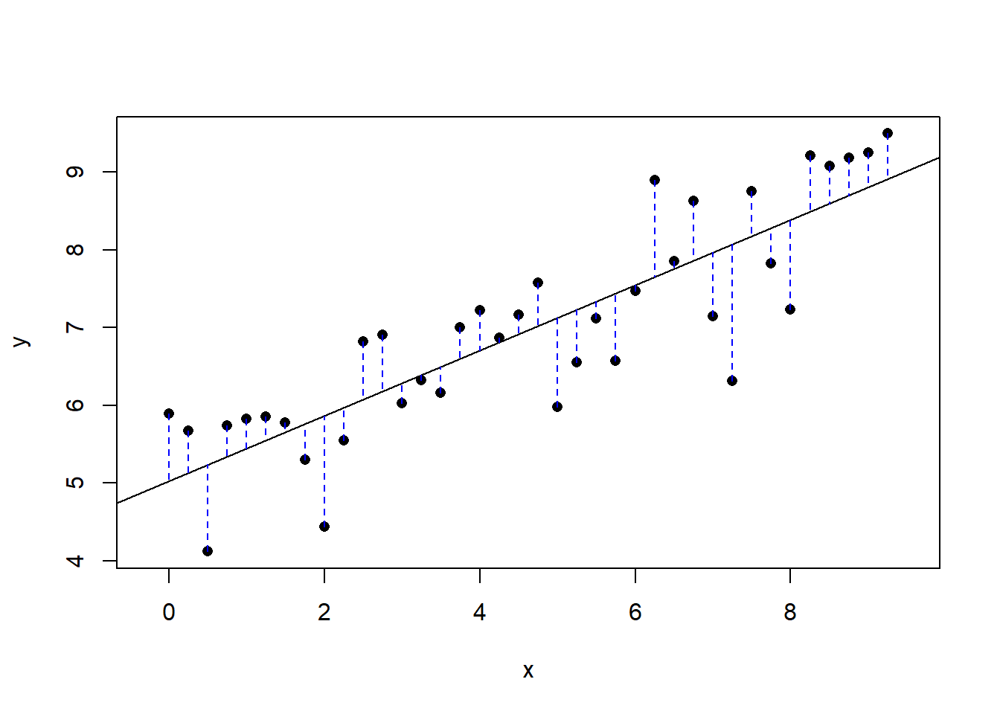
<p class="caption">(\#fig:plotss-expression-score)Plot of selected line and the associated residuals.</p>
</div>

```
## Click two points to make a line.
                                
## Call:
## lm(formula = y ~ x, data = pts)
## 
## Coefficients:
## (Intercept)            x  
##      5.0272       0.4199  
## 
## Sum of Squares:  19.121
```

Once you've picked your two locations, the line you specified will be shown in black and the residuals in blue. Residuals are the difference between the observed values and the values predicted by the line:

\[
  e_i = y_i - \hat{y}_i
\]

The most common way to do linear regression is to select the line that minimizes the sum of squared residuals. To visualize the squared residuals, you can rerun 
the plot command and add the argument `showSquares = TRUE`.


```r
plot_ss(x = pf_expression_control, y = pf_score, data = hfi_sub, showSquares = TRUE)
```

Note that the output from the `plot_ss` function provides you with the slope and intercept of your line as well as the sum of squares.

>**Exercise**:  
 Using `plot_ss`, choose a line that does a good job of minimizing the sum of squares. Run the function several times. What was the smallest sum of squares that you got?

## The linear model

It is rather cumbersome to try to get the correct least squares line, i.e. the line that minimizes the sum of squared residuals, through trial and error. Instead, you can use the `lm()` function in `R` to fit the linear model (a.k.a. 
regression line).


```r
m1 <- lm(pf_score ~ pf_expression_control, data = hfi_sub)
```

The first argument in the function `lm` is a formula that takes the form `y ~ x`. Here it can be read that we want to make a linear model of `pf_score` as a function of `pf_expression_control`. The second argument specifies
that `R` should look in the `hfi_sub` data frame to find the two variables. This should be familiar to us since we have been doing this when we used the **mosaic** package.

The output of `lm` is an object that contains all of the information we need about the linear model that was just fit. We can access this information using the `summary()` function.


```r
summary(m1)
```

```
## 
## Call:
## lm(formula = pf_score ~ pf_expression_control, data = hfi_sub)
## 
## Residuals:
##     Min      1Q  Median      3Q     Max 
## -1.7559 -0.4512  0.1838  0.5369  1.2510 
## 
## Coefficients:
##                       Estimate Std. Error t value Pr(>|t|)    
## (Intercept)            5.02721    0.23186  21.682  < 2e-16 ***
## pf_expression_control  0.41988    0.04312   9.736 1.26e-11 ***
## ---
## Signif. codes:  0 '***' 0.001 '**' 0.01 '*' 0.05 '.' 0.1 ' ' 1
## 
## Residual standard error: 0.7288 on 36 degrees of freedom
## Multiple R-squared:  0.7248,	Adjusted R-squared:  0.7171 
## F-statistic:  94.8 on 1 and 36 DF,  p-value: 1.262e-11
```

Let's consider this output piece by piece. First, the formula used to describe the model is shown at the top. After the formula you find the five-number summary of the residuals. The "Coefficients" table shown next is key; its first 
column displays the linear model's y-intercept and the coefficient of `pf_expression_control`. With this table, we can write down the least squares regression line for the 
linear model:

$$
  \hat{\text{pf_score}} = 5.02721 + 0.41988 \times \text{pf_expression_control}
$$

At least these are the values we got on our machine using the *seed* provided. Yours may differ slightly. One last piece of information we will discuss from the summary output is the `Multiple R-squared`, or more simply, $R^2$. The $R^2$ value represents the proportion of variability in the response variable that is explained by the explanatory variable. For this model, 72.48% of the variability in `pf_score` is explained by `pr_expression_control`.

>**Exercise**:  
Fit a new model that uses `pf_expression_control` to predict `hf_score`, or the total human freedom score. Using the estimates from the `R` output, write the equation of the regression line. What does the slope tell us in the context of the relationship between human freedom and the amount of political pressure on media content?


```r
m2<-lm(hf_score ~ pf_expression_control, data = hfi_sub)
```


```r
summary(m2)
```

```
## 
## Call:
## lm(formula = hf_score ~ pf_expression_control, data = hfi_sub)
## 
## Residuals:
##     Min      1Q  Median      3Q     Max 
## -1.5151 -0.5776  0.2340  0.4622  1.0633 
## 
## Coefficients:
##                       Estimate Std. Error t value Pr(>|t|)    
## (Intercept)            5.45660    0.21585  25.279  < 2e-16 ***
## pf_expression_control  0.30707    0.04015   7.649 4.72e-09 ***
## ---
## Signif. codes:  0 '***' 0.001 '**' 0.01 '*' 0.05 '.' 0.1 ' ' 1
## 
## Residual standard error: 0.6785 on 36 degrees of freedom
## Multiple R-squared:  0.6191,	Adjusted R-squared:  0.6085 
## F-statistic:  58.5 on 1 and 36 DF,  p-value: 4.718e-09
```

$$
  \hat{\text{hf_score}} = 5.45660 + 0.30707 \times \text{pf_expression_control}
$$
As the political pressure increases by one unit, the **average** human freedom score increases by 0.307.

## Prediction and prediction errors

Let's create a scatterplot with the least squares line for `m1`, our first model, laid on top, Figure \@ref(fig:reg-with-line).


```r
ggplot(data = hfi_sub, aes(x = pf_expression_control, y = pf_score)) +
  geom_point() +
#  geom_lm(color="black") +
  stat_smooth(method = "lm", se = FALSE,color="black") +
  theme_bw()+
  labs(title="Personal freedom score versus Expression control",
          x="Political pressures and controls on media",
          y="Personal freedom score")
```

<div class="figure">

<p class="caption">(\#fig:reg-with-line)Scatterplot of personal expression control and personal freedom score.</p>
</div>

Here, we are literally adding a layer on top of our plot. The  `stat_smooth()` function creates the line by fitting a linear model, we could use `geom_lm()` as well. It can also show us the standard error `se`
associated with our line, but we'll suppress that for now.

This line can be used to predict $y$ at any value of $x$. When predictions are made for values of $x$ that are beyond the range of the observed data, it is referred to as *extrapolation* and is not usually recommended. However, 
predictions made within the range of the data are more reliable. They're also used to compute the residuals.

>**Exercise**:  
If someone saw the least squares regression line and not the actual data, how would they predict a country's personal freedom score for one with a 6.75 rating for `pf_expression_control`? Is this an overestimate or an underestimate, and by how much? In other words, what is the residual for this prediction?

To predict, we will use the predict function, but we have to send the new data as a data frame.


```r
predict(m1,newdata=data.frame(pf_expression_control=6.75))
```

```
##        1 
## 7.861402
```

We thus predict a value of 7.86 for the average `pf_score`.

The observed value is 8.628272.


```r
hfi_sub %>%
  filter(pf_expression_control==6.75)
```

```
## # A tibble: 1 x 3
## # Groups:   pf_expression_control [1]
##   pf_expression_control pf_score hf_score
##                   <dbl>    <dbl>    <dbl>
## 1                  6.75     8.63     8.25
```

The residual is:


```r
8.628272 - 7.861402
```

```
## [1] 0.76687
```

We underestimated the actual value.

Another way to do this is to use the **broom** package.


```r
library(broom)
```


```r
augment(m1) %>%
   filter(pf_expression_control==6.75)
```

```
## # A tibble: 1 x 8
##   pf_score pf_expression_control .fitted .resid   .hat .sigma .cooksd .std.resid
##      <dbl>                 <dbl>   <dbl>  <dbl>  <dbl>  <dbl>   <dbl>      <dbl>
## 1     8.63                  6.75    7.86  0.767 0.0421  0.727  0.0254       1.08
```

## Model diagnostics

To assess whether the linear model is reliable, we need to check for  

1. linearity,   
2. independence, 
3. nearly normal residuals, and  
4. constant variability.

**Linearity**: You already checked if the relationship between `pf_score` and `pf_expression_control` is linear using a scatterplot. We should also verify this condition with a plot of the residuals vs. fitted (predicted) values, Figure \@ref(fig:residuals).


```r
ggplot(data = m1, aes(x = .fitted, y = .resid)) +
  geom_point() +
  geom_hline(yintercept = 0, linetype = "dashed") +
  labs(x="Fitted values",y="Residuals",title="Residual analysis") +
  theme_bw()
```

<div class="figure">

<p class="caption">(\#fig:residuals)Scatterplot of residuals and fitted values used to assess the assumptions of linearity and constant variance.</p>
</div>

Notice here that `m1` can also serve as a data set because stored within it are the fitted values ($\hat{y}$) and the residuals. Also note that we're getting more sophisticated with the code in Figure \@ref(fig:residuals). After creating the scatterplot on the first layer (first line of code), we overlay a horizontal dashed line at $y = 0$ (to help us check whether residuals are distributed around 0), and we also rename the axis labels to be more informative and add a title.

>**Exercise**:  
Is there any apparent pattern in the residuals plot? What does this indicate about the linearity of the relationship between the two variables?  

The width is constant and there is no trend in the data. The linearity assumption is not bad.

**Independence**: This is difficult to check with residuals and depends on how the data was collected. 

**Nearly normal residuals**: To check this condition, we can look at a histogram, Figure \@ref(fig:hist-res).


```r
ggplot(data = m1, aes(x = .resid)) +
  geom_histogram(binwidth = .4,fill="cyan",color="black") +
  xlab("Residuals") +
  theme_bw()
```

<div class="figure">

<p class="caption">(\#fig:hist-res)Histogram of residuals from linear regression model.</p>
</div>

or a normal probability plot of the residuals, \@ref(fig:qq-res).


```r
ggplot(data = m1, aes(sample = .resid)) +
  stat_qq() +
  theme_bw() +
  geom_abline(slope=1,intercept = 0)
```

<div class="figure">

<p class="caption">(\#fig:qq-res)The quantile-quantile residual plot used to assess the normality assumption.</p>
</div>

Note that the syntax for making a normal probability plot is a bit different than what you're used to seeing: we set `sample` equal to the residuals instead of `x`, and we set a statistical method `qq`, which stands for "quantile-quantile",
another name commonly used for normal probability plots. 

It is a little difficult at first to understand how the `qq` plot indicated that the distribution was skewed to the left. The points indicate the quantile from the sample, standardized to have mean zero and standard deviation one, plotted against the same quantiles from a standard normal. It the sample matched a standard normal the points would align on the 45-degree line. From the plot, we see that as the theoretical quantile get larger, further from zero, the sample do not. That is why the trajectory of the points in the upper right looks flat, below the 45-degree line. Thus the distribution is compressed on the right making it skewed to the left. 

> **Exercise**: 
Based on the histogram and the normal probability plot, does the nearly normal residuals condition appear to be met?

No, the sample is small but it appears the residual are skewed to the left.

**Constant variability**:

> **Exercise**: 
Based on the residuals vs. fitted plot, does the constant variability condition appear to be met?

Yes, the width of the plot seems constant.

## Brief summary  

This case study introduced simple linear regression. We look at the criteria to find a best fit linear line between two variables. We also used `R` to fit the line. We examined the output from `R` and used it to explain and predict with our model. In the remainder of this block we will develop these ideas further and extend to multiple predictors and binary outcomes. This is a perfect introduction for Math 378.

## Homework Problems

1. HFI   

Choose another freedom variable and a variable you think would strongly correlate with it. The **openintro** package contains the data set `hfi`. Type `?openintro::hfi` in the Console window in `RStudio` to learn more about the variables. 
    
a. Produce a scatterplot of the two variables.  
b. Quantify the strength of the relationship with the correlation coefficient.  
c. Fit a linear model. At a glance, does there seem to be a linear relationship?  
d. How does this relationship compare to the relationship between `pf_expression_control` and `pf_score`? Use the $R^2$ values from the two model summaries to compare. Does your independent variable seem to predict your dependent one better? Why or why not?  
e. Display the model diagnostics for the regression model analyzing this relationship.  
f. Predict the response from your explanatory variable for a value between the median and third quartile. Is this an overestimate or an underestimate, and by how much? In other words, what is the residual for this prediction?  

<!--chapter:end:25-Linear-Regression-Case-Study.Rmd-->

# Linear Regression Basics {#LRBASICS}

## Objectives

1) Obtain parameter estimates of a simple linear regression model given a sample of data.   
2) Interpret the coefficients of a simple linear regression.  
3) Create a scatterplot with a regression line.  
4) Explain and check the assumptions of linear regression.   
5) Use and be able to explain all new terms.  

## Linear regression models

The rest of this block will serve as a brief introduction to linear models. In general, a model estimates the relationship between one variable (a **response**) and one or more other variables (**predictors**). Models typically serve two purposes: *prediction* and *inference*. A model allows us to predict the value of a response given particular values of predictors. Also, a model allows us to make inferences about the relationship between the response and the predictors. 

Not all models are used or built on the same principles. Some models are better for inference and others are better for prediction. Some models are better for qualitative responses and others are better for quantitative responses. Also, many models require making assumptions about the nature of the relationship between variables. If these assumptions are violated, the model loses usefulness. In a machine learning course, a wide array of models are discussed but most of which are used for the purpose of prediction. 

In this block, we will focus on *linear models* and the use of linear regression to produce and evaluate the model. Linear regression is a very powerful statistical technique. Many people have some familiarity with regression just from reading the news, where graphs with straight lines are overlaid on scatterplots, much like we did in the last lesson. Linear models can be used for prediction or to evaluate whether there is a linear relationship between two numerical variables.  

Suppose we were interested in exploring the relationship between one response variable ($Y$) and one predictor variable ($X$). We can postulate a linear relationship between the two:
$$
Y=\beta_0+\beta_1 X
$$

A linear model can be expanded to include multiple predictor variables:
$$
Y=\beta_0+\beta_1X_1+\beta_2X_2+...+\beta_pX_p
$$

This model is often referred to as a **linear regression** model. (When there is only one predictor variable, we often refer to it as a **simple linear regression** model.) The $\beta_j$ terms are referred to as **coefficients**. Note that the coefficients are **parameters** and thus represented as Greek letters. We typically don't know the true values of $\beta_j$, so we have to estimate them with samples from the population of $X$ and $Y$, our data. Estimating these parameters and using them for prediction and inference will be the majority of the work of this last block.  

We consider the models above to be linear models because they are linear in the **parameters**. This means that the following model is also a linear model:

$$
Y=\beta_0+\beta_1 X^2
$$

Technically, we can write the parameters as a vector and the explanatory variables as a matrix. The response will then be an inner product of this vector and matrix and thus a linear combination.

Even if we expect two random variables $X$ and $Y$ to share a linear relationship, we don't expect it to be perfect. There will be some scatter around the estimated line. For example, consider the head length and total length of 104 brushtail possums from Australia. The data is in the file `possum.csv` in the `data` folder. 

>**Exercise**:  
Read in the data from `data/possum.csv` and look at the first few rows of data.


```r
possum<-read_csv("data/possum.csv")
```


```r
glimpse(possum)
```

```
## Rows: 104
## Columns: 8
## $ site    <dbl> 1, 1, 1, 1, 1, 1, 1, 1, 1, 1, 1, 1, 1, 1, 1, 1, 1, 1, 1, 1, 1,~
## $ pop     <chr> "Vic", "Vic", "Vic", "Vic", "Vic", "Vic", "Vic", "Vic", "Vic",~
## $ sex     <chr> "m", "f", "f", "f", "f", "f", "m", "f", "f", "f", "f", "f", "m~
## $ age     <dbl> 8, 6, 6, 6, 2, 1, 2, 6, 9, 6, 9, 5, 5, 3, 5, 4, 1, 2, 5, 4, 3,~
## $ head_l  <dbl> 94.1, 92.5, 94.0, 93.2, 91.5, 93.1, 95.3, 94.8, 93.4, 91.8, 93~
## $ skull_w <dbl> 60.4, 57.6, 60.0, 57.1, 56.3, 54.8, 58.2, 57.6, 56.3, 58.0, 57~
## $ total_l <dbl> 89.0, 91.5, 95.5, 92.0, 85.5, 90.5, 89.5, 91.0, 91.5, 89.5, 89~
## $ tail_l  <dbl> 36.0, 36.5, 39.0, 38.0, 36.0, 35.5, 36.0, 37.0, 37.0, 37.5, 39~
```


```r
head(possum)
```

```
## # A tibble: 6 x 8
##    site pop   sex     age head_l skull_w total_l tail_l
##   <dbl> <chr> <chr> <dbl>  <dbl>   <dbl>   <dbl>  <dbl>
## 1     1 Vic   m         8   94.1    60.4    89     36  
## 2     1 Vic   f         6   92.5    57.6    91.5   36.5
## 3     1 Vic   f         6   94      60      95.5   39  
## 4     1 Vic   f         6   93.2    57.1    92     38  
## 5     1 Vic   f         2   91.5    56.3    85.5   36  
## 6     1 Vic   f         1   93.1    54.8    90.5   35.5
```


We think the head and total length variables are linearly associated. Possums with an above average total length also tend to have above average head lengths. To visualize this data, we will use a scatterplot. We have used scatterplots multiple times in this book. Scatterplots are a graphical technique to present two numerical variables simultaneously. Such plots permit the relationship between the variables to be examined with ease. The following figure shows a scatterplot for the head length and total length of the possums. Each point represents a single possum from the data. 


>**Exercise**:  
Create a scatterplot of head length and total length.


```r
possum %>%
  gf_point(head_l~total_l) %>%
  gf_labs(x="Total Length (cm)",y="Head Length (mm)") %>%
  gf_theme(theme_classic())
```

<div class="figure">

<p class="caption">(\#fig:scat261-fig)A scatterplot of possum total length and head length.</p>
</div>

From Figure \@ref(fig:scat261-fig), we see that the relationship is not perfectly linear; however, it could be helpful to partially explain the connection between these variables with a straight line. Since some longer possums will have shorter heads and some shorter possums will have longer heads, there is no straight line that can go through all the data points. We expect some deviation from the linear fit. This deviation is represented by random variable $e$ (this is not the Euler number), which we refer to as an error term or residual:

$$
Y=\beta_0+\beta_1X+e
$$

For our problem, $Y$ is head length and $X$ is total length.

In general we have:

$$ \text{Data} = \text{Fit} + \text{Residual} $$ 

and what will change in our modeling process is how we specify the $\text{Fit}$.

The error term is assumed to follow a normal distribution with mean 0 and constant standard deviation $\sigma$. Note: the assumption of normality is only for inference using the $t$ and $F$ distributions and we can relax this assumption by using a bootstrap. Among other things, these assumptions imply that a linear model should only be used when the response variable is continuous in nature. There are other approaches for non-continuous response variables (for example logistic regression).

### Estimation

We want to describe the relationship between the head length and total length variables in the possum data set using a line. In this example, we will use the total length as the predictor variable, $x$, to predict a possum's head length, $y$. Just as a side note, the choice of the predictor and response are not arbitrary. The response is typically what we want to predict or in the case of experiments is the causal  result of the predictor(s). 

In the possum data we have $n = 104$ observations: $(x_1,y_1), (x_2,y_2),...,(x_{104},y_{104})$. Then for each observation the implied linear model is:  

$$
y_i=\beta_0+\beta x_i + e_i
$$

We could fit the linear relationship by eye like we did in the case study and obtain estimates of the slope and intercept but this is too ad hoc.^[If you want to do try this again use the `plot_ss()` from the last lesson.]  So, given a set of data like the `possum`, how do we actually obtain estimates of $\beta_0$ and $\beta_1$? What is the **best** fit line?  

We begin by thinking about what we mean by ``best''. Mathematically, we want a line that has small residuals. There are multiple methods, but the most common is the *method of least squares*. In this method, our goal is to find the values of $\beta_0$ and $\beta_1$ that minimize the squared vertical distance between the points and the resulting line, the **residuals**. See \@ref(fig:resid1-fig) for a visual representation involving only four observations from *made up* data. 

<div class="figure">

<p class="caption">(\#fig:resid1-fig)An illustration of the least squares method.</p>
</div>

Our criterion for best is the estimates of slope and intercept that minimize the sum of the squared residuals:

$$e_{1}^2 + e_{2}^2 + \dots + e_{n}^2$$ 

The following are three possible reasons to choose the least squares criterion over other criteria such as the sum of the absolute value of residuals:  

i. It is the most commonly used method.  
ii. Computing a line based on least squares was much easier by hand when computers were not available.  
iii. In many applications, a residual twice as large as another residual is more than twice as bad. For example, being off by 4 is usually more than twice as bad as being off by 2. Squaring the residuals accounts for this discrepancy.  

The first two reasons are largely for tradition and convenience; the last reason explains why least squares is typically helpful.^[There are applications where least absolute deviation may be more useful, and there are plenty of other criteria we might consider. However, this course only applies the least squares criterion. Math 378 will look at other criteria such as a shrinkage method called the lasso.]

So, we need to find $\beta_0$ and $\beta_1$ that minimize the expression, observed minus expected:
$$
\sum_{i=1}^n (y_i-\beta_0-\beta_1 x_i)^2
$$

Using calculus-based optimization yields the following estimates of $\beta_0$ and $\beta_1$:

$$
\hat{\beta}_0=\bar{y}-\hat{\beta}_1\bar{x}
$$

Notice that this implies that the line will always go through the point $\left(\bar{x},\bar{y} \right)$. As a reminder $\bar{x}$ is the sample mean of the explanatory variable and $\bar{y}$ is the sample mean of the response.  

And 

$$
\hat{\beta}_1 = {\sum x_i y_i - n\bar{x}\bar{y} \over \sum x_i^2 -n\bar{x}^2}
$$

A more intuitive formula for the slope and one that links **correlation** to linear regression is:

$$
\hat{\beta}_1 = \frac{s_y}{s_x} R
$$

where $R$ is the correlation between the two variables, and $s_x$ and $s_y$ are the sample standard deviations of the explanatory variable and response, respectively. Thus the slope is proportional to the correlation.


You may also be interested in estimating $\sigma$, the standard deviation of the error:
$$
\hat{\sigma}=\sqrt{{1\over n-2} \sum_{i=1}^n \hat{e}_i^2}
$$

where $\hat{e}_i$ is the observed $i$th **residual** ($\hat{e}_i=y_i-\hat{\beta}_0-\hat{\beta}_1x_i$). This estimate is based only on the assumption of constant variance.

### Possum example  

We will let `R` do the heavy work of minimizing the sum of squares. The function is `lm()` as we learned in the case study. This function needs a formula and data for input. The formula notation should be easy for us since we have worked with formulas so much in the **mosaic** package. 

First create the model:


```r
poss_mod <- lm(head_l~total_l,data=possum)
```

The output of the model object is minimal with just the estimated slope and intercept.


```r
poss_mod
```

```
## 
## Call:
## lm(formula = head_l ~ total_l, data = possum)
## 
## Coefficients:
## (Intercept)      total_l  
##     42.7098       0.5729
```

We can get more information using the `summary()` function:


```r
summary(poss_mod)
```

```
## 
## Call:
## lm(formula = head_l ~ total_l, data = possum)
## 
## Residuals:
##     Min      1Q  Median      3Q     Max 
## -7.1877 -1.5340 -0.3345  1.2788  7.3968 
## 
## Coefficients:
##             Estimate Std. Error t value Pr(>|t|)    
## (Intercept) 42.70979    5.17281   8.257 5.66e-13 ***
## total_l      0.57290    0.05933   9.657 4.68e-16 ***
## ---
## Signif. codes:  0 '***' 0.001 '**' 0.01 '*' 0.05 '.' 0.1 ' ' 1
## 
## Residual standard error: 2.595 on 102 degrees of freedom
## Multiple R-squared:  0.4776,	Adjusted R-squared:  0.4725 
## F-statistic: 93.26 on 1 and 102 DF,  p-value: 4.681e-16
```


The model object, `poss_mod`, contains much more information. Using the function `names()` function on the model objects, gives you a list of other quantities available, such as residuals.


```r
names(poss_mod)
```

```
##  [1] "coefficients"  "residuals"     "effects"       "rank"         
##  [5] "fitted.values" "assign"        "qr"            "df.residual"  
##  [9] "xlevels"       "call"          "terms"         "model"
```


Figure \@ref(fig:scat262-fig) is a plot the data points and least squares line together.


```r
possum %>%
  gf_point( head_l ~ total_l) %>%
  gf_lm(color="black") %>%
  gf_labs(x="Total Length (cm)",y="Head Length (mm)") %>%
  gf_labs(title="Possum data including regression line") %>%
  gf_theme(theme_classic()) 
```

<div class="figure">
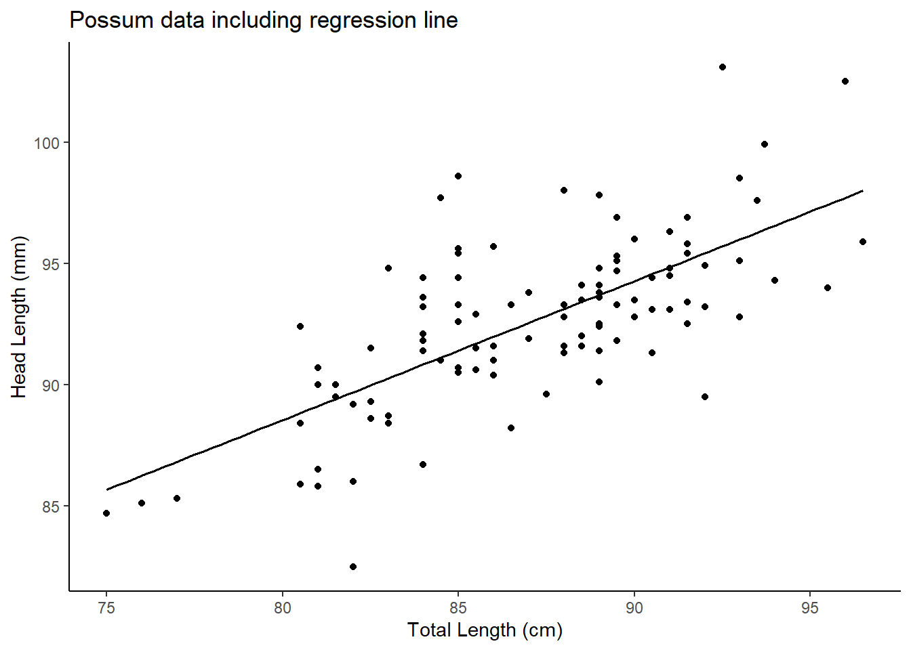
<p class="caption">(\#fig:scat262-fig)A scatterplot of possum total length and head length including a regression line.</p>
</div>


### Interpretation

Interpreting parameters in a regression model is often one of the most important steps in the analysis. The intercept term, $\beta_0$, is usually uninteresting. It represents the **average** value of the response when the predictor is 0. Unless we center our predictor variable around 0, the actual value of the intercept is usually not important; it typically just gives the slope more flexibility to fit the data. The slope term, $\beta_1$ represents the **average** increase in the response variable per unit increase in the predictor variable. We keep using the word **average** in our discussion. With the assumption of a mean of 0 for the residuals, which least squares ensures with a line going through the point $\left(\bar{x},\bar{y} \right)$, the output of the model is the expected or average response for the given input. Mathematically we have:

$$
E(Y|X=x)=E(\beta_0+\beta_1x+e) = E(\beta_0+\beta_1x)+E(e)=\beta_0+\beta_1x
$$

Predicting a value of the response variable simply becomes a matter of substituting the value of the predictor variable into the estimated regression equation. Again, it is important to note that for a given value of $x$, the predicted response, $\hat{y}$ is what we expect the average value of $y$ to be given that specific value of the predictor. 

> **Exercise**: The slope and intercept estimates for the possum data are 0.5729 and 42.7098. What do these numbers really mean, interpret them?

Interpreting the slope parameter is helpful in almost any application. For each additional 1 cm of total length of a possum, we would expect the possum's head to be 0.5729 mm longer on average. Note that a longer total length corresponds to longer head because the slope coefficient is positive. We must be cautious in this interpretation: while there is a real association, we cannot interpret a causal connection between the variables because these data are observational. That is, increasing a possum's total length may not cause the possum's head to be longer. 

The estimated intercept $b_0=42.7$ describes the average head length of a possum with zero total length! The meaning of the intercept is irrelevant to this application since a possum can not practically have a total length of 0.

Earlier we noted a relationship between the slope estimate and the correlation coefficient estimate. 

>**Exercise** 
Find the slope from the correlation and standard deviations.


```r
possum %>%
  summarise(correlation=cor(head_l,total_l),sd_head=sd(head_l),
            sd_total=sd(total_l),slope=correlation*sd_head/sd_total)
```

```
## # A tibble: 1 x 4
##   correlation sd_head sd_total slope
##         <dbl>   <dbl>    <dbl> <dbl>
## 1       0.691    3.57     4.31 0.573
```


### Extrapolation is dangerous

> "When those blizzards hit the East Coast this winter, it proved to my satisfaction that global warming was a fraud. That snow was freezing cold. But in an alarming trend, temperatures this spring have risen. Consider this: On February $6^{th}$ it was 10 degrees. Today it hit almost 80. At this rate, by August it will be 220 degrees. So clearly folks the climate debate rages on."
*Stephen Colbert*
April 6th, 2010^[http://www.colbertnation.com/the-colbert-report-videos/269929/]

Linear models can be used to approximate the relationship between two variables and are built on an observed random sample.  These models have real limitations as linear regression is simply a modeling framework. The truth is almost always much more complex than our simple line. *Extrapolation* occurs when one tries to make a prediction of a response given a value of the predictor that is outside the range of values used to build the model. We only have information about the relationship between two variables in the region around our observed data. We do not know how the data outside of our limited window will behave. Be careful about extrapolating. 

### Reading computer output  

We stored the results of our linear regression model for the possum data in the object `poss_mod` but it provided only the bare minimum of information. We can get more information using the function `summary()`.


```r
summary(poss_mod)
```

```
## 
## Call:
## lm(formula = head_l ~ total_l, data = possum)
## 
## Residuals:
##     Min      1Q  Median      3Q     Max 
## -7.1877 -1.5340 -0.3345  1.2788  7.3968 
## 
## Coefficients:
##             Estimate Std. Error t value Pr(>|t|)    
## (Intercept) 42.70979    5.17281   8.257 5.66e-13 ***
## total_l      0.57290    0.05933   9.657 4.68e-16 ***
## ---
## Signif. codes:  0 '***' 0.001 '**' 0.01 '*' 0.05 '.' 0.1 ' ' 1
## 
## Residual standard error: 2.595 on 102 degrees of freedom
## Multiple R-squared:  0.4776,	Adjusted R-squared:  0.4725 
## F-statistic: 93.26 on 1 and 102 DF,  p-value: 4.681e-16
```

The first line repeats the model formula. The second line is a descriptive summary of the residuals, plots of the residuals are more useful than this summary. We then have a table of the model fit. The first column of numbers provides estimates for $\beta_0$ and $\beta_1$, respectively. For the next columns, we'll describe the meaning of the columns using the second row, which corresponds to information about the slope estimate. Again, the first column provides the point estimate for $\beta_1$. The second column is a standard error for this point estimate. The third column is a $t$ test statistic for the null hypothesis that $\beta_1 = 0$: $T=9.657$. The last column is the p-value for the $t$ test statistic for the null hypothesis $\beta_1=0$ and a two-sided alternative hypothesis. We will get into more of these details in the next chapters.   

The row with the residual standard error is an estimate of the unexplained variance. The next rows give a summary of the model fit and we will discuss in the next chapters.  

In the `tidyverse` we may want to have the table above in a `tibble`. The **broom** package, which we have seen before, helps with this effort.


```r
library(broom)
```


```r
tidy(poss_mod)
```

```
## # A tibble: 2 x 5
##   term        estimate std.error statistic  p.value
##   <chr>          <dbl>     <dbl>     <dbl>    <dbl>
## 1 (Intercept)   42.7      5.17        8.26 5.66e-13
## 2 total_l        0.573    0.0593      9.66 4.68e-16
```


> **Exercise**:  
The `cars` dataset (built-in to `R`) contains 50 observations of 2 variables. The data give the speed of cars (in mph) and the corresponding distance (in feet) that it took to stop. Attempt to answer the following questions. 

a) Build a simple linear regression model fitting distance against speed. 


```r
cars_mod <- lm(dist~speed,data=cars)
summary(cars_mod)
```

```
## 
## Call:
## lm(formula = dist ~ speed, data = cars)
## 
## Residuals:
##     Min      1Q  Median      3Q     Max 
## -29.069  -9.525  -2.272   9.215  43.201 
## 
## Coefficients:
##             Estimate Std. Error t value Pr(>|t|)    
## (Intercept) -17.5791     6.7584  -2.601   0.0123 *  
## speed         3.9324     0.4155   9.464 1.49e-12 ***
## ---
## Signif. codes:  0 '***' 0.001 '**' 0.01 '*' 0.05 '.' 0.1 ' ' 1
## 
## Residual standard error: 15.38 on 48 degrees of freedom
## Multiple R-squared:  0.6511,	Adjusted R-squared:  0.6438 
## F-statistic: 89.57 on 1 and 48 DF,  p-value: 1.49e-12
```

Figure \@ref(fig:scat263-fig) is a scatterplot of the `cars` data set.  


```r
cars %>%
  gf_point(dist~speed) %>%
  gf_lm() %>%
  gf_labs(x="Speed (mph)",y="Stopping distance (ft)") %>%
  gf_theme(theme_bw())
```

<div class="figure">
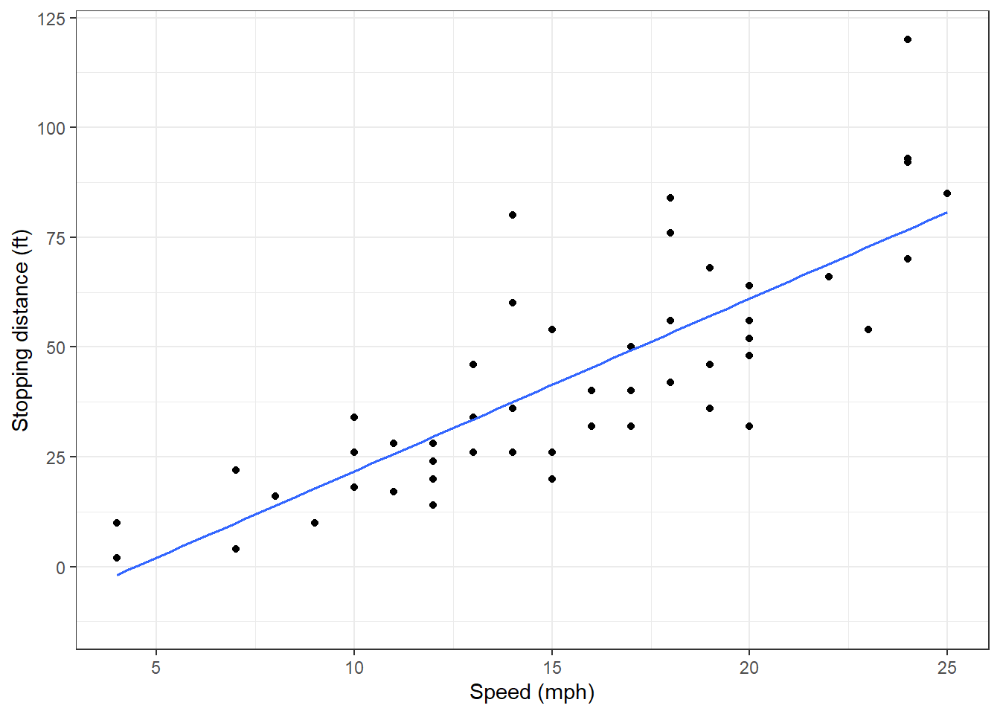
<p class="caption">(\#fig:scat263-fig)A scatterplot of speed and stopping distance.</p>
</div>

As expected, it appears that for larger speeds, stopping distance is greater. 

b) Report and interpret the estimated model coefficients. 

The estimated intercept term, $\hat{\beta}_0$ is equal to -17.6. This estimate doesn't have a helpful interpretation. Technically, it is the estimated average stopping distance for speed 0. However, "stopping distance" doesn't make sense when a car has no speed. Also, a negative stopping distance doesn't make sense. Furthermore, a speed of 0 is outside of the observed speeds in the data set, so even if a speed of 0 made sense, it is outside the scope of this data and thus an extrapolation. 

The estimated slope term, $\hat{\beta}_1$ is equal to 3.9. This means that for an increase of one mph, we expect stopping distance to increase by 3.9 feet, on average. 

c) Report the estimated common standard deviation of the residuals. 

The estimated standard deviation of the error (residual), $\hat{\sigma}$ is equal to 15.4. 

### Assumptions

Anytime we build a model, there are assumptions behind it that, if violated, could invalidate the conclusions of the model. In the description of simple linear regression, we briefly mentioned these assumptions. Next chapter, we will discuss how to validate these assumptions. 

**Fit**. When we build a simple linear regression, we assume that the relationship between the response and the predictor is as we specify in the fit formula. This in simple linear regression is often just a linear relationship. Suppose two variables are non-linearly related, see \@ref(fig:resid2-fig). While we could build a linear regression model between the two, the resulting model would not be very useful. If we built a model with the fit formulated as a quadratic, a similar plot of the residuals would look flat. We will discuss this more in a later chapter. 

<div class="figure">

<p class="caption">(\#fig:resid2-fig)An example of non-linear relationship between two variables fitted with a linear regression line.</p>
</div>

**Independent Observations**. Another assumption is that all observations in a data set are independent of one another. A common way this assumption is violated is by using time as the predictor variable. For example, suppose we were interested in how an individual's weight changes over time. While it may be tempting to plot this and fit a regression line through the data, the resulting model is inappropriate, as simple linear regression assumes that each observation is independent. Figure \@ref(fig:resid3-fig) shows correlated data fitted with a linear regression line.

<div class="figure">

<p class="caption">(\#fig:resid3-fig)A scatterplot of correlated data fit using a linear regression model with the assumption of independence.</p>
</div>

**Constant Error Variance**. In simple linear regression, we assume that the residuals come from a normal distribution with mean 0 and constant standard deviation $\sigma$. Violation of this assumption is usually manifested as a "megaphone" pattern in the scatterplot. Specifically, as the value of the predictor increases, the variance in the response also increases, resulting in greater spread for larger values of the predictor.  

**Normality of Errors**. Again, we assume that the residuals are normally distributed. Normality of residuals is not easy to see graphically, so we have to use other diagnostics to check this assumption. 

The last three assumptions are important not necessarily for estimating the relationship, but for *inferring* about the relationship. In future chapters, we will discuss how to use a model for prediction, and how to build a confidence/prediction interval around a prediction. Also, we will discuss inference about the coefficient estimates in a model. Violation of one of the last three assumptions will impact our ability to conduct inference about the population parameters. 

### Residual plots 

One purpose of residual plots is to identify characteristics or patterns still apparent in data after fitting a model. These can help to evaluate the assumptions. 

Figure \@ref(fig:resid4-fig) shows three scatterplots with linear models in the first row and residual plots in the second row. 

<div class="figure">
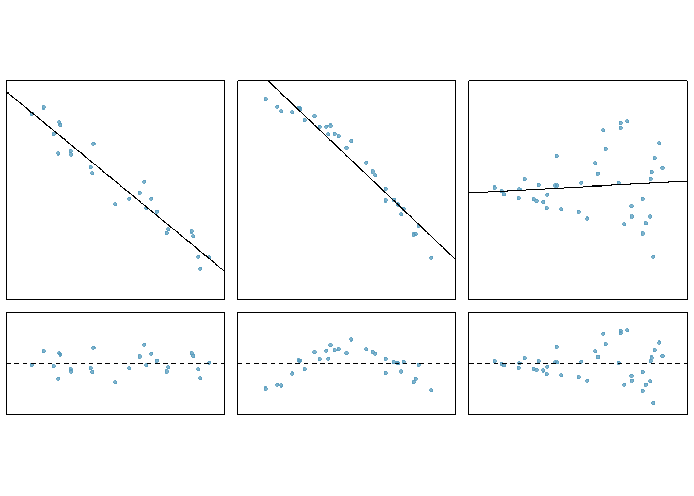
<p class="caption">(\#fig:resid4-fig)Residual plots and associated scatterplots.</p>
</div>

In the first data set (first column), the residuals show no obvious patterns. The residuals appear to be scattered randomly around the dashed line that represents 0.

The second data set shows a pattern in the residuals. There is some curvature in the scatterplot, which is more obvious in the residual plot. We should not use a straight line to model these data. Instead, a more advanced technique should be used.

In the last plot the spread, variance of the data, seems to increase as the explanatory variable increases. We can see this clearly in the residual plot. To make inference using the $t$ or $F$ distribution would require a transformation to equalize the variance.

### Summary  

We have introduced the ideas of linear regression in this lesson. There are many new terms as well as new `R` functions to learn. We will continue to use these ideas in the remainder of this block of material. Next we will learn about inference and prediction.

## Homework Problems

1. Nutrition at Starbucks  

In the `data` folder is a file named `starbucks.csv`. Use it to answer the questions below.

a. Create a scatterplot of number of calories and amount of carbohydrates.  
b. Describe the relationship in the graph.  
c. In this scenario, what are the explanatory and response variables?  
d. Why might we want to fit a regression line to these data?  
e. Create a scatterplot of number of calories and amount of carbohydrates with the regression line included.  
f. Using 'lm()` fit a least squares line to the data.  
g. Report and interpret the slope coefficient.    
h. For a menu item with 51 g of carbs, what is the estimated calorie count?  
i. Could we use the model for a menu item with 100 g of carbs?  
j. Does the assumption of constant variance seem reasonable for this problem?  
k. Verify that the line passes through the mean carb and mean calories, do this mathematically.  
l. What is the estimate of the standard deviation of the residuals? How could you use this information?


<!--chapter:end:26-Linear-Regression-Basics.Rmd-->

# Linear Regression Inference {#LRINF}

## Objectives

1) Given a simple linear regression model, conduct inference on the coefficients $\beta_0$ and $\beta_1$.  
2) Given a simple linear regression model, calculate the predicted response for a given value of the predictor.  
3) Build and interpret confidence and prediction intervals for values of the response variable.  

## Introduction  

In this chapter we discuss uncertainty in the estimates of the slope and y-intercept for a regression line. This will allow us to perform inference and predictions. Just as we identified standard errors for point estimates in previous chapters, we first discuss standard errors for these new estimates. This chapter is a classical chapter in the sense that we will be using the normal distribution. We will assume that the errors are normally distributed with constant variance. Later in the book, we will relax these assumptions.

### Regression  


Last chapter, we introduced linear models using the simple linear regression model:
$$
Y=\beta_0+\beta_1X+e
$$

where now we assume the error term follows a normal distribution with mean 0 and constant standard deviation $\sigma$. Using the method of least squares, which does not require the assumption of normality, we obtain estimates of $\beta_0$ and $\beta_1$: 
$$
\hat{\beta}_1 = {\sum x_i y_i - n\bar{x}\bar{y} \over \sum x_i^2 -n\bar{x}^2}
$$
$$
\hat{\beta}_0=\bar{y}-\hat{\beta}_1\bar{x}
$$

If we assume a probability distribution for the errors, we could also find point estimates using maximum likelihood methods. This will not be discussed in this book.  

Using these estimates, for a given value of the predictor, $x_*$, we can obtain a prediction of the response variable. Here we are using the subscript $_*$ to denote a new value for the explanatory variable. The resulting prediction, which we will denote $\hat{Y}_*$, is the **average** or **expected value** of the response given predictor value $x_*$:  

$$
\hat{Y}_*=\hat{\beta}_0+\hat{\beta}_1x_*
$$

The reason this model returns the expected value of the response at the given value of the predictor is because the error term has an expected value of zero. As a review of the properties of expectation as well as last chapter, we have:

$$
E(Y|X=x)=E(\beta_0+\beta_1x+e)=Y=\beta_0+\beta_1x+E(e)=\beta_0+\beta_1x
$$
because $\beta_0$, $\beta_1$, and $x$ are constants.  

It should be abundantly clear by now that $\hat{Y}_*$, $\hat{\beta}_0$, and $\hat{\beta}_1$ are ***estimators***. Being estimators, they are dependent on our random sample, our data. If we collect a new random sample from the same population, we will get new estimates from these estimators. Thus, we can think of $\hat{Y}_*$, $\hat{\beta}_0$, and $\hat{\beta}_1$ as **random variables**. Like all random variables, they have distributions. We can use the distribution of an estimator to build confidence intervals and conduct hypothesis tests about the true values of the parameter it is intended to estimate. The estimators based on least squares are unbiased, their distributions are centered around the actual values of $Y$, $\beta_0$ and $\beta_1$, respectively.

### Review of assumptions

We will review the assumptions of the least squares model because they are important for inference. Refer to Figure \@ref(fig:assump271-fig), which plots the linear regression in the top row and the residuals in the second row. We generally assume the following:

1. **Fit**.  The data should show a linear trend. If there is a nonlinear trend, a transformation of the explanatory variable or a more advanced regression method should be applied. When looking at the residual plot, if the trend is linear, we should see a spread of points that are flat. The left column of Figure \@ref(fig:assump271-fig) is an example of a nonlinear relationship. The top plot is the regression plot and we can see what looks like a quadratic relationship instead of a linear one. The residual plot, the plot in the lower left corner of Figure \@ref(fig:assump271-fig), also exhibits this non-linear trend.     
2. **Nearly normal residuals**.  Generally the residuals must be nearly normal to use a $t$ or $F$ for inference. When this assumption is found to be unreasonable, it is usually because of **outliers** or concerns about **influential** points. An example of non-normal residuals is shown in the second column of Figure \@ref(fig:assump271-fig). A **qq** plot is also useful as a diagnostic tool as we have seen. We can still use the **bootstrap** as an inference tool if the normality assumption is unreasonable.    
3. **Constant variability**.  The variability of points around the least squares line remains roughly constant. An example of non-constant variability is shown in the third panel of Figure \@ref(fig:assump271-fig).  The constant variability assumption is needed for the $t$ and $F$ distributions. It is not required for the bootstrap method.  
4. **Independent observations**.  Be cautious about applying regression to data collected sequentially in what is called a **time series**. Such data may have an underlying structure that should be considered in a model and analysis. An example of a time series where independence is violated is shown in the fourth panel of Figure \@ref(fig:assump271-fig). More advanced methods are required for time series data even including using a bootstrap. 

In a later chapter we will explore more regression diagnostics.


<div class="figure">

<p class="caption">(\#fig:assump271-fig)Plots of linear regression and residual to illustrate the assumptions of the model.</p>
</div>

### Distribution of our estimators   

With the assumption that the error term is normally distributed, we can find the distributions of our estimates, which turn out to be normal:  

$$
\hat{\beta}_0\sim N\left(\beta_0, \sigma\sqrt{{1\over n}+{\bar{x}^2\over \sum (x_i-\bar{x})^2}}\right)
$$

$$
\hat{\beta}_1\sim N\left(\beta_1, {\sigma \over \sqrt{ \sum (x_i-\bar{x})^2}}\right)
$$

$$
\hat{Y}_* \sim N\left(\beta_0+\beta_1x_*, \sigma\sqrt{{1\over n}+{(x_*-\bar{x})^2\over \sum (x_i-\bar{x})^2}}\right)
$$

Notice that all three of these are unbiased, the expected value is equal to the parameter being estimated. Looking at the variance of the slope estimate we can see that is a function of the underlying unexplained variance, $\sigma^2$ and the data. The denominator is increased by having a larger spread in the explanatory variable. The slope of the estimated line is more stable, less variable, if the independent variable has high variance. That is interesting. If you are designing an experiment, this gives you insight in how to select the range of values for your explanatory variable.   

## Inference

Now that we know how the coefficient estimates and the average predicted values behave, we can perform inference on their true values. Let's take $\hat{\beta}_1$ for demonstration:   

$$
\hat{\beta}_1\sim N\left(\beta_1, {\sigma \over \sqrt{ \sum (x_i-\bar{x})^2}}\right)
$$

Thus, 

$$
{\hat{\beta}_1-\beta_1 \over {\sigma \over \sqrt{ \sum (x_i-\bar{x})^2}}}\sim N\left(0, 1\right)
$$

However, note that the expression on the left depends on error standard deviation, $\sigma$. In reality, we will not know this value and will have to estimate it with

$$
\hat{\sigma}=\sqrt{{1\over n-2} \sum_{i=1}^n \hat{e}_i^2}
$$

where $\hat{e}_i$ is the observed $i$th **residual** ($\hat{e}_i=y_i-\hat{\beta}_0-\hat{\beta}_1x_i$).

As we learned in the last block, if we replace population standard deviation ($\sigma$) with an estimation, the resulting random variable no longer has the standard normal distribution. In fact, it can be shown that   

$$
{\hat{\beta}_1-\beta_1 \over {\hat \sigma \over \sqrt{ \sum (x_i-\bar{x})^2}}}\sim \textsf{t}\left(n-2\right)
$$
We only have $n-2$ degrees of freedom because in the estimation of $\sigma^2$ we had to estimate two parameters, $\beta_0$ and $\beta_1$.  

We can use this information to build a $(1-\alpha)*100\%$ confidence interval for $\beta_1$. First, we recognize that 

$$
\mbox{P}\left(-t_{\alpha/2,n-2} \leq {\hat{\beta}_1-\beta_1 \over {\hat \sigma \over \sqrt{ \sum (x_i-\bar{x})^2}}}\leq t_{\alpha/2,n-2} \right) = 1-\alpha
$$

Solving the expression inside the probability statement for $\beta_1$ yields a confidence interval of 

$$
\beta_1 \in \left(\hat{\beta_1} \pm t_{\alpha/2,n-2}{\hat \sigma \over \sqrt{\sum(x_i-\bar{x})^2}}\right)
$$

We can also evaluate the null hypothesis $H_0: \beta_1 =\beta^*_1$. If the true value of $\beta_1$ were $\beta^*_1$, then the estimated $\hat{\beta_1}$ should be around that value. In fact, if $H_0$ were true, the value  

$$
{\hat{\beta}_1-\beta^*_1 \over {\hat \sigma \over \sqrt{ \sum (x_i-\bar{x})^2}}}
$$

has the $\textsf{t}$ distribution with $n-2$ degrees of freedom. Thus, once we collect a sample and obtain the observed $\hat{\beta_1}$ and $\hat \sigma$, we can calculate this quantity and determine whether it is far enough from zero to reject $H_0$. 

Similarly, we can use the distribution of $\hat \beta_0$ to build a confidence interval or conduct a hypothesis test on $\beta_0$, but we usually don't. This has to do with the interpretation of $\beta_0$. 

### Starbucks

That was a great deal of mathematics and theory. Let's put it to use on the example from Starbucks. In the file `data/starbucks.csv` we have nutritional facts for several Starbucks' food items. We used this data in the homework for last chapter.  We will use this data again to illustrate the ideas we have introduced in this section.  

Read in the data.


```r
starbucks <- read_csv("data/starbucks.csv")  %>%
  mutate(type=factor(type))
```

>**Exercise**:  
Summarize and explore the data.

Let's look at a summary of the data.


```r
glimpse(starbucks)
```

```
## Rows: 77
## Columns: 7
## $ item     <chr> "8-Grain Roll", "Apple Bran Muffin", "Apple Fritter", "Banana~
## $ calories <dbl> 350, 350, 420, 490, 130, 370, 460, 370, 310, 420, 380, 320, 3~
## $ fat      <dbl> 8, 9, 20, 19, 6, 14, 22, 14, 18, 25, 17, 12, 17, 21, 5, 18, 1~
## $ carb     <dbl> 67, 64, 59, 75, 17, 47, 61, 55, 32, 39, 51, 53, 34, 57, 52, 7~
## $ fiber    <dbl> 5, 7, 0, 4, 0, 5, 2, 0, 0, 0, 2, 3, 2, 2, 3, 3, 2, 3, 0, 2, 0~
## $ protein  <dbl> 10, 6, 5, 7, 0, 6, 7, 6, 5, 7, 4, 6, 5, 5, 12, 7, 8, 6, 0, 10~
## $ type     <fct> bakery, bakery, bakery, bakery, bakery, bakery, bakery, baker~
```


```r
inspect(starbucks)
```

```
## 
## categorical variables:  
##   name     class levels  n missing
## 1 item character     77 77       0
## 2 type    factor      7 77       0
##                                    distribution
## 1 8-Grain Roll (1.3%) ...                      
## 2 bakery (53.2%), petite (11.7%) ...           
## 
## quantitative variables:  
##          name   class min  Q1 median  Q3 max       mean         sd  n missing
## ...1 calories numeric  80 300    350 420 500 338.831169 105.368701 77       0
## ...2      fat numeric   0   9     13  18  28  13.766234   7.095488 77       0
## ...3     carb numeric  16  31     45  59  80  44.870130  16.551634 77       0
## ...4    fiber numeric   0   0      2   4   7   2.220779   2.112764 77       0
## ...5  protein numeric   0   5      7  15  34   9.480519   8.079556 77       0
```

Let's predict calories from the carbohydrate content. 

>**Exercise**:  
Create a scatterplot of calories and carbohydrate, carbs, content.  

Figure \@ref(fig:scat271-fig) is the scatterplot.  


```r
starbucks %>%
  gf_point(calories~carb) %>%
  gf_labs(x="Carbohydrates",y="Calories") %>%
  gf_theme(theme_classic())
```

<div class="figure">

<p class="caption">(\#fig:scat271-fig)Scatterplot of calories and carbohydrate content in Starbucks' products.</p>
</div>
>**Exercise**:  
Use `R` to fit a linear regression model by regressing `calories` on `carb`.

The results of fitting a linear least squares model is stored in the `star_mod` object.


```r
star_mod <- lm(formula = calories ~ carb, data = starbucks)
```


```r
summary(star_mod)
```

```
## 
## Call:
## lm(formula = calories ~ carb, data = starbucks)
## 
## Residuals:
##      Min       1Q   Median       3Q      Max 
## -151.962  -70.556   -0.636   54.908  179.444 
## 
## Coefficients:
##             Estimate Std. Error t value Pr(>|t|)    
## (Intercept) 146.0204    25.9186   5.634 2.93e-07 ***
## carb          4.2971     0.5424   7.923 1.67e-11 ***
## ---
## Signif. codes:  0 '***' 0.001 '**' 0.01 '*' 0.05 '.' 0.1 ' ' 1
## 
## Residual standard error: 78.26 on 75 degrees of freedom
## Multiple R-squared:  0.4556,	Adjusted R-squared:  0.4484 
## F-statistic: 62.77 on 1 and 75 DF,  p-value: 1.673e-11
```

#### Hypothesis test  

In the second row of the **Coefficients** portion of the table we have our point estimate, standard error, test statistic, and p-value for the slope.

The hypotheses for this output is  
$H_0$: $\beta_1 = 0$. The true linear model has slope zero. The carb content has no impact on the the calorie content.  
$H_A$: $\beta_1 \neq 0$. The true linear model has a slope different than zero. The higher the carb content, the greater the average calorie content or vice-versa.

Our estimate of the slope is 4.297 with a standard error of 0.5424. Just for demonstration purposes, we will use `R` to calculate the test statistic and p-value as a series of steps. The test statistic under the null hypothesis is:

$$
{\hat{\beta}_1-0 \over {\hat \sigma \over \sqrt{ \sum (x_i-\bar{x})^2}}}
$$
The denominator is the standard error of the estimate. The estimate of the residual standard deviation is reported in the last line as 78.26. But it is just the square root of the sum of squared residuals divided by the degrees of freedom.


```r
sighat<-sqrt(sum((star_mod$residuals)^2)/75)
sighat
```

```
## [1] 78.25956
```

The standard error of the slope estimate is, and confirmed in the table:


```r
std_er<-sighat/sqrt(sum((starbucks$carb-mean(starbucks$carb))^2))
std_er
```

```
## [1] 0.5423626
```

The test statistic is 


```r
(4.2971-0)/std_er
```

```
## [1] 7.922928
```

And the p-value


```r
2*pt((4.2971-0)/std_er,73,lower.tail = FALSE)
```

```
## [1] 1.965319e-11
```

This is slightly different from the table value because of the precision of the computer and the small p-value.

We reject $H_0$ in favor of $H_A$ because the data provide strong evidence that the true slope parameter is greater than zero. 

The computer software uses zero in the null hypothesis, if you wanted to test another value of the slope then you would have to do the calculations step by step like we did above.

By the way, this was not a `tidy` way to do the calculation. The **broom** package makes it easier to use `tidy` ideas on the regression model. We used these ideas in the last chapter.  

As a reminder:


```r
library(broom)
```


```r
tidy(star_mod) 
```

```
## # A tibble: 2 x 5
##   term        estimate std.error statistic  p.value
##   <chr>          <dbl>     <dbl>     <dbl>    <dbl>
## 1 (Intercept)   146.      25.9        5.63 2.93e- 7
## 2 carb            4.30     0.542      7.92 1.67e-11
```

And step by step:


```r
tidy(star_mod) %>%
  filter(term=="carb") %>%
  summarize(test_stat=(estimate-0)/std.error,p_value=2*pt(test_stat,df=73,lower.tail = FALSE))
```

```
## # A tibble: 1 x 2
##   test_stat  p_value
##       <dbl>    <dbl>
## 1      7.92 1.97e-11
```

#### Confidence interval 

We could calculate the confidence interval from the point estimate, standard error, and critical value but we will let `R` do it for us.


```r
confint(star_mod)
```

```
##                 2.5 %     97.5 %
## (Intercept) 94.387896 197.652967
## carb         3.216643   5.377526
```

This confidence interval does not contain the value 0. This suggests that a value of 0 is probably not feasible for $\beta_1$.

In the end, we would declare that carbohydrate and calorie content of Starbucks' menu items are linearly correlated. However, we DID NOT prove causation. We simply showed that the two variables are correlated. 

## Inference on Predictions

Similarly, we can take advantage of the distribution of $\hat Y_*$ to build a confidence interval on $Y_*$ (the average value of $Y$ at some value $x_*$): 

$$
Y_*\in \left(\hat Y_* \pm t_{\alpha/2,n-2}\hat \sigma \sqrt{{1\over n}+{(x_*-\bar{x})^2\over \sum (x_i-\bar{x})^2}} \right)
$$

There are a couple of things to point out about the above. First, note that the width of the confidence interval is dependent on how far $x_*$ is from the average value of $x$. The further we are from the center of the data, the wider the interval will be. 

Second, note that this in an interval on $Y_*$ the ***average*** value of $Y$ at $x_*$. If we want to build an interval for a single observation of $Y$ ($Y_{new}$), we will need to build a *prediction* interval, which is considerably wider than a confidence interval on $Y_*$:  

$$
Y_{new}\in \left(\hat Y_* \pm t_{\alpha/2,n-2}\hat \sigma \sqrt{1+{1\over n}+{(x_*-\bar{x})^2\over \sum (x_i-\bar{x})^2}} \right)
$$

### Starbucks 

Continuing with the `Starbucks` example. In plotting the data, we can have `R` plot the confidence and prediction bands, Figure \@ref(fig:ci271-fig). We will observe the width of both of these intervals increase as we move away from the center of the data and also that prediction intervals are wider than the confidence interval.


```r
starbucks %>%
  gf_point(calories~carb) %>%
  gf_labs(x="Carbohydrates",y="Calories") %>%
  gf_lm(stat="lm",interval="confidence") %>%
  gf_lm(stat="lm",interval="prediction") %>%
  gf_theme(theme_classic())
```

<div class="figure">

<p class="caption">(\#fig:ci271-fig)Confidence and predictions bands for linear regression model of calories and carbs in Starbucks' products.</p>
</div>

We have not done diagnostics yet and it may be that using a linear regression model for this data may not be appropriate. But for the sake of learning we will continue. To find these confidence intervals we need a value for `carb` so let's use 60 and 70.

We create a data frame with the new values of `carb` in it. Then we will use the `predict` function to find the confidence interval. Using the option `interval` set to `confidence` will return a confidence interval for the average calorie content for each value in the new data frame.


```r
new_carb <- data.frame(carb=c(60,70))
predict(star_mod, newdata = new_carb, interval = 'confidence')
```

```
##        fit      lwr      upr
## 1 403.8455 379.7027 427.9883
## 2 446.8163 414.3687 479.2640
```

Or using the **broom** package.


```r
augment(star_mod,newdata=new_carb,interval="confidence")
```

```
## # A tibble: 2 x 4
##    carb .fitted .lower .upper
##   <dbl>   <dbl>  <dbl>  <dbl>
## 1    60    404.   380.   428.
## 2    70    447.   414.   479.
```


As an example, we are 95\% confident that the average calories in a Starbucks' menu item with 60 grams of carbs is between 379.7 and 428.0.

>**Exercise**:
Give the 95% confidence interval of average calories for 70 grams of carbohydrates.  

We are 95\% confident that the average calories in a Starbucks' menu item with 70 grams carbs is between 414.4 and 479.3.

For the prediction interval, we simply need to change the option in `interval`:


```r
new_carb <- data.frame(carb=c(60,70))
predict(star_mod, newdata = new_carb, interval = 'prediction')
```

```
##        fit      lwr      upr
## 1 403.8455 246.0862 561.6048
## 2 446.8163 287.5744 606.0582
```

We are 95\% confident the next Starbucks' menu item that has 60 grams of carbs will have a calorie content between 246 and 561.  Notice how prediction intervals are wider since they are intervals on individual observations and not an averages.

>**Exercise**:
Give the 90% prediction interval of average calories for 70 grams of carbohydrates.  

We changed the confidence level. Since we are less confident, the interval will be narrower than the 95% prediction interval we just calculated.


```r
predict(star_mod, newdata = new_carb, level=0.9, interval = 'prediction')
```

```
##        fit      lwr      upr
## 1 403.8455 271.9565 535.7345
## 2 446.8163 313.6879 579.9448
```
We are 90\% confident the next Starbucks' menu item that has 70 grams of carbs will have a calorie content between 313.7 and 579.9.  

### Summary 

This chapter has introduced the process of inference for a simple linear regression model. We tested the slope estimate as well as generated confidence intervals for average and individual predicted values.  

## Homework Problems

1. In the chapter reading, we noticed that the 95% prediction interval was much wider than the 95% confidence interval. In words, explain why this is. 

2. Beer and blood alcohol content 

Many people believe that gender, weight, drinking habits, and many other factors are much more important in predicting blood alcohol content (BAC) than simply considering the number of drinks a person consumed. Here we examine data from sixteen student volunteers at Ohio State University who each drank a randomly assigned number of cans of beer. These students were evenly divided between men and women, and they differed in weight and drinking habits. Thirty minutes later, a police officer measured their blood alcohol content (BAC) in grams of alcohol per deciliter of blood. The data is in the `bac.csv` file under the `data` folder.

a. Create a scatterplot for cans of beer and blood alcohol level.  
b. Describe the relationship between the number of cans of beer and BAC.  
c. Write the equation of the regression line. Interpret the slope and intercept in context.  
d. Do the data provide strong evidence that drinking more cans of beer is associated with an increase in blood alcohol? State the null and alternative hypotheses, report the p-value, and state your conclusion.  
e. Build a 95% confidence interval for the slope and interpret it in the context of your hypothesis test from part d.  
f. Suppose we visit a bar, ask people how many drinks they have had, and also take their BAC. Do you think the relationship between number of drinks and BAC would be as strong as the relationship found in the Ohio State study?  
g. Predict the average BAC after two beers and build a 90% confidence interval around that prediction.   
h. Repeat except build a 90% prediction interval and interpret.  
i. Plot the data points with a regression line, confidence band, and prediction band.   

3. Suppose I build a regression fitting a response variable to one predictor variable. I build a 95% confidence interval on $\beta_1$ and find that it contains 0, meaning that a slope of 0 is feasible. Does this mean that the response and the predictor are independent? 


<!--chapter:end:27-Regression-Inference.Rmd-->

# Regression Diagnostics {#LRDIAG}

## Objectives

1) Obtain and interpret $R$-squared and the $F$-statistic.  
2) Use `R` to evaluate the assumptions of a linear model.  
3) Identify and explain outliers and leverage points.  

## Introduction

Over the last two chapters, we have detailed simple linear regression. First, we described the model and its underlying assumptions. Next, we obtained parameter estimates using the method of least squares. Finally, we obtained the distributions of parameter estimates and used that information to conduct inference on parameters and predictions. Implementation was relatively straightforward; once we obtained the expressions of interest, we used `R` to find parameters estimates, interval estimates, etc. In this chapter we will explore more tools to assess the quality of our simple linear regression model. Some of these tools will generalize when we move to multiple predictors.

## Assessing our model - understanding the output from `lm`

There is more that we can do with the output from the `lm()` function than just estimating parameters and predicting responses. There are metrics that allow us to assess the fit of our model. To explore some of these ideas let's use the Starbucks example again.

First load the data: 


```r
starbucks <- read_csv("data/starbucks.csv")
```

Next build and summarize the model:


```r
star_mod <- lm(calories~carb,data=starbucks)
```


```r
summary(star_mod)
```

```
## 
## Call:
## lm(formula = calories ~ carb, data = starbucks)
## 
## Residuals:
##      Min       1Q   Median       3Q      Max 
## -151.962  -70.556   -0.636   54.908  179.444 
## 
## Coefficients:
##             Estimate Std. Error t value Pr(>|t|)    
## (Intercept) 146.0204    25.9186   5.634 2.93e-07 ***
## carb          4.2971     0.5424   7.923 1.67e-11 ***
## ---
## Signif. codes:  0 '***' 0.001 '**' 0.01 '*' 0.05 '.' 0.1 ' ' 1
## 
## Residual standard error: 78.26 on 75 degrees of freedom
## Multiple R-squared:  0.4556,	Adjusted R-squared:  0.4484 
## F-statistic: 62.77 on 1 and 75 DF,  p-value: 1.673e-11
```

You may have noticed some other information that appeared in the summary of our model. We discussed the output in a previous chapter but let's go a little more in depth.

### Residual Standard Error

The "residual standard error" is the estimate of $\sigma$, the unexplained variance in our response. In our example, this turned out to be 78.26. If the assumptions of normality and constant variance are valid, we would expect the majority, 68\%, of the observed values at a given input to be within $\pm 78.26$ of the mean value.

If we want to extract just this value from the model object, first recognize that `summary(my.model)` is a list with several components:


```r
names(summary(star_mod))
```

```
##  [1] "call"          "terms"         "residuals"     "coefficients" 
##  [5] "aliased"       "sigma"         "df"            "r.squared"    
##  [9] "adj.r.squared" "fstatistic"    "cov.unscaled"
```

As expected, the `sigma` component shows the estimated value of $\sigma$. 


```r
summary(star_mod)$sigma
```

```
## [1] 78.25956
```

Again, this value is smaller the closer the points are to the regression fit. It is a measure of unexplained variance in the response variable.

### R-squared

Another quantity that appears is $R$-squared, also know as the coefficient of determination. $R$-squared is one measure of goodness of fit. Essentially $R$-squared is a ratio of variance (in the response) explained by the model to overall variance of the response. It helps to describe the decomposition of variance: 

$$
\underbrace{\sum_{i=1}^n (y_i-\bar{y})^2}_{SS_{\text{Total}}} = \underbrace{\sum_{i=1}^n (\hat{y}_i-\bar y)^2}_{SS_{\text{Regression}}}+\underbrace{\sum_{i=1}^n(y_i-\hat{y}_i)^2}_{SS_{\text{Error}}}
$$

In other words, the overall variation in $y$ can be separated into two parts: variation due to the linear relationship between $y$ and the predictor variable(s), called $SS_\text{Regression}$, and residual variation (due to random scatter or perhaps a poorly chosen model), called $SS_\text{Error}$. Note: $SS_\text{Error}$ is used to estimate residual standard error in the previous section.^[$\hat{\sigma}=\sqrt\frac{\sum_{i=1}^n(y_i-\hat{y}_i)^2}{\text{degrees of freedom}}$]  

$R$-squared simply measures the ratio between $SS_\text{Regression}$ and $SS_\text{Total}$. A common definition of $R$-squared is the proportion of overall variation in the response that is explained by the linear model. $R$-squared can be between 0 and 1. Values of $R$-squared close to 1 indicate a tight fit (little scatter) around the estimated regression line. Value close to 0 indicate the opposite (large remaining scatter). 

We can obtain $R$-squared "by hand" or by using the output of the `lm()` function: 


```r
summary(star_mod)$r.squared
```

```
## [1] 0.4556237
```

For simple linear regression, $R$-squared is related to **correlation**. We can compute the correlation using a formula, just as we did with the sample mean and standard deviation. However, this formula is rather complex,^[Formally, we can compute the correlation for observations $(x_1, y_1)$, $(x_2, y_2)$, ..., $(x_n, y_n)$ using the formula 
$$
R = \frac{1}{n-1}\sum_{i=1}^{n} \frac{x_i-\bar{x}}{s_x}\frac{y_i-\bar{y}}{s_y}
$$
where $\bar{x}$, $\bar{y}$, $s_x$, and $s_y$ are the sample means and standard deviations for each variable.] so we let `R` do the heavy lifting for us. 


```r
starbucks %>%
  summarize(correlation=cor(carb,calories),correlation_squared=correlation^2)
```

```
## # A tibble: 1 x 2
##   correlation correlation_squared
##         <dbl>               <dbl>
## 1       0.675               0.456
```

As a review, Figure \@ref(fig:cor-fig) below shows eight plots and their corresponding correlations. Only when the relationship is perfectly linear is the correlation either -1 or 1. If the relationship is strong and positive, the correlation will be near +1. If it is strong and negative, it will be near -1. If there is no apparent linear relationship between the variables, then the correlation will be near zero. 

<div class="figure">

<p class="caption">(\#fig:cor-fig)Scatterplots demonstrating different correlations.</p>
</div>

> **Exercise**  
If a linear model has a very strong negative relationship with a correlation of -0.97, how much of the variation in the response is explained by the explanatory variable?^[About $R^2 = (-0.97)^2 = 0.94$ or 94\% of the variation is explained by the linear model.]

Note that one of the components of `summary(lm())` function is `adj.r.squared`. This is a value of $R$-squared adjusted for number of predictors. This idea is covered more in depth in a machine learning course. 

### F-Statistic

Another quantity that appears in the summary of the model is the $F$-statistic. This value evaluates the null hypothesis that all of the non-intercept coefficients are equal to 0. Rejecting this hypothesis implies that the model is useful in the sense that at least one of the predictors shares a significant linear relationship with the response. 

$H_0$: $\beta_1 = \beta_2 = \dots = \beta_p = 0$  
$H_a$: At least one coefficient not equal to 0.  

where $p$ is the number of predictors in the model. Just like in ANOVA, this is a simultaneous test of all coefficients and does not inform us which one(s) are different from 0.

The $F$-statistic is given by
$$
{n-p-1 \over p}{\sum (\hat{y}_i-\bar{y})^2\over \sum e_i^2}
$$

Under the null hypothesis, the $F$-statistic follows the $F$ distribution with parameters $p$ and $n-p-1$. 

In our example, the $F$-statistic is redundant since there is only one predictor. In fact, the $p$-value associated with the $F$-statistic is equal to the $p$-value associated with the estimate of $\beta_1$. However, when we move to cases with more predictor variables, we may be interested in the $F$-statistic. 


```r
summary(star_mod)$fstatistic
```

```
##    value    numdf    dendf 
## 62.77234  1.00000 75.00000
```

## Regression diagnostics

Finally, we can use the `lm` object to check the assumptions of the model. We have discussed the assumptions before but in this chapter we will use `R` to generate visual checks. There are also numeric diagnostic measures. 

There are several potential problems with a regression model:

1) **Assumptions about the error structure**. We assume:  
- the errors are normally distributed    
- the errors are independent   
- the errors have constant variance, **homoskedastic**  

2) **Assumptions about the fit**. We assume that fit of the model is correct. For a simple linear regression, this means that fit specified by the formula in `lm` is correct.  

3) **Problems with outliers and leverage points**. In this case a small number of points in the data could have an unusually large impact on the parameter estimates. These points may give a mistaken sense that our model has a great fit or conversely that there is not relationship between the variables.  

4) **Missing predictors**. We can potentially improve the fit and predictive performance of our model by including other predictors. We will spend one chapter on this topic, but machine learning courses devote more time to discussing how to build these more complex models. In the case of multivariate linear regression, many of the diagnostic tools discussed next will also be applicable.  

### Residual plots  

The assumptions about the error structure can be checked with residual plots. We have already done this, but let's review again and provide a little more depth.

Applying the `plot()` function to an "lm" object provides several graphs that allow us to visually evaluate a linear model's assumptions. There are actually six plots (selected by the `which` option) available:  

- a plot of residuals against fitted values,  
- a Scale-Location plot of $\sqrt(| \text{residuals} |)$   against fitted values,   
- a Normal Q-Q plot,   
- a plot of Cook's distances versus row labels,   
- a plot of residuals against leverages,  
- and a plot of Cook's distances against leverage/(1-leverage). 

By default, the first three and the fifth are provided by applying `plot()` to an "lm" object. To obtain all four at once, simply use `plot(my.model)` at the command line, Figure \@ref(fig:diag281-fig). 


```r
plot(star_mod)
```

<div class="figure">

<p class="caption">(\#fig:diag281-fig)Regression diagnostic plots.</p>
</div>

However, it's best to walk through each of these four plots in our Starbucks example. 

### Residuals vs Fitted  

By providing a number in the `which` option, we can select the plot we want, Figure \@ref(fig:diag282-fig) is the first diagnostic plot. 


```r
plot(star_mod,which = 1)
```

<div class="figure">

<p class="caption">(\#fig:diag282-fig)A diagnostic residual plot.</p>
</div>

This plot assesses linearity of the model and homoscedasticity (constant variance). The red line is a smoothed estimate of the fitted values versus the residuals. Ideally, the red line should coincide with the dashed horizontal line and the residuals should be centered around this dashed line. This would indicate that a linear fit is appropriate. Furthermore, the scatter around the dashed line should be relatively constant across the plot, homoscedasticity. In this case, it looks like there is some minor concern over linearity and non-constant error variance. We noted this earlier with the cluster of points in the lower left hand corner of the scatterplot. 

Note: the points that are labeled are points with a high residual value. They are extreme. We will discuss outliers and leverage points shortly. 

### Normal Q-Q Plot 

As it's name suggests, this plot evaluates the normality of the residuals. We have seen and used this plot several times in this book. Remember if the number of data points is small, this plot has a greatly reduced effectiveness. 


```r
plot(star_mod,which = 2)
```

<div class="figure">

<p class="caption">(\#fig:diag283-fig)The quantile-quantile plot for checking normality.</p>
</div>


Along the $y$-axis are the actual standardized residuals. Along the $x$-axis is where those points should be if the residuals were actually normally distributed. Ideally, the dots should fall along the diagonal dashed line. In Figure \@ref(fig:diag283-fig), it appears there is some skewness to the right or just longer tails than a normal distribution. We can tell this because for the smaller residuals, they don't increase as they should to match a normal distribution, the points are above the line. This is concerning. 

### Scale-Location Plot

The scale-location plot is a better indicator of non-constant error variance. It is a plot of fitted values versus square root of the absolute value of the standardized residuals. A standardized residual is the residual divided by its standard deviation 

$$
e^{'}_i=\frac{e_i}{s}
$$

This plot illustrates the spread of the residuals over the entire range of the predictor. We are using fitted values because this will generalize well if we have more than one predictor.


```r
plot(star_mod,which=3)
```

<div class="figure">

<p class="caption">(\#fig:diag284-fig)A scale-location diagnostic residual plot.</p>
</div>


A straight horizontal red line indicates constant error variance. In this case, Figure \@ref(fig:diag284-fig), there is some indication error variance is higher for lower carb counts.   

## Outliers and leverage  

Before discussing the last plot, we need to spend some time discussing outliers. Outliers in regression are observations that fall far from the "cloud" of points. These points are especially important because they can have a strong influence on the least squares line. 

In regression, there are two types of outliers:  
- An outlier in the response variable is one that is not predicted well by the model. This could either be a problem with the data or the model.  The residuals for this outlier will be large in absolute value.    
- An outlier in the explanatory variable. These are typically called **leverage points** because they can have a undue impact on the parameter estimates. With multiple predictors, we can have a leverage point when we have an unusual combination of the predictors.

An outlier is a **influential point** if it drastically alters the regression output. For example by causing large changes in the estimated slope or hypothesis p-values, if it is omitted.  

> **Exercise**:  
There are six plots shown in Figure \@ref(fig:resid282-fig) along with the least squares line and residual plots. For each scatterplot and residual plot pair, identify any obvious outliers and note how they influence the least squares line. Recall that an outlier is any point that doesn't appear to belong with the vast majority of the other points.  

<div class="figure">
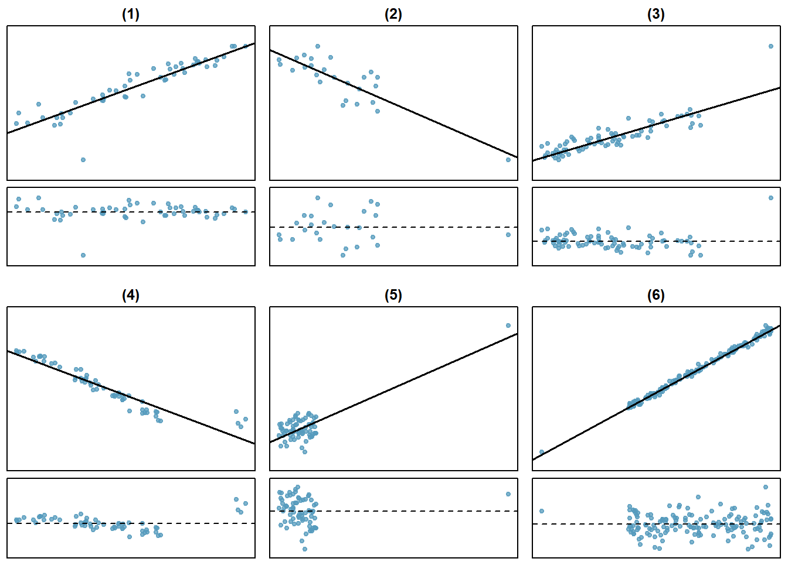
<p class="caption">(\#fig:resid282-fig)Examples of outliers and leverage points.</p>
</div>

1) There is one outlier far from the other points, though it only appears to slightly influence the line. This is an outlier in the response and will have a large residual in magnitude.   
2) There is one outlier on the right, though it is quite close to the least squares line, which suggests it wasn't very influential although it is a leverage point.  
3) There is one point far away from the cloud, and this leverage point appears to pull the least squares line up on the right; examine how the line around the primary cloud doesn't appear to fit very well. This point has a high influence on the estimated slope.   
4) There is a primary cloud and then a small secondary cloud of four outliers. The secondary cloud appears to be influencing the line somewhat strongly, making the least square line fit poorly almost everywhere. There might be an interesting explanation for the dual clouds, which is something that could be investigated.  
5) There is no obvious trend in the main cloud of points and the outlier on the right appears to largely control the slope of the least squares line. This point is an outlier in both the response and predictor.  It is a highly influential point.   
6) There is one outlier in both the response and predictor, thus a leverage point, far from the cloud, however, it falls quite close to the least squares line and does not appear to be very influential.  

Examining the residual plots in Figure \@ref(fig:resid282-fig), you will probably find that there is some trend in the main clouds of (3) and (4). In these cases, the outliers influenced the slope of the least squares lines. In (5), data with no clear trend were assigned a line with a large trend simply due to one outlier!
 
> Leverage   
Points that fall horizontally away from the center of the cloud tend to pull harder on the line, so we call them points with **high leverage**.

Points that fall horizontally far from the line are points of high leverage; these points can strongly influence the slope of the least squares line. If one of these high leverage points does appear to actually invoke its influence on the slope of the line -- as in cases (3), (4), and (5) -- then we call it an **influential point**. Usually we can say a point is influential if, had we fitted the line without it, the influential point would have been unusually far from the least squares line. Leverage can be calculated from what is called the **hat matrix**, the actual mathematics is beyond the scope of this book.  

A point can be an outlier but not a leverage point as we have already discussed. It is tempting to remove outliers from your data set. Don't do this without a very good reason. Models that ignore exceptional (and interesting) cases often perform poorly. For instance, if a financial firm ignored the largest market swings -- the ``outliers'' --  they would soon go bankrupt by making poorly thought-out investments.  

### Residuals vs Leverage Plot  

The residuals vs leverage plot is a good way to identify influential observations. Sometimes, influential observations are representative of the population, but they could also indicate an error in recording data, or an otherwise unrepresentative outlier. It could be worth looking into these cases. 


```r
plot(star_mod,5)
```

<div class="figure">

<p class="caption">(\#fig:diag286-fig)Diagnostic plots for Starbucks regression model.</p>
</div>

Figure \@ref(fig:diag286-fig) helps us to find influential cases, those leverage points that impact the estimated slope. Unlike the other plots, patterns are not relevant. We watch out for outlying values at the upper right corner or at the lower right corner. Those spots are the places where cases can be influential against a regression line. Look for cases outside of a dashed line, Cook’s distance. In our particular plot, a dotted line for Cook's distance was outside the bounds of the plot and thus did not come into play. When cases are outside of the Cook’s distance (meaning they have high Cook’s distance scores), the cases are influential to the regression results. The regression results will be altered if we exclude those cases. In this example, there are no points that tend to have undue influence.

### What If Our Assumptions Are Violated

If the assumptions of the model are violated and/or we have influential points, a linear regression model with normality assumptions is not appropriate. Sometimes it is appropriate to transform the data (either response or predictor), so that the assumptions are met on the transformed data. Other times, it is appropriate to explore other models. There are entire courses on regression where blocks of material are devoted to diagnostics and transformations to reduce the impact of violations of assumptions. We will not go into these methods in this book. Instead, when confronted with clear violated assumptions, we will use resampling as a possible solution. We will learn about this in the next chapter because it does not assume normality in the residuals. This is a limited solution, but as this is an introductory text, this is an excellent first step. 

## Homework Problems  

1. Identify relationships 

For each of the six plots in Figure \@ref(fig:hw1), identify the strength of the relationship (e.g. weak, moderate, or strong) in the data and whether fitting a linear model would be reasonable.  When we ask about the strength of the relationship, we mean:

- is there a relationship between $x$ and $y$ and
- does that relationship explain most of the variance?

<div class="figure">

<p class="caption">(\#fig:hw1)Homework problem 1.</p>
</div>

2. Beer and blood alcohol content 

We will use the blood alcohol content data again. As a reminder this is the description of the data: *Many people believe that gender, weight, drinking habits, and many other factors are much more important in predicting blood alcohol content (BAC) than simply considering the number of drinks a person consumed. Here we examine data from sixteen student volunteers at Ohio State University who each drank a randomly assigned number of cans of beer. These students were evenly divided between men and women, and they differed in weight and drinking habits. Thirty minutes later, a police officer measured their blood alcohol content (BAC) in grams of alcohol per deciliter of blood.* 

The data is in the `bac.csv` file under the `data` folder.

a. Obtain and interpret $R$-squared for this model.   
b. Evaluate the assumptions of this model. Do we have anything to be concerned about?  

3. Outliers 

Identify the outliers in the scatterplots shown in Figure \@ref(fig:hw3) and determine what type of outliers they are. Explain your reasoning. 

<div class="figure">

<p class="caption">(\#fig:hw3)Homework problem 3.</p>
</div>


<!--chapter:end:28-Regression-Diagnostics.Rmd-->

# Simulation Based Linear Regression {#LRSIM}


## Objectives

1) Using the bootstrap, generate confidence intervals and estimates of standard error for parameter estimates from a linear regression model.  
2) Generate and interpret bootstrap confidence intervals for predicted values.  
3) Generate bootstrap samples from sampling rows of the data or sampling residuals. Explain why you might prefer one over the other.  
4) Interpret regression coefficients for a linear model with a categorical explanatory variable.  

## Introduction

In the last couple of chapters we examined how to perform inference for a simple linear regression model assuming the errors were independent normally distributed random variables. We examined diagnostic tools to check assumptions and look for outliers. In this chapter we will use the **bootstrap** to create confidence and prediction intervals.

There are at least two ways we can consider creating a bootstrap distribution for a linear model. We can easily fit a linear model to a resampled data set. But in some situations this may have undesirable features. Influential observations, for example, will appear duplicated in some resamples and be missing entirely from other resamples.  

Another option is to use “residual resampling". In residual resampling, the new data set has all of the predictor values from the original data set and a new response is created by adding to the fitted function a resampled residual.

In summary, suppose we have $n$ observations, each with $Y$ and some number of $X$'s, with each observation stored as a row in a data set. The two basic procedures when bootstrapping regression are:  
a. bootstrap observations, and   
b. bootstrap residuals.  
The latter is a special case of a more general rule: sample $Y$ from its estimated conditional distribution given $X$.   

In bootstrapping observations, we sample with replacement from the rows of the data; each $Y$ comes with the corresponding $X$'s. In any bootstrap sample some observations may be repeated multiple times, and others not included. This is the same idea we used before when we used the bootstrap for hypothesis testing.   

In bootstrapping residuals, we fit the regression model, compute predicted values $\hat{Y}_i$ and residuals $e_i = Y_i - \hat{Y}_i$, then create a bootstrap sample using the same $X$ values as in the original data, but with new $Y$ values obtained using the prediction plus a random residual, $Y^{*}_i = \hat{Y}_i + e^{*}_i$, where the residuals $e^{*}_i$ are sampled randomly with replacement from the original residuals. We still have the chance of selecting a large residual from an outlier, but if it paired with an $x$ value near $\bar{x}$, it will have little leverage.   

Bootstrapping residuals corresponds to a designed experiment, where the $x$ values are fixed and only $Y$ is random. If we bootstrap observations, then essentially both $X$ and $Y$ are sampled. By the principle of sampling the way the data were drawn, the second method implies that both $Y$ and $X$ are random.

## Confidence intervals for parameters  

To build a confidence interval for the slope parameter, we will resample the data or residuals and generate a new regression model. This process does not assume normality of the residuals. We will use functions from the **mosaic** package to complete this work. However, know that **tidymodels** and **purrr** are more sophisticated tools for doing this work.

### Resampling  

To make this ideas more salient, let's use the Starbucks example again.

First read the data into `R`:


```r
starbucks <- read_csv("data/starbucks.csv")
```

Build the model:


```r
star_mod <- lm(calories~carb,data=starbucks)
```

Let's see the output of the model:


```r
summary(star_mod)
```

```
## 
## Call:
## lm(formula = calories ~ carb, data = starbucks)
## 
## Residuals:
##      Min       1Q   Median       3Q      Max 
## -151.962  -70.556   -0.636   54.908  179.444 
## 
## Coefficients:
##             Estimate Std. Error t value Pr(>|t|)    
## (Intercept) 146.0204    25.9186   5.634 2.93e-07 ***
## carb          4.2971     0.5424   7.923 1.67e-11 ***
## ---
## Signif. codes:  0 '***' 0.001 '**' 0.01 '*' 0.05 '.' 0.1 ' ' 1
## 
## Residual standard error: 78.26 on 75 degrees of freedom
## Multiple R-squared:  0.4556,	Adjusted R-squared:  0.4484 
## F-statistic: 62.77 on 1 and 75 DF,  p-value: 1.673e-11
```


In preparation for resampling, let's see how `do()` treats a linear model object.


```r
set.seed(401)
obs<-do(1)*star_mod
obs
```

```
##   Intercept     carb    sigma r.squared        F numdf dendf .row .index
## 1  146.0204 4.297084 78.25956 0.4556237 62.77234     1    75    1      1
```

Nice. To resample the data we use `do()` with `resample()`. This will sample the rows, what we were referring to above as the first method.


```r
do(2)*lm(calories~carb,data=resample(starbucks))
```

```
##   Intercept     carb    sigma r.squared        F numdf dendf .row .index
## 1  145.6345 4.089065 73.32243 0.4980692 74.42299     1    75    1      1
## 2  160.0193 3.828742 66.81016 0.4298148 56.53621     1    75    1      2
```

Perfect, we are ready to scale up.


```r
set.seed(532)
results <- do(1000)*lm(calories~carb,data=resample(starbucks))
```

Now let's look at the first 6 rows of `results`.


```r
head(results)
```

```
##   Intercept     carb    sigma r.squared        F numdf dendf .row .index
## 1  154.7670 4.176327 78.94717 0.4127581 52.71568     1    75    1      1
## 2  166.8589 3.807697 72.09482 0.4032196 50.67437     1    75    1      2
## 3  105.3658 4.899956 77.62517 0.5310212 84.92195     1    75    1      3
## 4  227.4138 2.805156 79.97902 0.2467094 24.56317     1    75    1      4
## 5  194.9190 3.457191 83.74624 0.2670279 27.32313     1    75    1      5
## 6  183.1159 3.549460 73.90153 0.3931691 48.59292     1    75    1      6
```

If we plot all the slopes, the red lines in Figure \@ref(fig:slope291-fig), we get a sense of the variability in the estimated slope and intercept. This also gives us an idea of the width of the confidence interval on the estimated mean response. We plotted the confidence interval in a gray shade and we can see it matches the red shaded region of the bootstrap slopes. We can see that the confidence interval will be wider at the extreme values of the predictor. 


```r
ggplot(starbucks, aes(x=carb, y=calories)) +
  geom_abline(data = results,
              aes(slope =  carb, intercept = Intercept), 
              alpha = 0.01,color="red") +
  geom_point() +
  theme_classic() +
  labs(x="Carbohydrates (g)",y="Calories",title="Bootstrap Slopes",subtitle ="1000 Slopes") +
  geom_lm(interval="confidence")
```

<div class="figure">

<p class="caption">(\#fig:slope291-fig)Plot of slopes from resampled regression.</p>
</div>


With all this data in `results`, we can generate confidence intervals for the slope, $R$-squared ($R^2$), and the $F$ statistic. Figure \@ref(fig:hist291-fig) is a histogram of slope values from resampling.


```r
results %>%
  gf_histogram(~carb,fill="cyan",color = "black") %>%
  gf_vline(xintercept = obs$carb,color="red") %>%
  gf_theme(theme_bw()) %>%
  gf_labs(x="Carbohydrate regression slope.",y="")
```

<div class="figure">

<p class="caption">(\#fig:hist291-fig)Histogram of slopes from resampled regression.</p>
</div>

The confidence interval is found using `cdata()`.


```r
cdata(~carb,data=results,p=0.95)
```

```
##         lower    upper central.p
## 2.5% 3.166546 5.377743      0.95
```

We are 95% confident that the true slope is between 3.17 and 5.37. As a reminder, using the normality assumption we had a 95% confidence interval of $(3.21,5.38)$:


```r
confint(star_mod)
```

```
##                 2.5 %     97.5 %
## (Intercept) 94.387896 197.652967
## carb         3.216643   5.377526
```
The bootstrap confidence interval for $R^2$ is:


```r
cdata(~r.squared,data=results)
```

```
##          lower     upper central.p
## 2.5% 0.2837033 0.6234751      0.95
```

And the bootstrap sampling distribution of $R^2$ is displayed in Figure \@ref(fig:hist292-fig).

(ref:ref291) A histogram of the $R^2$ values from resampled regression.  


```r
results %>%
  gf_histogram(~r.squared,fill="cyan",color="black") %>%
  gf_vline(xintercept = obs$r.squared,color="red") %>%
  gf_theme(theme_classic()) %>%
  gf_labs(y="",x=expression(R^2))
```

<div class="figure">

<p class="caption">(\#fig:hist292-fig)(ref:ref291)</p>
</div>

This is nice work. So powerful.

Let's see how we could accomplish this same work using the **infer** package.


```r
library(infer)
```

To check that we can use this package, let's find the slope estimate.


```r
slope_estimate <- starbucks %>%
  specify(calories ~ carb) %>%
  calculate(stat="slope")
```


```r
slope_estimate
```

```
## Response: calories (numeric)
## Explanatory: carb (numeric)
## # A tibble: 1 x 1
##    stat
##   <dbl>
## 1  4.30
```

Good, let's get the bootstrap sampling distribution of the regression slope.


```r
results2 <- starbucks %>%
  specify(calories~carb) %>%
  generate(reps=1000,type="bootstrap") %>%
  calculate(stat="slope")
head(results2)
```

```
## Response: calories (numeric)
## Explanatory: carb (numeric)
## # A tibble: 6 x 2
##   replicate  stat
##       <int> <dbl>
## 1         1  3.75
## 2         2  5.43
## 3         3  3.76
## 4         4  4.69
## 5         5  4.38
## 6         6  3.63
```

Next the confidence interval.  


```r
slope_ci<-results2 %>%
  get_confidence_interval(level=0.95)
slope_ci
```

```
## # A tibble: 1 x 2
##   lower_ci upper_ci
##      <dbl>    <dbl>
## 1     3.14     5.26
```

This matches the work we have already done. Finally, let's visualize the results, Figure \@ref(fig:infer291-fig).


```r
results2 %>%
  visualize() +
  shade_confidence_interval(slope_ci,color="blue",fill="lightblue") +
  geom_vline(xintercept = slope_estimate$stat,color="black",size=2) +
  labs(x="Estimated Slope") +
  theme_bw()
```

<div class="figure">

<p class="caption">(\#fig:infer291-fig)Sampling distribution of the slope using resampling. (Black line is estimate slope from original data and blue lines are the confidence bounds.)</p>
</div>

### Resample residuals

We could also resample the residuals instead of the data. This makes a stronger assumption that the linear model is appropriate. However, it guarantees that every $X$ value is in the resample data frame. In the `lm` function, we send the model instead of the data to resample the residuals. Since `R` is an object oriented programming language, in sending a model object to the `resample()` function, the code automatically resample from the residuals.


```r
results_resid <- do(1000)*lm( calories~carb, data = resample(star_mod)) # resampled residuals
head(results_resid)
```

```
##   Intercept     carb    sigma r.squared        F numdf dendf .row .index
## 1  151.9999 4.356740 73.07024 0.4967052 74.01804     1    75    1      1
## 2  101.6226 5.280410 82.24346 0.5336627 85.82779     1    75    1      2
## 3  152.4453 4.346918 82.64249 0.4344055 57.60383     1    75    1      3
## 4  159.1311 3.846912 84.42784 0.3656236 43.22634     1    75    1      4
## 5  167.9957 3.981328 67.50240 0.4912807 72.42905     1    75    1      5
## 6  198.5458 3.239953 86.11143 0.2821237 29.47482     1    75    1      6
```

Next a plot of the bootstrap sampling distribution, Figure \@ref(fig:hist293-fig).


```r
results_resid %>%
  gf_histogram(~carb,fill="cyan",color="black") %>%
  gf_vline(xintercept = obs$carb,color="red") %>%
  gf_theme(theme_classic()) %>%
  gf_labs(x="Estimated slope of carbs",y="")
```

<div class="figure">
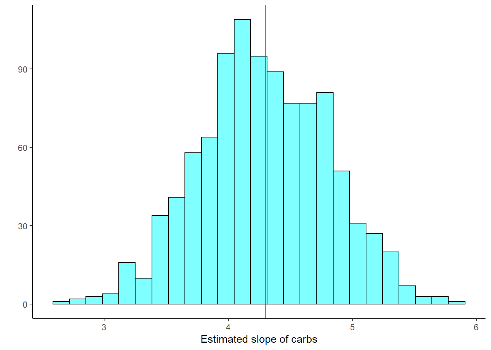
<p class="caption">(\#fig:hist293-fig)Histogram of estimated regression slope using resampling from residuals.</p>
</div>

And finally the confidence interval for the slope.


```r
cdata(~carb,data=results_resid)
```

```
##        lower    upper central.p
## 2.5% 3.24622 5.323031      0.95
```

Similar to the previous bootstrap confidence interval just a little narrower.

## Confidence intervals for prediction  

We now want to generate a confidence interval for the average calories from 60 grams of carbohydrates.  

Using the normal assumption, we had


```r
predict(star_mod,newdata = data.frame(carb=60),interval="confidence")
```

```
##        fit      lwr      upr
## 1 403.8455 379.7027 427.9883
```

We have all the bootstrap slope and intercept estimates in the `results` object. We can use `tidyverse` functions to find the confidence interval by predicting the response for each of these slope and intercept estimate.


```r
head(results)
```

```
##   Intercept     carb    sigma r.squared        F numdf dendf .row .index
## 1  154.7670 4.176327 78.94717 0.4127581 52.71568     1    75    1      1
## 2  166.8589 3.807697 72.09482 0.4032196 50.67437     1    75    1      2
## 3  105.3658 4.899956 77.62517 0.5310212 84.92195     1    75    1      3
## 4  227.4138 2.805156 79.97902 0.2467094 24.56317     1    75    1      4
## 5  194.9190 3.457191 83.74624 0.2670279 27.32313     1    75    1      5
## 6  183.1159 3.549460 73.90153 0.3931691 48.59292     1    75    1      6
```


```r
results %>%
  mutate(pred=Intercept+carb*60) %>%
  cdata(~pred,data=.)
```

```
##         lower    upper central.p
## 2.5% 385.2706 423.6689      0.95
```

This is similar to the interval we found last chapter. We are 95% confident that the average calorie content for a menu item with 60 grams of carbohydrates is between 380.8 and 425.7.

### Prediction interval  

The prediction interval is more difficult to perform with a bootstrap. We would have to account for the variability of the slope but also the residual variability since this is an individual observation. We can't just add the residual to the predicted value. Remember the variance of a sum of independent variables is the sum of the variances. But here we have standard deviations and we can't just add them. 

Let's look at what would happen if we try. First as a reminder, the prediction interval at 60 grams of `carb` using the assumption of normally distributed errors from last lesson is:


```r
predict(star_mod,newdata = data.frame(carb=60),interval="prediction")
```

```
##        fit      lwr      upr
## 1 403.8455 246.0862 561.6048
```

If we are generating a bootstrap of size 1000, we will resample from the residuals 1000 times.


```r
results %>%
  mutate(pred=Intercept+carb*60) %>% 
  cbind(resid=sample(star_mod$residuals,size=1000,replace = TRUE)) %>%
  mutate(pred_ind=pred+resid) %>%
  cdata(~pred_ind,data=.)
```

```
##         lower    upper central.p
## 2.5% 277.4886 577.0957      0.95
```

This prediction interval appears to be biased. Thus generating a prediction interval is beyond the scope of this book.  

## Categorical predictor  

We want to finish up simple linear regression by discussing a categorical predictor. It somewhat changes the interpretation of the regression model.

Thus far, we have only discussed regression in the context of a quantitative, continuous, response AND a quantitative, continuous, predictor. We can build linear models with categorical predictor variables as well. 

In the case of a binary covariate, nothing about the linear model changes. The two levels of the binary covariate are typically coded as 1 and 0, and the model is built, evaluated and interpreted in an analogous fashion as before. The difference between the continuous predictor and categorical is that there are only two values the predictor can take and the regression model will simply predict the average value of the response within each value of the predictor.

In the case of a categorical covariate with $k$ levels, where $k>2$, we need to include $k-1$ *dummy variables* in the model. Each of these dummy variables takes the value 0 or 1. For example, if a covariate has $k=3$ categories or levels (say A, B or C), we create two dummy variables, $X_1$ and $X_2$, each of which can only take values 1 or 0. We arbitrarily state that if $X_1=1$, it represents the covariate has the value A. Likewise if $X_2=1$, then we state that the covariate takes the value B. If both $X_1=0$ and $X_2=0$, this is known as the reference category, and in this case the covariate takes the value C. The arrangement of the levels of the categorical covariate are arbitrary and can be adjusted by the user. This coding of the covariate into dummy variables is called **contrasts** and again is typically taught in a more advanced course on linear models.

In the case $k=3$, the linear model is $Y=\beta_0 + \beta_1X_1 + \beta_2X_2+e$. 

When the covariate takes the value A, $\mbox{E}(Y|X=A)=\beta_0 + \beta_1$. 

When the covariate takes the value B, $\mbox{E}(Y|X=B)=\beta_0 + \beta_2$. 

When the covariate takes the value C, $\mbox{E}(Y|X=C)=\beta_0$. 

Based on this, think about how you would interpret the coefficients $\beta_0$, $\beta_1$, and $\beta_2$. 

### Lending Club 

Let's do an example with some data.  

The Lending Club data set represents thousands of loans made through the Lending Club platform, which is a platform that allows individuals to lend to other individuals. Of course, not all loans are created equal. Someone who is essentially a sure bet to pay back a loan will have an easier time getting a loan with a low interest rate than someone who appears to be riskier. And for people who are very risky? They may not even get a loan offer, or they may not have accepted the loan offer due to a high interest rate. It is important to keep that last part in mind, since this data set only represents loans actually made, i.e. do not mistake this data for loan applications! The data set is `loans.csv` from the `data` folder.


```r
loans <- read_csv("data/loans.csv")
```

Let's look at the size of the data:


```r
dim(loans)
```

```
## [1] 10000    55
```

This is a big data set. For educational purposes, we will sample 100 points from the original data. We only need the variables `interest_rate` and `homeownership`. First let's break down the `homeownership` variable.


```r
tally(~homeownership,data=loans,format="proportion")
```

```
## homeownership
## MORTGAGE      OWN     RENT 
##   0.4789   0.1353   0.3858
```

We want to sample the data so that each level of home ownership has the same proportion as the original, a stratified sample.


```r
set.seed(905)
loans100 <- loans %>%
  select(interest_rate,homeownership) %>%
  mutate(homeownership=factor(homeownership)) %>%
  group_by(homeownership) %>%
  slice_sample(prop=0.01) %>%
  ungroup()
```


```r
dim(loans100)
```

```
## [1] 98  2
```

Not quite a 100 observations, but we preserved the proportion of homeownership.


```r
tally(~homeownership,data=loans100,format="proportion")
```

```
## homeownership
##  MORTGAGE       OWN      RENT 
## 0.4795918 0.1326531 0.3877551
```

Let's look at the data with a boxplot, Figure \@ref(fig:box291-fig).


```r
loans100 %>%
  gf_boxplot(interest_rate~homeownership) %>%
  gf_theme(theme_classic()) %>%
  gf_labs(title="Lending Club",x="Homeownership",y="Interest Rate")
```

<div class="figure">

<p class="caption">(\#fig:box291-fig)Boxplot of loan interest rates from the Lending Club based on homeownership status.</p>
</div>

It appears that there is some evidence that home ownership impacts the interest rate. We can build a linear model to explore whether this difference in significant. We can use the `lm()` function in `R`, but in order to include a categorical predictor, we need to make sure that variable is stored as a "factor" type. If it is not, we'll need to convert it. 


```r
str(loans100)
```

```
## tibble [98 x 2] (S3: tbl_df/tbl/data.frame)
##  $ interest_rate: num [1:98] 19.03 9.44 6.07 7.96 10.9 ...
##  $ homeownership: Factor w/ 3 levels "MORTGAGE","OWN",..: 1 1 1 1 1 1 1 1 1 1 ...
```

Now we can build the model: 


```r
loan_mod<-lm(interest_rate ~ homeownership,data=loans100)
summary(loan_mod)
```

```
## 
## Call:
## lm(formula = interest_rate ~ homeownership, data = loans100)
## 
## Residuals:
##     Min      1Q  Median      3Q     Max 
## -7.5442 -3.1472  0.1628  2.1228 12.9658 
## 
## Coefficients:
##                   Estimate Std. Error t value Pr(>|t|)    
## (Intercept)        10.4972     0.5889  17.825  < 2e-16 ***
## homeownershipOWN    2.6135     1.2652   2.066  0.04158 *  
## homeownershipRENT   2.3570     0.8808   2.676  0.00878 ** 
## ---
## Signif. codes:  0 '***' 0.001 '**' 0.01 '*' 0.05 '.' 0.1 ' ' 1
## 
## Residual standard error: 4.037 on 95 degrees of freedom
## Multiple R-squared:  0.08517,	Adjusted R-squared:  0.06591 
## F-statistic: 4.422 on 2 and 95 DF,  p-value: 0.01458
```

Note that by default, `R` set the `MORTGAGE` level as the reference category. This is because it is first value when sorted alphabetically. You can control this by changing the order of the factor levels. The package **forcats** helps with this effort. 

How would we interpret this output? Since `MORTGAGE` is the reference category, the intercept is effectively the estimated, average, interest rate for home owners with a mortgage. 


```r
loans100 %>%
  filter(homeownership == "MORTGAGE") %>%
  summarise(average=mean(interest_rate))
```

```
## # A tibble: 1 x 1
##   average
##     <dbl>
## 1    10.5
```

The other terms represent the expected difference in average interest rates for the ownership types. 


```r
loans100 %>%
  group_by(homeownership) %>%
  summarise(average=mean(interest_rate),std_dev=sd(interest_rate))
```

```
## # A tibble: 3 x 3
##   homeownership average std_dev
##   <fct>           <dbl>   <dbl>
## 1 MORTGAGE         10.5    3.44
## 2 OWN              13.1    2.89
## 3 RENT             12.9    4.94
```


Specifically, on average, loan interest rates for home owners who own their home is 2.61 percentage points higher than those with a mortgage. Those who rent is 2.36 percent higher on average. The highest interest rate is for those who own their own home. This seems odd but it is interesting.

>**Exercise**:  
Using the coefficient from the regression model, how do we find the difference in average interest rates between home owners and renters?  

The first coefficient 
$$\beta_\text{homeownershipOWN} = \mu_\text{OWN} - \mu_\text{MORTGAGE}$$  
and $$\beta_\text{homeownershipRENT} = \mu_\text{RENT} - \mu_\text{MORTGAGE}.$$ 
Thus $$\mu_\text{OWN} -\mu_\text{RENT} = \beta_\text{homeownershipOWN} - \beta_\text{homeownershipRENT},$$ the difference in coefficients.

The model is not fitting a line to the data but just estimating average with the coefficients representing difference from the reference level.

The `Std.Error`, `t value`, and `Pr(>|t|)` values can be used to conduct inference about the respective estimates. Both p-values are significant. This is similar to the ANOVA analysis we conducted last block except that hypothesis test was simultaneously testing all coefficients and here we are testing them pairwise. 

### Bootstrap

From the boxplots, the biggest difference in means is between home owners and those with a mortgage. However, in the regression output there is no p-value to test the difference between owners and renters. An easy solution would be to change the reference level but what if you had many levels? How would you know which ones to test? In the next section we will look at multiple comparisons but before then we can use the bootstrap to help us.

Let's bootstrap the regression.


```r
set.seed(532)
results <- do(1000)*lm(interest_rate ~ homeownership,data=resample(loans100))
```


```r
head(results)
```

```
##   Intercept homeownershipOWN homeownershipRENT    sigma  r.squared        F
## 1   9.98300         2.088250          2.110000 3.832758 0.07223701 3.698421
## 2  11.04875         3.868250          1.449750 3.421090 0.11065485 5.910085
## 3  10.52865         3.200096          2.065557 3.958047 0.08231134 4.260474
## 4  11.10000         2.572000          2.163000 4.752496 0.05494338 2.761539
## 5  10.52939         2.459703          1.214033 4.157461 0.03970813 1.964128
## 6  10.08280         4.100533          2.531745 3.650730 0.16435823 9.342539
##   numdf dendf .row .index
## 1     2    95    1      1
## 2     2    95    1      2
## 3     2    95    1      3
## 4     2    95    1      4
## 5     2    95    1      5
## 6     2    95    1      6
```


We of course can generate a confidence interval on either of the coefficients in the `results` object.


```r
obs<-do(1)*loan_mod
obs
```

```
##   Intercept homeownershipOWN homeownershipRENT    sigma  r.squared        F
## 1  10.49723         2.613535          2.356976 4.037396 0.08516582 4.421978
##   numdf dendf .row .index
## 1     2    95    1      1
```

Figure \@ref(fig:hist297-fig) is a histogram of the estimated coefficient for those that own their home.


```r
results %>%
  gf_histogram(~homeownershipOWN,fill="cyan",color="black") %>%
  gf_vline(xintercept = obs$homeownershipOWN,color="red") %>%
  gf_theme(theme_classic()) %>%
  gf_labs(y="",x="Homeownership (Own).")
```

```
## Warning: geom_vline(): Ignoring `mapping` because `xintercept` was provided.
```

<div class="figure">

<p class="caption">(\#fig:hist297-fig)Distribution of estimated regression coefficent for homeownership.</p>
</div>


```r
cdata(~homeownershipOWN,data=results)
```

```
##          lower    upper central.p
## 2.5% 0.7674164 4.489259      0.95
```

Which is similar to the results assuming normality.


```r
confint(loan_mod)
```

```
##                       2.5 %    97.5 %
## (Intercept)       9.3280904 11.666378
## homeownershipOWN  0.1018118  5.125259
## homeownershipRENT 0.6083964  4.105557
```

However, we want a confidence interval for the difference between home owners and renters.


```r
results %>%
  mutate(own_rent=homeownershipOWN - homeownershipRENT) %>%
  cdata(~own_rent,data=.)
```

```
##          lower    upper central.p
## 2.5% -1.943183 2.536296      0.95
```

Done! From this interval we can infer that home owners that own their home and those that rent do not have significantly different interest rates.

### ANOVA Table

As a reminder, we could also report the results of loans analysis using an *analysis of variance*, or ANOVA, table. 


```r
anova(loan_mod)
```

```
## Analysis of Variance Table
## 
## Response: interest_rate
##               Df  Sum Sq Mean Sq F value  Pr(>F)  
## homeownership  2  144.16  72.081   4.422 0.01458 *
## Residuals     95 1548.55  16.301                  
## ---
## Signif. codes:  0 '***' 0.001 '**' 0.01 '*' 0.05 '.' 0.1 ' ' 1
```

This table lays out how the variation between observations is broken down. This is a simultaneous test of equality of the three means. Using the $F$-statistic, we would reject the null hypothesis of no differences in mean response across levels of the categorical variable. Notice it is the same p-value reported for the $F$ distribution in the regression summary.

### Pairwise Comparisons

The ANOVA table above (along with the summary of the linear model output before that) merely tells you whether any difference exists in the mean response across the levels of the categorical predictor. It does not tell you where that difference lies. In the case of using regression we can compare `MORTGAGE` to the other two levels but can't conduct a hypothesis of `OWN` vs `RENT`.  In order to make all pairwise comparisons, we need another tool. A common one is the Tukey method. Essentially, the Tukey method conducts three hypothesis tests (each under the null of no difference in mean) but corrects the $p$-values based on the understanding that we are conducting three simultaneous hypothesis tests with the same set of data and we don't want to inflate the Type 1 error. 

We can obtain these pairwise comparisons using the `TukeyHSD()` function in `R`. The "HSD" stands for "Honest Significant Differences". This function requires an `anova` object, which is obtained by using the `aov()` function: 


```r
TukeyHSD(aov(interest_rate~homeownership, data=loans100))
```

```
##   Tukey multiple comparisons of means
##     95% family-wise confidence level
## 
## Fit: aov(formula = interest_rate ~ homeownership, data = loans100)
## 
## $homeownership
##                     diff        lwr      upr     p adj
## OWN-MORTGAGE   2.6135352 -0.3988868 5.625957 0.1025289
## RENT-MORTGAGE  2.3569765  0.2598263 4.454127 0.0236346
## RENT-OWN      -0.2565587 -3.3453062 2.832189 0.9786730
```

According to this output, only the average interest rate for those with a mortgage is different from renters. 

## Assumptions

Keep in mind that ANOVA is a special case of a simple linear model. Therefore, all of the assumptions remain the same except for the linearity. The order of the levels is irrelevant and thus a line does not need to go through the three levels. In order to evaluate these assumptions, we would need to obtain the appropriate diagnostic plots. 


```r
plot(loan_mod,2)
```

<div class="figure">
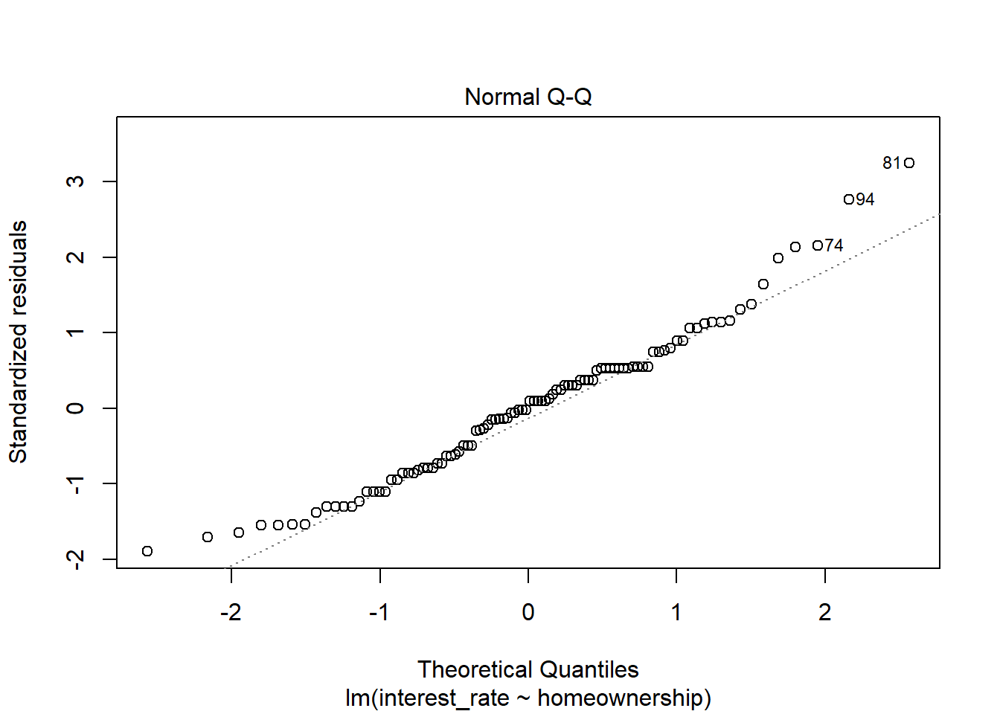
<p class="caption">(\#fig:diag291-fig)Q-Q normality plot.</p>
</div>

Figure \@ref(fig:diag291-fig) shows that normality is suspect but we have a large sample size and thus we did not get much of a difference in results from the bootstrap which does not assume normality.


```r
plot(loan_mod,3)
```

<div class="figure">

<p class="caption">(\#fig:diag292-fig)Scale-location residual diagnostic plot.</p>
</div>

The assumption of equal variance is also suspect, Figure \@ref(fig:diag292-fig). The variance for the homeowners might be less than that for the other two.


```r
plot(loan_mod,5)
```

<div class="figure">

<p class="caption">(\#fig:diag293-fig)Residual plot for outliers and leverage points.</p>
</div>

We have three points that might be outliers but they are not too extreme, Figure \@ref(fig:diag293-fig). In general, nothing in this plot is concerning to us.

## Homework Problems

We will use the `loans` data set again to create linear models. Remember this data set represents thousands of loans made through the Lending Club platform, which is a platform that allows individuals to lend to other individuals.

1. Loans  

In this exercise we will examine the relationship between interest rate and loan amount.  

a. Read in the data from `loans.csv` in the `data` folder.  
b. Create a subset of data of 200 observations with the following three variables `interest_rate`, `loan_amount`, and `term`. Change `term` into a factor and use a stratified sample to keep the proportion of loan terms roughly the same as the original data.  
c. Plot `interest_rate` versus `loan_amount`. We think `interest_rate` should be the response.  
d. Fit a linear model to the data by regressing `interest_rate` on `loan_amount`.  Is there a significant relationship between `interest_rate` and `loan_amount`?  
e. Using the $t$ distribution:  
   i. Find a 95% confidence interval for the slope.  
   ii. Find and interpret a 90% confidence interval for a loan amount of $20000  
f. Repeat part e using a bootstrap.  
g. Check the assumptions of linear regression.

2. Loans II

Using the `loans` data set of 200 observations from the previous exercise, use the variable `term` to determine if there is a difference in interest rates for the two different loan lengths.

a. Build a set of side-by-side boxplots that summarize interest rate by term. Describe the relationship you see. Note: You will have to convert the `term` variable to a factor prior to continuing.   
b. Build a linear model fitting interest rate against term. Does there appear to be a significant difference in mean interest rates by term?   
c. Write out the estimated linear model. In words, interpret the coefficient estimate.     
d. Construct a bootstrap confidence interval on the coefficient.  
e. Check model assumptions.  

<!--chapter:end:29-Simulation-Based-Linear-Regression.Rmd-->

# Multiple Linear Regression {#LRMULTI}

## Objectives

1) Create and interpret a model with multiple predictors and check assumptions.  
2) Generate and interpret confidence intervals for estimates.  
3) Explain adjusted $R^2$ and multi-collinearity.  
4) Interpret regression coefficients for a linear model with multiple predictors.    
5) Build and interpret models with higher order terms.

## Introduction to multiple regression  

The principles of simple linear regression lay the foundation for more sophisticated regression methods used in a wide range of challenging settings. In our last two chapters, we will explore multiple regression, which introduces the possibility of more than one predictor.

## Multiple regression  

Multiple regression extends simple two-variable regression to the case that still has one response but many predictors (denoted $x_1$, $x_2$, $x_3$, ...). The method is motivated by scenarios where many variables may be simultaneously connected to an output.

To explore and explain these ideas, we will consider Ebay auctions of a video game called **Mario Kart** for the Nintendo Wii. The outcome variable of interest is the total price of an auction, which is the highest bid plus the shipping cost. We will try to determine how total price is related to each characteristic in an auction while simultaneously controlling for other variables. For instance, with all other characteristics held constant, are longer auctions associated with higher or lower prices? And, on average, how much more do buyers tend to pay for additional Wii wheels (plastic steering wheels that attach to the Wii controller) in auctions? Multiple regression will help us answer these and other questions.

The data set is in the file `mariokart.csv` in the `data` folder. This data set includes results from 141 auctions.^[Diez DM, Barr CD, and \c{C}etinkaya-Rundel M. 2012. `openintro`: OpenIntro data sets and supplemental functions. http://cran.r-project.org/web/packages/openintro] Ten observations from this data set are shown in the `R` code below. Note that we force the first column to be interpreted as a character string since it is the identification code for each sale and has no numeric meaning. Just as in the case of simple linear regression, multiple regression also allows for categorical variables with many levels. Although we do have this type of variable in this data set, we will leave the discussion of these types of variables in multiple regression for advanced regression or machine learning courses.


```r
mariokart <-read_csv("data/mariokart.csv", col_types = list(col_character()))
head(mariokart,n=10)
```

```
## # A tibble: 10 x 12
##    id        duration n_bids cond  start_pr ship_pr total_pr ship_sp seller_rate
##    <chr>        <dbl>  <dbl> <chr>    <dbl>   <dbl>    <dbl> <chr>         <dbl>
##  1 15037742~        3     20 new       0.99    4        51.6 standa~        1580
##  2 26048337~        7     13 used      0.99    3.99     37.0 firstC~         365
##  3 32043234~        3     16 new       0.99    3.5      45.5 firstC~         998
##  4 28040522~        3     18 new       0.99    0        44   standa~           7
##  5 17039222~        1     20 new       0.01    0        71   media           820
##  6 36019515~        3     19 new       0.99    4        45   standa~      270144
##  7 12047772~        1     13 used      0.01    0        37.0 standa~        7284
##  8 30035550~        1     15 new       1       2.99     54.0 upsGro~        4858
##  9 20039206~        3     29 used      0.99    4        47   priori~          27
## 10 33036416~        7      8 used     20.0     4        50   firstC~         201
## # ... with 3 more variables: stock_photo <chr>, wheels <dbl>, title <chr>
```

We are only interested in `total_pr`, `cond`, `stock_photo`, `duration`, and `wheels`. These variables are described in the following list:

1. `total_pr`: final auction price plus shipping costs, in US dollars  
2. `cond`: a two-level categorical factor variable  
3. `stock_photo`: a two-level categorical factor variable  
4. `duration`: the length of the auction, in days, taking values from 1 to 10  
5. `wheels`: the number of Wii wheels included with the auction (a **Wii wheel** is a plastic racing wheel that holds the Wii controller and is an optional but helpful accessory for playing Mario Kart)   

### A single-variable model for the Mario Kart data  

Let's fit a linear regression model with the game's condition as a predictor of auction price. Before we start let's change `cond` and `stock_photo` into factors.


```r
mariokart <- mariokart %>%
  mutate(cond=factor(cond),stock_photo=factor(stock_photo))
```

Next let's summarize the data.


```r
inspect(mariokart)
```

```
## 
## categorical variables:  
##          name     class levels   n missing
## 1          id character    143 143       0
## 2        cond    factor      2 143       0
## 3     ship_sp character      8 143       0
## 4 stock_photo    factor      2 143       0
## 5       title character     80 142       1
##                                    distribution
## 1 110439174663 (0.7%) ...                      
## 2 used (58.7%), new (41.3%)                    
## 3 standard (23.1%), upsGround (21.7%) ...      
## 4 yes (73.4%), no (26.6%)                      
## 5  (%) ...                                     
## 
## quantitative variables:  
##             name   class   min      Q1 median      Q3       max         mean
## ...1    duration numeric  1.00   1.000    3.0    7.00     10.00     3.769231
## ...2      n_bids numeric  1.00  10.000   14.0   17.00     29.00    13.538462
## ...3    start_pr numeric  0.01   0.990    1.0   10.00     69.95     8.777203
## ...4     ship_pr numeric  0.00   0.000    3.0    4.00     25.51     3.143706
## ...5    total_pr numeric 28.98  41.175   46.5   53.99    326.51    49.880490
## ...6 seller_rate numeric  0.00 109.000  820.0 4858.00 270144.00 15898.419580
## ...7      wheels numeric  0.00   0.000    1.0    2.00      4.00     1.146853
##                sd   n missing
## ...1 2.585693e+00 143       0
## ...2 5.878786e+00 143       0
## ...3 1.506745e+01 143       0
## ...4 3.213179e+00 143       0
## ...5 2.568856e+01 143       0
## ...6 5.184032e+04 143       0
## ...7 8.471829e-01 143       0
```

Finally, let's plot the data.


```r
mariokart %>% 
  gf_boxplot(total_pr~cond) %>%
  gf_theme(theme_bw()) %>%
  gf_labs(title="Ebay Auction Prices",x="Condition", y="Total Price")
```

<div class="figure">

<p class="caption">(\#fig:box301-fig)Total price of Mario Kart on Ebay for each condition.</p>
</div>

We have several outliers that may impact our analysis, Figure \@ref(fig:box301-fig).

Now let's build the model.


```r
mario_mod <- lm(total_pr~cond,data=mariokart)
```


```r
summary(mario_mod)
```

```
## 
## Call:
## lm(formula = total_pr ~ cond, data = mariokart)
## 
## Residuals:
##     Min      1Q  Median      3Q     Max 
## -18.168  -7.771  -3.148   1.857 279.362 
## 
## Coefficients:
##             Estimate Std. Error t value Pr(>|t|)    
## (Intercept)   53.771      3.329  16.153   <2e-16 ***
## condused      -6.623      4.343  -1.525     0.13    
## ---
## Signif. codes:  0 '***' 0.001 '**' 0.01 '*' 0.05 '.' 0.1 ' ' 1
## 
## Residual standard error: 25.57 on 141 degrees of freedom
## Multiple R-squared:  0.01622,	Adjusted R-squared:  0.009244 
## F-statistic: 2.325 on 1 and 141 DF,  p-value: 0.1296
```

The model may be written as  

$$
\hat{\text{totalprice}} = 53.771 - 6.623 \times \text{condused}
$$  

A scatterplot for price versus game condition is shown in Figure \@ref(fig:scat301-fig). Since the predictor is binary, the scatterplot is not appropriate but we will look at it for reference.  


```r
mariokart %>%
  gf_point(total_pr~cond) %>%
  gf_theme(theme_classic()) %>%
  gf_labs(title="Ebay Auction Prices",x="Condition", y="Total Price")
```

<div class="figure">

<p class="caption">(\#fig:scat301-fig)Scatterplot of total price of Mario Kart on Ebay versus condition.</p>
</div>

The largest outlier probably is significantly impacting the relationship in the model. If we find the mean and median for the two groups, we will see this.


```r
mariokart %>%
  group_by(cond) %>%
  summarize(xbar=mean(total_pr), stand_dev=sd(total_pr),xmedian=median(total_pr))
```

```
## # A tibble: 2 x 4
##   cond   xbar stand_dev xmedian
##   <fct> <dbl>     <dbl>   <dbl>
## 1 new    53.8      7.44    54.0
## 2 used   47.1     32.7     42.8
```

It appears that **used** items have a right skewed distribution where their average is higher because of at least one of the outliers.

There are at least two outliers in the plot. Let's gather more information about them.


```r
mariokart %>%
  filter(total_pr > 100)
```

```
## # A tibble: 2 x 12
##   id         duration n_bids cond  start_pr ship_pr total_pr ship_sp seller_rate
##   <chr>         <dbl>  <dbl> <fct>    <dbl>   <dbl>    <dbl> <chr>         <dbl>
## 1 110439174~        7     22 used      1       25.5     327. parcel          115
## 2 130335427~        3     27 used      6.95     4       118. parcel           41
## # ... with 3 more variables: stock_photo <fct>, wheels <dbl>, title <chr>
```

If you look at the variable `title` there were additional items in the sale for these two observations. Let's remove those two outliers and run the model again. Note that the reason we are removing them is not because they are annoying us and messing up our model. It is because we don't think they are representative of the population of interest. Figure \@ref(fig:scat302-fig) is a boxplot of the data with the outliers dropped.


```r
mariokart_new <- mariokart %>%
  filter(total_pr <= 100) %>% 
  select(total_pr,cond,stock_photo,duration,wheels)
```


```r
summary(mariokart_new)
```

```
##     total_pr       cond    stock_photo    duration          wheels     
##  Min.   :28.98   new :59   no : 36     Min.   : 1.000   Min.   :0.000  
##  1st Qu.:41.00   used:82   yes:105     1st Qu.: 1.000   1st Qu.:0.000  
##  Median :46.03                         Median : 3.000   Median :1.000  
##  Mean   :47.43                         Mean   : 3.752   Mean   :1.149  
##  3rd Qu.:53.99                         3rd Qu.: 7.000   3rd Qu.:2.000  
##  Max.   :75.00                         Max.   :10.000   Max.   :4.000
```


```r
mariokart_new %>% 
  gf_boxplot(total_pr~cond) %>%
  gf_theme(theme_bw()) %>%
  gf_labs(title="Ebay Auction Prices",subtitle="Outliers removed",x="Condition", y="Total Price")
```

<div class="figure">
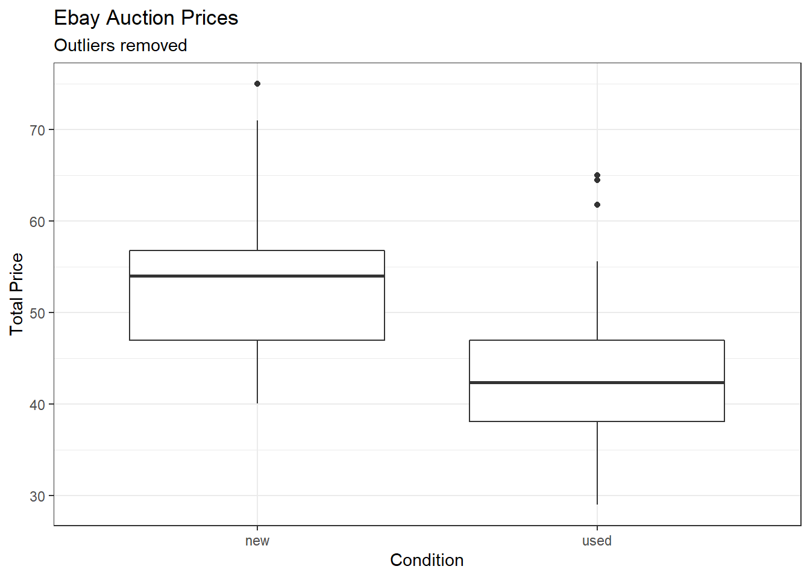
<p class="caption">(\#fig:scat302-fig)Boxplot of total price and condition with outliers removed.</p>
</div>


```r
mario_mod2 <- lm(total_pr~cond,data=mariokart_new)
```


```r
summary(mario_mod2)
```

```
## 
## Call:
## lm(formula = total_pr ~ cond, data = mariokart_new)
## 
## Residuals:
##      Min       1Q   Median       3Q      Max 
## -13.8911  -5.8311   0.1289   4.1289  22.1489 
## 
## Coefficients:
##             Estimate Std. Error t value Pr(>|t|)    
## (Intercept)  53.7707     0.9596  56.034  < 2e-16 ***
## condused    -10.8996     1.2583  -8.662 1.06e-14 ***
## ---
## Signif. codes:  0 '***' 0.001 '**' 0.01 '*' 0.05 '.' 0.1 ' ' 1
## 
## Residual standard error: 7.371 on 139 degrees of freedom
## Multiple R-squared:  0.3506,	Adjusted R-squared:  0.3459 
## F-statistic: 75.03 on 1 and 139 DF,  p-value: 1.056e-14
```

Notice how much the residual standard error has decreased and likewise the $R$-squared has increased.   

The model may be written as:  

$$
\hat{total price} = 53.771 - 10.90 \times condused
$$

Now we see that the average price for a used items is \$10.90 less than the average of new items. 

> **Exercise**:  
Does the linear model seem reasonable? Which assumptions should you check?

The model does seem reasonable in the sense that the assumptions on the errors is plausible. The residuals indicate some skewness to the right which may be driven predominantly by the skewness in the new items, Figure \@ref(fig:qq301-fig). 


```r
plot(mario_mod2,2)
```

<div class="figure">

<p class="caption">(\#fig:qq301-fig)Check of normality using quantile-quantile plot.</p>
</div>

The normality assumption is somewhat suspect but we have more than 100 data points so the short tails of the distribution are not a concern. The shape of this curve indicates a positive skew.


```r
plot(mario_mod2,3)
```

<div class="figure">

<p class="caption">(\#fig:diag301-fig)Residual plot to assess equal variance assumption.</p>
</div>

From Figure \@ref(fig:diag301-fig), equal variance seems reasonable. 


```r
plot(mario_mod2,5)
```

<div class="figure">

<p class="caption">(\#fig:diag302-fig)Residual plot for checking leverage points.</p>
</div>

No high leverage points, Figure \@ref(fig:diag302-fig). 

No need to check linearity, we only have two different values for the explanatory variable.

> *Example*: Interpretation  
Interpret the coefficient for the game's condition in the model. Is this coefficient significantly different from 0?

Note that `cond` is a two-level categorical variable and the reference level is `new`. So - 10.90 means that the model predicts an extra \$10.90 on average for those games that are new versus those that are used. Examining the regression output, we can see that the p-value for `cond` is very close to zero, indicating there is strong evidence that the coefficient is different from zero when using this simple one-variable model.

### Including and assessing many variables in a model  

Sometimes there are underlying structures or relationships between predictor variables. For instance, new games sold on Ebay tend to come with more Wii wheels, which may have led to higher prices for those auctions. We would like to fit a model that includes all potentially important variables simultaneously. This would help us evaluate the relationship between a predictor variable and the outcome while controlling for the potential influence of other variables. This is the strategy used in **multiple regression**. While we remain cautious about making any causal interpretations using multiple regression, such models are a common first step in providing evidence of a causal connection.

We want to construct a model that accounts for not only the game condition, but simultaneously accounts for three other variables: `stock_photo`, `duration`, and `wheels`. This model can be represented as:

$$
\widehat{\text{totalprice}}
	= \beta_0 + \beta_1 \times \text{cond} + \beta_2 \times \text{stockphoto} 
	+ \beta_3 \times  \text{duration} +
		\beta_4 \times  \text{wheels} 
$$	

or:

\begin{equation} 
 \hat{y}
	= \beta_0 + \beta_1 x_1 + \beta_2 x_2 +
		\beta_3 x_3 + \beta_4 x_4
  (\#eq:multilr)
\end{equation} 


In Equation \@ref(eq:multilr), $y$ represents the total price, $x_1$ indicates whether the game is new, $x_2$ indicates whether a stock photo was used, $x_3$ is the duration of the auction, and $x_4$ is the number of Wii wheels included with the game. Just as with the single predictor case, a multiple regression model may be missing important components or it might not precisely represent the relationship between the outcome and the available explanatory variables. While no model is perfect, we wish to explore the possibility that this model may fit the data reasonably well.

We estimate the parameters $\beta_0$, $\beta_1$, ..., $\beta_4$ in the same way as we did in the case of a single predictor. We select $b_0$, $b_1$, ..., $b_4$ that minimize the sum of the squared residuals:

$$
\text{SSE} = e_1^2 + e_2^2 + \dots + e_{141}^2
	= \sum_{i=1}^{141} e_i^2
	 = \sum_{i=1}^{141} \left(y_i - \hat{y}_i\right)^2
$$  

In our problem, there are 141 residuals, one for each observation. We use a computer to minimize the sum and compute point estimates.


```r
mario_mod_multi <- lm(total_pr~., data=mariokart_new)
```

The formula `total_pr~.` uses a *dot*. This means we want to use all the predictors. We could have also used the following code:


```r
mario_mod_multi <- lm(total_pr~cond+stock_photo+duration+wheels, data=mariokart_new)
```

Recall, the `+` symbol does not mean to literally add the predictors together. It is not a mathematical operation but a formula operation that means to include the predictor.

You can view a summary of the model using the `summmary()` function.


```r
summary(mario_mod_multi)
```

```
## 
## Call:
## lm(formula = total_pr ~ ., data = mariokart_new)
## 
## Residuals:
##      Min       1Q   Median       3Q      Max 
## -11.3788  -2.9854  -0.9654   2.6915  14.0346 
## 
## Coefficients:
##                Estimate Std. Error t value Pr(>|t|)    
## (Intercept)    41.34153    1.71167  24.153  < 2e-16 ***
## condused       -5.13056    1.05112  -4.881 2.91e-06 ***
## stock_photoyes  1.08031    1.05682   1.022    0.308    
## duration       -0.02681    0.19041  -0.141    0.888    
## wheels          7.28518    0.55469  13.134  < 2e-16 ***
## ---
## Signif. codes:  0 '***' 0.001 '**' 0.01 '*' 0.05 '.' 0.1 ' ' 1
## 
## Residual standard error: 4.901 on 136 degrees of freedom
## Multiple R-squared:  0.719,	Adjusted R-squared:  0.7108 
## F-statistic: 87.01 on 4 and 136 DF,  p-value: < 2.2e-16
```

Which we can summarize in a tibble using the **broom** package.  

<table>
<caption>(\#tab:tab301)Multiple regression coefficients.</caption>
 <thead>
  <tr>
   <th style="text-align:left;"> term </th>
   <th style="text-align:right;"> estimate </th>
   <th style="text-align:right;"> std.error </th>
   <th style="text-align:right;"> statistic </th>
   <th style="text-align:right;"> p.value </th>
  </tr>
 </thead>
<tbody>
  <tr>
   <td style="text-align:left;"> (Intercept) </td>
   <td style="text-align:right;"> 41.3415318 </td>
   <td style="text-align:right;"> 1.7116684 </td>
   <td style="text-align:right;"> 24.1527693 </td>
   <td style="text-align:right;"> 0.0000000 </td>
  </tr>
  <tr>
   <td style="text-align:left;"> condused </td>
   <td style="text-align:right;"> -5.1305641 </td>
   <td style="text-align:right;"> 1.0511238 </td>
   <td style="text-align:right;"> -4.8810276 </td>
   <td style="text-align:right;"> 0.0000029 </td>
  </tr>
  <tr>
   <td style="text-align:left;"> stock_photoyes </td>
   <td style="text-align:right;"> 1.0803108 </td>
   <td style="text-align:right;"> 1.0568238 </td>
   <td style="text-align:right;"> 1.0222241 </td>
   <td style="text-align:right;"> 0.3084897 </td>
  </tr>
  <tr>
   <td style="text-align:left;"> duration </td>
   <td style="text-align:right;"> -0.0268075 </td>
   <td style="text-align:right;"> 0.1904122 </td>
   <td style="text-align:right;"> -0.1407868 </td>
   <td style="text-align:right;"> 0.8882467 </td>
  </tr>
  <tr>
   <td style="text-align:left;"> wheels </td>
   <td style="text-align:right;"> 7.2851779 </td>
   <td style="text-align:right;"> 0.5546928 </td>
   <td style="text-align:right;"> 13.1337172 </td>
   <td style="text-align:right;"> 0.0000000 </td>
  </tr>
</tbody>
</table>

Using this output, Table \@ref(tab:tab301), we identify the point estimates $b_i$ of each $\beta_i$, just as we did in the one-predictor case.


> **Multiple regression model**  
A multiple regression model is a linear model with many predictors. 

In general, we write the model as

$$
\hat{y} = \beta_0 + \beta_1 x_1 + \beta_2 x_2 + \cdots + \beta_k x_k %+ \epsilon
$$

when there are $k$ predictors. We often estimate the $\beta_i$ parameters using a computer.

> **Exercise**: 
Write out the the multiple regression model using the point estimates from regression output. How many predictors are there in this model?^[$\hat{y} = 41.34 + - 5.13x_1 + 1.08x_2 - 0.03x_3 + 7.29x_4$, and there are $k=4$ predictor variables.]

> **Exercise**:  
What does $\beta_4$, the coefficient of variable $x_4$ (Wii wheels), represent? What is the point estimate of $\beta_4$?^[It is the average difference in auction price for each additional Wii wheel included when holding the other variables constant. The point estimate is $b_4 = 7.29$.]  


>**Exercise**:  
Compute the residual of the first observation in the dataframe using the regression equation. 


```r
mario_mod_multi$residuals[1]
```

```
##        1 
## 1.923402
```

The **broom** package has a function `augment()` that will calculate the predicted and residuals.


```r
library(broom)
```


```r
augment(mario_mod_multi) %>%
  head(1)
```

```
## # A tibble: 1 x 11
##   total_pr cond  stock_photo duration wheels .fitted .resid   .hat .sigma
##      <dbl> <fct> <fct>          <dbl>  <dbl>   <dbl>  <dbl>  <dbl>  <dbl>
## 1     51.6 new   yes                3      1    49.6   1.92 0.0215   4.92
## # ... with 2 more variables: .cooksd <dbl>, .std.resid <dbl>
```


$e_i = y_i - \hat{y_i} = 51.55 - 49.62 = 1.93$

>*Example*:  
We estimated a coefficient for `cond` as $b_1 = - 10.90$ with a standard error of $SE_{b_1} = 1.26$ when using simple linear regression. Why might there be a difference between that estimate and the one in the multiple regression setting?

If we examined the data carefully, we would see that some predictors are correlated. For instance, when we estimated the connection of the outcome `total_pr` and predictor `cond` using simple linear regression, we were unable to control for other variables like the number of Wii wheels included in the auction. That model was biased by the confounding variable `wheels`. When we use both variables, this particular underlying and unintentional bias is reduced or eliminated (though bias from other confounding variables may still remain).

The previous example describes a common issue in multiple regression: correlation among predictor variables. We say the two predictor variables are **collinear** (pronounced as **co-linear**) when they are correlated, and this collinearity complicates model estimation. While it is impossible to prevent collinearity from arising in observational data, experiments are usually designed to prevent predictors from being collinear.

> **Exercise**:  
The estimated value of the intercept is 41.34, and one might be tempted to make some interpretation of this coefficient, such as, it is the model's predicted price when each of the variables take a value of zero: the game is new, the primary image is not a stock photo, the auction duration is zero days, and there are no wheels included. Is there any value gained by making this interpretation?^[Three of the variables (`cond`, `stock_photo`, and `wheels`) do take value 0, but the auction duration is always one or more days. If the auction is not up for any days, then no one can bid on it! That means the total auction price would always be zero for such an auction; the interpretation of the intercept in this setting is not insightful.]

### Inference  

From the printout of the model summary, we can see that both the `stock_photo` and `duration` variables are not significantly different from zero. Thus we may want to drop them from the model. In a machine learning course, you explore different ways to determine the best model. 

Likewise, we could generate confidence intervals for the coefficients:


```r
confint(mario_mod_multi)
```

```
##                     2.5 %     97.5 %
## (Intercept)    37.9566036 44.7264601
## condused       -7.2092253 -3.0519030
## stock_photoyes -1.0096225  3.1702442
## duration       -0.4033592  0.3497442
## wheels          6.1882392  8.3821165
```

This confirms that the `stock_photo` and `duration` may not have an impact on total price.

### Adjusted $R^2$ as a better estimate of explained variance

We first used $R^2$ in simple linear regression to determine the amount of variability, we used sum of squares and not mean squared errors, in the response that was explained by the model:
$$
R^2 = 1 - \frac{\text{sum of squares of residuals}}{\text{sum of squares of the outcome}}
$$
This equation remains valid in the multiple regression framework, but a small enhancement can often be even more informative.

>**Exercise**:
The variance of the residuals for the model is $4.901^2$, and the variance of the total price in all the auctions is 83.06. Estimate the $R^2$ for this model.^[$R^2 = 1 - \frac{24.0198}{83.06} = 0.7108$.]

To get the $R^2$ we need the sum of squares and not variance, so we multiply by the appropriate degrees of freedom.  


```r
1-(24.0198*136)/(83.05864*140)
```

```
## [1] 0.7190717
```


```r
summary(mario_mod_multi)$r.squared
```

```
## [1] 0.7190261
```


This strategy for estimating $R^2$ is acceptable when there is just a single variable. However, it becomes less helpful when there are many variables. The regular $R^2$ is actually a biased estimate of the amount of variability explained by the model. To get a better estimate, we use the adjusted $R^2$.

>**Adjusted $\mathbf{R^2}$ as a tool for model assessment**:    
The adjusted $\mathbf{R^2}$ is computed as: 
$$
R_{adj}^{2} = 1-\frac{\text{sum of squares of residuals} / (n-k-1)}{\text{sum of squares of the outcome} / (n-1)}
$$
where $n$ is the number of cases used to fit the model and $k$ is the number of predictor variables in the model.

Because $k$ is never negative, the adjusted $R^2$ will be smaller -- often times just a little smaller -- than the unadjusted $R^2$. The reasoning behind the adjusted $R^2$ lies in the **degrees of freedom** associated with each variance. ^[In multiple regression, the degrees of freedom associated with the variance of the estimate of the residuals is $n-k-1$, not $n-1$. For instance, if we were to make predictions for new data using our current model, we would find that the unadjusted $R^2$ is an overly optimistic estimate of the reduction in variance in the response, and using the degrees of freedom in the adjusted $R^2$ formula helps correct this bias.]

> **Exercise**:  
Suppose you added another predictor to the model, but the variance of the errors didn't go down. What would happen to the $R^2$? What would happen to the adjusted $R^2$?^[The unadjusted $R^2$ would stay the same and the adjusted $R^2$ would go down. Note that unadjusted $R^2$ never decreases by adding another predictor, it can only stay the same or increase. The adjusted $R^2$ increases only if the addition of a predictor reduces the variance of the error larger than add one to $k$ in denominator.]

Again, in a machine learning course, you will spend more time on how to select models. Using internal metrics of performance such as p-values or adjusted $R$ squared are one way but using external measures of predictive performance such as **cross validation** or **hold out** sets will be introduced.

### Reduced model

Now let's drop `duration` from the model and compare to our previous model:


```r
mario_mod_multi2 <- lm(total_pr~cond+stock_photo+wheels, data=mariokart_new)
```

And the summary:


```r
summary(mario_mod_multi2)
```

```
## 
## Call:
## lm(formula = total_pr ~ cond + stock_photo + wheels, data = mariokart_new)
## 
## Residuals:
##     Min      1Q  Median      3Q     Max 
## -11.454  -2.959  -0.949   2.712  14.061 
## 
## Coefficients:
##                Estimate Std. Error t value Pr(>|t|)    
## (Intercept)     41.2245     1.4911  27.648  < 2e-16 ***
## condused        -5.1763     0.9961  -5.196 7.21e-07 ***
## stock_photoyes   1.1177     1.0192   1.097    0.275    
## wheels           7.2984     0.5448  13.397  < 2e-16 ***
## ---
## Signif. codes:  0 '***' 0.001 '**' 0.01 '*' 0.05 '.' 0.1 ' ' 1
## 
## Residual standard error: 4.884 on 137 degrees of freedom
## Multiple R-squared:  0.719,	Adjusted R-squared:  0.7128 
## F-statistic: 116.8 on 3 and 137 DF,  p-value: < 2.2e-16
```
As a reminder, the previous model summary is:


```r
summary(mario_mod_multi)
```

```
## 
## Call:
## lm(formula = total_pr ~ ., data = mariokart_new)
## 
## Residuals:
##      Min       1Q   Median       3Q      Max 
## -11.3788  -2.9854  -0.9654   2.6915  14.0346 
## 
## Coefficients:
##                Estimate Std. Error t value Pr(>|t|)    
## (Intercept)    41.34153    1.71167  24.153  < 2e-16 ***
## condused       -5.13056    1.05112  -4.881 2.91e-06 ***
## stock_photoyes  1.08031    1.05682   1.022    0.308    
## duration       -0.02681    0.19041  -0.141    0.888    
## wheels          7.28518    0.55469  13.134  < 2e-16 ***
## ---
## Signif. codes:  0 '***' 0.001 '**' 0.01 '*' 0.05 '.' 0.1 ' ' 1
## 
## Residual standard error: 4.901 on 136 degrees of freedom
## Multiple R-squared:  0.719,	Adjusted R-squared:  0.7108 
## F-statistic: 87.01 on 4 and 136 DF,  p-value: < 2.2e-16
```

Notice that the adjusted $R^2$ improved by dropping `duration`. Finally, let's drop `stock_photo`.


```r
mario_mod_multi3 <- lm(total_pr~cond+wheels, data=mariokart_new)
```


```r
summary(mario_mod_multi3)
```

```
## 
## Call:
## lm(formula = total_pr ~ cond + wheels, data = mariokart_new)
## 
## Residuals:
##      Min       1Q   Median       3Q      Max 
## -11.0078  -3.0754  -0.8254   2.9822  14.1646 
## 
## Coefficients:
##             Estimate Std. Error t value Pr(>|t|)    
## (Intercept)  42.3698     1.0651  39.780  < 2e-16 ***
## condused     -5.5848     0.9245  -6.041 1.35e-08 ***
## wheels        7.2328     0.5419  13.347  < 2e-16 ***
## ---
## Signif. codes:  0 '***' 0.001 '**' 0.01 '*' 0.05 '.' 0.1 ' ' 1
## 
## Residual standard error: 4.887 on 138 degrees of freedom
## Multiple R-squared:  0.7165,	Adjusted R-squared:  0.7124 
## F-statistic: 174.4 on 2 and 138 DF,  p-value: < 2.2e-16
```

Though the adjusted $R^2$ dropped a little, it is only in the fourth decimal place and thus essentially the same value. We therefore will go with this model. 

### Confidence and prediction intervals

Let's suppose we want to predict the average total price for a Mario Kart sale with 2 wheels and in new condition. We can again use the `predict()` function.


```r
predict(mario_mod_multi3,newdata=data.frame(cond="new",wheels=2),interval = "confidence")
```

```
##        fit      lwr      upr
## 1 56.83544 55.49789 58.17299
```

We are 95\% confident that the average price of a Mario Kart sale for a new item with 2 wheels will be between 55.50 and 58.17.

>**Exercise**:
Find and interpret the prediction interval for a new Mario Kart with 2 wheels.  


```r
predict(mario_mod_multi3,newdata=data.frame(cond="new",wheels=2),interval = "prediction")
```

```
##        fit      lwr      upr
## 1 56.83544 47.07941 66.59147
```
We are 95\% confident that the price of a Mario Kart sale for a new item with 2 wheels will be between 47.07 and 66.59.

### Diagnostics

The diagnostics for the model are similar to what we did in a previous lesson. Nothing in these plots gives us concern; however, there is one leverage point, Figure \@ref(fig:diag305-fig).


```r
plot(mario_mod_multi3)
```

<div class="figure">

<p class="caption">(\#fig:diag305-fig)Diagnostic residual plots for multiple regression model.</p>
</div>


## Interaction and Higher Order Terms

As a final short topic we want to explore **feature engineering**. Thus far we have not done any transformation to the predictors in the data set except maybe making categorical variables into factors. In data analysis competitions, such as Kaggle, feature engineering is often one of the most important steps. In a machine learning course, you will look at different tools but in this book we will look at simple transformations such as higher order terms and interactions. 

To make this section more relevant, we are going to switch to a different data set. Load the library **ISLR**.


```r
library(ISLR)
```

The data set of interest is `Credit`. Use the help menu to read about the variables. This is a simulated data set of credit card debt.


```r
glimpse(Credit)
```

```
## Rows: 400
## Columns: 12
## $ ID        <int> 1, 2, 3, 4, 5, 6, 7, 8, 9, 10, 11, 12, 13, 14, 15, 16, 17, 1~
## $ Income    <dbl> 14.891, 106.025, 104.593, 148.924, 55.882, 80.180, 20.996, 7~
## $ Limit     <int> 3606, 6645, 7075, 9504, 4897, 8047, 3388, 7114, 3300, 6819, ~
## $ Rating    <int> 283, 483, 514, 681, 357, 569, 259, 512, 266, 491, 589, 138, ~
## $ Cards     <int> 2, 3, 4, 3, 2, 4, 2, 2, 5, 3, 4, 3, 1, 1, 2, 3, 3, 3, 1, 2, ~
## $ Age       <int> 34, 82, 71, 36, 68, 77, 37, 87, 66, 41, 30, 64, 57, 49, 75, ~
## $ Education <int> 11, 15, 11, 11, 16, 10, 12, 9, 13, 19, 14, 16, 7, 9, 13, 15,~
## $ Gender    <fct>  Male, Female,  Male, Female,  Male,  Male, Female,  Male, F~
## $ Student   <fct> No, Yes, No, No, No, No, No, No, No, Yes, No, No, No, No, No~
## $ Married   <fct> Yes, Yes, No, No, Yes, No, No, No, No, Yes, Yes, No, Yes, Ye~
## $ Ethnicity <fct> Caucasian, Asian, Asian, Asian, Caucasian, Caucasian, Africa~
## $ Balance   <int> 333, 903, 580, 964, 331, 1151, 203, 872, 279, 1350, 1407, 0,~
```

Notice that `ID` is being treated as an integer. We could change it to a character since it is a label, but for our work in this chapter we will not bother.  

Suppose we suspected that there is a relationship between `Balance`, the response, and the predictors `Income` and `Student`. Note: we actually are using this model for educational purposes and did not go through a model selection process. 

The first model simply has these predictors in the model.


```r
credit_mod1<-lm(Balance~Income+Student,data=Credit)
```


```r
summary(credit_mod1)
```

```
## 
## Call:
## lm(formula = Balance ~ Income + Student, data = Credit)
## 
## Residuals:
##     Min      1Q  Median      3Q     Max 
## -762.37 -331.38  -45.04  323.60  818.28 
## 
## Coefficients:
##             Estimate Std. Error t value Pr(>|t|)    
## (Intercept) 211.1430    32.4572   6.505 2.34e-10 ***
## Income        5.9843     0.5566  10.751  < 2e-16 ***
## StudentYes  382.6705    65.3108   5.859 9.78e-09 ***
## ---
## Signif. codes:  0 '***' 0.001 '**' 0.01 '*' 0.05 '.' 0.1 ' ' 1
## 
## Residual standard error: 391.8 on 397 degrees of freedom
## Multiple R-squared:  0.2775,	Adjusted R-squared:  0.2738 
## F-statistic: 76.22 on 2 and 397 DF,  p-value: < 2.2e-16
```

Let's plot the data and the regression line. The impact of putting in the categorical variable `Student` is to just shift the intercept. The slope remains the same, Figure \@ref(fig:scat305-fig).


```r
augment(credit_mod1) %>%
  gf_point(Balance~Income,color=~Student) %>%
  gf_line(.fitted~Income,data=subset(augment(credit_mod1), Student == "Yes"),color=~Student)%>%
  gf_line(.fitted~Income,data=subset(augment(credit_mod1), Student == "No"),color=~Student) %>%
  gf_theme(theme_bw())
```

<div class="figure">

<p class="caption">(\#fig:scat305-fig)Scatterplot of credit card balance for income and student status.</p>
</div>

>**Exercise**:  
Write the equation for the regression model.

$$
\mbox{E}(Balance)=\beta_0 + \beta_1*\text{Income}+ \beta_2*\text{(Student=Yes)} 
$$

or 

$$
\mbox{E}(Balance)=211.14 + 5.98*\text{Income}+ 382.67*\text{(Student=Yes)} 
$$

If the observation is a student, then the intercept is increased by 382.67.

In this next case, we would want to include an interaction term in the model: an **interaction** term allows the slope to change as well. To include an interaction term when building a model in `R`, we use `*`. 


```r
credit_mod2<-lm(Balance~Income*Student,data=Credit)
```


```r
summary(credit_mod2)
```

```
## 
## Call:
## lm(formula = Balance ~ Income * Student, data = Credit)
## 
## Residuals:
##     Min      1Q  Median      3Q     Max 
## -773.39 -325.70  -41.13  321.65  814.04 
## 
## Coefficients:
##                   Estimate Std. Error t value Pr(>|t|)    
## (Intercept)       200.6232    33.6984   5.953 5.79e-09 ***
## Income              6.2182     0.5921  10.502  < 2e-16 ***
## StudentYes        476.6758   104.3512   4.568 6.59e-06 ***
## Income:StudentYes  -1.9992     1.7313  -1.155    0.249    
## ---
## Signif. codes:  0 '***' 0.001 '**' 0.01 '*' 0.05 '.' 0.1 ' ' 1
## 
## Residual standard error: 391.6 on 396 degrees of freedom
## Multiple R-squared:  0.2799,	Adjusted R-squared:  0.2744 
## F-statistic:  51.3 on 3 and 396 DF,  p-value: < 2.2e-16
```


```r
augment(credit_mod2) %>%
  gf_point(Balance~Income,color=~Student) %>%
  gf_line(.fitted~Income,data=subset(augment(credit_mod2), Student == "Yes"),color=~Student)%>%
  gf_line(.fitted~Income,data=subset(augment(credit_mod2), Student == "No"),color=~Student) %>%
  gf_theme(theme_bw())
```

<div class="figure">

<p class="caption">(\#fig:scat306-fig)Scatterplot of credit card balance for income and student status with an interaction term.</p>
</div>

Now we have a different slope and intercept for each case of the `Student` variable, Figure \@ref(fig:scat306-fig). Thus there is a synergy or interaction between these variables. The student status changes the impact of `Income` on `Balance`. If you are a student, then for every increase in income of 1 the balance increase by 4.219 on average. If you are not a student, every increase in income of 1 increases the average balance by 6.2182. 

Furthermore, if you suspect that perhaps a curved relationship exists between two variables, we could include a higher order term. As an example, let's add a quadratic term for `Income` to our model (without the interaction). To do this in `R`, we need to wrap the higher order term in `I()`. If we include a higher order term, we usually want to include the lower order terms as well; a better approach is to make the decision on what to include using predictive performance.


```r
credit_mod3<-lm(Balance~Income+I(Income^2),data=Credit)
```


```r
summary(credit_mod3)
```

```
## 
## Call:
## lm(formula = Balance ~ Income + I(Income^2), data = Credit)
## 
## Residuals:
##     Min      1Q  Median      3Q     Max 
## -782.88 -361.40  -54.98  316.26 1104.39 
## 
## Coefficients:
##             Estimate Std. Error t value Pr(>|t|)    
## (Intercept) 285.3973    54.1720   5.268 2.26e-07 ***
## Income        4.3972     1.9078   2.305   0.0217 *  
## I(Income^2)   0.0109     0.0120   0.908   0.3642    
## ---
## Signif. codes:  0 '***' 0.001 '**' 0.01 '*' 0.05 '.' 0.1 ' ' 1
## 
## Residual standard error: 408 on 397 degrees of freedom
## Multiple R-squared:  0.2166,	Adjusted R-squared:  0.2127 
## F-statistic: 54.88 on 2 and 397 DF,  p-value: < 2.2e-16
```


```r
augment(credit_mod3) %>%
  gf_point(Balance~Income) %>%
  gf_line(.fitted~Income) %>%
  gf_theme(theme_bw())
```

<div class="figure">

<p class="caption">(\#fig:scat307-fig)Scatterplot of credit card balance for income with a quadratic fit.</p>
</div>

There is not much of a quadratic relationship, Figure \@ref(fig:scat307-fig).

### Summary  

In this chapter we have extended the linear regression model by allowing multiple predictors. This allows us to account for confounding variables and make more sophisticated models. The interpretation and evaluation of the model changes.

## Homework Problems  

1. The `mtcars` data set contains average mileage (mpg) and other information about specific makes and models of cars. (This data set is built-in to `R`; for more information about this data set, reference the documentation with `?mtcars`). 

a. Build and interpret the coefficients of a model fitting `mpg` against displacement (`disp`), horsepower (`hp`), rear axle ratio (`drat`), and weight in 1000 lbs (`wt`).   
b. Given your model, what is the expected mpg for a vehicle with a displacement of 170, a horsepower of 100, a `drat` of 3.80 and a wt of 2,900 lbs. Construct a 95% confidence interval and prediction interval for that expected mpg.   
c. Repeat part (b) with a bootstrap for the confidence interval.

2. Is that the best model for predicting mpg? Try a variety of different models. You could explore higher order terms or even interactions. One place to start is by using the `pairs()` function on `mtcars` to plot a large pairwise scatterplot. How high could you get adjusted $R$-squared? Keep in mind that is only one measure of fit. 

<!--chapter:end:30-Multiple-Regression.Rmd-->

# Logistic Regression {#LOGREG}

## Objectives

1) Using `R`, conduct logistic regression and interpret the output and perform model selection.  
2) Write the logistic regression model and predict outputs for given inputs.  
3) Find confidence intervals for parameter estimates and predictions.  
4) Create and interpret a confusion matrix.  

## Logistic regression introduction

In this lesson we introduce **logistic regression** as a tool for building models when there is a categorical response variable with two levels. Logistic regression is a type of **generalized linear model** (GLM) for response variables where the assumptions of normally distributed errors is not appropriate. We are prepping you for advanced statistical models and machine learning, where we will explore predictive models of many different types of response variables including ones that don't assume an underlying functional relationship between inputs and outputs. So cool!

GLMs can be thought of as a two-stage modeling approach. We first model the response variable using a probability distribution, such as the binomial or Poisson distribution. Second, we model the parameter of the distribution using a collection of predictors and a special form of multiple regression.

To explore and explain these ideas, we will again use the Ebay auctions of a video game called **Mario Kart** for the Nintendo Wii. Remember, the data set is in the file `mariokart.csv` and includes results from 141 auctions.^[Diez DM, Barr CD, and \c{C}etinkaya-Rundel M. 2012. `openintro`: OpenIntro data sets and supplemental functions. http://cran.r-project.org/web/packages/openintro] 

In this chapter, we want the outcome variable of interest to be game condition, `cond`. In Chapter \@ref(LRMULTI) we used the total price of an auction as the response. We are moving from a quantitative response to a binary qualitative variable. If we were only interested in determining if an association exists between the variables `cond` and `total_pr`, we could use linear regression with `total_pr` as the response. However, in this problem we want to predict game condition. We will start by reviewing some of the previous models and then introduce logistic regression. We will finish with a multiple logistic regression model, more than one predictor. 

### Mario Kart data

Read the data and summarize. 


```r
mariokart <-read_csv("data/mariokart.csv", col_types = list(col_character()))
head(mariokart,n=10)
```

```
## # A tibble: 10 x 12
##    id        duration n_bids cond  start_pr ship_pr total_pr ship_sp seller_rate
##    <chr>        <dbl>  <dbl> <chr>    <dbl>   <dbl>    <dbl> <chr>         <dbl>
##  1 15037742~        3     20 new       0.99    4        51.6 standa~        1580
##  2 26048337~        7     13 used      0.99    3.99     37.0 firstC~         365
##  3 32043234~        3     16 new       0.99    3.5      45.5 firstC~         998
##  4 28040522~        3     18 new       0.99    0        44   standa~           7
##  5 17039222~        1     20 new       0.01    0        71   media           820
##  6 36019515~        3     19 new       0.99    4        45   standa~      270144
##  7 12047772~        1     13 used      0.01    0        37.0 standa~        7284
##  8 30035550~        1     15 new       1       2.99     54.0 upsGro~        4858
##  9 20039206~        3     29 used      0.99    4        47   priori~          27
## 10 33036416~        7      8 used     20.0     4        50   firstC~         201
## # ... with 3 more variables: stock_photo <chr>, wheels <dbl>, title <chr>
```


```r
inspect(mariokart)
```

```
## 
## categorical variables:  
##          name     class levels   n missing
## 1          id character    143 143       0
## 2        cond character      2 143       0
## 3     ship_sp character      8 143       0
## 4 stock_photo character      2 143       0
## 5       title character     80 142       1
##                                    distribution
## 1 110439174663 (0.7%) ...                      
## 2 used (58.7%), new (41.3%)                    
## 3 standard (23.1%), upsGround (21.7%) ...      
## 4 yes (73.4%), no (26.6%)                      
## 5  (%) ...                                     
## 
## quantitative variables:  
##             name   class   min      Q1 median      Q3       max         mean
## ...1    duration numeric  1.00   1.000    3.0    7.00     10.00     3.769231
## ...2      n_bids numeric  1.00  10.000   14.0   17.00     29.00    13.538462
## ...3    start_pr numeric  0.01   0.990    1.0   10.00     69.95     8.777203
## ...4     ship_pr numeric  0.00   0.000    3.0    4.00     25.51     3.143706
## ...5    total_pr numeric 28.98  41.175   46.5   53.99    326.51    49.880490
## ...6 seller_rate numeric  0.00 109.000  820.0 4858.00 270144.00 15898.419580
## ...7      wheels numeric  0.00   0.000    1.0    2.00      4.00     1.146853
##                sd   n missing
## ...1 2.585693e+00 143       0
## ...2 5.878786e+00 143       0
## ...3 1.506745e+01 143       0
## ...4 3.213179e+00 143       0
## ...5 2.568856e+01 143       0
## ...6 5.184032e+04 143       0
## ...7 8.471829e-01 143       0
```

We are again only interested in `total_pr`, `cond`, `stock_photo`, `duration`, and `wheels`. These variables are described in the following list:

1. `total_pr`: final auction price plus shipping costs, in US dollars  
2. `cond`: a two-level categorical factor variable  
3. `stock_photo`: a two-level categorical factor variable  
4. `duration`: the length of the auction, in days, taking values from 1 to 10  
5. `wheels`: the number of Wii wheels included with the auction (a **Wii wheel** is a plastic racing wheel that holds the Wii controller and is an optional but helpful accessory for playing Mario Kart) 

Remember that we removed a couple of outlier sales that included multiple items. Before we start let's clean up the data again to include removing those outliers.


```r
mariokart <- mariokart %>%
  filter(total_pr <= 100) %>% 
  mutate(cond=factor(cond),
         stock_photo=factor(stock_photo)) %>% 
  select(cond,stock_photo,total_pr,duration,wheels)
```

Next let's summarize the data.


```r
inspect(mariokart)
```

```
## 
## categorical variables:  
##          name  class levels   n missing
## 1        cond factor      2 141       0
## 2 stock_photo factor      2 141       0
##                                    distribution
## 1 used (58.2%), new (41.8%)                    
## 2 yes (74.5%), no (25.5%)                      
## 
## quantitative variables:  
##          name   class   min Q1 median    Q3 max      mean        sd   n missing
## ...1 total_pr numeric 28.98 41  46.03 53.99  75 47.431915 9.1136514 141       0
## ...2 duration numeric  1.00  1   3.00  7.00  10  3.751773 2.5888663 141       0
## ...3   wheels numeric  0.00  0   1.00  2.00   4  1.148936 0.8446146 141       0
```

### Analyzing contingency table  

As a review and introduction to logistic regression, let's analyze the relationship between game condition and stock photo. 


```r
tally(cond~stock_photo,data=mariokart
      ,margins = TRUE,format = "proportion")
```

```
##        stock_photo
## cond           no       yes
##   new   0.1111111 0.5238095
##   used  0.8888889 0.4761905
##   Total 1.0000000 1.0000000
```

We could analyze this by comparing the proportion of new condition games for each stock photo value using both randomization, empirical p-values, and the central limit theorem. We will just use an exact permutation test, **Fisher Exact Test**, which just uses the hypergeometric distribution.  


```r
fisher.test(tally(~cond+stock_photo,data=mariokart))
```

```
## 
## 	Fisher's Exact Test for Count Data
## 
## data:  tally(~cond + stock_photo, data = mariokart)
## p-value = 9.875e-06
## alternative hypothesis: true odds ratio is not equal to 1
## 95 percent confidence interval:
##  0.02766882 0.35763723
## sample estimates:
## odds ratio 
##  0.1152058
```
Clearly, these variables are not independent of each other. This model does not gives us much more information so let's move to logistic regression.  

### Modeling the probability of an event

The outcome variable for a GLM is denoted by $Y_i$, where the index $i$ is used to represent observation $i$. In the Mario Kart application, $Y_i$ will be used to represent whether the game condition $i$ is new ($Y_i=1$) or used ($Y_i=0$). 

The predictor variables are represented as follows: $x_{1,i}$ is the value of variable 1 for observation $i$, $x_{2,i}$ is the value of variable 2 for observation $i$, and so on.

Logistic regression is a generalized linear model where the outcome is a two-level categorical variable. The outcome, $Y_i$, takes the value 1 (in our application, this represents a game in new condition but we could easily switch and make the outcome of interest a used game) with probability $p_i$ and the value 0 with probability $1-p_i$. It is the probability $p_i$ that we model in relation to the predictor variables.

The logistic regression model relates the probability a game is new ($p_i$) to values of the predictors $x_{1,i}$, $x_{2,i}$, ..., $x_{k,i}$ through a framework much like that of multiple regression:

$$
\text{transformation}(p_{i}) = \beta_0 + \beta_1x_{1,i} + \beta_2 x_{2,i} + \cdots \beta_k x_{k,i}
$$ 

We want to choose a transformation that makes practical and mathematical sense. For example, we want a transformation that makes the range of possibilities on the left hand side of the above equation equal to the range of possibilities for the right hand side. If there was no transformation for this equation, the left hand side could only take values between 0 and 1, but the right hand side could take values outside of this range. A common transformation for $p_i$ is the **logit transformation**, which may be written as

$$
\text{logit}(p_i) = \log_{e}\left( \frac{p_i}{1-p_i} \right)
$$  

Below, we expand the equation using the logit transformation of $p_i$:

$$
\log_{e}\left( \frac{p_i}{1-p_i} \right)
	= \beta_0 + \beta_1 x_{1,i} + \beta_2 x_{2,i} + \cdots + \beta_k x_{k,i}
$$  

Solving for $p_i$ we get the logistic function:

$$
p_i 	= \frac{1}{1+e^{-(\beta_0 + \beta_1 x_{1,i} + \beta_2 x_{2,i} + \cdots + \beta_k x_{k,i})}}
$$

The logistic function is shown in Figure \@ref(fig:logit-fig). 

<div class="figure">

<p class="caption">(\#fig:logit-fig)Logitstic function with some example points plotted.</p>
</div>

Notice the output of the `logistic` function restricts the values between 0 and 1. The curve is fairly flat on the edges with a sharp rise in the center. There are other functions that achieve this same result. However, for reasons beyond the scope of this book, the logit function has desirable mathematical properties that relate to making sure all the common GLMs fall within the exponential family of distributions. This topic is at the graduate school level and not needed for our studies. 

In our Mario Kart example, there are 4 predictor variables, so $k = 4$. This nonlinear model isn't very intuitive, but it still has some resemblance to multiple regression, and we can fit this model using software. In fact, once we look at results from software, it will start to feel like we're back in multiple regression, even if the interpretation of the coefficients is more complex.

### First model - intercept only

Here we create a model with just an intercept.  

In `R` we use the `glm()` function to fit a logistic regression model. It has the same formula format as `lm` but also requires a `family` argument. Since our response is binary, we use `binomial`. If we wanted to use `glm()` for linear regression assuming normally distributed residual, the family argument would be `gaussian`. This implies that multiple linear regression with the assumption of normally distributed errors is a special case of a generalized linear model. In `R`, the response is a 0/1 variable, we can control the outcome of interest, the 1, by using a logical argument in the formula.

First to understand the output of logistic regression, let's just run a model with an intercept term. Notice in the code chunk that the left hand side of the formula has a logical argument, this gives a 0/1 output with 1 being the value we want to predict.


```r
mario_mod1 <- glm(cond=="new"~1,data=mariokart,
                 family="binomial")
```

Let's get regression output using the `summary()` function.  


```r
summary(mario_mod1)
```

```
## 
## Call:
## glm(formula = cond == "new" ~ 1, family = "binomial", data = mariokart)
## 
## Deviance Residuals: 
##    Min      1Q  Median      3Q     Max  
## -1.041  -1.041  -1.041   1.320   1.320  
## 
## Coefficients:
##             Estimate Std. Error z value Pr(>|z|)  
## (Intercept)  -0.3292     0.1707  -1.928   0.0538 .
## ---
## Signif. codes:  0 '***' 0.001 '**' 0.01 '*' 0.05 '.' 0.1 ' ' 1
## 
## (Dispersion parameter for binomial family taken to be 1)
## 
##     Null deviance: 191.7  on 140  degrees of freedom
## Residual deviance: 191.7  on 140  degrees of freedom
## AIC: 193.7
## 
## Number of Fisher Scoring iterations: 4
```

This looks similar to the regression output we saw in previous chapters. However, the model has a different, nonlinear, form. Remember, Equation \@ref(eq:logistic) is the general form of the model.

\begin{equation} 
  \log_{e}\left( \frac{p_i}{1-p_i} \right)
	= \beta_0 + \beta_1 x_{1,i} + \beta_2 x_{2,i} + \cdots + \beta_k x_{k,i}
  (\#eq:logistic)
\end{equation} 

Thus using the output of `R`, Equation \@ref(eq:logistic2) is the estimated model.

\begin{equation}
\log\left( \frac{p_i}{1-p_i} \right) = -0.329 
  (\#eq:logistic2)
\end{equation} 

Solving Equation \@ref(eq:logistic2) for $p_i$: $\frac{e^{-0.329}}{1 + e^{-0.329}} = 0.418$. This is the estimated probability of the game condition being new. This point is plotted in Figure \@ref(fig:logit-fig). We can also check this result using a summary table.


```r
tally(~cond,data=mariokart,format="proportion")
```

```
## cond
##       new      used 
## 0.4184397 0.5815603
```


### Second model - stock_photo

Now that we are starting to understand the logistic regression model. Let's add a predictor variable, `stock_photo`. Again, we have many methods to determine if a relationship between two categorical variables exists, logistic regression is another method. 


```r
mario_mod2 <- glm(cond=="new"~stock_photo,data=mariokart,
                 family="binomial")
```


```r
summary(mario_mod2)
```

```
## 
## Call:
## glm(formula = cond == "new" ~ stock_photo, family = "binomial", 
##     data = mariokart)
## 
## Deviance Residuals: 
##     Min       1Q   Median       3Q      Max  
## -1.2181  -1.2181  -0.4854   1.1372   2.0963  
## 
## Coefficients:
##                Estimate Std. Error z value Pr(>|z|)    
## (Intercept)     -2.0794     0.5303  -3.921 8.81e-05 ***
## stock_photoyes   2.1748     0.5652   3.848 0.000119 ***
## ---
## Signif. codes:  0 '***' 0.001 '**' 0.01 '*' 0.05 '.' 0.1 ' ' 1
## 
## (Dispersion parameter for binomial family taken to be 1)
## 
##     Null deviance: 191.70  on 140  degrees of freedom
## Residual deviance: 170.44  on 139  degrees of freedom
## AIC: 174.44
## 
## Number of Fisher Scoring iterations: 4
```

Examining the **p-value** associated with the coefficient for `stock_photo`, we can see that it is significant. Thus we reject the null hypothesis that the coefficient is zero. There is a relationship between `cond` and `stock_photo`, as we found with the Fisher's test.

We can use the **broom** package to summarize the output and generate model fits.


```r
tidy(mario_mod2)
```

```
## # A tibble: 2 x 5
##   term           estimate std.error statistic   p.value
##   <chr>             <dbl>     <dbl>     <dbl>     <dbl>
## 1 (Intercept)       -2.08     0.530     -3.92 0.0000881
## 2 stock_photoyes     2.17     0.565      3.85 0.000119
```

Let's convert these coefficients to estimated probabilities using the `augment()` function. We need to specify the output as the *response*, this returns a probability, or else we will get the logit of the probability, the link value.


```r
augment(mario_mod2,
        newdata=tibble(stock_photo=c("yes","no")),
        type.predict="response")
```

```
## # A tibble: 2 x 2
##   stock_photo .fitted
##   <chr>         <dbl>
## 1 yes           0.524
## 2 no            0.111
```

These are the conditional probability of a new condition based on status of `stock_photo`. We can see this using the `tally()` function.


```r
tally(cond~stock_photo,data=mariokart,margins = TRUE,format="proportion")
```

```
##        stock_photo
## cond           no       yes
##   new   0.1111111 0.5238095
##   used  0.8888889 0.4761905
##   Total 1.0000000 1.0000000
```

Or from the model coefficients.


```r
exp(-2.079442)/(1+exp(-2.079442))
```

```
## [1] 0.1111111
```

```r
exp(-2.079442+2.174752)/(1+exp(-2.079442+2.174752))
```

```
## [1] 0.5238095
```

> **Exercise**: 
Fit a logistic regression model with `cond` as used and `stock_photo` as a predictor.

We repeat the code from above.


```r
mario_mod3 <- glm(cond=="used"~stock_photo,data=mariokart,
                 family="binomial")
```


```r
tidy(mario_mod3)
```

```
## # A tibble: 2 x 5
##   term           estimate std.error statistic   p.value
##   <chr>             <dbl>     <dbl>     <dbl>     <dbl>
## 1 (Intercept)        2.08     0.530      3.92 0.0000881
## 2 stock_photoyes    -2.17     0.565     -3.85 0.000119
```

Again, let's convert these coefficients to estimated probabilities using the `augment()` function. 


```r
augment(mario_mod3,
        newdata=tibble(stock_photo=c("yes","no")),
        type.predict="response")
```

```
## # A tibble: 2 x 2
##   stock_photo .fitted
##   <chr>         <dbl>
## 1 yes           0.476
## 2 no            0.889
```

This matches the output from the `tally()` function we observed above.  

Notice that it was not important whether we select new or used condition as the desired outcome. In either case, the logistic regression model returns the conditional probability given the value of the predictor.  

### Interpreting the coefficients  

At this point it seems that we created a great deal of work just to get the same results that we had from other methods. However, the logistic regression model allows us to add other predictors and it also gives us standard errors for the parameter estimates.  

Let's first discuss the interpretation of coefficients. As a reminder, the fitted coefficients are reported from the model summary.  


```r
tidy(mario_mod2)
```

```
## # A tibble: 2 x 5
##   term           estimate std.error statistic   p.value
##   <chr>             <dbl>     <dbl>     <dbl>     <dbl>
## 1 (Intercept)       -2.08     0.530     -3.92 0.0000881
## 2 stock_photoyes     2.17     0.565      3.85 0.000119
```

The variable `stock_photo` takes on the values 0 and 1, the value 1 of indicates the sale had a stock photo. The logistic regression model we are fitting is Equation \@ref(eq:logistic4).


\begin{equation} 
  \log_{e}\left( \frac{p_{new}}{1-p_{new}} \right)
	= \beta_0 + \beta_1 \mbox{stock_photo}  
  (\#eq:logistic4)
\end{equation} 

If the photo is not a stock photo then the model is Equation \@ref(eq:logistic5). The left-hand side is the natural logarithm of the odds, where odds are the ratio of the probability of success divided by the probability of failure.   
$$
\log_{e}\left( \frac{p_{\mbox{new|stock photo}}}{1-p_{\mbox{new|stock photo}}} \right)
	= \beta_0 + \beta_1   
$$

\begin{equation} 
  \log_{e}\left( \frac{p_{\mbox{new|no stock photo}}}{1-p_{\mbox{new|no stock photo}}} \right)
	= \beta_0   
  (\#eq:logistic5)
\end{equation} 

If we have a stock photo, the variable `stock_photo` is 1. Then Equation \@ref(eq:logistic6) is the resulting model.

\begin{equation} 
 \log_{e}\left( \frac{p_{\mbox{new|stock photo}}}{1-p_{\mbox{new|stock photo}}} \right)
	= \beta_0 + \beta_1   
  (\#eq:logistic6)
\end{equation} 

Thus the difference of these gives an interpretation of the $\beta_1$ coefficient, it is the log odds ratio as is shown in the derivation that follows.  

$$
\log_{e}\left( \frac{p_{\mbox{new|stock photo}}}{1-p_{\mbox{new|stock photo}}} \right) 
- 
\log_{e}\left( \frac{p_{\mbox{new|no stock photo}}}{1-p_{\mbox{new|no stock photo}}} \right) = \beta_1 
$$
$$
\log_{e}\left(\frac{\frac{p_{\mbox{new|stock photo}}}{1-p_{\mbox{new|stock photo}}}}{\frac{p_{\mbox{new|no stock photo}}}{1-p_{\mbox{new|no stock photo}}}} \right) 
 = \beta_1 
$$

For our problem, the log odds more than double if the photo is a stock photo. It is easier to interpret odds ratios, so often analysts use $e^{\beta_1}$ as the odds ratio. Again, for our problem, the odds of a new condition game increase by a factor of 8.8 if a stock photo is used. Note that an odds ratio is not a relative risk. Relative risk is the ratio of the probability of a new game with stock photo to the probability of a new game without a stock photo. Be careful in your interpretation.

$$
\text{Relative Risk} = \left(\frac{p_{\mbox{new|stock photo}}}{p_{\mbox{new|no stock photo}}} \right) 
$$

### Comparing models  

Just as is the case for linear regression, we can compare nested models. When we examine the output of model there is a line with the **residual deviance**. This model is not fit using least squares but using maximum likelihood. Deviance is 2 times the negative of the log likelihood. We negate the log likelihood so that maximizing the log likelihood is equivalent to minimizing the negation. This allows the same thought process of minimizing deviance as we had for minimizing residual sum of squares. The multiplication by 2 is because an asymptotic argument shows that 2 times the negative log likelihood is approximately distributed as a Chi-square random variable. 


```r
summary(mario_mod2)
```

```
## 
## Call:
## glm(formula = cond == "new" ~ stock_photo, family = "binomial", 
##     data = mariokart)
## 
## Deviance Residuals: 
##     Min       1Q   Median       3Q      Max  
## -1.2181  -1.2181  -0.4854   1.1372   2.0963  
## 
## Coefficients:
##                Estimate Std. Error z value Pr(>|z|)    
## (Intercept)     -2.0794     0.5303  -3.921 8.81e-05 ***
## stock_photoyes   2.1748     0.5652   3.848 0.000119 ***
## ---
## Signif. codes:  0 '***' 0.001 '**' 0.01 '*' 0.05 '.' 0.1 ' ' 1
## 
## (Dispersion parameter for binomial family taken to be 1)
## 
##     Null deviance: 191.70  on 140  degrees of freedom
## Residual deviance: 170.44  on 139  degrees of freedom
## AIC: 174.44
## 
## Number of Fisher Scoring iterations: 4
```

Similar to linear regression, we can use the `anova()` function to compare nested models. 


```r
anova(mario_mod1,mario_mod2,test="Chisq")
```

```
## Analysis of Deviance Table
## 
## Model 1: cond == "new" ~ 1
## Model 2: cond == "new" ~ stock_photo
##   Resid. Df Resid. Dev Df Deviance Pr(>Chi)    
## 1       140     191.70                         
## 2       139     170.44  1    21.26 4.01e-06 ***
## ---
## Signif. codes:  0 '***' 0.001 '**' 0.01 '*' 0.05 '.' 0.1 ' ' 1
```

Adding, `stock_photo` is a statistically significant result. The p-value is different from the `summary()` function, because it assumes the coefficient follows a normal distribution. Different assumptions, but the same conclusion.   

The use of p-value to pick a best model uses statistical assumptions to select the features. Another approach is to use a predictive measure. In machine learning contexts, we use many different predictive performance measures for model selection but many are based on a **confusion matrix**.  

A confusion matrix generates a 2 by 2 matrix of predicted outcomes versus actual outcomes. For logistic regression, the output is a probability of success. To convert this to 0/1 outcome we pick a threshold. It is common to use 0.5 as the threshold. Probabilities above 0.5 are considered a success, in the context of our problem a new game. Let's generate the confusion matrix.


```r
augment(mario_mod2,type.predict = "response") %>%
  rename(actual=starts_with('cond')) %>%
  transmute(result=as.integer(.fitted>0.5),
            actual=as.integer(actual)) %>%
  table()
```

```
##       actual
## result  0  1
##      0 32  4
##      1 50 55
```

One single number summary metric is accuracy. In this case the model was correct on $32 + 55$ out of the 141 cases, or 61.7% are correct.

This looks like the same table we get comparing `cond` to `stock_photo`. This is the case because of the binary nature of the predictor. We only have two probability values in our prediction. 


```r
tally(~cond+stock_photo,data=mariokart)
```

```
##       stock_photo
## cond   no yes
##   new   4  55
##   used 32  50
```

If we change the threshold we get a different accuracy. In a machine learning course, we learn about other metrics such as area under the ROC curve. Back to our problem, let's add another variable to see if we can improve the model.  

## Multiple logistic regression  

Let's add `total_pr` to the model. This model is something that we could not have done in the previous models we learned about.  


```r
mario_mod4 <- glm(cond=="new"~stock_photo+total_pr,
                  data=mariokart,
                 family="binomial")
```

Notice that we use the same formula syntax as we had done with linear regression. 


```r
summary(mario_mod4)
```

```
## 
## Call:
## glm(formula = cond == "new" ~ stock_photo + total_pr, family = "binomial", 
##     data = mariokart)
## 
## Deviance Residuals: 
##     Min       1Q   Median       3Q      Max  
## -2.3699  -0.6479  -0.2358   0.6532   2.5794  
## 
## Coefficients:
##                 Estimate Std. Error z value Pr(>|z|)    
## (Intercept)    -11.31951    1.88333  -6.010 1.85e-09 ***
## stock_photoyes   2.11633    0.68551   3.087  0.00202 ** 
## total_pr         0.19348    0.03562   5.431 5.60e-08 ***
## ---
## Signif. codes:  0 '***' 0.001 '**' 0.01 '*' 0.05 '.' 0.1 ' ' 1
## 
## (Dispersion parameter for binomial family taken to be 1)
## 
##     Null deviance: 191.70  on 140  degrees of freedom
## Residual deviance: 119.21  on 138  degrees of freedom
## AIC: 125.21
## 
## Number of Fisher Scoring iterations: 5
```
From the summary, both `stock_photo` and `total_pr` are statistically significant.  

> **Exercise**:  
Interpret the coefficient associated with the predictor `total_pr`. 

For one dollar increase in total price of the auction, the odds ratio increases by $exp(\beta_2)$, 1.21, for a given condition of the stock photo variable.  

This is similar to an interpretation we had for multiple linear regression. We had to specify that the other predictors are held constant and then we increased the variable of interest by one unit.     

Besides using individual predictor p-values to assess the model, can also use a confusion matrix.


```r
augment(mario_mod4,type.predict = "response") %>%
  rename(actual=starts_with('cond')) %>%
  transmute(result=as.integer(.fitted>0.5),
            actual=as.integer(actual)) %>%
  table()
```

```
##       actual
## result  0  1
##      0 71 16
##      1 11 43
```
For our new model, the accuracy improved to $71 + 43$ out of the 141 cases, or 80.9.7%. Without a measure of variability, we don't know if this is significant improvement or just the variability in the modeling procedure. On the surface, it appears to be an improvement.    

As we experiment to improve the model, let's use a quadratic term in our model.


```r
mario_mod5 <- glm(cond=="new"~stock_photo+poly(total_pr,2),
                  data=mariokart,
                 family="binomial")
```

Using the individual p-values, it appears that a quadratic term is significant but it is marginal. 


```r
summary(mario_mod5)
```

```
## 
## Call:
## glm(formula = cond == "new" ~ stock_photo + poly(total_pr, 2), 
##     family = "binomial", data = mariokart)
## 
## Deviance Residuals: 
##     Min       1Q   Median       3Q      Max  
## -2.1555  -0.6511  -0.1200   0.5987   2.6760  
## 
## Coefficients:
##                    Estimate Std. Error z value Pr(>|z|)    
## (Intercept)         -2.4407     0.6347  -3.845  0.00012 ***
## stock_photoyes       2.0411     0.6494   3.143  0.00167 ** 
## poly(total_pr, 2)1  23.7534     4.5697   5.198 2.01e-07 ***
## poly(total_pr, 2)2  -9.9724     4.1999  -2.374  0.01758 *  
## ---
## Signif. codes:  0 '***' 0.001 '**' 0.01 '*' 0.05 '.' 0.1 ' ' 1
## 
## (Dispersion parameter for binomial family taken to be 1)
## 
##     Null deviance: 191.70  on 140  degrees of freedom
## Residual deviance: 114.05  on 137  degrees of freedom
## AIC: 122.05
## 
## Number of Fisher Scoring iterations: 6
```

We get a similar result if we use the `anova()` function.  


```r
anova(mario_mod4,mario_mod5,test="Chi")
```

```
## Analysis of Deviance Table
## 
## Model 1: cond == "new" ~ stock_photo + total_pr
## Model 2: cond == "new" ~ stock_photo + poly(total_pr, 2)
##   Resid. Df Resid. Dev Df Deviance Pr(>Chi)  
## 1       138     119.21                       
## 2       137     114.05  1   5.1687    0.023 *
## ---
## Signif. codes:  0 '***' 0.001 '**' 0.01 '*' 0.05 '.' 0.1 ' ' 1
```

Finally, the confusion matrix results in a slight improvement in accuracy to 82.3%.


```r
augment(mario_mod5,type.predict = "response") %>%
  rename(actual=starts_with('cond')) %>%
  transmute(result=as.integer(.fitted>0.5),
            actual=as.integer(actual)) %>%
  table()
```

```
##       actual
## result  0  1
##      0 69 12
##      1 13 47
```


Almost any classifier will have some error. In the model above, we have decided that it is okay to allow up to 9\%, 13 out of 141, of the games for sale to be classified as new when they are really used. If we wanted to make it a little harder to classify an item as new, we could use a cutoff, threshold, of 0.75. This would have two effects. Because it raises the standard for what can be classified as new, it reduces the number of used games that are classified as new. However, it will also fail to correctly classify an increased fraction of new games as new, see the code below. No matter the complexity and the confidence we might have in our model, these practical considerations are absolutely crucial to making a helpful classification model. Without them, we could actually do more harm than good by using our statistical model. This tradeoff is similar to the one we found between Type 1 and Type 2 errors. Notice that the accuracy has also dropped slightly.  


```r
augment(mario_mod5,type.predict = "response") %>%
  rename(actual=starts_with('cond')) %>%
  transmute(result=as.integer(.fitted>0.75),
            actual=as.integer(actual)) %>%
  table()
```

```
##       actual
## result  0  1
##      0 78 22
##      1  4 37
```

In a machine learning course, we learn about better methods to assess predictive accuracy as well as more sophisticated methods to transform and adapt our predictor variables.  

> **Exercise** Find the probability that an auctioned game is new if the total price is 50 and it uses a stock photo.  

It is not clear how to use the coefficients in the regression output since `R` is performing a transformation on `total_pr` variable. Let's approach this in two ways. First we will use the `augment()` function to do the hard work.


```r
augment(mario_mod5,
        newdata = tibble(stock_photo="yes",total_pr=50),
        type.predict = "response")
```

```
## # A tibble: 1 x 3
##   stock_photo total_pr .fitted
##   <chr>          <dbl>   <dbl>
## 1 yes               50   0.693
```

We predict that the probability of the game being new if it uses a stock photo and the total price is 50 is 69.3%.

If we want to recreate the calculation, we need to use a **raw** polynomial.  


```r
mario_mod6 <- glm(cond=="new"~stock_photo+total_pr+I(total_pr^2),
                  data=mariokart,
                 family="binomial")
tidy(mario_mod6)
```

```
## # A tibble: 4 x 5
##   term            estimate std.error statistic  p.value
##   <chr>              <dbl>     <dbl>     <dbl>    <dbl>
## 1 (Intercept)    -30.7       9.08        -3.38 0.000732
## 2 stock_photoyes   2.04      0.649        3.14 0.00167 
## 3 total_pr         0.969     0.343        2.83 0.00470 
## 4 I(total_pr^2)   -0.00760   0.00320     -2.37 0.0176
```
We can calculate the link as a linear combination, an inner product of coefficients and values.

$$
-30.67 + 2.04 + 0.969 * 50 -0.007*50^2 = 0.814
$$

```r
tidy(mario_mod6) %>%
  select(estimate) %>% 
  pull() %*% c(1,1,50,50^2)
```

```
##           [,1]
## [1,] 0.8140013
```

Using the inverse transform of the logit function, we find the probability of the game being new given the predictor values.

$$
\frac{\ e^{.814}\ }{\ 1\ +\ e^{.814}\ } = 0.693
$$ 


```r
exp(.814)/(1+exp(.814))
```

```
## [1] 0.6929612
```

### Diagnostics for logistic regression

The assumptions for logistic regression and the diagnostic tools are similar to what we found for linear regression. However, with the binary nature of the outcome, we often need large data sets to check. We will not devote much time to performing diagnostics for logistic regression because we are interested in using it as a predictive model. The assumptions are: 

1. Each predictor $x_i$ is linearly related to logit$(p_i)$ if all other predictors are held constant. This is similar to our linear fit diagnostic in linear multiple regression.  
2. Each outcome $Y_i$ is independent of the other outcomes.  
3. There are no influential data points.  
4. Multicollinearity is minimal.  

## Confidence intervals  

In this section we will generate confidence intervals. This section is experimental since we are not sure how `do()` from the **mosaic** package will work with the `glm()` function, but let's experiment.  

### Confidence intervals for a parameter

First, let's use the `R` built-in function `confint()` to find the confidence interval for the simple logistic regression model coefficients.


```r
confint(mario_mod4)
```

```
## Waiting for profiling to be done...
```

```
##                      2.5 %     97.5 %
## (Intercept)    -15.4048022 -7.9648042
## stock_photoyes   0.8888216  3.6268545
## total_pr         0.1297024  0.2705395
```

These are not symmetric around the estimate because the method is using a profile-likelihood method. We can get symmetric intervals based on the central limit theorem using the function `confint.default()`. 


```r
confint.default(mario_mod4)
```

```
##                      2.5 %     97.5 %
## (Intercept)    -15.0107641 -7.6282654
## stock_photoyes   0.7727450  3.4599054
## total_pr         0.1236583  0.2632982
```

These results are close. We recommend using the profile-likelihood method. 

Now, let's work with the `do()` function to determine if we can get similar results.


```r
do(1)*mario_mod4
```

```
##   Intercept stock_photoyes  total_pr .row .index
## 1 -11.31951       2.116325 0.1934783    1      1
```


```r
tidy(mario_mod4)
```

```
## # A tibble: 3 x 5
##   term           estimate std.error statistic       p.value
##   <chr>             <dbl>     <dbl>     <dbl>         <dbl>
## 1 (Intercept)     -11.3      1.88       -6.01 0.00000000185
## 2 stock_photoyes    2.12     0.686       3.09 0.00202      
## 3 total_pr          0.193    0.0356      5.43 0.0000000560
```

It looks like `do()` is performing as expected. Let's now perform one resample to see what happens.


```r
do(1)*glm(cond=="new"~stock_photo+total_pr,
                  data=resample(mariokart),
                 family="binomial")
```

```
##   Intercept stock_photoyes  total_pr .row .index
## 1 -11.05487       1.058763 0.2046713    1      1
```

Again, it looks like what we expect. Now let's bootstrap the coefficients and summarize the results.


```r
set.seed(5011)
results <- do(1000)*glm(cond=="new"~stock_photo+total_pr,
                  data=resample(mariokart),
                 family="binomial")
```

```
## Warning: glm.fit: fitted probabilities numerically 0 or 1 occurred
```


```r
head(results)
```

```
##   Intercept stock_photoyes  total_pr .row .index
## 1 -11.22155       1.665492 0.1986654    1      1
## 2 -13.25708       1.889510 0.2371109    1      2
## 3 -11.54544       2.871460 0.1867757    1      3
## 4 -19.25785       5.816050 0.2829247    1      4
## 5 -10.86631       3.255767 0.1672335    1      5
## 6 -13.62425       1.842765 0.2533934    1      6
```

Now we will plot the bootstrap sampling distribution on the  parameter associated with `total_pr`.


```r
results %>%
  gf_histogram(~total_pr,fill="cyan",color = "black") %>%
  gf_theme(theme_bw()) %>%
  gf_labs(title="Bootstrap sampling distribtuion",
          x="total price paramater estimate")
```


The printout from the logistic regression model assumes normality for the sampling distribution of the `total_pr` coefficient, but it appears to be positively skewed, skewed to the right. The 95% confidence interval found using `cdata()`. 


```r
cdata(~total_pr,data=results)
```

```
##          lower     upper central.p
## 2.5% 0.1388783 0.3082659      0.95
```

This result is closer to the result from profile-likelihood. Since the interval does not include the value of zero, we can be 95% confident that it is not zero. This is close to what we found using the `R` function `confint()`.

### Confidence intervals for probability of success

We can use the results from the bootstrap to get a confidence interval on probability of success. We will calculate a confidence for a game with a stock photo and total price of $50. As a reminder, the probability of the game being new is 0.69. 


```r
augment(mario_mod5,
        newdata = tibble(stock_photo="yes",total_pr=50),
        type.predict = "response")
```

```
## # A tibble: 1 x 3
##   stock_photo total_pr .fitted
##   <chr>          <dbl>   <dbl>
## 1 yes               50   0.693
```

The key is to use the coefficient from each resampled data set to calculate a probability of success. 


```r
head(results)
```

```
##   Intercept stock_photoyes  total_pr .row .index
## 1 -11.22155       1.665492 0.1986654    1      1
## 2 -13.25708       1.889510 0.2371109    1      2
## 3 -11.54544       2.871460 0.1867757    1      3
## 4 -19.25785       5.816050 0.2829247    1      4
## 5 -10.86631       3.255767 0.1672335    1      5
## 6 -13.62425       1.842765 0.2533934    1      6
```


```r
results_pred <- results %>% 
  mutate(pred=1/(1+exp(-1*(Intercept+stock_photoyes+50*total_pr))))
```


```r
cdata(~pred,data=results_pred)
```

```
##        lower     upper central.p
## 2.5% 0.50388 0.7445598      0.95
```

We are 95% confident that expected probability a game with a stock photo and a total price of $50 is between 50.4\% and 74.4\%.


## Summary  

In this chapter, we learned how to extend linear models to outcomes that are binary. We built and interpreted models. We also used resampling to find confidence intervals. 

## Homework Problems

1. Possum classification 

Let's investigate the `possum` data set again. This time we want to model a binary outcome variable. As a reminder, the common brushtail possum of the Australia region is a bit cuter than its distant cousin, the American opossum. We consider 104 brushtail possums from two regions in Australia, where the possums may be considered a random sample from the population. The first region is Victoria, which is in the eastern half of Australia and traverses the southern coast. The second region consists of New South Wales and Queensland, which make up eastern and northeastern Australia.

We use logistic regression to differentiate between possums in these two regions. The outcome variable, called `pop`, takes value `Vic` when a possum is from Victoria and `other` when it is from New South Wales or Queensland. We consider five predictors: `sex`, `head_l`, `skull_w`, `total_l`, and `tail_l`. 

a. Explore the data by making histograms or boxplots of the quantitative variables, and bar charts of the discrete variables.   
Are there any outliers that are likely to have a very large influence on the logistic regression model?  
b. Build a logistic regression model with all the variables. Report a summary of the model.  
c. Using the p-values decide if you want to remove a variable(s) and if so build that model.  
d. For any variable you decide to remove, build a 95% confidence interval for the parameter.  
e. Explain why the remaining parameter estimates change between the two models.  
f. Write out the form of the model. Also identify which of the following variables are positively associated (when controlling for other variables) with a possum being from Victoria: `head_l`, `skull_w`, `total_l`, and `tail_l`.  
g. Suppose we see a brushtail possum at a zoo in the US, and a sign says the possum had been captured in the wild in Australia, but it doesn't say which part of Australia. However, the sign does indicate that the possum is male, its skull is about 63 mm wide, its tail is 37 cm long, and its total length is 83 cm. What is the reduced model's computed probability that this possum is from Victoria? How confident are you in the model's accuracy of this probability calculation?

2. Medical school admission

The file `MedGPA.csv` in the `data` folder has information on medical school admission status and GPA and standardized test scores gathered on 55 medical school applicants from a liberal arts college in the Midwest.

The variables are:

`Accept Status`: A=accepted to medical school or D=denied admission  
`Acceptance`:	Indicator for Accept: 1=accepted or 0=denied  
`Sex`: F=female or M=male  
`BCPM`:	Bio/Chem/Physics/Math grade point average  
`GPA`:	College grade point average  
`VR`:	Verbal reasoning (subscore)  
`PS`:	Physical sciences (subscore)  
`WS`:	Writing sample (subcore)  
`BS`:	Biological sciences (subscore)  
`MCAT`:	Score on the MCAT exam (sum of CR+PS+WS+BS)  
`Apps`:	Number of medical schools applied to  

a. Build a logistic regression model to predict if a student where denied admission from `GPA` and `Sex`.  
b. Generate a 95% confidence interval for the coefficient associated with `GPA`.  
c. Fit a model with a polynomial of degree 2 in the `GPA`. Drop `Sex` from the model.  Does a quadratic fit improve the model?   
d. Fit a model with just `GPA` and interpret the coefficient.  
e. Try to add different predictors to come up with your best model.  
f. Generate a confusion matrix for the best model you have developed.  
g. Find a 95% confidence interval for the probability a female student with a 3.5 GPA, a `BCPM` of 3.8, a verbal reasoning score of 10, a physical sciences score of 9, a writing sample score of 8, a biological score of 10, a MCAT score of 40, and who applied to 5 medical schools.  


<!--chapter:end:31-Logistic-Regression.Rmd-->


# References {-}

<!--chapter:end:32-Reference.Rmd-->

