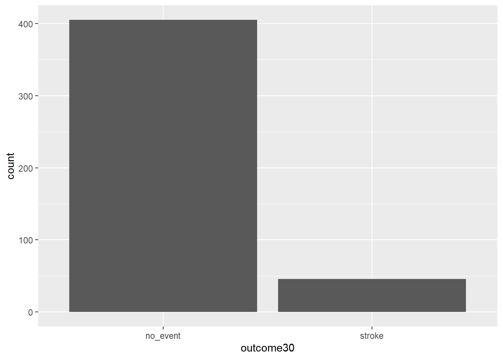
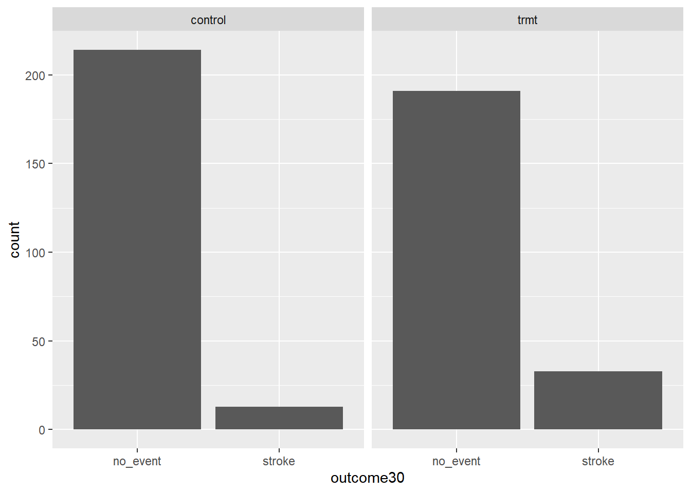
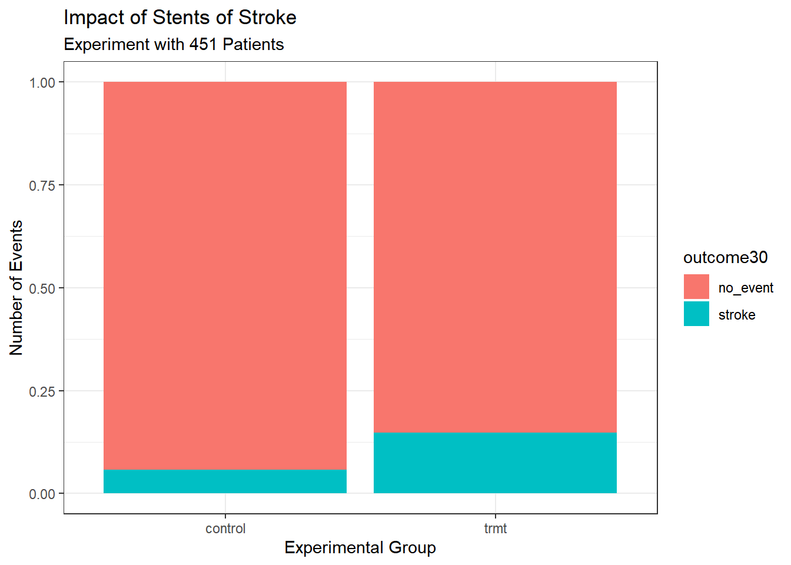

# (PART) Descriptive Statistical Modeling {-} 

# Data Case Study {#CS1}


## Objectives

1) Use `R` for basic analysis and visualization.  

2) Compile a report using `knitr`.  


## Introduction to descriptive statistical modeling

In this first block of material, we will focus on data types, collection methods, summaries, and visualizations. We also intend to introduce computing via the `R` package. Programming in `R` requires some focus early in this book and we will supplement with some online courses. There is relatively little mathematics in this first block.

## The data analytic process

Scientists seek to answer questions using rigorous methods and careful observations. These observations -- collected from the likes of field notes, surveys, and experiments -- form the backbone of a statistical investigation and are called **data**. Statistics is the study of how best to collect, analyze, and draw conclusions from data. It is helpful to put statistics in the context of a general process of investigation:  

1. Identify a question or problem. 

2. Collect relevant data on the topic. 

3. Explore and understand the data. 

4. Analyze the data. 

5. Form a conclusion. 

6. Make decisions based on the conclusion. 

This is typical of an explanatory process because it starts with a research question and proceeds. However, sometimes an analysis is exploratory in nature. There is data but not necessarily a research question. The purpose of the analysis is to find interesting features in the data and sometimes generate hypotheses. In this book, we focus on the explanatory aspects of analysis.

Statistics as a subject focuses on making stages 2-5 objective, rigorous, and efficient. That is, statistics has three primary components: 

* How best can we collect data?  
* How should it be analyzed?  
* And what can we infer from the analysis?

The topics scientists investigate are as diverse as the questions they ask. However, many of these investigations can be addressed with a small number of data collection techniques, analytic tools, and fundamental concepts in statistical inference. This chapter provides a glimpse into these and other themes we will encounter throughout the rest of the book.   

  
## Case study

In this chapter, we will consider an experiment that studies effectiveness of stents in treating patients at risk of stroke. ^[Chimowitz MI, Lynn MJ, Derdeyn CP, et al. 2011. Stenting versus Aggressive Medical Therapy for Intracranial Arterial Stenosis. New England Journal of Medicine 365:993-1003.] ^[NY Times article reporting on the study: http://www.nytimes.com/2011/09/08/health/research/08stent.html] Stents are small mesh tubes that are placed inside narrow or weak arteries to assist in patient recovery after cardiac events and reduce the risk of an additional heart attack or death. Many doctors have hoped that there would be similar benefits for patients at risk of stroke. We start by writing the principal question the researchers hope to answer:  

### Research question

> Does the use of stents reduce the risk of stroke?

### Collect the relevant data

The researchers who asked this question collected data on 451 at-risk patients. Each volunteer patient was randomly assigned to one of two groups:

**Treatment group**. Patients in the treatment group received a stent and medical management. The medical management included medications, management of risk factors, and help in lifestyle modification.

**Control group**. Patients in the control group received the same medical management as the treatment group but did not receive stents.

Researchers randomly assigned 224 patients to the treatment group and 227 to the control group. In this study, the control group provides a reference point against which we can measure the medical impact of stents in the treatment group. 

This is an experiment and not an observational study. We will learn more about these ideas in this block.

Researchers studied the effect of stents at two time points: 30 days after enrollment and 365 days after enrollment. 

### Import data 

We begin our first use of `R`.

If you need to install a package, most likely it will be on CRAN, the Comprehensive R Archive Network. Before
a package can be used, it must be installed on the computer (once per computer or account) and loaded into a session (once per `R` session). When you exit `R`, the package stays installed on the computer but will not be reloaded when `R` is started again.

In summary, `R` has packages that can be downloaded and installed from online repositories such as CRAN. When you install a package, which only needs to be done once per computer or account, in `R` all it is doing is placing the source code in a library folder designated during the installation of `R`. Packages are typically collections of functions and variables that are specific to a certain task or subject matter. 

For example, to install the **mosaic** package, enter:

```
install.packages("mosaic") # fetch package from CRAN
```

In RStudio, there is a *Packages* tab that makes it easy to add and maintain packages.

To use a package in a session, we must load it. This makes it available to the current session only. When you start `R` again, you will have to load packages again. The command `library()` with the package name supplied as the argument is all that is needed. For this session, we will load **tidyverse** and **mosaic**. Note: the box below is executing the `R` commands, this is known as reproducible research since you can see the code and then you can run or modify as you need.


```r
library(tidyverse)
library(mosaic)
```


Next read in the data into the working environment.


```r
stent_study <- read_csv("data/stent_study.csv")
```

Let's break this code down. We are reading from a .csv file and assigning the results into an object called `stent_study`. The assignment arrow `<-` means we assign what is on the right to what is on the left. The `R` function we use in this case is `read_csv()`. When using `R` functions, you should ask yourself:  

1. What do I want `R` to do? 

2. What information must I provide for `R` to do this? 

We want `R` to read in a .csv file. We can get help on this function by typing `?read_csv` or `help(read_csv)` at the prompt. The only required input to `read_csv()` is the file location. We have our data stored in a folder called "data" under the working directory. We can determine the working directory by typing `getwd()` at the prompt.


```r
getwd()
```

Similarly, if we wish to change the working directory, we can do so by using the `setwd()` function:


```r
setwd('C:/Users/Brianna.Hitt/Documents/ProbStat/Another Folder')
```

In `R` if you use the `view()`, you will see the data in what looks like a standard spreadsheet.


```r
View(stent_study)
```


### Explore data

Before we attempt to answer the research question, let's look at the data. We want `R` to print out the first 10 rows of the data. The appropriate function is `head()` and it needs the data object. By default, `R` will output the first 6 rows. By using the `n =` argument, we can specify how many rows we want to view.


```r
head(stent_study, n = 10)
```

```
## # A tibble: 10 x 3
##    group   outcome30 outcome365
##    <chr>   <chr>     <chr>     
##  1 control no_event  no_event  
##  2 trmt    no_event  no_event  
##  3 control no_event  no_event  
##  4 trmt    no_event  no_event  
##  5 trmt    no_event  no_event  
##  6 control no_event  no_event  
##  7 trmt    no_event  no_event  
##  8 control no_event  no_event  
##  9 control no_event  no_event  
## 10 control no_event  no_event
```

We also want to "inspect" the data. The function is `inspect()` and `R` needs the data object `stent_study`.


```r
inspect(stent_study)
```

```
## 
## categorical variables:  
##         name     class levels   n missing
## 1      group character      2 451       0
## 2  outcome30 character      2 451       0
## 3 outcome365 character      2 451       0
##                                    distribution
## 1 control (50.3%), trmt (49.7%)                
## 2 no_event (89.8%), stroke (10.2%)             
## 3 no_event (83.8%), stroke (16.2%)
```


To keep things simple, we will only look at the `outcome30` variable in this case study. We will summarize the data in a table. Later in the book, we will learn to do this using the **tidy** package; for now we use the **mosaic** package. This package makes use of the modeling formula that you will use extensively later in this book. The modeling formula is also used in Math 378.

We want to summarize the data by making a table. From `mosaic`, we use the `tally()` function. Before using this function, we have to understand the basic formula notation that `mosaic` uses. The basic format is:

```
goal(y ~ x, data = MyData, ...) # pseudo-code for the formula template
```

We read `y ~ x` as “y tilde x” and interpret it in the equivalent forms: “y broken down by x”; “y modeled by x”; “y explained by x”; “y depends on x”; or “y accounted for by x.” For graphics, it’s reasonable to read the formula as “y vs. x”, which is exactly the convention used for coordinate axes. 

For this exercise, we want to apply `tally()` to the variables `group` and `outcome30`. In this case it does not matter which we call `y` and `x`; however, it is more natural to think of `outcome30` as a dependent variable. 


```r
tally(outcome30 ~ group, data = stent_study, margins = TRUE)
```

```
##           group
## outcome30  control trmt
##   no_event     214  191
##   stroke        13   33
##   Total        227  224
```

The `margins` option totals the columns.

Of the 224 patients in the treatment group, 33 had a stroke by the end of the first month. Using these two numbers, we can use `R` to compute the proportion of patients in the treatment group who had a stroke by the end of their first month. 


```r
33 / (33 + 191)
```

```
## [1] 0.1473214
```

> **Exercise**:  
What proportion of the control group had a stroke in the first 30 days of the study? And why is this proportion different from the proportion reported by `inspect()`?    


Let's have `R` calculate proportions for us. Use `?` or `help()` to look at the help menu for `tally()`. Note that one of the option arguments of the `tally()` function is `format =`. Setting this equal to `proportion` will output the proportions instead of the counts. 


```r
tally(outcome30 ~ group, data = stent_study, format = 'proportion', margins = TRUE)
```

```
##           group
## outcome30     control       trmt
##   no_event 0.94273128 0.85267857
##   stroke   0.05726872 0.14732143
##   Total    1.00000000 1.00000000
```

We can compute summary statistics from the table. A **summary statistic** is a single number summarizing a large amount of data.^[Formally, a summary statistic is a value computed from the data. Some summary statistics are more useful than others.] For instance, the primary results of the study after 1 month could be described by two summary statistics: the proportion of people who had a stroke in the treatment group and the proportion of people who had a stroke in the control group.

* Proportion who had a stroke in the treatment (stent) group: $33/224 = 0.15 = 15\%$ 

* Proportion who had a stroke in the control group: $13/227 = 0.06 = 6\%$ 

### Visualize the data 

It is often important to visualize the data. The table is a type of visualization, but in this section we will introduce a graphical method called bar charts.

We will use the [**ggformula**](https://cran.r-project.org/web/packages/ggformula/vignettes/ggformula.html) package to visualize the data. It is a wrapper to the **ggplot2** package which is becoming the industry standard for generating professional graphics. However, the interface for **ggplot2** can be difficult to learn and we will ease into it by using `ggformula`, which makes use of the formula notation introduced above. The **ggformula** package was loaded when we loaded `mosaic`.^[https://cran.r-project.org/web/packages/ggformula/vignettes/ggformula-blog.html]

To generate a basic graphic, we need to ask ourselves what information we are trying to see, what particular type of graph is best, what corresponding `R` function to use, and what information that `R` function needs in order to build a plot. For categorical data, we want a bar chart and the `R` function `gf_bar()` needs the data object and the variable(s) of interest.

Here is our first attempt. In Figure \@ref(fig:first-fig), we leave the `y` portion of our formula blank. Doing this implies that we simply want to view the number/count of `outcome30` by type. We will see the two levels of `outcome30` on the x-axis and counts on the y-axis.

(ref:ggfbold) Using **ggformula** to create a bar chart. 


```r
gf_bar(~outcome30, data = stent_study)
```

<div class="figure">

<p class="caption">(\#fig:first-fig)(ref:ggfbold)</p>
</div>

> **Exercise**:  
Explain Figure \@ref(fig:first-fig).

This plot graphically shows us the total number of "stroke" and the total number of "no_event". However, this is not what we want. We want to compare the 30-day outcomes for both treatment groups. So, we need to break the data into different groups based on treatment type. In the formula notation, we now update it to the form:

```
goal(y ~ x|z, data = MyData, ...) # pseudo-code for the formula template
```

We read `y ~ x|z` as “y tilde x by z” and interpret it in the equivalent forms: “y modeled by x for each z”; “y explained by x within each z”; or “y accounted for by x within z.” For graphics, it’s reasonable to read the formula as “y vs. x for each z”. Figure \@ref(fig:split-fig) shows the results.

(ref:groupvar) Bar charts conditioned on the `group` variable.


```r
gf_bar(~outcome30|group, data = stent_study) 
```

<div class="figure">

<p class="caption">(\#fig:split-fig)(ref:groupvar)</p>
</div>


#### More advanced graphics

As a prelude for things to come, the above graphic needs work. The labels don't help and there is no title. We could add color. Does it make more sense to use proportions? Here is the code and results for a better graph, see Figure \@ref(fig:cs1-fig). Don't worry if this seems a bit advanced, but feel free to examine each new component of this code.


```r
stent_study %>%
gf_props(~group, fill = ~outcome30, position = 'fill') %>%
  gf_labs(title = "Impact of Stents of Stroke",
          subtitle = 'Experiment with 451 Patients',
          x = "Experimental Group",
          y = "Number of Events") %>%
  gf_theme(theme_bw())
```

<div class="figure">

<p class="caption">(\#fig:cs1-fig)Better graph.</p>
</div>

Notice that we used the pipe operator, `%>%`. This operator allows us to string functions together in a manner that makes it easier to read the code. In the above code, we are sending the data object `stent_study` into the function `gf_props()` to use as data, so we don't need the `data =` argument. In math, this is a composition of functions. Instead of `f(g(x))` we could use a pipe `f(g(x)) = g(x) %>% f()`.

### Conclusion

These two summary statistics (the proportions of people who had a stroke) are useful in looking for differences in the groups, and we are in for a surprise: an additional 9\% of patients in the treatment group had a stroke! This is important for two reasons. First, it is contrary to what doctors expected, which was that stents would *reduce* the rate of strokes. Second, it leads to a statistical question: do the data show a real difference due to the treatment?

This second question is subtle. Suppose you flip a coin 100 times. While the chance a coin lands heads in any given coin flip is 50\%, we probably won't observe exactly 50 heads. This type of fluctuation is part of almost any type of data generating process. It is possible that the 9\% difference in the stent study is due to this natural variation. However, the larger the difference we observe (for a particular sample size), the less believable it is that the difference is due to chance. So what we are really asking is the following: is the difference so large that we should reject the notion that it was due to chance? 

This is a preview of step 4, analyze the data, and step 5, form a conclusion, of the analysis cycle. While we haven't yet covered statistical tools to fully address these steps, we can comprehend the conclusions of the published analysis: there was compelling evidence of harm by stents in this study of stroke patients.

**Be careful:** do not generalize the results of this study to all patients and all stents. This study looked at patients with very specific characteristics who volunteered to be a part of this study and who may not be representative of all stroke patients. In addition, there are many types of stents and this study only considered the self-expanding Wingspan stent (Boston Scientific). However, this study does leave us with an important lesson: we should keep our eyes open for surprises.


## Homework Problems 

Create an Rmd file `01 Data Case Study Application.Rmd` in R (it may be provided), and start by inserting your name in the header. The code blocks below can be copied and pasted, and then you can complete the code and answer the questions. When you are done, `knit` the Rmd into an html or pdf file by clicking the `Knit` button in RStudio and selecting either "Knit to HTML" or "Knit to PDF".  

To create an `R` code chunk, type CTRL+ALT+I or click the "Insert a new code chunk" button (a green C with a + icon) and use the drop down menu to select `R`. Anything between the dashes is interpreted as `R` code.  

For more on RMarkdown, see the following video: https://www.youtube.com/watch?v=DNS7i2m4sB0. This video only demonstrates how to `knit` to an html, but we can also `knit` to a pdf since it is set up for us. You can also take the first chapter of the Data Camp course, *Reporting with R Markdown*, to learn more.


1. **Stent study continued**. Complete a similar analysis for the stent data, but this time use the one year outcome. In particular,

  a. Read the data into your working directory.
  
```
stent_study <- read_csv(___)
```
  

  b. Complete the steps below. The start of code is provided below. You will need to add `{r}` to the start of each code chunk or insert your own code chunks to use the code. 
  
    i. Use `inspect` on the data.  
    
```
inspect(___)
```

    ii. Create a table of `outcome365` and `group`. Comment on the results.  
    
```
tally(outcome365 ~ ___, data = stent_study, format = ___, margins = TRUE)
```

    iii. Create a barchart of the data.  

```
stent_study %>%
  gf_props(~___, fill = ~___, position = 'fill') %>%
  gf_labs(title = ___,
          subtitle = ___,
          x = ___,
          y = ___)
```

2. **Migraine and acupuncture**.  A migraine is a particularly painful type of headache, which patients sometimes wish to treat with acupuncture. To determine whether acupuncture relieves migraine pain, researchers conducted a randomized controlled study where 89 females diagnosed with migraine headaches were randomly assigned to one of two groups: treatment or control. The 43 patients in the treatment group received acupuncture that is specifically designed to treat migraines. The 46 patients in the control group received placebo acupuncture (needle insertion at nonacupoint locations). Then 24 hours after patients received acupuncture, they were asked if they were pain free.^[G. Allais et al. “Ear acupuncture in the treatment of migraine attacks:  a randomized trial on the efficacy of appropriate versus inappropriate acupoints”. http://www.ncbi.nlm.nih.gov/pubmed/21533739 In: Neurological Sci. 32.1 (2011), pp. 173–175.]

    The data is in the file `migraine_study.csv` in the `data` folder. Complete the following work:

  a. Read the data into an object called `migraine_study`.  
  
```
migraine_study <- read_csv("data/___")
```
  
```
head(migraine_study)
```
  

  b. Create a table of the data.
  
```
tally(___)
```
   
  c. Report the percent of patients in the treatment group who were pain free 24 hours after receiving acupuncture.  
  
  d. Repeat for the control group.  
  
  e. At first glance, does acupuncture appear to be an effective treatment for migraines? Explain your reasoning.  
  
  f. Do the data provide convincing evidence that there is a real pain reduction for those patients in the treatment group? Or do you think that the observed difference might just be due to chance?  
  
  
3. Compile, `knit`, this report into an html and a pdf. In order to `knit` the report into a pdf, you may need to install the `knitr` and `tinytex` packages in `R`.


[Solutions Manual](https://ds-usafa.github.io/CPS-Solutions-Manual/CS1.html)
