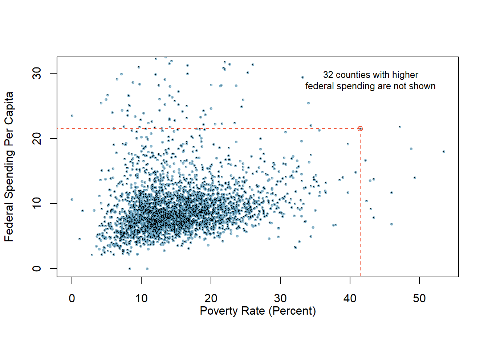

# Data Basics {#DB}

## Objectives

1) Define and use properly in context all new terminology, to include: *case*, *observational unit*, *variables*, *data frame*, *associated variables*, *independent*, and *discrete* and *continuous variables*.   

2) Identify and define the different types of variables.  

3) Given a study description, describe the research question.  

4) In `R`, create a scatterplot and determine the association of two numerical variables from the plot.  

## Data basics

Effective presentation and description of data is a first step in most analyses. This chapter introduces one structure for organizing data, as well as some terminology that will be used throughout this book.

### Observations, variables, and data matrices

For reference we will be using a data set concerning 50 emails received in 2012. These observations will be referred to as the `email50` data set, and they are a random sample from a larger data set. This data is in the **openintro** package so let's install and then load this package.


```r
install.packages("openintro")
library(openintro)
```


Table \@ref(tab:db1-tab) shows 4 rows of the `email50` data set and we have elected to only list 5 variables for ease of observation. 

Each row in the table represents a single email or **case**.^[A case is also sometimes called a **unit of observation** or an **observational unit**.] The columns represent **variables**, which represent characteristics for each of the cases (emails). For example, the first row represents email 1, which is not spam, contains 21,705 characters, 551 line breaks, is written in HTML format, and contains only small numbers.

<table>
<caption>(\#tab:db1-tab)First 5 rows of email data frame</caption>
 <thead>
  <tr>
   <th style="text-align:left;"> spam </th>
   <th style="text-align:right;"> num_char </th>
   <th style="text-align:right;"> line_breaks </th>
   <th style="text-align:left;"> format </th>
   <th style="text-align:left;"> number </th>
  </tr>
 </thead>
<tbody>
  <tr>
   <td style="text-align:left;"> 0 </td>
   <td style="text-align:right;"> 21.705 </td>
   <td style="text-align:right;"> 551 </td>
   <td style="text-align:left;"> 1 </td>
   <td style="text-align:left;"> small </td>
  </tr>
  <tr>
   <td style="text-align:left;"> 0 </td>
   <td style="text-align:right;"> 7.011 </td>
   <td style="text-align:right;"> 183 </td>
   <td style="text-align:left;"> 1 </td>
   <td style="text-align:left;"> big </td>
  </tr>
  <tr>
   <td style="text-align:left;"> 1 </td>
   <td style="text-align:right;"> 0.631 </td>
   <td style="text-align:right;"> 28 </td>
   <td style="text-align:left;"> 0 </td>
   <td style="text-align:left;"> none </td>
  </tr>
  <tr>
   <td style="text-align:left;"> 0 </td>
   <td style="text-align:right;"> 15.829 </td>
   <td style="text-align:right;"> 242 </td>
   <td style="text-align:left;"> 1 </td>
   <td style="text-align:left;"> small </td>
  </tr>
</tbody>
</table>

Let's look at the first 10 rows of data from `email50` using `R`. Remember to ask the two questions:  

*What do we want `R` to do?* and  

*What must we give `R` for it to do this?*  

We want the first 10 rows so we use `head()` and `R` needs the data object and the number of rows. The data object is called `email50` and is accessible once the **openintro** package is loaded.


```r
head(email50, n = 10)
```

```
## # A tibble: 10 x 21
##    spam  to_multiple from     cc sent_email time                image attach
##    <fct> <fct>       <fct> <int> <fct>      <dttm>              <dbl>  <dbl>
##  1 0     0           1         0 1          2012-01-04 06:19:16     0      0
##  2 0     0           1         0 0          2012-02-16 13:10:06     0      0
##  3 1     0           1         4 0          2012-01-04 08:36:23     0      2
##  4 0     0           1         0 0          2012-01-04 10:49:52     0      0
##  5 0     0           1         0 0          2012-01-27 02:34:45     0      0
##  6 0     0           1         0 0          2012-01-17 10:31:57     0      0
##  7 0     0           1         0 0          2012-03-17 22:18:55     0      0
##  8 0     0           1         0 1          2012-03-31 07:58:56     0      0
##  9 0     0           1         1 1          2012-01-10 18:57:54     0      0
## 10 0     0           1         0 0          2012-01-07 12:29:16     0      0
## # ... with 13 more variables: dollar <dbl>, winner <fct>, inherit <dbl>,
## #   viagra <dbl>, password <dbl>, num_char <dbl>, line_breaks <int>,
## #   format <fct>, re_subj <fct>, exclaim_subj <dbl>, urgent_subj <fct>,
## #   exclaim_mess <dbl>, number <fct>
```

In practice, it is especially important to ask clarifying questions to ensure important aspects of the data are understood. For instance, it is always important to be sure we know what each variable means and the units of measurement. Descriptions of all variables in the `email50` data set are given in its documentation which can be accessed in `R` by using the `?` command:

```
?email50
```

(Note that not all data sets will have associated documentation; the authors of **openintro** package included this documentation with the `email50` data set contained in the package.) 

The data in `email50` represent a **data matrix**, or in `R` terminology a **data frame** or **tibble** ^[A tibble is a data frame with attributes for such things as better display and printing.], which is a common way to organize data. Each row of a data matrix corresponds to a unique case, and each column corresponds to a variable. This is called **tidy data**.^[Tidy data is data in which each row corresponds to a unique case and each column represents a single variable. For more information on tidy data, see the *Simply Statistics* blog and the *R for Data Science* book by Hadley Wickham and Garrett Grolemund.] The data frame for the stroke study introduced in the previous chapter had patients as the cases and there were three variables recorded for each patient. If we are thinking of patients as the unit of observation, then this data is tidy. 


```
## # A tibble: 10 x 3
##    group   outcome30 outcome365
##    <chr>   <chr>     <chr>     
##  1 control no_event  no_event  
##  2 trmt    no_event  no_event  
##  3 control no_event  no_event  
##  4 trmt    no_event  no_event  
##  5 trmt    no_event  no_event  
##  6 control no_event  no_event  
##  7 trmt    no_event  no_event  
##  8 control no_event  no_event  
##  9 control no_event  no_event  
## 10 control no_event  no_event
```

If we think of an outcome as a unit of observation, then it is not tidy since the two outcome columns are variable values (month or year). The tidy data for this case would be:


```
## # A tibble: 10 x 4
##    patient_id group   time  result  
##         <int> <chr>   <chr> <chr>   
##  1          1 control month no_event
##  2          1 control year  no_event
##  3          2 trmt    month no_event
##  4          2 trmt    year  no_event
##  5          3 control month no_event
##  6          3 control year  no_event
##  7          4 trmt    month no_event
##  8          4 trmt    year  no_event
##  9          5 trmt    month no_event
## 10          5 trmt    year  no_event
```


There are three interrelated rules which make a data set tidy:  

1. Each variable must have its own column.  
2. Each observation must have its own row.  
3. Each value must have its own cell.  

Why ensure that your data is tidy? There are two main advantages:

1. There’s a general advantage to picking one consistent way of storing data. If you have a consistent data structure, it’s easier to learn the tools that work with it because they have an underlying uniformity.

2. There’s a specific advantage to placing variables in columns because it allows `R`’s vectorized nature to shine. This will be more clear as we progress in our studies. Since most built-in `R` functions work with vectors of values, it makes transforming tidy data feel particularly natural.


Data frames are a convenient way to record and store data. If another individual or case is added to the data set, an additional row can be easily added. Similarly, another column can be added for a new variable.

> **Exercise**:    
We consider a publicly available data set that summarizes information about the 3,142 counties in the United States, and we create a data set called `county_subset` data set. This data set will include information about each county: its name, the state where it resides, its population in 2000 and 2010, per capita federal spending, poverty rate, and four additional characteristics. We create this data object in the code following this description. The parent data set is part of the `usdata` library and is called `county_complete`. The variables are summarized in the help menu built into the **usdata** package^[[These data were collected from the US Census website.](http://quickfacts.census.gov/qfd/index.html)]. How might these data be organized in a data matrix? ^[Each county may be viewed as a case, and there are ten pieces of information recorded for each case. A table with 3,142 rows and 10 columns could hold these data, where each row represents a county and each column represents a particular piece of information.]


Using `R` we will create our data object. First we load the library `usdata`.


```r
library(usdata)
```


We only want a subset of the columns and we will use the `select` verb in `dplyr` to select and rename columns. We also create a new variable which is federal spending per capita using the `mutate` function.  


```r
county_subset <- county_complete %>% 
  select(name, state, pop2000, pop2010, fed_spend = fed_spending_2009, 
         poverty = poverty_2010, homeownership = homeownership_2010, 
         multi_unit = housing_multi_unit_2010, income = per_capita_income_2010, 
         med_income = median_household_income_2010) %>%
  mutate(fed_spend = fed_spend / pop2010)
```

Using `R`, we will display seven rows of the `county_subset` data frame. 


```r
head(county_subset, n = 7)
```

```
##             name   state pop2000 pop2010 fed_spend poverty homeownership
## 1 Autauga County Alabama   43671   54571  6.068095    10.6          77.5
## 2 Baldwin County Alabama  140415  182265  6.139862    12.2          76.7
## 3 Barbour County Alabama   29038   27457  8.752158    25.0          68.0
## 4    Bibb County Alabama   20826   22915  7.122016    12.6          82.9
## 5  Blount County Alabama   51024   57322  5.130910    13.4          82.0
## 6 Bullock County Alabama   11714   10914  9.973062    25.3          76.9
## 7  Butler County Alabama   21399   20947  9.311835    25.0          69.0
##   multi_unit income med_income
## 1        7.2  24568      53255
## 2       22.6  26469      50147
## 3       11.1  15875      33219
## 4        6.6  19918      41770
## 5        3.7  21070      45549
## 6        9.9  20289      31602
## 7       13.7  16916      30659
```

### Types of variables

Examine the `fed_spend`, `pop2010`, and `state` variables in the `county` data set. Each of these variables is inherently different from the others, yet many of them share certain characteristics.

First consider `fed_spend`. It is said to be a **numerical variable** (sometimes called a quantitative variable) since it can take a wide range of numerical values, and it is sensible to add, subtract, or take averages with those values. On the other hand, we would not classify a variable reporting telephone area codes as numerical; even though area codes are made up of numerical digits, their average, sum, and difference have no clear meaning.

The `pop2010` variable is also numerical; it is sensible to add, subtract, or take averages with those values, although it seems to be a little different than `fed_spend`. This variable of the population count can only be a whole non-negative number ($0$, $1$, $2$, $...$). For this reason, the population variable is said to be **discrete** since it can only take specific numerical values. On the other hand, the federal spending variable is said to be **continuous** because it can take on any value in some interval. Now technically, there are no truly continuous numerical variables since all measurements are finite up to some level of accuracy or measurement precision (e.g., we typically measure federal spending in dollars and cents). However, in this book, we will treat both types of numerical variables the same, that is as continuous variables for statistical modeling. The only place this will be different in this book is in probability models, which we will see in the probability modeling block.

The variable `state` can take up to 51 values, after accounting for Washington, DC, and are summarized as: *Alabama*, *Alaska*, ..., and *Wyoming*. Because the responses themselves are categories, `state` is a **categorical variable** (sometimes also called a qualitative variable), and the possible values are called the variable's **levels**.

<div class="figure">

<p class="caption">(\#fig:tax-fig)Taxonomy of Variables.</p>
</div>


Finally, consider a hypothetical variable on education, which describes the highest level of education completed and takes on one of the values *noHS*, *HS*, *College* or *Graduate_school*. This variable seems to be a hybrid: it is a categorical variable but the levels have a natural ordering. A variable with these properties is called an **ordinal** variable. A categorical variable with levels that do not have a natural ordering is called a **nominal** variable. To simplify analyses, any ordinal variables in this book will be treated as nominal categorical variables. In `R`, categorical variables can be treated in different ways; one of the key differences is that we can leave them as character values (character strings, or text) or as factors. A factor is essentially a categorical variable with defined *levels*. When `R` handles factors, it is only concerned about the *levels* of the factors. We will learn more about this as we progress.

Figure \@ref(fig:tax-fig) captures this classification of variables we have described.

> **Exercise**:    
Data were collected about students in a statistics course. Three variables were recorded for each student: number of siblings, student height, and whether the student had previously taken a statistics course. Classify each of the variables as continuous numerical, discrete numerical, or categorical.^[The number of siblings and student height represent numerical variables. Because the number of siblings is a count, it is discrete. Height varies continuously, so it is a continuous numerical variable. The last variable classifies students into two categories -- those who have and those who have not taken a statistics course -- which makes this variable categorical.]


> **Exercise**:    
Consider the variables `group` and `outcome30` from the stent study in the case study chapter. Are these numerical or categorical variables? ^[There are only two possible values for each variable, and in both cases they describe categories. Thus, each is a categorical variable.]


### Relationships between variables

Many analyses are motivated by a researcher looking for a relationship between two or more variables. This is the heart of statistical modeling. A social scientist may like to answer some of the following questions:

1. Is federal spending, on average, higher or lower in counties with high rates of poverty?  
2. If homeownership is lower than the national average in one county, will the percent of multi-unit structures in that county likely be above or below the national average?   

To answer these questions, data must be collected, such as the `county_complete` data set. Examining summary statistics could provide insights for each of the two questions about counties. Graphs can be used to visually summarize data and are useful for answering such questions as well.

Scatterplots are one type of graph used to study the relationship between two numerical variables. Figure \@ref(fig:pov1-fig) compares the variables `fed_spend` and `poverty`. Each point on the plot represents a single county. For instance, the highlighted dot corresponds to County 1088 in the `county_subset` data set: Owsley County, Kentucky, which had a poverty rate of 41.5\% and federal spending of \$21.50 per capita. The dense cloud in the scatterplot suggests a relationship between the two variables: counties with a high poverty rate also tend to have slightly more federal spending. We might brainstorm as to why this relationship exists and investigate each idea to determine which is the most reasonable explanation.

<div class="figure">

<p class="caption">(\#fig:pov1-fig)A scatterplot showing fed_spend against poverty. Owsley County of Kentucky, with a poverty rate of 41.5% and federal spending of $21.50 per capita, is highlighted.</p>
</div>

> **Exercise**:    
Examine the variables in the `email50` data set. Create two research questions about the relationships between these variables that are of interest to you.^[Two sample questions: (1) Intuition suggests that if there are many line breaks in an email then there would also tend to be many characters: does this hold true? (2) Is there a connection between whether an email format is plain text (versus HTML) and whether it is a spam message?]

The `fed_spend` and `poverty` variables are said to be associated because the plot shows a discernible pattern. When two variables show some connection with one another, they are called **associated variables**. Associated variables can also be called **dependent** variables and vice-versa.

> *Example*:    
The relationship between the homeownership rate and the percent of units in multi-unit structures (e.g. apartments, condos) is visualized using a scatterplot in Figure \@ref(fig:homeown-fig). Are these variables associated?

It appears that the larger the fraction of units in multi-unit structures, the lower the homeownership rate. Since there is some relationship between the variables, they are associated.

<div class="figure">

<p class="caption">(\#fig:homeown-fig)A scatterplot of the homeownership rate versus the percent of units that are in multi-unit structures for all 3,143 counties.</p>
</div>

Because there is a downward trend in Figure \@ref(fig:homeown-fig) -- counties with more units in multi-unit structures are associated with lower homeownership -- these variables are said to be **negatively associated**. A **positive association** (upward trend) is shown in the relationship between the `poverty` and `fed_spend` variables represented in Figure \@ref(fig:pov1-fig), where counties with higher poverty rates tend to receive more federal spending per capita.

If two variables are not associated, then they are said to be **independent**. That is, two variables are independent if there is no evident relationship between the two.

> A pair of variables are either related in some way (associated) or not (independent). No pair of variables is both associated and independent.

### Creating a scatterplot


In this section, we will create a simple scatterplot and then ask you to create one on your own. First, we will recreate the scatterplot seen in Figure \@ref(fig:pov1-fig). This figure uses the `county_subset` data set.

Here are two questions:

*What do we want `R` to do?* and

*What must we give `R` for it to do this?*   

We want `R` to create a scatterplot and to do this it needs, at a minimum, the data object, what we want on the $x$-axis, and what we want on the $y$-axis. More information on [**ggformula**](https://cran.r-project.org/web/packages/ggformula/vignettes/ggformula.html) can be found [here](https://cran.r-project.org/web/packages/ggformula/vignettes/ggformula-blog.html). 

(ref:ggfbold2) Scatterplot with **ggformula**.


```r
county_subset %>%
  gf_point(fed_spend ~ poverty)
```

<div class="figure">

<p class="caption">(\#fig:pov2-fig)(ref:ggfbold2)</p>
</div>

Figure \@ref(fig:pov2-fig) is bad. There are poor axis labels, no title, dense clustering of points, and the $y$-axis is being driven by a couple of extreme points. We will need to clear this up. Again, try to read the code and use `help()` or `?` to determine the purpose of each command in Figure \@ref(fig:pov3-fig).


```r
county_subset %>%
  filter(fed_spend < 32) %>%
  gf_point(fed_spend ~ poverty,
           xlab = "Poverty Rate (Percent)", 
           ylab = "Federal Spending Per Capita",
           title = "A scatterplot showing fed_spend against poverty", 
           cex = 1, alpha = 0.2) %>%
  gf_theme(theme_classic())
```

<div class="figure">

<p class="caption">(\#fig:pov3-fig)Better example of a scatterplot.</p>
</div>

> **Exercise**:    
Create the scatterplot in Figure \@ref(fig:homeown-fig).

## Homework Problems 

1. **Identify study components**. Identify (i) the cases, (ii) the variables and their types, and (iii) the main research question in the studies described below.

a. Researchers collected data to examine the relationship between pollutants and preterm births in Southern California. During the study, air pollution levels were measured by air quality monitoring stations. Specifically, levels of carbon monoxide were recorded in parts per million, nitrogen dioxide and ozone in parts per hundred million, and coarse particulate matter (PM$_{10}$) in $\mu g/m^3$. Length of gestation data were collected on 143,196 births between the years 1989 and 1993, and air pollution exposure during gestation was calculated for each birth. The analysis suggests that increased ambient PM$_{10}$ and, to a lesser degree, CO concentrations may be associated with the occurrence of preterm births.^[B. Ritz et al. [“Effect of air pollution on preterm birth among children born in Southern California
between 1989 and 1993”](http://journals.lww.com/epidem/Abstract/2000/09000/Effect_of_Air_Pollution_on_Preterm_Birth_Among.4.aspx).  In:  Epidemiology 11.5 (2000), pp. 502–511.]


b. The Buteyko method is a shallow breathing technique developed by Konstantin Buteyko, a Russian doctor, in 1952. Anecdotal evidence suggests that the Buteyko method can reduce asthma symptoms and improve quality of life. In a scientific study to determine the effectiveness of this method, researchers recruited 600 asthma patients aged 18-69 who relied on medication for asthma treatment. These patients were split into two research groups: patients who practiced the Buteyko method and those who did not. Patients were scored on quality of life, activity, asthma symptoms, and medication reduction on a scale from 0 to 10. On average, the participants in the Buteyko group experienced a significant reduction in asthma symptoms and an improvement in quality of life.^[J. McGowan. "Health Education: Does the Buteyko Institute Method make a difference?" In: Thorax 58 (2003).]

2. In the **openintro** package is a data set called `ames`, containing information on individual residential properties sold in Ames, IA between 2006 and 2010. Create a scatterplot for the above ground living area square feet versus sale price in US dollars. Describe the relationship between these two variables. Note: you may have to load the library and data set.


[Solutions Manual](https://ds-usafa.github.io/CPS-Solutions-Manual/DB.html)

