# Numerical Data {#NUMDATA}


## Objectives

1) Define and use properly in context all new terminology, to include: *scatterplot*, *dot plot*, *mean*, *distribution*, *point estimate*, *weighted mean*, *histogram*, *data density*, *right skewed*, *left skewed*, *symmetric*, *mode*, *unimodal*, *bimodal*, *multimodal*, *variance*, *standard deviation*, *box plot*, *median*, *interquartile range*, *first quartile*, *third quartile*, *whiskers*, *outlier*, *robust estimate*, *transformation*.  

2) In `R`, generate summary statistics for a numerical variable, including breaking down summary statistics by groups.  

3) In `R`, generate appropriate graphical summaries of numerical variables.  

4) Interpret and explain output both graphically and numerically.  


## Numerical Data

This chapter introduces techniques for exploring and summarizing numerical variables. The `email50` and `mlb` data sets from the **openintro** package and a subset of `county_complete` from the **usdata** package provide rich opportunities for examples. Recall that outcomes of numerical variables are numbers on which it is reasonable to perform basic arithmetic operations. For example, the `pop2010` variable, which represents the population of counties in 2010, is numerical since we can sensibly discuss the difference or ratio of the populations in two counties. On the other hand, area codes and zip codes are not numerical.


### Scatterplots for paired data 

A **scatterplot** provides a case-by-case view of data for two numerical variables. In Figure \@ref(fig:scat5-fig), we again present a scatterplot used to examine how federal spending and poverty are related in the `county` data set. 

<div class="figure">
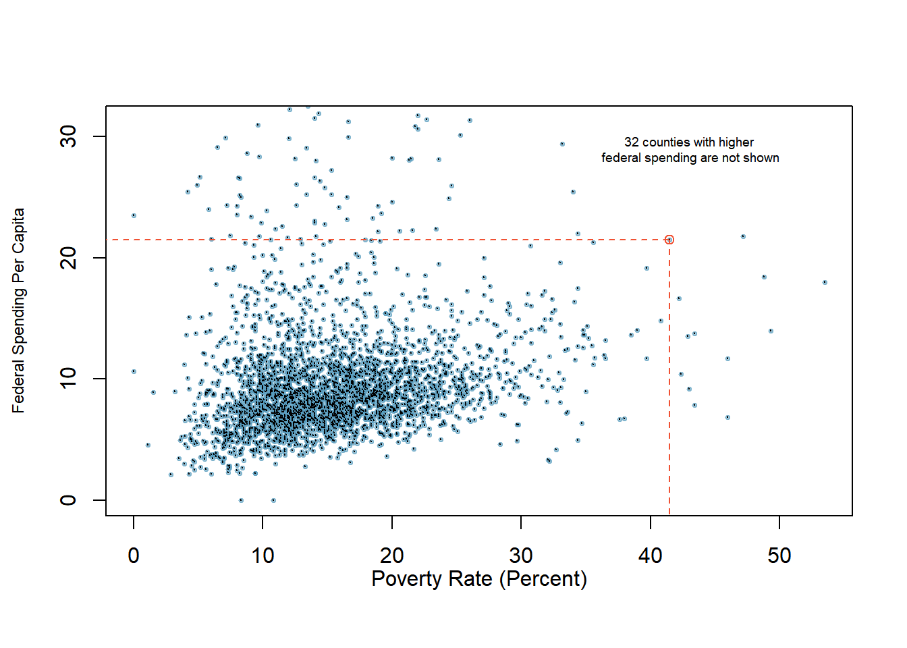
<p class="caption">(\#fig:scat5-fig)A scatterplot showing fed_spend against poverty. Owsley County of Kentucky, with a poverty rate of 41.5% and federal spending of $21.50 per capita, is highlighted.</p>
</div>

Another scatterplot is shown in Figure \@ref(fig:scat52-fig), comparing the number of `line_breaks` and number of characters, `num_char`, in emails for the `email50` data set. In any scatterplot, each point represents a single case. Since there are 50 cases in `email50`, there are 50 points in Figure \@ref(fig:scat52-fig).

<div class="figure">

<p class="caption">(\#fig:scat52-fig)A scatterplot of `line_breaks` versus `num_char` for the `email50` data.</p>
</div>


To put the number of characters in perspective, this paragraph in the text has 357 characters. Looking at Figure  \@ref(fig:scat52-fig), it seems that some emails are incredibly long! Upon further investigation, we would actually find that most of the long emails use the HTML format, which means most of the characters in those emails are used to format the email rather than provide text.

> **Exercise**:  
What do scatterplots reveal about the data, and how might they be useful?^[Answers may vary. Scatterplots are helpful in quickly spotting associations between variables, whether those associations represent simple or more complex relationships.]

> *Example*:   
Consider a new data set of 54 cars with two variables: vehicle price and weight.^[Subset of data from http://www.amstat.org/publications/jse/v1n1/datasets.lock.html] A scatterplot of vehicle price versus weight is shown in Figure \@ref(fig:scat53-fig). What can be said about the relationship between these variables?

<div class="figure">
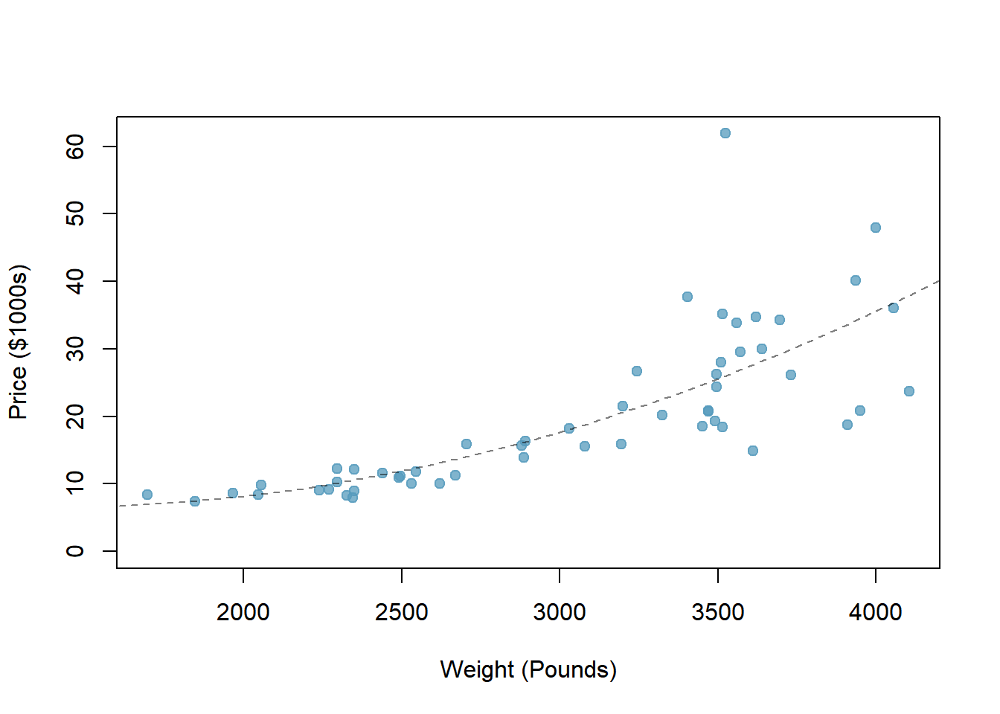
<p class="caption">(\#fig:scat53-fig)A scatterplot of *price* versus *weight* for 54 cars.</p>
</div>


The relationship is evidently nonlinear, as highlighted by the dashed line. This is different from previous scatterplots we've seen which show relationships that are very linear.

> **Exercise**:    
Describe two variables that would have a horseshoe-shaped association in a scatterplot.^[Consider the case where your vertical axis represents something "good" and your horizontal axis represents something that is only good in moderation. Health and water consumption fit this description since water becomes toxic when consumed in excessive quantities.]

### Dot plots and the mean

Sometimes two variables are one too many: only one variable may be of interest. In these cases, a dot plot provides the most basic of displays. A **dot plot** is a one-variable scatterplot; an example using the number of characters from 50 emails is shown in Figure \@ref(fig:dot5-fig).

<div class="figure">

<p class="caption">(\#fig:dot5-fig)A dot plot of `num_char` for the `email50` data set.</p>
</div>


The **mean**, sometimes called the average, is a common way to measure the center of a **distribution**^[The distribution of a variable is essentially the collection of all values of the variable in the data set. It tells us what values the variable takes on and how often. In the `email50` data set, we used a dotplot to view the distribution of `num_char`.] of data. To find the mean number of characters in the 50 emails, we add up all the character counts and divide by the number of emails. For computational convenience, the number of characters is listed in the thousands and rounded to the first decimal.

$$\bar{x} = \frac{21.7 + 7.0 + \cdots + 15.8}{50} = 11.6$$

The sample mean is often labeled $\bar{x}$. There is a bar over the letter, and the letter $x$ is being used as a generic placeholder for the variable of interest, `num_char`. 

> **Mean**  
The sample mean of a numerical variable is the sum of all of the observations divided by the number of observations, Equation \@ref(eq:mean5).

\begin{equation} 
  \bar{x} = \frac{x_1+x_2+\cdots+x_n}{n}
  (\#eq:mean5)
\end{equation} 

where $x_1, x_2, \dots, x_n$ represent the $n$ observed values.


> **Exercise**:  
Examine the two equations above. What does $x_1$ correspond to? And $x_2$? Can you infer a general meaning to what $x_i$ might represent?^[$x_1$ corresponds to the number of characters in the first email in the sample (21.7, in thousands), $x_2$ to the number of characters in the second email (7.0, in thousands), and $x_i$ corresponds to the number of characters in the $i^{th}$ email in the data set.]


> **Exercise**:  
What was $n$ in this sample of emails?^[The sample size, $n = 50$.]

The `email50` data set is a sample from a larger population of emails that were received in January and March. We could compute a mean for this population in the same way as the sample mean. However, there is a difference in notation: the population mean has a special label: $\mu$. The symbol $\mu$ is the Greek letter *mu* and represents the average of all observations in the population. Sometimes a subscript, such as $_x$, is used to represent which variable the population mean refers to, e.g. $\mu_x$.

> *Example*: The average number of characters across all emails can be estimated using the sample data. Based on the sample of 50 emails, what would be a reasonable estimate of $\mu_x$, the mean number of characters in all emails in the `email` data set? (Recall that `email50` is a sample from `email`.)

The sample mean, 11.6, may provide a reasonable estimate of $\mu_x$. While this number will not be perfect, it provides a **point estimate**, a single plausible value, of the population mean. Later in the text, we will develop tools to characterize the accuracy of point estimates, and we will find that point estimates based on larger samples tend to be more accurate than those based on smaller samples.


> *Example*:  
We might like to compute the average income per person in the US. To do so, we might first think to take the mean of the per capita incomes from the 3,143 counties in the `county` data set. What would be a better approach? 

The `county` data set is special in that each county actually represents many individual people. If we were to simply average across the `income` variable, we would be treating counties with 5,000 and 5,000,000 residents equally in the calculations. Instead, we should compute the total income for each county, add up all the counties' totals, and then divide by the number of people in all the counties. If we completed these steps with the `county` data, we would find that the per capita income for the US is \$27,348.43. Had we computed the *simple* mean of per capita income across counties, the result would have been just \$22,504.70!

This previous example used what is called a **weighted mean**^[A weighted mean is an average in which some observations contribute more "weight" than others. In the `county` data set, we "weighted" the income for each county by dividing income by the county population.], which will be a key topic in the probability section. As a look ahead, the probability mass function gives the population proportions of each county's mean value, and thus, to find the population mean $\mu$, we will use a weighted mean.


### Histograms and shape

Dot plots show the exact value of each observation. This is useful for small data sets, but they can become hard to read with larger samples. Rather than showing the value of each observation, think of the value as belonging to a *bin*. For example, in the `email50` data set, we create a table of counts for the number of cases with character counts between 0 and 5,000, then the number of cases between 5,000 and 10,000, and so on. Observations that fall on the boundary of a bin (e.g. 5,000) are allocated to the lower bin. This tabulation is shown below. 


```
## 
##   (0,5]  (5,10] (10,15] (15,20] (20,25] (25,30] (30,35] (35,40] (40,45] (45,50] 
##      19      12       6       2       3       5       0       0       2       0 
## (50,55] (55,60] (60,65] 
##       0       0       1
```


These binned counts are plotted as bars in Figure \@ref(fig:hist5-fig) in what is called a **histogram**^[A histogram displays the distribution of a quantitative variable. It shows binned counts, the number of observations in a bin, or range of values.]. 

<div class="figure">

<p class="caption">(\#fig:hist5-fig)A histogram of `num_char`. This distribution is very strongly skewed to the right.</p>
</div>


Histograms provide a view of the **data density**. Higher bars represent where the data are relatively more dense. For instance, there are many more emails between 0 and 10,000 characters than emails between 10,000 and 20,000 characters in the data set. The bars make it easy to see how the density of the data changes relative to the number of characters.

Histograms are especially convenient for describing the shape of the data distribution. Figure \@ref(fig:hist5-fig) shows that most emails have a relatively small number of characters, while fewer emails have a very large number of characters. When data trail off to the right in this way and have a longer right **tail**, the shape is said to be **right skewed**.^[Other ways to describe data that are skewed to the right: **skewed to the right**, **skewed to the high end**, or **skewed to the positive end**.]

Data sets with the reverse characteristic -- a long, thin tail to the left -- are said to be **left skewed**. We also say that such a distribution has a long left tail. Data sets that show roughly equal trailing off in both directions are called **symmetric**.

> **Long tails to identify skew**  
When data trail off in one direction, the distribution has a **long tail**. If a distribution has a long left tail, it is left skewed. If a distribution has a long right tail, it is right skewed.


> **Exercise**:  
Take a look at the dot plot above, Figure \@ref(fig:dot5-fig). Can you see the skew in the data? Is it easier to see the skew in this histogram or the dot plots?^[The skew is visible in both plots, though the dot plot is the least useful.]

> **Exercise**:   
Besides the mean, what can you see in the dot plot that you cannot see in the histogram?^[Character counts for individual emails.]


#### Making our own histogram  

Let's take some time to make a simple histogram. We will use the **ggformula** package, which is a wrapper for the **ggplot2** package.

Here are two questions:  
*What do we want `R` to do?* and   
*What must we give `R` for it to do this?*   

We want `R` to make a histogram. In `ggformula`, the plots have the form `gf_plottype` so we will use the `gf_histogram()`. To find options and more information about the function, type:

```
?gf_histogram
```

To start, we just have to give the formulas and data to `R`.


```r
gf_histogram(~num_char, data = email50, color = "black", fill = "cyan")
```

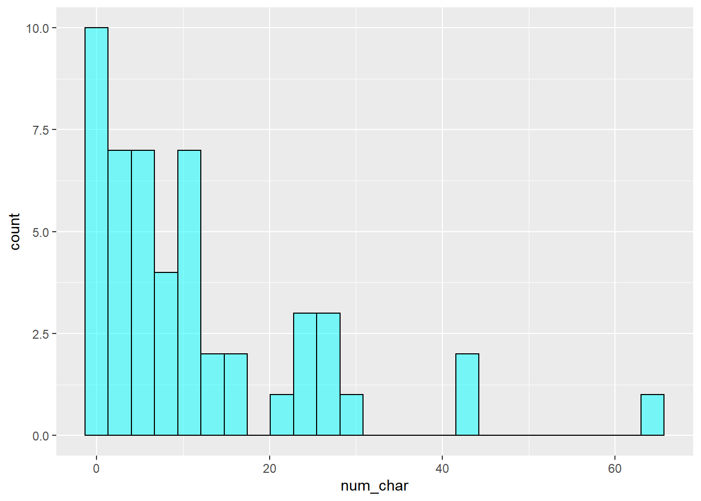

> **Exercise**:   
Look at the help menu for `gf_histogram` and change the x-axis label, change the bin width to 5, and have the left bin start at 0.

Here is the code for the exercise: 

```
email50 %>%
   gf_histogram(~num_char, binwidth = 5,boundary = 0,
   xlab = "The Number of Characters (in thousands)", 
   color = "black", fill = "cyan") %>%
   gf_theme(theme_classic())
```


In addition to looking at whether a distribution is skewed or symmetric, histograms can be used to identify modes. A **mode** is represented by a prominent peak in the distribution.^[Another definition of mode, which is not typically used in statistics, is the value with the most occurrences. It is common to have *no* observations with the same value in a data set, which makes this other definition useless for many real data sets.] There is only one prominent peak in the histogram of `num_char`.

Figure \@ref(fig:histmulti-fig) show histograms that have one, two, or three prominent peaks. Such distributions are called **unimodal**, **bimodal**, and **multimodal**, respectively. Any distribution with more than 2 prominent peaks is called multimodal. Notice that there was one prominent peak in the unimodal distribution with a second less prominent peak that was not counted since the separation between the two peaks is relatively small, and it only differs from its neighboring bins by a few observations.


<div class="figure">
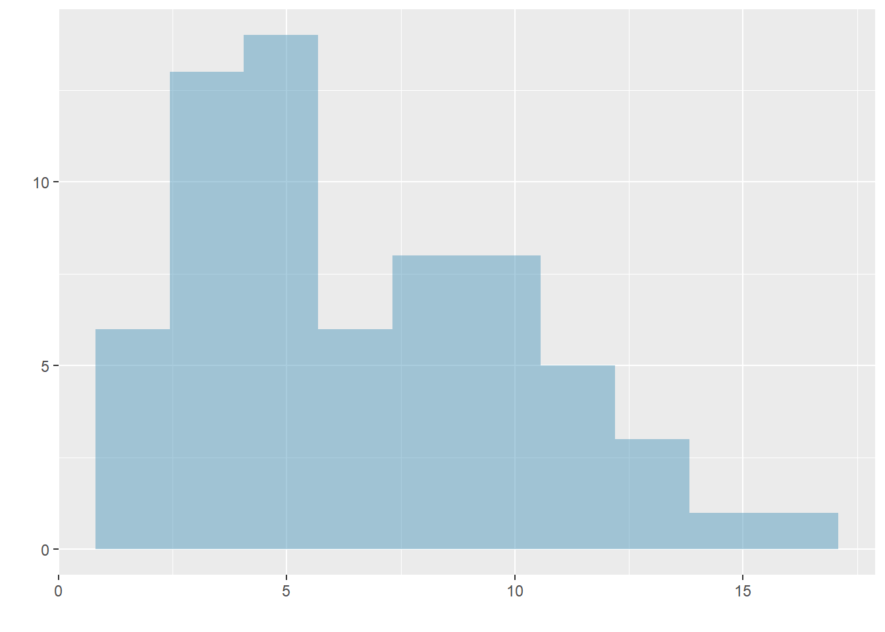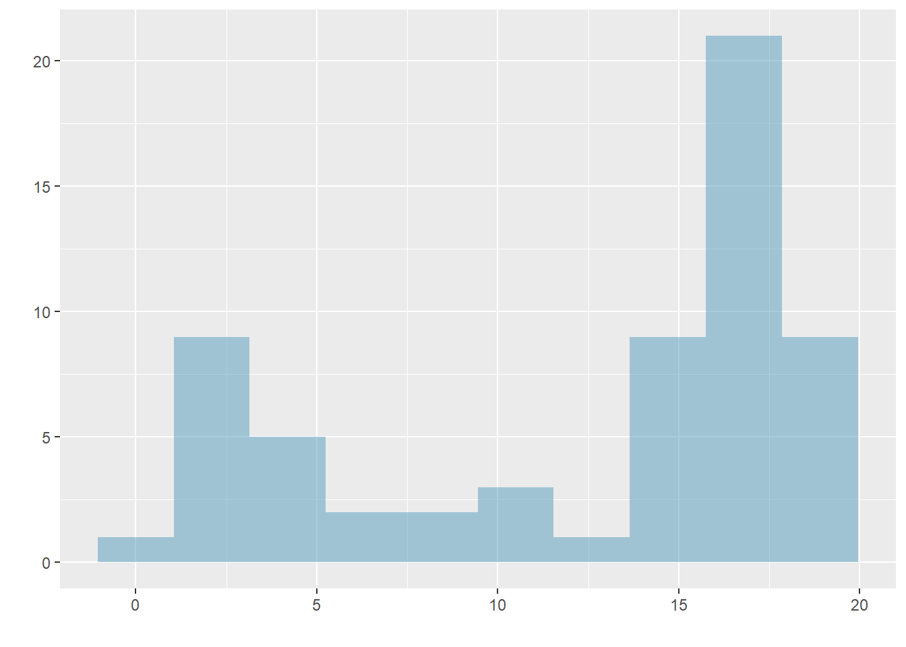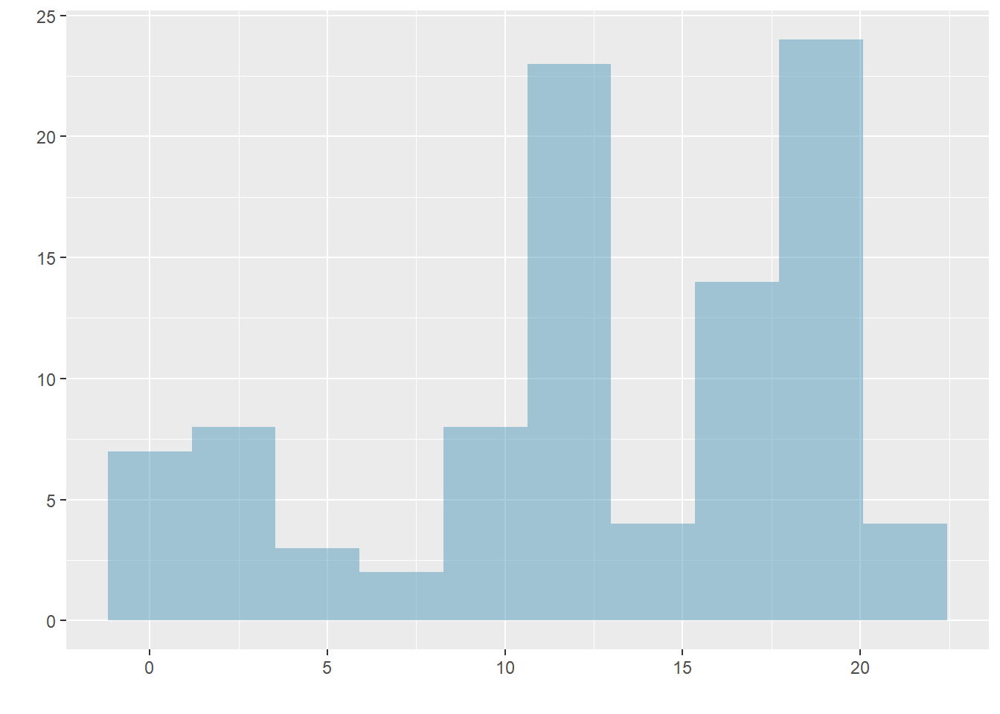
<p class="caption">(\#fig:histmulti-fig)Histograms that demonstrate unimodal, bimodal, and multimodal data.</p>
</div>


> **Exercise**:   
Height measurements of young students and adult teachers at a K-3 elementary school were taken. How many modes would you anticipate in this height data set?^[There might be two height groups visible in the data set: one for the students and one for the adults. That is, the data are probably bimodal. But it could be multimodal because within each group we may be able to see a difference in males and females.]

> **Looking for modes**   
Looking for modes isn't about finding a clear and correct answer about the number of modes in a distribution, which is why **prominent** is not rigorously defined in these notes. The important part of this examination is to better understand your data and how it might be structured.


### Variance and standard deviation

The mean is used to describe the center of a data set, but the *variability* in the data is also important. Here, we introduce two measures of variability: the **variance** and the **standard deviation**. Both of these are very useful in data analysis, even though the formulas are a bit tedious to calculate by hand. The standard deviation is the easier of the two to conceptually understand; it roughly describes how far away the typical observation is from the mean. Equation \@ref(eq:var5) is the equation for sample variance. We will demonstrate it with data so that the notation is easier to understand.

\begin{align}
s_{}^2 &= \sum_{i = 1}^{n} \frac{(x_i - \bar{x})^2}{n - 1} \\
	&= \frac{(x_1 - \bar{x})^2 + (x_2 - \bar{x})^2 + (x_3 - \bar{x})^2 + \cdots + (x_n - \bar{x})^2}{n - 1} (\#eq:var5)
\end{align}

where $x_1, x_2, \dots, x_n$ represent the $n$ observed values.


We call the distance of an observation from its mean the **deviation**. Below are the deviations for the $1^{st}$, $2^{nd}$, $3^{rd}$, and $50^{th}$ observations of the `num_char` variable. For computational convenience, the number of characters is listed in the thousands and rounded to the first decimal.

$$
\begin{aligned}
x_1^{}-\bar{x} &= 21.7 - 11.6 = 10.1 \hspace{5mm}\text{ } \\
x_2^{}-\bar{x} &= 7.0 - 11.6 = -4.6 \\
x_3^{}-\bar{x} &= 0.6 - 11.6 = -11.0 \\
			&\ \vdots \\
x_{50}^{}-\bar{x} &= 15.8 - 11.6 = 4.2
\end{aligned}
$$


If we square these deviations and then take an average, the result is equal to the **sample variance**, denoted by $s_{}^2$:

$$
\begin{aligned}
s_{}^2 &= \frac{10.1_{}^2 + (-4.6)_{}^2 + (-11.0)_{}^2 + \cdots + 4.2_{}^2}{50-1} \\
	&= \frac{102.01 + 21.16 + 121.00 + \cdots + 17.64}{49} \\
	&= 172.44
\end{aligned}
$$

We divide by $n - 1$, rather than dividing by $n$, when computing the variance; you need not worry about this mathematical nuance yet. Notice that squaring the deviations does two things. First, it makes large values much larger, seen by comparing $10.1^2$, $(-4.6)^2$, $(-11.0)^2$, and $4.2^2$. Second, it gets rid of any negative signs.

The sample **standard deviation**, $s$, is the square root of the variance:

$$s = \sqrt{172.44} = 13.13$$

The sample standard deviation of the number of characters in an email is 13.13 thousand. A subscript of $_x$ may be added to the variance and standard deviation, i.e. $s_x^2$ and $s_x^{}$, as a reminder that these are the variance and standard deviation of the observations represented by $x_1^{}$, $x_2^{}$, ..., $x_n^{}$. The $_{x}$ subscript is usually omitted when it is clear which data the variance or standard deviation is referencing.

> **Variance and standard deviation**   
The variance is roughly the average squared distance from the mean. The standard deviation is the square root of the variance and describes how close the data are to the mean.

Formulas and methods used to compute the variance and standard deviation for a population are similar to those used for a sample.^[The only difference is that the population variance has a division by $n$ instead of $n - 1$.] However, like the mean, the population values have special symbols: $\sigma_{}^2$ for the variance and $\sigma$ for the standard deviation. The symbol $\sigma$ is the Greek letter *sigma*.


> **Tip: standard deviation describes variability**  
Focus on the conceptual meaning of the standard deviation as a descriptor of variability rather than the formulas. Usually 70\% of the data will be within one standard deviation of the mean and about 95\% will be within two standard deviations. However, as we have seen, these percentages are not strict rules.


<div class="figure">
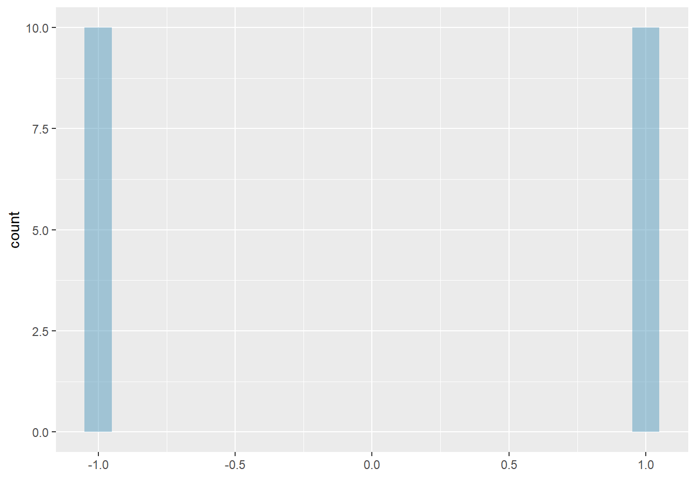
<p class="caption">(\#fig:hist53-fig)The first of three very different population distributions with the same mean, 0, and standard deviation, 1.</p>
</div>

<div class="figure">
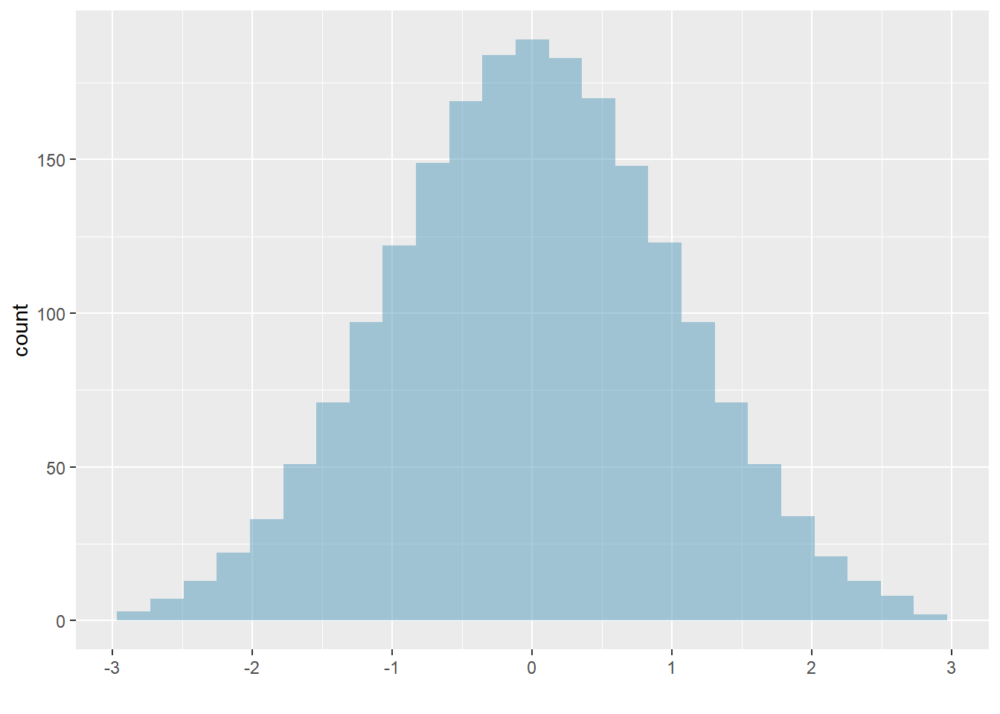
<p class="caption">(\#fig:hist54-fig)The second plot with mean 0 and standard deviation 1.</p>
</div>

<div class="figure">
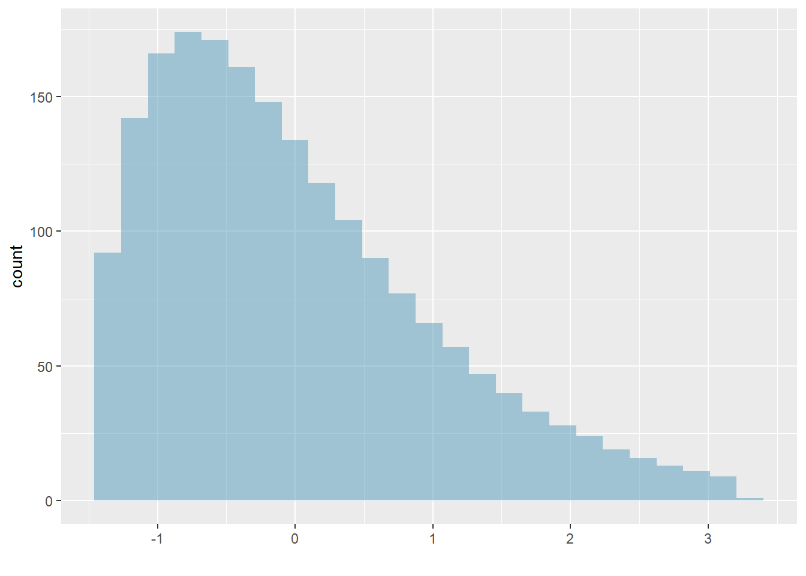
<p class="caption">(\#fig:hist55-fig)The final plot with mean 0 and standard deviation 1.</p>
</div>


> **Exercise**:  
Earlier, the concept of shape of a distribution was introduced. A good description of the shape of a distribution should include modality and whether the distribution is symmetric or skewed to one side. Using the three figures, Figures \@ref(fig:hist53-fig), \@ref(fig:hist54-fig), and \@ref(fig:hist55-fig) as an example, explain why such a description is important.^[Starting with Figure \@ref(fig:hist53-fig), the three figures show three distributions that look quite different, but all have the same mean, variance, and standard deviation. Using modality, we can distinguish between the first plot (bimodal) and the last two (unimodal). Using skewness, we can distinguish between the last plot (right skewed) and the first two. While a picture, like a histogram, tells a more complete story, we can use modality and shape (symmetry/skew) to characterize basic information about a distribution.]

> *Example*:   
Describe the distribution of the `num_char` variable using the histogram in Figure \@ref(fig:hist5-fig). The description should incorporate the center, variability, and shape of the distribution, and it should also be placed in context: the number of characters in emails. Also note any especially unusual cases/observations.^[The distribution of email character counts is unimodal and very strongly skewed to the high end (right skewed). Many of the counts fall near the mean at 11,600, and most fall within one standard deviation (13,130) of the mean. There is one exceptionally long email with about 65,000 characters.]

In practice, the variance and standard deviation are sometimes used as a means to an end, where the *end* is being able to accurately estimate the uncertainty associated with a sample statistic. For example, later in the book we will use the variance and standard deviation to assess how close the sample mean is to the population mean.


### Box plots, quartiles, and the median

A **box plot** summarizes a data set using five statistics, while also plotting unusual observations. Figure \@ref(fig:box-fig) provides an annotated vertical dot plot alongside a box plot of the `num_char` variable from the `email50` data set.


<div class="figure">
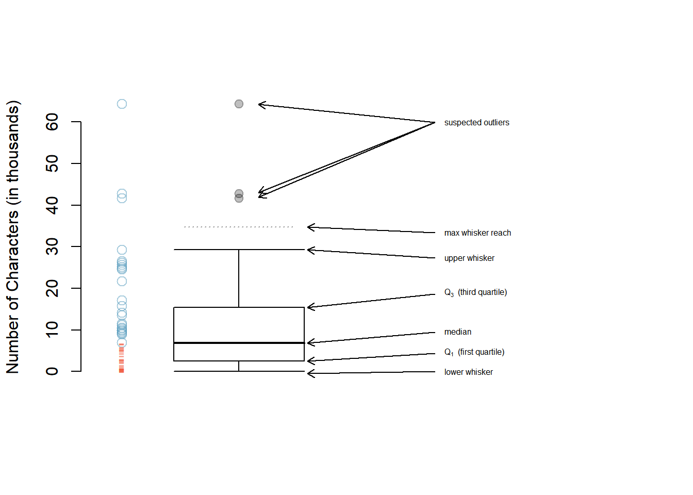
<p class="caption">(\#fig:box-fig)A vertical dot plot next to a labeled box plot for the number of characters in 50 emails. The median (6,890), splits the data into the bottom 50% and the top 50%, marked in the dot plot by horizontal dashes and open circles, respectively.</p>
</div>


The first step in building a box plot is drawing a dark line denoting the **median**, which splits the data in half. Figure \@ref(fig:box-fig) shows 50\% of the data falling below the median (red dashes) and the other 50\% falling above the median (blue open circles). There are 50 character counts in the data set (an even number) so the data are perfectly split into two groups of 25. We take the median in this case to be the average of the two observations closest to the $50^{th}$ percentile: $(\text{6,768} + \text{7,012}) / 2 = \text{6,890}$. When there are an odd number of observations, there will be exactly one observation that splits the data into two halves, and in this case that observation is the median (no average needed).

> **Median: the number in the middle**   
If the data are ordered from smallest to largest, the **median** is the observation in the middle. If there are an even number of observations, there will be two values in the middle, and the median is taken as their average.

The second step in building a box plot is drawing a rectangle to represent the middle 50\% of the data. The total length of the box, shown vertically in Figure \@ref(fig:box-fig), is called the **interquartile range** (IQR, for short). It, like the standard deviation, is a measure of variability in the data. The more variable the data, the larger the standard deviation and IQR. The two boundaries of the box are called the **first quartile** (the $25^{th}$ percentile, i.e. 25\% of the data fall below this value) and the **third quartile** (the $75^{th}$ percentile), and these are often labeled $Q_1$ and $Q_3$, respectively.

> **Interquartile range (IQR)**   
The IQR is the length of the box in a box plot. It is computed as
$$ IQR = Q_3 - Q_1 $$
where $Q_1$ and $Q_3$ are the $25^{th}$ and $75^{th}$ percentiles, respectively.


> **Exercise**:   
What percent of the data fall between $Q_1$ and the median? What percent is between the median and $Q_3$?^[Since $Q_1$ and $Q_3$ capture the middle 50% of the data and the median splits the data in the middle, 25% of the data fall between $Q_1$ and the median, and another 25% fall between the median and $Q_3$.]


Extending out from the box, the **whiskers** attempt to capture the data outside of the box, however, their reach is never allowed to be more than $1.5\times IQR$.^[While the choice of exactly 1.5 is arbitrary, it is the most commonly used value for box plots.] They capture everything within this reach. In Figure \@ref(fig:box-fig), the upper whisker does not extend to the last three points, which are beyond $Q_3 + 1.5\times IQR$, and so it extends only to the last point below this limit. The lower whisker stops at the lowest value, 33, since there is no additional data to reach; the lower whisker's limit is not shown in the figure because the plot does not extend down to $Q_1 - 1.5\times IQR$. In a sense, the box is like the body of the box plot and the whiskers are like its arms trying to reach the rest of the data.

Any observation that lies beyond the whiskers is labeled with a dot. The purpose of labeling these points -- instead of just extending the whiskers to the minimum and maximum observed values -- is to help identify any observations that appear to be unusually distant from the rest of the data. Unusually distant observations are called **outliers**. In this case, it would be reasonable to classify the emails with character counts of 41,623, 42,793, and 64,401 as outliers since they are numerically distant from most of the data.

> **Outliers are extreme**   
An **outlier** is an observation that is extreme, relative to the rest of the data.


> **Why it is important to look for outliers**   
Examination of data for possible outliers serves many useful purposes, including:  
1. Identifying **strong skew** in the distribution.  
2. Identifying data collection or entry errors. For instance, we re-examined the email purported to have 64,401 characters to ensure this value was accurate.  
3. Providing insight into interesting properties of the data.

> **Exercise**:   
The observation with value 64,401, an outlier, was found to be an accurate observation. What would such an observation suggest about the nature of character counts in emails?^[That occasionally there may be very long emails.]

> **Exercise**:   
Using Figure \@ref(fig:box-fig), estimate the following values for `num_char` in the `email50` data set:  
(a) $Q_1$,  
(b) $Q_3$, and  
(c) IQR.^[These visual estimates will vary a little from one person to the next: $Q_1$ ~ 3,000, $Q_3$ ~ 15,000, IQR = $Q_3 - Q_1$ ~ 12,000. (The true values: $Q_1 = $ 2,536, $Q_3 = $ 15,411, IQR = 12,875.)]

Of course, `R` can calculate these summary statistics for us. First, we will do these calculations individually and then in one function call. Remember to ask yourself what you want `R` to do and what it needs to do this.


```r
mean(~num_char, data = email50)
```

```
## [1] 11.59822
```

```r
sd(~num_char, data = email50)
```

```
## [1] 13.12526
```

```r
quantile(~num_char, data = email50)
```

```
##       0%      25%      50%      75%     100% 
##  0.05700  2.53550  6.88950 15.41075 64.40100
```

```r
iqr(~num_char, data = email50)
```

```
## [1] 12.87525
```


```r
favstats(~num_char, data = email50)
```

```
##    min     Q1 median       Q3    max     mean       sd  n missing
##  0.057 2.5355 6.8895 15.41075 64.401 11.59822 13.12526 50       0
```


### Robust statistics 

How are the *sample statistics* of the `num_char` data set affected by the observation with value 64,401? What would we see if this email wasn't present in the data set? What would happen to these *summary statistics* if the observation at 64,401 had been even larger, say 150,000? These scenarios are plotted alongside the original data in Figure \@ref(fig:box2-fig), and sample statistics are computed in `R`.

First, we create a new data frame containing the three scenarios: 1) the original data, 2) the data with the extreme observation dropped, and 3) the data with the extreme observation increased.  


```r
# code to create the `robust` data frame
p1 <- email50$num_char
p2 <- p1[-which.max(p1)]
p3 <- p1
p3[which.max(p1)] <- 150

robust <- data.frame(value = c(p1, p2, p3),
                     group = c(rep("Original", 50),
                             rep("Dropped", 49), rep("Increased", 50)))
head(robust)
```

```
##    value    group
## 1 21.705 Original
## 2  7.011 Original
## 3  0.631 Original
## 4  2.454 Original
## 5 41.623 Original
## 6  0.057 Original
```

Now, we create a side-by-side boxplots for each scenario.  


```r
gf_boxplot(value ~ group, data = robust, xlab = "Data Group",
           ylab = "Number of Characters (in thousands)") %>%
   gf_theme(theme_classic())
```

<div class="figure">
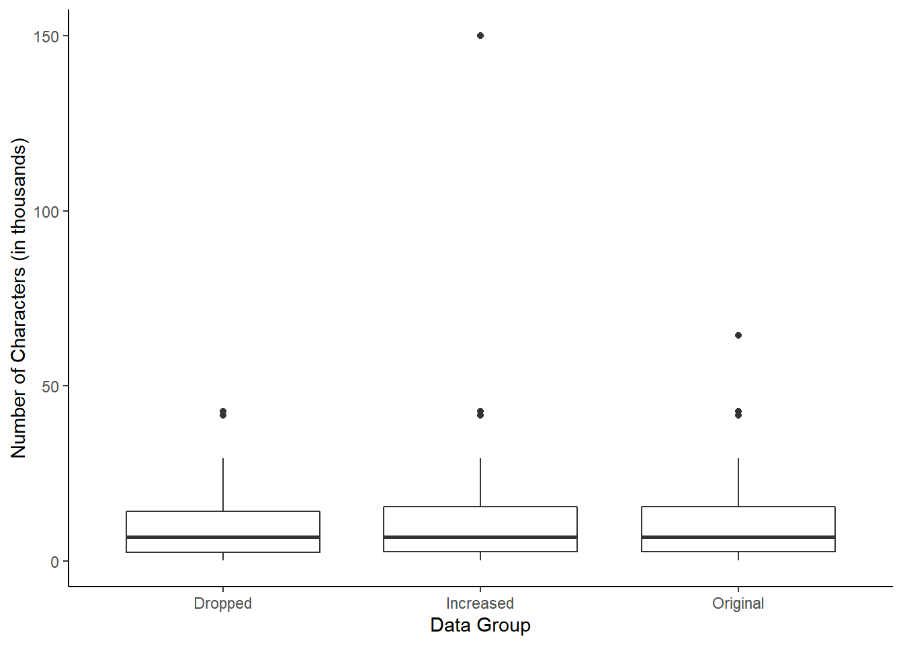
<p class="caption">(\#fig:box2-fig)Box plots of the original character count data and two modified data sets, one where the outlier at 64,401 is dropped and one where its value is increased.</p>
</div>

We can also use `favstats()` to calculate summary statistics of `value` by `group`, using the `robust` data frame created above. 


```r
favstats(value ~ group, data = robust)
```

```
##       group   min     Q1 median       Q3     max     mean       sd  n missing
## 1   Dropped 0.057 2.4540 6.7680 14.15600  42.793 10.52061 10.79768 49       0
## 2 Increased 0.057 2.5355 6.8895 15.41075 150.000 13.31020 22.43436 50       0
## 3  Original 0.057 2.5355 6.8895 15.41075  64.401 11.59822 13.12526 50       0
```

Notice by using the formula notation, we were able to calculate the summary statistics within each group.

> **Exercise**:    
(a) Which is affected more by extreme observations, the mean or median? The data summary may be helpful.^[The mean is affected more.]  
(b) Which is affected more by extreme observations, the standard deviation or IQR?^[The standard deviation is affected more.]

The median and IQR are called **robust statistics** because extreme observations have little effect on their values. The mean and standard deviation are affected much more by changes in extreme observations.

> *Example*:   
The median and IQR do not change much under the three scenarios above. Why might this be the case?^[The median and IQR are only sensitive to numbers near $Q_1$, the median, and $Q_3$. Since values in these regions are relatively stable -- there aren't large jumps between observations -- the median and IQR estimates are also quite stable.]


> **Exercise**:   
The distribution of vehicle prices tends to be right skewed, with a few luxury and sports cars lingering out into the right tail. If you were searching for a new car and cared about price, should you be more interested in the mean or median price of vehicles sold, assuming you are in the market for a regular car?^[Buyers of a *regular car* should be more concerned about the median price. High-end car sales can drastically inflate the mean price while the median will be more robust to the influence of those sales.]


### Transforming data 

When data are very strongly skewed, we sometimes transform them so they are easier to model. Consider the histogram of Major League Baseball players' salaries from 2010, which is shown in Figure \@ref(fig:hist510-fig).

<div class="figure">
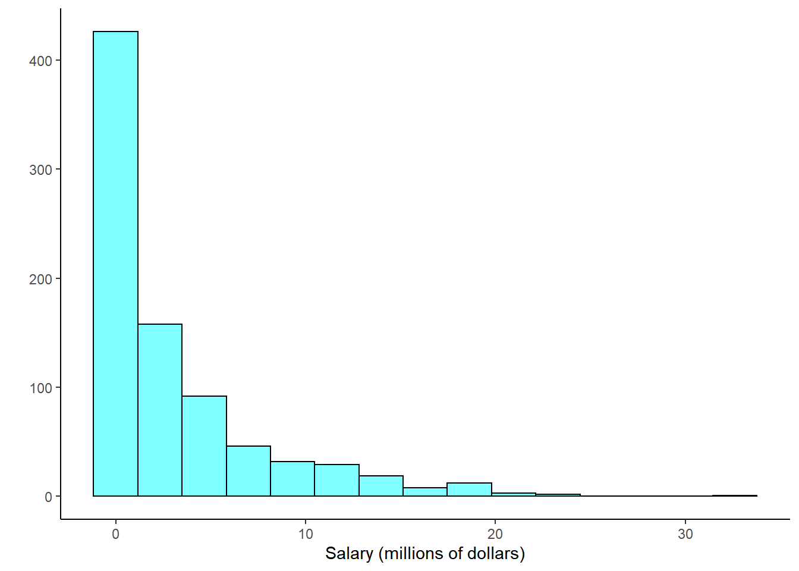
<p class="caption">(\#fig:hist510-fig)Histogram of MLB player salaries for 2010, in millions of dollars.</p>
</div>


> *Example*:   
The histogram of MLB player salaries is somewhat useful because we can see that the data are extremely skewed and centered (as gauged by the median) at about \$1 million. What about this plot is not useful?^[Most of the data are collected into one bin in the histogram and the data are so strongly skewed that many details in the data are obscured.]


There are some standard transformations that are often applied when much of the data cluster near zero (relative to the larger values in the data set) and all observations are positive. A **transformation** is a rescaling of the data using a function. For instance, a plot of the natural logarithm^[Statisticians often write the natural logarithm as $\log$. You might be more familiar with it being written as $\ln$.] of player salaries results in a new histogram in Figure \@ref(fig:hist512-fig). Transformed data are sometimes easier to work with when applying statistical models because the transformed data are much less skewed and outliers are usually less extreme.

<div class="figure">
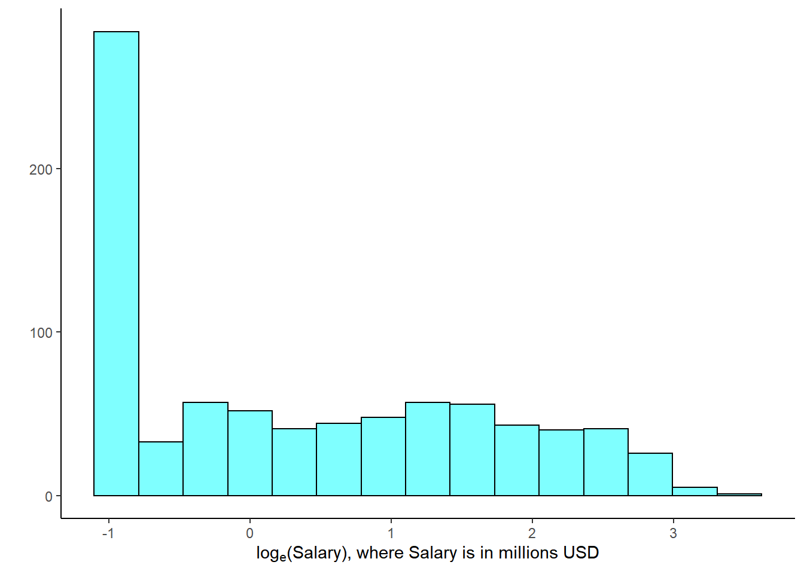
<p class="caption">(\#fig:hist512-fig)Histogram of the log-transformed MLB player salaries for 2010.</p>
</div>


Transformations can also be applied to one or both variables in a scatterplot. A scatterplot of the original `line_breaks` and `num_char` variables is shown in Figure \@ref(fig:scat52-fig) above. We can see a positive association between the variables and that many observations are clustered near zero. Later in this text, we might want to use a straight line to model the data. However, we'll find that the data in their current state cannot be modeled very well. Figure \@ref(fig:scat513-fig) shows a scatterplot where both `line_breaks` and `num_char` have been transformed using a natural log (log base $e$) transformation. While there is a positive association in each plot, the transformed data show a steadier trend, which is easier to model than the original (un-transformed) data.

<div class="figure">

<p class="caption">(\#fig:scat513-fig)A scatterplot of `line_breaks` versus `num_char` for the `email50` data, where both variables have been log-transformed.</p>
</div>

Transformations other than the logarithm can be useful, too. For instance, the square root ($\sqrt{\text{original observation}}$) and inverse $\left(\frac{1}{\text{original observation}}\right)$ are used commonly by statisticians. Common goals in transforming data are to see the data structure differently, reduce skew, assist in modeling, or straighten a nonlinear relationship in a scatterplot.


## Homework Problems

Create an Rmd file for the work including headers, file creation data, and explanation of your work. Make sure your plots have a title and the axes are labeled. 

1. **Mammals exploratory**. Data were collected on 39 species of mammals distributed over 13 taxonomic orders. The data is in the `mammals` data set in the **openintro** package.

a. Using the documentation for the `mammals` data set, report the units for the variable `brain_wt`.   

b. Using `inspect()`, how many variables are numeric?  

c. What type of variable is `danger`?  

d. Create a histogram of `total_sleep` and describe the distribution.  

e. Create a boxplot of `life_span` and describe the distribution.  

f. Report the mean and median life span of a mammal.  

g. Calculate the summary statistics for `life_span` broken down by `danger`. What is the standard deviation of life span in danger outcome 5?  


2. **Mammal life spans**. Continue using the `mammals` data set.

a. Create side-by-side boxplots for `life_span` broken down by `exposure`. Note: you will have to change `exposure` to a `factor()`. Report on any findings.  

b. What happened to the median and third quartile in exposure group 4?  

c. Using the same variables, create faceted histograms. What are the shortcomings of this plot?  

d. Create a new variable `exposed` that is a factor with level `Low` if exposure is `1` or `2` and `High` otherwise.  

e. Repeat part c) with the new `exposed` variable. Explain what you see in the plot.


3. **Mammal life spans continued**  

a. Create a scatterplot of life span versus length of gestation.  

b. What type of association is apparent between life span and length of gestation?   

c. What type of association would you expect to see if the axes of the plot were reversed, i.e. if we plotted length of gestation versus life span?  

d. Create the new scatterplot suggested in part c).  

e. Are life span and length of gestation independent? Explain your reasoning.


