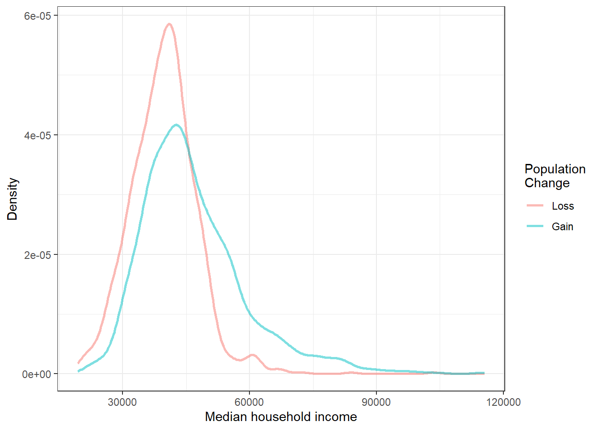

# Categorical Data {#CATDATA}


## Objectives

1) Define and use properly in context all new terminology, to include: *factor*, *contingency table*, *marginal counts*, *joint counts*, *frequency table*, *relative frequency table*, *bar plot*, *conditioning*, *segmented bar plot*, *mosaic plot*, *pie chart*, *side-by-side box plot*, *density plot*.  

2) In `R`, generate tables for categorical variable(s).   

3) In `R`, generate appropriate graphical summaries of categorical and numerical variables.  

4) Interpret and explain output both graphically and numerically.  


## Categorical data

Like numerical data, categorical data can also be organized and analyzed. This section introduces tables and other basic tools for use with categorical data. Remember at the beginning of this block of material, our case study had categorical data so we have already seen some of the ideas in this chapter.  

The `email50` data set represents a sample from a larger email data set called `email`. This larger data set contains information on 3,921 emails. In this section, we will use the `email` data set to examine whether the presence of numbers, small or large, in an email provides any useful information in classifying email as spam or not spam.  


### Contingency tables and bar plots

In the `email` data set, we have two variables, `spam` and `number`, that we want to summarize. Let's use `inspect()` to get information and insight about the two variables. We can also type `?email` or `help(email)` to learn more about the data. First, load the `openintro` library.


```r
library(openintro)
```


```r
email %>%
  select(spam, number) %>%
  inspect()
```

```
## 
## categorical variables:  
##     name  class levels    n missing
## 1 number factor      3 3921       0
##                                    distribution
## 1 small (72.1%), none (14%) ...                
## 
## quantitative variables:  
##   name   class min Q1 median Q3 max       mean        sd    n missing
## 1 spam numeric   0  0      0  0   1 0.09359857 0.2913066 3921       0
```

Notice the use of the `pipe` operator and how it adds to the ease of reading the code. The `select()` function allows us to narrow down the columns/variables to the two of interest. Then `inspect()` gives us information about those variables. We read from top line; we start with the data set `email`, input it into `select()` and select variables from it, and then use `inspect()` to summarize the variables.

As indicated above, `number` is a categorical variable (a *factor*) that describes whether an email contains no numbers, only small numbers (values under 1 million), or at least one big number (a value of 1 million or more). The variable `spam` is a numeric variable, where `1` indicates the email is spam and `0` indicates the email is not spam. To treat `spam` as categorical, we will want to change it to a *factor*, but first we will build a table that summarizes data for the two variables (Table \@ref(tab:contin1-tab)). This table is called a **contingency table**^[A contingency table is a two-way table that shows the distribution of one variable in rows and a second variable in columns.]. Each value in the table represents the number of times a particular combination of variable outcomes occurred. 

<table>
<caption>(\#tab:contin1-tab)A contingency table for the `email` data.</caption>
 <thead>
<tr>
<th style="border-bottom:hidden;padding-bottom:0; padding-left:3px;padding-right:3px;text-align: center; " colspan="1"><div style="border-bottom: 1px solid #ddd; padding-bottom: 5px; ">Spam</div></th>
<th style="border-bottom:hidden;padding-bottom:0; padding-left:3px;padding-right:3px;text-align: center; " colspan="3"><div style="border-bottom: 1px solid #ddd; padding-bottom: 5px; ">Number</div></th>
<th style="empty-cells: hide;border-bottom:hidden;" colspan="1"></th>
</tr>
  <tr>
   <th style="text-align:left;">   </th>
   <th style="text-align:right;"> none </th>
   <th style="text-align:right;"> small </th>
   <th style="text-align:right;"> big </th>
   <th style="text-align:right;"> Total </th>
  </tr>
 </thead>
<tbody>
  <tr>
   <td style="text-align:left;"> 0 </td>
   <td style="text-align:right;"> 400 </td>
   <td style="text-align:right;"> 2659 </td>
   <td style="text-align:right;"> 495 </td>
   <td style="text-align:right;"> 3554 </td>
  </tr>
  <tr>
   <td style="text-align:left;"> 1 </td>
   <td style="text-align:right;"> 149 </td>
   <td style="text-align:right;"> 168 </td>
   <td style="text-align:right;"> 50 </td>
   <td style="text-align:right;"> 367 </td>
  </tr>
  <tr>
   <td style="text-align:left;"> Total </td>
   <td style="text-align:right;"> 549 </td>
   <td style="text-align:right;"> 2827 </td>
   <td style="text-align:right;"> 545 </td>
   <td style="text-align:right;"> 3921 </td>
  </tr>
</tbody>
</table>

Below is the `R` code to generate the contingency table. 


```r
tally(~spam + number, data = email, margins = TRUE)
```

```
##        number
## spam    none small  big Total
##   0      400  2659  495  3554
##   1      149   168   50   367
##   Total  549  2827  545  3921
```

The value 149 corresponds to the number of emails in the data set that are spam *and* had no numbers listed in the email. Row and column totals are also included. The **row totals**  provide the total counts across each row (e.g. $149 + 168 + 50 = 367$), and **column totals** are total counts down each column. The row and column totals are known as **marginal**^[Marginal counts are counts based on only one of the variables in a contingency table. For example, there are 367 spam emails in the table.] counts (hence, `margins = TRUE`) and the values in the table are known as **joint**^[Joint counts are counts based on both variables in a contingency table. For example, there are 149 emails that are spam *and* contain no numbers.] counts.  

Let's turn `spam` into a factor and update the `email` data object. We will use `mutate()` to do this.  


```r
email <- email %>%
  mutate(spam = factor(email$spam, levels = c(1, 0), 
                       labels = c("spam", "not spam")))
```

Now, let's check the data again.


```r
email %>%
  select(spam, number) %>%
  inspect()
```

```
## 
## categorical variables:  
##     name  class levels    n missing
## 1   spam factor      2 3921       0
## 2 number factor      3 3921       0
##                                    distribution
## 1 not spam (90.6%), spam (9.4%)                
## 2 small (72.1%), none (14%) ...
```

Let's generate the contingency table again.


```r
tally(~spam + number, data = email, margins = TRUE)
```

```
##           number
## spam       none small  big Total
##   spam      149   168   50   367
##   not spam  400  2659  495  3554
##   Total     549  2827  545  3921
```

A table for a single variable is called a **frequency table**. The table below is a frequency table for the `number` variable. 


```r
tally(~number, data = email)
```

```
## number
##  none small   big 
##   549  2827   545
```

If we replaced the counts with percentages or proportions, the table would be called a **relative frequency table**.


```r
tally(~number, data = email, format = 'proportion')
```

```
## number
##      none     small       big 
## 0.1400153 0.7209895 0.1389952
```


```r
round(tally(~number, data = email, format = 'percent'), 2)
```

```
## number
##  none small   big 
##  14.0  72.1  13.9
```

A bar plot is a common way to display a single categorical variable. Figure \@ref(fig:bar61-fig) shows a **bar plot** for the `number` variable. 


```r
email %>%
  gf_bar(~number) %>%
  gf_theme(theme_bw()) %>%
  gf_labs(x = "Size of Number", y = "Count")
```

<div class="figure">

<p class="caption">(\#fig:bar61-fig)Bar chart of the `number` variable.</p>
</div>


Next, the counts are converted into proportions (e.g., $549 / 3921 = 0.140$ for `none`) in Figure \@ref(fig:bar62-fig).


```r
email %>%
  gf_props(~number) %>%
  gf_theme(theme_bw()) %>%
  gf_labs(x = "Size of Number", y = "Proportion")
```

<div class="figure">

<p class="caption">(\#fig:bar62-fig)Bar chart of the `number` variable as a proportion.</p>
</div>

Again, let's clean up the plot into a style that we could use in a report.


```r
email %>%
  gf_props(~number, 
           title = "The proportions of emails with a number in it",
           subtitle = "From 2012", xlab = "Type of number in the email",
           ylab = "Proportion of emails") %>%
  gf_theme(theme_bw())
```


### Column proportions

The table below shows the column proportions. The **column proportions** are computed as the counts divided by their column totals. The value 149 at the intersection of *spam* and *none* is replaced by $149 / 549 = 0.271$, i.e., 149 divided by its column total, 549. So what does 0.271 represent? It corresponds to the proportion of emails in the sample with no numbers that are spam. That is, the proportion of emails that are spam, out of all the emails with no numbers. We are **conditioning**, restricting, on emails with no number. This rate of spam is much higher than emails with only small numbers (5.9\%) or big numbers (9.2\%). Because these spam rates vary between the three levels of `number` (*none*, *small*, *big*), this provides evidence that the `spam` and `number` variables are associated.


```r
tally(spam ~ number, data = email, margins = TRUE, format = 'proportion')
```

```
##           number
## spam             none      small        big
##   spam     0.27140255 0.05942695 0.09174312
##   not spam 0.72859745 0.94057305 0.90825688
##   Total    1.00000000 1.00000000 1.00000000
```

The `tally()` function will always condition on the variable on the right-hand side of the tilde, ~, when calculating proportions. Thus, `tally()` only generates column or overall proportions. It cannot generate row proportions. The more general `table()` function of `R` will allow either column or row proportions.  

> **Exercise**:   
Create a table of column proportions where the variable `spam` is the column variable.


```r
tally(number ~ spam, data = email, margins = TRUE, format = 'proportion')
```

```
##        spam
## number       spam  not spam
##   none  0.4059946 0.1125492
##   small 0.4577657 0.7481711
##   big   0.1362398 0.1392797
##   Total 1.0000000 1.0000000
```

> **Exercise**:   
In the table you just created, what does 0.748 represent?^[This is the proportion of `not spam` emails that had a small number in it.] 

> **Exercise**: 
Create a table of proportions, where `spam` is the column variable and the values shown represent the proportion of the entire sample in each category. 


```r
tally(~ number + spam, data = email, margins = TRUE, format = "proportion")
```

```
##        spam
## number        spam   not spam      Total
##   none  0.03800051 0.10201479 0.14001530
##   small 0.04284621 0.67814333 0.72098954
##   big   0.01275185 0.12624331 0.13899515
##   Total 0.09359857 0.90640143 1.00000000
```

>*Example*:  
Data scientists use statistics to filter spam from incoming email messages. By noting specific characteristics of an email, a data scientist may be able to classify some emails as spam or not spam with high accuracy. One of those characteristics is whether the email contains no numbers, small numbers, or big numbers. Another characteristic is whether or not an email has any HTML content (given by the `format` variable). A contingency table for the `spam` and `format` variables is needed.  
1. Make `format` into a categorical factor variable. The levels should be "text" and "HTML".^[From the help menu on the data, HTML is coded as a 1.]  
2. Create a contingency table from the `email` data set with `format` in the columns and `spam` in the rows.  


```r
email <- email %>% 
  mutate(format = factor(email$format, levels = c(1, 0), 
                         labels = c("HTML", "text")))
```

In deciding which variable to use as a column, the data scientist would be interested in how the proportion of spam changes within each email format. This corresponds to column proportions based on `format`: the proportion of spam in plain text emails and the proportion of spam in HTML emails.


```r
tally(spam ~ format, data = email, margins = TRUE, format = "proportion")
```

```
##           format
## spam             HTML       text
##   spam     0.05796038 0.17489540
##   not spam 0.94203962 0.82510460
##   Total    1.00000000 1.00000000
```

In generating the column proportions, we can see that a higher fraction of plain text emails are spam ($209 / 1195 = 17.5\%$) compared to HTML emails ($158 / 2726 = 5.8\%$). This information on its own is insufficient to classify an email as spam or not spam, as over 80\% of plain text emails are not spam. Yet, when we carefully combine this information with many other characteristics, such as `number` and other variables, we stand a reasonable chance of being able to classify an email as spam or not spam. 

In constructing a table, we need to think about which variable we want in the column and which in the row. The formula notation in some ways makes us think about the response and predictor variables, with the response variable (left-hand side) displayed in the rows and the predictor variable (right-hand side) displayed in the columns. However, in some cases, it is not clear which variable should be in the column and row and the analyst must decide what is being communicated with the table. Before settling on one form for a table, it is important to consider the audience and the message they are to receive from the table.

> **Exercise**:  
Create two tables with `number` and `spam`: one where `number` is in the columns, and one where `spam` is in the columns. Which table would be more useful to someone hoping to identify spam emails based on the type of numbers in the email?^[The table with `number` in the columns will probably be most useful. This table makes it easier to see that emails with small numbers are spam about 5.9\% of the time (relatively rare). In contrast, we see that about 27.1\% of emails with no numbers are spam, and 9.2\% of emails with big numbers are spam.]


```r
tally(spam ~ number, data = email, format = 'proportion', margin = TRUE)
```

```
##           number
## spam             none      small        big
##   spam     0.27140255 0.05942695 0.09174312
##   not spam 0.72859745 0.94057305 0.90825688
##   Total    1.00000000 1.00000000 1.00000000
```


```r
tally(number ~ spam, data = email, format = 'proportion', margin = TRUE)
```

```
##        spam
## number       spam  not spam
##   none  0.4059946 0.1125492
##   small 0.4577657 0.7481711
##   big   0.1362398 0.1392797
##   Total 1.0000000 1.0000000
```

### Segmented bar and mosaic plots

Contingency tables using column proportions are especially useful for examining how two categorical variables are related. Segmented bar and mosaic plots provide a way to visualize the information in these tables.

A **segmented bar plot** is a graphical display of contingency table information. For example, a segmented bar plot representing the table with `number` in the columns is shown in Figure \@ref(fig:barseg61-fig), where we have first created a bar plot using the `number` variable and then separated each group by the levels of `spam` using the `fill` argument. 


```r
email %>%
  gf_bar(~number, fill = ~spam) %>%
  gf_theme(theme_bw()) %>%
  gf_labs(x = "Size of Number", y = "Count")
```

<div class="figure">

<p class="caption">(\#fig:barseg61-fig)Segmented bar plot for numbers found in `emails`, where the counts have been further broken down by `spam`.</p>
</div>


The column proportions of the table have been translated into a standardized segmented bar plot in Figure \@ref(fig:barseg62-fig), which is a helpful visualization of the fraction of spam emails within each level of `number`.

(ref:quote62) "Standardized version of Figure \@ref(fig:barseg61-fig).


```r
email %>%
  gf_props(~number, fill = ~spam, position = 'fill') %>%
  gf_theme(theme_bw()) %>%
  gf_labs(x = "Size of Number", y = "Proportion")
```

<div class="figure">

<p class="caption">(\#fig:barseg62-fig)(ref:quote62)</p>
</div>

> *Example*:  
Examine both of the segmented bar plots. Which is more useful?^[Figure \@ref(fig:barseg61-fig) contains more information, but Figure \@ref(fig:barseg62-fig) presents the information more clearly. This second plot makes it clear that emails with no number have a relatively high rate of spam email -- about 27\%! On the other hand, less than 10\% of emails with small or big numbers are spam.]

Since the proportion of spam changes across the groups in Figure \@ref(fig:barseg62-fig), we can conclude the variables are dependent, which is something we were also able to discern using table proportions. Because both the `none` and `big` groups have relatively few observations compared to the `small` group, the association is more difficult to see in Figure \@ref(fig:barseg61-fig).

In other cases, a segmented bar plot that is not standardized will be more useful in communicating important information. Before settling on a particular segmented bar plot, create standardized and non-standardized forms and decide which is more effective at communicating features of the data.

A **mosaic plot** is a graphical display of contingency table information that is similar to a bar plot for one variable or a segmented bar plot when using two variables. It seems strange, but mosaic plots are not part of the **mosaic** package. We must load another set of packages called **vcd** and **vcdExtra**. Mosaic plots help to visualize the pattern of associations among variables in two-way and larger tables. Mosaic plots are controversial because they rely on the perception of area; human vision is not good at distinguishing areas. 

We introduce mosaic plots as another way to visualize contingency tables. Figure \@ref(fig:mosaic61-fig) shows a one-variable mosaic plot for the `number` variable. Each row represents a level of `number`, and the row heights correspond to the proportion of emails of each number type. For instance, there are fewer emails with no numbers than emails with only small numbers, so the `none` outcome row is shorter in height. In general, mosaic plots use box *areas* to represent the number of observations. Since there is only one variable, the widths are all constant. Thus area is simply related to row height making this visual easy to read.


```r
library(vcd)
```


```r
mosaic(~number, data = email)
```

<div class="figure">

<p class="caption">(\#fig:mosaic61-fig)Mosaic plot where emails are grouped by the `number` variable.</p>
</div>

This one-variable mosaic plot can be further divided into pieces as in Figure \@ref(fig:mosaic62-fig) using the `spam` variable. The first variable in the formula is used to determine row height. That is, each row is split proportionally according to the fraction of emails in each number category. These heights are similar to those in Figure \@ref(fig:mosaic61-fig). Next, each row is split horizontally according to the proportion of emails that were spam in that number group. For example, the second row, representing emails with only small numbers, was divided into emails that were spam (left) and not spam (right). The area of the rectangles represents the overall proportions in the table, where each cell count is divided by the total count. First, we will generate the table and then represent it as a mosaic plot.


```r
tally(~number + spam, data = email, format = 'proportion')
```

```
##        spam
## number        spam   not spam
##   none  0.03800051 0.10201479
##   small 0.04284621 0.67814333
##   big   0.01275185 0.12624331
```


```r
mosaic(~number + spam, data = email)
```

<div class="figure">

<p class="caption">(\#fig:mosaic62-fig)Mosaic plot with `number` as the first (row) variable.</p>
</div>

These plots are hard to use in a visual comparison of area. For example, is the area for *small* number *spam* emails different from *none* number *spam* emails? The rectangles have different shapes but from the table we can tell the areas are very similar. 

An important use of the mosaic plot is to determine if an association between variables may be present. The bottom row of the first column represents spam emails that had big numbers, and the bottom row of the second column represents regular emails that had big numbers. We can again use this plot to see that the `spam` and `number` variables are associated since some rows are divided in different vertical locations than others, which was the same technique used for checking an association in the standardized version of the segmented bar plot.

In a similar way, a mosaic plot representing column proportions where *spam* is in the column could be constructed. 


```r
mosaic(~spam + number, data = email)
```

<div class="figure">

<p class="caption">(\#fig:mosaic63-fig)Mosaic plot with `spam` as the first (row) variable.</p>
</div>

To completely understand the mosaic plot as shown in Figure \@ref(fig:mosaic63-fig), let's first find the proportions of `spam`. 


```r
tally(~spam, data = email, format = "proportion")
```

```
## spam
##       spam   not spam 
## 0.09359857 0.90640143
```

So, the row heights will be split 90-10. Next, let's find the proportions of `number` within each value of `spam`. In the spam row, *none* will be 41\%, *small* will be 46\%, and *big* will be 13\%. In the not spam row, *none* will be 11\%, *small* will be 75\%, and *big* will be 14\%. 


```r
tally(number ~ spam, data = email, margins = TRUE, format = "proportion")
```

```
##        spam
## number       spam  not spam
##   none  0.4059946 0.1125492
##   small 0.4577657 0.7481711
##   big   0.1362398 0.1392797
##   Total 1.0000000 1.0000000
```

However, because it is more insightful for this application to consider the fraction of spam in each category of the `number` variable, we prefer Figure \@ref(fig:mosaic62-fig).


### The only pie chart you will see in this book, hopefully

While pie charts are well known, they are typically not as useful as other charts in a data analysis. A **pie chart** is shown in Figure \@ref(fig:pie61-fig). It is generally more difficult to compare group sizes in a pie chart than in a bar plot, especially when categories have nearly identical counts or proportions. Just as human vision is bad at distinguishing areas, human vision is also bad at distinguishing angles. In the case of the *none* and *big* categories, the difference is so slight you may be unable to distinguish any difference in group sizes.


```r
pie(table(email$number), col = COL[c(3, 1, 2)], radius = 0.75)
```

<div class="figure">

<p class="caption">(\#fig:pie61-fig)A pie chart for `number` in the email data set.</p>
</div>

Pie charts are popular in the Air Force due to the ease of generating them in Excel and PowerPoint. However, the values for each slice are often printed on top of the chart making the chart irrelevant. We recommend a minimal use of pie charts in your work.  


### Comparing numerical data across groups

Some of the more interesting investigations can be done by examining numerical data across groups. This is the case where one variable is categorical and the other is numerical. The methods required here aren't really new. All that is required is to make a numerical plot for each group. Here, two convenient methods are introduced: side-by-side box plots and density plots.

We will again take a look at the subset of the `county_complete` data set. Let's compare the median household income for counties that gained population from 2000 to 2010 versus counties that had no gain. While we might like to make a causal connection here, remember that these are observational data, so such an interpretation would be unjustified.

This section will give us a chance to perform some data wrangling. We will be using the `tidyverse` verbs in the process. Data wrangling is an important part of analysis work and typically makes up a significant portion of the analysis work.

Here is the code to generate the data we need.


```r
library(usdata)
```


```r
county_tidy <- county_complete %>% 
  select(name, state, pop2000, pop2010, fed_spend = fed_spending_2009, 
         poverty = poverty_2010, homeownership = homeownership_2010, 
         multi_unit = housing_multi_unit_2010, income = per_capita_income_2010, 
         med_income = median_household_income_2010) %>%
  mutate(fed_spend = fed_spend / pop2010)
```


First, as a reminder, let's look at the data. 

*What do we want `R` to do?*  

We want to select the variables `pop2000`, `pop2010`, and `med_income`.   

*What does `R` need in order to do this?*  

It needs the data object, and the desired variable names.  

We will use the `select()` and `inspect()` functions. 


```r
county_tidy %>%
  select(pop2000, pop2010, med_income) %>%
  inspect()
```

```
## 
## quantitative variables:  
##         name   class   min       Q1 median    Q3     max     mean        sd
## 1    pop2000 numeric    67 11223.50  24621 61775 9519338 89649.99 292547.67
## 2    pop2010 numeric    82 11114.50  25872 66780 9818605 98262.04 312946.70
## 3 med_income numeric 19351 36956.25  42450 49144  115574 44274.12  11547.49
##      n missing
## 1 3139       3
## 2 3142       0
## 3 3142       0
```

Notice that three counties are missing population values for the year 2000, reported as `NA`. Let's remove them and find which counties increased in population by creating a new variable.


```r
cc_reduced <- county_tidy %>%
  drop_na(pop2000) %>%
  select(pop2000, pop2010, med_income) %>%
  mutate(pop_gain = sign(pop2010-pop2000))
```


```r
tally(~pop_gain, data = cc_reduced)
```

```
## pop_gain
##   -1    0    1 
## 1097    1 2041
```

There were 2,041 counties where the population increased from 2000 to 2010, and there were 1,098 counties with no gain. Only 1 county had a net of zero, and 1,0987 had a loss. Let's just look at the counties with a gain or loss in a side-by-side boxplot. Again, we will use `filter()` to select the two groups and then make the variable `pop_gain` into a categorical variable. It's time for more data wrangling.


```r
cc_reduced <- cc_reduced %>%
  filter(pop_gain != 0) %>%
  mutate(pop_gain = factor(pop_gain, levels = c(-1, 1), 
                           labels = c("Loss", "Gain")))
```


```r
inspect(cc_reduced)
```

```
## 
## categorical variables:  
##       name  class levels    n missing
## 1 pop_gain factor      2 3138       0
##                                    distribution
## 1 Gain (65%), Loss (35%)                       
## 
## quantitative variables:  
##         name   class   min       Q1  median      Q3     max     mean        sd
## 1    pop2000 numeric    67 11217.25 24608.0 61783.5 9519338 89669.37 292592.28
## 2    pop2010 numeric    82 11127.00 25872.0 66972.0 9818605 98359.23 313133.28
## 3 med_income numeric 19351 36950.00 42443.5 49120.0  115574 44253.24  11528.95
##      n missing
## 1 3138       0
## 2 3138       0
## 3 3138       0
```

The **side-by-side box plot** is a traditional tool for comparing across groups. An example is shown in Figure \@ref(fig:sbysbox61-fig) where there are two box plots, one for each group, drawn on the same scale.


```r
cc_reduced %>%
  gf_boxplot(med_income ~ pop_gain,
             subtitle = "The income data were collected between 2006 and 2010.",
             xlab = "Population change from 2000 to 2010",
             ylab = "Median Household Income") %>%
  gf_theme(theme_bw())
```

<div class="figure">

<p class="caption">(\#fig:sbysbox61-fig)Side-by-side box plot for median household income, where the counties are split by whether there was a population gain or loss from 2000 to 2010.</p>
</div>

Another useful plotting method uses **density plots** to compare numerical data across groups. A histogram bins data but is highly dependent on the number and boundary of the bins. A density plot also estimates the distribution of a numerical variable but does this by estimating the density of data points in a small window around each data point. The overall curve is the sum of this small density estimate. A density plot can be thought of as a smooth version of the histogram. Several options go into a density estimate, such as the width of the window and type of smoothing function. These ideas are beyond the scope here and we will just use the default options. Figure \@ref(fig:dens61-fig) is a plot of the two density curves.


```r
cc_reduced %>%
  gf_dens(~med_income, color = ~pop_gain, lwd = 1) %>%
  gf_theme(theme_bw()) %>%
  gf_labs(x = "Median household income", y = "Density", col = "Population \nChange")
```

<div class="figure">

<p class="caption">(\#fig:dens61-fig)Density plots of median household income for counties with population gain versus population loss.</p>
</div>

> **Exercise**:  
Use the box plots and density plots to compare the incomes for counties across the two groups. What do you notice about the approximate center of each group? What do you notice about the variability between groups? Is the shape relatively consistent between groups? How many *prominent* modes are there for each group?^[Answers may vary a little. The counties with population gains tend to have higher income (median of about \$45,000) versus counties without a gain (median of about \$40,000). The variability is also slightly larger for the population gain group. This is evident in the IQR, which is about 50\% bigger in the *gain* group. Both distributions show slight to moderate right skew and are unimodal. There is a secondary small bump at about \$60,000 for the *no gain* group, visible in the density plot, that seems out of place. (Looking into the data set, we would find that 8 of these 15 counties are in Alaska and Texas.) The box plots indicate there are many observations far above the median in each group, though we should anticipate that many observations will fall beyond the whiskers when using such a large data set.]


> **Exercise**:   
What components of Figures \@ref(fig:sbysbox61-fig) and \@ref(fig:dens61-fig) do you find most useful?^[The side-by-side box plots are especially useful for comparing centers and spreads, while the density plots are more useful for seeing distribution shape, skew, and groups of anomalies.]


## Homework Problems

Create an Rmd file for the work including headers, file creation data, and explanation of your work. Make sure your plots have a title and the axes are labeled.

1. **Views on immigration**. 910 randomly sampled, registered voters from Tampa, FL were asked if they thought workers who have illegally entered the US should be (i) allowed to keep their jobs and apply for US citizenship, (ii) allowed to keep their jobs as temporary guest workers but not allowed to apply for US citizenship, or (iii) lose their jobs and have to leave the country.

    The data is in the **openintro** package in the `immigration` data set.

a. How many levels of *political* are there?  

b. Create a table using `tally()`. Note: a table showing overall proportions or percents may be most helpful for parts c) through e).     

c. What percent of these Tampa, FL voters identify themselves as conservatives?  

d. What percent of these Tampa, FL voters are in favor of the citizenship option?  

e. What percent of these Tampa, FL voters identify themselves as conservatives and are in favor of the citizenship option?  

f. What percent of these Tampa, FL voters who identify themselves as conservatives are also in favor of the citizenship option? What percent of moderates and liberal share this view?  

g. Create a stacked bar chart to reflect your work in part f).   

h. Using your plot, do political ideology and views on immigration appear to be independent? Explain your reasoning.  


2. **Views on the DREAM Act**. The same survey from Exercise 1 also asked respondents if they support the DREAM Act, a proposed law which would provide a path to citizenship for people brought illegally to the US as children. 

    The data is in the **openintro** package in the `dream` data object.

a. Create a *mosaic* plot of political view versus stance on the DREAM Act. 

b. Based on the mosaic plot, are views on the DREAM Act and political ideology independent?  


3. **Heart transplants**. The Stanford University Heart Transplant Study was conducted to determine whether an experimental heart transplant program increased lifespan. Each patient entering the program was designated an official heart transplant candidate, meaning that he was gravely ill and would most likely benefit from a new heart. Some patients got a transplant and some did not. The variable *transplant* indicates which group the patients were in; patients in the treatment group got a transplant and those in the control group did not. Another variable called *survived* was used to indicate whether or not the patient was alive at the end of the study.

    The data is in the **openintro** package and is called `heart_transplant`.

a. Create a **mosaic** plot of treatment versus survival status.  

b. Based on the mosaic plot, is survival independent of whether or not the patient got a transplant? Explain your reasoning.  

c. Create side-by-side boxplots of survival time for the control and treatment groups.    

d. What do the box plots suggest about the efficacy (effectiveness) of transplants?  

