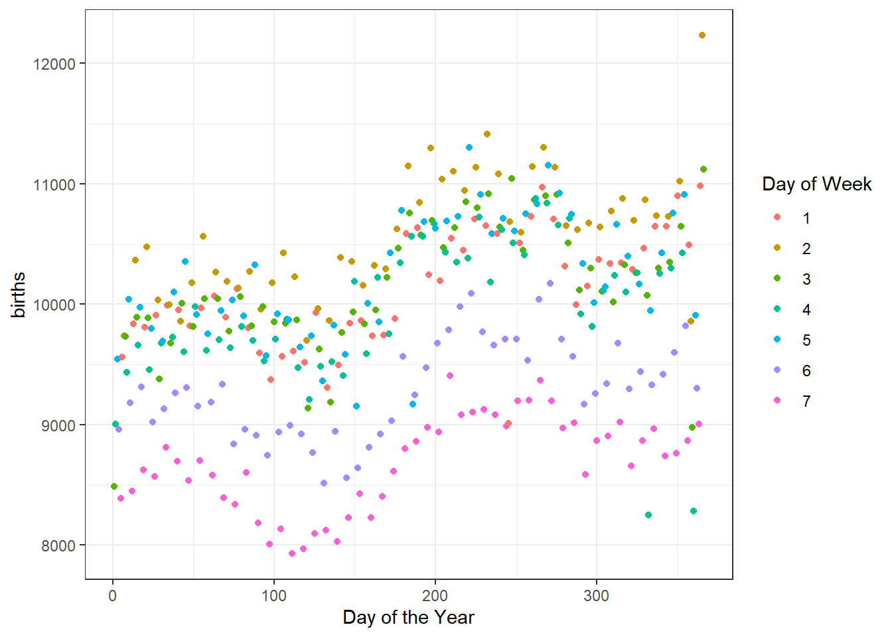

# (PART) Probability Modeling {-} 

# Case Study {#CS2}


## Objectives

1) Use R to simulate a probabilistic model.  
2) Use basic counting methods.


## Introduction to probability models

In this second block of material we will focus on probability models. We will take two approaches, one is mathematical and the other is computational. In some cases we can use both methods on a problem and in others only the computational approach is feasible. The mathematical approach to probability modeling allows us insight into the problem and the ability to understand the process. Simulation has a much greater ability to generalize but can be time intensive to run and often requires the writing of custom functions.

This case study is extensive and may seem overwhelming, do not worry we will discuss these ideas again in the many lessons we have coming up this block.

## Probability models

Probability models are an important tool for data analysts. They are used to explain variation in outcomes that cannot be explained by other variables. We will use these ideas in the Statistical Modeling Block to help us make decisions about our statistical models. 

Often probability models are used to answer a question of the form "What is the chance that .....?" This means that we typically have an experiment or trial where multiple outcomes are possible and we only have an idea of the frequency of those outcomes. We use this frequency as a measure of the probability of a particular outcome.

For this block we will focus just on probability models. To apply a probability model we will need to 

1. Select the experiment and its possible outcomes.
2. Have probability values for the outcomes which may include **parameters** that determine the probabilities.
3. Understand the assumptions behind the model


## Case study

There is a famous example of a probability question that we will attack in this case study. The question we want to answer is "In a room of $n$ people what is the chance that at least two people have the same birthday?"

> **Exercise**:  
The typical classroom at USAFA has 18 students in it. What do you think the chance that at least two students have the same birthday?^[The answer is around 34.7\%, how close were you?]  


### Break down the question

The first action we should take is to understand what is being asked.

1. What is the experiment or trial?
2. What does it mean to have the same birthday?
3. What about leap years?
4. What about the frequency of births? Are some days less likely than others?

> **Exercise**:  
Discuss these questions and others that you think are relevant.^[Another question may be What does it mean at least two people have matching birthdays?]

The best first step is to make a simple model, often these are the only ones that will have a mathematical solution. For our problem this means we answer the above questions.

1. We have a room of 18 people and we look at their birthdays. We either have two or more birthdays matching or not; thus there are two outcomes.
2. We don't care about the year, only the day and month. Thus two people born on May 16th are a match.
3. We will ignore leap years.
4. We will assume that a person has equal probability of being born on any of the 365 days of the year.
5. At least two means we could have multiple matches on the same day or several different days where multiple people have matching birthdays.


### Simulate (computational)

Now that we have an idea about the structure of the problem, we next need to think about how we would simulate a single classroom. We have 18 students in the classroom and they all could have any of the 365 days of the year as a birthday. What we need to do is sample birthdays for each of the 18 students. But how do we code the days of the year?

An easy solution is to just label the days from 1 to 365. The function `seq()` does this for us.


```r
days <- seq(1,365)
```

Next we need to pick one of the days using the sample function. Note that we set the seed to get repeatable results, this is not required.


```r
set.seed(2022)
sample(days,1)
```

```
## [1] 228
```

The first person was born on the 228th day of the year.

Since `R` works on vectors, we don't have to write a loop to select 18 days, we just have `sample()` do it for us.


```r
class <- sample(days,size=18,replace = TRUE)
class
```

```
##  [1] 206 311 331 196 262 191 206 123 233 270 248   7 349 112   1 307 288 354
```

What do we want `R` to do? Sample from the numbers 1 to 365 with replacement, which means a number can be picked more than once.

Notice in our sample we have at least one match, although it is difficult to look at this list and see the match. Let's sort them to make it easier for us to see.


```r
sort(class)
```

```
##  [1]   1   7 112 123 191 196 206 206 233 248 262 270 288 307 311 331 349 354
```

The next step is to find a way in `R` for the code to detect that there is a match.

>**Exercise**:  
What idea(s) can we use to determine if a match exists?

We could sort the data and look at differences in sequential values and then check if the set of differences contains a zero. This seems to be computationally expensive. Instead we will use the function `unique()` which gives a vector of unique values in an object. The function `length()` gives the number of elements in the vector.


```r
length(unique(class))
```

```
## [1] 17
```

Since we only have 17 unique values in a vector of size 18, we have a match. Now let's put this all together to generate another classroom of size 18.


```r
length(unique(sample(days,size=18,replace = TRUE)))
```

```
## [1] 16
```

The next problem that needs to be solved is how to repeat the classrooms and keep track of those that have a match. There are several functions we could use to include `replicate()` but we will use `do()` from the **mosaic** package because it returns a data frame so we can use `tidyverse` verbs to wrangle the data.

The `do()` function allows us to repeat an operation many times. The following template

```
do(n) * {stuff to do}              # pseudo-code
```

where {stuff to do} is typically a single `R` command, but may be something more complicated. 

Load the libraries.


```r
library(mosaic)
library(tidyverse)
```


```r
do(5)*length(unique(sample(days,size=18,replace = TRUE)))
```

```
##   length
## 1     18
## 2     17
## 3     17
## 4     17
## 5     18
```

Let's repeat for a larger number of simulated classroom, remember you should be asking yourself:

*What do I want `R` to do?*   
*What does `R` need to do this?*


```r
(do(1000)*length(unique(sample(days,size=18,replace = TRUE)))) %>%
  mutate(match=if_else(length==18,0,1)) %>%
  summarise(prob=mean(match))
```

```
##   prob
## 1 0.36
```

This is within 2 decimal places of the mathematical solution we develop shortly.

How many classrooms do we need to simulate to get an accurate estimate of the probability of a match? That is a statistical modeling question and it depends on how much variability we can accept. We will discuss these ideas later in the semester. For now, you can run the code multiple times and see how the estimate varies. If computational power is cheap, you can increase the number of simulations.


```r
(do(10000)*length(unique(sample(days,size=18,replace = TRUE)))) %>%
  mutate(match=if_else(length==18,0,1)) %>%
  summarise(prob=mean(match))
```

```
##     prob
## 1 0.3442
```

### Plotting  

By the way, the method we have used to create the data allows us to summarize the number of unique birthdays using a table or bar chart. Let's do that now. Note that since the first argument in `tally()` is not data then the **pipe** operator will not work without some extra effort. We must tell `R` that the data is the previous argument in the pipeline and thus use the symbol **.** to denote this.


```r
(do(1000)*length(unique(sample(days,size=18,replace = TRUE)))) %>%
  tally(~length,data=.)
```

```
## length
##  14  15  16  17  18 
##   1   7  52 253 687
```

Figure \@ref(fig:bar71-fig) is a plot of the number of unique birthdays in our sample.


```r
(do(1000)*length(unique(sample(days,size=18,replace = TRUE)))) %>%
  gf_bar(~length) %>%
  gf_theme(theme_bw()) %>%
  gf_labs(x="Number of unique birthdays",y="Count")
```

<div class="figure">

<p class="caption">(\#fig:bar71-fig)Bar chart of the number of unique birthdays in the sample.</p>
</div>


> **Exercise**:  
What does it mean if the length of unique birthdays is 16, in terms of matches?^[It is possible that 3 people all have the same birthday or two sets of 2 people have the same birthday but different from the other pair.]

### Mathematical solution  

To solve this problem mathematically, we will step through the logic one step at a time. One of the key ideas that we will see many times is the idea of the **multiplication** rule. This idea is the foundation for **permutation** and **combinations** which are counting methods frequently used in probability calculations.

The first step that we take is to understand the idea of 2 or more people with the same birthday. With 18 people, there are a great deal of possibilities for 2 or more birthdays. We could have exactly 2 people with the same birthday. We could have 18 people with the same birthday, We could have 3 people with the same birthday and another 2 people with the same birthday but different from the other 3. Accounting for all these possibilities is too large a counting process. Instead, we will take the approach of finding the probability of no one having a matching birthday. Then the probability of at least 2 people having a matching birthday is 1 minus the probability that no one has a matching birthday. This is known as a **complementary** probability. A simpler example is to think about rolling a single die. The probability of rolling a 6 is equivalent to 1 minus the probability of not rolling a 6.

We first need to think about all the different ways we could get 18 birthdays. This is going to be our denominator in the probability calculation. First let's just look at 2 people. The first person could have 365 different days for their birthday. The second person could also have 365 different birthdays. So for each birthday of the first person there could be 365 birthdays for the second. Thus for 2 people there are $365^2$ possible sets of birthdays. This is an example of the *multiplication rule*. For 18 people there are $365^{18}$ sets of birthdays. That is a large number. Again, this will be our denominator in calculating the probability. 

The numerator is the number of sets of birthdays with no matches. Again, let's consider 2 people. The first person can have a birthday on any day of the year, so 365 possibilities. Since we don't want a match, the second person can only have 364 possibilities for a birthday. Thus we have $365 \times 364$ possibilities for two people to have different birthdays.

> Exercise:  
What is the number of possibilities for 18 people so that no one has the same birthday.  

The answer for 18 people is $365 \times 364 \times 363 ... \times 349 \times 348$. This looks like a truncated factorial. Remember a factorial, written as $n!$ with an explanation point, is the product of successive positive integers. As an example $3!$ is $3 \times 2 \times 1$ or 6. We could write the multiplication for the numerator as $$\frac{365!}{(365-n)!}$$ As we will learn, the multiplication rule for the numerator is known as a **permutation**.

We are ready to put it all together. For 18 people, the probability of 2 or more people with the same birthday is 1 minus the probability that no one has the same birthday, which is

$$1 - \frac{\frac{365!}{(365-18)!}}{365^{18}}$$ or 

$$1 - \frac{\frac{365!}{347!}}{365^{18}}$$

In `R` there is a function called `factorial()` but factorials get large fast and we will **overflow** the memory. Try `factorial(365)` in `R` to see what happens.


```r
factorial(365)
```

```
## [1] Inf
```

It is returning *infinity* because the number is too large for the buffer. As is often the case we will have when using a computational method, we must be clever about our approach. Instead of using factorials we can make use of `R`s ability to work on vectors. If we provide `R` with a vector of values, the `prod()` will perform a product of all the elements.


```r
365*364
```

```
## [1] 132860
```


```r
prod(365:364)
```

```
## [1] 132860
```


```r
1- prod(365:348)/(365^18)
```

```
## [1] 0.3469114
```

### General solution 

We now have the mathematics to understand the problem. We can easily generalize this to any number of people. To do this, we have to write a function in `R`. As with everything in `R`, we save a function as an object. The general format for creating a function is


```r
my_function <- function(parameters){
  code for function
}
```

For this problem we will call the function `birthday_prob()`. The only parameter we need is the number of people in the room, `n`. Let's write this function.


```r
birthday_prob <- function(n=20){
  1- prod(365:(365-(n-1)))/(365^n)
}
```

Notice we assigned the function to the name `birthday_prob`, we told `R` to expect one argument to the function, which we are calling `n`, and then we provide `R` with the code to find the probability. We set a default value for `n` in case one is not provided to prevent an error when the function is run. We will learn more about writing functions over this and the next semester.

Test the code with a know answer.


```r
birthday_prob(18)
```

```
## [1] 0.3469114
```

Now we can determine the probability for any size room. You may have heard that it only takes about 23 people in a room to have a 50\% probability of at least 2 people matching birthdays.


```r
birthday_prob(23)
```

```
## [1] 0.5072972
```

Let's create a plot of the probability versus number of people in the room. To do this, we need to apply the function to a vector of values. The function `sapply()` will work or we can also use `Vectorize()` to alter our existing function. We choose the latter option.

First notice what happens if we input a vector into our function.


```r
birthday_prob(1:20)
```

```
## Warning in 365:(365 - (n - 1)): numerical expression has 20 elements: only the
## first used
```

```
##  [1] 0.0000000 0.9972603 0.9999925 1.0000000 1.0000000 1.0000000 1.0000000
##  [8] 1.0000000 1.0000000 1.0000000 1.0000000 1.0000000 1.0000000 1.0000000
## [15] 1.0000000 1.0000000 1.0000000 1.0000000 1.0000000 1.0000000
```

It only uses the first value. There are several ways to solve this problem. We can use the `map()` function in the **purrr** package. This idea of mapping a function to a vector is important in data science. It is used in scenarios where there is a lot of data. In this case the idea of map-reduce is used to make the analysis amenable to parallel computing.


```r
map_dbl(1:20,birthday_prob)
```

```
##  [1] 0.000000000 0.002739726 0.008204166 0.016355912 0.027135574 0.040462484
##  [7] 0.056235703 0.074335292 0.094623834 0.116948178 0.141141378 0.167024789
## [13] 0.194410275 0.223102512 0.252901320 0.283604005 0.315007665 0.346911418
## [19] 0.379118526 0.411438384
```


We could also just vectorize the function.


```r
birthday_prob <- Vectorize(birthday_prob)
```

Now notice what happens.


```r
birthday_prob(1:20)
```

```
##  [1] 0.000000000 0.002739726 0.008204166 0.016355912 0.027135574 0.040462484
##  [7] 0.056235703 0.074335292 0.094623834 0.116948178 0.141141378 0.167024789
## [13] 0.194410275 0.223102512 0.252901320 0.283604005 0.315007665 0.346911418
## [19] 0.379118526 0.411438384
```

We are good to go. Let's create our line plot, Figure \@ref(fig:line71-fig).


```r
gf_line(birthday_prob(1:100)~ seq(1,100),
        xlab="Number of People",
        ylab="Probability of Match",
        title="Probability of at least 2 people with matching birthdays") %>%
  gf_theme(theme_bw())
```

<div class="figure">

<p class="caption">(\#fig:line71-fig)The probability of at least 2 people having mathcing birthdays</p>
</div>

Is this what you expected the curve to look like? We, the authors, did not expect this. It has a sigmodial shape with a large increase in the middle range and flatten in the tails.


### Data science approach

The final approach we will take is one based on data, a data science approach. In the **mosaicData** package is a data set called `Births` that contains the number of births in the US from 1969 to 1988. This data will allow us to estimate the number of births on any day of the year. This allows us to eliminate the reliance on the assumption that each day is equally likely. Let's first `inspect()` the data object.


```r
inspect(Births)
```

```
## 
## categorical variables:  
##   name   class levels    n missing
## 1 wday ordered      7 7305       0
##                                    distribution
## 1 Wed (14.3%), Thu (14.3%), Fri (14.3%) ...    
## 
## Date variables:  
##   name class      first       last min_diff max_diff    n missing
## 1 date  Date 1969-01-01 1988-12-31   1 days   1 days 7305       0
## 
## quantitative variables:  
##              name   class  min   Q1 median    Q3   max        mean          sd
## ...1       births integer 6675 8792   9622 10510 12851 9648.940178 1127.315229
## ...2         year integer 1969 1974   1979  1984  1988 1978.501027    5.766735
## ...3        month integer    1    4      7    10    12    6.522930    3.448939
## ...4  day_of_year integer    1   93    184   275   366  183.753593  105.621885
## ...5 day_of_month integer    1    8     16    23    31   15.729637    8.800694
## ...6  day_of_week integer    1    2      4     6     7    4.000274    1.999795
##         n missing
## ...1 7305       0
## ...2 7305       0
## ...3 7305       0
## ...4 7305       0
## ...5 7305       0
## ...6 7305       0
```

It could be argued that we could randomly pick one year and use it. Let's see what happens if we just used 1969. Figure \@ref(fig:scat71-fig) is a scatter plot of the number of births in 1969 for each day of the year.


```r
Births %>%
  filter(year == 1969) %>%
  gf_point(births~day_of_year) %>%
  gf_theme(theme_bw()) %>%
  gf_labs(x="Day of the Year",y="Number of Births")
```

<div class="figure">

<p class="caption">(\#fig:scat71-fig)The number of births for each day of the year in 1969</p>
</div>

> **Exercise**:  
What patterns do you see in Figure \@ref(fig:scat71-fig)? What might explain them?

There are definitely bands appearing in the data which could be the day of the week; there are less birthdays on the weekend. There is also seasonality with more birthdays in the summer and fall. There is also probably an impact from holidays. 

Quickly, let's look at the impact of day of the week by using color for day of the week. Figure \@ref(fig:scat72-fig) makes it clear that the weekends have less number of births as compared to the work week.


```r
Births %>%
  filter(year == 1969) %>%
  gf_point(births~day_of_year,color=~factor(day_of_week)) %>%
  gf_labs(x="Day of the Year",col="Day of Week") %>%
  gf_theme(theme_bw())
```

<div class="figure">

<p class="caption">(\#fig:scat72-fig)The number of births for each day of the year in 1969 broken down by day of the week</p>
</div>


By only using one year, this data might give poor results since holidays will fall on certain days of the week and the weekends will also be impacted. Note that we also still have the problem of leap years.


```r
Births %>%
  group_by(year) %>%
  summarise(n=n())
```

```
## # A tibble: 20 x 2
##     year     n
##    <int> <int>
##  1  1969   365
##  2  1970   365
##  3  1971   365
##  4  1972   366
##  5  1973   365
##  6  1974   365
##  7  1975   365
##  8  1976   366
##  9  1977   365
## 10  1978   365
## 11  1979   365
## 12  1980   366
## 13  1981   365
## 14  1982   365
## 15  1983   365
## 16  1984   366
## 17  1985   365
## 18  1986   365
## 19  1987   365
## 20  1988   366
```

The years 1972, 1976, 1980, 1984, and 1988 are all leap years. At this point, to make the analysis easier, we will drop those years.


```r
Births %>%
  filter(!(year %in% c(1972,1976,1980,1984,1988))) %>%
  group_by(year) %>%
  summarise(n=n())
```

```
## # A tibble: 15 x 2
##     year     n
##    <int> <int>
##  1  1969   365
##  2  1970   365
##  3  1971   365
##  4  1973   365
##  5  1974   365
##  6  1975   365
##  7  1977   365
##  8  1978   365
##  9  1979   365
## 10  1981   365
## 11  1982   365
## 12  1983   365
## 13  1985   365
## 14  1986   365
## 15  1987   365
```

Notice in `filter()` we used the `%in%` argument. This is a **logical** argument checking if `year` is one of the values. The `!` at the front negates this in a sense requiring `year` not to be one of those values.`

We are almost ready to simulate. We need to get the count of `births` on each day of the year for the non-leap years.


```r
birth_data <- Births %>%
  filter(!(year %in% c(1972,1976,1980,1984,1988))) %>%
  group_by(day_of_year) %>%
  summarise(n=sum(births)) 
```


```r
head(birth_data)
```

```
## # A tibble: 6 x 2
##   day_of_year      n
##         <int>  <int>
## 1           1 120635
## 2           2 129042
## 3           3 135901
## 4           4 136298
## 5           5 137319
## 6           6 140044
```

Let's look at a plot of the number of births versus day of the year. We combined years in Figure \@ref(fig:scat73-fig). 


```r
birth_data %>%
  gf_point(n~day_of_year,
          xlab="Day of the year",
          ylab="Number of births") %>%
  gf_theme(theme_bw())
```

<div class="figure">

<p class="caption">(\#fig:scat73-fig)Number of births by day of the year for all years.</p>
</div>

This curve has the seasonal cycling we would expect. The smaller scale cycling is unexpected. Maybe because we are dropping the leap years, we are getting some days appearing in our time interval more frequently on weekends. We leave it to you to investigate this phenomenon. 

We use these counts as weights in a sampling process. Days with more births will have a higher probability of being selected. Days such as Christmas and Christmas Eve have a lower probability of being selected. Let's save the weights in an object to use in the `sample()` function.


```r
birth_data_weights <- birth_data %>%
  select(n) %>%
  pull()
```

The `pull()` function pulls the vectors of values out of the data frame format into a vector format which the `sample()` needs.

Now let's simulate the problem. The probability of a match should change slightly, maybe go down slightly?, but not much since most of the days have about the same probability or number of occurrences.


```r
set.seed(20)
(do(1000)*length(unique(sample(days,size=18,replace = TRUE,prob=birth_data_weights)))) %>%
  mutate(match=if_else(length==18,0,1)) %>%
  summarise(prob=mean(match))
```

```
##    prob
## 1 0.352
```

We could not solve this problem of varying frequency of birth days using mathematics, at least as far as we know.

Cool stuff, let's get to learning more about probability models in the next chapters.


## Homework Problems

1. **Exactly 2 people with the same birthday - Simulation**. Complete a similar analysis for case where exactly 2 people in a room of 23 people have the same birthday. In this exercise you will use a computational simulation.

a. Create a new R Markdown file and create a report. Yes, we know you could use this file but we want you to practice generating your own report.  
b. Simulate having 23 people in the class with each day of the year equally likely. Find the cases where exactly 2 people have the same birthday, you will have to alter the code from the Notes more than changing 18 to 23.  
c. Plot the frequency of occurrences as a bar chart.  
d. Estimate the probability of exactly two people having the same birthday.


2. **Exactly 2 people with the same birthday - Mathematical**.  Repeat problem 1 but do it mathematically. As a big hint, you will need to use the `choose()` function. The idea is that with 23 people we need to choose 2 of them to match. We thus need to multiply, the multiplication rule again, by `choose(23,2)`. If you are having trouble, work with a total of 3 people in the room first.

a. Find a formula to determine the exact probability of exactly 2 people in a room of 23 having the same birthday.  
b. Generalize your solution to any number `n` people in the room and create a function.   
c. Vectorize the function.  
d. Plot the probability of exactly 2 people having the same birthday versus number of people in the room.  
e. Comment on the shape of the curve and explain it.  
