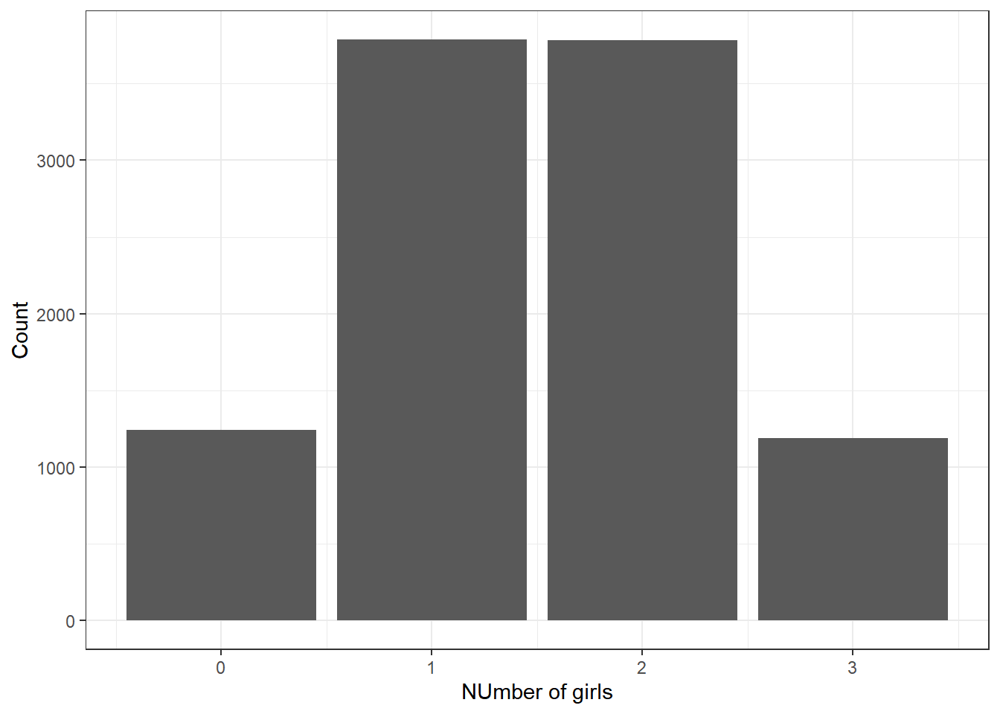

# Probability Rules {#PROBRULES}

\newcommand{\E}{\mbox{E}}
\newcommand{\Var}{\mbox{Var}}
\newcommand{\Cov}{\mbox{Cov}}
\newcommand{\Prob}{\mbox{P}}
\newcommand*\diff{\mathop{}\!\mathrm{d}}


## Objectives

1) Define and use properly in context all new terminology related to probability, including: *sample space*, *outcome*, *event*, *subset*, *intersection*, *union*, *complement*, *probability*, *mutually exclusive*, *exhaustive*, *independent*,  *multiplication rule*, *permutation*, *combination*.  

2) Apply basic probability and counting rules to find probabilities.  

3) Describe the basic axioms of probability.  

4) Use `R` to calculate and simulate probabilities of events.  

## Probability vs Statistics

As a review, remember this book is divided into four general blocks: data collection/summary, probability models, inference and statistical modeling/prediction. This second block, probability, is the study of stochastic (random) processes and their properties. Specifically, we will explore random experiments. As its name suggests, a random experiment is an experiment whose outcome is not predictable with exact certainty. In the statistical models we develop in the last two blocks of this book, we will use other variables to explain the variance of the outcome of interest. Any remaining variance is modeled with probability models. 

Even though an outcome is determined by chance, this does not mean that we know nothing about the random experiment. Our favorite simple example is that of a coin flip. If we flip a coin, the possible outcomes are heads and tails. We don't know for sure what outcome will occur, but this doesn't mean we don't know anything about the experiment. If we assume the coin is fair, we know that each outcome is equally likely. Also, we know that if we flip the coin 100 times (independently), we are likely, the highest frequency event, to see around 50 heads, and very unlikely to see 10 heads or fewer. 

It is important to distinguish probability from inference and modeling. In probability, we consider a known random experiment, including knowing the parameters, and answer questions about what we expect to see from this random experiment. In statistics (inference and modeling), we consider data (the results of a mysterious random experiment) and infer about the underlying process. For example, suppose we have a coin and we are unsure whether this coin is fair or unfair, the parameter is unknown. We flipped it 20 times and it landed on heads 14 times. Inferential statistics will help us answer questions about the underlying process (could this coin be unfair?). 

<div class="figure" style="text-align: center">

<p class="caption">(\#fig:prob-stats)A graphical representation of probability and statistics. In probability, we describe what we expect to happen if we know that underlying process; in statistics, we don't know the underlying process, and must infer based on representative samples.</p>
</div>

This block (10 chapters or so) is devoted to the study of random experiments. First, we will explore simple experiments, counting rule problems, and conditional probability. Next, we will introduce the concept of a random variable and the properties of random variables. Following this, we will cover common distributions of discrete and continuous random variables. We will end the block on multivariate probability (joint distributions and covariance). 

## Basic probability terms  

We will start our work with some definitions and examples.

### Sample space

Suppose we have a random experiment. The *sample space* of this experiment, $S$, is the set of all possible results of that experiment. For example, in the case of a coin flip, we could write $S=\{H,T\}$. Each element of the sample space is considered an *outcome*. An *event* is a set of outcomes, it is a subset of the sample space.  

> *Example*:  
Let's let `R` flip a coin for us and record the number of heads and tails. We will have `R` flip the coin twice. What is the sample space, what is an example of an outcome, and what is an example of an event.

We will load the **mosaic** package as it has a function `rflip()` that will simulate flipping a coin.


```r
library(mosaic)
```


```r
set.seed(18)
rflip(2)
```

```
## 
## Flipping 2 coins [ Prob(Heads) = 0.5 ] ...
## 
## H H
## 
## Number of Heads: 2 [Proportion Heads: 1]
```

The sample space is $S=\{HH, TH, HT, TT\}$, an example of an outcome is $HH$ which we see in the output from `R`, and finally an example of an event is the number of heads, which in this case takes on the values 0, 1, and 2. Another example of an event is "At least one heads". In this case the event would be $\{HH,TH, HT\}$. Also notice that $TH$ is different from $HT$ as an outcome; this is because those are different outcomes from flipping a coin twice.

> *Example of Event*:  
Suppose you arrive at a rental car counter and they show you a list of available vehicles, and one is picked for you at random. The sample space in this experiment is 
$$
S=\{\mbox{red sedan}, \mbox{blue sedan}, \mbox{red truck}, \mbox{grey truck}, \mbox{grey SUV}, \mbox{black SUV}, \mbox{blue SUV}\}.
$$ 

Each vehicle represents a possible outcome of the experiment. Let $A$ be the event that a blue vehicle is selected. This event contains the outcomes `blue sedan` and `blue SUV`. 

### Union and intersection

Suppose we have two events $A$ and $B$. 

1) $A$ is considered a *subset* of $B$ if all of the outcomes of $A$ are also contained in $B$. This is denoted as $A \subset B$. 

2) The *intersection* of $A$ and $B$ is all of the outcomes contained in both $A$ and $B$. This is denoted as $A \cap B$. 

3) The *union* of $A$ and $B$ is all of the outcomes contained in either $A$ or $B$, or both. This is denoted as $A \cup B$. 

4) The *complement* of $A$ is all of the outcomes not contained in $A$. This is denoted as $A^C$ or $A'$. 

Note: Here we are treating events as sets and the above definitions are basic set operations.

It is sometimes helpful when reading probability notation to think of Union as an *or* and Intersection as an *and*.

> *Example*:  
Consider our rental car example above. Let $A$ be the event that a blue vehicle is selected, let $B$ be the event that a black vehicle is selected, and let $C$ be the event that an SUV is selected.  

First, let's list all of the outcomes of each event. $A = \{\mbox{blue sedan},\mbox{blue SUV}\}$, $B=\{\mbox{black SUV}\}$, and $C= \{\mbox{grey SUV}, \mbox{black SUV}, \mbox{blue SUV}\}$.  

Since all outcomes in $B$ are contained in $C$, we know that $B$ is a subset of $C$, or $B\subset C$. Also, since $A$ and $B$ have no outcomes in common, $A \cap B = \emptyset$. Note that $\emptyset = \{ \}$ is the empty set and contains no elements. Further, $A \cup C = \{\mbox{blue sedan}, \mbox{grey SUV}, \mbox{black SUV}, \mbox{blue SUV}\}$. 

## Probability

*Probability* is a number assigned to an event or outcome that describes how likely it is to occur. A probability model assigns a probability to each element of the sample space. What makes a probability model is not just the values assigned to each element but the idea this model contains all the information about the outcomes and there are no other explanatory variables involved.

A probability model can be thought of as a function that maps outcomes, or events, to a real number in the interval $[0,1]$.

There are some basic axioms of probability you should know, although this list is not complete. Let $S$ be the sample space of a random experiment and let $A$ be an event where $A\subset S$. 

1) $\Prob(A) \geq 0$. 

2) $\Prob(S) = 1$. 


These two axioms essentially say that probability must be positive, and the probability of all outcomes must sum to 1. 


### Probability properties

Let $A$ and $B$ be events in a random experiment. Most of these can be proven fairly easily. 

1) $\Prob(\emptyset)=0$

2) $\Prob(A')=1-\Prob(A)$ We used this in the case study.

3) If $A\subset B$, then $\Prob(A)\leq \Prob(B)$. 

4) $\Prob(A\cup B) = \Prob(A)+\Prob(B)-\Prob(A\cap B)$. This property can be generalized to more than two events. The intersection is subtracted because outcomes in both events $A$ and $B$ get counted twice in the first sum.

5) Law of Total Probability: Let $B_1, B_2,...,B_n$ be **mutually exclusive**, this means disjoint or no outcomes in common, and **exhaustive**, this means the union of all the events labeled with a $B$ is the sample space. Then 

$$
\Prob(A)=\Prob(A\cap B_1)+\Prob(A\cap B_2)+...+\Prob(A\cap B_n)
$$

A specific application of this law appears in Bayes' Rule (more to follow). It says that $\Prob(A)=\Prob(A \cap B)+\Prob(A \cap B')$. Essentially, it points out that $A$ can be partitioned into two parts: 1) everything in $A$ and $B$ and 2) everything in $A$ and not in $B$. 

> *Example*:  
Consider rolling a six sided die. Let event $A$ be the number showing is less than 5. Let event $B$ be the number is even. Then  

$$\Prob(A)=\Prob(A \cap B) + \Prob(A \cap B')$$ 

$$
\Prob(< 5)=\Prob(<5 \cap Even)+\Prob(<5 \cap Odd)
$$


6) DeMorgan's Laws: 
$$
\Prob((A \cup B)')=\Prob(A' \cap B')
$$
$$
\Prob((A \cap B)')=\Prob(A' \cup B')
$$

### Equally likely scenarios

In some random experiments, outcomes can be defined such that each individual outcome is equally likely. In this case, probability becomes a counting problem. Let $A$ be an event in an experiment where each outcome is equally likely. 
$$
\Prob(A)=\frac{\mbox{# of outcomes in A}}{\mbox{# of outcomes in S}}
$$

> *Example*:  
Suppose a family has three children, with each child being either a boy (B) or girl (G). Assume that the likelihood of boys and girls are equal and **independent**, this is the idea that the probability of the gender of the second child does not change based on the gender of the first child. The sample space can be written as:
$$
S=\{\mbox{BBB},\mbox{BBG},\mbox{BGB},\mbox{BGG},\mbox{GBB},\mbox{GBG},\mbox{GGB},\mbox{GGG}\}
$$
What is the probability that the family has exactly 2 girls? 

This only happens in three ways: BGG, GBG, and GGB. Thus, the probability of exactly 2 girls is 3/8 or 0.375. 

### Using `R` (Equally likely scenarios)

The previous example above is an example of an "Equally Likely" scenario, where the sample space of a random experiment contains a list of outcomes that are equally likely. In these cases, we can sometimes use `R` to list out the possible outcomes and count them to determine probability. We can also use `R` to simulate. 

> *Example*:  
Use `R` to simulate the family of three children where each child has the same probability of being a boy or a girl. 

Instead of writing our own function, we can use `rflip()` in the **mosaic** package. We will let $H$ stand for girl.

First simulate one family. 


```r
set.seed(73)
rflip(3)
```

```
## 
## Flipping 3 coins [ Prob(Heads) = 0.5 ] ...
## 
## T T H
## 
## Number of Heads: 1 [Proportion Heads: 0.333333333333333]
```

In this case we got 1 girl. Next we will use the `do()` function to repeat this simulation.


```r
results <- do(10000)*rflip(3)
head(results)
```

```
##   n heads tails      prop
## 1 3     1     2 0.3333333
## 2 3     3     0 1.0000000
## 3 3     3     0 1.0000000
## 4 3     3     0 1.0000000
## 5 3     1     2 0.3333333
## 6 3     1     2 0.3333333
```

Next we can visualize the distribution of the number of girls, heads, in Figure \@ref(fig:bar81-fig).


```r
results %>%
  gf_bar(~heads) %>%
  gf_theme(theme_bw()) %>%
  gf_labs(x="NUmber of girls",y="Count")
```

<div class="figure">

<p class="caption">(\#fig:bar81-fig)Number of girls in a family of size 3.</p>
</div>

Finally we can estimate the probability of exactly 2 girls. We need the **tidyverse** library.


```r
library(tidyverse)
```


```r
results %>%
  filter(heads==2) %>%
  summarize(prob=n()/10000)
```

```
##     prob
## 1 0.3782
```

Or slightly different code.


```r
results %>%
  count(heads) %>%
  mutate(prop=n/sum(n))
```

```
##   heads    n   prop
## 1     0 1241 0.1241
## 2     1 3786 0.3786
## 3     2 3782 0.3782
## 4     3 1191 0.1191
```


Not a bad estimate of the exact probability.

Let's now use an example of cards to simulate some probabilities as well as learning more about counting. The file `Cards.csv` contains the data for cards from a 52 card deck. Let's read it in and summarize.


```r
Cards <- read_csv("data/Cards.csv")
inspect(Cards)
```

```
## 
## categorical variables:  
##   name     class levels  n missing
## 1 rank character     13 52       0
## 2 suit character      4 52       0
##                                    distribution
## 1 10 (7.7%), 2 (7.7%), 3 (7.7%) ...            
## 2 Club (25%), Diamond (25%) ...                
## 
## quantitative variables:  
##    name   class        min         Q1     median         Q3        max
## 1 probs numeric 0.01923077 0.01923077 0.01923077 0.01923077 0.01923077
##         mean sd  n missing
## 1 0.01923077  0 52       0
```


```r
head(Cards)
```

```
## # A tibble: 6 x 3
##   rank  suit   probs
##   <chr> <chr>  <dbl>
## 1 2     Club  0.0192
## 2 3     Club  0.0192
## 3 4     Club  0.0192
## 4 5     Club  0.0192
## 5 6     Club  0.0192
## 6 7     Club  0.0192
```


We can see 4 suits, and 13 ranks, the value on the face of the card.


> *Example*:  
Suppose we draw one card out of a standard deck. Let $A$ be the event that we draw a Club. Let $B$ be the event that we draw a 10 or a face card (Jack, Queen, King or Ace). We can use `R` to define these events and find probabilities. 

Let's find all the Clubs.


```r
Cards %>%
  filter(suit == "Club") %>%
  select(rank,suit)
```

```
## # A tibble: 13 x 2
##    rank  suit 
##    <chr> <chr>
##  1 2     Club 
##  2 3     Club 
##  3 4     Club 
##  4 5     Club 
##  5 6     Club 
##  6 7     Club 
##  7 8     Club 
##  8 9     Club 
##  9 10    Club 
## 10 J     Club 
## 11 Q     Club 
## 12 K     Club 
## 13 A     Club
```

So just by counting, we find the probability of drawing a Club is $\frac{13}{52}$ or 0.25.

We can do this by simulation, this is over kill but gets the idea of simulation across.

Remember, ask what do we want `R` to do and what does `R` need to do this?


```r
results <- do(10000)*sample(Cards,1)
head(results)
```

```
## # A tibble: 6 x 6
##   rank  suit   probs orig.id  .row .index
##   <chr> <chr>  <dbl> <chr>   <int>  <dbl>
## 1 9     Spade 0.0192 47          1      1
## 2 5     Club  0.0192 4           1      2
## 3 5     Spade 0.0192 43          1      3
## 4 7     Heart 0.0192 32          1      4
## 5 4     Club  0.0192 3           1      5
## 6 A     Spade 0.0192 52          1      6
```


```r
results %>%
  filter(suit == "Club") %>%
  summarize(prob=n()/10000)
```

```
## # A tibble: 1 x 1
##    prob
##   <dbl>
## 1 0.243
```


```r
results %>%
  count(suit) %>%
  mutate(prob=n/sum(n))
```

```
## # A tibble: 4 x 3
##   suit        n  prob
##   <chr>   <int> <dbl>
## 1 Club     2432 0.243
## 2 Diamond  2558 0.256
## 3 Heart    2417 0.242
## 4 Spade    2593 0.259
```


Now let's count the number of outcomes in $B$.


```r
Cards %>%
  filter(rank %in% c(10, "J", "Q", "K", "A")) %>%
  select(rank,suit)
```

```
## # A tibble: 20 x 2
##    rank  suit   
##    <chr> <chr>  
##  1 10    Club   
##  2 J     Club   
##  3 Q     Club   
##  4 K     Club   
##  5 A     Club   
##  6 10    Diamond
##  7 J     Diamond
##  8 Q     Diamond
##  9 K     Diamond
## 10 A     Diamond
## 11 10    Heart  
## 12 J     Heart  
## 13 Q     Heart  
## 14 K     Heart  
## 15 A     Heart  
## 16 10    Spade  
## 17 J     Spade  
## 18 Q     Spade  
## 19 K     Spade  
## 20 A     Spade
```

So just by counting, we find the probability of drawing a 10 or greater is $\frac{20}{52}$ or 0.3846154.

>**Exercise**:  
Using simulation to estimate the probability of 10 or higher.


```r
results <- do(10000)*sample(Cards,1)
head(results)
```

```
## # A tibble: 6 x 6
##   rank  suit   probs orig.id  .row .index
##   <chr> <chr>  <dbl> <chr>   <int>  <dbl>
## 1 10    Heart 0.0192 35          1      1
## 2 6     Heart 0.0192 31          1      2
## 3 8     Spade 0.0192 46          1      3
## 4 J     Heart 0.0192 36          1      4
## 5 Q     Spade 0.0192 50          1      5
## 6 10    Club  0.0192 9           1      6
```


```r
results %>%
  filter(rank %in% c(10, "J", "Q", "K", "A")) %>%
  summarize(prob=n()/10000)
```

```
## # A tibble: 1 x 1
##    prob
##   <dbl>
## 1 0.389
```

Notice that this code is not robust to change the number of simulations. If we change from 10000, then we have to change the denominator in the `summarize()` function. We can change this by using `mutate()` instead of `filter()`.


```r
results %>%
  mutate(face=rank %in% c(10, "J", "Q", "K", "A"))%>%
  summarize(prob=mean(face))
```

```
## # A tibble: 1 x 1
##    prob
##   <dbl>
## 1 0.389
```

Notice that in the `mutate()` function, we are creating a new logical variable called `face`. This variable takes on the values of TRUE and FALSE. In the next line we use a `summarize()` command with the function `mean()`. In `R` a function that requires numeric input takes a logical variable and converts the TRUE into 1 and the FALSE into 0. Thus the `mean()` will find the proportion of TRUE values and that is why we report it as a probability.

Next, let's find a card that is 10 or greater **and** a club.


```r
Cards %>%
  filter(rank %in% c(10, "J", "Q", "K", "A"),suit=="Club") %>%
  select(rank,suit)
```

```
## # A tibble: 5 x 2
##   rank  suit 
##   <chr> <chr>
## 1 10    Club 
## 2 J     Club 
## 3 Q     Club 
## 4 K     Club 
## 5 A     Club
```


We find the probability of drawing a 10 or greater club is $\frac{5}{52}$ or 0.0961538.

>**Exercise**:  
Simulate drawing one card and estimate the probability of a club that is 10 or greater.


```r
results %>%
  mutate(face=(rank %in% c(10, "J", "Q", "K", "A"))&(suit=="Club"))%>%
  summarize(prob=mean(face))
```

```
## # A tibble: 1 x 1
##     prob
##    <dbl>
## 1 0.0963
```


### Note

We have been using `R` to count the number of outcomes in an event. This helped us to determine probabilities. We limited the problems to simple ones. In our cards example, it would be more interesting for us to explore more complex events such as drawing 5 cards from a standard deck. Each draw of 5 cards is equally likely, so in order to find the probability of a flush (5 cards of the same suit), we could simply list all the possible flushes and compare that to the sample space. Because of the large number of possible outcomes, this becomes difficult. Thus we need to explore counting rules in more detail to help us solve more complex problems. In this book, we will limit our discussion to three basic cases. You should know that there are entire courses on discrete math and counting rules, so we will still be limited in our methods and the type of problems we can solve in this book.

## Counting rules 

There are three types of counting problems we will consider. In each case, the multiplication rule is being used and all that changes is whether an element is allowed to be reused, replacement, and whether the order of selection matters. This latter question is difficult.  Each case will be demonstrated with an example. 

### Multiplication rule 1: Order matters, sample with replacement 

The multiplication rule is at the center of each of the three methods. In this first case we are using the idea that order matters and items can be reused. Let's use an example to help. 

> *Example*:  
A license plate consists of three numeric digits (0-9) followed by three single letters (A-Z). How many possible license plates exist? 

We can divide this problem into two sections. In the numeric section, we are selecting 3 objects from 10, with replacement. This means that a number can be used more than once. Order clearly matters because a license plate starting with "432" is distinct from a license plate starting with "234". There are $10^3 = 1000$ ways to select the first three digits; 10 for the first, 10 for the second, and 10 for the third. Why do you multiply and not add?^[Multiplication is repeated adding so in a sense we are adding. However in a more serious tone, for this problem for every first number there are 10 possibilities for the second number and for every second number there are 10 possibilities for the third numbers. This is multiplication.] 

In the alphabet section, we are selecting 3 objects from 26, where order matters. Thus, there are $26^3=17576$ ways to select the last three letters of the plate. Combined, there are $10^3 \times 26^3 = 17576000$ ways to select license plates. Visually, 
$$
\underbrace{\underline{\quad 10 \quad }}_\text{number} \times \underbrace{\underline{\quad 10 \quad }}_\text{number} \times \underbrace{\underline{\quad 10 \quad }}_\text{number} \times \underbrace{\underline{\quad 26 \quad }}_\text{letter} \times \underbrace{\underline{\quad 26 \quad }}_\text{letter} \times \underbrace{\underline{\quad 26 \quad }}_\text{letter} = 17,576,000
$$

Next we are going to use this new counting method to find a probability.

> *Exercise*:  
What is the probability a license plate starts with the number "8" or "0" and ends with the letter "B"? 

In order to find this probability, we simply need to determine the number of ways to select a license plate starting with "8" or "0" and ending with the letter "B". We can visually represent this event:
$$
\underbrace{\underline{\quad 2 \quad }}_\text{8 or 0} \times \underbrace{\underline{\quad 10 \quad }}_\text{number} \times \underbrace{\underline{\quad 10 \quad }}_\text{number} \times \underbrace{\underline{\quad 26 \quad }}_\text{letter} \times \underbrace{\underline{\quad 26 \quad }}_\text{letter} \times \underbrace{\underline{\quad 1 \quad }}_\text{B} = 135,200
$$

Dividing this number by the total number of possible license plates yields the probability of this event occurring. 


```r
denom<-10*10*10*26*26*26
num<-2*10*10*26*26*1
num/denom
```

```
## [1] 0.007692308
```

The probability of obtaining a license plate starting with "8" or "0" and ending with "B" is 0.0077. Simulating this would be difficult because we would need special functions to check the first number and last letter. This gets into **text mining** an important subject in data science but unfortunately we don't have much time in this book for the topic.

### Multiplication rule 2 (Permutation): Order Matters, Sampling Without Replacement

Consider a random experiment where we sample from a group of size $n$, **without** replacement, and the outcome of the experiment depends on the order of the outcomes. The number of ways to select $k$ objects is given by $n(n-1)(n-2)...(n-k+1)$. This is known as a permutation and is sometimes written as
$$
{}_nP_{k} = \frac{n!}{(n-k)!}
$$

Recall that $n!$ is read as $n$ factorial and represents the number of ways to arrange $n$ objects. 

> *Example*:  
Twenty-five friends participate in a Halloween costume party. Three prizes are given during the party: most creative costume, scariest costume, and funniest costume. No one can win more than one prize. How many possible ways can the prizes by distributed? 

There are $k=3$ prizes to be assigned to $n=25$ people. Once someone is selected for a prize, they are removed from the pool of eligibles. In other words, we are sampling without replacement. Also, order matters. For example, if Tom, Mike, and Jane, win most creative, scariest and funniest costume, respectively, this is a different outcome than if Mike won creative, Jane won scariest and Tom won funniest. Thus, the number of ways the prizes can be distributed is given by ${}_{25}P_3 = \frac{25!}{22!} = 13,800$. A more visually pleasing way to express this would be: 
$$
\underbrace{\underline{\quad 25 \quad }}_\text{most creative} \times \underbrace{\underline{\quad 24 \quad }}_\text{scariest} \times \underbrace{\underline{\quad 23 \quad }}_\text{funniest} = 13,800
$$

Notice that it is sometime difficult to determine if order matters or not in a problem, but in this example the name of the prize was a hint that indeed order matters.  

Let's use the idea of a permutation to calculate a probability.

>*Exercise*:   
Assume that all 25 participants are equally likely to win any one of the three prizes. What is the probability that Tom doesn't win any of them? 

Just like in the previous probability calculation, we simply need to count the number of ways Tom doesn't win any prize. In other words, we need to count the number of ways that prizes are distributed without Tom. So, remove Tom from the group of 25 eligible participants. The number of ways Tom doesn't get a prize is ${}_{24}P_3 = \frac{24!}{21!}=12,144$. Again visually:
$$
\underbrace{\underline{\quad 24 \quad }}_\text{most creative} \times \underbrace{\underline{\quad 23 \quad }}_\text{scariest} \times \underbrace{\underline{\quad 22 \quad }}_\text{funniest} = 12,144
$$

The probability Tom doesn't get a prize is simply the second number divided by the first:

```r
denom<-factorial(25)/factorial(25-3)
# Or, denom<-25*24*23
num<-24*23*22
num/denom
```

```
## [1] 0.88
```

### Multiplication rule 3 (Combination): Order Does Not Matter, Sampling Without Replacement

Consider a random experiment where we sample from a group of size $n$, without replacement, and the outcome of the experiment does not depend on the order of the outcomes. The number of ways to select $k$ objects is given by $\frac{n!} {(n-k)!k!}$. This is known as a combination and is written as:
$$
\binom{n}{k} = \frac{n!}{(n-k)!k!} 
$$

This is read as "$n$ choose $k$". Take a moment to compare combinations to permutations, discussed in Rule 2. The difference between these two rules is that in a combination, order no longer matters. A combination is equivalent to a permutation divided by $k!$, the number of ways to arrange the $k$ objects selected. 

> *Example*:  
Suppose we draw 5 cards out of a standard deck (52 cards, no jokers). How many possible 5 card hands are there? 

In this example, order does not matter. I don't care if I receive 3 jacks then 2 queens or 2 queens then 3 jacks. Either way, it's the same collection of 5 cards. Also, we are drawing without replacement. Once a card is selected, it cannot be selected again. Thus, the number of ways to select 5 cards is given by:
$$
\binom{52}{5} = \frac{52!}{(52-5)!5!} = 2,598,960
$$

>*Example*:  
When drawing 5 cards, what is the probability of drawing a "flush" (5 cards of the same suit)? 

Let's determine how many ways to draw a flush. There are four suits (clubs, hearts, diamonds and spades). Each suit has 13 cards. We would like to pick 5 of those 13 cards and 0 of the remaining 39. Let's consider just one of those suits (clubs):
$$
\Prob(\mbox{5 clubs})=\frac{\binom{13}{5}\binom{39}{0}}{\binom{52}{5}}
$$

The second part of the numerator ($\binom{39}{0}$) isn't necessary, since it simply represents the number of ways to select 0 objects from a group (1 way), but it helps clearly lay out the events. This brings up the point of what $0!$ equals. By definition it is 1. This allows us to use $0!$ in our work.

Now, we expand this to all four suits by multiplying by 4, or $\binom{4}{1}$ since we are selecting 1 suit out of the 4:
$$
\Prob(\mbox{flush})=\frac{\binom{4}{1}\binom{13}{5}\binom{39}{0}}{\binom{52}{5}}
$$


```r
num<-4*choose(13,5)*1
denom<-choose(52,5)
num/denom
```

```
## [1] 0.001980792
```

There is a probability of 0.0020 of drawing a flush in a draw of 5 cards from a standard deck of cards. 

> **Exercise**:  
When drawing 5 cards, what is the probability of drawing a "full house" (3 cards of the same rank and the other 2 of the same rank)?

This problem uses several ideas from this chapter. We need to pick the rank of the three of a kind. Then pick 3 cards from the 4 possible. Next we pick the rank of the pair from the remaining 12 ranks. Finally pick 2 cards of that rank from the 4 possible.

$$
\Prob(\mbox{full house})=\frac{\binom{13}{1}\binom{4}{3}\binom{12}{1}\binom{4}{2}}{\binom{52}{5}}
$$


```r
num<-choose(13,1)*choose(4,3)*choose(12,1)*choose(4,2)
denom<-choose(52,5)
num/denom
```

```
## [1] 0.001440576
```

Why not use $\binom{13}{2}$ instead of $\binom{13}{1}\binom{12}{1}$?^[Because this implies the order selection of the ranks does not matter. In other words, this assumes that for example 3 Kings and 2 fours is the same full house as 3 fours and 2 Kings. This is not true so we break the rank selection about essentially making it a permutation.]

We have just determined that a full house has a lower probability of occurring than a flush. This is why in gambling, a flush is valued less than a full house.


## Homework Problems

1. Let $A$, $B$ and $C$ be events such that $\Prob(A)=0.5$, $\Prob(B)=0.3$, and $\Prob(C)=0.4$. Also, we know that $\Prob(A \cap B)=0.2$, $\Prob(B \cap C)=0.12$, $\Prob(A \cap C)=0.1$, and $\Prob(A \cap B \cap C)=0.05$. Find the following: 

  a. $\Prob(A\cup B)$  
  b. $\Prob(A\cup B \cup C)$  
  c. $\Prob(B'\cap C')$  
  d. $\Prob(A\cup (B\cap C))$  
  e. $\Prob((A\cup B \cup C)\cap (A\cap B \cap C)')$

2. Consider the example of the family in the reading. What is the probability that the family has at least one boy? 


3. The Birthday Problem Revisited. 

a. Suppose there are $n=20$ students in a classroom. My birthday, the instructor, is April 3rd. What is the probability that at least one student shares my birthday? Assume only 365 days in a year and assume that all birthdays are equally likely.   
b. In `R`, find the probability that at least one other person shares my birthday for each value of $n$ from 1 to 300. Plot these probabilities with $n$ on the $x$-axis and probability on the $y$-axis. At what value of $n$ would the probability be at least 50%?   


4. Thinking of the cards again. Answer the following questions:

a. Define two events that are mutually exclusive.  
b. Define two events that are independent.  
c. Define an event and its complement.  

5. Consider the license plate example from the reading. 

a. What is the probability that a license plate contains **exactly** one "B"?   
b. What is the probability that a license plate contains **at least one** "B"?  


6. Consider the party example in the reading. 

a. Suppose 8 people showed up to the party dressed as zombies. What is the probability that all three awards are won by people dressed as zombies?   
b. What is the probability that zombies win "most creative" and "funniest" but not "scariest"? 


7. Consider the cards example from the reading. 

a. How many ways can we obtain a "two pairs" (2 of one number, 2 of another, and the final different)?   
b.  What is the probability of drawing a "four of a kind" (four cards of the same value)?   

8. Advanced Question: Consider rolling 5 dice. What is the **probability** of a pour resulting in a full house?


