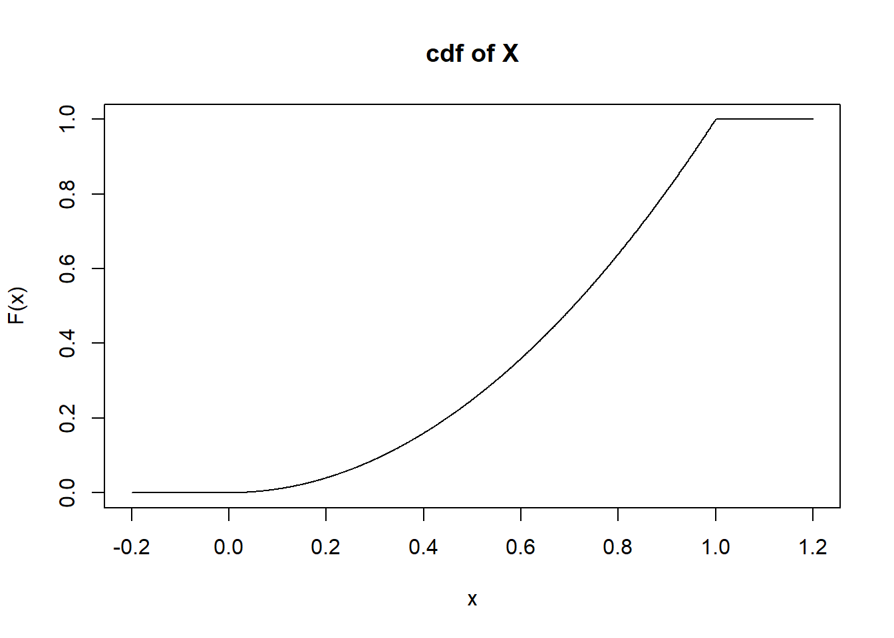

# Continuous Random Variables {#CONRANDVAR}


## Objectives

1) Define and properly use in context all new terminology, to include: *probability density function (pdf)* and *cumulative distribution function (cdf)* for continuous random variables.  

2) Given a continuous random variable, find probabilities using the pdf and/or the cdf.  

3) Find the mean and variance of a continuous random variable.  


## Continuous random variables

In the last chapter, we introduced random variables, and explored discrete random variables. In this chapter, we will move into continuous random variables, their properties, their distribution functions, and how they differ from discrete random variables. 

Recall that a continuous random variable has a domain that is a continuous interval (or possibly a group of intervals). For example, let $Y$ be the random variable corresponding to the height of a randomly selected individual. While our measurement will necessitate "discretizing" height to some degree, technically, height is a continuous random variable since a person could measure 67.3 inches or 67.4 inches or anything in between. 

### Continuous distribution functions

So how do we describe the randomness of continuous random variables? In the case of discrete random variables, the probability mass function (pmf) and the cumulative distribution function (cdf) are used to describe randomness. However, recall that the pmf is a function that returns the probability that the random variable takes the inputted value. Due to the nature of continuous random variables, the probability that a continuous random variable takes on any one individual value is technically 0. Thus, a pmf cannot apply to a continuous random variable. 

Rather, we describe the randomness of continuous random variables with the *probability density function* (pdf) and the *cumulative distribution function* (cdf). Note that the cdf has the same interpretation and application as in the discrete case. 

\newpage
### Probability density function

Let $X$ be a continuous random variable. The probability density function (pdf) of $X$, given by $f_X(x)$ is a function that describes the behavior of $X$. It is important to note that in the continuous case, $f_X(x)\neq \Prob(X=x)$, as the probability of $X$ taking any one individual value is 0. 

The pdf is a *function*. The input of a pdf is any real number. The output is known as the density. The pdf has three main properties: 

1) $f_X(x)\geq 0$ 

2) $\int_{S_X} f_X(x)\diff x = 1$

3) $\Prob(X\in A)=\int_{x\in A} f_X(x)\diff x$ or another way to write this $\Prob(a \leq X \leq b)=\int_{a}^{b} f_X(x)\diff x$ 

Properties 2) and 3) imply that the area underneath a pdf represents probability. The pdf is a non-negative function, it cannot have negative values.

### Cumulative distribution function

The cumulative distribution function (cdf) of a continuous random variable has the same interpretation as it does for a discrete random variable. It is a *function*. The input of a cdf is any real number, and the output is the probability that the random variable takes a value less than or equal to the inputted value. It is denoted as $F$ and is given by:
$$
F_X(x)=\Prob(X\leq x)=\int_{-\infty}^x f_x(t) \diff t
$$

> *Example*:  
Let $X$ be a continuous random variable with $f_X(x)=2x$ where $0 \leq x \leq 1$. Verify that $f$ is a valid pdf. Find the cdf of $X$. Also, find the following probabilities: $\Prob(X<0.5)$, $\Prob(X>0.5)$, and $\Prob(0.1\leq X < 0.75)$. Finally, find the median of $X$. 

To verify that $f$ is a valid pdf, we simply note that $f_X(x) \geq 0$ on the range $0 \leq x \leq 1$. Also, we note that $\int_0^1 2x \diff x = x^2\bigg|_0^1 = 1$. 

Using `R`, we find


```r
integrate(function(x)2*x,0,1)
```

```
## 1 with absolute error < 1.1e-14
```

Or we can use the **mosaicCalc** package to find the anti-derivative. If the package is not installed, you can use the `Packages` tab in `RStudio` or type `install.packages("mosaicCalc")` at the command prompt. Load the library.


```r
library(mosaicCalc)
```


```r
(Fx<-antiD(2*x~x))
```

```
## function (x, C = 0) 
## x^2 + C
```


```r
Fx(1)-Fx(0)
```

```
## [1] 1
```


Graphically, the pdf is displayed in Figure \@ref(fig:plot111-fig):
<div class="figure" style="text-align: center">

<p class="caption">(\#fig:plot111-fig)pdf of $X$</p>
</div>

\newpage 
The cdf of $X$ is found by 
$$
\int_0^x 2t \diff t = t^2\bigg|_0^x = x^2
$$
This is `antiD` found from the calculations above.  

So,
$$
F_X(x)=\left\{ \begin{array}{ll} 0, & x<0 \\ x^2, & 0\leq x \leq 1 \\ 1, & x>1 \end{array}\right.
$$

The plot of the cdf of $X$ is shown in Figure \@ref(fig:plot112-fig).  

<div class="figure" style="text-align: center">

<p class="caption">(\#fig:plot112-fig)cdf of $X$</p>
</div>

Probabilities are found either by integrating the pdf or using the cdf:

$\Prob(X < 0.5)=\Prob(X\leq 0.5)=F_X(0.5)=0.5^2=0.25$. See Figure \@ref(fig:plot113-fig).

<div class="figure" style="text-align: center">

<p class="caption">(\#fig:plot113-fig)Probability represented by shaded area</p>
</div>

$\Prob(X > 0.5) = 1-\Prob(X\leq 0.5)=1-0.25 = 0.75$ See Figure \@ref(fig:plot114-fig).


<div class="figure" style="text-align: center">

<p class="caption">(\#fig:plot114-fig)Probability represented by shaded area</p>
</div>

$\Prob(0.1\leq X < 0.75) = \int_{0.1}^{0.75}2x\diff x = 0.75^2 - 0.1^2 = 0.5525$ See Figure \@ref(fig:plot115-fig).


```r
integrate(function(x)2*x,.1,.75)
```

```
## 0.5525 with absolute error < 6.1e-15
```


Alternatively, $\Prob(0.1\leq X < 0.75) = \Prob(X < 0.75) -\Prob(x \leq  0.1) = F(0.75)-F(0.1)=0.75^2-0.1^2 =0.5525$


```r
Fx(0.75)-Fx(0.1)
```

```
## [1] 0.5525
```

Notice for a continuous random variable, we are loose with the use of the `=` sign. This is because for a continuous random variable $\Prob(X=x)=0$. Do not get sloppy when working with discrete random variables.

<div class="figure" style="text-align: center">

<p class="caption">(\#fig:plot115-fig)Probability represented by shaded area</p>
</div>

The median of $X$ is the value $x$ such that $\Prob(X\leq x)=0.5$, the area under a single point is 0. So we simply solve $x^2=0.5$ for $x$. Thus, the median of $X$ is $\sqrt{0.5}=0.707$. 

Or using `R`


```r
uniroot(function(x)(Fx(x)-.5),c(0,1))$root
```

```
## [1] 0.7071067
```


### Simulation 

As in the case of the discrete random variable, we can simulate a continuous random variable if we have an inverse for the cdf. The range of the cdf is $[0,1]$, so we generate a random number in this interval and then apply the inverse cdf to obtain a random variable. In a similar manner, for a continuous random variable, we use the following pseudo code:  
1. Generate a random number in the interval $[0,1]$, $U$.  
2. Find the random variable $X$ from $F_{X}^{-1}(U)$.  
In `R` for our example, this looks like the following.


```r
sqrt(runif(1))
```

```
## [1] 0.6137365
```


```r
results <- do(10000)*sqrt(runif(1))
```

\pagebreak 


```r
inspect(results)
```

```
## 
## quantitative variables:  
##   name   class         min        Q1    median        Q3       max      mean
## 1 sqrt numeric 0.005321359 0.4977011 0.7084257 0.8656665 0.9999873 0.6669452
##          sd     n missing
## 1 0.2358056 10000       0
```

\pagebreak 

Figure \@ref(fig:plot116-fig) is a density plot of the simulated density function.


```r
results %>%
  gf_density(~sqrt,xlab="X") %>%
  gf_theme(theme_bw()) %>%
  gf_labs(x="X",y="")
```

<div class="figure">

<p class="caption">(\#fig:plot116-fig)Density plot of the simulated random variable.</p>
</div>


## Moments

As with discrete random variables, moments can be calculated to summarize characteristics such as center and spread. In the discrete case, expectation is found by multiplying each possible value by its associated probability and summing across the domain ($\E(X)=\sum_x x\cdot f_X(x)$). In the continuous case, the domain of $X$ consists of an infinite set of values. From your calculus days, recall that the sum across an infinite domain is represented by an integral. 

Let $g(X)$ be any function of $X$. The expectation of $g(X)$ is found by:
$$
\E(g(X)) = \int_{S_X} g(x)f_X(x)\diff x
$$

### Mean and variance

Let $X$ be a continuous random variable. The mean of $X$, or $\mu_X$, is simply $\E(X)$. Thus, 
$$
\E(X)=\int_{S_X}x\cdot f_X(x)\diff x
$$

As in the discrete case, the variance of $X$ is the expected squared difference from the mean, or $\E[(X-\mu_X)^2]$. Thus,
$$
\sigma^2_X = \Var(X)=\E[(X-\mu_X)^2]= \int_{S_X} (x-\mu_X)^2\cdot f_X(x) \diff x
$$

Recall homework problem 6 from the last chapter. In this problem, you showed that $\Var(X)=\E(X^2)-\E(X)^2$. Thus,
$$
\Var(X)=\E(X^2)-\E(X)^2 = \int_{S_X} x^2\cdot f_X(x)\diff x - \mu_X^2 
$$

> *Example*:  
Consider the random variable $X$ from above. Find the mean and variance of $X$. 
$$
\mu_X= \E(X)=\int_0^1 x\cdot 2x\diff x = \frac{2x^3}{3}\bigg|_0^1 = \frac{2}{3}=0.667
$$

Side note: Since the mean of $X$ is smaller than the median of $X$, we say that $X$ is skewed to the left, or negatively skewed. 

Using `R`.


```r
integrate(function(x)x*2*x,0,1)
```

```
## 0.6666667 with absolute error < 7.4e-15
```

Or using `antiD()`


```r
Ex<-antiD(2*x^2~x)
Ex(1)-Ex(0)
```

```
## [1] 0.6666667
```


Using our simulation.


```r
mean(~sqrt,data=results)
```

```
## [1] 0.6669452
```


$$
\sigma^2_X = \Var(X)= \E(X^2)-\E(X)^2 = \int_0^1 x^2\cdot 2x\diff x - \left(\frac{2}{3}\right)^2 = \frac{2x^4}{4}\bigg|_0^1-\frac{4}{9}=\frac{1}{2}-\frac{4}{9}=\frac{1}{18}=0.056
$$


```r
integrate(function(x)x^2*2*x,0,1)$value-(2/3)^2
```

```
## [1] 0.05555556
```

or


```r
Vx<-antiD(x^2*2*x~x)
Vx(1)-Vx(0)-(2/3)^2
```

```
## [1] 0.05555556
```


```r
var(~sqrt,data=results)*9999/10000
```

```
## [1] 0.05559873
```


And finally, the standard deviation of $X$ is $\sigma_X = \sqrt{\sigma^2_X}=\sqrt{1/18}=0.236$. 

## Homework Problems

1. Let $X$ be a continuous random variable on the domain $-k \leq X \leq k$. Also, let $f(x)=\frac{x^2}{18}$. 

a. Assume that $f(x)$ is a valid pdf. Find the value of $k$.  
b. Plot the pdf of $X$.   
c. Find and plot the cdf of $X$.  
d. Find $\Prob(X<1)$.   
e. Find $\Prob(1.5<X\leq 2.5)$.  
f. Find the 80th percentile of $X$ (the value $x$ for which 80% of the distribution is to the left of that value).   
g. Find the value $x$ such that $\Prob(-x \leq X \leq x)=0.4$.   
h. Find the mean and variance of $X$.   
i. Simulate 10000 values from this distribution and plot the density.


2. Let $X$ be a continuous random variable. Prove that the cdf of $X$, $F_X(x)$ is a non-decreasing function. (Hint: show that for any $a < b$, $F_X(a) \leq F_X(b)$.)

