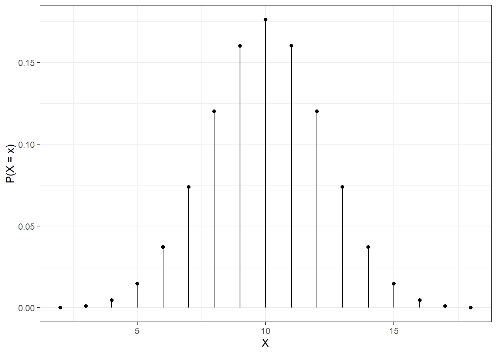
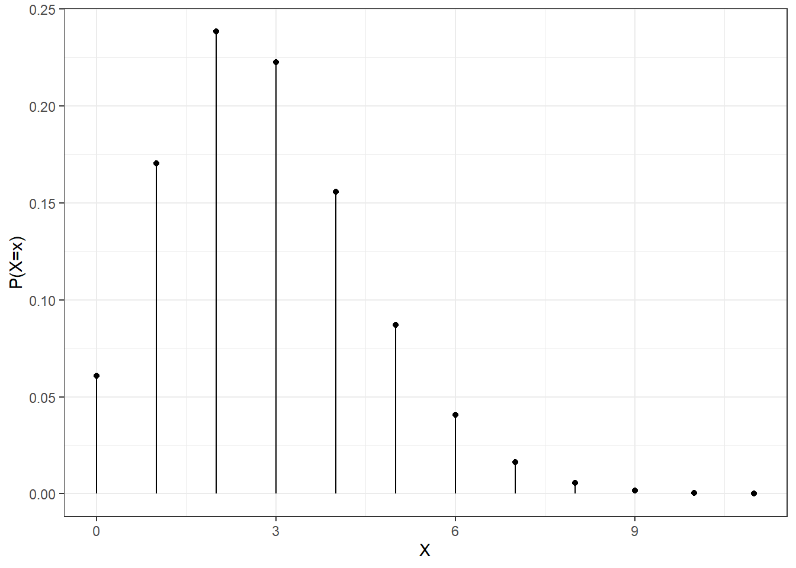
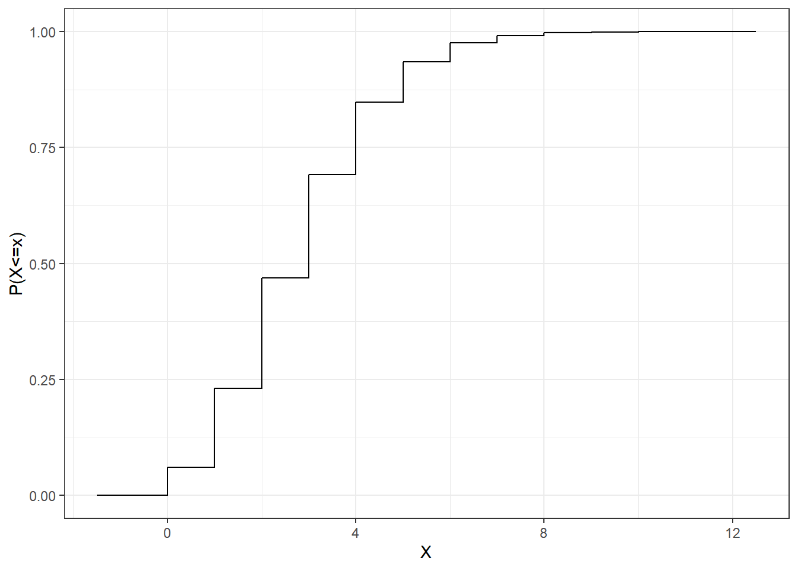
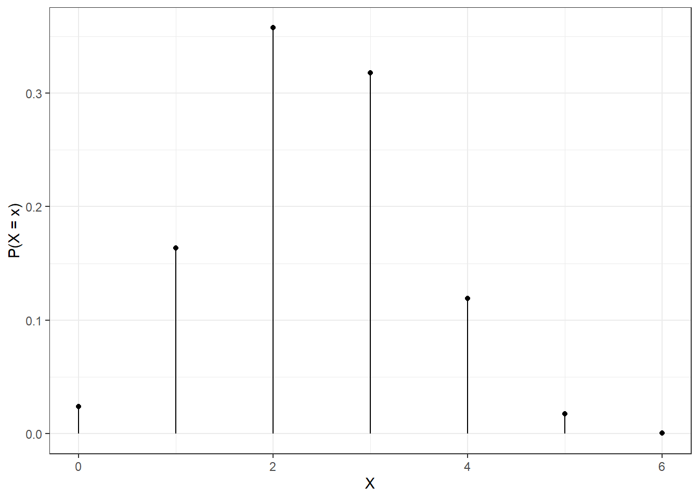
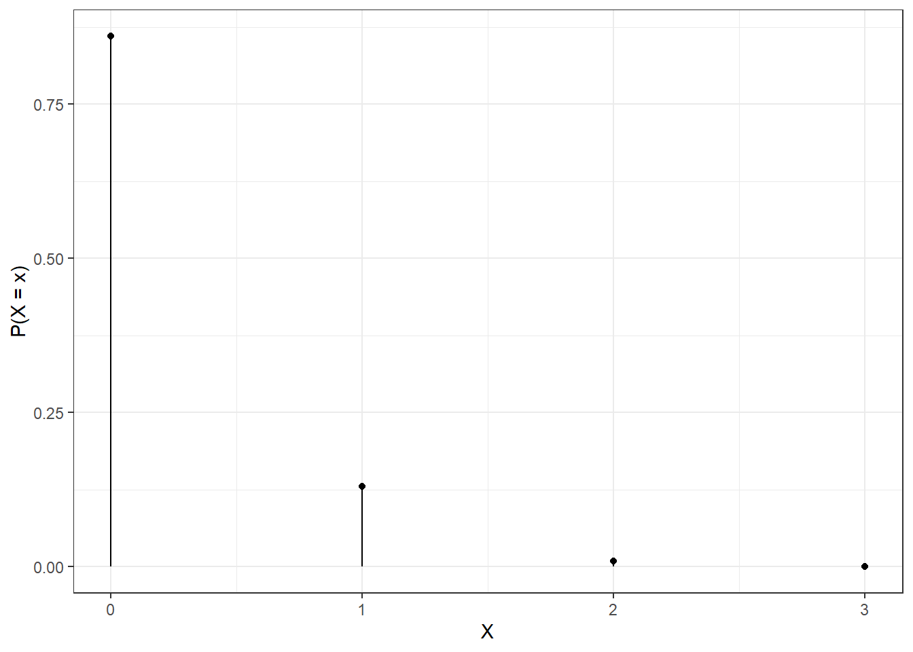

# Named Discrete Distributions {#DISCRETENAMED}


## Objectives

1) Recognize and set up for use common discrete distributions (Uniform, Binomial, Poisson, Hypergeometric) to include parameters, assumptions, and moments.   

2) Use `R` to calculate probabilities and quantiles involving random variables with common discrete distributions. 


## Named distributions

In the previous two chapters, we introduced the concept of random variables, distribution functions, and expectations. In some cases, the nature of an experiment may yield random variables with common distributions. In these cases, we can rely on easy-to-use distribution functions and built-in `R` functions in order to calculate probabilities and quantiles. 

### Discrete uniform distribution

The first distribution we will discuss is the discrete uniform distribution. It is not a very commonly used distribution, especially compared to its continuous counterpart. A discrete random variable has the discrete uniform distribution if probability is evenly allocated to each value in the sample space. A variable with this distribution has parameters $a$ and $b$ representing the minimum and maximum of the sample space, respectively. (By default, that sample space is assumed to consist of integers only, but that is by no means always the case.) 

> *Example*:  
Rolling a fair die is an example of the discrete uniform. Each side of the die has an equal probability.

Let $X$ be a discrete random variable with the uniform distribution. If the sample space is consecutive integers, this distribution is denoted as $X\sim\textsf{DUnif}(a,b)$. The pmf of $X$ is given by:
$$
f_X(x)=\left\{\begin{array}{ll}\frac{1}{b-a+1}, & x \in \{a, a+1,...,b\} \\ 
0, & \mbox{otherwise} \end{array}\right.
$$

For the die:  
$$
f_X(x)=\left\{\begin{array}{ll}\frac{1}{6-1+1} = \frac{1}{6}, & x \in \{1, 2,...,6\} \\ 
0, & \mbox{otherwise} \end{array}\right.
$$

The expected value of $X$ is found by:
$$
\E(X)=\sum_{x=a}^b x\cdot\frac{1}{b-a+1}= \frac{1}{b-a+1} \cdot \sum_{x=a}^b x=\frac{1}{b-a+1}\cdot\frac{b-a+1}{2}\cdot (a+b) = \frac{a+b}{2}
$$

Where the sum of consecutive integers is a common result from discrete math, research it for more information.

The variance of $X$ is found by: (derivation not included)
$$
\Var(X)=\E[(X-\E(X))^2]=\frac{(b-a+1)^2-1}{12}
$$

Summarizing for the die:  

Let $X$ be the result of a single roll of a fair die. We will report the distribution of $X$, the pmf, $\E(X)$ and $\Var(X)$. 

The sample space of $X$ is $S_X=\{1,2,3,4,5,6\}$. Since each of those outcomes is equally likely, $X$ follows the discrete uniform distribution with $a=1$ and $b=6$. Thus, 
$$
f_X(x)=\left\{\begin{array}{ll}\frac{1}{6}, & x \in \{1,2,3,4,5,6\} \\ 
0, & \mbox{otherwise} \end{array}\right.
$$

Finally, $\E(X)=\frac{1+6}{2}=3.5$. Also, $\Var(X)=\frac{(6-1+1)^2-1}{12}=\frac{35}{12}=2.917$. 

### Simulating

To simulate the discrete uniform, we use `sample()`.

> *Example*:  
To simulate rolling a die 4 times, we use `sample()`.


```r
set.seed(61)
sample(1:6,4,replace=TRUE)
```

```
## [1] 4 2 2 1
```


Let's roll it 10,000 times and find 


```r
results<-do(10000)*sample(1:6,1,replace=TRUE)
```


```r
tally(~sample,data=results,format="percent")
```

```
## sample
##     1     2     3     4     5     6 
## 16.40 16.46 16.83 17.15 16.92 16.24
```


```r
mean(~sample,data=results)
```

```
## [1] 3.5045
```


```r
var(~sample,data=results)*(10000-1)/10000
```

```
## [1] 2.87598
```
Again as a reminder, we multiply by $\frac{(10000-1)}{10000}$ because the function `var()` is calculating a sample variance using $n-1$ in the denominator but we need the population variance. 


### Binomial distribution

The binomial distribution is extremely common, and appears in many situations. In fact, we have already discussed several examples where the binomial distribution is heavily involved. 

Consider an experiment involving repeated *independent trials* of a binary process (two outcomes), where in each trial, there is a *constant probability* of "success" (one of the outcomes which is arbitrary). If the random variable $X$ represents the number of successes out of $n$ independent trials, then $X$ is said to follow the binomial distribution with parameters $n$ and $p$ (the probability of a success in each trial). 

The pmf of $X$ is given by:
$$
f_X(x)=\Prob(X=x)={n\choose{x}}p^x(1-p)^{n-x}
$$

for $x \in \{0,1,...,n\}$ and 0 otherwise. 

Let's take a moment to dissect this pmf. We are looking for the probability of obtaining $x$ successes out of $n$ trials. The $p^x$ represents the probability of $x$ successes, using the multiplication rule because of the independence assumption. The term $(1-p)^{n-x}$ represents the probability of the remainder of the trials as failures. Finally, the $n\choose x$ term represents the number of ways to obtain $x$ successes out of $n$ trials. For example, there are three ways to obtain 1 success out of 3 trials (one success followed by two failures; one failure, one success and then one failure; or two failures followed by a success). 

The expected value of a binomially distributed random variable is given by $\E(X)=np$ and the variance is given by $\Var(X)=np(1-p)$. 

> *Example*:  
Let $X$ be the number of heads out of 20 independent flips of a fair coin. Note that this is a binomial because the trials are independent and the probability of success, in this case a heads, is constant, and there are two outcomes. Find the distribution, mean and variance of $X$. Find $\Prob(X=8)$. Find $\Prob(X\leq 8)$. 

$X$ has the binomial distribution with $n=20$ and $p=0.5$. The pmf is given by:
$$
f_X(x)=\Prob(X=x)={20 \choose x}0.5^x (1-0.5)^{20-x}
$$

Also, $\E(X)=20*0.5=10$ and $\Var(X)=20*0.5*0.5=5$. 

To find $\Prob(X=8)$, we can simply use the pmf: 
$$
\Prob(X=8)=f_X(8)={20\choose 8}0.5^8 (1-0.5)^{12}
$$

```r
choose(20,8)*0.5^8*(1-0.5)^12
```

```
## [1] 0.1201344
```

To find $\Prob(X\leq 8)$, we would need to find the cumulative probability: 
$$
\Prob(X\leq 8)=\sum_{x=0}^8 {20\choose 8}0.5^x (1-0.5)^{20-x}
$$

```r
x<-0:8
sum(choose(20,x)*0.5^x*(1-.5)^(20-x))
```

```
## [1] 0.2517223
```

### Software Functions

One of the advantages of using named distributions is that most software packages have built-in functions that compute probabilities and quantiles for common named distributions. Over the course of this chapter, you will notice that each named distribution is treated similarly in `R`. There are four main functions tied to each distribution. For the binomial distribution, these are `dbinom()`, `pbinom()`, `qbinom()`, and `rbinom()`. 

`dbinom()`: This function is equivalent to the probability mass function. We use this to find $\Prob(X=x)$ when $X\sim \textsf{Binom}(n,p)$. This function takes three inputs: `x` (the value of the random variable), `size` (the number of trials, $n$), and `prob` (the probability of success, $p$). So,
$$
\Prob(X=x)={n\choose{x}}p^x(1-p)^{n-x}=\textsf{dbinom(x,n,p)}
$$

`pbinom()`: This function is equivalent to the cumulative distribution function. We use this to find $\Prob(X\leq x)$ when $X\sim \textsf{Binom}(n,p)$. This function takes the same inputs as `dbinom()` but returns the cumulative probability: 
$$
\Prob(X\leq x)=\sum_{k=0}^x{n\choose{k}}p^k(1-p)^{n-k}=\textsf{pbinom(x,n,p)}
$$

`qbinom()`: This is the inverse of the cumulative distribution function and will return a percentile. This function has three inputs: `p` (a probability), `size` and `prob`. It returns the smallest value $x$ such that $\Prob(X\leq x) \geq p$. 

`rbinom()`: This function is used to randomly generate values from the binomial distribution. It takes three inputs: `n` (the number of values to generate), `size` and `prob`. It returns a vector containing the randomly generated values. 

To learn more about these functions, type `?` followed the function in the console.

> **Exercise**:  
Use the built-in functions for the binomial distribution to plot the pmf of $X$ from the previous example. Also, use the built-in functions to compute the probabilities from the example. 

Figure \@ref(fig:binom-fig)


```r
gf_dist("binom",size=20,prob=.5) %>%
  gf_theme(theme_bw()) %>%
  gf_labs(x="X",y="P(X=x)")
```

<div class="figure" style="text-align: center">

<p class="caption">(\#fig:binom-fig)The pmf of a binomial random variable</p>
</div>


```r
###P(X=8)
dbinom(8,20,0.5)
```

```
## [1] 0.1201344
```

```r
###P(X<=8)
pbinom(8,20,0.5)
```

```
## [1] 0.2517223
```

```r
## or 
sum(dbinom(0:8,20,0.5))
```

```
## [1] 0.2517223
```

### Poisson distribution

The Poisson distribution is very common when considering count or arrival data. Consider a random process where events occur according to some rate over time (think arrivals to a retail register). Often, these events are modeled with the *Poisson process*. The Poisson process assumes a consistent rate of arrival and a memoryless arrival process (the time until the next arrival is independent of time since the last arrival). If we assume a particular process is a Poisson process, then there are two random variables that take common named distributions. The number of arrivals in a specified amount of time follows the *Poisson* distribution. Also, the amount of time until the next arrival follows the *exponential* distribution. We will defer discussion of the exponential distribution until the next chapter. What is random in the *Poisson* is the number of occurrences while the interval is fixed. That is why it is a discrete distribution. The parameter $\lambda$ is the average number of occurrences in the specific interval, note that the interval must be the same as is specified in the random variable. 

Let $X$ be the number of arrivals in a length of time, $T$, where arrivals occur according to a Poisson process with an average of $\lambda$ arrivals in length of time $T$. Then $X$ follows a Poisson distribution with parameter $\lambda$:
$$
X\sim \textsf{Poisson}(\lambda)
$$

The pmf of $X$ is given by:
$$
f_X(x)=\Prob(X=x)=\frac{\lambda^xe^{-\lambda}}{x!}, \hspace{0.5cm} x=0,1,2,...
$$

One unique feature of the Poisson distribution is that $\E(X)=\Var(X)=\lambda$.

> *Example*:  
Suppose fleet vehicles arrive to a maintenance garage at an average rate of 0.4 per day. Let's assume that these vehicles arrive according to a Poisson process. Let $X$ be the number of vehicles that arrive to the garage in a week (7 days). Notice that the time interval has changed! What is the random variable $X$? What is the distribution (with parameter) of $X$. What are $\E(X)$ and $\Var(X)$? Find $\Prob(X=0)$, $\Prob(X\leq 6)$, $\Prob(X \geq 2)$, and $\Prob(2 \leq X \leq 8)$. Also, find the median of $X$, and the 95th percentile of $X$ (the value of $x$ such that $\Prob(X\leq x)\geq 0.95$). Further, plot the pmf of $X$. 

Since vehicles arrive according to a Poisson process, the probability question leads us to define the random variable $X$ as *The number of vehicles that arrive in a week*. 

We know that $X\sim \textsf{Poisson}(\lambda=0.4*7=2.8)$. Thus, $\E(X)=\Var(X)=2.8$. 

The parameter is the average number of vehicles that arrive in a **week**.  

$$
\Prob(X=0)=\frac{2.8^0 e^{-2.8}}{0!}=e^{-2.8}=0.061
$$

Alternatively, we can use the built-in `R` functions for the Poisson distribution:

```r
##P(X=0)
dpois(0,2.8)
```

```
## [1] 0.06081006
```

```r
##P(X<=6)
ppois(6,2.8)
```

```
## [1] 0.9755894
```

```r
## or
sum(dpois(0:6,2.8))
```

```
## [1] 0.9755894
```

```r
##P(X>=2)=1-P(X<2)=1-P(X<=1)
1-ppois(1,2.8)
```

```
## [1] 0.7689218
```

```r
## or
sum(dpois(2:1000,2.8))
```

```
## [1] 0.7689218
```

Note that when considering $\Prob(X\geq 2)$, we recognize that this is equivalent to $1-\Prob(X\leq 1)$. We can use `ppois()` to find this probability. 

When considering $\Prob(2\leq X \leq 8)$, we need to make sure we formulate this correctly. Below are two possible methods: 

```r
##P(2 <= X <= 8) = P(X <= 8)-P(X <= 1)
ppois(8,2.8)-ppois(1,2.8)
```

```
## [1] 0.766489
```

```r
## or
sum(dpois(2:8,2.8))
```

```
## [1] 0.766489
```

To find the median and the 95th percentiles, we use `qpois`:

```r
qpois(0.5,2.8)
```

```
## [1] 3
```

```r
qpois(0.95,2.8)
```

```
## [1] 6
```

Figure \@ref(fig:pois-fig) is a plot of the pmf of a Poisson random variable.


```r
gf_dist("pois",lambda=2.8) %>%
  gf_theme(theme_bw()) %>%
  gf_labs(x="X",y="P(X=x)")
```

<div class="figure" style="text-align: center">

<p class="caption">(\#fig:pois-fig)The pmf of a Poisson random variable.</p>
</div>

Figure \@ref(fig:pois2-fig) is the cdf of the same Poisson random variable in Figure \@ref(fig:pois-fig).

(ref:quote121) The cdf of the Poisson random variable in Figure \@ref(fig:pois-fig)


```r
gf_dist("pois",lambda=2.8,kind="cdf") %>%
  gf_theme(theme_bw()) %>%
  gf_labs(x="X",y="P(X<=x)")
```

<div class="figure" style="text-align: center">

<p class="caption">(\#fig:pois2-fig)(ref:quote121)</p>
</div>


### Hypergeometric

Consider an experiment where $k$ objects are to be selected from a larger, but finite, group consisting of $m$ "successes" and $n$ "failures". This is similar to the binomial process; after all, we are selecting successes and failures. However, in this case, the results are effectively selected *without replacement*. If the random variable $X$ represents the number of successes selected in our sample of size $k$, then $X$ follows a hypergeometric distribution with parameters $m$, $n$, and $k$. The pmf of $X$ is given by:

$$
f_X(x) = \frac{{m \choose{x}}{n \choose{k-x}}}{{m+n \choose{k}}}, \qquad x = 0,1,...,m
$$

Also, $\E(X)=\frac{km}{m+n}$ and $\Var(X)=k\frac{m}{m+n}\frac{n}{m+n}\frac{m+n-k}{m+n-1}$

If you draw on your knowledge of combinations, you can see why this pmf makes sense. 

> *Example*:  
Suppose a bag contains 12 red chips and 8 black chips. I reach in blindly and randomly select 6 chips. What is the probability I select no black chips? All black chips? Between 2 and 5 black chips? 

First we should identify a random variable that will help us with this problem. Let $X$ be the number of black chips selected when randomly selecting 6 from the bag. Then $X\sim \textsf{HyperGeom}(8,12,6)$. We can use `R` to find these probabilities. 

First, the plot of the pmf of the hypergeometric is in Figure \@ref(fig:hyper-fig).


```r
gf_dist("hyper",m=8,n=12,k=6) %>%
  gf_theme(theme_bw()) %>%
  gf_labs(x="X",y="P(X=x)")
```

<div class="figure" style="text-align: center">

<p class="caption">(\#fig:hyper-fig)The pmf of a hypergeometric random variable.</p>
</div>


```r
##P(X=0)
dhyper(0,8,12,6)
```

```
## [1] 0.02383901
```

```r
##P(X=6)
dhyper(6,8,12,6)
```

```
## [1] 0.0007223942
```

```r
##P(2 <= X <=5)
sum(dhyper(2:5,8,12,6))
```

```
## [1] 0.8119711
```


## Homework Problems

For each of the problems below, **_1)_** define a random variable that will help you answer the question, **_2)_** state the distribution and parameters of that random variable; **_3)_** determine the expected value and variance of that random variable, and **_4)_** use that random variable to answer the question. 

We will demonstrate using 1a and 1b. 

1. The T-6 training aircraft is used during UPT. Suppose that on each training sortie, aircraft return with a maintenance-related failure at a rate of 1 per 100 sorties. 

a. Find the probability of no maintenance failures in 15 sorties. 

$X$: the number of maintenance failures in 15 sorties. 

$X\sim \textsf{Bin}(n=15,p=0.01)$

$\E(X)=15*0.01=0.15$ and $\Var(X)=15*0.01*0.99=0.1485$. 

$\Prob(\mbox{No mainteance failures})=\Prob(X=0)={15\choose 0}0.01^0(1-0.01)^{15}=0.99^{15}$

```r
0.99^15
```

```
## [1] 0.8600584
```

```r
## or 
dbinom(0,15,0.01)
```

```
## [1] 0.8600584
```

This probability makes sense, since the expected value is fairly low. Because, on average, only 0.15 failures would occur every 15 trials, 0 failures would be a very common result. Graphically, the pmf looks like Figure \@ref(fig:hw1a). 


```r
gf_dist("binom",size=15,prob=0.01) %>%
  gf_theme(theme_bw()) %>%
  gf_labs(x="X",y="P(X=x)")
```

<div class="figure" style="text-align: center">

<p class="caption">(\#fig:hw1a)The pmf for binomail in Homework Problem 1a.</p>
</div>

b. Find the probability of at least two maintenance failures in 15 sorties. 

We can use the same $X$ as above. Now, we are looking for $\Prob(X\geq 2)$. This is equivalent to finding $1-\Prob(X\leq 1)$:

```r
## Directly
1-(0.99^15 + 15*0.01*0.99^14)
```

```
## [1] 0.009629773
```

```r
## or, using R
sum(dbinom(2:15,15,0.01))
```

```
## [1] 0.009629773
```

```r
## or
1-sum(dbinom(0:1,15,0.01))
```

```
## [1] 0.009629773
```

```r
## or
1-pbinom(1,15,0.01)
```

```
## [1] 0.009629773
```

```r
## or 
pbinom(1,15,0.01,lower.tail = F)
```

```
## [1] 0.009629773
```

c. Find the probability of at least 30 successful (no mx failures) sorties before the first failure.  
d. Find the probability of at least 50 successful sorties before the third failure. 


2. On a given Saturday, suppose vehicles arrive at the USAFA North Gate according to a Poisson process at a rate of 40 arrivals per hour. 

a. Find the probability no vehicles arrive in 10 minutes.  
b. Find the probability at least 50 vehicles arrive in an hour.  
c. Find the probability that at least 5 minutes will pass before the next arrival.

3. Suppose there are 12 male and 7 female cadets in a classroom. I select 5 completely at random (without replacement). 

a. Find the probability I select no female cadets.  
b. Find the probability I select more than 2 female cadets. 
