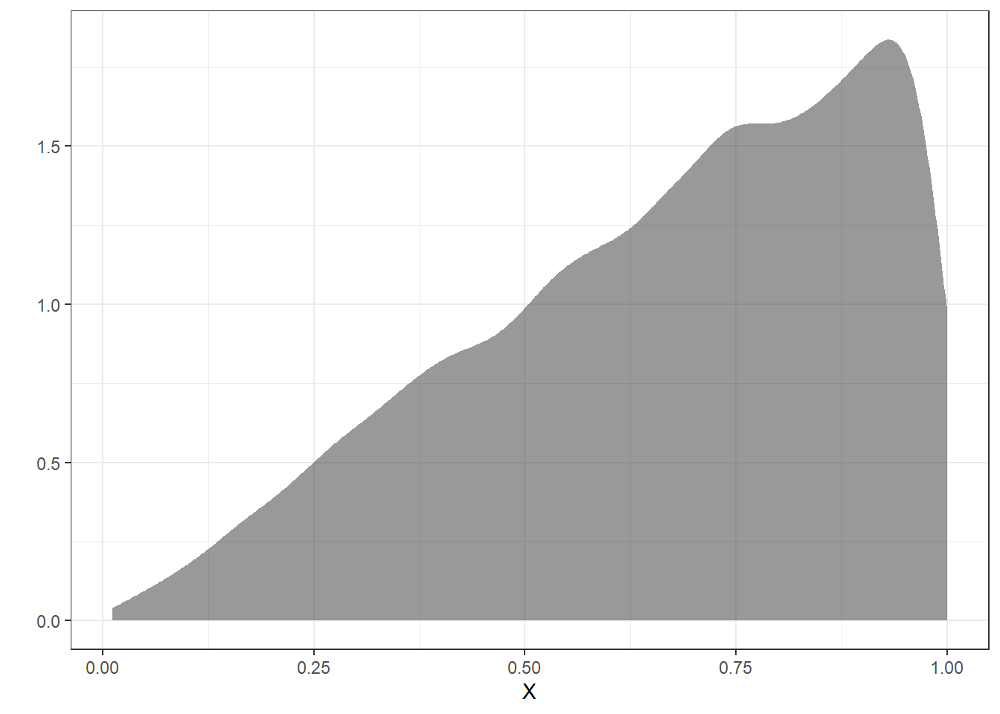
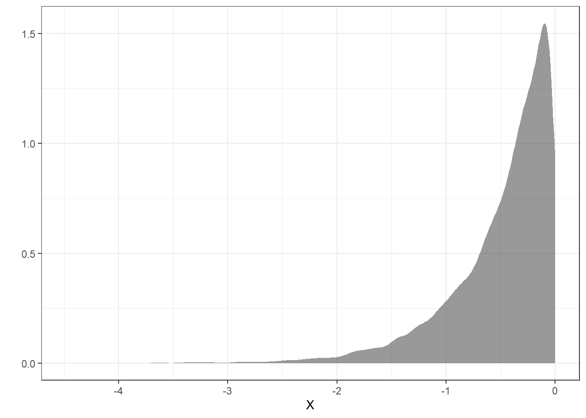
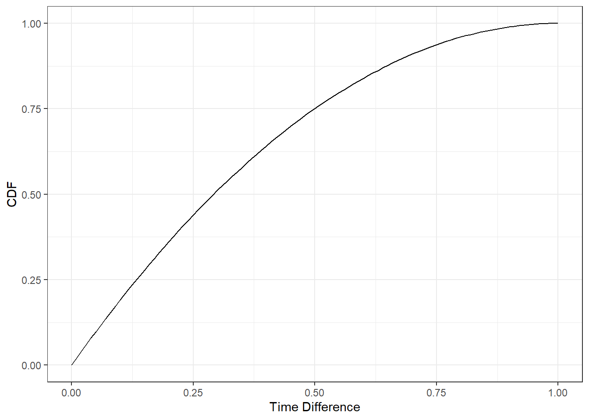

# Transformations {#TRANSF}


\newcommand{\E}{\mbox{E}}
\newcommand{\Var}{\mbox{Var}}
\newcommand{\Cov}{\mbox{Cov}}
\newcommand{\Prob}{\mbox{P}}
\newcommand{\diff}{\,\mathrm{d}}


## Objectives

1) Given a discrete random variable, determine the distribution of a transformation of that random variable.  
2) Given a continuous random variable, use the cdf method to determine the distribution of a transformation of that random variable.   
3) Use simulation methods to find the distribution of a transform of single or multivariate random variables.

## Transformations

Throughout our coverage of random variables, we have mentioned transformations of random variables. These have been in the context of linear transformations. We have discussed expected value and variance of linear transformations. Recall that $\E(aX+b)=a\E(X)+b$ and $\Var(aX+b)=a^2\Var(X)$. 

In this chapter, we will discuss transformations of random variables in general, beyond the linear case. 

### Transformations of discrete random variables

Let $X$ be a discrete random variable and let $g$ be a function. The variable $Y=g(X)$ is a discrete random variable with pmf:
$$
f_Y(y)=\Prob(Y=y)=\sum_{\forall x: g(x)=y}\Prob(X=x)=\sum_{\forall x: g(x)=y}f_X(x)
$$

An example would help since the notation can be confusing. 

> *Example*:  
Suppose $X$ is a discrete random variable with pmf:
$$
f_X(x)=\left\{\begin{array}{ll} 0.05, & x=-2 \\ 
0.10, & x=-1 \\
0.35, & x=0 \\
0.30, & x=1 \\
0.20, & x=2 \\
0, & \mbox{otherwise} \end{array}\right.
$$

Find the pmf for $Y=X^2$. 

It helps to identify the support of $Y$, that is where $f_{Y}(y)>0$. Since the support of $X$ is $S_X=\{-2,-1,0,1,2\}$, the support of $Y$ is $S_Y=\{0,1,4\}$. 
$$
f_Y(0)=\sum_{x^2=0}f_X(x)=f_X(0)=0.35
$$

$$
f_Y(1)=\sum_{x^2=1}f_X(x)=f_X(-1)+f_X(1)=0.1+0.3=0.4
$$
$$
f_Y(4)=\sum_{x^2=4}f_X(x)=f_X(-2)+f_X(2)=0.05+0.2=0.25
$$

So,
$$
f_Y(y)=\left\{\begin{array}{ll} 0.35, & y=0 \\ 
0.4, & y=1 \\
0.25, & y=4 \\
0, & \mbox{otherwise} \end{array}\right.
$$

It also helps to confirm that these probabilities add to one, which they do. This is the pmf of $Y=X^2$. 

The key idea is to find the support of the new random variable and then go back to the original random variable and sum all the probabilities that get mapped into that new support element. 

### Transformations of continuous random variables

The methodology above will not work directly in the case of continuous random variables. This is because in the continuous case, the pdf, $f_X(x)$, represents **density** and not **probability**. 

### The cdf method

The **cdf method** is one of several methods that can be used for transformations of continuous random variables. The idea is to find the cdf of the new random variable and then find the pdf by way of the fundamental theorem of calculus.

Suppose $X$ is a continuous random variable with cdf $F_X(x)$. Let $Y=g(X)$. We can find the cdf of $Y$ as:

$$
F_Y(y)=\Prob(Y\leq y)=\Prob(g(X)\leq y)=\Prob(X\leq g^{-1}(y))=F_X(g^{-1}(y))
$$

To get the pdf of $Y$ we would need to take the derivative of the cdf. Note that $g^{-1}(y)$ is the function inverse while $g(y)^{-1}$ is the multiplicative inverse.

This method requires the transformation function to have an inverse. Sometimes we can break the domain of the original random variables into regions where an inverse of the transformation function exists.

> *Example*:
Let $X\sim \textsf{Unif}(0,1)$ and let $Y=X^2$. Find the pdf of $Y$. 

Before we start, let's think about the distribution of $Y$. We are randomly taking numbers between 0 and 1 and then squaring them. Squaring a positive number less than 1 makes it even smaller. We thus suspect the pdf of $Y$ will have larger density near 0 than 1. The shape is hard to determine so let's do some math.

Since $X$ has the uniform distribution, we know that $f_X(x)$ and $F_X(x)=x$ for $0\leq x \leq 1$. So,
$$
F_Y(y)=\Prob(Y\leq y)=\Prob(X^2\leq y)=\Prob(X\leq \sqrt{y})=F_X\left(\sqrt{y}\right)=\sqrt{y}
$$

Taking the derivative of this yields:
$$
f_Y(y)=\frac{1}{2\sqrt{y}}
$$

for $0 < y \leq 1$ and 0 otherwise. Notice we can't have $y=0$ since we would be dividing by zero. This is not a problem since we have a continuous distribution. We could verify this a proper pdf by determining if the pdf integrates to 1 over the domain: 
$$
\int_0^1 \frac{1}{2\sqrt{y}} \diff y = \sqrt{y}\bigg|_0^1 = 1
$$
We can also do this using `R` but we first have to create a function that can take vector input.


```r
y_pdf <- function(y) {
  1/(2*sqrt(y))
}
```


```r
y_pdf<- Vectorize(y_pdf)
```


```r
integrate(y_pdf,0,1)
```

```
## 1 with absolute error < 2.9e-15
```

Notice that since the domain of the original random variable was non-negative, the squared function had an inverse.

The pdf of the random variable $Y$ is plotted in Figure \@ref(fig:pdf161-fig).

(ref:quote161) The pdf of the transformed random variable $Y$.  


```r
gf_line(y_pdf(seq(0.01,1,.01))~seq(0.01,1,.01),xlab="Y",ylab=expression(f(y))) %>%
  gf_theme(theme_bw())
```

<div class="figure">

<p class="caption">(\#fig:pdf161-fig)(ref:quote161)</p>
</div>

We can see that the density is much larger at we approach 0.

### The pdf method

The cdf method of transforming continuous random variables also yields to another method called the **pdf method**. Recall that the cdf method tells us that if $X$ is a continuous random variable with cdf $F_X$, and $Y=g(X)$, then 

$$
F_Y(y)=F_X(g^{-1}(y))
$$

We can find the pdf of $Y$ by differentiating the cdf:
$$
f_Y(y)=\frac{\diff}{\diff y}F_Y(y)=\frac{\diff}{\diff y} F_X(g^{-1}(y)) = f_X(g^{-1}(y))\bigg| \frac{\diff}{\diff y}  g^{-1}(y) \bigg|
$$

So, as long as $g^{-1}$ is differentiable, we can use this method to directly obtain the pdf of $Y$. 

Note that in some texts, the portion of this expression $\frac{\diff}{\diff y} g^{-1}(y)$ is sometimes referred to as the *Jacobian*. We need to take the absolute value of the transformation function $g(x)$ because if it is a decreasing function, we have 

$$
F_Y(y)=\Prob(Y\leq y)=\Prob(g(X) \leq y)=\Prob(X \geq g^{-1}(y))= 1 - F_X(g^{-1}(y))
$$


> **Exercise**:  
Repeat the previous example using the pdf method.  


Since $X$ has the uniform distribution, we know that $f_X(x)=1$ for $0\leq x \leq 1$. Also, $g(x)=x^2$ and $g^{-1}(y)=\sqrt{y}$, which is differentiable. So,

$$
f_Y(y)=f_X(\sqrt{y})\bigg|\frac{\diff}{\diff y} \sqrt{y}\bigg| = \frac{1}{2\sqrt{y}}
$$

### Simulation  

We can also get an estimate of the distribution by simulating the random variable. If we have the cdf and can find its inverse, then just like we did in an earlier chapter, we sample from a uniform distribution and apply the inverse to get the distribution.

In an earlier chapter we had the example:

> Let $X$ be a continuous random variable with $f_X(x)=2x$ where $0 \leq x \leq 1$.  

Now let's find an approximation to the distribution of $Y = \ln{X}$ using simulation.

The cdf of $X$ is $F_X(x)=x^2$ where $0 \leq x \leq 1$. We will draw a uniform random variable and then take the square root to simulate a random variable from $f_X(x)$. We will replicate this 10,000 times. In `R` our code, which we have done before, is:


```r
set.seed(1107)
results <- do(10000)*sqrt(runif(1))
```

Remember, we are using the square root because we want the inverse of the cdf and not, for this method, the inverse of the transformation function as when we were using the mathematical method. This can be a point of confusion. 


```r
inspect(results)
```

```
## 
## quantitative variables:  
##   name   class        min        Q1    median        Q3       max      mean
## 1 sqrt numeric 0.01126465 0.5027012 0.7069864 0.8670356 0.9999379 0.6672924
##          sd     n missing
## 1 0.2341494 10000       0
```

Figure \@ref(fig:dens161-fig) is a density plot of the simulated original random variable.


```r
results %>%
  gf_density(~sqrt,xlab="X") %>%
  gf_theme(theme_bw()) %>%
  gf_labs(y="")
```

<div class="figure">

<p class="caption">(\#fig:dens161-fig)The density plot of the original using simulation.</p>
</div>

Now to find the distribution of $Y$ we just apply the transformation.


```r
y_results <- results %>%
  transmute(y=log(sqrt))
```

Figure \@ref(fig:dens162-fig) is the density plot of the transformed random variable from the simulation. We can see that the support for $Y$ is $-\infty < y \leq 0$ and the density is tight near zero but skewed to the left.


```r
y_results %>%
  gf_density(~y,xlab="X")  %>%
  gf_theme(theme_bw()) %>%
  gf_labs(y="")
```

<div class="figure">

<p class="caption">(\#fig:dens162-fig)The density plot of the transformed random variable from the simulation.</p>
</div>


```r
inspect(y_results)
```

```
## 
## quantitative variables:  
##   name   class       min         Q1     median         Q3           max
## 1    y numeric -4.486086 -0.6877593 -0.3467439 -0.1426753 -6.207173e-05
##         mean        sd     n missing
## 1 -0.4969103 0.4933701 10000       0
```


### Multivariate Transformations 

For the discrete case, if you have the joint pmf, then if the transformation is to a univariate random variable, the process is similar to what see learned above. For continuous random variables, the mathematics are a little more difficult so we will just use simulation. 

Here's the scenario. Suppose $X$ and $Y$ are independent random variables, both uniformly distributed on $[5,6]$. 
$$
X\sim \textsf{Unif}(5,6)\hspace{1.5cm} Y\sim \textsf{Unif}(5,6)
$$

Let $X$ be your arrival time for dinner and $Y$ your friends arrival time. We picked 5 to 6 because this is the time in the evening we want to meet. Also assume you both travel independently.

Define $Z$ as a transformation of $X$ and $Y$ such that $Z=|X-Y|$. Thus $Z$ is the absolute value of the difference between your arrival times. The units for $Z$ are hours. We would like to explore the distribution of $Z$. We could do this via calc III methods but we will simulate instead.

We can use `R` to obtain simulated values from $X$ and $Y$ (and thus find $Z$). 

First, simulate 100,000 observations from the uniform distribution with parameters 5 and 6. Assign those random observations to a variable. Next, repeat that process, assigning those to a different variable. These two vectors represent your simulated values from $X$ and $Y$. Finally, obtain your simulated values of $Z$ by taking the absolute value of the difference.

> **Exercise**:  

Complete the code on your own before looking at the code below.


```r
set.seed(354)
results <- do(100000)*abs(diff(runif(2,5,6)))
```


```r
head(results)
```

```
##          abs
## 1 0.03171229
## 2 0.77846706
## 3 0.29111599
## 4 0.06700434
## 5 0.08663187
## 6 0.40622840
```


Figure \@ref(fig:dens163-fig) is a plot of the estimated density of the transformation. 


```r
results %>%
  gf_density(~abs) %>%
  gf_theme(theme_bw()) %>%
  gf_labs(x="|X-Y|",y="")
```

<div class="figure">

<p class="caption">(\#fig:dens163-fig)The density of the absolute value of the difference in uniform random variables.</p>
</div>

Or as a histogram in Figure \@ref(fig:hist163-fig).


```r
results %>%
  gf_histogram(~abs)%>%
  gf_theme(theme_bw()) %>%
  gf_labs(x="|X-Y|",y="")
```

<div class="figure">

<p class="caption">(\#fig:hist163-fig)Histogram of the absolute value of the difference in random variables.</p>
</div>


```r
inspect(results)
```

```
## 
## quantitative variables:  
##   name   class          min       Q1    median        Q3       max     mean
## 1  abs numeric 1.265667e-06 0.133499 0.2916012 0.4990543 0.9979459 0.332799
##          sd      n missing
## 1 0.2358863 100000       0
```

>**Exercise**:  
Now suppose whomever arrives first will only wait 5 minutes and then leave. What is the probability you eat together?  


```r
data.frame(results) %>%
  summarise(mean(abs<=5/60))
```

```
##   mean(abs <= 5/60)
## 1           0.15966
```

> **Exercise**:  
How long should the first person wait so that there is at least a 50% probability of you eating together?

Let's write a function to find the cdf.  


```r
z_cdf <- function(x) {
  mean(results$abs<=x)
}
```


```r
z_cdf<- Vectorize(z_cdf)
```
Now test for 5 minutes to make sure our function is correct since we determined above that this value should be 0.15966.


```r
z_cdf(5/60)
```

```
## [1] 0.15966
```

Let's plot to see what the cdf looks like.


```r
gf_line(z_cdf(seq(0,1,.01))~seq(0,1,.01),xlab="Time Difference",ylab="CDF") %>%
  gf_theme(theme_bw())
```



It looks like somewhere around 15 minutes, a quarter of an hour. But we will find a better answer by finding the root. In the code that follows we want to find where the cdf equals 0.5. The function `uniroot()` solves the given equations for roots so we want to put in the cdf minus 0.5. In other words, `uniroot()` solves $f(x)=0$ for x.


```r
uniroot(function(x)z_cdf(x)-.5,c(.25,35))$root
```

```
## [1] 0.2916077
```

So it is actually 0.292 hours, 17.5 minutes. So round up and wait 18 minutes.

## Homework Problems

1. Let $X$ be a random variable and let $g$ be a function. By this point, it should be clear that $\E[g(X)]$ is not necessarily equal to $g(\E[X])$. 

Let $X\sim \textsf{Expon}(\lambda=0.5)$ and $g(X)=X^2$. We know that $\E(X)=\frac{1}{0.5}=2$ so $g(\E(X))=\E(X)^2=4$. Use `R` to find $\E[g(X)]$. Make use of the fact that `R` has `rexp()` built into it, so you don't have to create your own random variable generator.


2. Let $X\sim \textsf{Binom}(n,\pi)$. What is the pmf for $Y = X+3$? Make sure you specify the domain of $Y$. [Note, we have used $p$ for the probability of success in a binomial distribution in past chapters but some references use $\pi$ instead.]


3. Let $X\sim \textsf{Expon}(\lambda)$. Let $Y=X^2$. Find the pdf of $Y$. 


4. OPTIONAL: In exercise 3, you found the pdf of $Y=X^2$ when $X\sim \textsf{Expon}(\lambda)$. Rearrange the pdf to show that $Y\sim \textsf{Weibull}$ and find the parameters of that distribution. 

5. You are on a team of two. You are both tasked to complete an exercise. The time it takes you, $T_1$, and likewise, your teammate, $T_2$, to complete the exercise are independent random variables. Exercise completion time, in minutes, is distributed with the following pdf:

$$
f_T(t)= \frac{-t}{200}+\frac{3}{20}; 10 \leq t \leq30
$$

Figure \@ref(fig:fig1) is a plot of the pdf.

<div class="figure" style="text-align: center">

<p class="caption">(\#fig:fig1)pdf of $T$</p>
</div>

We want to find the probability our combined time is less than 40 minutes, $\Prob(T_1 + T_2 < 40)$. We will solve this in steps in this problem. We are going to use a computational method because the mathematics is long and algebra intensive. You are welcome to try a mathematical solution if you like but we will not provide a mathematical solution.  

a. Use the `integrate()` function to confirm this is a valid pdf.  


b. Find the cdf of $T$ mathematically.


c. To use the cdf to simulate random variables from this distribution, we need the inverse of the cdf which means we have to solve a quadratic equation. We can do this mathematically or just use the function `uniroot()`. So first, we will make sure we understand how to use `uniroot()`.   

As a check, we know the median of the distribution is approximately 15.857. Here is code to show that 15.857 is approximately the median. We are integrating the pdf from 10 to 15.857 to confirm that this is 0.5.


```r
integrate(function(x)-x/200+3/20,10,15.857)
```

```
## 0.4999389 with absolute error < 5.6e-15
```

Use `uniroot()` and your cdf to confirm that 15.857 is the median.


d. We will create a function to take a random uniform variable on the interval $[0,1]$ and return a value of our random variable, $T$, exercise time. We can then use this function to simulate each of the exercise times and then create a new random variable that is the sum. Complete the `R` code and check that it returns the median.  

```
T <- function(y){
  uniroot(function(x)"YOUR CDF HERE as a function of x"-y,c(10,30))$root
}
```

We made it a function of $y$ since we are using $x$ in our cdf. There are two function calls here, can you see why?

e. Vectorize the function you just created using the `Vectorize()` function. Check that it is vectorized by entering `c(.5,.75)` into the function. You should get 15.85786 20.00000 as an output.


f. We are ready. Let's create a data frame with 10000 simulation for our time and another 10000 for our teammates. Remember to set a seed. At this point it may be hard to remember what we have done. The function we created takes as input a vector of random number from a uniform distribution and then applies the inverse cdf to generate a random sample from our given pdf.  

g. Do a numerical summary of the data and plot a density plot of your exercise times to give us confidence that we simulated the process correctly.

h. Create the new variable that is the sum of the two exercise time and then find the probability that the sum is less than 40.  


