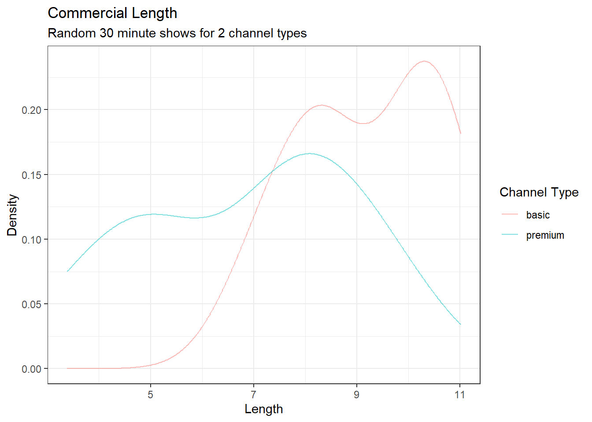
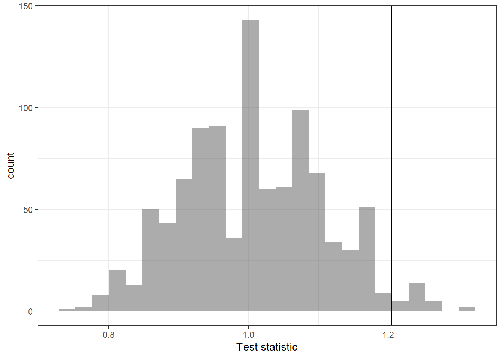

# Hypothesis Testing {#HYPOTEST}

## Objectives

1) Know and properly use the terminology of a hypothesis test.  
2) Conduct all four steps of a hypothesis test using randomization.  
3) Discuss and explain the ideas of decision errors, one-sided versus two-sided, and choice of statistical significance. 


## Decision making under uncertainty  

At this point, it is useful to take a look at where we have been in this book and where we are going. We did this in the case study, but we want to discuss it again in a little more detail. We first looked at descriptive models to help us understand our data. This also required us to get familiar with software. We learned about graphical summaries, data collection methods, and summary metrics.

Next we learned about probability models. These models allowed us to use assumptions and a small number of parameters to make statements about data and also to simulate data. We found that there is a close tie between probability models and statistical models. In our first efforts at statistical modeling, we started to use data to create estimates for parameters of a probability model. This work resulted in point estimates via method of moments and maximum likelihood. 

Now we are moving more in depth into statistical models. This is going to tie all the ideas together. We are going to use data from a sample and ideas of randomization to make conclusions about a population. This will require probability models, descriptive models, and some new ideas and terminology. We will generate point estimates for a metric designed to answer the research question and then find ways to determine the variability in the metric.

**Computational/Mathematical and hypothesis testing/confidence intervals context**

We are going to be using data from a sample of the population to make decisions about the population. There are many approaches and techniques for this. In this course we will be introducing and exploring different approaches; we are establishing foundations. As you can imagine, these ideas are varied, subtle, and at times difficult. We will just be exposing you to the foundational ideas. We want to make sure you understand that to become an accomplished practitioner, you must master the fundamentals and continue to learn the advanced ideas after the course.  

Historically there have been two approaches to statistical decision making, hypothesis testing and confidence intervals. At their mathematical foundation, they are equivalent but sometimes in practice they offer different perspectives on the problem. We will learn about both of these.

The engines that drive the numeric results of a decision making model are either mathematical or computational. In reality, computational methods have mathematics behind them, and mathematical methods often require computer computations.  The real distinction between them is the assumptions we are making about our population. Mathematical solutions typically have stricter assumptions thus leading to a tractable mathematical solution to the sampling distribution of the test statistic while computational models relax assumptions but may require extensive computational power. Like all problems, there is a trade off when one is better than the other. There is no one universal best method, some methods perform better in certain contexts. Do not think that computational methods such as the **bootstrap** are all you need to know.

## Introduction  

In this chapter we will introduce hypothesis testing. It is really an extension of our last chapter, the case study. We will put more emphasis on terms and core concepts. In this chapter we will use a computational solution but this will lead us into thinking of mathematical solutions.^[In our opinion, this is how things developed historically. However, since computational tools prior to machine computers, humans in most cases, were limited and expensive, there was a shift to mathematical solutions. The relatively recent increase and availability in machine computational power has lead to a shift back to computational methods. Thus some people think mathematical methods predate computational but that is not the case.] The role of the analyst is always key regardless of the perceived power of the computer. The analyst must take the research question and translate it into a numeric metric for evaluation. The analyst must decide on the type of data and its collection to evaluate the question. The analyst must evaluate the variability in the metric and determine what that means in relation to the original research question. The analyst must propose an answer.

## Hypothesis testing

We will continue to emphasize the ideas of hypothesis testing through a data-driven example but also via analogy to the US court system. So let's begin our journey.

> **Example**:  
You are annoyed by TV commercials. You suspect that there were more commercials in the *basic* TV channels, typically the local area channels, than in the *premium* channels you pay extra for. To test this claim, hypothesis, you want to collect some data and decide. How would you collect his data?

Here is one approach, we watch 20 random half hour shows of TV. Ten of those hours are basic TV and the other 10 are premium. In each case you record the total length of commercials in each show. 

>**Exercise**: 
Is this enough data? You decide to have your friends help you, so you actually only watch 5 hours and got the rest of the data from your friends. Is this a problem?

We cannot determine if this is enough data without some type of subject matter knowledge. First we need to decide on what metric to use to determine if a difference exists, more to come on this, and second how big of a difference from a practical standpoint is of interest. Is a loss of 1 minute of TV show enough to say there is a difference? How about 5 minutes? These are not statistical questions, but depend on the context of the problem and often need subject matter expertise to answer. Often data is collected without thought to these considerations. There are several methods that attempt to answer these questions, they are loosely called sample size calculations. This book will not focus on sample size calculations and leave it to the reader to learn more from other sources. For the second question, the answer depends on the protocol and operating procedures used. If your friends are trained on how to measure the length of commercials, what counts as an ad, and their skills verified, then it is probably not a problem to use them to collect data. Consistency in measurement is the key.

The file `ads.csv` contains the data. Let's read the data into `R` and start to summarize. Remember to load the appropriate `R` packages.


```r
ads<-read_csv("data/ads.csv")
```


```r
ads
```

```
## # A tibble: 10 x 2
##    basic premium
##    <dbl>   <dbl>
##  1  6.95    3.38
##  2 10.0     7.8 
##  3 10.6     9.42
##  4 10.2     4.66
##  5  8.58    5.36
##  6  7.62    7.63
##  7  8.23    4.95
##  8 10.4     8.01
##  9 11.0     7.8 
## 10  8.52    9.58
```


```r
glimpse(ads)
```

```
## Rows: 10
## Columns: 2
## $ basic   <dbl> 6.950, 10.013, 10.620, 10.150, 8.583, 7.620, 8.233, 10.350, 11~
## $ premium <dbl> 3.383, 7.800, 9.416, 4.660, 5.360, 7.630, 4.950, 8.013, 7.800,~
```


Notice that this data may not be `tidy`, what does each row represent and is it a single observations? We don't know how the data was obtained, but if each row is a different friend who watches one basic and one premium channel, then it is possible this data is `tidy`. We want each observation to be a single show, wo let's clean up, `tidy`, our data. Remember to ask yourself "What do I want `R` to do?" and "What does it need to do this?" We want one column that specifies the channel type and the other to specify length. 

We need `R` to put, *pivot*, the data into a longer form. We need the function `pivot_longer()`. For more information type `vignette("pivot")` at the command prompt in `R`.


```r
ads <- ads %>%
  pivot_longer(cols=everything(),names_to="channel",values_to = "length")
ads
```

```
## # A tibble: 20 x 2
##    channel length
##    <chr>    <dbl>
##  1 basic     6.95
##  2 premium   3.38
##  3 basic    10.0 
##  4 premium   7.8 
##  5 basic    10.6 
##  6 premium   9.42
##  7 basic    10.2 
##  8 premium   4.66
##  9 basic     8.58
## 10 premium   5.36
## 11 basic     7.62
## 12 premium   7.63
## 13 basic     8.23
## 14 premium   4.95
## 15 basic    10.4 
## 16 premium   8.01
## 17 basic    11.0 
## 18 premium   7.8 
## 19 basic     8.52
## 20 premium   9.58
```

Looks good. Let's summarize the data.


```r
inspect(ads)
```

```
## 
## categorical variables:  
##      name     class levels  n missing
## 1 channel character      2 20       0
##                                    distribution
## 1 basic (50%), premium (50%)                   
## 
## quantitative variables:  
##        name   class   min     Q1 median      Q3    max    mean       sd  n
## ...1 length numeric 3.383 7.4525  8.123 9.68825 11.016 8.03215 2.121412 20
##      missing
## ...1       0
```

This summary is not what we want, since we want to break it down by `channel` type.


```r
favstats(length~channel,data=ads)
```

```
##   channel   min      Q1 median       Q3    max   mean       sd  n missing
## 1   basic 6.950 8.30375  9.298 10.30000 11.016 9.2051 1.396126 10       0
## 2 premium 3.383 5.05250  7.715  7.95975  9.580 6.8592 2.119976 10       0
```

>**Exercise**:
Visualize the data using a boxplot.


```r
ads %>%
  gf_boxplot(channel~length) %>%
  gf_labs(title="Commercial Length",subtitle = "Random 30 minute shows for 2 channel types",
          x="Length",y="Channel Type" ) %>%
  gf_theme(theme_bw)
```


It appears that the *premium* channels are skewed to the left. A `density` plot may help us compare the distributions and see the skewness, Figure \@ref(fig:dens191-fig).


```r
ads %>%
  gf_dens(~length,color = ~channel)%>%
  gf_labs(title="Commercial Length",subtitle = "Random 30 minute shows for 2 channel types",
          x="Length",y="Density",color="Channel Type" ) %>%
  gf_theme(theme_bw)
```

<div class="figure">

<p class="caption">(\#fig:dens191-fig)Commercial length broken down by channel type.</p>
</div>

From this data, it looks like there is a difference between the two type of channels, but we must put the research question into a metric that will allow us to reach a decision. We will do this in a hypothesis test. As a reminder, the steps are

1. State the null and alternative hypotheses.  
2. Compute a test statistic.  
3. Determine the p-value.  
4. Draw a conclusion.  

Before doing this, let's visit an example of hypothesis testing that has become *common* knowledge for us, the US criminal trial system, we could also use the cadet honor system. This analogy allows to remember and apply the steps.

### Hypothesis testing in the US court system

A US court considers two possible claims about a defendant: she is either innocent or guilty. Imagine you are the prosecutor. If we set these claims up in a hypothesis framework, the null hypothesis is that the defendant is innocent  and the alternative is guilty. Your job as the prosecutor is to use evidence to demonstrate to the jury that the alternative hypothesis is the reasonable conclusion.   

The jury considers whether the evidence under the null hypothesis, innocence, is so convincing (strong) that there is no reasonable doubt regarding the person's guilt. That is, the skeptical perspective (null hypothesis) is that the person is innocent until evidence is presented that convinces the jury that the person is guilty (alternative hypothesis). 

Jurors examine the evidence under the assumption of innocence to see whether the evidence is so unlikely that it convincingly shows a defendant is guilty. Notice that if a jury finds a defendant **not guilty**, this does not necessarily mean the jury is confident in the person's innocence. They are simply not convinced of the alternative that the person is guilty.

This is also the case with hypothesis testing: even if we fail to reject the null hypothesis, we typically do not accept the null hypothesis as truth. Failing to find strong evidence for the alternative hypothesis is not equivalent to providing evidence that the null hypothesis is true.

There are two types of mistakes, letting a guilty person go free and sending an innocent person to jail. The criteria for making the decision, reasonable doubt, establishes the likelihood of those errors.

Now back to our problem.  

### Step 1- State the null and alternative hypotheses  

The first step is to translate the research question into hypotheses. As a reminder, our research question is *do premium channels have less ad time than basic channels?* In collecting the data, we already decided the total length of time of commercials in a 30 minute shows was the correct data for answering this question. We believe that premium channels have less commercial time. However, the null hypothesis, the straw man, has to be the default case that makes it possible to generate a sampling distribution.


i. $H_0$: **Null hypothesis**. The distribution of length of commercials in premium and basic channels is the same.
ii. $H_A$: **Alternative hypothesis**. The distribution of length of commercials in premium and basic channels is different.


These hypotheses are vague, what does it mean to be different and how do we measure and summarize this? Let's move to the second step and then come back and modify our hypotheses. Notice that the null states the distributions are the same. When we generate our sampling distribution of the test statistic, we will sample under this null.


### Step 2 - Compute a test statistic. 

> **Exercise**:  
What type of metric could we use to test for a difference in commercials between the two channels?

There are many ways for the distributions of lengths of commercials to differ. The easiest is to think of the summary statistics such as mean, median, standard deviation, or some combination of all of these. Historically, for mathematical reasons, it has been common to look at differences in measures of centrality, mean or median. The second consideration is what kind of difference? For example a ratio or an actual difference, subtraction. Again for historical reasons, the difference in means has been used as a measure. To keep things interesting, and to force those with some high school stats experience to think about this problem differently, we are going to use a different metric than has historically been used and taught. This also requires us to write some of our own code. Later we will ask you to complete the same analysis with a different test statistic either with your own code or using code from `mosaic`.

Our metric is the ratio of the median length of commercials in basic channels to premium. Thus our hypotheses are now


$H_0$: **Null hypothesis**. The distribution of length of commercials in premium and basic channels is the same.   

$H_A$: **Alternative hypothesis**. The distribution of length of commercials in premium and basic channels are different because the median length of basic channels ads is bigger than premium.  

First let's calculate the median length of commercials for your data.


```r
median(length~channel,data=ads) 
```

```
##   basic premium 
##   9.298   7.715
```

so the ratio is


```r
median(length~channel,data=ads)[1]/median(length~channel,data=ads)[2]
```

```
##    basic 
## 1.205185
```

Let's put this into a function.


```r
metric <- function(x){
  temp<-x[1]/x[2]
  names(temp) <- "test_stat"
  return(temp)
}
```


```r
metric(median(length~channel,data=ads) )
```

```
## test_stat 
##  1.205185
```

Now the observed value of the test statistic is saved in an object.


```r
obs<-metric(median(length~channel,data=ads) )
obs
```

```
## test_stat 
##  1.205185
```

Here is what we have done; we needed a single number metric to use in evaluating the null and alternative hypotheses. The null is that they have the same distribution and the alternative is that they don't. To measure the alternative we decided to use a ratio of the medians. If the number is close to 1 then the medians are not different. There may be other ways in which the distributions are different but we have decided on the ratio of medians.

### Step 3 - Determine the p-value.

As a reminder, the **p-value** is the probability of our observed test statistic or more extreme given the null hypothesis. Since our null hypothesis is that the distributions are the same we can use a **randomization**, permutation, test. We will shuffle the channel labels since under the null they are irrelevant. Here is the code for one run.


```r
set.seed(371)
metric(median(length~shuffle(channel),data=ads))
```

```
## test_stat 
## 0.9957097
```

Let's generate our empirical sampling distribution of the test statistic we developed.


```r
results <- do(1000)*metric(median(length~shuffle(channel),data=ads))
```

Next we create a plot of the distribution of the ratio of medians commercial length in basic and premium channels assuming they come from the same population, Figure \@ref(fig:hist191-fig).


```r
results %>%
  gf_histogram(~test_stat) %>%
  gf_vline(xintercept =obs ) %>%
  gf_theme(theme_bw()) %>%
  gf_labs(x="Test statistic")
```

<div class="figure">

<p class="caption">(\#fig:hist191-fig)Historgram of the sampling distribution by an approxiamte permutation test</p>
</div>

Notice that this distribution is centered on 1 and appears to be roughly symmetrical. The vertical line is our observed value of the test statistic. It seems to be in the tail, larger than expected if the channels came from the same distribution. Let's calculate the p-value.


```r
results %>%
  summarise(p_value = mean(test_stat>=obs))
```

```
##   p_value
## 1   0.026
```

Before proceeding, we have a technical question: Should we include the observed data in the calculation of the p-value? The answer is that most people would conclude that the original data is one of the possible permutations and thus include it. This practice will also insure that the p-value from a randomization test is never zero. In practice, this simply means adding 1 to both the numerator and denominator. The **mosaic** package has done this with the `prop1()` function.


```r
prop1(~(test_stat>=obs),data=results)
```

```
##  prop_TRUE 
## 0.02697303
```


The test we performed is called a one-sided test since we only checked if the median length for the basic channels is larger than that of the premium. In this case of a one-sided test, more extreme meant a number much bigger than 1. A two-sided test is also common, in fact it is the more common, and is used if we did not apriori think one channel had longer commercials than the other. In this case we find the p-value by doubling the single-sided value. This is the case because more extreme could have happened in either tail. 

### Step 4 - Draw a conclusion 

In the last lesson we encountered a study from the 1970's that explored whether there was strong evidence that women were less likely to be promoted than men. The research question -- are females discriminated against in promotion decisions made by male managers? -- was framed in the context of hypotheses:  

i. $H_0$: Gender has no effect on promotion decisions.  
ii. $H_A$: Women are discriminated against in promotion decisions.  

We used a difference in promotion proportions as our test statistic. The null hypothesis ($H_0$) was a perspective of no difference. The data provided a point estimate of a -29.2\% difference in recommended promotion rates between men and women. We determined that such a difference from chance alone would be rare: it would only happen about 2 in 100 times. When results like these are inconsistent with $H_0$, we reject $H_0$ in favor of $H_A$. Here, we concluded there was evidence of discrimination against women.

The 2-in-100 chance is the p-value, which is a probability quantifying the strength of the evidence against the null hypothesis and in favor of the alternative. 

When the p-value is small, i.e. less than a previously set threshold, we say the results are **statistically significant**. This means the data provide such strong evidence against $H_0$ that we reject the null hypothesis in favor of the alternative hypothesis. The threshold, called the **significance level** and often represented by the Greek letter $\alpha$, is typically set to $\alpha = 0.05$, but can vary depending on the field or the application. Using a  significance level of $\alpha = 0.05$ in the discrimination study, we can say that the data provided statistically significant evidence against the null hypothesis.

> We say that the data provide statistically significant evidence against the null hypothesis if the p-value is less than some reference value, usually $\alpha=0.05$.

If the null hypothesis is true, unknown to us, the significance level $\alpha$ defines the probability that we will make a Type 1 Error, we will define errors in the next section.

> *Side note*: 
What's so special about 0.05? We often use a threshold of 0.05 to determine whether a result is statistically significant. But why 0.05? Maybe we should use a bigger number, or maybe a smaller number. If you're a little puzzled, that probably means you're reading with a critical eye -- good job! There are many [video clips](http://www.openintro.org/why05}{www.openintro.org/why05) that explain the use of 0.05. Sometimes it's also a good idea to deviate from the standard and it depends on the risk that the decision maker wants in terms of the two types of errors.

>**Exercise**:  
Using our p-value make a decision.

Based on our data, if there were really no difference in the distribution of lengths of commercials in 30 minute shows between basic and premium channels then the probability of finding our observed ratio of medians is 0.027. Since this is less than our significance level of 0.05, we reject the null in favor of the alternative that the basic channel has longer commercials.

### Decision errors

Hypothesis tests are not flawless. Just think of the court system: innocent people are sometimes wrongly convicted and the guilty sometimes walk free. Similarly, data can point to the wrong conclusion. However, what distinguishes statistical hypothesis tests from a court system is that our framework allows us to quantify and control how often the data lead us to the incorrect conclusion.

There are two competing hypotheses: the null and the alternative. In a hypothesis test, we make a statement about which one might be true, but we might choose incorrectly. There are four possible scenarios in a hypothesis test, which are summarized below.

$$
\begin{array}{cc|cc} & & &\textbf{Test Conclusion}\\ 
& & \text{do not reject } H_0 &  \text{reject } H_0 \text{ in favor of }H_A  \\
& \hline H_0 \text{ true} & \text{okay} &  \text{Type~1 Error}  \\
\textbf{Truth}& H_A \text{true} & \text{Type 2 Error} & \text{okay}  \\
\end{array} 
$$


A **Type 1** Error, also called a **false positive**, is rejecting the null hypothesis when $H_0$ is actually true. Since we rejected the null hypothesis in the gender discrimination and the commercial length studies, it is possible that we made a Type 1 Error in one or both of those studies. A **Type 2** Error, also called a **false negative**, is failing to reject the null hypothesis when the alternative is actually true.

>*Example*:  
In a US court, the defendant is either innocent ($H_0$) or  guilty ($H_A$). What does a Type 1 Error represent in this context? What does a Type 2 Error represent? 

If the court makes a Type 1 Error, this means the defendant is innocent ($H_0$ true) but wrongly convicted. A Type 2 Error means the court failed to reject $H_0$ (i.e. failed to convict the person) when she was in fact guilty ($H_A$ true).

>**Exercise**:  
Consider the commercial length study where we concluded basic channels had longer commercials than premium channels. What would a Type 1 Error represent in this context?^[Making a Type 1 Error in this context would mean that there is no difference in commercial length between basic and premium channels, despite the strong evidence (the data suggesting otherwise) found in the observational study. Notice that this does **not** necessarily mean something was wrong with the data or that we made a computational mistake. Sometimes data simply point us to the wrong conclusion, which is why scientific studies are often repeated to check initial findings. Replication is part of the scientific method.]

> **Exercise**:  
How could we reduce the Type 1 Error rate in US courts? What influence would this have on the Type 2 Error rate?

To lower the Type 1 Error rate, we might raise our standard for conviction from "beyond a reasonable doubt" to "beyond a conceivable doubt" so fewer people would be wrongly convicted. However, this would also make it more difficult to convict the people who are actually guilty, so we would make more Type 2 Errors.

> **Exercise**:  
How could we reduce the Type 2 Error rate in US courts? What influence would this have on the Type 1 Error rate?

To lower the Type 2 Error rate, we want to convict more guilty people. We could lower the standards for conviction from "beyond a reasonable doubt" to "beyond a little doubt". Lowering the bar for guilt will also result in more wrongful convictions, raising the Type 1 Error rate. Think about the cadet honor system, its metric of evaluation, and the impact on the types of errors.


These exercises provide an important lesson: if we reduce how often we make one type of error, we generally make more of the other type for given amount of data, information.

### Choosing a significance level

Choosing a significance level for a test is important in many contexts, and the traditional level is 0.05. However, it is sometimes helpful to adjust the significance level based on the application. We may select a level that is smaller or larger than 0.05 depending on the consequences of any conclusions reached from the test.

If making a Type 1 Error is dangerous or especially costly, we should choose a small significance level (e.g. 0.01 or 0.001). Under this scenario, we want to be very cautious about rejecting the null hypothesis, so we demand very strong evidence favoring the alternative $H_A$ before we would reject $H_0$.

If a Type 2 Error is relatively more dangerous or much more costly than a Type 1 Error, then we should choose a higher significance level (e.g. 0.10). Here we want to be cautious about failing to reject $H_0$ when the null is actually false. The significance level selected for a test should reflect the real-world consequences associated with making a Type 1 or Type 2 Error.

### Introducing two-sided hypotheses

So far we have explored whether women were discriminated against and whether commercials were longer depending on the type of channel. In these two case studies, we've actually ignored some possibilities:


1. What if **men** are actually discriminated against?  
2. What if ads on premium channels are actually **longer**?

These possibilities weren't considered in our hypotheses or analyses. This may have seemed natural since the data pointed in the directions in which we framed the problems. However, there are two dangers if we ignore possibilities that disagree with our data or that conflict with our worldview:  


1. Framing an alternative hypothesis simply to match the direction that the data point will generally inflate the Type 1 Error rate. After all the work we've done (and will continue to do) to rigorously control the error rates in hypothesis tests, careless construction of the alternative hypotheses can disrupt that hard work.  
2. If we only use alternative hypotheses that agree with our worldview, then we're going to be subjecting ourselves to **confirmation bias**, which means we are looking for data that supports our ideas. That's not very scientific, and we can do better!

The previous hypotheses we've seen are called **one-sided hypothesis tests** because they only explored one direction of possibilities. Such hypotheses are appropriate when we are exclusively interested in the single direction, but usually we want to consider all possibilities. To do so, let's discuss **two-sided hypothesis tests** in the context of a new study that examines the impact of using blood thinners on patients who have undergone CPR.

## Two-sided hypothesis test

It is important to distinguish between a *two-sided* hypothesis test and a *one-sided* test. In a two-sided test, we are concerned with whether or not the population parameter could take a particular value. For parameter $\theta$, a set of two-sided hypotheses looks like:

$$
H_0: \theta=\theta_0 \hspace{0.75cm} H_1: \theta\neq \theta_0
$$

In a one-sided test, we are concerned with whether a parameter exceeds or does not exceed a specific value. A set of one-sided hypotheses looks like:
$$
H_0: \theta = \theta_0 \hspace{0.75cm} H_1:\theta>\theta_0
$$
or
$$
H_0: \theta = \theta_0 \hspace{0.75cm} H_1:\theta<\theta_0
$$

In some texts, one-sided null hypotheses include an inequality ($\geq$ or $\leq$). We have demonstrated one-sided tests and in the next example we will use a two-sided test.

### Example CPR 

Cardiopulmonary resuscitation (CPR) is a procedure used on individuals suffering a heart attack when other emergency resources are unavailable. This procedure is helpful in providing some blood circulation to keep a person alive, but CPR chest compressions can also cause internal injuries. Internal bleeding and other injuries that can result from CPR complicate additional treatment efforts. For instance, blood thinners may be used to help release a clot that is causing the heart attack once a patient arrives in the hospital. However, blood thinners negatively affect internal injuries.

Here we consider an experiment with patients who underwent CPR for a heart attack and were subsequently admitted to a hospital.^["Efficacy and safety of thrombolytic therapy after initially unsuccessful cardiopulmonary resuscitation: a prospective clinical trial." The Lancet, 2001.] Each patient was randomly assigned to either receive a blood thinner (treatment group) or not receive a blood thinner (control group). The outcome variable of interest was whether the patient survived for at least 24 hours.

### Step 1- State the null and alternative hypotheses  

>**Exercise**:
Form hypotheses for this study in plain and statistical language. Let $p_c$ represent the true survival rate of people who do not receive a blood thinner (corresponding to the control group) and $p_t$ represent the survival rate for people receiving a blood thinner (corresponding to the treatment group).

We want to understand whether blood thinners are helpful or harmful. We'll consider both of these possibilities using a two-sided hypothesis test.

$H_0$: Blood thinners do not have an overall survival effect, experimental treatment is independent of survival rate. $p_c - p_t = 0$.  
$H_A$: Blood thinners have an impact on survival, either positive or negative, but not zero. $p_c - p_t \neq 0$.  

Notice here that we accelerated the process by already defining our test statistic, our metric, in the hypothesis. It is the difference in survival rates for the control and treatment groups. This is a similar metric to what we used in the case study. We could use others but this will allow us to use functions from the **mosaic** package and will also help us to understand metrics for mathematically derived sampling distributions.

There were 50 patients in the experiment who did not receive a blood thinner and 40 patients who did. The study results are in the file `blood_thinner.csv`.


```r
thinner <- read_csv("data/blood_thinner.csv")
```


```r
thinner
```

```
## # A tibble: 90 x 2
##    group     outcome 
##    <chr>     <chr>   
##  1 treatment survived
##  2 control   survived
##  3 control   died    
##  4 control   died    
##  5 control   died    
##  6 treatment survived
##  7 control   died    
##  8 control   died    
##  9 treatment died    
## 10 treatment survived
## # ... with 80 more rows
```


Let's put it in a table.


```r
tally(~group+outcome,data=thinner,margins = TRUE)
```

```
##            outcome
## group       died survived Total
##   control     39       11    50
##   treatment   26       14    40
##   Total       65       25    90
```


### Step 2 - Compute a test statistic. 

The test statistic we have selected is the difference in survival rate in the control group versus the treatment group. The following `R` finds the observed proportions.


```r
tally(outcome~group,data=thinner,margins = TRUE,format="proportion")
```

```
##           group
## outcome    control treatment
##   died        0.78      0.65
##   survived    0.22      0.35
##   Total       1.00      1.00
```

Notice the formula we used to get the correct variable in the column for the summary proportions.

The observed test statistic can now be found.^[Observed control survival rate: $p_c = \frac{11}{50} = 0.22$. Treatment survival rate: $p_t = \frac{14}{40} = 0.35$. Observed difference: $\hat{p}_c - \hat{p}_t = 0.22 - 0.35 = - 0.13$.]


```r
obs<-diffprop(outcome~group,data=thinner)
obs
```

```
## diffprop 
##    -0.13
```


Based on the point estimate, for patients who have undergone CPR outside of the hospital, an additional 13\% of these patients survive when they are treated with blood thinners. However, we wonder if this difference could be easily explainable by chance.

### Step 3 - Determine the p-value.

As we did in our past two studies, we will simulate what type of differences we might see from chance alone under the null hypothesis. By randomly assigning *simulated treatment* and *simulated control* stickers to the patients' files, we get a new grouping. If we repeat this simulation 10,000 times, we can build a **null distribution** of the differences, this is our empirical sampling distribution.


```r
set.seed(655)
results <- do(10000)*diffprop(outcome~shuffle(group),data=thinner)
```

Figure \@ref(fig:dens912-fig) is a histogram of the estimated sampling distribution.  


```r
results %>%
  gf_histogram(~diffprop) %>%
  gf_vline(xintercept =obs ) %>%
  gf_theme(theme_bw()) %>%
  gf_labs(x="Test statistic")
```

<div class="figure">

<p class="caption">(\#fig:dens912-fig)Histogram of the estiamted sampling distribution.</p>
</div>

Notice how it is centered on zero, the assumption of no difference. Also notice that it is unimodal and symmetrical. We will use this when we develop mathematical sampling distributions.  


```r
prop1(~(diffprop<=obs),data=results)
```

```
## prop_TRUE 
## 0.1283872
```


The left tail area is about 0.13. (Note: it is only a coincidence that we also have $\hat{p}_c - \hat{p}_t= - 0.13$.) However, contrary to how we calculated the p-value in previous studies, the p-value of this test is not 0.13!

The p-value is defined as the chance we observe a result at least as favorable to the alternative hypothesis as the result (i.e. the difference) we observe. In this case, any differences greater than or equal to 0.13 would also provide equally strong evidence favoring the alternative hypothesis as a difference of - 0.13. A difference of 0.13 would correspond to 13\% higher survival rate in the treatment group than the control group. 

There is something different in this study than in the past studies: in this study, we are particularly interested in whether blood thinners increase **or** decrease the risk of death in patients who undergo CPR before arriving at the hospital.^[Realistically, we probably are interested in either direction in the past studies as well, and so we should have used the approach we now discuss in this section. However, for simplicity and the sake of not introducing too many concepts at once, we skipped over these details in earlier sections.] 

For a two-sided test, take the single tail (in this case, 0.13) and double it to get the p-value: 0.26. 

### Step 4 - Draw a conclusion 

Since this p-value is larger than 0.05, we do not reject the null hypothesis. That is, we do not find statistically significant evidence that the blood thinner has any influence on survival of patients who undergo CPR prior to arriving at the hospital. Once again, we can discuss the causal conclusion since this is an experiment.

> **Default to a two-sided test** 
We want to be rigorous and keep an open mind when we analyze data and evidence. Use a one-sided hypothesis test only if you truly have interest in only one direction.

> **Computing a p-value for a two-sided test**  
First compute the p-value for one tail of the distribution, then double that value to get the two-sided p-value. That's it!

It is never okay to change two-sided tests to one-sided tests after observing the data. 


> **Hypothesis tests should be set up before seeing the data**      
After observing data, it is tempting to turn a two-sided test into a one-sided test. Avoid this temptation. Hypotheses should be set up **before** observing the data.

### How to use a hypothesis test

This is a summary of the general framework for using hypothesis testing. It is the same steps with just slightly different wording.

1. Frame the research question in terms of hypotheses.  

Hypothesis tests are appropriate for research questions that can be summarized in two competing hypotheses. The null hypothesis ($H_0$) usually represents a skeptical perspective or a perspective of no difference. The alternative hypothesis ($H_A$) usually represents a new view or a difference. 

2. Collect data with an observational study or experiment.  
If a research question can be formed into two hypotheses, we can collect data to run a hypothesis test. If the research question focuses on associations between variables but does not concern causation, we would run an observational study. If the research question seeks a causal connection between two or more variables, then an experiment should be used. 

3. Analyze the data.  
Choose an analysis technique appropriate for the data and identify the p-value. So far, we've only seen one analysis technique: randomization. We'll encounter several new methods suitable for many other contexts. 

4. Form a conclusion. 
Using the p-value from the analysis, determine whether the data provide statistically significant evidence against the null hypothesis. Also, be sure to write the conclusion in plain language so casual readers can understand the results.


## Homework Problems

1. Repeat the analysis of the commercial length in the notes. This time use a different test statistic.  

a. State the null and alternative hypotheses.  
b. Compute a test statistic.  Remember to use something different than what was used above.  
c. Determine the p-value.  
d. Draw a conclusion.    


2. Is yawning contagious? 

An experiment conducted by the \textit{MythBusters}, a science entertainment TV program on the Discovery Channel, tested if a person can be subconsciously influenced into yawning if another person near them yawns. 50 people were randomly assigned to two groups: 34 to a group where a person near them yawned (treatment) and 16 to a group where there wasn't a person yawning near them (control). The following table shows the results of this experiment. 


$$
\begin{array}{cc|ccc} & & &\textbf{Group}\\ 
& & \text{Treatment } &  \text{Control} & \text{Total}  \\
& \hline \text{Yawn}	&	10	 	& 4		& 14  \\
\textbf{Result} & \text{Not Yawn}	& 24	 	& 12 	 	& 36   \\
	&\text{Total}		& 34		& 16		& 50 \\
\end{array} 
$$

The data is in the file `yawn.csv`.

a. What are the hypotheses?
b. Calculate the observed difference between the yawning rates under the two scenarios. Yes we are giving you the test statistic.
c. Estimate the p-value using randomization.
d. Plot the empirical sampling distribution.
e. Determine the conclusion of the hypothesis test.
f. The traditional belief is that yawning is contagious -- one yawn can lead to another yawn, which might lead to another, and so on. In this exercise, there was the option of selecting a one-sided or two-sided test. Which would you recommend (or which did you choose)? Justify your answer in 1-3 sentences.
g. How did you select your level of significance? Explain in 1-3 sentences.

