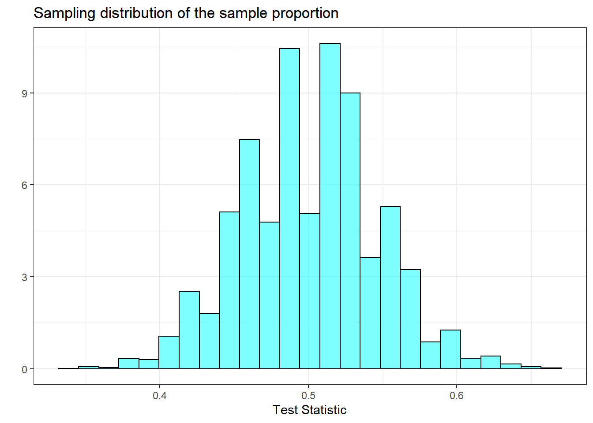
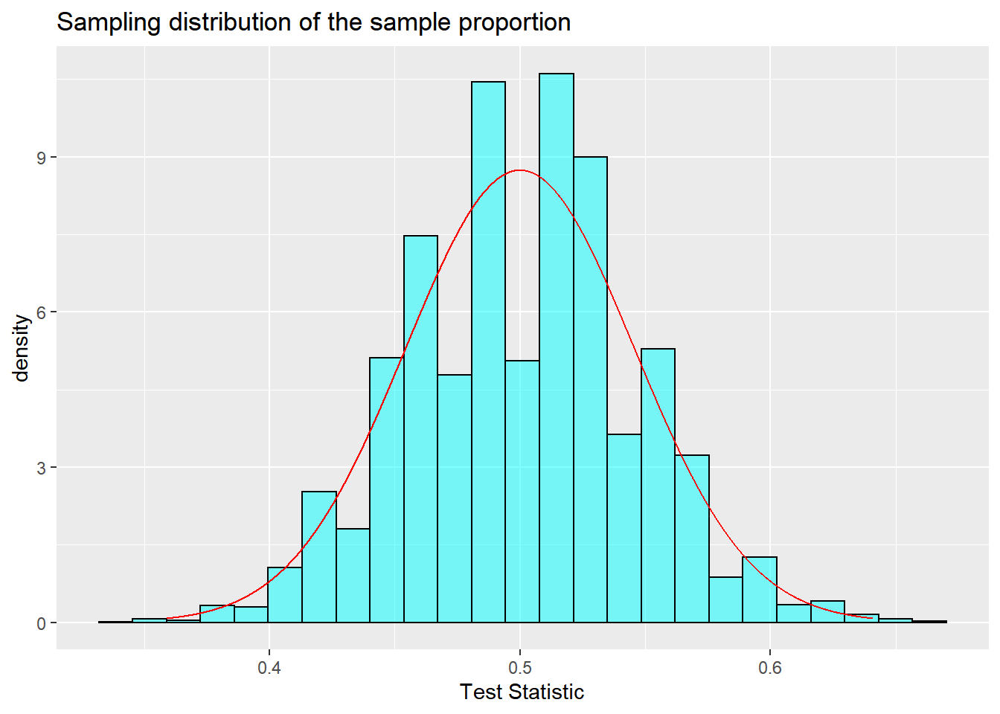
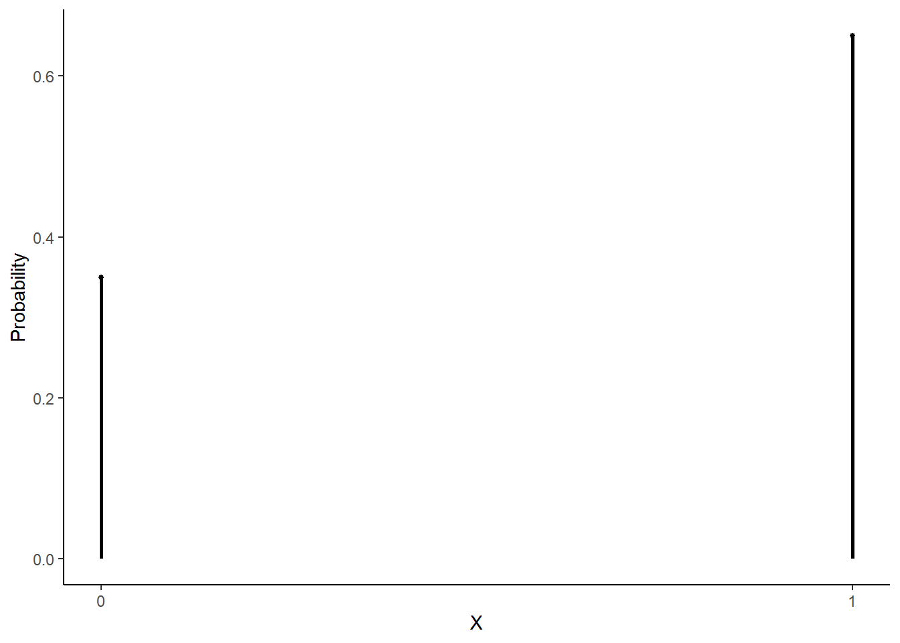
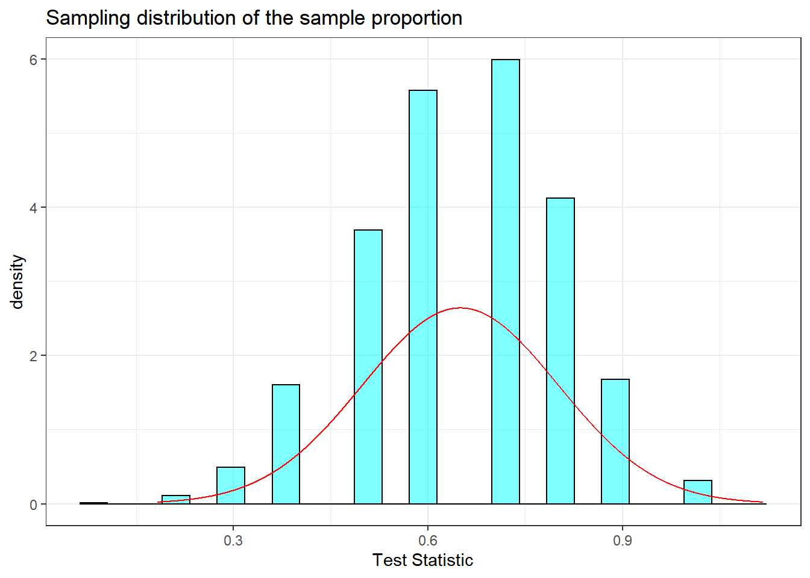
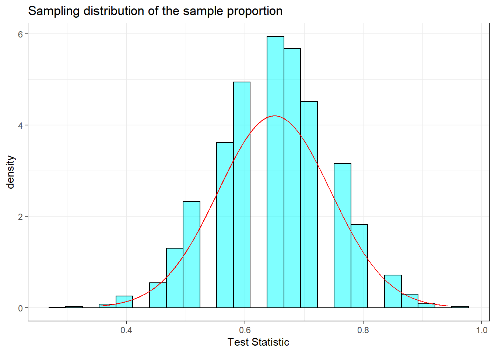
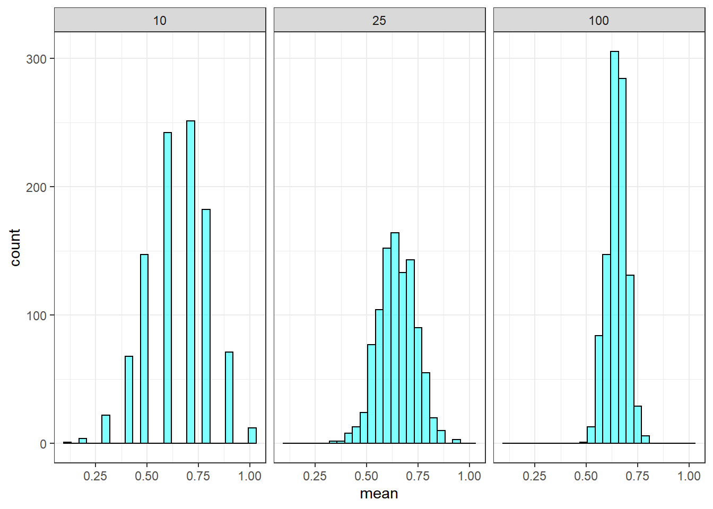
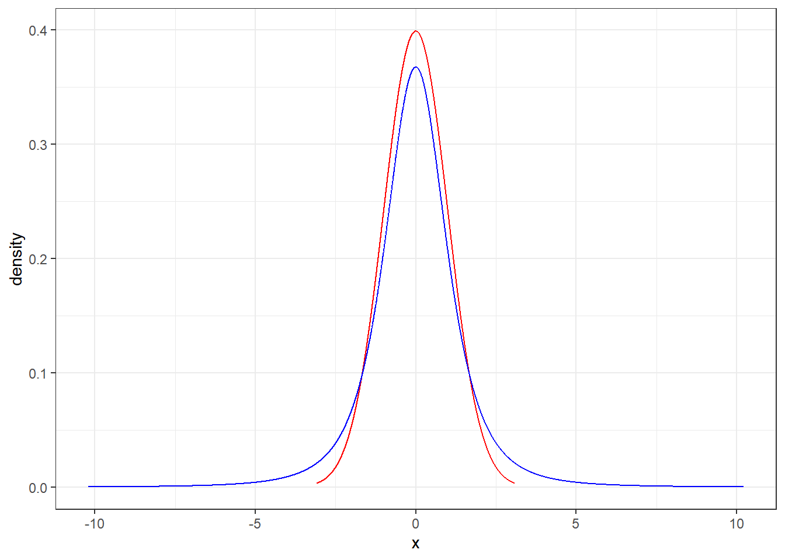
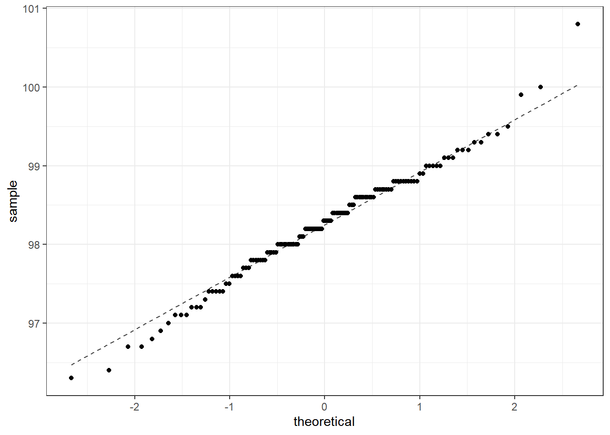

# Central Limit Theorem {#CLT}


## Objectives

1) Explain the central limit theorem and when you can use it for inference.   
2) Conduct hypothesis tests of a single mean and proportion using the CLT and `R`.   
3) Explain how the chi-squared and $t$ distributions relate to the normal distribution, where we use them, and describe the impact on the shape of the distribution when the parameters are changed.   


## Central limit theorem

We've encountered several research questions and associated hypothesis tests so far in this block of material. While they differ in the settings, in their outcomes, and also in the technique we've used to analyze the data, many of them had something in common: for a certain class of test statistics, the general shape of the sampling distribution under the null hypothesis looks like a normal distribution.

### Null distribution

As a reminder, in the tapping and listening problem, we used the proportion of correct answers as our test statistic. Under the null hypothesis we assumed the probability of success was 0.5. The estimate of the sampling distribution of our test statistic is shown in Figure \@ref(fig:dens211-fig).  


<div class="figure">

<p class="caption">(\#fig:dens211-fig)Sampling distribution of the proportion.</p>
</div>

>**Exercise**:  
Describe the shape of the distribution and note anything that you find interesting.^[In general, the distribution is reasonably symmetric. It is unimodal and looks like a normal distribution.]

In the Figure \@ref(fig:dens212-fig) we have overlayed a normal distribution on the histogram of the estimated sampling distribution. This allows us to visually compare a normal probability density curve with the empirical distribution of the sampling distribution.

<div class="figure">

<p class="caption">(\#fig:dens212-fig)Sampling distribution of the sample proportion.</p>
</div>


This similarity between the empirical and theoretical distributions is not a coincidence, but rather, is guaranteed by  mathematical theory. This chapter will be a little more notation and algebra intensive than the previous chapters. However, the goal is to develop a tool that will help us find sampling distributions for test statistics and thus find p-values. This chapter is classical statistics often taught in AP high school classes as well as many introductory undergraduate statistics courses. Remember that before the advances of modern computing, these mathematical solutions were all that was available.

### Theorem - central limit theorem 

Theorem: Let $X_1,X_2,...,X_n$ be a sequence of iid, independent and identically distributed, random variables from a distribution with mean $\mu$ and standard deviation $\sigma<\infty$. Then,
$$
\bar{X} \overset{approx}{\sim}\textsf{Norm}\left(\mu,{\sigma\over\sqrt{n}}\right)
$$

There is a lot going on in this theorem. First notice we are drawing independent samples from the same parent population. The central limit theorem (CLT) does not specify the form of this parent distribution, only that it has a finite variance. Then if we form a new random variable that involves the sum of the individual random variables, in this case the sample mean, the distribution of the new random variable is approximately normal. In the case of the sample mean, the expected value is the same mean as the parent population and the variance is the variance of the parent population divided by the sample size. Let's summarize these ideas.

1. The process of creating a new random variable from the sum of independent identically distributed random variables is approximately normal.
2. The approximation to a normal distribution improves with sample size $n$.
3. The mean and variance of the sampling distribution are a function of the mean and variance of the parent population, the sample size $n$, and the form of the new random variable.

If you go back and review examples, exercises, and homework problems from the previous lessons on hypothesis testing, you will see that we get symmetric normal "looking" distributions when we created test statistics that involved the process of summing. The example of a skewed distribution was the golf ball example where our test statistic was the difference of the max and min. It is hard to overstate the historical importance of this theorem to the field of inferential statistics and science in general.

To get an understanding and some intuition of the central limit theorem, let's simulate some data and evaluate.

### Simulating data for CLT

For this section, we are going to use an artificial example where we know the population distribution and parameters. We will repeat sampling from this many times and plot the distribution of the summary statistic of interest, the sample mean, to demonstrate the CLT. This is purely an educational thought experiment to give ourselves confidence about the validity of the CLT.

Suppose there is an upcoming election in Colorado and Proposition A is on the ballot. Now suppose that 65% of Colorado voters support Proposition A. We poll a random sample of $n$ Colorado voters. Prior to conducting the sample, we can think about the sample as a sequence of iid random variables from the binomial distribution with one trial in each run and a probability of success (support for the measure) of 0.65. In other words, each random variable will take a value of 1 (support) or 0 (oppose). Figure \@ref(fig:dens213-fig) is a plot of the pmf of the parent distribution ($\textsf{Binom}(1,0.65)$):


```r
gf_dist("binom",size=1,prob=.65,plot_size=1) %>%
  gf_theme(theme_classic()) %>%
  gf_theme(scale_x_continuous(breaks = c(0,1))) %>%
  gf_labs(y="Probability",x="X")
```

<div class="figure">

<p class="caption">(\#fig:dens213-fig)Binomial pmf with 1 trial and probability of succes of 0.65.</p>
</div>

This is clearly not normal, it is in fact discrete. The mean of $X$ is 0.65 and the standard deviation is $\sqrt{0.65(1-0.65)}=0.477$. 

In our first simulation, we let the sample size be ten, $n=10$. This is typically too small for the CLT to apply but we will still use it as a starting point. In the code box below, we will obtain a sample of size 10 from this distribution and record the observed mean $\bar{x}$, which is our method of moments estimate of the probability of success. We will repeat this 10,000 times to get an empirical distribution of $\bar{X}$. (Note that $\bar{X}$ is a mean of 1s and 0s and can be thought of as a proportion of voters in the sample that support the measure. Often, population proportion is denoted as $\pi$ and the sample proportion is denoted as $\hat{\pi}$.) 


```r
set.seed(5501)
results<-do(10000)*mean(rbinom(10,1,0.65))
```

Since we are summing iid variables, the sampling distribution of the mean should look like a normal distribution. The mean should be close to 0.65, and the standard deviation $\sqrt{\frac{p(1-p)}{n}} = \sqrt{\frac{0.65(1-0.65)}{10}}=0.151$ 


```r
favstats(~mean,data=results)
```

```
##  min  Q1 median  Q3 max    mean        sd     n missing
##  0.1 0.5    0.7 0.8   1 0.64932 0.1505716 10000       0
```

Remember from our lessons on probability, these results for the mean and standard deviation do not depend on the CLT, they are results from the properties of expectation on independent samples. The distribution of the sample mean, the shape of the sampling distribution, is approximately normal as a result of the CLT, Figure \@ref(fig:dens214-fig).

<div class="figure">

<p class="caption">(\#fig:dens214-fig)Sampling distribution of the sample proportion with sample size of 10.</p>
</div>

Note the sampling distribution of the sample mean has a bell-curvish shape, but with some skew to the left for this particular small sample size. That is why we state that the approximation improves with sample size. 

As a way to determine the impact of the sample size on the inference to the population, let's record how often a sample of 10 failed to indicate support for the measure. (How often was the sample proportion less than or equal to 0.5?) Remember, in this artificial example, we know that the population is in favor of the measure, 65% approval. However, if our point estimate is below 0.5, we would be led to believe that the population does not support the measure. 


```r
results %>%
 summarise(low_result=mean(~mean<=0.5))
```

```
##   low_result
## 1     0.2505
```

Even though we know that 65% of Colorado voters support the measure, a sample of size 10 failed to indicate support 25.05% of the time. 

Let's take a larger sample. In the code below, we will repeat the above but with a sample of size 25. Figure \@ref(fig:dens215-fig) plots the sampling distribution.


```r
set.seed(5501)
results<-do(10000)*mean(rbinom(25,1,0.65))
```


<div class="figure">

<p class="caption">(\#fig:dens215-fig)Sampling distribution of the sample proportion with sample size of 25.</p>
</div>


```r
results %>%
 summarise(low_result=mean(~mean<=0.5))
```

```
##   low_result
## 1     0.0623
```

When increasing the sample size to 25, the standard deviation of our sample proportion decreased. According to the central limit theorem, it should have decreased to $\sigma/\sqrt{25}=\sqrt{\frac{p(1-p)}{25}}=0.095$. Also, the skew became less severe. Further, the sample of size 25 failed to indicate support only 6.23% of the time. It reasonably follows that an even larger sample would continue these trends. Figure \@ref(fig:dens216-fig) demonstrates these trends.


```r
clt %>%
  gf_histogram(~mean,color="black",fill="cyan") %>%
  gf_facet_grid(~samp) %>%
  gf_theme(theme_bw())
```

<div class="figure">

<p class="caption">(\#fig:dens216-fig)Sampling distribution of the proportion for different trail sizes.</p>
</div>


### Summary of example

In this example, we knew the true proportion of voters who supported the proposition. Based on that knowledge, we simulated the behavior of the sample proportion. We did this by taking a sample of size $n$, recording the sample proportion, sample mean, and repeating that process thousands of times. In reality, we will not know the true underlying level of support; further, we will not take a sample repeatedly thousands of times from the parent population. Sampling can be expensive and time-consuming. Thus, we would take one random sample of size $n$, and acknowledge that the resulting sample proportion is but one observation from an underlying normal distribution. We would then determine what values of $\pi$ (the true unknown population proportion) could reasonably have resulted in the observed sample proportion. 


## Other distribution for estimators

Prior to using the CLT in hypothesis testing, we want to discuss other sampling distributions that are based on the CLT or normality assumptions. A large part of theoretical statistics has been about mathematically deriving the distribution of sample statistics. In these methods we obtain a sample statistic, determine the distribution of that statistic under certain conditions, and then use that information to make a statement about the population parameter. 

### Chi-sqaured

Recall that the central limit theorem tells us that for reasonably large sample sizes, $\bar{X}\overset{approx}{\sim}\textsf{Norm}(\mu,\sigma/\sqrt{n})$. However, this expression involves two unknowns: $\mu$ and $\sigma$. In the case of binary data, population variance is a function of population proportion ($\Var(X)=\pi(1-\pi)$), so there is really just one unknown. In the case of continuous data, the standard deviation would need to be estimated. 

Let $S^2$ be defined as:
$$
S^2={\sum (X_i-\bar{X})^2\over n-1}
$$

Recall that this is an unbiased estimate for $\sigma^2$. The sampling distribution of $S^2$ can be found using the following lemma:

Lemma: Let $X_1,X_2,...,X_n$ be an iid sequence of random variables from a normal population with mean $\mu$ and standard deviation $\sigma$. Then,
$$
{(n-1)S^2\over \sigma^2}\sim \textsf{Chisq}(n-1)
$$

The $\textsf{Chisq}(n-1)$ distribution is read as the "chi-squared" distribution ("chi" is pronounced "kye"). The chi-squared distribution has one parameter: degrees of freedom. The chi-squared distribution is used in other contexts such as goodness of fit problems like the golf ball example from last lesson, we will discuss this particular application in a later chapter.   

The proof of this lemma is outside the scope of this book, but it is not terribly complicated. It follows from the fact that the sum of $n$ squared random variables, each with the standard normal distribution, follows the chi-squared distribution with $n$ degrees of freedom. 

This lemma can be used to draw inferences about $\sigma^2$. For a particular value of $\sigma^2$, we know how $S^2$ should behave. So, for a particular value of $S^2$, we can figure out reasonable values of $\sigma^2$. 

In practice, one rarely estimates $\sigma$ for the purpose of inferring on $\sigma$. Typically, we are interested in estimating $\mu$ and we need to account for the added uncertainty in estimating $\sigma$ as well. That is what we will discuss in the next section. 

### Student's t

Let $X_1,X_2,...,X_n$ be an iid sequence of random variables, each with mean $\mu$ and standard deviation $\sigma$. Recall that the central limit theorem tells us that
$$
\bar{X}\overset{approx}{\sim}\textsf{Norm}(\mu,\sigma/\sqrt{n})
$$

Rearranging:
$$
{\bar{X}-\mu\over\sigma/\sqrt{n}}\overset{approx}{\sim}\textsf{Norm}(0,1)
$$

Again, $\sigma$ is unknown. Thus, we have to estimate it. We can estimate it with $S$, but now we need to know the distribution of ${\bar{X}-\mu\over S/\sqrt{n}}$. This *does not* follow the normal distribution. 

Lemma: Let $X_1,X_2,...,X_n$ be an iid sequence of random variables from a normal population with mean $\mu$ and standard deviation $\sigma$. Then,
$$
{\bar{X}-\mu\over S/\sqrt{n}} \sim \textsf{t}(n-1)
$$

The $\textsf{t}(n-1)$ distribution is read as the "$t$" distribution. The $t$ distribution has one parameter: degrees of freedom. The expression above $\left({\bar{X}-\mu\over S/\sqrt{n}}\right)$ is referred to as the $t$ statistic. 

Similar to the chi-squared distribution, we won't go over the proof, but it follows from some simple algebra and from the fact that the ratio between a standard normal random variable and the square root of a chi-squared random variable, divided by it's degrees of freedom follows a $t$ distribution. 

The $t$ distribution is very similar to the standard normal distribution, but has longer tails. This seems to make sense in the context of estimating $\mu$ since substituting $S$ for $\sigma$ adds variability to the random variable. 
Figure \@ref(fig:t211-fig) is a plot of the $t$ distribution, shown as a blue line, and has a bell shape that looks very similar to a normal distribution, red line. However, its tails are thicker, which means observations are more likely to fall beyond two standard deviations from the mean than under the normal distribution. When our sample is small, the value $s$ used to compute the standard error isn't very reliable. The extra thick tails of the $t$ distribution are exactly the correction we need to resolve this problem. When the degrees of freedom is about 30 or more, the $t$ distribution is nearly indistinguishable from the normal distribution.


```r
gf_dist("norm",color="red") %>%
  gf_dist("t",df=3,color="blue") %>%
  gf_theme(theme_bw())
```

<div class="figure">

<p class="caption">(\#fig:t211-fig)The distibtion of t.</p>
</div>


### Important Note

You may have noticed an important condition in the two lemmas above. It was assumed that each $X_i$ in the sequence of random variables was *normally* distributed. While the central limit theorem has no such normality assumption, the distribution of the $t$-statistic is subject to the distribution of the underlying population. With a large enough sample size, this assumption is not necessary. There is no magic number, but some resources state that as long as $n$ is at least 30-40, the underlying distribution doesn't matter. For smaller sample sizes, the underlying distribution should be relatively symmetric and unimodal. 

One advantage of simulation-based inference methods is that these methods do not rely on any such distributional assumptions. However, the simulation-based methods may have a smaller power for the same sample size.

## Hypotheses tests using CLT

We are now ready to repeat some of our previous problems using the mathematically derived sampling distribution via the CLT.

### Tappers and listeners

#### Step 1- State the null and alternative hypotheses  

Here are the two hypotheses:  

$H_0$: The tappers are correct, and generally 50\% of the time listeners are able to guess the tune. $p = 0.50$  
$H_A$: The tappers are incorrect, and either more than or less than 50\% of listeners will be able to guess the tune. $p \neq 0.50$  

#### Step 2 - Compute a test statistic. 

The test statistic that we want to use is the sample mean $\bar{X}$, this is a method of moments estimate of the probability of success. Since these are independent samples from the same binomial distribution, by the CLT

$$
\bar{X} \overset{approx}{\sim}\textsf{Norm}\left(\pi,\sqrt\frac{\pi(1-\pi)}{n}\right)
$$

As we learned, this approximation improves with sample size. As a rule of thumb, most analysts are comfortable with using the CLT for this problem if the number of success and failures are both 10 or greater.

In our study 42 out of 120 listeners ($\bar{x}=\hat{p} = 0.35$) were able to guess the tune. This is the observed value of test statistic.


#### Step 3 - Determine the p-value.

We now want to find the p-value from the one-sided probability $\Prob(\bar{X} \leq 0.35)$ given the null hypothesis is true, the probability of success is 0.50. We will use `R` to get the one-sided value and then double it since the test is two-sided and the sampling distribution is symmetrical.


```r
2*pnorm(0.35,mean=.5,sd=sqrt(.5*.5/120))
```

```
## [1] 0.001015001
```

That is a small p-value and consistent with what we would got using both the exact binomial test and the simulation empirical p-values.

>**Important note**:
In the calculation of the standard deviation of the sampling distribution, we used the null hypothesized value of the probability of success. 

#### Step 4 - Draw a conclusion 

Based on our data, if the listeners were guessing correct 50\% of the time, there is less than a 1 in 1000 probability that only 42 or less or 78 or more listeners would get it right. This is much less than 0.05, so we reject that the listeners are guessing correctly half of the time.

Note that `R` has built in functions to perform this test. If you explore these functions, use `?prop.test` to learn more, you will find options to improve the performance of the test. You are welcome and should read about these methods. Again, before computers, researchers spent time optimizing the performance of the asymptotic methods such as the CLT.


Here is the test of a single proportion using `R`.


```r
prop.test(42,120)
```

```
## 
## 	1-sample proportions test with continuity correction
## 
## data:  42 out of 120
## X-squared = 10.208, df = 1, p-value = 0.001398
## alternative hypothesis: true p is not equal to 0.5
## 95 percent confidence interval:
##  0.2667083 0.4430441
## sample estimates:
##    p 
## 0.35
```

The p-value is small, reported as $0.0014$. We will study the confidence interval soon so don't worry about that part of the output. The alternative hypothesis is also listed.

>**Exercise**:  
How do you conduct a one-sided test? What if the null value where 0.45?^[We will only extract the p-value in this exercise]


```r
pval(prop.test(42,120,alternative="less",p=.45))
```

```
##   p.value 
## 0.0174214
```

The exact test uses the function `binom.test()`.


```r
binom.test(42,120)
```

```
## 
## 
## 
## data:  42 out of 120
## number of successes = 42, number of trials = 120, p-value = 0.001299
## alternative hypothesis: true probability of success is not equal to 0.5
## 95 percent confidence interval:
##  0.2652023 0.4423947
## sample estimates:
## probability of success 
##                   0.35
```

This is the same as 


```r
2*pbinom(42,120,.5)
```

```
## [1] 0.001299333
```


### Body temperature

We will repeat the body temperature analysis using the CLT. We will use $\alpha = 0.05$ 

#### Step 1- State the null and alternative hypotheses  

$H_0$: The average body temperature is 98.6; $\mu = 98.6$  
$H_A$: The average body temperature is less than 98.6; $\mu < 98.6$  

#### Step 2 - Compute a test statistic. 

We don't know the population variance, so we will use the $t$ distribution. Remember that 

$$
{\bar{X}-\mu\over S/\sqrt{n}} \sim \textsf{t}(n-1)
$$
thus our test statistic is 

$$
\frac{\bar{x}-98.6}{s/\sqrt{n}}
$$


```r
favstats(~temperature,data=temperature)
```

```
##   min   Q1 median   Q3   max     mean        sd   n missing
##  96.3 97.8   98.3 98.7 100.8 98.24923 0.7331832 130       0
```


```r
temperature %>%
  summarise(mean=mean(temperature),sd=sd(temperature),test_stat=(mean-98.6)/(sd/sqrt(130)))
```

```
## # A tibble: 1 x 3
##    mean    sd test_stat
##   <dbl> <dbl>     <dbl>
## 1  98.2 0.733     -5.45
```

We are over 5 standard deviation below the null hypothesis mean. We have some assumptions that we will discuss at the end of this problem. 

#### Step 3 - Determine the p-value.

We now want to find the p-value from $\Prob(t \leq -5.45)$ on 129 degrees of freedom, given the null hypothesis is true, which is that the probability of success is 0.50. We will use `R` to get the one-sided p-value.


```r
pt(-5.45,129)
```

```
## [1] 1.232178e-07
```

We could also use the `R` function `t_test()`.


```r
t_test(~temperature,data=temperature,mu=98.6,alternative="less")
```

```
## 
## 	One Sample t-test
## 
## data:  temperature
## t = -5.4548, df = 129, p-value = 1.205e-07
## alternative hypothesis: true mean is less than 98.6
## 95 percent confidence interval:
##      -Inf 98.35577
## sample estimates:
## mean of x 
##  98.24923
```

Notice this p-value is much smaller than the p-value from the method used in homework problem 3 in the last chapter. That is because this test statistic has more assumptions and uses the data as continuous and not discrete.

#### Step 4 - Draw a conclusion

Based our data, if the true mean body temperature is 98.6, then the probability of observing a mean of 98.25 or less is 0.00000012. This is too unlikely so we reject the hypothesis that the average body temperature is 98.6.


## Summary and rules of thumb

We have covered a great deal in this lesson. At its core, the central limit theorem is a statement about the distribution of a sum of independent identically distributed random variables. This sum is approximately normal. First we summarize rules of thumb for the use of the CLT and $t$ distribution.

### Numerical data

1. The central limit works regardless of the distribution. However, if the parent population is highly skewed, then more data is needed. The CLT works well once the sample sizes exceed 30 to 40. If the data is fairly symmetric, then less data is needed.

2. When estimating the mean and standard error from a sample of numerical data, the $t$ distribution is a little more accurate than the normal model. But there is an assumption that the parent population is normally distributed. This distribution works well even for small samples as long as the data is close to symmetrical and unimodal.

3. For medium samples, at least 15 data points, the $t$ distribution still works as long as the data is roughly symmetric and unimodal.

4. For large data sets 30-40 or more, the $t$ or even the normal can be used but we suggest you always use the $t$. 


Now, let's discuss the assumptions of the $t$ distribution and how to check them.

1. Independence of observations. This is a difficult assumption to verify. If we collect a simple random sample from less than 10\% of the population, or if the data are from an experiment or random process, we feel better about this assumption. If the data comes from an experiment, we can plot the data versus time collected to see if there are any patterns that indicate a relationship. A design of experiment course discusses these ideas.  

2. Observations come from a nearly normal distribution. This second condition is difficult to verify with small data sets. We often (i) take a look at a plot of the data for obvious departures from the normal model, usually in the form of prominent outliers, and (ii) consider whether any previous experiences alert us that the data may not be nearly normal. However, if the sample size is somewhat large, then we can relax this condition, e.g. moderate skew is acceptable when the sample size is 30 or more, and strong skew is acceptable when the size is about 60 or more.

A typical plot to use to evaluate the normality assumption is called the quantile-quantile plot. We form a scatterplot of the empirical quantiles from the data versus exact quantile values from the theoretical distribution. If the points fall along a line then the data match the distribution. An exact match is not realistic, so we look for major departures from the line. 

Figure \@ref(fig:qq211-fig) is our normal-quantile plot for the body temperature data. The largest value may be an outlier, we may want to verify it was entered correctly. The fact that the points are above the line for the larger values and below the line for the smaller values indicates that our data may have longer tails than the normal distribution. There are really only 3 values in the larger quantiles so in fact the data may be slightly skewed to the left, this was also indicated by a comparison of the mean and median. However, since we have 130 data points these results should not impact our findings. 


```r
gf_qq(~temperature,data=temperature) %>%
  gf_qqline(~temperature,data=temperature) %>%
  gf_theme(theme_bw())
```

<div class="figure">

<p class="caption">(\#fig:qq211-fig)Q-Q plot for body temperature data.</p>
</div>

Extreme data points, outliers, can be cause for concern. In later chapters, we will look for ways to detect outliers but we have seen them in our boxplots.  Outliers are problematic because normal distributions rarely have outliers so the presence of one may indicate a departure from normality. Second, outliers have a big impact on estimation methods for the mean and standard deviation whether it is a method of moments or maximum likelihood estimate.  

We can also check the impacts of the assumptions by using other methods for the hypothesis test. If all methods give the same conclusion, we can be confident in the results. Another way to check robustness to assumptions is to simulate data from different distributions and evaluate the performance of the test under the simulated data.

### Binary data  

The distribution of a binomial random variable or simple scalar transformations of it, such as the proportions of success found by dividing by the sample size, are approximately normal by the CLT. Since binomial random variables are bounded by zero and the number of trails, we have to make sure our probability of success is not close to zero or one, that is the number of successes is not close to 0 or $n$. A general rule of thumb is that the number of success and failures be at least 10.

## Homework Problems

1. Suppose we roll a fair six-sided die and let $X$ be the resulting number. The distribution of $X$ is discrete uniform. (Each of the six discrete outcomes is equally likely.) 

a. Suppose we roll the fair die 5 times and record the value of $\bar{X}$, the *mean* of the resulting rolls. Under the central limit theorem, what should be the distribution of $\bar{X}$?   
b. Simulate this process in `R`. Plot the resulting empirical distribution of $\bar{X}$ and report the mean and standard deviation of $\bar{X}$. Was it what you expected?   

(HINT: You can simulate a die roll using the `sample` function. Be careful and make sure you use it properly.)   
c. Repeat parts a) and b) for $n=20$ and $n=50$. Describe what you notice. Make sure all three plots are plotted on the same $x$-axis scale. You can use facets if you combine your data into one `tibble`.


2. The nutrition label on a bag of potato chips says that a one ounce (28 gram) serving of potato chips has 130 calories and contains ten grams of fat, with three grams of saturated fat. A random sample of 35 bags yielded a sample mean of 134 calories with a standard deviation of 17 calories. Is there evidence that the nutrition label does not provide an accurate measure of calories in the bags of potato chips? The conditions necessary for applying the normal model have been checked and are satisfied.


The question has been framed in terms of two possibilities: the nutrition label accurately lists the correct average calories per bag of chips or it does not, which may be framed as a hypothesis test.

a. Write the null and alternative hypothesis.  
b. What level of significance are you going to use?   
c. What is the distribution of the test statistic ${\bar{X}-\mu\over S/\sqrt{n}}$? Calculate the observed value.  
d. Calculate a p-value.  
e. Draw a conclusion.  

3. Exploration of the chi-squared and $t$ distributions. 

a. In `R`, plot the pdf of a random variable with the chi-squared distribution with 1 degree of freedom. On the same plot, include the pdfs with degrees of freedom of 5, 10 and 50. Describe how the behavior of the pdf changes with increasing degrees of freedom.   
b. Repeat part (a) with the $t$ distribution. Add the pdf of a standard normal random variable as well. What do you notice? 


4. In this lesson, we have used the expression *degrees of freedom* a lot. What does this expression mean? When we have sample of size $n$, why are there $n-1$ degrees of freedom for the $t$ distribution? Give a short concise answer (about one paragraph). You will likely have to do a little research on your own.  

5. Deborah Toohey is running for Congress, and her campaign manager claims she has more than 50\% support from the district's electorate. Ms. Toohey's opponent claimed that Ms. Toohey has **less** than 50\%. Set up a hypothesis test to evaluate who is right.

a. Should we run a one-sided or two-sided hypothesis test?  
b. Write the null and alternative hypothesis.  
c. What level of significance are you going to use?   
d. What are the assumptions of this test?  
e. Calculate the test statistic.  
e. Calculate a p-value.  
f. Draw a conclusion.  

Note: A newspaper collects a simple random sample of 500 likely voters in the district and estimates Toohey's support to be 52\%. 


