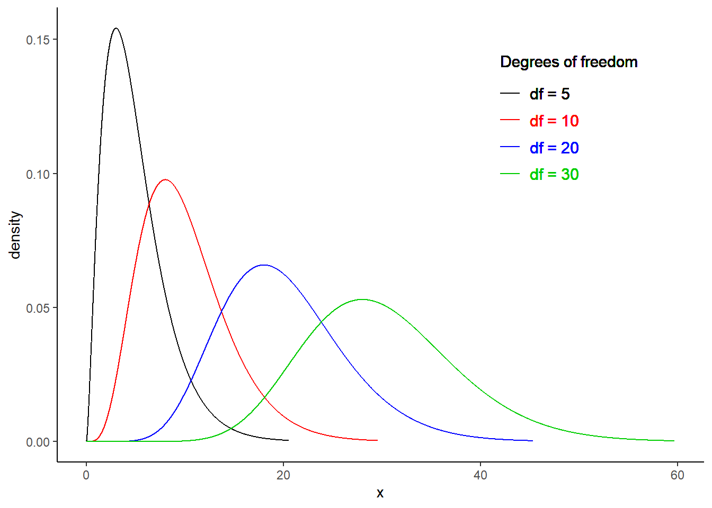
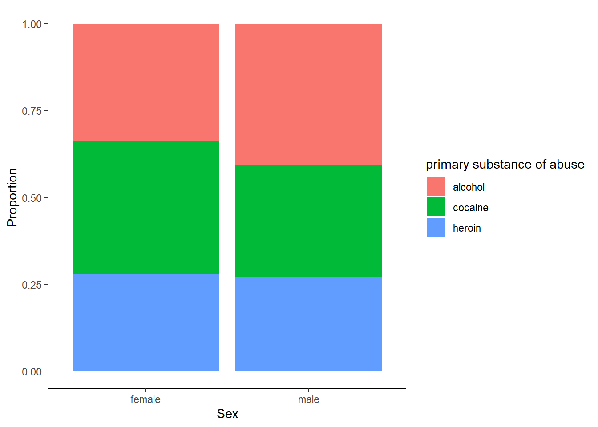
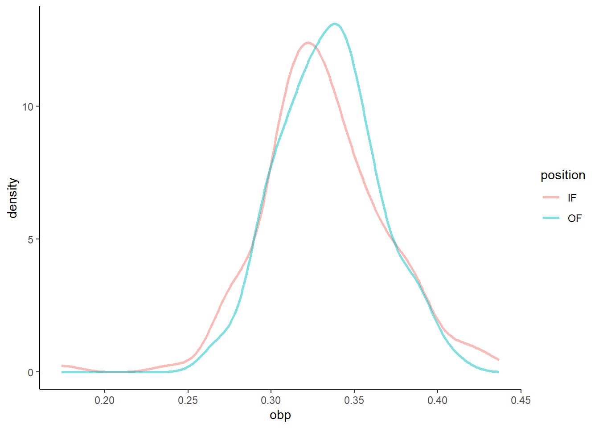
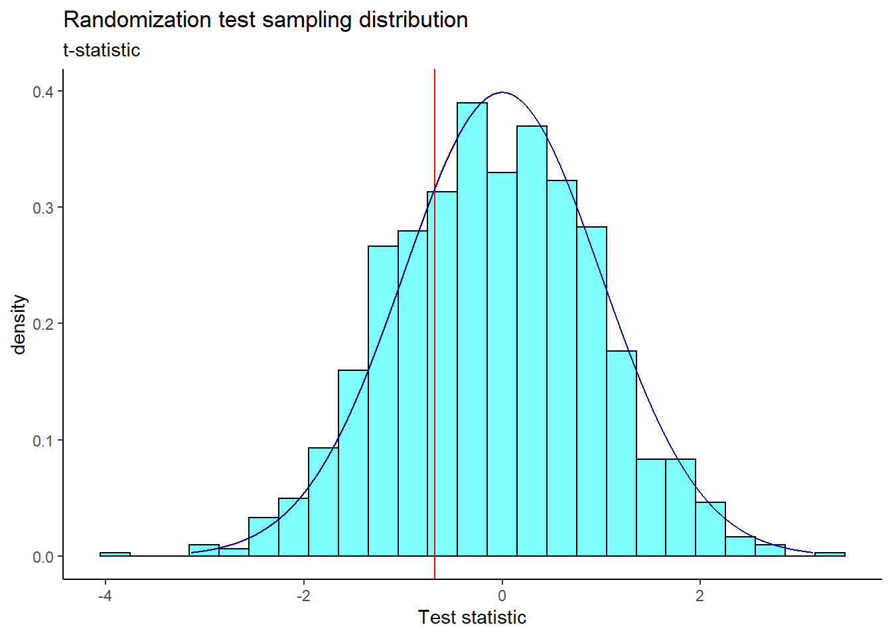

# Additional Hypothesis Tests {#ADDTESTS}

## Objectives

1) Conduct and interpret a goodness of fit test using both Pearson's chi-squared and randomization to evaluate the independence between two categorical variables.  

2) Explain how the chi-squared distribution relates to the normal distribution, where it is used, and how changing parameters impacts the shape of the distribution.   

3) Conduct and interpret a hypothesis test for equality of two means and equality of two variances using both permutation and the CLT.   
 
4) Conduct and interpret a hypothesis test for paired data.
 
5) Know and check the assumptions for Pearson's chi-square and two-sample $t$ tests.  


## Introduction

The purpose of the next two chapters is to put all we've learned so far in this block into perspective, and to demonstrate a couple of new statistical tests.

Remember that we have been using data to answer research questions. So far, we can do this with hypothesis tests, using several different methods. There is a close link between these methods, and the steps of hypothesis testing have remained the same no matter which method is used. The key ideas have been to generate a single number metric to use in answering our research question, and then to obtain the sampling distribution of this metric. 

In obtaining the sampling distribution, we used randomization as an approximation to permutation exact tests, probability models, and mathematical models. Each of these had different assumptions and different areas where they could be applied. In some cases, several methods can be applied to the problem to get a sense of the robustness to different assumptions. For example, if you run a randomization test and a test using the CLT, and they both give you similar results, you can feel better about your decision.

Finding a single number metric to answer our research question can be difficult. For example, in Chapter \@ref(HYPTESTSIM), we wanted to determine if the distribution of lengths of commercials for premium and basic channels was different. The difference in means has been used for historical reasons, and we now know that is because of the need to use the $t$ distribution. But is this the best way to answer the question? Because we wanted to think creatively, we ended up using the ratio of median lengths as our single number metric. However, there are other ways in which the distribution of lengths of commercials can differ. 

Jack Welch was the CEO of GE for years and he made the claim that customers don't care about the average, but they do care about variability. The average temperature setting of your GE refrigerator could be off and you would adapt. However, if the temperature had great variability, then you would be upset. So metrics that incorporate variability might be good. In Chapter \@ref(HYPTESTSIM), we looked at the length of commercials for basic and premium TV channels. In using a randomization test, we assumed in the null hypothesis that there was no difference in the distributions. However, in the alternative hypothesis, we measured the difference in distributions using only medians, a measure of average. The medians of these two populations could be equal, but the distributions could differ in other ways, like variability. We could conduct a separate test for variances, but we have to be careful about multiple comparisons because, in that case, the Type 1 error is inflated.  

We also learned that the use of the information in the data impacts the power of the test. In the golf ball example in Chapter \@ref(HYPTESTDIST), using range as our metric did not give the same power as looking at the differences from expected values under the null hypothesis. There is some mathematical theory, called likelihood ratio tests, that leads to better estimators, but it is beyond the scope of this book. What you can do is create a simulation where you generate data from the alternative hypothesis and then measure the power. This will give you a sense of the quality of your metric. We only briefly looked at measuring power in Chapter \@ref(HYPTESTDIST) and will not go further into this idea in this chapter.  

We will continue this block by examining problems with two variables. In the first case, both variables will be categorical and at least one of the categorical variables will have more than two levels. In the second case, we will examine two variables, where one is numeric and the other is categorical, and the categorical variable has more than two levels.


## Other distributions for estimators

In Chapter \@ref(HYPTESTCLT), we discussed the $t$ distribution, a different sampling distribution that is based on the CLT or normality assumption. In theoretical statistics, we often mathematically derive the sampling distribution by obtaining a sample statistic, determining the distribution of that statistic under certain conditions, and using that information to make a statement about the population parameter. We now discuss another commonly used sampling distribution: the chi-squared distribution.  


### Chi-squared  

Recall the central limit theorem tells us that for reasonably large sample sizes, $\bar{X} \overset{approx}{\sim} \textsf{Norm}(\mu, \sigma/\sqrt{n})$. This expression involves two unknowns: $\mu$ and $\sigma$. In the case of binary data, the population variance is a function of the population proportion $\left(Var(X)=\pi(1-\pi)\right)$, so there is really just one unknown, the population mean $\pi$. This can be estimated with the sample proportion, $p$. 

In the case of continuous data, the population mean can be estimated with $\bar{x}$. The population variance would need to be estimated as well. Let $S^2$ be defined as:  

$$
S^2 = {\sum (X_i - \bar{X})^2 \over n - 1}
$$

This is an unbiased estimate for $\sigma^2$, meaning that, on average, the estimator above will equal the true value we are trying to estimate (i.e., the true population variance). The sampling distribution of $S^2$ can be found using the following lemma.  

>Lemma: Let $X_1, X_2, ..., X_n$ be an i.i.d. sequence of random variables from a normal population with mean $\mu$ and standard deviation $\sigma$. Then,  
$$
{(n-1) S^2\over \sigma^2} \sim \textsf{Chisq}(n - 1)
$$

The $\textsf{Chisq}(n-1)$ distribution is read as the "chi-squared" distribution ("chi" is pronounced "kye"). This can also be written as $\chi^2 (n-1)$. The chi-squared distribution has one parameter: degrees of freedom. The chi-squared distribution is used in other contexts such as goodness of fit problems, like the golf ball example from Chapter \@ref(HYPTESTDIST).    

The proof of this lemma is outside the scope of this book, but it is not terribly complicated. It follows from the fact that the sum of $n$ squared random variables, each with the standard normal distribution, follows the chi-squared distribution with $n$ degrees of freedom. 

This lemma can be used to draw inferences about $\sigma^2$. For a particular value of $\sigma^2$, we know how $S^2$ should behave. So, for a particular value of $S^2$, we can figure out reasonable values of $\sigma^2$. In practice, one rarely estimates $\sigma$ for the purpose of inference on $\sigma$. Typically, we are interested in estimating $\mu$ and we need to account for the added uncertainty by estimating $\sigma$ as well.  

The chi-squared distribution takes on positive values and is right skewed. The degrees of freedom influence the shape and location of the distribution. As the degrees of freedom increase, it becomes more similar to a normal distribution. That is, the distribution becomes more symmetric with larger variability, and the center of the distribution moves to the right. Figure \@ref(fig:chisq221-fig) demonstrates these trends.

<div class="figure">

<p class="caption">(\#fig:chisq221-fig)Chi-square distribution for different degrees of freedom.</p>
</div>

### Important Note  

Just like for the $t$ distribution, the lemma above assumed that each $X_i$ in the sequence of random variables was *normally* distributed. While the central limit theorem has no such normality assumption, the distribution of the chi-square statistic is subject to the distribution of the underlying population. With large enough expected counts, this assumption is not necessary. Again, there is no magic number, but some resources state that no expected count should be less than one and no more than 20% of the expected counts should be less than five. 

One advantage of simulation-based inference methods is that these methods do not rely on any such distributional assumptions. However, the simulation-based methods may have smaller power for the same sample size.


## Categorical data

It is worth spending some time on common approaches to categorical data that you may come across. We have already dealt with categorical data to some extent in this book. We have performed hypothesis tests for $\pi$, the population proportion of "success" in binary cases (for example, support for a local measure in a vote). This problem had a single variable. Also, the golf ball example involved counts of four types of golf ball. This is considered categorical data because each observation is characterized by a qualitative value (number on the ball). The data are summarized by counting how many balls in a sample belong to each type. This again was a single variable. 

In another scenario, suppose we are presented with two qualitative variables and would like to know if they are independent. For example, in Chapter \@ref(HYPTESTSIM), we discussed methods for determining whether there was a relationship between blood thinners and survival in patients who received CPR for a heart attack. In this case, we have two categorical variables with two levels each: receiving a blood thinner (treatment vs control) and survival (survived vs died). We have solved this type of problem by looking at a difference in probabilities of survival using randomization and mathematically derived solutions, the CLT. We have also used a hypergeometric distribution to obtain an exact $p$-value. 

We will next explore a scenario that involves categorical data with two variables but where at least one variable has more than two levels. However, note that we are only merely scratching the surface in our studies. You could take an entire course on statistical methods for categorical data. This book is giving you a solid foundation to learn more advanced methods. 

### Health evaluation and linkage to primary care  

The Health Evaluation and Linkage to Primary Care (HELP) study was a clinical trial for adult inpatients recruited from a detoxification unit. Patients with no primary care physician were randomized to receive a multidisciplinary assessment and a brief motivational intervention or usual care, with the goal of linking them to primary medical care.  

The `HELPrct` data set is available in the **mosaicData** package. There are three substances: alcohol, cocaine, and heroin. We’d like to know if there is evidence that the proportions of use for `substance`, the primary substance of abuse, differ for males and females.  


```r
data("HELPrct")
```


```r
HELP_sub <- HELPrct %>%
  select(substance, sex)
```


```r
tally(substance ~ sex, data = HELPrct, format = "prop", margins = TRUE)
```

```
##          sex
## substance    female      male
##   alcohol 0.3364486 0.4075145
##   cocaine 0.3831776 0.3208092
##   heroin  0.2803738 0.2716763
##   Total   1.0000000 1.0000000
```


```r
HELP_sub %>%
  gf_props(~substance|sex) %>%
  gf_theme(theme_classic())
```

<div class="figure">

<p class="caption">(\#fig:props222-fig)Proportions for primary substance of abuse in the HELP study, faceted by sex.</p>
</div>

```r
  # gf_labs(x = "Sex", y = "Proportion")
```


```r
HELP_sub %>%
  gf_props(~sex, fill= ~substance, position = "fill") %>%
  gf_theme(theme_classic()) %>%
  gf_labs(x = "Sex", y = "Proportion")
```

<div class="figure">

<p class="caption">(\#fig:props223-fig)The distribution of primary substance of abuse in the HELP study by sex.</p>
</div>

The two-way table and figures \@ref(fig:props222-fig) and \@ref(fig:props223-fig) exhibit modest differences in the primary substance of abuse by sex, but is it statistically significant? 

We need a test statistic to determine if there is a difference in primary substance of abuse between males and females.


### Test statistic  

To help us develop and understand a test statistic, let's simplify and use a simple theoretical example. 

Suppose we have a 2 x 2 contingency table like the one below.  

$$
\begin{array}{lcc}
 & \mbox{Response 1} & \mbox{Response 2} \\
 \mbox{Group 1} & n_{11} & n_{12} \\
 \mbox{Group 2} & n_{21} & n_{22} 
\end{array}
$$

If our null hypothesis is that the two variables are independent, a classical test statistic used is the Pearson chi-squared test statistic ($X^2$). This is similar to the test statistic we used in our golf ball example in Chapter \@ref(HYPTESTDIST). Let $e_{ij}$ be the expected count in the $i$th row and $j$th column under the null hypothesis. Then the test statistic is the squared difference of the observed and expected counts, divided by the expected count, summed over both levels of each categorical variable. This expression is shown below:  

$$
X^2 = \sum_{i = 1}^2 \sum_{j = 1}^2 {(n_{ij} - e_{ij})^2 \over e_{ij}}
$$

But how do we find $e_{ij}$, the expected count, for each cell? What do we expect the count to be under $H_0$? 

To find the expected counts, we recognize that under $H_0$ (independence), a joint probability is equal to the product of the marginal probabilities. Let $\pi_{ij}$ be the probability of an outcome occurring in row $i$ and column $j$. In the absence of any other information, our best guess at $\pi_{ij}$ is $\hat{\pi}_{ij} = {n_{ij}\over n}$, where $n_{ij}$ is the number of observations occurring in row $i$ and column $j$, and $n$ is the total sample size for the entire table. But under the null hypothesis, we have the assumption of independence. Thus, $\pi_{ij} = \pi_{i+} \pi_{+j}$ where $\pi_{i+}$ represents the total probability of occurring in row $i$ and $\pi_{+j}$ represents the total probability of occurring in column $j$. Note that $\pi_{i+}$ is estimated by $\hat{\pi}_{i+}$ and  

$$
\hat{\pi}_{i+} = {n_{i+}\over n},
$$

where $n_{i+}$ is the sample size for row $i$. This can be found by summing the sample size for all cells in row $i$.  

Thus for our simple 2 x 2 example, we have: 

$$
\hat{\pi}_{i+} = {n_{i+}\over n} = {n_{i1}+n_{i2}\over n}
$$

Thus, for Group 1 we would have:

$$
\hat{\pi}_{1+} = {n_{1+}\over n} = {n_{11}+n_{12}\over n}
$$

So, under $H_0$, our best guess for $\pi_{ij}$ is:  

$$
\hat{\pi}_{ij} = \hat{\pi}_{i+}\hat{\pi}_{+j} = {n_{i+}\over n}{n_{+j}\over n} = {n_{i1}+n_{i2}\over n}{n_{1j}+n_{2j}\over n}
$$

Continuing, under $H_0$ the expected cell count is: 

$$
e_{ij} = n\hat{\pi}_{ij} = n{n_{i+}\over n}{n_{+j}\over n} = {n_{i+}n_{+j}\over n}
$$

This is essentially found by multiplying the row total (the sample size for row $i$) by the column total (the sample size for column $j$) and dividing by the overall table total (the total sample size, $n$).  


### Extension to larger tables

The advantage of using the Pearson chi-squared test statistic is that it can easily be extended to larger **contingency tables**, the name given to these tables displaying multiple categorical variables. Suppose we are comparing two categorical variables, one with $r$ levels and the other with $c$ levels. Then,  

$$
X^2 = \sum_{i=1}^r \sum_{j=1}^c {(n_{ij} - e_{ij})^2\over e_{ij}}
$$

This is exactly the same as before, except that instead of summing over two levels of each categorical variable, we sum over all $r$ and $c$ levels. That is, we sum over all cells in the contingency table. 

Under the null hypothesis of independence, the $X^2$ test statistic follows the chi-squared distribution with $(r-1)\times(c-1)$ degrees of freedom.  


#### Assumptions  

Note that to use this test statistic, the expected cell counts, each $e_{ij}$, must be reasonably large. In fact, no $e_{ij}$ should be less than one and no more than 20% of the $e_{ij}$'s should be less than five. If this occurs, we should combine cells or look for a different test. 

This may all look too abstract, so let's break it down with an example. 


### Test statistic for the HELP example

Let's return to the Health Evaluation and Linkage to Primary Care data set. There are two levels of the `sex` variable, female and male. There are three levels of the `substance` variable: alcohol, cocaine, and heroin. A two-way contingency table is shown below. 


```r
tally(~substance + sex, data = HELPrct)
```

```
##          sex
## substance female male
##   alcohol     36  141
##   cocaine     41  111
##   heroin      30   94
```

To find the Pearson chi-squared test statistic ($X^2$), we need to figure out the expected count for each cell, $e_{ij}$, under $H_0$. Recall that under $H_0$, the two variables are independent. It's helpful to add the row and column totals prior to finding expected counts: 


```r
tally(~substance + sex, data = HELPrct, margins = TRUE)
```

```
##          sex
## substance female male Total
##   alcohol     36  141   177
##   cocaine     41  111   152
##   heroin      30   94   124
##   Total      107  346   453
```

Under the assumption of independence, $H_0$, the expected count for each cell is equal to the row sum multiplied by the column sum divided by the overall table sum. So, the expected count for the cell representing females who abuse alcohol is 

$$
e_{11} = {177*107 \over 453} = 41.81
$$

Continuing in this fashion yields the following table of expected counts: 


```
##          sex
## substance   female      male
##   alcohol 41.80795 135.19205
##   cocaine 35.90287 116.09713
##   heroin  29.28918  94.71082
```

Now, we can find the value of the test statistic, $X^2$: 

\begin{multline}
X^2 = {(36 - 41.81)^2 \over 41.81} + {(141 - 135.19)^2 \over 135.19} + {(41 - 35.90)^2 \over 35.90} \\ + {(111 - 116.10)^2 \over 116.10} + {(30 - 29.29)^2 \over 29.29} + {(94 - 94.71)^2 \over 94.71} 
\end{multline}

As you can probably tell, $X^2$ is essentially comparing the observed counts with the expected counts under $H_0$. The larger the difference between observed and expected count, the larger the value of $X^2$. It is normalized by dividing by the expected counts since more data in a cell leads to a larger contribution to the sum. Under $H_0$, this statistic follows the chi-squared distribution with $(r-1)\times(c-1)$ degrees of freedom ($r$ is the number of rows and $c$ is the number of columns). In our example, we have $(3 - 1)\times (2 - 1) = 2$ degrees of freedom.  


### Calculate the $p$-value  

We can find the Pearson chi-squared test statistic ($X^2$) and corresponding $p$-value from the chi-squared distribution in `R` in a couple of different ways. If we had to enter the data in `R`, we could simply create vectors of the expected and observed counts.  


```r
o <- c(36, 141, 41, 111, 30, 94)
e <- c(41.81, 135.19, 35.90, 116.10, 29.29, 94.71)
x2 <- sum((o - e)^2 / e)
x2
```

```
## [1] 2.02814
```

Note that the chi-squared test statistic is a sum of squared differences. Thus, its distribution, a chi-squared distribution, is skewed right and bounded on the left at zero. A departure from the null hypothesis means larger differences between observed and expected counts, and hence, a larger test statistic value. That is, a value further in the right tail of the distribution. Thus, we find the $p$-value by calculating the probability in the upper tail of the chi-square distribution. We do this by subtracting the CDF from one. 


```r
1 - pchisq(x2, df = 2)
```

```
## [1] 0.3627397
```

The large $p$-value suggests there is not enough evidence to say these two variables are dependent.

Of course, there is also a built-in function in `R` that will make the calculations easier. It is `chisq.test()`.


```r
tally(~substance + sex, data = HELPrct)
```

```
##          sex
## substance female male
##   alcohol     36  141
##   cocaine     41  111
##   heroin      30   94
```


```r
chisq.test(tally(~substance + sex, data = HELPrct), correct = FALSE)
```

```
## 
## 	Pearson's Chi-squared test
## 
## data:  tally(~substance + sex, data = HELPrct)
## X-squared = 2.0264, df = 2, p-value = 0.3631
```

We can extract just the table of expected counts: 


```r
chisq.test(tally(~substance + sex, data = HELPrct), correct = FALSE)$expected
```

```
##          sex
## substance   female      male
##   alcohol 41.80795 135.19205
##   cocaine 35.90287 116.09713
##   heroin  29.28918  94.71082
```

We can also extract just the test statistic, which we will for permutation tests:


```r
chisq.test(tally(~substance + sex, data = HELPrct), correct = FALSE)$statistic
```

```
## X-squared 
##  2.026361
```

We can calculate just the test statistic by using the `chisq()` function as well: 


```r
chisq(~substance + sex, data = HELPrct)
```

```
## X.squared 
##  2.026361
```


### Permutation test

We will complete our analysis of the HELP data using a randomization, or approximate permutation, test. First, let's write the hypotheses:

$H_0$: The variables sex and substance are independent.  
$H_a$: The variables sex and substance are dependent.  

We will use the chi-squared test statistic as our test statistic for the randomization test. We could use a different test statistic, such as the absolute value function instead of the square function, but then we would need to write a custom function.

Let's calculate the observed value of the test statistic:


```r
obs <- chisq(substance ~ sex, data = HELPrct)
obs
```

```
## X.squared 
##  2.026361
```

Notice that we can also use `chisq(~substance + sex, data = HELPrct)` to get the same result.  

Next, we will use a randomization process to find the sampling distribution of our test statistic.


```r
set.seed(2720)
results <- do(1000)*chisq(substance ~ shuffle(sex), data = HELPrct)
```

Figure \@ref(fig:hist224-fig) is a visual summary of the results, which helps us to gain some intuition about the $p$-value. We also plot the theoretical chi-squared distribution as a dark blue overlay. The observed test statistic value is shown as a red line.  


```r
results %>%
  gf_dhistogram(~X.squared, fill = "cyan", color = "black") %>%
  gf_vline(xintercept = obs, color = "red") %>%
  gf_theme(theme_classic()) %>%
  gf_dist("chisq", df = 2, color = "darkblue") %>%
  gf_labs(title = "Sampling distribution of chi-squared test statistic",
          subtitle = "For the variables sex and substance in the HELPrct data set",
          x = "Test statistic")
```

<div class="figure">

<p class="caption">(\#fig:hist224-fig)Sampling distribution of chi-squared test statistic from randomization test.</p>
</div>

We find the $p$-value using `prop1()`.


```r
prop1((~X.squared >= obs), data = results)
```

```
## prop_TRUE 
## 0.3536464
```

We don't double this value because the chi-squared test is a one-sided test, due to the fact that we squared the differences. A departure from the null hypothesis means larger differences between observed and expected counts, and hence, a larger test statistic value. Thus, we are only interested in the upper (right) tail of the distribution.  

Based on this $p$-value, we fail to reject the null hypothesis that the variables are independent. This $p$-value is very similar to the $p$-value we found in the previous section for the Pearson's chi-squared test, leading us to the same conclusion.  

Note that in the randomization test, we shuffled the variable `sex` over many replications and calculated a value of the test statistic for each replication. We did this shuffling because the null hypothesis assumed independence of the two variables. This process led to an empirical estimate of the sampling distribution, shown in Figure \@ref(fig:hist224-fig). Earlier in the chapter, using the Pearson's chi-squared test, under the null hypothesis and the appropriate assumptions, the sampling distribution was a chi-squared distribution, shown by the dark blue line in the previous graph. We used it to calculate the $p$-value directly.

Now that we've learned how to deal with two categorical variables, where at least one has more than two levels, we also want to consider situations where we have one categorical and one numerical variable.  


## Numerical data 


Sometimes we want to compare means across groups. In this case, we have two variables, where one is continuous and the other is categorical. In this section, we will learn how to compare means for two different categories. We can do this using a randomization test, or using the CLT in what is called a two-sample $t$-test. The hypotheses are:

$H_0$: The mean outcome is the same for both groups, or the difference in the means between the two groups is zero. In statistical notation, $\mu_1 = \mu_2$ or $\mu_1 - \mu_2 = 0$, where $\mu_1$ represents the mean for group 1 and $\mu_2$ represents the mean for group 2.  
$H_A$: The mean outcome for the two groups is different, or the difference in means is different from zero.  

A two-sample $t$-test can be used to test for a difference in two means when the following conditions are met: 

i. The data in each group meet the conditions for using the $t$ distribution, i.e., the observations are independent and come from a nearly normal distribution.  
ii. The two groups are independent of each other.  

In general, the test statistic for a two-sample $t$-test is:

$$
T = {\text{point estimate - null value} \over\text{standard error}} = {(\bar{X}_1 - \bar{X}_2) - 0 \over \sqrt{{S_1^2\over n_1} + {S_2^2\over n_2}}}
$$

The point estimate of interest is the difference between the sample means, and the null value is the hypothesized difference between the sample means, i.e., zero.  

There are variations of this test statistic that use a pooled standard deviation or allow for paired, dependent, data, but these settings are beyond the scope of this book. We leave it to the reader to find out more about those situations as needed, and remind the reader that a lot of data analysis (and the associated code) is done via internet search.    

When the null hypothesis (no difference in sample means) is true and the conditions are met, the test statistic $T$ has a $t$ distribution with $df \approx \min(n_1 - 1, n_2 - 1)$. More complicated calculations can be done to find the *exact* degrees of freedom, but this is again beyond the scope of this book. We leave it to the reader to find out more.  

Let's now turn to an example to illustrate this new statistical test.  


### MLB batting performance  

We would like to discern whether there are real differences between the batting performance of baseball players according to their position. We will use a data set `mlbbat10` from the **openintro** package. It is available in the file `mlb_obp.csv` which has been modified from the original data set to include only those players with more than 200 at bats. The batting performance will be measured by on-base percentage, `obp`. The on-base percentage roughly represents the fraction of times a player successfully gets on base or hits a home run. There are four positions in the data, but we are only interested in outfielders (`OF`) and infielders (`IF`) for now.  

Read the data into `R` and filter by position. 


```r
mlb_obp_subset <- read_csv("data/mlb_obp.csv") %>%
  filter(position %in% c("IF", "OF"))
```

Let's review our data:


```r
inspect(mlb_obp_subset)
```

```
## 
## categorical variables:  
##       name     class levels   n missing
## 1 position character      2 274       0
##                                    distribution
## 1 IF (56.2%), OF (43.8%)                       
## 
## quantitative variables:  
##   name   class   min   Q1 median    Q3   max     mean         sd   n missing
## 1  obp numeric 0.174 0.31  0.331 0.353 0.437 0.332719 0.03392522 274       0
```

Next, change the variable `position` to a factor to make it easier to work with.


```r
mlb_obp_subset <- mlb_obp_subset %>%
  mutate(position = as.factor(position))
```

Let's look at summary statistics of the on-base percentage by position.  


```r
favstats(obp ~ position, data = mlb_obp_subset)
```

```
##   position   min      Q1 median      Q3   max     mean         sd   n missing
## 1       IF 0.174 0.30800 0.3270 0.35275 0.437 0.331526 0.03709504 154       0
## 2       OF 0.265 0.31475 0.3345 0.35300 0.411 0.334250 0.02944394 120       0
```

The means for both groups are pretty similar to each other.

> **Exercise**:
The null hypothesis under consideration is the following: $\mu_{OF} = \mu_{IF}$ or $\mu_{OF} - \mu_{IF} = 0$.
Write the null and corresponding alternative hypotheses in plain language.^[$H_0$: The average on-base percentage for infielders and outfielders is equal, or the average difference between on-base percentage for infielders and outfielders is zero. $H_A$: The average on-base percentage for infielders and outfielders is different.]

> **Exercise**: 
If we have all the data for the 2010 season, why do we need a hypothesis test? What is the population of interest?^[If we are only making decisions or claims about the 2010 season, we do not need hypothesis testing. We can simply use summary statistics. However, if we want to generalize to other years or other leagues, then we need to conduct a hypothesis test.]

> **Exercise**:  
Construct side-by-side boxplots.

Figure \@ref(fig:box225-fig) shows the side-by-side boxplots for infielders and outfielders. 


```r
mlb_obp_subset %>%
  gf_boxplot(obp ~ position) %>%
  gf_labs(x = "Position Played", y = "On-Base Percentage") %>%
  gf_theme(theme_bw()) %>%
  gf_labs(title = "Comparison of OBP for infielders and outfielders")
```

<div class="figure">

<p class="caption">(\#fig:box225-fig)Boxplots of on-base percentage by position played.</p>
</div>

We must verify the assumptions before proceeding with a two-sample $t$-test. We can assume that MLB players in 2010 are a representative sample of MLB players from other years. Also, the sample size for both groups is over 100, so we feel good about independence of observations within groups. There is no reason to believe that the data across groups, infielders versus outfielders, are not independent of each other. Figures \@ref(fig:dens226-fig) and \@ref(fig:qq227-fig) show density curves and quantile-quantile plots for the on-base percentage by position played. There are no major outliers or other causes for concern. The data within each group appears nearly normal.


```r
mlb_obp_subset %>%
  gf_dens(~obp, color = ~position, size = 1) %>%
  gf_theme(theme_classic())
```

<div class="figure">

<p class="caption">(\#fig:dens226-fig)Density curves of on-base percentage by position played.</p>
</div>


```r
mlb_obp_subset %>%
  gf_qq(~obp | position) %>%
  gf_qqline()
```

<div class="figure">

<p class="caption">(\#fig:qq227-fig)Quantile-quantile plots of on-base percentage by position played.</p>
</div>

We can now move forward with a two-sample $t$-test.  


#### Test statistic  

Our test statistic can be found using the summary statistics that we calculated earlier. 


```r
favstats(obp ~ position, data = mlb_obp_subset)
```

```
##   position   min      Q1 median      Q3   max     mean         sd   n missing
## 1       IF 0.174 0.30800 0.3270 0.35275 0.437 0.331526 0.03709504 154       0
## 2       OF 0.265 0.31475 0.3345 0.35300 0.411 0.334250 0.02944394 120       0
```

We'll treat infielders as group 1, subtracting their mean on-base percentage from that of outfielders. Thus, our observed test statistic is 

$$
T = {(\bar{X}_{OF} - \bar{X}_{IF}) - 0 \over \sqrt{{S_{OF}^2\over n_{OF}} + {S_{IF}^2\over n_{IF}}}} = {(0.3343 - 0.3315) - 0 \over \sqrt{{0.0294^2\over 120} + {0.0371^2\over 154}}}
$$

We can also calculate this using `R`. 


```r
s <- sd(obp ~ position, data = mlb_obp_subset)
obs <- (diffmean(obp ~ position, data = mlb_obp_subset) - 0) / sqrt(s[2]^2/120 + s[1]^2/154)
obs
```

```
##  diffmean 
## 0.6776293
```

Since the conditions for the $t$ distribution are met, under the null hypothesis, our test statistic has a $t$ distribution with $\min(120 - 1, 154 - 1) = 119$ degrees of freedom. 


#### Calculate the p-value. 

We find the p-value for the two-sample $t$-test by calculating the probability in the right tail of a $t$ distribution and doubling it. 


```r
2*(1 - pt(obs, df = 119))
```

```
##  diffmean 
## 0.4993221
```


#### Draw a conclusion. 

With such a large $p$-value, we fail to reject the null hypothesis that the difference in means is zero. We do not have sufficient evidence to say that the mean on-base percentage for infielders and outfielders differs.  


### Two-sample $t$-test in `R`  

As may be expected, we can also use the built-in `R` function `t_test()` that was previously discussed in Chapter \@ref(HYPTESTCLT). 

Here, we specify a formula with the numerical variable on the left and the categorical variable on the right. Remember to use `help(t_test)` or `?t_test` to access the `R` documentation for the `t_test` function.  


```r
t_test(obp ~ position, data = mlb_obp_subset)
```

```
## 
## 	Welch Two Sample t-test
## 
## data:  obp by position
## t = -0.67763, df = 271.9, p-value = 0.4986
## alternative hypothesis: true difference in means between group IF and group OF is not equal to 0
## 95 percent confidence interval:
##  -0.01063818  0.00519013
## sample estimates:
## mean in group IF mean in group OF 
##         0.331526         0.334250
```

Our $p$-value of 0.499 is very similar to the one we got using the `pt()` function.  You should notice that the test statistic, $t$, reported here is negative but has the same number value as our test statistic from before. The `t_test` function subtracted outfielders from infielders, but the $p$-value is practically the same because of the symmetry of the $t$ distribution. If desired, we could reorder the levels of the `position` variable so that the results from `t_test()` more closely match our results from finding the $p$-value directly. You should also notice that the degrees of freedom are much different than the 119 we used previously. The `t_test` function applies a Welch correction to the degrees of freedom (hence, the "Welch Two Sample t-test" title on the output above) in some situations. We leave the reader to investigate additional options in the `t_test()` function, as discussions of special cases of the two-sample $t$-test are beyond the scope of this book.  


### Randomization test 

We can repeat the same analysis using a randomization test. We will first use the difference of means as our test statistic, and then, for interest, we'll use the $t$ statistic as well.  

#### Test statistic - difference of means  

Let's calculate the observed test statistic. 


```r
obs <- diffmean(obp ~ position, data = mlb_obp_subset)
obs
```

```
##    diffmean 
## 0.002724026
```

#### Calculate the p-value  

Now, we'll conduct the randomization test. Under the null hypothesis, there is no difference in mean on-base percentage between infielders and outfielders. That is, the `position` label for each player can be shuffled around, and we should still end up with roughly equal mean on-base percentages. We'll do this many times and plot the results.  


```r
set.seed(807)
results <- do(1000)*diffmean(obp ~ shuffle(position), data = mlb_obp_subset)
```

Figure \@ref(fig:hist228-fig) is a plot of the sampling distribution of the difference of means from the randomization test. The observed test statistic is shown as a red line. 


```r
results %>%
  gf_dhistogram(~diffmean, fill = "cyan", color = "black") %>%
  gf_vline(xintercept = obs, color = "red") %>%
  gf_theme(theme_classic()) %>%
  gf_labs(title = "Randomization test sampling distribution", 
          subtitle = "Difference of means", 
          x = "Test statistic")
```

```
## Warning: geom_vline(): Ignoring `mapping` because `xintercept` was provided.
```

<div class="figure">

<p class="caption">(\#fig:hist228-fig)The sampling distribution of the randomization test using the difference of means.</p>
</div>

The two-sided $p$-value is 


```r
2*prop1(~(diffmean >= obs), results)
```

```
## prop_TRUE 
## 0.4895105
```

This is very similar to the $p$-value we obtained using the two-sample $t$-test. 

#### Test statistic - $t$  

Now, let's repeat the analysis, but use the $t$ statistic as our test statistic. We'll use the following code to extract the $t$ statistic from the `t_test()` output and find our observed test statistic.  


```r
obs <- t_test(obp ~ position, data = mlb_obp_subset)$statistic
obs
```

```
##          t 
## -0.6776293
```


#### Calculate the p-value  

Now, we'll conduct the randomization test. 


```r
set.seed(526)
results <- do(1000)*t_test(obp ~ shuffle(position), data = mlb_obp_subset)$statistic
```

Figure \@ref(fig:hist229-fig) is a plot of the sampling distribution of the $t$ statistic from the randomization test. The observed test statistic is shown as a red line. A $t$ distribution is overlaid as a dark blue line.  


```r
results %>%
  gf_dhistogram(~t, fill = "cyan", color = "black") %>%
  gf_vline(xintercept = obs, color = "red") %>%
  gf_dist("t", df = 191, color = "darkblue") %>%
  gf_theme(theme_classic()) %>%
  gf_labs(title = "Randomization test sampling distribution", 
          subtitle = "t-statistic", 
          x = "Test statistic")
```

```
## Warning: geom_vline(): Ignoring `mapping` because `xintercept` was provided.
```

<div class="figure">

<p class="caption">(\#fig:hist229-fig)The sampling distribution of the randomization test using the t-statistic.</p>
</div>

The two-sided $p$-value is 


```r
2*prop1(~(t <= obs), results)
```

```
## prop_TRUE 
## 0.5954046
```

You should notice that the $p$-value for the two-sample $t$-test is smaller than the $p$-value obtained here. That is because the $p$-value for the two-sample $t$-test involves more assumptions. Still, our results here are consistent with those using the difference of means randomization test and the two-sample $t$-test.  

In the next chapter, we will learn how to use the $F$ statistic and ANOVA to test whether there are  differences in more than two means simultaneously. 


## Homework Problems

1. **Golf balls**. Repeat the analysis of the golf ball problem from earlier in the book. This time, we'll compare the observed proportions to a distribution, sometimes called a chi-squared goodness-of-fit test.  

a. Load the data and tally the data into a table. The data is available in `golf_balls.csv`.   

b. Using the function `chisq.test()`, conduct a hypothesis test of equally likely distribution of balls. You may have to read the help menu for `chisq.test()`.   

c. Repeat part b), but assume balls with the numbers 1 and 2 occur 30\% of the time and balls with the numbers 3 and 4 occur 20\% of the time.  

d. Repeat part c), but use a randomization test this time. You should use $X^2$, the chi-squared test statistic as your test statistic.  


2. **Test of variance**. We have not performed a test of variance so we will create our own. Use the `mlb_obp_subset` data set, with only the `IF` and `OF` positions, to conduct a test of equality of two variances. The hypotheses are:  

$H_0$: $\sigma^2_{IF} = \sigma^2_{OF}$. There is no difference in the variance of on-base percentage for infielders and outfielders.   
$H_A$: $\sigma^2_{IF} \neq \sigma^2_{OF}$. There is a difference in variances.  
 
  Use the difference in sample standard deviations as your test statistic. Using a randomization test, find the $p$-value and discuss your decision. Make sure to include all steps of a hypothesis test.   


3. **Exploration of the chi-squared and $t$ distributions**. 

a. In `R`, plot the pdf of a random variable with a chi-squared distribution with one degree of freedom. On the same plot, include the pdfs with 5, 10 and 50 degrees of freedom. Describe how the behavior of the pdf changes with increasing degrees of freedom.   

b. Repeat part (a) with the $t$ distribution. Add the pdf of a standard normal random variable as well. What do you notice?  


4. **Paired data**. Are textbooks actually cheaper online? Here we compare the price of textbooks at the University of California, Los Angeles (UCLA) bookstore and at Amazon.com. Seventy-three UCLA courses were randomly sampled in Spring 2010, representing less than 10\% of all UCLA courses. When a class had multiple books, only the most expensive text was considered. The data is in the file `textbooks.csv` under the data folder.

    Each textbook has two corresponding prices in the data set: one for the UCLA bookstore and one for Amazon. Therefore, each textbook price from the UCLA bookstore has a natural correspondence with a textbook price from Amazon. When two sets of observations have this special correspondence, they are said to be **paired**.

  To analyze paired data, it is often useful to look at the difference in outcomes of each pair of observations. In  `textbooks`, we look at the difference in prices, which is represented as the `diff` variable. It is important that we always subtract using a consistent order; here Amazon prices are always subtracted from UCLA prices. 

a. Is this data tidy? Explain.  

b. Make a scatterplot of the UCLA price versus the Amazon price. Add a 45 degree line to the plot.  

c. Make a histogram of the differences in price.   

    The hypotheses are:  
$H_0$: $\mu_{diff}=0$. There is no difference in the average textbook price.  
$H_A$: $\mu_{diff} \neq 0$. There is a difference in average prices.
 
d. To use a $t$ distribution, the variable `diff` has to be independent and normally distributed. Since the 73 books represent less than 10\% of the population, the assumption that the random sample is independent is reasonable. Check normality using `qqnorsim()` from the **openintro** package. It generates 8 qq plots of simulated normal data that you can use to judge the `diff` variable.  

e. Run a $t$ test on the `diff` variable. Report the $p$-value and conclusion.  

f. If there is really no difference between book sources, the variable `more` is binomial and, under the null, the probability of success is $\pi = 0.5$. Run a hypothesis test using the variable `more`.  

g. Could you use a permutation test on this example? Explain.  

 
