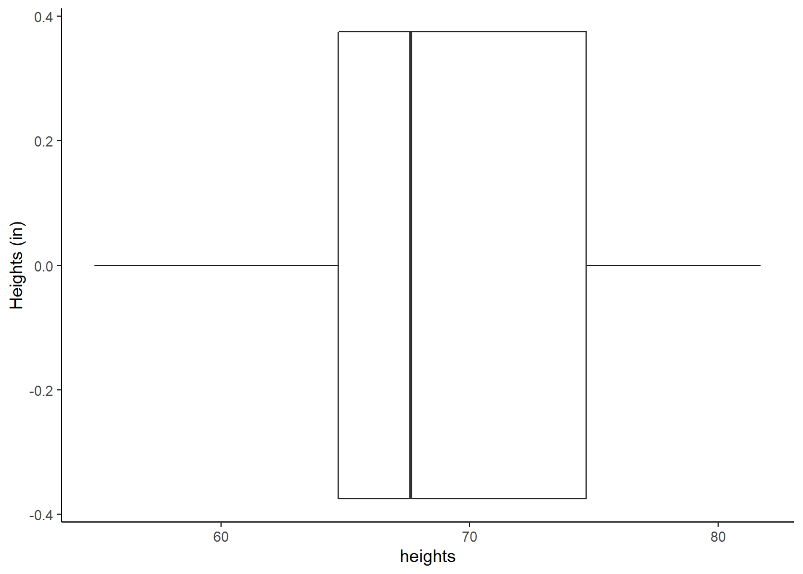
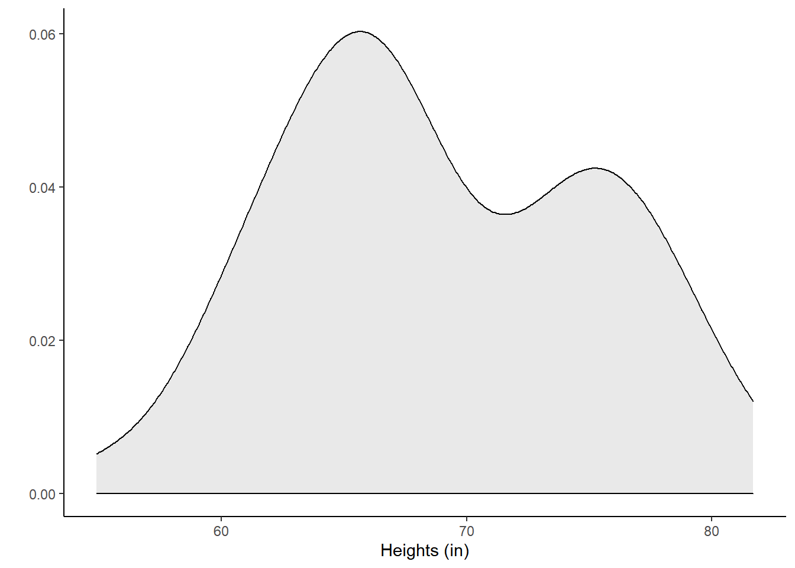
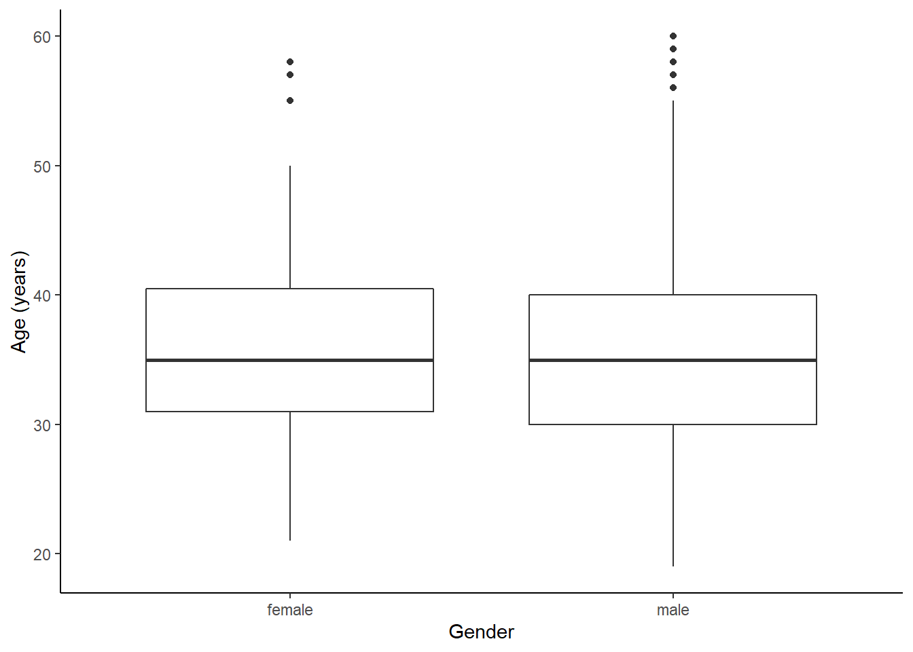
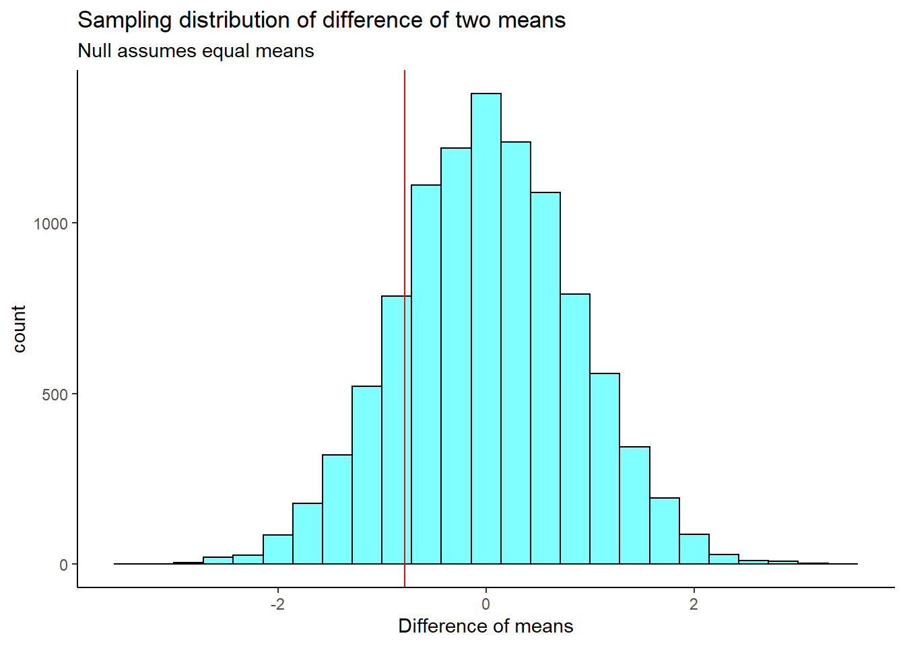

# Bootstrap {#BOOT}


## Objectives

1) Use the bootstrap to estimate the standard error, the standard deviation, of the sample statistic.  

2) Using bootstrap methods, obtain and interpret a confidence interval for an unknown parameter, based on a random sample.   

3) Describe the advantages, disadvantages, and assumptions behind using bootstrapping for confidence intervals.  


## Confidence intervals

In the last chapter, we introduced the concept of confidence intervals. As a reminder, confidence intervals are used to describe uncertainty around an estimate of a parameter. A confidence interval can be interpreted as a range of feasible values for an unknown parameter, given a representative sample of the population. 

Recall the four general steps of building a confidence interval: 

1) Identify the parameter you would like to estimate. 

2) Identify a good estimate for that parameter. 

3) Determine the distribution of your estimate or a function of your estimate.  

4) Use this distribution to obtain a range of feasible values (confidence interval) for the parameter.  

We previously used the central limit theorem to determine the distribution of our estimate. This lesson, we will build *bootstrap distribution*s of sample estimates.

## Bootstrapping  

#### STRESS THAT WE ARE ESTIMATING THE STANDARD ERROR, NOT GETTING A P-VALUE #### 

In many contexts, the sampling distribution of a sample statistic is either unknown or subject to assumptions. For example, suppose we wanted to obtain a 95% confidence interval on the *median* of a population. The central limit theorem does not apply to the median; we don't know its distribution. 

The theory required to quantify the uncertainty of the sample median is complex. In an ideal world, we would sample data from the population again and recompute the median with this new sample. Then we could do it again. And again. And so on until we get enough median estimates that we have a good sense of the precision of our original estimate. This is an ideal world where sampling data is free or extremely cheap. That is rarely the case, which poses a challenge to this "resample from the population" approach.

However, we can sample from the sample. *Bootstrapping* allows us to simulate the sampling distribution by **resampling** from the sample. Suppose $x_1,x_2,...,x_n$ is an i.i.d. random sample from the population. First we define the empirical distribution function of $X$ by assigning an equal probability to each $x_i$. Then, we sample from this empirical probability mass function. In practice, this simply means sampling from your original sample *with replacement*. Thus we are treating our sample as a discrete uniform random variable. 

The general procedure for bootstrapping is to sample with replacement from your original sample, calculate and record the sample statistic for that bootstrapped sample, then repeat the process many times. The collection of sample statistics comprises a *bootstrap distribution* of the sample statistic. Generally, this procedure works quite well, provided that the sample is representative of the population. Otherwise, any bias or misrepresentation is simply amplified throughout the bootstrap process. Further, for very small sample sizes, bootstrap distributions become "choppy" and hard to interpret. Thus in small sample cases, we must use permutation or mathematical methods to determine the sampling distribution.   

Once you have completed the procedure, the bootstrap distribution can be used to build a confidence interval for the population parameter or estimate the standard error. We are not using the bootstrap to find p-values. 

## Bootstrap example

To help us understand the bootstrap, let's use an example of a single mean. We would like to estimate the mean height of students at a local college. We collect a sample of size 50 (stored in vector `heights` below). 

> **Exercise**
Using both a traditional method, via the CLT or the t-distribution, and the bootstrap method, find 95% confidence intervals for $\mu$. Compare the two intervals. 


```r
heights<-c(62.0,73.8,59.8,66.9,75.6,63.3,64.0,63.1,65.0,67.2,73.0,
     62.3,60.8,65.7,60.8,65.8,63.3,54.9,67.8,65.1,74.8,75.0,
     77.8,73.7,74.3,68.4,77.5,77.9,66.5,65.5,71.7,75.9,81.7,
     76.5,77.8,75.0,64.6,59.4,60.7,69.2,78.2,65.7,69.6,80.0,
     67.6,73.0,65.3,67.6,66.2,69.6)
```

Let's look at the data; Figures \@ref(fig:box231-fig) and \@ref(fig:dens231-fig).


```r
gf_boxplot(~heights) %>%
  gf_theme(theme_classic()) %>%
  gf_labs(y="Heights (in)")
```

<div class="figure">

<p class="caption">(\#fig:box231-fig)Boxplot of heights of local college students.</p>
</div>


```r
gf_density(~heights,fill="lightgrey",color="black") %>%
  gf_theme(theme_classic()) %>%
  gf_labs(x="Heights (in)",y="")
```

<div class="figure">

<p class="caption">(\#fig:dens231-fig)Density plot of heights of local college students.</p>
</div>

It looks bimodal since there are probably both men and women in this sample and thus we have two different population distributions of heights.


```r
favstats(~heights)
```

```
##   min   Q1 median     Q3  max   mean       sd  n missing
##  54.9 64.7   67.6 74.675 81.7 68.938 6.345588 50       0
```

### Using traditional mathematical methods    

The data comes from less that 10\% of the population so we feel good about the assumption of independence. However, the data is bimodal and clearly does not come from a normal distribution. The sample size is larger, so this may help us. We will use the t-distribution and compare with the answer from the CLT then compare with the bootstrap.


```r
confint(t_test(~heights))
```

```
##   mean of x   lower   upper level
## 1    68.938 67.1346 70.7414  0.95
```

We can also calculate by hand.


```r
## Using t
xbar<-mean(heights)
sd<-sd(heights)
n<-length(heights)
tval<-qt(0.975,n-1)
xbar+c(-1,1)*tval*sd/sqrt(n)
```

```
## [1] 67.1346 70.7414
```

If we want to use the `tidyverse`, we must convert to a `dataframe`.


```r
heights <- tibble(height=heights)
```


```r
head(heights)
```

```
## # A tibble: 6 x 1
##   height
##    <dbl>
## 1   62  
## 2   73.8
## 3   59.8
## 4   66.9
## 5   75.6
## 6   63.3
```


```r
heights %>%
  summarize(mean=mean(height),stand_dev=sd(height),n=n(),
            ci=mean+c(-1,1)*qt(0.975,n-1)*stand_dev/sqrt(n))
```

```
## # A tibble: 2 x 4
##    mean stand_dev     n    ci
##   <dbl>     <dbl> <int> <dbl>
## 1  68.9      6.35    50  67.1
## 2  68.9      6.35    50  70.7
```

Using the CLT we have 


```r
heights %>%
  summarize(mean=mean(height),stand_dev=sd(height),n=n(),
            ci=mean+c(-1,1)*qnorm(0.975)*stand_dev/sqrt(n))
```

```
## # A tibble: 2 x 4
##    mean stand_dev     n    ci
##   <dbl>     <dbl> <int> <dbl>
## 1  68.9      6.35    50  67.2
## 2  68.9      6.35    50  70.7
```

This is not much different from the results using the $t$ distribution.  

### Bootstrap

The idea behind the bootstrap is that we will get an estimate of the distribution of the statistic of interest by sampling the original data with replacement. We must sample under the same regime as the original data was collected. In `R`, we will use the `resample()` function from the **mosaic** package. There are entire packages dedicated to resampling such as **boot** and this is a great deal of information about these types of packages online.

When applied to a dataframe, the `resample()` function samples rows with replacement to produce a new data
frame with the same number of rows as the original, but some rows will be duplicated and others missing.

To illustrate, let's use `resample()` on the first 10 positive integers.


```r
set.seed(305)
resample(1:10)
```

```
##  [1] 8 7 8 1 4 4 2 2 6 9
```

Notice that 8, 4 and 2 appeared at least twice. The number 3 did not appear. This is a single bootstrap replicate of the data.

We then calculate a point estimate on the bootstrap replicate. We repeat this process a large number of times, 1000 or maybe even 10000. The collection of the point estimates is called the bootstrap distribution. For the sample mean, ideally, the bootstrap distribution should be unimodal, roughly symmetric, and centered at the original estimate.

Here we go with our problem.


```r
set.seed(2115)
boot_results<-do(1000)*mean(~height,data=resample(heights))
```

The first few rows of the results are:


```r
head(boot_results)
```

```
##     mean
## 1 68.390
## 2 68.048
## 3 67.732
## 4 68.534
## 5 70.980
## 6 68.424
```

The `do()` function by default gives the column name to the last function used, in this case *mean*. This is an unfortunate name as it can cause us some confusion.

Figure \@ref(fig:boot231-fig) is a plot of the bootstrap sampling distribution. 


```r
boot_results %>%
  gf_histogram(~mean,fill="cyan",color="black") %>%
  gf_vline(xintercept = 68.938) %>%
  gf_theme(theme_classic) %>%
  gf_labs(x="Sample mean")
```

<div class="figure">

<p class="caption">(\#fig:boot231-fig)The sampling distribution approximated using a bootstrap distribution.</p>
</div>

And a summary of the bootstrap distribution:  


```r
favstats(~mean,data=boot_results)
```

```
##     min      Q1 median    Q3  max     mean        sd    n missing
##  65.684 68.3915 68.976 69.55 72.3 68.96724 0.9040555 1000       0
```

Now there are two ways we could go from here to calculate a confidence interval. The first is called the percentile method where we go into the bootstrap distribution and find the appropriate quantiles. The second is call the t interval with bootstrap error. In this second method you construct a confidence interval like you would using the CLT except you use the bootstrap estimate of standard error.

#### Bootstrap percentile

The function `cdata()` makes this easy for us.


```r
cdata(~mean,data=boot_results,p=0.95)
```

```
##        lower   upper central.p
## 2.5% 67.2197 70.7964      0.95
```
Or we can use the `qdata()`.


```r
qdata(~mean,data=boot_results,p=c(0.025,0.975))
```

```
##    2.5%   97.5% 
## 67.2197 70.7964
```


#### ADD TO NTIs (NOT BOOK?) - COULD STOP AFTER PERCENTILE BASED METHOD BUT THIS IS MORE ACCURATE, SEE HESTERBERG, ETC. FOR MORE DETAILS #### 

#### t interval with bootstrap standard error  

Since the bootstrap distribution looks like a $t$ distribution, we can use a $t$ interval with the bootstrap standard error. The standard deviation of the bootstrap distribution is the standard error of the sample mean. We will not have to divide by $\sqrt{n}$ since we are dealing with the distribution of the mean directly.


```r
xbar<-mean(boot_results$mean)
SE<-sd(boot_results$mean)
xbar+c(-1,1)*qt(.975,49)*SE
```

```
## [1] 67.15047 70.78401
```

You could of course use `tidyverse` but we must change the column name.


```r
boot_results %>%
  mutate(stat=mean) %>%
  summarise(mean=mean(stat),stand_dev=sd(stat),ci=mean+c(-1,1)*qt(0.975,49)*stand_dev)
```

```
##       mean stand_dev       ci
## 1 68.96724 0.9040555 67.15047
## 2 68.96724 0.9040555 70.78401
```

Of course there is a function to make this easier for us.


```r
confint(boot_results, method = c("percentile", "stderr"))
```

```
##   name    lower    upper level     method estimate margin.of.error df
## 1 mean 67.21970 70.79640  0.95 percentile   68.938              NA NA
## 2 mean 67.15047 70.78401  0.95     stderr   68.938        1.816768 49
```


The three intervals are very similar. 

## Non-standard sample statistics

One of the huge advantages of simulation-based methods is the ability to build confidence intervals for parameters whose estimates don't have known sampling distributions or the distributions are difficult to derive. 

### Example median

Consider the height data again, we would like to know the median student height and use a confidence interval for the estimate. However, we have no idea of the sampling distribution of the median. We can use bootstrapping to obtain an empirical distribution of the median.

>**Exercise**:  
Find a 90\% confidence interval for the median height of the students at a local college.


```r
set.seed(427)
boot_results<-do(10000)*median(~height,data=resample(heights))
```


```r
boot_results %>%
  gf_histogram(~median,fill="cyan",color="black") %>%
  gf_vline(xintercept = 67.6) %>%
  gf_theme(theme_classic) %>%
  gf_labs(x="Sample median")
```

<div class="figure">

<p class="caption">(\#fig:boot232-fig)The sampling distribution approximated using a bootstrap distribution.</p>
</div>

From Figure \@ref(fig:boot232-fig), the bootstrap sampling distribution is not symmetrical so we may not want to use the t interval approach. We will still calculate the confidence interval based on both approaches to compare the results. 


```r
cdata(~median,data=boot_results,p=0.90)
```

```
##    lower upper central.p
## 5%  65.8 70.65       0.9
```


```r
confint(boot_results, method = c("percentile", "stderr"),level=0.9)
```

```
##     name   lower   upper level     method estimate margin.of.error
## 1 median 65.8000 70.6500   0.9 percentile     67.6              NA
## 2 median 65.4648 70.1297   0.9     stderr     67.6        2.332455
```

There is a little difference between these two methods but not as large as we may have expected. 

### Summary bootstrap

The key idea behind the bootstrap is that we estimate the population with the sample, this is called the *plug in principle*, if something is unknown then substitute an estimate of it. We can then generate new samples from this population estimate. The bootstrap does not improve the accuracy of the original estimate, in fact the bootstrap distribution is centered on the original sample estimate. Instead we only get information about the variability of the sample estimate. Some people are suspicious that we are using the data over and over. But remember we are just getting estimates of variability. In traditional statistics, when we calculate the sample standard deviation, we are using sample mean. Thus we are using the data twice. Always think of the bootstrap as providing a way to find the variability in an estimate.

#### RENAME - PUTTING IT ALL TOGETHER or CULMINATING EXAMPLE #### 

## Confidence interval for difference in means

To bring all the ideas we have learned so far in this block we will work an example of testing for a difference of two means. In our opinion, the easiest method to understand is the permutation test and the most difficult is the one based on the mathematical derivation, because of the assumptions necessary to get a mathematical solution for the sampling distribution.  We will also introduce how to use the bootstrap to get a confidence interval.

### HELP example

Let’s return to the Health Evaluation and Linkage to Primary Care data set, `HELPrct` in the **mosaicData** package. Previously, we looked at whether there was a difference in `substance` of abuse between males and females.  

We are now interested in whether there is a difference between male and female ages.


```r
data("HELPrct")
```


```r
HELP_sub <- HELPrct %>%
  select(age,sex)
```


```r
favstats(age~sex,data=HELP_sub)
```

```
##      sex min Q1 median   Q3 max     mean       sd   n missing
## 1 female  21 31     35 40.5  58 36.25234 7.584858 107       0
## 2   male  19 30     35 40.0  60 35.46821 7.750110 346       0
```


```r
HELP_sub %>%
  gf_boxplot(age~sex) %>%
  gf_theme(theme_classic()) %>%
  gf_labs(x="Gender",y="Age (years)")
```

<div class="figure">

<p class="caption">(\#fig:box232-fig)The distribution of age in the HELP study by gender.</p>
</div>


```r
HELP_sub %>%
  gf_dhistogram(~age|sex,fill="cyan",color="black") %>%
  gf_theme(theme_classic()) %>%
  gf_labs(x="Age",y="")
```

<div class="figure">

<p class="caption">(\#fig:hist232-fig)The distribution of age in the HELP study by gender.</p>
</div>


Figures \@ref(fig:box232-fig) and \@ref(fig:hist232-fig) indicate there might be a slight difference in the means, but is it statistically significant?

### Permutation test

The permutation test is ideally suited for a hypothesis test. So we will conduct this first and then see if we can generate a confidence interval.

The hypotheses are: 

$H_0$: There is no difference in average age for men and women in the detoxification unit. In statistical notation: $\mu_{male} - \mu_{female} = 0$, where $\mu_{female}$ represents female inpatients and $\mu_{male}$ represents the male inpatients.  
$H_A$: There is some difference in average age for men and women in the detoxification unit ($\mu_{male} - \mu_{female} \neq 0$).

Let's perform a randomization, permutation, test.


```r
favstats(age~sex,data=HELP_sub)
```

```
##      sex min Q1 median   Q3 max     mean       sd   n missing
## 1 female  21 31     35 40.5  58 36.25234 7.584858 107       0
## 2   male  19 30     35 40.0  60 35.46821 7.750110 346       0
```


```r
obs_stat<-diffmean(age~sex,data=HELP_sub)
obs_stat
```

```
##   diffmean 
## -0.7841284
```


```r
set.seed(345)
results <- do(10000)*diffmean(age~shuffle(sex),data=HELP_sub)
```


```r
favstats(~diffmean,data=results)
```

```
##        min         Q1     median     Q3      max        mean        sd     n
##  -3.378154 -0.5638809 0.01120955 0.5863 3.486224 0.009350908 0.8492454 10000
##  missing
##        0
```

The sampling distribution is centered on the null value of 0, more or less, and the standard deviation is 0.849. This is an estimate of the variability of the difference in mean ages.


```r
results %>%
  gf_histogram(~diffmean,color="black",fill="cyan") %>%
  gf_vline(xintercept=obs_stat,color="red") %>%
  gf_theme(theme_classic()) %>%
  gf_labs(x="Difference of means",title="Sampling distribution of difference of two means",
  subtitle="Null assumes equal means")
```

<div class="figure">

<p class="caption">(\#fig:hist233-fig)The approximate sampling distribution of the difference of means from a bootstrap process.</p>
</div>

Our test statistic does not appear to be too extreme, Figure \@ref(fig:hist233-fig).


```r
2*prop1(~(diffmean <= obs_stat),data=results)
```

```
## prop_TRUE 
## 0.3523648
```

Based on this p-value, we would fail to reject the null hypothesis.

Now to construct a confidence interval we have to be careful and think about this. The object `results` has the distribution of difference in means assuming there is no difference. To get a confidence interval, we want to center this difference on the observed difference in means and not on zero.


```r
cdata(~(diffmean+obs_stat),data=results)
```

```
##          lower     upper central.p
## 2.5% -2.449246 0.8789368      0.95
```

We are 95% confident that the true difference in mean ages between female and male participants in the study is between -2.45 and 0.88. Since 0 in in the confidence interval, we would fail to reject the null hypothesis.

We are assuming that the test statistic can be transformed. It turns out that the percentile method is transformation invariant so we can do the transform of shifting the null distribution by the observed value.

### Traditional mathematical methods  

Using the CLT or the $t$ distribution becomes difficult because we have to find a way to calculate the standard error. There have been many proposed methods, you are welcome to research them, but we will only present a couple of ideas in this section. Let's summarize the process for both hypothesis testing and confidence intervals in the case of the difference of two means using the $t$ distribution.

### Hypothesis tests 

When applying the $t$ distribution for a hypothesis test, we proceed as follows:  

1. Write appropriate hypotheses.  

2. Verify conditions for using the $t$ distribution.   
    
    For a difference of means when the data are not paired: each sample mean must separately satisfy the one-sample conditions for the $t$ distribution, and the data in each group must also be independent. Just like in the one-sample case, slight skewness will not be a problem for larger sample sizes. We can have moderate skewness and be fine if our sample is 30 or more. We can have extreme skewness if our sample is 60 or more.  
    
3. Compute the point estimate of interest, the standard error, and the degrees of freedom.  

4. Compute the T score and p-value.   

5. Make a conclusion based on the p-value, and write a conclusion in context and in plain language so anyone can understand the result.  

We added the extra step of checking the assumptions.


### Confidence intervals  

Similarly, the following is how we generally computed a confidence interval using a $t$ distribution:  

1. Verify conditions for using the $t$ distribution. (See above.)   

2. Compute the point estimate of interest, the standard error, the degrees of freedom, and $t^{\star}_{df}$.  

3. Calculate the confidence interval using the general formula, point estimate $\pm\ t_{df}^{\star} SE$.   

4. Put the conclusions in context and in plain language so even non-statisticians can understand the results.  


If the assumptions above are met, each sample mean can itself be modeled using a $t$ distribution and if the samples are independent, then the sample difference of two means, $\bar{x}_1 - \bar{x}_2$, can be modeled using the $t$ distribution and the standard error
$$SE_{\bar{x}_{1} - \bar{x}_{2}} = \sqrt{\frac{s_1^2}{n_1} + \frac{s_2^2}{n_2}}$$

To calculate the degrees of freedom, use statistical software or conservatively use the smaller of $n_1 - 1$ and $n_2 - 1$.

#### Results  

Back to our study, the men and women were independent of each other. Additionally, the distributions in each population don't show any clear deviations from normality, some slight skewness but the sample size reduces this concern, Figure \@ref(fig:qq231-fig). Finally, within each group we also need independence. If they represent less that 10\% of the population, we are good to go on this. This condition might be difficult to verify.


```r
HELP_sub %>%
  gf_qq(~age|sex) %>%
  gf_qqline(~age|sex) %>%
  gf_theme(theme_bw())
```

<div class="figure">

<p class="caption">(\#fig:qq231-fig)The quantile-quantile plots to check normality assumption.</p>
</div>

The distribution of males tends to have longer tails than a normal and the female distribution is skewed to the right. The sample sizes are large enough that this does not worry us.


```r
favstats(age~sex,data=HELP_sub)
```

```
##      sex min Q1 median   Q3 max     mean       sd   n missing
## 1 female  21 31     35 40.5  58 36.25234 7.584858 107       0
## 2   male  19 30     35 40.0  60 35.46821 7.750110 346       0
```


Let's find the confidence interval first. 


```r
(35.47-36.25)+c(-1,1)*qt(.975,106)*sqrt(7.58^2/107+7.75^2/346)
```

```
## [1] -2.4512328  0.8912328
```

This result is very close to what we got with the permutation test.

Now let's find the p-value for the hypothesis test.

The test statistic is: 
$$T = \frac{\text{point estimate} - \text{null value}}{SE}$$ 

$$ = \frac{(35.47 - 36.25) - 0}{\sqrt{\left( \frac{7.58^2}{107}+ \frac{7.75^2}{346}\right)}} = - 0.92976 $$
We use the smaller of $n_1-1$ and $n_2-1$ as the degrees of freedom: $df=106$. 

The p-value is:


```r
2*pt(-0.92976,106)
```

```
## [1] 0.3546079
```

Of course, there is a function that does this for us.


```r
t_test(age~sex,data=HELP_sub)
```

```
## 
## 	Welch Two Sample t-test
## 
## data:  age by sex
## t = 0.92976, df = 179.74, p-value = 0.3537
## alternative hypothesis: true difference in means between group female and group male is not equal to 0
## 95 percent confidence interval:
##  -0.8800365  2.4482932
## sample estimates:
## mean in group female   mean in group male 
##             36.25234             35.46821
```

Notice that the degrees of freedom are not an integer, this is because it is a weighted average of the two different samples sizes and standard deviations. This method is called the Satterwaite approximation. 

#### Pooled standard deviation

Occasionally, two populations will have standard deviations that are so similar that they can be treated as identical. This is an assumption of equal variance in each group. For example, historical data or a well-understood biological mechanism may justify this strong assumption. In such cases, we can make the $t$ distribution approach slightly more precise by using a pooled standard deviation.

The **pooled standard deviation** of two groups is a way to use data from both samples to better estimate the standard deviation and standard error. If $s_1^{}$ and $s_2^{}$ are the standard deviations of groups 1 and 2 and there are good reasons to believe that the population standard deviations are equal, then we can obtain an improved estimate of the group variances by pooling their data:

$$ s_{pooled}^2 = \frac{s_1^2\times (n_1-1) + s_2^2\times (n_2-1)}{n_1 + n_2 - 2}$$

where $n_1$ and $n_2$ are the sample sizes, as before. To use this new statistic, we substitute $s_{pooled}^2$ in place of $s_1^2$ and $s_2^2$ in the standard error formula, and we use an updated formula for the degrees of freedom:
$$df = n_1 + n_2 - 2$$

The benefits of pooling the standard deviation are realized through obtaining a better estimate of the standard deviation for each group and using a larger degrees of freedom parameter for the $t$ distribution. Both of these changes may permit a more accurate model of the sampling distribution of $\bar{x}_1 - \bar{x}_2$.

> **Caution**  
Pooling standard deviations should be done only after careful research  

A pooled standard deviation is only appropriate when background research indicates the population standard deviations are nearly equal. When the sample size is large and the condition may be adequately checked with data, the benefits of pooling the standard deviations greatly diminishes.

In `R` we can before the difference of two means with equal variance using `var.equal`.


```r
t_test(age~sex,data=HELP_sub,var.equal=TRUE)
```

```
## 
## 	Two Sample t-test
## 
## data:  age by sex
## t = 0.91923, df = 451, p-value = 0.3585
## alternative hypothesis: true difference in means between group female and group male is not equal to 0
## 95 percent confidence interval:
##  -0.8922735  2.4605303
## sample estimates:
## mean in group female   mean in group male 
##             36.25234             35.46821
```

Since our sample sizes were so large, this did not have a big impact on the results. 

### Bootstrap  

Finally, we will construct a confidence interval through the use of the bootstrap distribution. In this problem we have to be careful and sample within each group. Compare the following two sets of samples. 


```r
favstats(age ~ sex, data = resample(HELP_sub))
```

```
##      sex min Q1 median    Q3 max     mean       sd   n missing
## 1 female  21 30     33 38.75  50 34.64706 6.267387 102       0
## 2   male  19 29     33 39.00  59 34.74359 7.833066 351       0
```
 
and
 

```r
favstats(age ~ sex, data = resample(HELP_sub,groups=sex))
```

```
##      sex min Q1 median   Q3 max     mean       sd   n missing
## 1 female  22 31     34 39.5  57 35.60748 6.901951 107       0
## 2   male  20 31     35 41.0  60 35.94798 8.039227 346       0
```
 
Notice in the second line of code, we are keeping the samples the same size within the `sex` variable.

Let's get our bootstrap distribution.


```r
set.seed(2527)
results <- do(1000) * diffmean(age ~ sex, data = resample(HELP_sub, groups = sex))
```

Figure \@ref(fig:boot235-fig) is our sampling distribution from the bootstrap.


```r
results %>%
  gf_histogram(~diffmean,fill="cyan",color="black") %>%
  gf_theme(theme_classic) %>%
  gf_labs(x="Difference in means",y="")
```

<div class="figure">

<p class="caption">(\#fig:boot235-fig)Sampling distribution of the difference in means.</p>
</div>


```r
cdata( ~ diffmean, p = 0.95, data = results)
```

```
##          lower     upper central.p
## 2.5% -2.394406 0.8563786      0.95
```

Again, similar results.


## Frequently asked questions

1. There are more types of bootstrap techniques, right?  

    Yes! There are many excellent bootstrap techniques. We have only chosen to present two bootstrap techniques that could be explained in a single lesson and that are also reasonably reliable. There are many adjustments that can be made to speed up and improve accuracy. Packages such as **resample** and **boot** are more appropriate for these situations.


2. I've heard the percentile bootstrap is very robust.  

    It is a **commonly** held belief that the percentile bootstrap is a robust bootstrap method. That is false. The percentile method is one of the least reliable bootstrap methods. However, it is easy to use and understand and can give a first attempt at a solution before more accurate methods are used.


3. I should use 1000 replicates in my bootstrap and permutation tests.  

    The  randomization and bootstrap distributions involve a random component from the sampling process and thus p-values and confidence intervals computed from the same data will vary. The amount of this **Monte Carlo** variability depends on the number of replicates used to create the randomization or bootstrap distribution. It is important that we not use too few as this will introduce too much random noise into p-value and confidence interval calculations. But each replicate costs time, and the marginal gain for each additional replicate decreases as the number of replicates increases. There is little reason to use millions of replicates (unless the goal is to estimate
very small p-values). We generally use roughly 1000 for routine or preliminary work and increase this to 10,000
when we want to reduce the effects of Monte Carlo variability.


## Homework Problems

1. Poker  
An aspiring poker player recorded her winnings and losses over 50 evenings of play, the data is in the `data` folder in the file `poker.csv`. The poker player would like to better understand the volatility in her long term play.

a. Load the data and plot a histogram.  

b. Find the summary statistics.  

c.  *Mean absolute deviation* or *MAD* is a more intuitive measure of spread than variance. It directly measures the average distance from the mean. It is found by the formula:

$$mad = \sum_{i=1}^{n}\frac{\left| x_{i} - \bar{x} \right|}{n}$$
    
    Write a function and find the *MAD* of the data.  
    
d. Find the bootstrap distribution of the *MAD* using 1000 replicates.  

e. Plot a histogram of the bootstrap distribution.  

f. Report a 95% confidence interval on the MAD.  

g. ADVANCED: Do you think sample MAD is an unbiased estimator of population MAD? Why or why not?   


2. Bootstrap hypothesis testing  

Bootstrap hypothesis testing is relatively undeveloped, and is generally not as accurate as permutation testing. Therefore in general avoid it. But for our problem in the reading above, it may work. We will sample in a way that is consistent with the null hypothesis, then calculate a p-value as a tail probability like we do in permutation tests. This example does not generalize well to other applications like relative risk, correlation, regression, or categorical data.

a. Using the `HELPrct` data, the null hypothesis requires the means of each group to be equal. Pick one group to adjust, either `male` or `female`. First zero the mean of the selected group by subtracting the sample mean of this group from data points only in this group. Then add the sample mean of the other group to each data point in the selected group. Store in a new object called `HELP_null`. set, store the observed value of the difference of means for male and female.  

b. The null hypothesis requires the means of each group to be equal. Pick one group to adjust, either `male` or `female`. First zero the mean of the selected group by subtracting the sample mean of this group from data points only in this group. Then add the sample mean of the other group to each data point in the selected group. Store in a new object called `HELP_null`.  

c. Run `favstats()` to check that the means are equal.  

d. On this new adjusted data set, generate a bootstrap distribution of the difference in sample means.  

e. Plot the bootstrap distribution and a line at the observed difference in sample means.  

f. Find a p-value.  

g. How does the p-value compare with those in the reading.  


3. Bootstrap hypothesis testing  

    Repeat the analysis of the MLB data from the reading but this time generate a bootstrap distribution of the $F$ statistic.  


3. Paired data  

Are textbooks actually cheaper online? Here we compare the price of textbooks at the University of California, Los Angeles (UCLA) bookstore and at Amazon.com. Seventy-three UCLA courses were randomly sampled in Spring 2010, representing less than 10\% of all UCLA courses. When a class had multiple books, only the most expensive text was considered.

The data is in the file `textbooks.csv` under the data folder.

Each textbook has two corresponding prices in the data set: one for the UCLA bookstore and one for Amazon. Therefore, each textbook price from the UCLA bookstore has a natural correspondence with a textbook price from Amazon. When two sets of observations have this special correspondence, they are said to be **paired**.

To analyze paired data, it is often useful to look at the difference in outcomes of each pair of observations. In  `textbooks`, we look at the difference in prices, which is represented as the `diff` variable. It is important that we always subtract using a consistent order; here Amazon prices are always subtracted from UCLA prices. 

a. Is this data tidy? Explain.  

b. Make a scatterplot of the UCLA price versus the Amazon price. Add a 45 degree line to the plot.  

c. Make a histogram of the differences in price.   

    The hypotheses are:  
$H_0$: $\mu_{diff}=0$. There is no difference in the average textbook price.  
$H_A$: $\mu_{diff} \neq 0$. There is a difference in average prices.
 
d. To use a $t$ distribution, the variable `diff` has to be independent and normally distributed. Since the 73 books represent less than 10\% of the population, the assumption that the random sample is independent is reasonable. Check normality using `qqnorsim()` from the **openintro** package. It generates 8 qq plots of simulated normal data that you can use to judge the `diff` variable.  

e. Run a $t$ test on the `diff` variable. Report the p-value and conclusion.  

f. Create a bootstrap distribution and generate a 95\% confidence interval on the mean of the differences, the `diff` column.  
