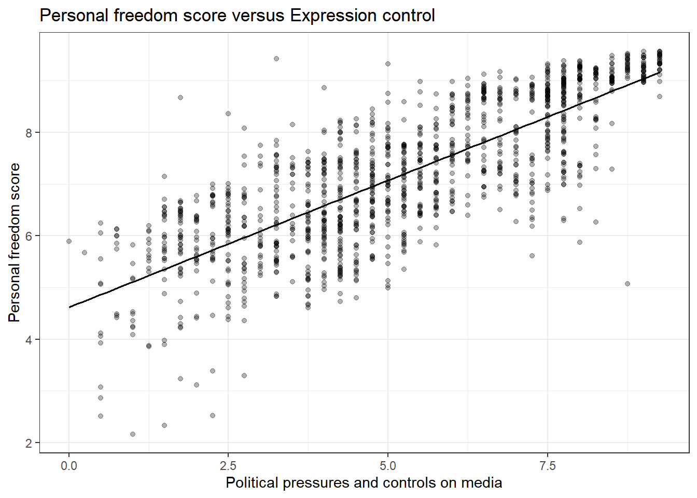
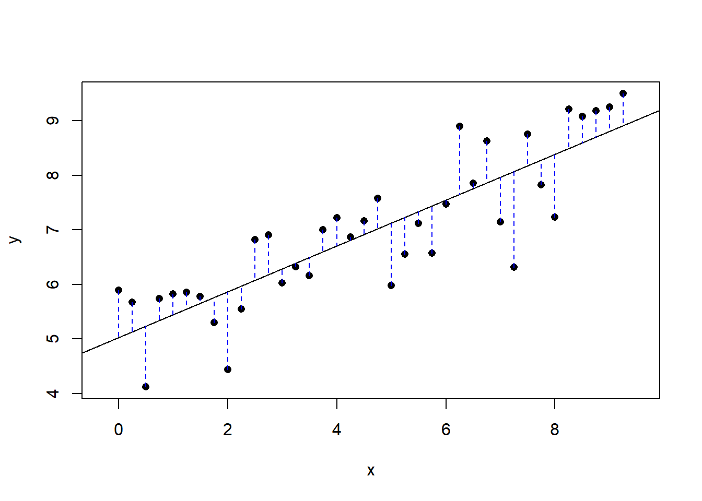
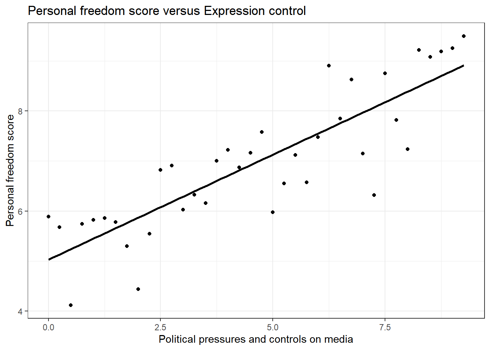
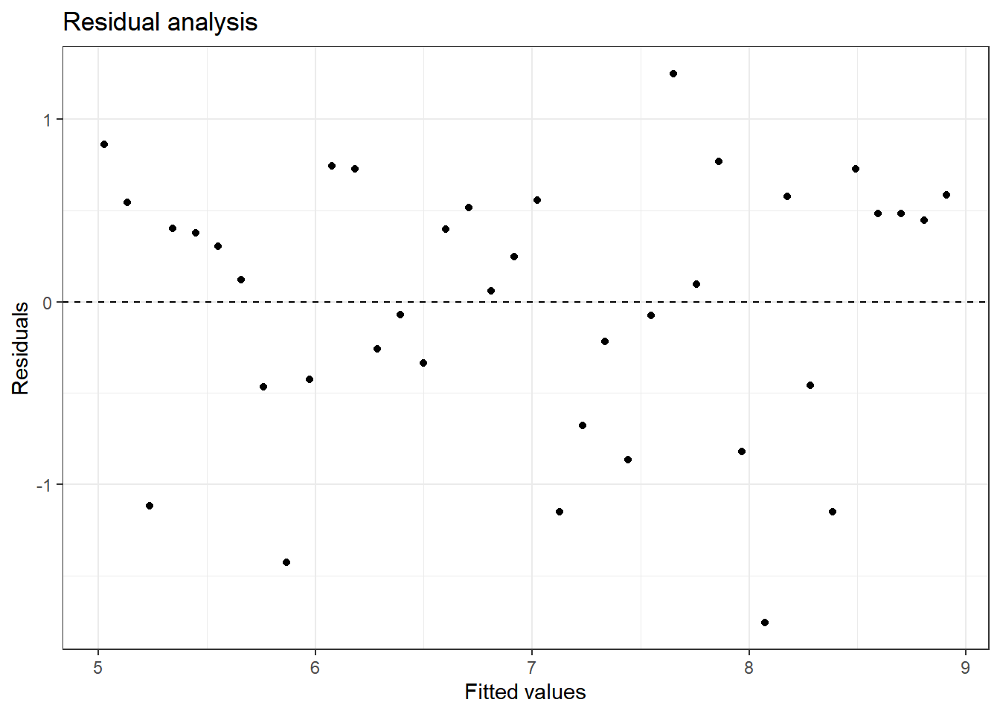
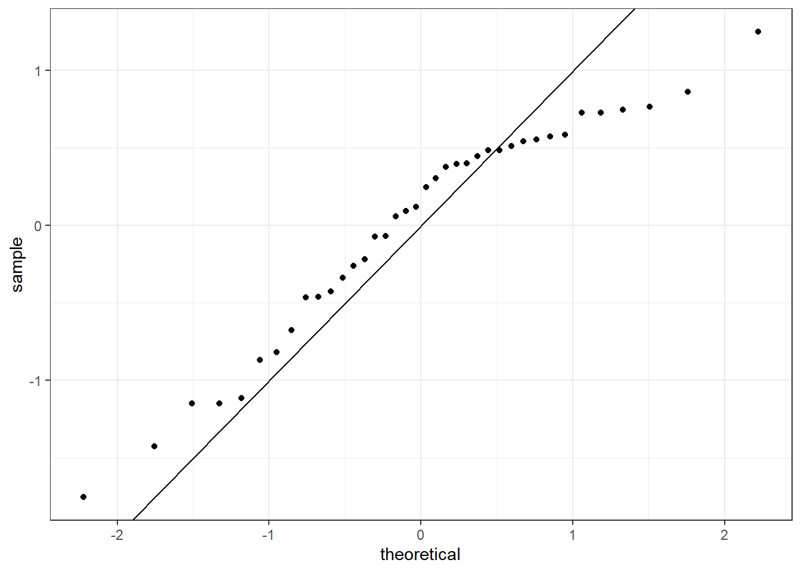

# (PART) Predictive Statistical Modeling {-} 

# Linear Regression Case Study {#CS4}

## Objectives

1) Using `R`, generate a linear regression model and use it to produce a prediction model.  
2) Using plots, check the assumptions of a linear regression model.  

## Introduction to linear regression  

Linear regression is often one of the first methods taught in a machine learning course. It is an excellent tool with a wide range of applications. It can be used solely to predict an outcome of interest, a prediction model, and/or be used for inference. In this book, we will mainly focus on its use for inference. Even so, this treatment barely scratches the surface of what can be done. There are entire courses devoted to the interpretation of linear regression models.

When used as a predictive model, linear regression fits into the category of a function approximation method. The parameters of the model, function, are fit using an objective, loss, function and optimization procedure. For linear regression in this book, the loss function will be sum of squared errors which leads to closed form solution using differentiation. In machine learning courses you will learn about different types of loss functions to include penalized or regularized versions as well as different optimization engines. For software such as `tidymodels` in `R` or `scitkit-learn` in `python`, you will specify the loss function and optimization engine directly.

## Case study introduction  

The Human Freedom Index is a report that attempts to summarize the idea of "freedom" through a bunch of different variables for many countries around the globe. It serves as a rough objective measure for the relationships between the different types of freedom - whether it's political, religious, economical or personal freedom - and other social and economic circumstances. The Human Freedom Index is an annually co-published report by the Cato Institute, the Fraser Institute, and the Liberales Institut at the Friedrich Naumann Foundation for Freedom.

In this case study, you'll be analyzing data from Human Freedom Index reports from 2008-2016. Your aim will be to summarize a few of the relationships within the data both graphically and numerically in order to find which variables can help tell a story about freedom. This will be done using the tool of regression.

Again, like our previous case studies, this chapter will introduce many of the ideas of the block. Don't worry if they seem difficult and you feel overwhelmed a bit, we will come back to the ideas in the following chapters.

### Load packages

Let's load the packages.


```r
library(tidyverse)
library(mosaic)
```

### The data and exploratory analysis

The data we're working with is in the file called `hfi.csv` under the `data` folder. The name `hfi` is 
short for Human Freedom Index. 

> **Exercise**  
Read the data into `R`. What are the dimensions of the dataset?


```r
hfi<-tibble(read_csv("data/hfi.csv"))
```


```r
dim(hfi)
```

```
## [1] 1458  123
```

There are 1458 observations and 123 variables in the data frame. 

>**Exercise**  
Create summaries of the first 10 variables in the data. We just don't want a large printout.


```r
inspect(hfi[,1:10])
```

```
## 
## categorical variables:  
##        name     class levels    n missing
## 1  ISO_code character    162 1458       0
## 2 countries character    162 1458       0
## 3    region character     10 1458       0
##                                    distribution
## 1 AGO (0.6%), ALB (0.6%), ARE (0.6%) ...       
## 2 Albania (0.6%), Algeria (0.6%) ...           
## 3 Sub-Saharan Africa (25.9%) ...               
## 
## quantitative variables:  
##                            name   class  min          Q1      median
## ...1                       year numeric 2008 2010.000000 2012.000000
## ...2          pf_rol_procedural numeric    0    4.133333    5.300000
## ...3               pf_rol_civil numeric    0    4.549550    5.300000
## ...4            pf_rol_criminal numeric    0    3.789724    4.575189
## ...5                     pf_rol numeric    0    4.131746    4.910797
## ...6             pf_ss_homicide numeric    0    6.386978    8.638278
## ...7 pf_ss_disappearances_disap numeric    0   10.000000   10.000000
##               Q3         max        mean       sd    n missing
## ...1 2014.000000 2016.000000 2012.000000 2.582875 1458       0
## ...2    7.389499    9.700000    5.589355 2.080957  880     578
## ...3    6.410975    8.773533    5.474770 1.428494  880     578
## ...4    6.400000    8.719848    5.044070 1.724886  880     578
## ...5    6.513178    8.723094    5.309641 1.529310 1378      80
## ...6    9.454402    9.926568    7.412980 2.832947 1378      80
## ...7   10.000000   10.000000    8.341855 3.225902 1369      89
```

>**Exercise**  
Create a scatter plot to display the relationship between the personal freedom score, `pf_score`, as the response and `pf_expression_control` as the predictor.  Does the relationship look linear? 


```r
gf_lm(pf_score~pf_expression_control,data=hfi,color="black") %>%
  gf_theme(theme_bw()) %>%
  gf_point(alpha=0.3) %>%
  gf_labs(title="Personal freedom score versus Expression control",
          x="Political pressures and controls on media",
          y="Personal freedom score")
```

<div class="figure">

<p class="caption">(\#fig:scat251-fig)A scatterplot of personal freedom versus expression control using the ggformula package.</p>
</div>

```r
ggplot(hfi,aes(x=pf_expression_control,y=pf_score))+
  geom_point(alpha=0.3) +
  theme_bw()+
  geom_lm(color="black")+
  labs(title="Personal freedom score versus Expression control",
          x="Political pressures and controls on media",
          y="Personal freedom score")
```

<div class="figure">

<p class="caption">(\#fig:scat252-fig)A scatterplot of personal freedom versus expression control using the ggplot2 package.</p>
</div>

Figures \@ref(fig:scat251-fig) and \@ref(fig:scat252-fig) are both scatterplots, we included both to demonstrate both the **ggformula** and **ggplot2** packages. In these figures, the relationship does look linear. Although, we should be uncomfortable using the model at the end points. That is because there are less points at the edge and and linear estimation has larger variance at the endpoints, the predictions at the endpoints is more suspect. 

> **Exercise**  
The relationship looks linear, quantify the strength of the
relationship with the correlation coefficient.


```r
hfi %>%
  summarise(cor(pf_expression_control, pf_score, use = "complete.obs"))
```

```
## # A tibble: 1 x 1
##   `cor(pf_expression_control, pf_score, use = "complete.obs")`
##                                                          <dbl>
## 1                                                        0.796
```

The sample correlation coefficient, indicates a strong positive linear relationship between the variables. 

Note that we set the `use` argument to "complete.obs" since there are some observations with missing values, `NA`.


## Sum of squared residuals

In this section, you will use an interactive function to investigate what we mean by "sum 
of squared residuals". You will need to run this function in your console. Running the function also requires that the `hfi` data set is loaded in your environment, which we did above.


Think back to the way that we described the distribution of a single variable. Recall that we discussed characteristics such as center, spread, and shape. It's also useful to be able to describe the relationship of two numerical variables, such as `pf_expression_control` and `pf_score` above.

> **Exercise**  
Looking at your scatterplot above, describe the relationship between these two variables. Make sure to discuss the form, direction, and strength of the relationship as well as any unusual observations.
    
We would say that there is a strong positive linear relationship between the two variables.

Just as you've used the mean and standard deviation to summarize a single variable, you can summarize the relationship between these two variables by finding the 
line that best follows their association. Use the following interactive function to select the line that you think does the best job of going through the cloud of points.

First we must remove missing values from the data set and to make the visualization easier, we will just randomly sample 30 of the data points. We included `hf_score` because we will need it later.


```r
set.seed(4011)
hfi_sub <- hfi %>%
  select(pf_expression_control,pf_score,hf_score) %>%
  drop_na() %>%
  group_by(pf_expression_control) %>%
  slice_sample(n=1)
```

We used the function `slice_sample()` to ensure we have unique values of `pf_expression_control` in our sample.

>**Exercise**  
In your `R` console, run the code above to create the object `hfi_sub`. You are going to have to load packages and read in the `hfi` data set. Then execute the next lines of code. Pick two locations in the plot to create a line. Record the sum of squares.

First, run this code chunk to create a function `plot_ss()` that you will use next.


```r
# Function to create plot and residuals.
plot_ss <- function (x, y, data, showSquares = FALSE, leastSquares = FALSE) 
{
    x <- eval(substitute(x), data)
    y <- eval(substitute(y), data)
    plot(y ~ x, asp = 1, pch = 16)
    if (leastSquares) {
        m1 <- lm(y ~ x)
        y.hat <- m1$fit
    }
    else {
        cat("Click two points to make a line.")
        pt1 <- locator(1)
        points(pt1$x, pt1$y, pch = 4)
        pt2 <- locator(1)
        points(pt2$x, pt2$y, pch = 4)
        pts <- data.frame(x = c(pt1$x, pt2$x), y = c(pt1$y, pt2$y))
        m1 <- lm(y ~ x, data = pts)
        y.hat <- predict(m1, newdata = data.frame(x))
    }
    r <- y - y.hat
    abline(m1)
    oSide <- x - r
    LLim <- par()$usr[1]
    RLim <- par()$usr[2]
    oSide[oSide < LLim | oSide > RLim] <- c(x + r)[oSide < LLim | 
        oSide > RLim]
    n <- length(y.hat)
    for (i in 1:n) {
        lines(rep(x[i], 2), c(y[i], y.hat[i]), lty = 2, col = "blue")
        if (showSquares) {
            lines(rep(oSide[i], 2), c(y[i], y.hat[i]), lty = 3, 
                col = "orange")
            lines(c(oSide[i], x[i]), rep(y.hat[i], 2), lty = 3, 
                col = "orange")
            lines(c(oSide[i], x[i]), rep(y[i], 2), lty = 3, col = "orange")
        }
    }
    SS <- round(sum(r^2), 3)
    cat("\r                                ")
    print(m1)
    cat("Sum of Squares: ", SS)
}
```

Next run the next code chunk that for us resulted in Figure \@ref(fig:plotss-expression-score). You will have to pick to points on the plot that you think gives the best line.  


```r
plot_ss(x = pf_expression_control, y = pf_score, data = hfi_sub)
```

<div class="figure">

<p class="caption">(\#fig:plotss-expression-score)Plot of selected line and the associated residuals.</p>
</div>

```
## Click two points to make a line.
                                
## Call:
## lm(formula = y ~ x, data = pts)
## 
## Coefficients:
## (Intercept)            x  
##      5.0272       0.4199  
## 
## Sum of Squares:  19.121
```

Once you've picked your two locations, the line you specified will be shown in black and the residuals in blue. Residuals are the difference between the observed values and the values predicted by the line:

\[
  e_i = y_i - \hat{y}_i
\]

The most common way to do linear regression is to select the line that minimizes the sum of squared residuals. To visualize the squared residuals, you can rerun 
the plot command and add the argument `showSquares = TRUE`.


```r
plot_ss(x = pf_expression_control, y = pf_score, data = hfi_sub, showSquares = TRUE)
```

Note that the output from the `plot_ss` function provides you with the slope and intercept of your line as well as the sum of squares.

>**Exercise**:  
 Using `plot_ss`, choose a line that does a good job of minimizing the sum of squares. Run the function several times. What was the smallest sum of squares that you got?

## The linear model

It is rather cumbersome to try to get the correct least squares line, i.e. the line that minimizes the sum of squared residuals, through trial and error. Instead, you can use the `lm()` function in `R` to fit the linear model (a.k.a. 
regression line).


```r
m1 <- lm(pf_score ~ pf_expression_control, data = hfi_sub)
```

The first argument in the function `lm` is a formula that takes the form `y ~ x`. Here it can be read that we want to make a linear model of `pf_score` as a function of `pf_expression_control`. The second argument specifies
that `R` should look in the `hfi_sub` data frame to find the two variables. This should be familiar to us since we have been doing this when we used the **mosaic** package.

The output of `lm` is an object that contains all of the information we need about the linear model that was just fit. We can access this information using the `summary()` function.


```r
summary(m1)
```

```
## 
## Call:
## lm(formula = pf_score ~ pf_expression_control, data = hfi_sub)
## 
## Residuals:
##     Min      1Q  Median      3Q     Max 
## -1.7559 -0.4512  0.1838  0.5369  1.2510 
## 
## Coefficients:
##                       Estimate Std. Error t value Pr(>|t|)    
## (Intercept)            5.02721    0.23186  21.682  < 2e-16 ***
## pf_expression_control  0.41988    0.04312   9.736 1.26e-11 ***
## ---
## Signif. codes:  0 '***' 0.001 '**' 0.01 '*' 0.05 '.' 0.1 ' ' 1
## 
## Residual standard error: 0.7288 on 36 degrees of freedom
## Multiple R-squared:  0.7248,	Adjusted R-squared:  0.7171 
## F-statistic:  94.8 on 1 and 36 DF,  p-value: 1.262e-11
```

Let's consider this output piece by piece. First, the formula used to describe the model is shown at the top. After the formula you find the five-number summary of the residuals. The "Coefficients" table shown next is key; its first 
column displays the linear model's y-intercept and the coefficient of `pf_expression_control`. With this table, we can write down the least squares regression line for the 
linear model:

$$
  \hat{\text{pf_score}} = 5.02721 + 0.41988 \times \text{pf_expression_control}
$$

At least these are the values we got on our machine using the *seed* provided. Yours may differ slightly. One last piece of information we will discuss from the summary output is the `Multiple R-squared`, or more simply, $R^2$. The $R^2$ value represents the proportion of variability in the response variable that is explained by the explanatory variable. For this model, 72.48% of the variability in `pf_score` is explained by `pr_expression_control`.

>**Exercise**:  
Fit a new model that uses `pf_expression_control` to predict `hf_score`, or the total human freedom score. Using the estimates from the `R` output, write the equation of the regression line. What does the slope tell us in the context of the relationship between human freedom and the amount of political pressure on media content?


```r
m2<-lm(hf_score ~ pf_expression_control, data = hfi_sub)
```


```r
summary(m2)
```

```
## 
## Call:
## lm(formula = hf_score ~ pf_expression_control, data = hfi_sub)
## 
## Residuals:
##     Min      1Q  Median      3Q     Max 
## -1.5151 -0.5776  0.2340  0.4622  1.0633 
## 
## Coefficients:
##                       Estimate Std. Error t value Pr(>|t|)    
## (Intercept)            5.45660    0.21585  25.279  < 2e-16 ***
## pf_expression_control  0.30707    0.04015   7.649 4.72e-09 ***
## ---
## Signif. codes:  0 '***' 0.001 '**' 0.01 '*' 0.05 '.' 0.1 ' ' 1
## 
## Residual standard error: 0.6785 on 36 degrees of freedom
## Multiple R-squared:  0.6191,	Adjusted R-squared:  0.6085 
## F-statistic:  58.5 on 1 and 36 DF,  p-value: 4.718e-09
```

$$
  \hat{\text{hf_score}} = 5.45660 + 0.30707 \times \text{pf_expression_control}
$$
As the political pressure increases by one unit, the **average** human freedom score increases by 0.307.

## Prediction and prediction errors

Let's create a scatterplot with the least squares line for `m1`, our first model, laid on top, Figure \@ref(fig:reg-with-line).


```r
ggplot(data = hfi_sub, aes(x = pf_expression_control, y = pf_score)) +
  geom_point() +
#  geom_lm(color="black") +
  stat_smooth(method = "lm", se = FALSE,color="black") +
  theme_bw()+
  labs(title="Personal freedom score versus Expression control",
          x="Political pressures and controls on media",
          y="Personal freedom score")
```

<div class="figure">

<p class="caption">(\#fig:reg-with-line)Scatterplot of personal expression control and personal freedom score.</p>
</div>

Here, we are literally adding a layer on top of our plot. The  `stat_smooth()` function creates the line by fitting a linear model, we could use `geom_lm()` as well. It can also show us the standard error `se`
associated with our line, but we'll suppress that for now.

This line can be used to predict $y$ at any value of $x$. When predictions are made for values of $x$ that are beyond the range of the observed data, it is referred to as *extrapolation* and is not usually recommended. However, 
predictions made within the range of the data are more reliable. They're also used to compute the residuals.

>**Exercise**:  
If someone saw the least squares regression line and not the actual data, how would they predict a country's personal freedom score for one with a 6.75 rating for `pf_expression_control`? Is this an overestimate or an underestimate, and by how much? In other words, what is the residual for this prediction?

To predict, we will use the predict function, but we have to send the new data as a data frame.


```r
predict(m1,newdata=data.frame(pf_expression_control=6.75))
```

```
##        1 
## 7.861402
```

We thus predict a value of 7.86 for the average `pf_score`.

The observed value is 8.628272.


```r
hfi_sub %>%
  filter(pf_expression_control==6.75)
```

```
## # A tibble: 1 x 3
## # Groups:   pf_expression_control [1]
##   pf_expression_control pf_score hf_score
##                   <dbl>    <dbl>    <dbl>
## 1                  6.75     8.63     8.25
```

The residual is:


```r
8.628272 - 7.861402
```

```
## [1] 0.76687
```

We underestimated the actual value.

Another way to do this is to use the **broom** package.


```r
library(broom)
```


```r
augment(m1) %>%
   filter(pf_expression_control==6.75)
```

```
## # A tibble: 1 x 8
##   pf_score pf_expression_control .fitted .resid   .hat .sigma .cooksd .std.resid
##      <dbl>                 <dbl>   <dbl>  <dbl>  <dbl>  <dbl>   <dbl>      <dbl>
## 1     8.63                  6.75    7.86  0.767 0.0421  0.727  0.0254       1.08
```

## Model diagnostics

To assess whether the linear model is reliable, we need to check for  

1. linearity,   
2. independence, 
3. nearly normal residuals, and  
4. constant variability.

**Linearity**: You already checked if the relationship between `pf_score` and `pf_expression_control` is linear using a scatterplot. We should also verify this condition with a plot of the residuals vs. fitted (predicted) values, Figure \@ref(fig:residuals).


```r
ggplot(data = m1, aes(x = .fitted, y = .resid)) +
  geom_point() +
  geom_hline(yintercept = 0, linetype = "dashed") +
  labs(x="Fitted values",y="Residuals",title="Residual analysis") +
  theme_bw()
```

<div class="figure">

<p class="caption">(\#fig:residuals)Scatterplot of residuals and fitted values used to assess the assumptions of linearity and constant variance.</p>
</div>

Notice here that `m1` can also serve as a data set because stored within it are the fitted values ($\hat{y}$) and the residuals. Also note that we're getting more sophisticated with the code in Figure \@ref(fig:residuals). After creating the scatterplot on the first layer (first line of code), we overlay a horizontal dashed line at $y = 0$ (to help us check whether residuals are distributed around 0), and we also rename the axis labels to be more informative and add a title.

>**Exercise**:  
Is there any apparent pattern in the residuals plot? What does this indicate about the linearity of the relationship between the two variables?  

The width is constant and there is no trend in the data. The linearity assumption is not bad.

**Independence**: This is difficult to check with residuals and depends on how the data was collected. 

**Nearly normal residuals**: To check this condition, we can look at a histogram, Figure \@ref(fig:hist-res).


```r
ggplot(data = m1, aes(x = .resid)) +
  geom_histogram(binwidth = .4,fill="cyan",color="black") +
  xlab("Residuals") +
  theme_bw()
```

<div class="figure">

<p class="caption">(\#fig:hist-res)Histogram of residuals from linear regression model.</p>
</div>

or a normal probability plot of the residuals, \@ref(fig:qq-res).


```r
ggplot(data = m1, aes(sample = .resid)) +
  stat_qq() +
  theme_bw() +
  geom_abline(slope=1,intercept = 0)
```

<div class="figure">

<p class="caption">(\#fig:qq-res)The quantile-quantile residual plot used to assess the normality assumption.</p>
</div>

Note that the syntax for making a normal probability plot is a bit different than what you're used to seeing: we set `sample` equal to the residuals instead of `x`, and we set a statistical method `qq`, which stands for "quantile-quantile",
another name commonly used for normal probability plots. 

It is a little difficult at first to understand how the `qq` plot indicated that the distribution was skewed to the left. The points indicate the quantile from the sample, standardized to have mean zero and standard deviation one, plotted against the same quantiles from a standard normal. It the sample matched a standard normal the points would align on the 45-degree line. From the plot, we see that as the theoretical quantile get larger, further from zero, the sample do not. That is why the trajectory of the points in the upper right looks flat, below the 45-degree line. Thus the distribution is compressed on the right making it skewed to the left. 

> **Exercise**: 
Based on the histogram and the normal probability plot, does the nearly normal residuals condition appear to be met?

No, the sample is small but it appears the residual are skewed to the left.

**Constant variability**:

> **Exercise**: 
Based on the residuals vs. fitted plot, does the constant variability condition appear to be met?

Yes, the width of the plot seems constant.

## Brief summary  

This case study introduced simple linear regression. We look at the criteria to find a best fit linear line between two variables. We also used `R` to fit the line. We examined the output from `R` and used it to explain and predict with our model. In the remainder of this block we will develop these ideas further and extend to multiple predictors and binary outcomes. This is a perfect introduction for Math 378.

## Homework Problems

1. HFI   

Choose another freedom variable and a variable you think would strongly correlate with it. The **openintro** package contains the data set `hfi`. Type `?openintro::hfi` in the Console window in `RStudio` to learn more about the variables. 
    
a. Produce a scatterplot of the two variables.  
b. Quantify the strength of the relationship with the correlation coefficient.  
c. Fit a linear model. At a glance, does there seem to be a linear relationship?  
d. How does this relationship compare to the relationship between `pf_expression_control` and `pf_score`? Use the $R^2$ values from the two model summaries to compare. Does your independent variable seem to predict your dependent one better? Why or why not?  
e. Display the model diagnostics for the regression model analyzing this relationship.  
f. Predict the response from your explanatory variable for a value between the median and third quartile. Is this an overestimate or an underestimate, and by how much? In other words, what is the residual for this prediction?  
