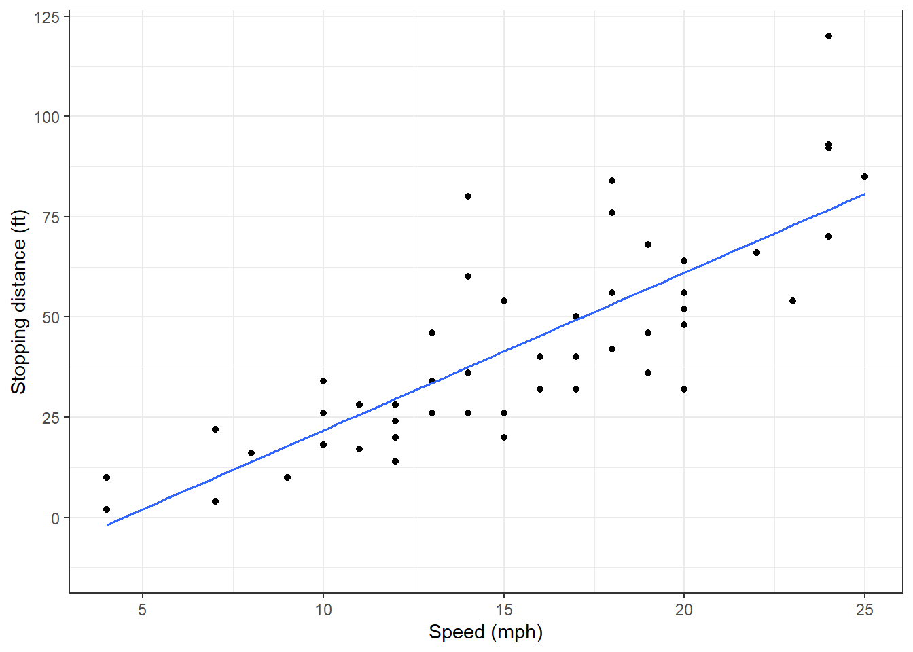

# Linear Regression Basics {#LRBASICS}

## Objectives

1) Obtain parameter estimates of a simple linear regression model, given a sample of data.   

2) Interpret the coefficients of a simple linear regression.  

3) Create a scatterplot with a regression line.  

4) Explain and check the assumptions of linear regression.   

5) Use and be able to explain all new terminology, to include: *response*, *predictor*, *linear regression*, *simple linear regression*, *coefficients*, *residual*, *extrapolation*.  


## Linear regression models

The rest of this block will serve as a brief introduction to linear models. In general, a model estimates the relationship between one variable (a **response**) and one or more other variables (**predictors**). Models typically serve two purposes: *prediction* and *inference*. A model allows us to predict the value of a response given particular values of predictors. Also, a model allows us to make inferences about the relationship between the response and the predictors. 

Not all models are used or built on the same principles. Some models are better for inference and others are better for prediction. Some models are better for qualitative responses and others are better for quantitative responses. Also, many models require making assumptions about the nature of the relationship between variables. If these assumptions are violated, the model loses usefulness. In a machine learning course, a wide array of models are discussed but most of which are used for the purpose of prediction. 

In this block, we will focus on *linear models* and the use of linear regression to produce and evaluate the model. Linear regression is a very powerful statistical technique. Many people have some familiarity with regression just from reading the news, where graphs with straight lines are overlaid on scatterplots, much like we did in the last chapter. Linear models can be used for prediction or to evaluate whether there is a linear relationship between two numerical variables.  

Suppose we were interested in exploring the relationship between one response variable ($Y$) and one predictor variable ($X$). We can postulate a linear relationship between the two:
$$
Y=\beta_0+\beta_1 X
$$

A linear model can be expanded to include multiple predictor variables:
$$
Y=\beta_0+\beta_1X_1+\beta_2X_2+...+\beta_pX_p
$$

This model is often referred to as a **linear regression** model. (When there is only one predictor variable, we often refer to it as a **simple linear regression** model.) The $\beta_j$ terms are referred to as **coefficients**. Note that the coefficients are **parameters** and thus represented as Greek letters. We typically don't know the true values of $\beta_j$, so we have to estimate them with samples from the population of $X$ and $Y$, our data. Estimating these parameters and using them for prediction and inference will be the majority of the work of this last block.  

We consider the models above to be linear models because they are linear in the **parameters**. This means that the following model is also a linear model:

$$
Y=\beta_0+\beta_1 X^2
$$

Technically, we can write the parameters as a vector and the explanatory variables as a matrix. The response will then be an inner product of this vector and matrix and thus a linear combination.

Even if we expect two random variables $X$ and $Y$ to share a linear relationship, we don't expect it to be perfect. There will be some scatter around the estimated line. For example, consider the head length and total length of 104 brushtail possums from Australia. The data is in the file `possum.csv` in the `data` folder. 

>**Exercise**:  
Read in the data from `data/possum.csv` and look at the first few rows of data.


```r
possum<-read_csv("data/possum.csv")
```


```r
glimpse(possum)
```

```
## Rows: 104
## Columns: 8
## $ site    <dbl> 1, 1, 1, 1, 1, 1, 1, 1, 1, 1, 1, 1, 1, 1, 1, 1, 1, 1, 1, 1, 1,~
## $ pop     <chr> "Vic", "Vic", "Vic", "Vic", "Vic", "Vic", "Vic", "Vic", "Vic",~
## $ sex     <chr> "m", "f", "f", "f", "f", "f", "m", "f", "f", "f", "f", "f", "m~
## $ age     <dbl> 8, 6, 6, 6, 2, 1, 2, 6, 9, 6, 9, 5, 5, 3, 5, 4, 1, 2, 5, 4, 3,~
## $ head_l  <dbl> 94.1, 92.5, 94.0, 93.2, 91.5, 93.1, 95.3, 94.8, 93.4, 91.8, 93~
## $ skull_w <dbl> 60.4, 57.6, 60.0, 57.1, 56.3, 54.8, 58.2, 57.6, 56.3, 58.0, 57~
## $ total_l <dbl> 89.0, 91.5, 95.5, 92.0, 85.5, 90.5, 89.5, 91.0, 91.5, 89.5, 89~
## $ tail_l  <dbl> 36.0, 36.5, 39.0, 38.0, 36.0, 35.5, 36.0, 37.0, 37.0, 37.5, 39~
```


```r
head(possum)
```

```
## # A tibble: 6 x 8
##    site pop   sex     age head_l skull_w total_l tail_l
##   <dbl> <chr> <chr> <dbl>  <dbl>   <dbl>   <dbl>  <dbl>
## 1     1 Vic   m         8   94.1    60.4    89     36  
## 2     1 Vic   f         6   92.5    57.6    91.5   36.5
## 3     1 Vic   f         6   94      60      95.5   39  
## 4     1 Vic   f         6   93.2    57.1    92     38  
## 5     1 Vic   f         2   91.5    56.3    85.5   36  
## 6     1 Vic   f         1   93.1    54.8    90.5   35.5
```


We think the head and total length variables are linearly associated. Possums with an above average total length also tend to have above average head lengths. To visualize this data, we will use a scatterplot. We have used scatterplots multiple times in this book. Scatterplots are a graphical technique to present two numerical variables simultaneously. Such plots permit the relationship between the variables to be examined with ease. The following figure shows a scatterplot for the head length and total length of the possums. Each point represents a single possum from the data. 


>**Exercise**:  
Create a scatterplot of head length and total length.


```r
possum %>%
  gf_point(head_l~total_l) %>%
  gf_labs(x="Total Length (cm)",y="Head Length (mm)") %>%
  gf_theme(theme_classic())
```

<div class="figure">

<p class="caption">(\#fig:scat261-fig)A scatterplot of possum total length and head length.</p>
</div>

From Figure \@ref(fig:scat261-fig), we see that the relationship is not perfectly linear; however, it could be helpful to partially explain the connection between these variables with a straight line. Since some longer possums will have shorter heads and some shorter possums will have longer heads, there is no straight line that can go through all the data points. We expect some deviation from the linear fit. This deviation is represented by random variable $e$ (this is not the Euler number), which we refer to as an error term or residual:

$$
Y=\beta_0+\beta_1X+e
$$

For our problem, $Y$ is head length and $X$ is total length.

In general we have:

$$ \text{Data} = \text{Fit} + \text{Residual} $$ 

and what will change in our modeling process is how we specify the $\text{Fit}$.

The error term is assumed to follow a normal distribution with mean 0 and constant standard deviation $\sigma$. Note: the assumption of normality is only for inference using the $t$ and $F$ distributions and we can relax this assumption by using a bootstrap. Among other things, these assumptions imply that a linear model should only be used when the response variable is continuous in nature. There are other approaches for non-continuous response variables (for example logistic regression).

### Estimation

We want to describe the relationship between the head length and total length variables in the possum data set using a line. In this example, we will use the total length as the predictor variable, $x$, to predict a possum's head length, $y$. Just as a side note, the choice of the predictor and response are not arbitrary. The response is typically what we want to predict or in the case of experiments is the causal  result of the predictor(s). 

In the possum data we have $n = 104$ observations: $(x_1,y_1), (x_2,y_2),...,(x_{104},y_{104})$. Then for each observation the implied linear model is:  

$$
y_i=\beta_0+\beta x_i + e_i
$$

We could fit the linear relationship by eye like we did in the case study and obtain estimates of the slope and intercept but this is too ad hoc.^[If you want to do try this again use the `plot_ss()` from the last chapter.]  So, given a set of data like the `possum`, how do we actually obtain estimates of $\beta_0$ and $\beta_1$? What is the **best** fit line?  

We begin by thinking about what we mean by ``best''. Mathematically, we want a line that has small residuals. There are multiple methods, but the most common is the *method of least squares*. In this method, our goal is to find the values of $\beta_0$ and $\beta_1$ that minimize the squared vertical distance between the points and the resulting line, the **residuals**. See \@ref(fig:resid1-fig) for a visual representation involving only four observations from *made up* data. 

<div class="figure">

<p class="caption">(\#fig:resid1-fig)An illustration of the least squares method.</p>
</div>

Our criterion for best is the estimates of slope and intercept that minimize the sum of the squared residuals:

$$e_{1}^2 + e_{2}^2 + \dots + e_{n}^2$$ 

The following are three possible reasons to choose the least squares criterion over other criteria such as the sum of the absolute value of residuals:  

i. It is the most commonly used method.  
ii. Computing a line based on least squares was much easier by hand when computers were not available.  
iii. In many applications, a residual twice as large as another residual is more than twice as bad. For example, being off by 4 is usually more than twice as bad as being off by 2. Squaring the residuals accounts for this discrepancy.  

The first two reasons are largely for tradition and convenience; the last reason explains why least squares is typically helpful.^[There are applications where least absolute deviation may be more useful, and there are plenty of other criteria we might consider. However, this book only applies the least squares criterion. Math 378: Applied Statistical Learning (the follow-on course at USAFA) will look at other criteria such as a shrinkage method called the lasso.]

So, we need to find $\beta_0$ and $\beta_1$ that minimize the expression, observed minus expected:
$$
\sum_{i=1}^n (y_i-\beta_0-\beta_1 x_i)^2
$$

Using calculus-based optimization yields the following estimates of $\beta_0$ and $\beta_1$:

$$
\hat{\beta}_0=\bar{y}-\hat{\beta}_1\bar{x}
$$

Notice that this implies that the line will always go through the point $\left(\bar{x},\bar{y} \right)$. As a reminder $\bar{x}$ is the sample mean of the explanatory variable and $\bar{y}$ is the sample mean of the response.  

And 

$$
\hat{\beta}_1 = {\sum x_i y_i - n\bar{x}\bar{y} \over{\sum x_i^2 -n\bar{x}^2}}
$$

A more intuitive formula for the slope and one that links **correlation** to linear regression is:

$$
\hat{\beta}_1 = \frac{s_y}{s_x} R
$$

where $R$ is the correlation between the two variables, and $s_x$ and $s_y$ are the sample standard deviations of the explanatory variable and response, respectively. Thus the slope is proportional to the correlation.


You may also be interested in estimating $\sigma$, the standard deviation of the error:
$$
\hat{\sigma}=\sqrt{{1\over{n-2}} \sum_{i=1}^n \hat{e}_i^2}
$$

where $\hat{e}_i$ is the observed $i$th **residual** ($\hat{e}_i=y_i-\hat{\beta}_0-\hat{\beta}_1x_i$). This estimate is based only on the assumption of constant variance.

### Possum example  

We will let `R` do the heavy work of minimizing the sum of squares. The function is `lm()` as we learned in the case study. This function needs a formula and data for input. The formula notation should be easy for us since we have worked with formulas so much in the **mosaic** package. 

First create the model:


```r
poss_mod <- lm(head_l~total_l,data=possum)
```

The output of the model object is minimal with just the estimated slope and intercept.


```r
poss_mod
```

```
## 
## Call:
## lm(formula = head_l ~ total_l, data = possum)
## 
## Coefficients:
## (Intercept)      total_l  
##     42.7098       0.5729
```

We can get more information using the `summary()` function:


```r
summary(poss_mod)
```

```
## 
## Call:
## lm(formula = head_l ~ total_l, data = possum)
## 
## Residuals:
##     Min      1Q  Median      3Q     Max 
## -7.1877 -1.5340 -0.3345  1.2788  7.3968 
## 
## Coefficients:
##             Estimate Std. Error t value Pr(>|t|)    
## (Intercept) 42.70979    5.17281   8.257 5.66e-13 ***
## total_l      0.57290    0.05933   9.657 4.68e-16 ***
## ---
## Signif. codes:  0 '***' 0.001 '**' 0.01 '*' 0.05 '.' 0.1 ' ' 1
## 
## Residual standard error: 2.595 on 102 degrees of freedom
## Multiple R-squared:  0.4776,	Adjusted R-squared:  0.4725 
## F-statistic: 93.26 on 1 and 102 DF,  p-value: 4.681e-16
```


The model object, `poss_mod`, contains much more information. Using the function `names()` function on the model objects, gives you a list of other quantities available, such as residuals.


```r
names(poss_mod)
```

```
##  [1] "coefficients"  "residuals"     "effects"       "rank"         
##  [5] "fitted.values" "assign"        "qr"            "df.residual"  
##  [9] "xlevels"       "call"          "terms"         "model"
```


Figure \@ref(fig:scat262-fig) is a plot the data points and least squares line together.


```r
possum %>%
  gf_point( head_l ~ total_l) %>%
  gf_lm(color="black") %>%
  gf_labs(x="Total Length (cm)",y="Head Length (mm)") %>%
  gf_labs(title="Possum data including regression line") %>%
  gf_theme(theme_classic()) 
```

<div class="figure">

<p class="caption">(\#fig:scat262-fig)A scatterplot of possum total length and head length including a regression line.</p>
</div>


### Interpretation

Interpreting parameters in a regression model is often one of the most important steps in the analysis. The intercept term, $\beta_0$, is usually uninteresting. It represents the **average** value of the response when the predictor is 0. Unless we center our predictor variable around 0, the actual value of the intercept is usually not important; it typically just gives the slope more flexibility to fit the data. The slope term, $\beta_1$ represents the **average** increase in the response variable per unit increase in the predictor variable. We keep using the word **average** in our discussion. With the assumption of a mean of 0 for the residuals, which least squares ensures with a line going through the point $\left(\bar{x},\bar{y} \right)$, the output of the model is the expected or average response for the given input. Mathematically we have:

$$
E(Y|X=x)=E(\beta_0+\beta_1x+e) = E(\beta_0+\beta_1x)+E(e)=\beta_0+\beta_1x
$$

Predicting a value of the response variable simply becomes a matter of substituting the value of the predictor variable into the estimated regression equation. Again, it is important to note that for a given value of $x$, the predicted response, $\hat{y}$ is what we expect the average value of $y$ to be given that specific value of the predictor. 

> **Exercise**: The slope and intercept estimates for the possum data are 0.5729 and 42.7098. What do these numbers really mean, interpret them?

Interpreting the slope parameter is helpful in almost any application. For each additional 1 cm of total length of a possum, we would expect the possum's head to be 0.5729 mm longer on average. Note that a longer total length corresponds to longer head because the slope coefficient is positive. We must be cautious in this interpretation: while there is a real association, we cannot interpret a causal connection between the variables because these data are observational. That is, increasing a possum's total length may not cause the possum's head to be longer. 

The estimated intercept $b_0=42.7$ describes the average head length of a possum with zero total length! The meaning of the intercept is irrelevant to this application since a possum can not practically have a total length of 0.

Earlier we noted a relationship between the slope estimate and the correlation coefficient estimate. 

>**Exercise** 
Find the slope from the correlation and standard deviations.


```r
possum %>%
  summarise(correlation=cor(head_l,total_l),sd_head=sd(head_l),
            sd_total=sd(total_l),slope=correlation*sd_head/sd_total)
```

```
## # A tibble: 1 x 4
##   correlation sd_head sd_total slope
##         <dbl>   <dbl>    <dbl> <dbl>
## 1       0.691    3.57     4.31 0.573
```


### Extrapolation is dangerous

> "When those blizzards hit the East Coast this winter, it proved to my satisfaction that global warming was a fraud. That snow was freezing cold. But in an alarming trend, temperatures this spring have risen. Consider this: On February $6^{th}$ it was 10 degrees. Today it hit almost 80. At this rate, by August it will be 220 degrees. So clearly folks the climate debate rages on."
*Stephen Colbert*
April 6th, 2010^[http://www.colbertnation.com/the-colbert-report-videos/269929/]

Linear models can be used to approximate the relationship between two variables and are built on an observed random sample.  These models have real limitations as linear regression is simply a modeling framework. The truth is almost always much more complex than our simple line. *Extrapolation* occurs when one tries to make a prediction of a response given a value of the predictor that is outside the range of values used to build the model. We only have information about the relationship between two variables in the region around our observed data. We do not know how the data outside of our limited window will behave. Be careful about extrapolating. 

### Reading computer output  

We stored the results of our linear regression model for the possum data in the object `poss_mod` but it provided only the bare minimum of information. We can get more information using the function `summary()`.


```r
summary(poss_mod)
```

```
## 
## Call:
## lm(formula = head_l ~ total_l, data = possum)
## 
## Residuals:
##     Min      1Q  Median      3Q     Max 
## -7.1877 -1.5340 -0.3345  1.2788  7.3968 
## 
## Coefficients:
##             Estimate Std. Error t value Pr(>|t|)    
## (Intercept) 42.70979    5.17281   8.257 5.66e-13 ***
## total_l      0.57290    0.05933   9.657 4.68e-16 ***
## ---
## Signif. codes:  0 '***' 0.001 '**' 0.01 '*' 0.05 '.' 0.1 ' ' 1
## 
## Residual standard error: 2.595 on 102 degrees of freedom
## Multiple R-squared:  0.4776,	Adjusted R-squared:  0.4725 
## F-statistic: 93.26 on 1 and 102 DF,  p-value: 4.681e-16
```

The first line repeats the model formula. The second line is a descriptive summary of the residuals, plots of the residuals are more useful than this summary. We then have a table of the model fit. The first column of numbers provides estimates for $\beta_0$ and $\beta_1$, respectively. For the next columns, we'll describe the meaning of the columns using the second row, which corresponds to information about the slope estimate. Again, the first column provides the point estimate for $\beta_1$. The second column is a standard error for this point estimate. The third column is a $t$ test statistic for the null hypothesis that $\beta_1 = 0$: $T=9.657$. The last column is the $p$-value for the $t$ test statistic for the null hypothesis $\beta_1=0$ and a two-sided alternative hypothesis. We will get into more of these details in the next chapters.   

The row with the residual standard error is an estimate of the unexplained variance. The next rows give a summary of the model fit and we will discuss in the next chapters.  

In the `tidyverse` we may want to have the table above in a `tibble`. The **broom** package, which we have seen before, helps with this effort.


```r
library(broom)
```


```r
tidy(poss_mod)
```

```
## # A tibble: 2 x 5
##   term        estimate std.error statistic  p.value
##   <chr>          <dbl>     <dbl>     <dbl>    <dbl>
## 1 (Intercept)   42.7      5.17        8.26 5.66e-13
## 2 total_l        0.573    0.0593      9.66 4.68e-16
```


> **Exercise**:  
The `cars` dataset (built-in to `R`) contains 50 observations of 2 variables. The data give the speed of cars (in mph) and the corresponding distance (in feet) that it took to stop. Attempt to answer the following questions. 

a) Build a simple linear regression model fitting distance against speed. 


```r
cars_mod <- lm(dist~speed,data=cars)
summary(cars_mod)
```

```
## 
## Call:
## lm(formula = dist ~ speed, data = cars)
## 
## Residuals:
##     Min      1Q  Median      3Q     Max 
## -29.069  -9.525  -2.272   9.215  43.201 
## 
## Coefficients:
##             Estimate Std. Error t value Pr(>|t|)    
## (Intercept) -17.5791     6.7584  -2.601   0.0123 *  
## speed         3.9324     0.4155   9.464 1.49e-12 ***
## ---
## Signif. codes:  0 '***' 0.001 '**' 0.01 '*' 0.05 '.' 0.1 ' ' 1
## 
## Residual standard error: 15.38 on 48 degrees of freedom
## Multiple R-squared:  0.6511,	Adjusted R-squared:  0.6438 
## F-statistic: 89.57 on 1 and 48 DF,  p-value: 1.49e-12
```

Figure \@ref(fig:scat263-fig) is a scatterplot of the `cars` data set.  


```r
cars %>%
  gf_point(dist~speed) %>%
  gf_lm() %>%
  gf_labs(x="Speed (mph)",y="Stopping distance (ft)") %>%
  gf_theme(theme_bw())
```

<div class="figure">

<p class="caption">(\#fig:scat263-fig)A scatterplot of speed and stopping distance.</p>
</div>

As expected, it appears that for larger speeds, stopping distance is greater. 

b) Report and interpret the estimated model coefficients. 

The estimated intercept term, $\hat{\beta}_0$ is equal to -17.6. This estimate doesn't have a helpful interpretation. Technically, it is the estimated average stopping distance for speed 0. However, "stopping distance" doesn't make sense when a car has no speed. Also, a negative stopping distance doesn't make sense. Furthermore, a speed of 0 is outside of the observed speeds in the data set, so even if a speed of 0 made sense, it is outside the scope of this data and thus an extrapolation. 

The estimated slope term, $\hat{\beta}_1$ is equal to 3.9. This means that for an increase of one mph, we expect stopping distance to increase by 3.9 feet, on average. 

c) Report the estimated common standard deviation of the residuals. 

The estimated standard deviation of the error (residual), $\hat{\sigma}$ is equal to 15.4. 

### Assumptions

Anytime we build a model, there are assumptions behind it that, if violated, could invalidate the conclusions of the model. In the description of simple linear regression, we briefly mentioned these assumptions. Next chapter, we will discuss how to validate these assumptions. 

**Fit**. When we build a simple linear regression, we assume that the relationship between the response and the predictor is as we specify in the fit formula. This in simple linear regression is often just a linear relationship. Suppose two variables are non-linearly related, see \@ref(fig:resid2-fig). While we could build a linear regression model between the two, the resulting model would not be very useful. If we built a model with the fit formulated as a quadratic, a similar plot of the residuals would look flat. We will discuss this more in a later chapter. 

<div class="figure">

<p class="caption">(\#fig:resid2-fig)An example of non-linear relationship between two variables fitted with a linear regression line.</p>
</div>

**Independent Observations**. Another assumption is that all observations in a data set are independent of one another. A common way this assumption is violated is by using time as the predictor variable. For example, suppose we were interested in how an individual's weight changes over time. While it may be tempting to plot this and fit a regression line through the data, the resulting model is inappropriate, as simple linear regression assumes that each observation is independent. Figure \@ref(fig:resid3-fig) shows correlated data fitted with a linear regression line.

<div class="figure">

<p class="caption">(\#fig:resid3-fig)A scatterplot of correlated data fit using a linear regression model with the assumption of independence.</p>
</div>

**Constant Error Variance**. In simple linear regression, we assume that the residuals come from a normal distribution with mean 0 and constant standard deviation $\sigma$. Violation of this assumption is usually manifested as a "megaphone" pattern in the scatterplot. Specifically, as the value of the predictor increases, the variance in the response also increases, resulting in greater spread for larger values of the predictor.  

**Normality of Errors**. Again, we assume that the residuals are normally distributed. Normality of residuals is not easy to see graphically, so we have to use other diagnostics to check this assumption. 

The last three assumptions are important not necessarily for estimating the relationship, but for *inferring* about the relationship. In future chapters, we will discuss how to use a model for prediction, and how to build a confidence/prediction interval around a prediction. Also, we will discuss inference about the coefficient estimates in a model. Violation of one of the last three assumptions will impact our ability to conduct inference about the population parameters. 

### Residual plots 

One purpose of residual plots is to identify characteristics or patterns still apparent in data after fitting a model. These can help to evaluate the assumptions. 

Figure \@ref(fig:resid4-fig) shows three scatterplots with linear models in the first row and residual plots in the second row. 

<div class="figure">

<p class="caption">(\#fig:resid4-fig)Residual plots and associated scatterplots.</p>
</div>

In the first data set (first column), the residuals show no obvious patterns. The residuals appear to be scattered randomly around the dashed line that represents 0.

The second data set shows a pattern in the residuals. There is some curvature in the scatterplot, which is more obvious in the residual plot. We should not use a straight line to model these data. Instead, a more advanced technique should be used.

In the last plot the spread, variance of the data, seems to increase as the explanatory variable increases. We can see this clearly in the residual plot. To make inference using the $t$ or $F$ distribution would require a transformation to equalize the variance.

### Summary  

We have introduced the ideas of linear regression in this chapter. There are many new terms as well as new `R` functions to learn. We will continue to use these ideas in the remainder of this block of material. Next we will learn about inference and prediction.

## Homework Problems

1. Nutrition at Starbucks  

In the `data` folder is a file named `starbucks.csv`. Use it to answer the questions below.

a. Create a scatterplot of number of calories and amount of carbohydrates.  
b. Describe the relationship in the graph.  
c. In this scenario, what are the explanatory and response variables?  
d. Why might we want to fit a regression line to these data?  
e. Create a scatterplot of number of calories and amount of carbohydrates with the regression line included.  
f. Using 'lm()` fit a least squares line to the data.  
g. Report and interpret the slope coefficient.    
h. For a menu item with 51 g of carbs, what is the estimated calorie count?  
i. Could we use the model for a menu item with 100 g of carbs?  
j. Does the assumption of constant variance seem reasonable for this problem?  
k. Verify that the line passes through the mean carb and mean calories, do this mathematically.  
l. What is the estimate of the standard deviation of the residuals? How could you use this information?

