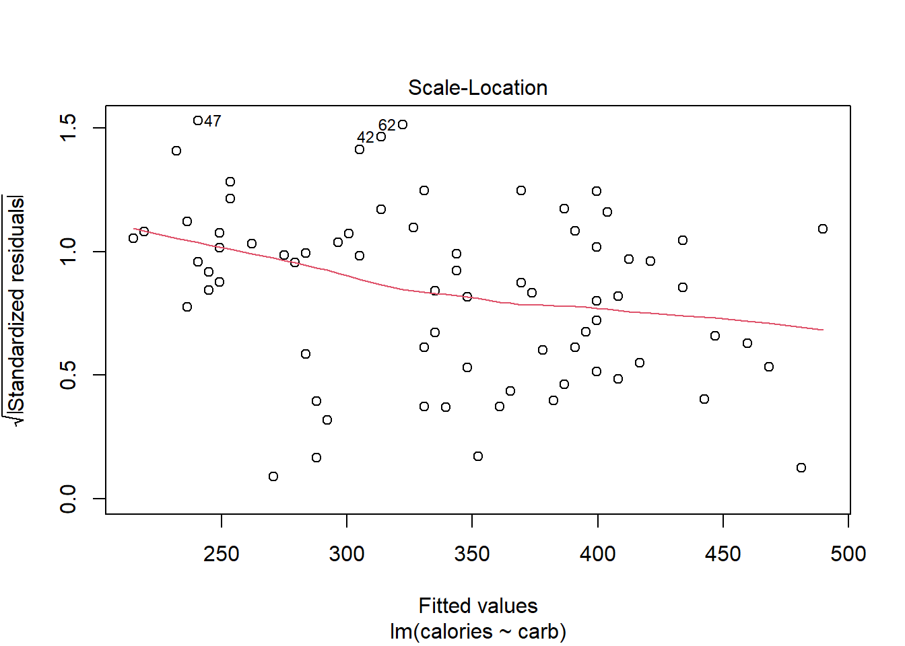
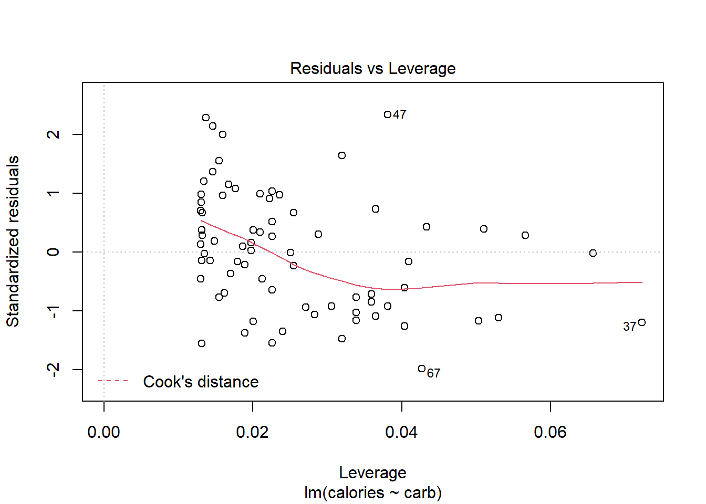
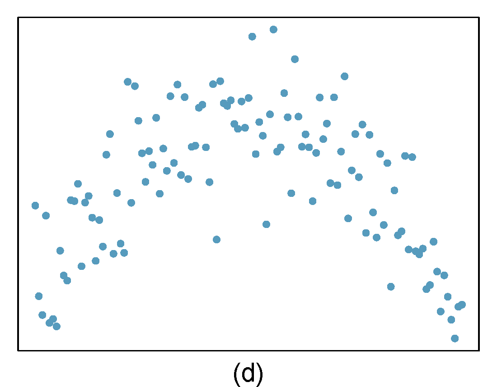
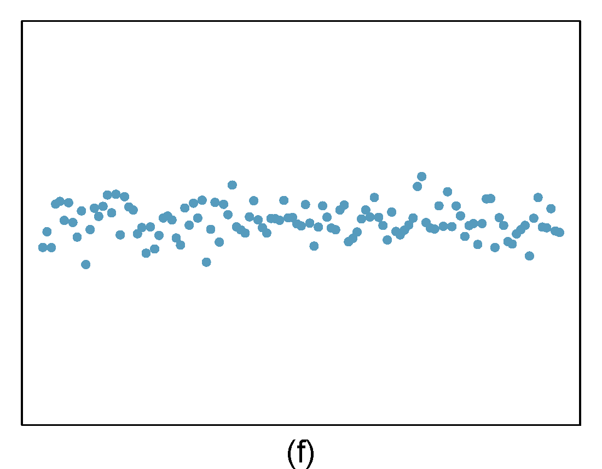
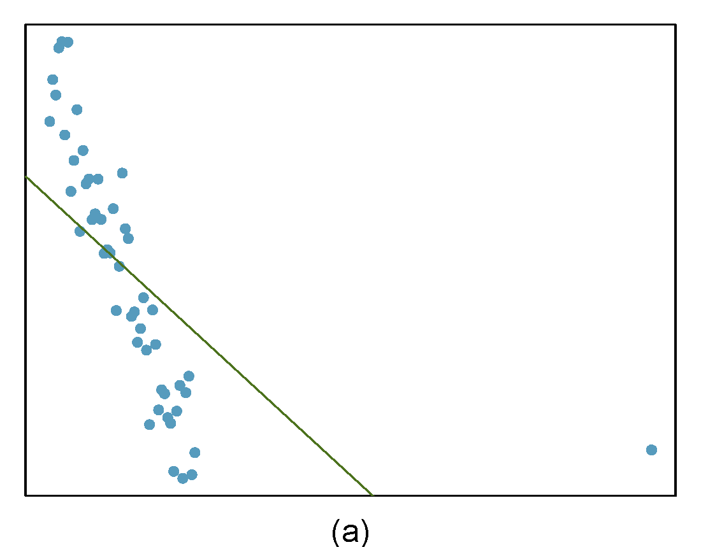
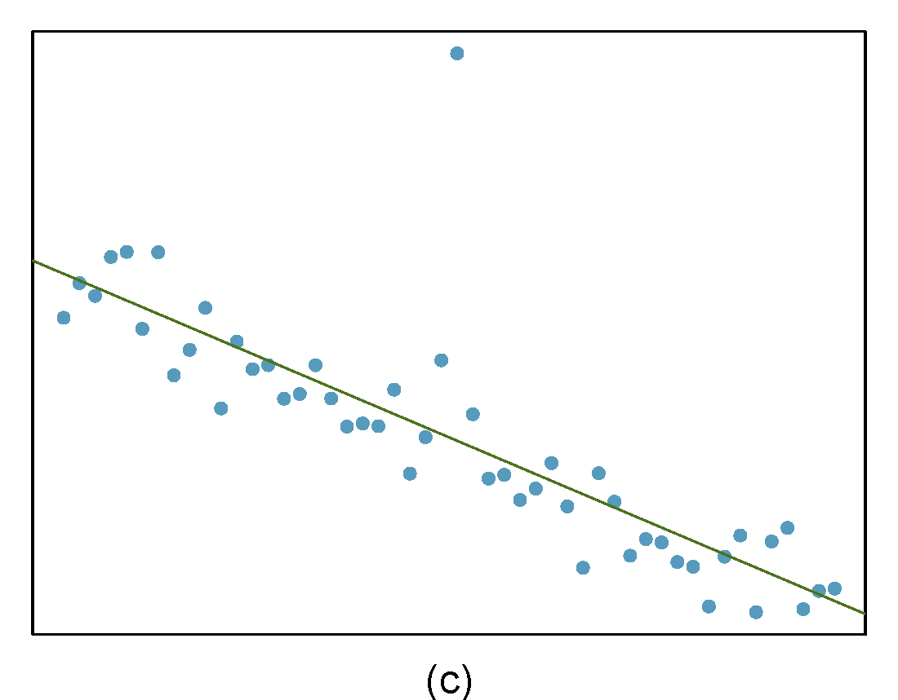
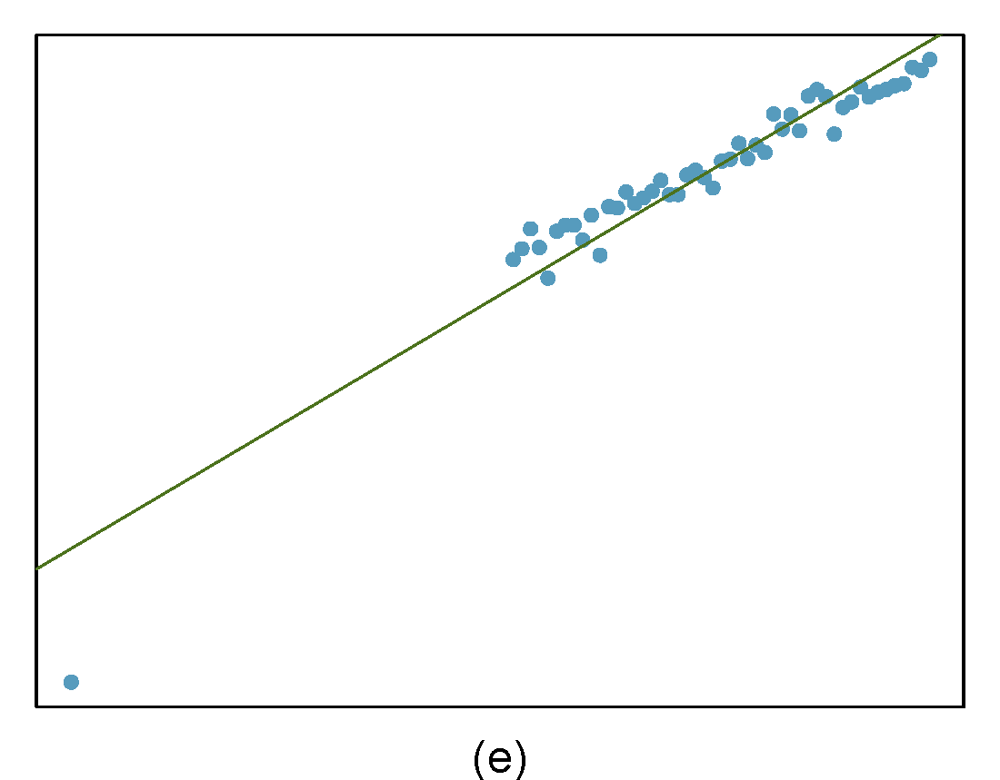

# Regression Diagnostics {#LRDIAG}

## Objectives

1) Obtain and interpret $R$-squared and the $F$-statistic.  
2) Use `R` to evaluate the assumptions of a linear model.  
3) Identify and explain outliers and leverage points.  

## Introduction

Over the last two chapters, we have detailed simple linear regression. First, we described the model and its underlying assumptions. Next, we obtained parameter estimates using the method of least squares. Finally, we obtained the distributions of parameter estimates and used that information to conduct inference on parameters and predictions. Implementation was relatively straightforward; once we obtained the expressions of interest, we used `R` to find parameters estimates, interval estimates, etc. In this chapter we will explore more tools to assess the quality of our simple linear regression model. Some of these tools will generalize when we move to multiple predictors.

## Assessing our model - understanding the output from `lm`

There is more that we can do with the output from the `lm()` function than just estimating parameters and predicting responses. There are metrics that allow us to assess the fit of our model. To explore some of these ideas let's use the Starbucks example again.

First load the data: 


```r
starbucks <- read_csv("data/starbucks.csv")
```

Next build and summarize the model:


```r
star_mod <- lm(calories~carb,data=starbucks)
```


```r
summary(star_mod)
```

```
## 
## Call:
## lm(formula = calories ~ carb, data = starbucks)
## 
## Residuals:
##      Min       1Q   Median       3Q      Max 
## -151.962  -70.556   -0.636   54.908  179.444 
## 
## Coefficients:
##             Estimate Std. Error t value Pr(>|t|)    
## (Intercept) 146.0204    25.9186   5.634 2.93e-07 ***
## carb          4.2971     0.5424   7.923 1.67e-11 ***
## ---
## Signif. codes:  0 '***' 0.001 '**' 0.01 '*' 0.05 '.' 0.1 ' ' 1
## 
## Residual standard error: 78.26 on 75 degrees of freedom
## Multiple R-squared:  0.4556,	Adjusted R-squared:  0.4484 
## F-statistic: 62.77 on 1 and 75 DF,  p-value: 1.673e-11
```

You may have noticed some other information that appeared in the summary of our model. We discussed the output in a previous chapter but let's go a little more in depth.

### Residual Standard Error

The "residual standard error" is the estimate of $\sigma$, the unexplained variance in our response. In our example, this turned out to be 78.26. If the assumptions of normality and constant variance are valid, we would expect the majority, 68\%, of the observed values at a given input to be within $\pm 78.26$ of the mean value.

If we want to extract just this value from the model object, first recognize that `summary(my.model)` is a list with several components:


```r
names(summary(star_mod))
```

```
##  [1] "call"          "terms"         "residuals"     "coefficients" 
##  [5] "aliased"       "sigma"         "df"            "r.squared"    
##  [9] "adj.r.squared" "fstatistic"    "cov.unscaled"
```

As expected, the `sigma` component shows the estimated value of $\sigma$. 


```r
summary(star_mod)$sigma
```

```
## [1] 78.25956
```

Again, this value is smaller the closer the points are to the regression fit. It is a measure of unexplained variance in the response variable.

### R-squared

Another quantity that appears is $R$-squared, also know as the coefficient of determination. $R$-squared is one measure of goodness of fit. Essentially $R$-squared is a ratio of variance (in the response) explained by the model to overall variance of the response. It helps to describe the decomposition of variance: 

$$
\underbrace{\sum_{i=1}^n (y_i-\bar{y})^2}_{SS_{\text{Total}}} = \underbrace{\sum_{i=1}^n (\hat{y}_i-\bar y)^2}_{SS_{\text{Regression}}}+\underbrace{\sum_{i=1}^n(y_i-\hat{y}_i)^2}_{SS_{\text{Error}}}
$$

In other words, the overall variation in $y$ can be separated into two parts: variation due to the linear relationship between $y$ and the predictor variable(s), called $SS_\text{Regression}$, and residual variation (due to random scatter or perhaps a poorly chosen model), called $SS_\text{Error}$. Note: $SS_\text{Error}$ is used to estimate residual standard error in the previous section.^[$\hat{\sigma}=\sqrt\frac{\sum_{i=1}^n(y_i-\hat{y}_i)^2}{\text{degrees of freedom}}$]  

$R$-squared simply measures the ratio between $SS_\text{Regression}$ and $SS_\text{Total}$. A common definition of $R$-squared is the proportion of overall variation in the response that is explained by the linear model. $R$-squared can be between 0 and 1. Values of $R$-squared close to 1 indicate a tight fit (little scatter) around the estimated regression line. Value close to 0 indicate the opposite (large remaining scatter). 

We can obtain $R$-squared "by hand" or by using the output of the `lm()` function: 


```r
summary(star_mod)$r.squared
```

```
## [1] 0.4556237
```

For simple linear regression, $R$-squared is related to **correlation**. We can compute the correlation using a formula, just as we did with the sample mean and standard deviation. However, this formula is rather complex,^[Formally, we can compute the correlation for observations $(x_1, y_1)$, $(x_2, y_2)$, ..., $(x_n, y_n)$ using the formula 
$$
R = \frac{1}{n-1}\sum_{i=1}^{n} \frac{x_i-\bar{x}}{s_x}\frac{y_i-\bar{y}}{s_y}
$$
where $\bar{x}$, $\bar{y}$, $s_x$, and $s_y$ are the sample means and standard deviations for each variable.] so we let `R` do the heavy lifting for us. 


```r
starbucks %>%
  summarize(correlation=cor(carb,calories),correlation_squared=correlation^2)
```

```
## # A tibble: 1 x 2
##   correlation correlation_squared
##         <dbl>               <dbl>
## 1       0.675               0.456
```

As a review, Figure \@ref(fig:cor-fig) below shows eight plots and their corresponding correlations. Only when the relationship is perfectly linear is the correlation either -1 or 1. If the relationship is strong and positive, the correlation will be near +1. If it is strong and negative, it will be near -1. If there is no apparent linear relationship between the variables, then the correlation will be near zero. 

<div class="figure">

<p class="caption">(\#fig:cor-fig)Scatterplots demonstrating different correlations.</p>
</div>

> **Exercise**  
If a linear model has a very strong negative relationship with a correlation of -0.97, how much of the variation in the response is explained by the explanatory variable?^[About $R^2 = (-0.97)^2 = 0.94$ or 94\% of the variation is explained by the linear model.]

Note that one of the components of `summary(lm())` function is `adj.r.squared`. This is a value of $R$-squared adjusted for number of predictors. This idea is covered more in depth in a machine learning course. 

### F-Statistic

Another quantity that appears in the summary of the model is the $F$-statistic. This value evaluates the null hypothesis that all of the non-intercept coefficients are equal to 0. Rejecting this hypothesis implies that the model is useful in the sense that at least one of the predictors shares a significant linear relationship with the response. 

$H_0$: $\beta_1 = \beta_2 = \dots = \beta_p = 0$  
$H_a$: At least one coefficient not equal to 0.  

where $p$ is the number of predictors in the model. Just like in ANOVA, this is a simultaneous test of all coefficients and does not inform us which one(s) are different from 0.

The $F$-statistic is given by
$$
{n-p-1 \over p}{\sum (\hat{y}_i-\bar{y})^2\over \sum e_i^2}
$$

Under the null hypothesis, the $F$-statistic follows the $F$ distribution with parameters $p$ and $n-p-1$. 

In our example, the $F$-statistic is redundant since there is only one predictor. In fact, the $p$-value associated with the $F$-statistic is equal to the $p$-value associated with the estimate of $\beta_1$. However, when we move to cases with more predictor variables, we may be interested in the $F$-statistic. 


```r
summary(star_mod)$fstatistic
```

```
##    value    numdf    dendf 
## 62.77234  1.00000 75.00000
```

## Regression diagnostics

Finally, we can use the `lm` object to check the assumptions of the model. We have discussed the assumptions before but in this chapter we will use `R` to generate visual checks. There are also numeric diagnostic measures. 

There are several potential problems with a regression model:

1) **Assumptions about the error structure**. We assume:  
- the errors are normally distributed    
- the errors are independent   
- the errors have constant variance, **homoskedastic**  

2) **Assumptions about the fit**. We assume that fit of the model is correct. For a simple linear regression, this means that fit specified by the formula in `lm` is correct.  

3) **Problems with outliers and leverage points**. In this case a small number of points in the data could have an unusually large impact on the parameter estimates. These points may give a mistaken sense that our model has a great fit or conversely that there is not relationship between the variables.  

4) **Missing predictors**. We can potentially improve the fit and predictive performance of our model by including other predictors. We will spend one chapter on this topic, but machine learning courses devote more time to discussing how to build these more complex models. In the case of multivariate linear regression, many of the diagnostic tools discussed next will also be applicable.  

### Residual plots  

The assumptions about the error structure can be checked with residual plots. We have already done this, but let's review again and provide a little more depth.

Applying the `plot()` function to an "lm" object provides several graphs that allow us to visually evaluate a linear model's assumptions. There are actually six plots (selected by the `which` option) available:  

- a plot of residuals against fitted values,  
- a Scale-Location plot of $\sqrt(| \text{residuals} |)$   against fitted values,   
- a Normal Q-Q plot,   
- a plot of Cook's distances versus row labels,   
- a plot of residuals against leverages,  
- and a plot of Cook's distances against leverage/(1-leverage). 

By default, the first three and the fifth are provided by applying `plot()` to an "lm" object. To obtain all four at once, simply use `plot(my.model)` at the command line, Figure \@ref(fig:diag281-fig). 


```r
plot(star_mod)
```

<div class="figure">

<p class="caption">(\#fig:diag281-fig)Regression diagnostic plots.</p>
</div>

However, it's best to walk through each of these four plots in our Starbucks example. 

### Residuals vs Fitted  

By providing a number in the `which` option, we can select the plot we want, Figure \@ref(fig:diag282-fig) is the first diagnostic plot. 


```r
plot(star_mod,which = 1)
```

<div class="figure">

<p class="caption">(\#fig:diag282-fig)A diagnostic residual plot.</p>
</div>

This plot assesses linearity of the model and homoscedasticity (constant variance). The red line is a smoothed estimate of the fitted values versus the residuals. Ideally, the red line should coincide with the dashed horizontal line and the residuals should be centered around this dashed line. This would indicate that a linear fit is appropriate. Furthermore, the scatter around the dashed line should be relatively constant across the plot, homoscedasticity. In this case, it looks like there is some minor concern over linearity and non-constant error variance. We noted this earlier with the cluster of points in the lower left hand corner of the scatterplot. 

Note: the points that are labeled are points with a high residual value. They are extreme. We will discuss outliers and leverage points shortly. 

### Normal Q-Q Plot 

As it's name suggests, this plot evaluates the normality of the residuals. We have seen and used this plot several times in this book. Remember if the number of data points is small, this plot has a greatly reduced effectiveness. 


```r
plot(star_mod,which = 2)
```

<div class="figure">

<p class="caption">(\#fig:diag283-fig)The quantile-quantile plot for checking normality.</p>
</div>


Along the $y$-axis are the actual standardized residuals. Along the $x$-axis is where those points should be if the residuals were actually normally distributed. Ideally, the dots should fall along the diagonal dashed line. In Figure \@ref(fig:diag283-fig), it appears there is some skewness to the right or just longer tails than a normal distribution. We can tell this because for the smaller residuals, they don't increase as they should to match a normal distribution, the points are above the line. This is concerning. 

### Scale-Location Plot

The scale-location plot is a better indicator of non-constant error variance. It is a plot of fitted values versus square root of the absolute value of the standardized residuals. A standardized residual is the residual divided by its standard deviation 

$$
e^{'}_i=\frac{e_i}{s}
$$

This plot illustrates the spread of the residuals over the entire range of the predictor. We are using fitted values because this will generalize well if we have more than one predictor.


```r
plot(star_mod,which=3)
```

<div class="figure">

<p class="caption">(\#fig:diag284-fig)A scale-location diagnostic residual plot.</p>
</div>


A straight horizontal red line indicates constant error variance. In this case, Figure \@ref(fig:diag284-fig), there is some indication error variance is higher for lower carb counts.   

## Outliers and leverage  

Before discussing the last plot, we need to spend some time discussing outliers. Outliers in regression are observations that fall far from the "cloud" of points. These points are especially important because they can have a strong influence on the least squares line. 

In regression, there are two types of outliers:  
- An outlier in the response variable is one that is not predicted well by the model. This could either be a problem with the data or the model.  The residuals for this outlier will be large in absolute value.    
- An outlier in the explanatory variable. These are typically called **leverage points** because they can have a undue impact on the parameter estimates. With multiple predictors, we can have a leverage point when we have an unusual combination of the predictors.

An outlier is a **influential point** if it drastically alters the regression output. For example by causing large changes in the estimated slope or hypothesis p-values, if it is omitted.  

> **Exercise**:  
There are six plots shown in Figure \@ref(fig:resid282-fig) along with the least squares line and residual plots. For each scatterplot and residual plot pair, identify any obvious outliers and note how they influence the least squares line. Recall that an outlier is any point that doesn't appear to belong with the vast majority of the other points.  

<div class="figure">

<p class="caption">(\#fig:resid282-fig)Examples of outliers and leverage points.</p>
</div>

1) There is one outlier far from the other points, though it only appears to slightly influence the line. This is an outlier in the response and will have a large residual in magnitude.   
2) There is one outlier on the right, though it is quite close to the least squares line, which suggests it wasn't very influential although it is a leverage point.  
3) There is one point far away from the cloud, and this leverage point appears to pull the least squares line up on the right; examine how the line around the primary cloud doesn't appear to fit very well. This point has a high influence on the estimated slope.   
4) There is a primary cloud and then a small secondary cloud of four outliers. The secondary cloud appears to be influencing the line somewhat strongly, making the least square line fit poorly almost everywhere. There might be an interesting explanation for the dual clouds, which is something that could be investigated.  
5) There is no obvious trend in the main cloud of points and the outlier on the right appears to largely control the slope of the least squares line. This point is an outlier in both the response and predictor.  It is a highly influential point.   
6) There is one outlier in both the response and predictor, thus a leverage point, far from the cloud, however, it falls quite close to the least squares line and does not appear to be very influential.  

Examining the residual plots in Figure \@ref(fig:resid282-fig), you will probably find that there is some trend in the main clouds of (3) and (4). In these cases, the outliers influenced the slope of the least squares lines. In (5), data with no clear trend were assigned a line with a large trend simply due to one outlier!
 
> Leverage   
Points that fall horizontally away from the center of the cloud tend to pull harder on the line, so we call them points with **high leverage**.

Points that fall horizontally far from the line are points of high leverage; these points can strongly influence the slope of the least squares line. If one of these high leverage points does appear to actually invoke its influence on the slope of the line -- as in cases (3), (4), and (5) -- then we call it an **influential point**. Usually we can say a point is influential if, had we fitted the line without it, the influential point would have been unusually far from the least squares line. Leverage can be calculated from what is called the **hat matrix**, the actual mathematics is beyond the scope of this book.  

A point can be an outlier but not a leverage point as we have already discussed. It is tempting to remove outliers from your data set. Don't do this without a very good reason. Models that ignore exceptional (and interesting) cases often perform poorly. For instance, if a financial firm ignored the largest market swings -- the ``outliers'' --  they would soon go bankrupt by making poorly thought-out investments.  

### Residuals vs Leverage Plot  

The residuals vs leverage plot is a good way to identify influential observations. Sometimes, influential observations are representative of the population, but they could also indicate an error in recording data, or an otherwise unrepresentative outlier. It could be worth looking into these cases. 


```r
plot(star_mod,5)
```

<div class="figure">

<p class="caption">(\#fig:diag286-fig)Diagnostic plots for Starbucks regression model.</p>
</div>

Figure \@ref(fig:diag286-fig) helps us to find influential cases, those leverage points that impact the estimated slope. Unlike the other plots, patterns are not relevant. We watch out for outlying values at the upper right corner or at the lower right corner. Those spots are the places where cases can be influential against a regression line. Look for cases outside of a dashed line, Cook’s distance. In our particular plot, a dotted line for Cook's distance was outside the bounds of the plot and thus did not come into play. When cases are outside of the Cook’s distance (meaning they have high Cook’s distance scores), the cases are influential to the regression results. The regression results will be altered if we exclude those cases. In this example, there are no points that tend to have undue influence.

### What If Our Assumptions Are Violated

If the assumptions of the model are violated and/or we have influential points, a linear regression model with normality assumptions is not appropriate. Sometimes it is appropriate to transform the data (either response or predictor), so that the assumptions are met on the transformed data. Other times, it is appropriate to explore other models. There are entire courses on regression where blocks of material are devoted to diagnostics and transformations to reduce the impact of violations of assumptions. We will not go into these methods in this book. Instead, when confronted with clear violated assumptions, we will use resampling as a possible solution. We will learn about this in the next chapter because it does not assume normality in the residuals. This is a limited solution, but as this is an introductory text, this is an excellent first step. 

## Homework Problems  

1. Identify relationships 

For each of the six plots in Figure \@ref(fig:hw1), identify the strength of the relationship (e.g. weak, moderate, or strong) in the data and whether fitting a linear model would be reasonable.  When we ask about the strength of the relationship, we mean:

- is there a relationship between $x$ and $y$ and
- does that relationship explain most of the variance?

<div class="figure">

<p class="caption">(\#fig:hw1)Homework problem 1.</p>
</div>

2. Beer and blood alcohol content 

We will use the blood alcohol content data again. As a reminder this is the description of the data: *Many people believe that gender, weight, drinking habits, and many other factors are much more important in predicting blood alcohol content (BAC) than simply considering the number of drinks a person consumed. Here we examine data from sixteen student volunteers at Ohio State University who each drank a randomly assigned number of cans of beer. These students were evenly divided between men and women, and they differed in weight and drinking habits. Thirty minutes later, a police officer measured their blood alcohol content (BAC) in grams of alcohol per deciliter of blood.* 

The data is in the `bac.csv` file under the `data` folder.

a. Obtain and interpret $R$-squared for this model.   
b. Evaluate the assumptions of this model. Do we have anything to be concerned about?  

3. Outliers 

Identify the outliers in the scatterplots shown in Figure \@ref(fig:hw3) and determine what type of outliers they are. Explain your reasoning. 

<div class="figure">

<p class="caption">(\#fig:hw3)Homework problem 3.</p>
</div>

