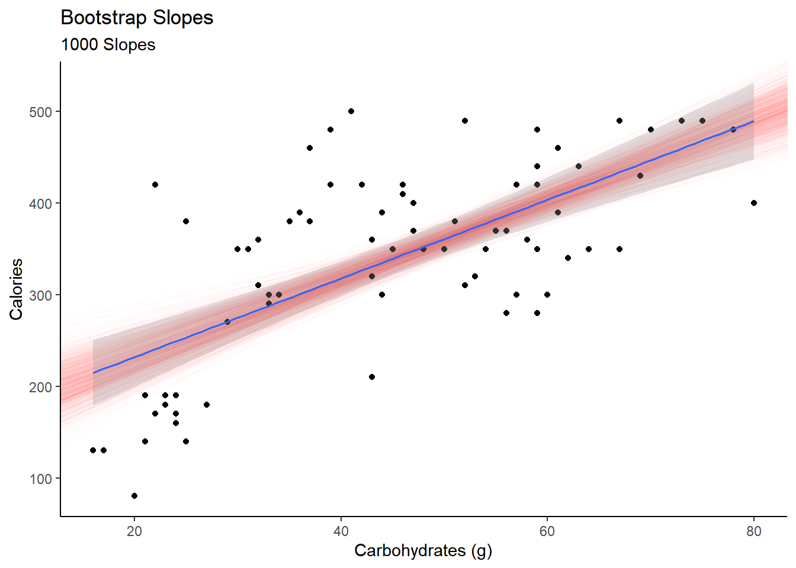
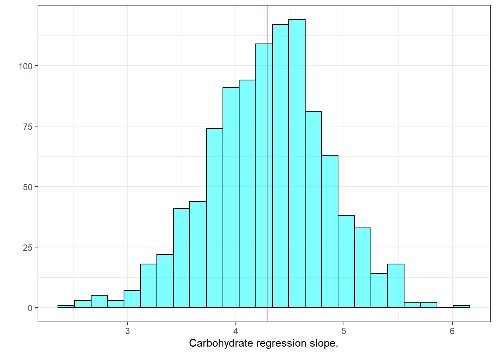
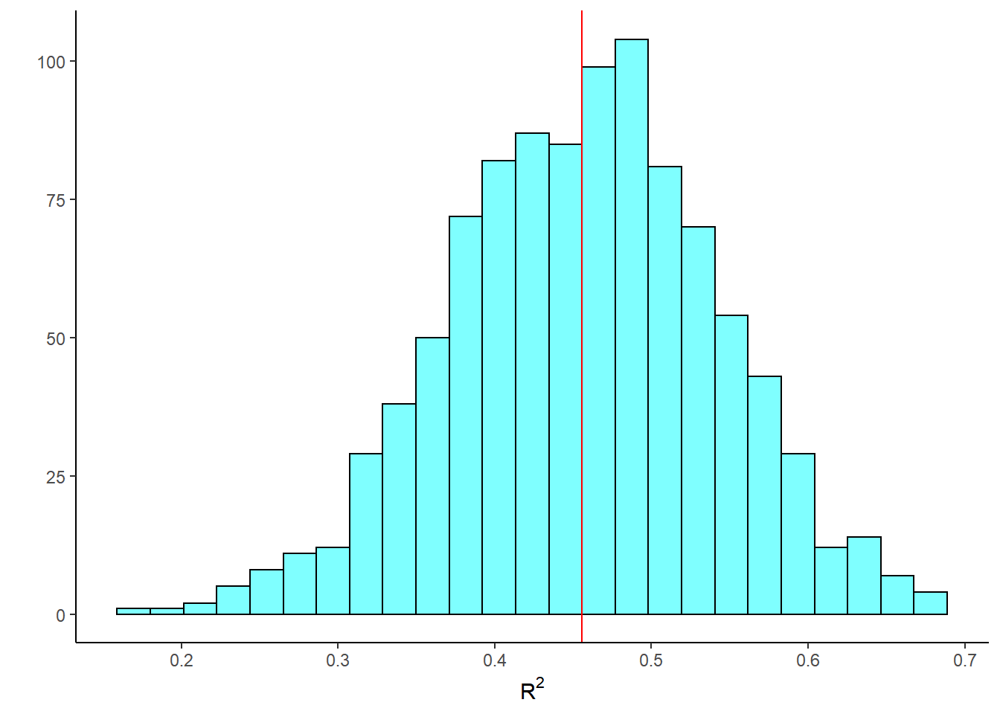
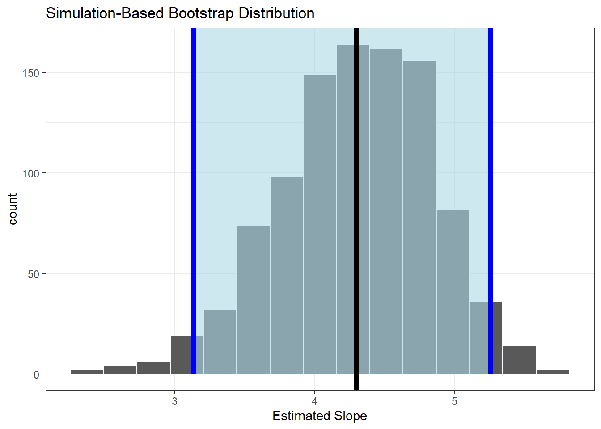
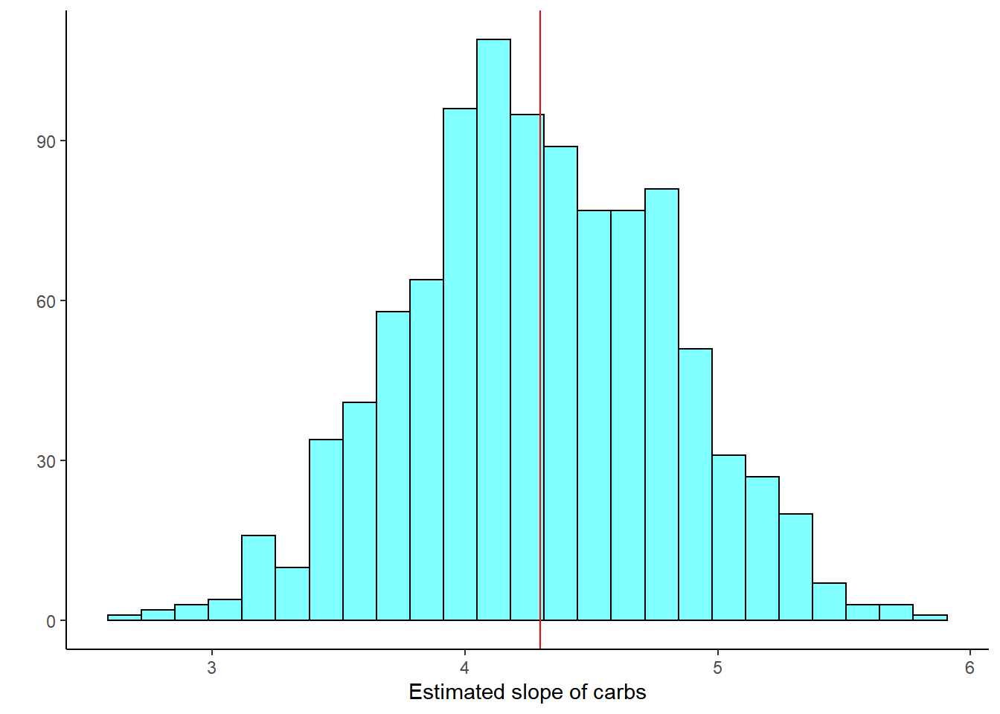
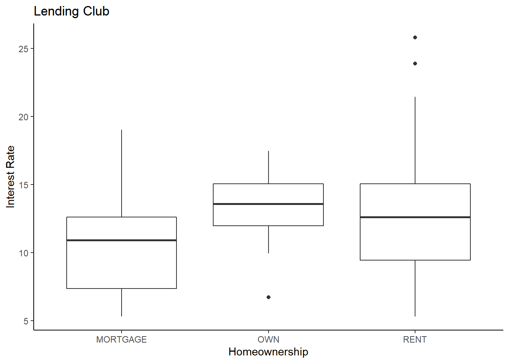
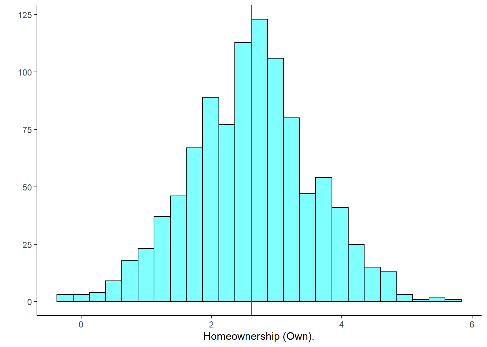
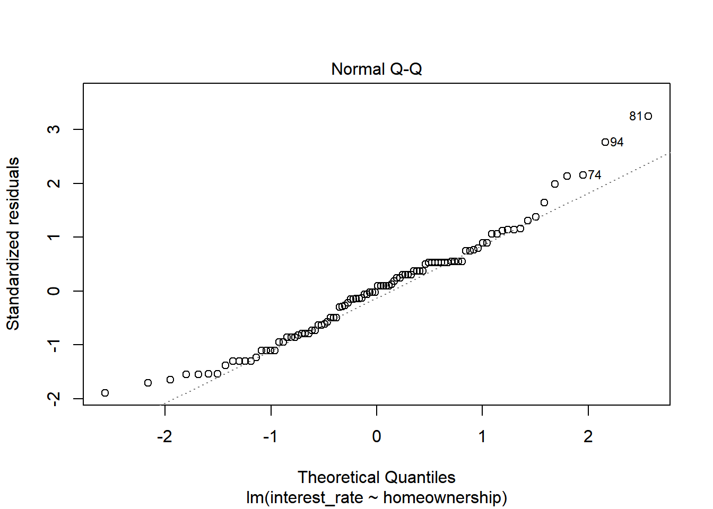
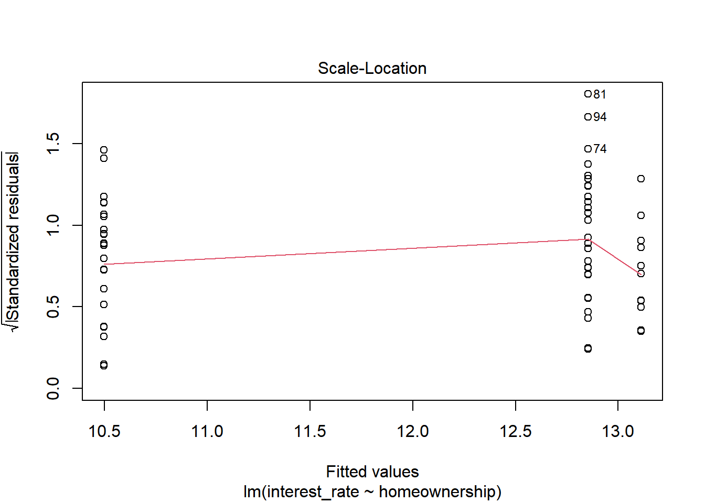
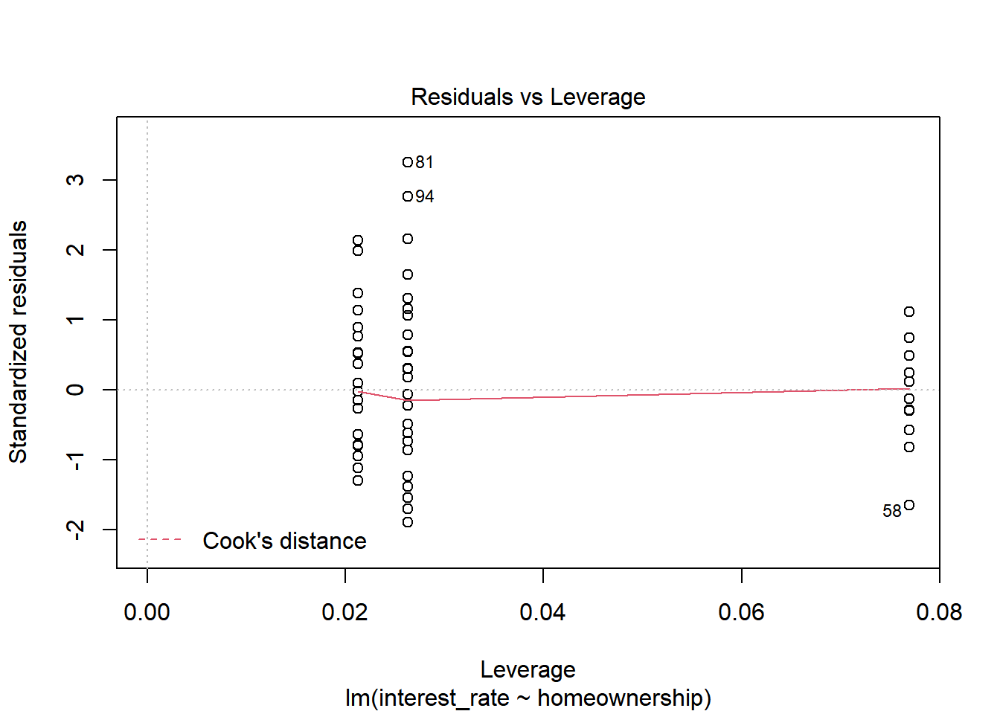

# Simulation-Based Linear Regression {#LRSIM}


## Objectives

1) Using the bootstrap, generate confidence intervals and estimates of standard error for parameter estimates from a linear regression model.  

2) Generate and interpret bootstrap confidence intervals for predicted values.  

3) Generate bootstrap samples from sampling rows of the data and from sampling residuals, and explain why you might prefer one method over the other.   

4) Interpret regression coefficients for a linear model with a categorical explanatory variable.   


## Introduction

In the last couple of chapters we examined how to perform inference for a simple linear regression model assuming the errors were independent normally distributed random variables. We examined diagnostic tools to check assumptions and look for outliers. In this chapter we will use the **bootstrap** to create confidence and prediction intervals.

There are at least two ways we can consider creating a bootstrap distribution for a linear model. We can easily fit a linear model to a resampled data set. But in some situations this may have undesirable features. Influential observations, for example, will appear duplicated in some resamples and be missing entirely from other resamples.  

Another option is to use “residual resampling". In residual resampling, the new data set has all of the predictor values from the original data set and a new response is created by adding to the fitted function a resampled residual.

In summary, suppose we have $n$ observations, each with $Y$ and some number of $X$'s, with each observation stored as a row in a data set. The two basic procedures when bootstrapping regression are:  
a. bootstrap observations, and   
b. bootstrap residuals.  
The latter is a special case of a more general rule: sample $Y$ from its estimated conditional distribution given $X$.   

In bootstrapping observations, we sample with replacement from the rows of the data; each $Y$ comes with the corresponding $X$'s. In any bootstrap sample some observations may be repeated multiple times, and others not included. This is the same idea we used before when we used the bootstrap for hypothesis testing.   

In bootstrapping residuals, we fit the regression model, compute predicted values $\hat{Y}_i$ and residuals $e_i = Y_i - \hat{Y}_i$, then create a bootstrap sample using the same $X$ values as in the original data, but with new $Y$ values obtained using the prediction plus a random residual, $Y^{*}_i = \hat{Y}_i + e^{*}_i$, where the residuals $e^{*}_i$ are sampled randomly with replacement from the original residuals. We still have the chance of selecting a large residual from an outlier, but if it paired with an $x$ value near $\bar{x}$, it will have little leverage.   

Bootstrapping residuals corresponds to a designed experiment, where the $x$ values are fixed and only $Y$ is random. If we bootstrap observations, then essentially both $X$ and $Y$ are sampled. By the principle of sampling the way the data were drawn, the second method implies that both $Y$ and $X$ are random.

## Confidence intervals for parameters  

To build a confidence interval for the slope parameter, we will resample the data or residuals and generate a new regression model. This process does not assume normality of the residuals. We will use functions from the **mosaic** package to complete this work. However, know that **tidymodels** and **purrr** are more sophisticated tools for doing this work.

### Resampling  

To make this ideas more salient, let's use the Starbucks example again.

First read the data into `R`:


```r
starbucks <- read_csv("data/starbucks.csv")
```

Build the model:


```r
star_mod <- lm(calories~carb,data=starbucks)
```

Let's see the output of the model:


```r
summary(star_mod)
```

```
## 
## Call:
## lm(formula = calories ~ carb, data = starbucks)
## 
## Residuals:
##      Min       1Q   Median       3Q      Max 
## -151.962  -70.556   -0.636   54.908  179.444 
## 
## Coefficients:
##             Estimate Std. Error t value Pr(>|t|)    
## (Intercept) 146.0204    25.9186   5.634 2.93e-07 ***
## carb          4.2971     0.5424   7.923 1.67e-11 ***
## ---
## Signif. codes:  0 '***' 0.001 '**' 0.01 '*' 0.05 '.' 0.1 ' ' 1
## 
## Residual standard error: 78.26 on 75 degrees of freedom
## Multiple R-squared:  0.4556,	Adjusted R-squared:  0.4484 
## F-statistic: 62.77 on 1 and 75 DF,  p-value: 1.673e-11
```


In preparation for resampling, let's see how `do()` treats a linear model object.


```r
set.seed(401)
obs<-do(1)*star_mod
obs
```

```
##   Intercept     carb    sigma r.squared        F numdf dendf .row .index
## 1  146.0204 4.297084 78.25956 0.4556237 62.77234     1    75    1      1
```

Nice. To resample the data we use `do()` with `resample()`. This will sample the rows, what we were referring to above as the first method.


```r
do(2)*lm(calories~carb,data=resample(starbucks))
```

```
##   Intercept     carb    sigma r.squared        F numdf dendf .row .index
## 1  145.6345 4.089065 73.32243 0.4980692 74.42299     1    75    1      1
## 2  160.0193 3.828742 66.81016 0.4298148 56.53621     1    75    1      2
```

Perfect, we are ready to scale up.


```r
set.seed(532)
results <- do(1000)*lm(calories~carb,data=resample(starbucks))
```

Now let's look at the first 6 rows of `results`.


```r
head(results)
```

```
##   Intercept     carb    sigma r.squared        F numdf dendf .row .index
## 1  154.7670 4.176327 78.94717 0.4127581 52.71568     1    75    1      1
## 2  166.8589 3.807697 72.09482 0.4032196 50.67437     1    75    1      2
## 3  105.3658 4.899956 77.62517 0.5310212 84.92195     1    75    1      3
## 4  227.4138 2.805156 79.97902 0.2467094 24.56317     1    75    1      4
## 5  194.9190 3.457191 83.74624 0.2670279 27.32313     1    75    1      5
## 6  183.1159 3.549460 73.90153 0.3931691 48.59292     1    75    1      6
```

If we plot all the slopes, the red lines in Figure \@ref(fig:slope291-fig), we get a sense of the variability in the estimated slope and intercept. This also gives us an idea of the width of the confidence interval on the estimated mean response. We plotted the confidence interval in a gray shade and we can see it matches the red shaded region of the bootstrap slopes. We can see that the confidence interval will be wider at the extreme values of the predictor. 


```r
ggplot(starbucks, aes(x=carb, y=calories)) +
  geom_abline(data = results,
              aes(slope =  carb, intercept = Intercept), 
              alpha = 0.01,color="red") +
  geom_point() +
  theme_classic() +
  labs(x="Carbohydrates (g)",y="Calories",title="Bootstrap Slopes",subtitle ="1000 Slopes") +
  geom_lm(interval="confidence")
```

<div class="figure">

<p class="caption">(\#fig:slope291-fig)Plot of slopes from resampled regression.</p>
</div>


With all this data in `results`, we can generate confidence intervals for the slope, $R$-squared ($R^2$), and the $F$ statistic. Figure \@ref(fig:hist291-fig) is a histogram of slope values from resampling.


```r
results %>%
  gf_histogram(~carb,fill="cyan",color = "black") %>%
  gf_vline(xintercept = obs$carb,color="red") %>%
  gf_theme(theme_bw()) %>%
  gf_labs(x="Carbohydrate regression slope.",y="")
```

<div class="figure">

<p class="caption">(\#fig:hist291-fig)Histogram of slopes from resampled regression.</p>
</div>

The confidence interval is found using `cdata()`.


```r
cdata(~carb,data=results,p=0.95)
```

```
##         lower    upper central.p
## 2.5% 3.166546 5.377743      0.95
```

We are 95% confident that the true slope is between 3.17 and 5.37. As a reminder, using the normality assumption we had a 95% confidence interval of $(3.21,5.38)$:


```r
confint(star_mod)
```

```
##                 2.5 %     97.5 %
## (Intercept) 94.387896 197.652967
## carb         3.216643   5.377526
```
The bootstrap confidence interval for $R^2$ is:


```r
cdata(~r.squared,data=results)
```

```
##          lower     upper central.p
## 2.5% 0.2837033 0.6234751      0.95
```

And the bootstrap sampling distribution of $R^2$ is displayed in Figure \@ref(fig:hist292-fig).

(ref:ref291) A histogram of the $R^2$ values from resampled regression.  


```r
results %>%
  gf_histogram(~r.squared,fill="cyan",color="black") %>%
  gf_vline(xintercept = obs$r.squared,color="red") %>%
  gf_theme(theme_classic()) %>%
  gf_labs(y="",x=expression(R^2))
```

<div class="figure">

<p class="caption">(\#fig:hist292-fig)(ref:ref291)</p>
</div>

This is nice work. So powerful.

Let's see how we could accomplish this same work using the **infer** package.


```r
library(infer)
```

To check that we can use this package, let's find the slope estimate.


```r
slope_estimate <- starbucks %>%
  specify(calories ~ carb) %>%
  calculate(stat="slope")
```


```r
slope_estimate
```

```
## Response: calories (numeric)
## Explanatory: carb (numeric)
## # A tibble: 1 x 1
##    stat
##   <dbl>
## 1  4.30
```

Good, let's get the bootstrap sampling distribution of the regression slope.


```r
results2 <- starbucks %>%
  specify(calories~carb) %>%
  generate(reps=1000,type="bootstrap") %>%
  calculate(stat="slope")
head(results2)
```

```
## Response: calories (numeric)
## Explanatory: carb (numeric)
## # A tibble: 6 x 2
##   replicate  stat
##       <int> <dbl>
## 1         1  3.75
## 2         2  5.43
## 3         3  3.76
## 4         4  4.69
## 5         5  4.38
## 6         6  3.63
```

Next the confidence interval.  


```r
slope_ci<-results2 %>%
  get_confidence_interval(level=0.95)
slope_ci
```

```
## # A tibble: 1 x 2
##   lower_ci upper_ci
##      <dbl>    <dbl>
## 1     3.14     5.26
```

This matches the work we have already done. Finally, let's visualize the results, Figure \@ref(fig:infer291-fig).


```r
results2 %>%
  visualize() +
  shade_confidence_interval(slope_ci,color="blue",fill="lightblue") +
  geom_vline(xintercept = slope_estimate$stat,color="black",size=2) +
  labs(x="Estimated Slope") +
  theme_bw()
```

<div class="figure">

<p class="caption">(\#fig:infer291-fig)Sampling distribution of the slope using resampling. (Black line is estimate slope from original data and blue lines are the confidence bounds.)</p>
</div>

### Resample residuals

We could also resample the residuals instead of the data. This makes a stronger assumption that the linear model is appropriate. However, it guarantees that every $X$ value is in the resample data frame. In the `lm` function, we send the model instead of the data to resample the residuals. Since `R` is an object oriented programming language, in sending a model object to the `resample()` function, the code automatically resample from the residuals.


```r
results_resid <- do(1000)*lm( calories~carb, data = resample(star_mod)) # resampled residuals
head(results_resid)
```

```
##   Intercept     carb    sigma r.squared        F numdf dendf .row .index
## 1  151.9999 4.356740 73.07024 0.4967052 74.01804     1    75    1      1
## 2  101.6226 5.280410 82.24346 0.5336627 85.82779     1    75    1      2
## 3  152.4453 4.346918 82.64249 0.4344055 57.60383     1    75    1      3
## 4  159.1311 3.846912 84.42784 0.3656236 43.22634     1    75    1      4
## 5  167.9957 3.981328 67.50240 0.4912807 72.42905     1    75    1      5
## 6  198.5458 3.239953 86.11143 0.2821237 29.47482     1    75    1      6
```

Next a plot of the bootstrap sampling distribution, Figure \@ref(fig:hist293-fig).


```r
results_resid %>%
  gf_histogram(~carb,fill="cyan",color="black") %>%
  gf_vline(xintercept = obs$carb,color="red") %>%
  gf_theme(theme_classic()) %>%
  gf_labs(x="Estimated slope of carbs",y="")
```

<div class="figure">

<p class="caption">(\#fig:hist293-fig)Histogram of estimated regression slope using resampling from residuals.</p>
</div>

And finally the confidence interval for the slope.


```r
cdata(~carb,data=results_resid)
```

```
##        lower    upper central.p
## 2.5% 3.24622 5.323031      0.95
```

Similar to the previous bootstrap confidence interval just a little narrower.

## Confidence intervals for prediction  

We now want to generate a confidence interval for the average calories from 60 grams of carbohydrates.  

Using the normal assumption, we had


```r
predict(star_mod,newdata = data.frame(carb=60),interval="confidence")
```

```
##        fit      lwr      upr
## 1 403.8455 379.7027 427.9883
```

We have all the bootstrap slope and intercept estimates in the `results` object. We can use `tidyverse` functions to find the confidence interval by predicting the response for each of these slope and intercept estimate.


```r
head(results)
```

```
##   Intercept     carb    sigma r.squared        F numdf dendf .row .index
## 1  154.7670 4.176327 78.94717 0.4127581 52.71568     1    75    1      1
## 2  166.8589 3.807697 72.09482 0.4032196 50.67437     1    75    1      2
## 3  105.3658 4.899956 77.62517 0.5310212 84.92195     1    75    1      3
## 4  227.4138 2.805156 79.97902 0.2467094 24.56317     1    75    1      4
## 5  194.9190 3.457191 83.74624 0.2670279 27.32313     1    75    1      5
## 6  183.1159 3.549460 73.90153 0.3931691 48.59292     1    75    1      6
```


```r
results %>%
  mutate(pred=Intercept+carb*60) %>%
  cdata(~pred,data=.)
```

```
##         lower    upper central.p
## 2.5% 385.2706 423.6689      0.95
```

This is similar to the interval we found last chapter. We are 95% confident that the average calorie content for a menu item with 60 grams of carbohydrates is between 380.8 and 425.7.

### Prediction interval  

The prediction interval is more difficult to perform with a bootstrap. We would have to account for the variability of the slope but also the residual variability since this is an individual observation. We can't just add the residual to the predicted value. Remember the variance of a sum of independent variables is the sum of the variances. But here we have standard deviations and we can't just add them. 

Let's look at what would happen if we try. First as a reminder, the prediction interval at 60 grams of `carb` using the assumption of normally distributed errors from last chapter is:


```r
predict(star_mod,newdata = data.frame(carb=60),interval="prediction")
```

```
##        fit      lwr      upr
## 1 403.8455 246.0862 561.6048
```

If we are generating a bootstrap of size 1000, we will resample from the residuals 1000 times.


```r
results %>%
  mutate(pred=Intercept+carb*60) %>% 
  cbind(resid=sample(star_mod$residuals,size=1000,replace = TRUE)) %>%
  mutate(pred_ind=pred+resid) %>%
  cdata(~pred_ind,data=.)
```

```
##         lower    upper central.p
## 2.5% 277.4886 577.0957      0.95
```

This prediction interval appears to be biased. Thus generating a prediction interval is beyond the scope of this book.  

## Categorical predictor  

We want to finish up simple linear regression by discussing a categorical predictor. It somewhat changes the interpretation of the regression model.

Thus far, we have only discussed regression in the context of a quantitative, continuous, response AND a quantitative, continuous, predictor. We can build linear models with categorical predictor variables as well. 

In the case of a binary covariate, nothing about the linear model changes. The two levels of the binary covariate are typically coded as 1 and 0, and the model is built, evaluated and interpreted in an analogous fashion as before. The difference between the continuous predictor and categorical is that there are only two values the predictor can take and the regression model will simply predict the average value of the response within each value of the predictor.

In the case of a categorical covariate with $k$ levels, where $k>2$, we need to include $k-1$ *dummy variables* in the model. Each of these dummy variables takes the value 0 or 1. For example, if a covariate has $k=3$ categories or levels (say A, B or C), we create two dummy variables, $X_1$ and $X_2$, each of which can only take values 1 or 0. We arbitrarily state that if $X_1=1$, it represents the covariate has the value A. Likewise if $X_2=1$, then we state that the covariate takes the value B. If both $X_1=0$ and $X_2=0$, this is known as the reference category, and in this case the covariate takes the value C. The arrangement of the levels of the categorical covariate are arbitrary and can be adjusted by the user. This coding of the covariate into dummy variables is called **contrasts** and again is typically taught in a more advanced course on linear models.

In the case $k=3$, the linear model is $Y=\beta_0 + \beta_1X_1 + \beta_2X_2+e$. 

When the covariate takes the value A, $\mbox{E}(Y|X=A)=\beta_0 + \beta_1$. 

When the covariate takes the value B, $\mbox{E}(Y|X=B)=\beta_0 + \beta_2$. 

When the covariate takes the value C, $\mbox{E}(Y|X=C)=\beta_0$. 

Based on this, think about how you would interpret the coefficients $\beta_0$, $\beta_1$, and $\beta_2$. 

### Lending Club 

Let's do an example with some data.  

The Lending Club data set represents thousands of loans made through the Lending Club platform, which is a platform that allows individuals to lend to other individuals. Of course, not all loans are created equal. Someone who is essentially a sure bet to pay back a loan will have an easier time getting a loan with a low interest rate than someone who appears to be riskier. And for people who are very risky? They may not even get a loan offer, or they may not have accepted the loan offer due to a high interest rate. It is important to keep that last part in mind, since this data set only represents loans actually made, i.e. do not mistake this data for loan applications! The data set is `loans.csv` from the `data` folder.


```r
loans <- read_csv("data/loans.csv")
```

Let's look at the size of the data:


```r
dim(loans)
```

```
## [1] 10000    55
```

This is a big data set. For educational purposes, we will sample 100 points from the original data. We only need the variables `interest_rate` and `homeownership`. First let's break down the `homeownership` variable.


```r
tally(~homeownership,data=loans,format="proportion")
```

```
## homeownership
## MORTGAGE      OWN     RENT 
##   0.4789   0.1353   0.3858
```

We want to sample the data so that each level of home ownership has the same proportion as the original, a stratified sample.


```r
set.seed(905)
loans100 <- loans %>%
  select(interest_rate,homeownership) %>%
  mutate(homeownership=factor(homeownership)) %>%
  group_by(homeownership) %>%
  slice_sample(prop=0.01) %>%
  ungroup()
```


```r
dim(loans100)
```

```
## [1] 98  2
```

Not quite a 100 observations, but we preserved the proportion of homeownership.


```r
tally(~homeownership,data=loans100,format="proportion")
```

```
## homeownership
##  MORTGAGE       OWN      RENT 
## 0.4795918 0.1326531 0.3877551
```

Let's look at the data with a boxplot, Figure \@ref(fig:box291-fig).


```r
loans100 %>%
  gf_boxplot(interest_rate~homeownership) %>%
  gf_theme(theme_classic()) %>%
  gf_labs(title="Lending Club",x="Homeownership",y="Interest Rate")
```

<div class="figure">

<p class="caption">(\#fig:box291-fig)Boxplot of loan interest rates from the Lending Club based on homeownership status.</p>
</div>

It appears that there is some evidence that home ownership impacts the interest rate. We can build a linear model to explore whether this difference in significant. We can use the `lm()` function in `R`, but in order to include a categorical predictor, we need to make sure that variable is stored as a "factor" type. If it is not, we'll need to convert it. 


```r
str(loans100)
```

```
## tibble [98 x 2] (S3: tbl_df/tbl/data.frame)
##  $ interest_rate: num [1:98] 19.03 9.44 6.07 7.96 10.9 ...
##  $ homeownership: Factor w/ 3 levels "MORTGAGE","OWN",..: 1 1 1 1 1 1 1 1 1 1 ...
```

Now we can build the model: 


```r
loan_mod<-lm(interest_rate ~ homeownership,data=loans100)
summary(loan_mod)
```

```
## 
## Call:
## lm(formula = interest_rate ~ homeownership, data = loans100)
## 
## Residuals:
##     Min      1Q  Median      3Q     Max 
## -7.5442 -3.1472  0.1628  2.1228 12.9658 
## 
## Coefficients:
##                   Estimate Std. Error t value Pr(>|t|)    
## (Intercept)        10.4972     0.5889  17.825  < 2e-16 ***
## homeownershipOWN    2.6135     1.2652   2.066  0.04158 *  
## homeownershipRENT   2.3570     0.8808   2.676  0.00878 ** 
## ---
## Signif. codes:  0 '***' 0.001 '**' 0.01 '*' 0.05 '.' 0.1 ' ' 1
## 
## Residual standard error: 4.037 on 95 degrees of freedom
## Multiple R-squared:  0.08517,	Adjusted R-squared:  0.06591 
## F-statistic: 4.422 on 2 and 95 DF,  p-value: 0.01458
```

Note that by default, `R` set the `MORTGAGE` level as the reference category. This is because it is first value when sorted alphabetically. You can control this by changing the order of the factor levels. The package **forcats** helps with this effort. 

How would we interpret this output? Since `MORTGAGE` is the reference category, the intercept is effectively the estimated, average, interest rate for home owners with a mortgage. 


```r
loans100 %>%
  filter(homeownership == "MORTGAGE") %>%
  summarize(average=mean(interest_rate))
```

```
## # A tibble: 1 x 1
##   average
##     <dbl>
## 1    10.5
```

The other terms represent the expected difference in average interest rates for the ownership types. 


```r
loans100 %>%
  group_by(homeownership) %>%
  summarize(average=mean(interest_rate),std_dev=sd(interest_rate))
```

```
## # A tibble: 3 x 3
##   homeownership average std_dev
##   <fct>           <dbl>   <dbl>
## 1 MORTGAGE         10.5    3.44
## 2 OWN              13.1    2.89
## 3 RENT             12.9    4.94
```


Specifically, on average, loan interest rates for home owners who own their home is 2.61 percentage points higher than those with a mortgage. Those who rent is 2.36 percent higher on average. The highest interest rate is for those who own their own home. This seems odd but it is interesting.

>**Exercise**:  
Using the coefficient from the regression model, how do we find the difference in average interest rates between home owners and renters?  

The first coefficient 
$$\beta_\text{homeownershipOWN} = \mu_\text{OWN} - \mu_\text{MORTGAGE}$$  
and $$\beta_\text{homeownershipRENT} = \mu_\text{RENT} - \mu_\text{MORTGAGE}.$$ 
Thus $$\mu_\text{OWN} -\mu_\text{RENT} = \beta_\text{homeownershipOWN} - \beta_\text{homeownershipRENT},$$ the difference in coefficients.

The model is not fitting a line to the data but just estimating average with the coefficients representing difference from the reference level.

The `Std.Error`, `t value`, and `Pr(>|t|)` values can be used to conduct inference about the respective estimates. Both $p$-values are significant. This is similar to the ANOVA analysis we conducted last block except that hypothesis test was simultaneously testing all coefficients and here we are testing them pairwise. 

### Bootstrap

From the boxplots, the biggest difference in means is between home owners and those with a mortgage. However, in the regression output there is no $p$-value to test the difference between owners and renters. An easy solution would be to change the reference level but what if you had many levels? How would you know which ones to test? In the next section we will look at multiple comparisons but before then we can use the bootstrap to help us.

Let's bootstrap the regression.


```r
set.seed(532)
results <- do(1000)*lm(interest_rate ~ homeownership,data=resample(loans100))
```


```r
head(results)
```

```
##   Intercept homeownershipOWN homeownershipRENT    sigma  r.squared        F
## 1   9.98300         2.088250          2.110000 3.832758 0.07223701 3.698421
## 2  11.04875         3.868250          1.449750 3.421090 0.11065485 5.910085
## 3  10.52865         3.200096          2.065557 3.958047 0.08231134 4.260474
## 4  11.10000         2.572000          2.163000 4.752496 0.05494338 2.761539
## 5  10.52939         2.459703          1.214033 4.157461 0.03970813 1.964128
## 6  10.08280         4.100533          2.531745 3.650730 0.16435823 9.342539
##   numdf dendf .row .index
## 1     2    95    1      1
## 2     2    95    1      2
## 3     2    95    1      3
## 4     2    95    1      4
## 5     2    95    1      5
## 6     2    95    1      6
```


We of course can generate a confidence interval on either of the coefficients in the `results` object.


```r
obs<-do(1)*loan_mod
obs
```

```
##   Intercept homeownershipOWN homeownershipRENT    sigma  r.squared        F
## 1  10.49723         2.613535          2.356976 4.037396 0.08516582 4.421978
##   numdf dendf .row .index
## 1     2    95    1      1
```

Figure \@ref(fig:hist297-fig) is a histogram of the estimated coefficient for those that own their home.


```r
results %>%
  gf_histogram(~homeownershipOWN,fill="cyan",color="black") %>%
  gf_vline(xintercept = obs$homeownershipOWN,color="red") %>%
  gf_theme(theme_classic()) %>%
  gf_labs(y="",x="Homeownership (Own).")
```

```
## Warning: geom_vline(): Ignoring `mapping` because `xintercept` was provided.
```

<div class="figure">

<p class="caption">(\#fig:hist297-fig)Distribution of estimated regression coefficent for homeownership.</p>
</div>


```r
cdata(~homeownershipOWN,data=results)
```

```
##          lower    upper central.p
## 2.5% 0.7674164 4.489259      0.95
```

Which is similar to the results assuming normality.


```r
confint(loan_mod)
```

```
##                       2.5 %    97.5 %
## (Intercept)       9.3280904 11.666378
## homeownershipOWN  0.1018118  5.125259
## homeownershipRENT 0.6083964  4.105557
```

However, we want a confidence interval for the difference between home owners and renters.


```r
results %>%
  mutate(own_rent=homeownershipOWN - homeownershipRENT) %>%
  cdata(~own_rent,data=.)
```

```
##          lower    upper central.p
## 2.5% -1.943183 2.536296      0.95
```

Done! From this interval we can infer that home owners that own their home and those that rent do not have significantly different interest rates.

### ANOVA Table

As a reminder, we could also report the results of loans analysis using an *analysis of variance*, or ANOVA, table. 


```r
anova(loan_mod)
```

```
## Analysis of Variance Table
## 
## Response: interest_rate
##               Df  Sum Sq Mean Sq F value  Pr(>F)  
## homeownership  2  144.16  72.081   4.422 0.01458 *
## Residuals     95 1548.55  16.301                  
## ---
## Signif. codes:  0 '***' 0.001 '**' 0.01 '*' 0.05 '.' 0.1 ' ' 1
```

This table lays out how the variation between observations is broken down. This is a simultaneous test of equality of the three means. Using the $F$-statistic, we would reject the null hypothesis of no differences in mean response across levels of the categorical variable. Notice it is the same $p$-value reported for the $F$ distribution in the regression summary.

### Pairwise Comparisons

The ANOVA table above (along with the summary of the linear model output before that) merely tells you whether any difference exists in the mean response across the levels of the categorical predictor. It does not tell you where that difference lies. In the case of using regression we can compare `MORTGAGE` to the other two levels but can't conduct a hypothesis of `OWN` vs `RENT`.  In order to make all pairwise comparisons, we need another tool. A common one is the Tukey method. Essentially, the Tukey method conducts three hypothesis tests (each under the null of no difference in mean) but corrects the $p$-values based on the understanding that we are conducting three simultaneous hypothesis tests with the same set of data and we don't want to inflate the Type 1 error. 

We can obtain these pairwise comparisons using the `TukeyHSD()` function in `R`. The "HSD" stands for "Honest Significant Differences". This function requires an `anova` object, which is obtained by using the `aov()` function: 


```r
TukeyHSD(aov(interest_rate~homeownership, data=loans100))
```

```
##   Tukey multiple comparisons of means
##     95% family-wise confidence level
## 
## Fit: aov(formula = interest_rate ~ homeownership, data = loans100)
## 
## $homeownership
##                     diff        lwr      upr     p adj
## OWN-MORTGAGE   2.6135352 -0.3988868 5.625957 0.1025289
## RENT-MORTGAGE  2.3569765  0.2598263 4.454127 0.0236346
## RENT-OWN      -0.2565587 -3.3453062 2.832189 0.9786730
```

According to this output, only the average interest rate for those with a mortgage is different from renters. 

## Assumptions

Keep in mind that ANOVA is a special case of a simple linear model. Therefore, all of the assumptions remain the same except for the linearity. The order of the levels is irrelevant and thus a line does not need to go through the three levels. In order to evaluate these assumptions, we would need to obtain the appropriate diagnostic plots. 


```r
plot(loan_mod,2)
```

<div class="figure">

<p class="caption">(\#fig:diag291-fig)Q-Q normality plot.</p>
</div>

Figure \@ref(fig:diag291-fig) shows that normality is suspect but we have a large sample size and thus we did not get much of a difference in results from the bootstrap which does not assume normality.


```r
plot(loan_mod,3)
```

<div class="figure">

<p class="caption">(\#fig:diag292-fig)Scale-location residual diagnostic plot.</p>
</div>

The assumption of equal variance is also suspect, Figure \@ref(fig:diag292-fig). The variance for the homeowners might be less than that for the other two.


```r
plot(loan_mod,5)
```

<div class="figure">

<p class="caption">(\#fig:diag293-fig)Residual plot for outliers and leverage points.</p>
</div>

We have three points that might be outliers but they are not too extreme, Figure \@ref(fig:diag293-fig). In general, nothing in this plot is concerning to us.

## Homework Problems

We will use the `loans` data set again to create linear models. Remember this data set represents thousands of loans made through the Lending Club platform, which is a platform that allows individuals to lend to other individuals.

1. Loans  

In this exercise we will examine the relationship between interest rate and loan amount.  

a. Read in the data from `loans.csv` in the `data` folder.  
b. Create a subset of data of 200 observations with the following three variables `interest_rate`, `loan_amount`, and `term`. Change `term` into a factor and use a stratified sample to keep the proportion of loan terms roughly the same as the original data.  
c. Plot `interest_rate` versus `loan_amount`. We think `interest_rate` should be the response.  
d. Fit a linear model to the data by regressing `interest_rate` on `loan_amount`.  Is there a significant relationship between `interest_rate` and `loan_amount`?  
e. Using the $t$ distribution:  
   i. Find a 95% confidence interval for the slope.  
   ii. Find and interpret a 90% confidence interval for a loan amount of $20000  
f. Repeat part e using a bootstrap.  
g. Check the assumptions of linear regression.

2. Loans II

Using the `loans` data set of 200 observations from the previous exercise, use the variable `term` to determine if there is a difference in interest rates for the two different loan lengths.

a. Build a set of side-by-side boxplots that summarize interest rate by term. Describe the relationship you see. Note: You will have to convert the `term` variable to a factor prior to continuing.   
b. Build a linear model fitting interest rate against term. Does there appear to be a significant difference in mean interest rates by term?   
c. Write out the estimated linear model. In words, interpret the coefficient estimate.     
d. Construct a bootstrap confidence interval on the coefficient.  
e. Check model assumptions.  


## [Solutions Manual](https://ds-usafa.github.io/PSSE-Solutions-Manual/LRSIM.html) {-}
