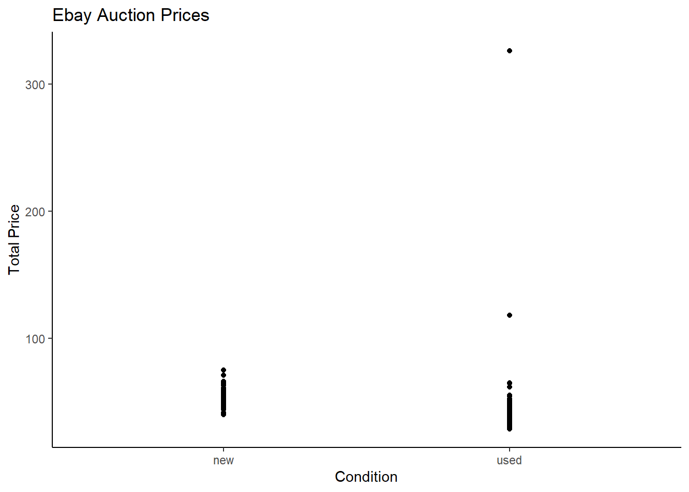
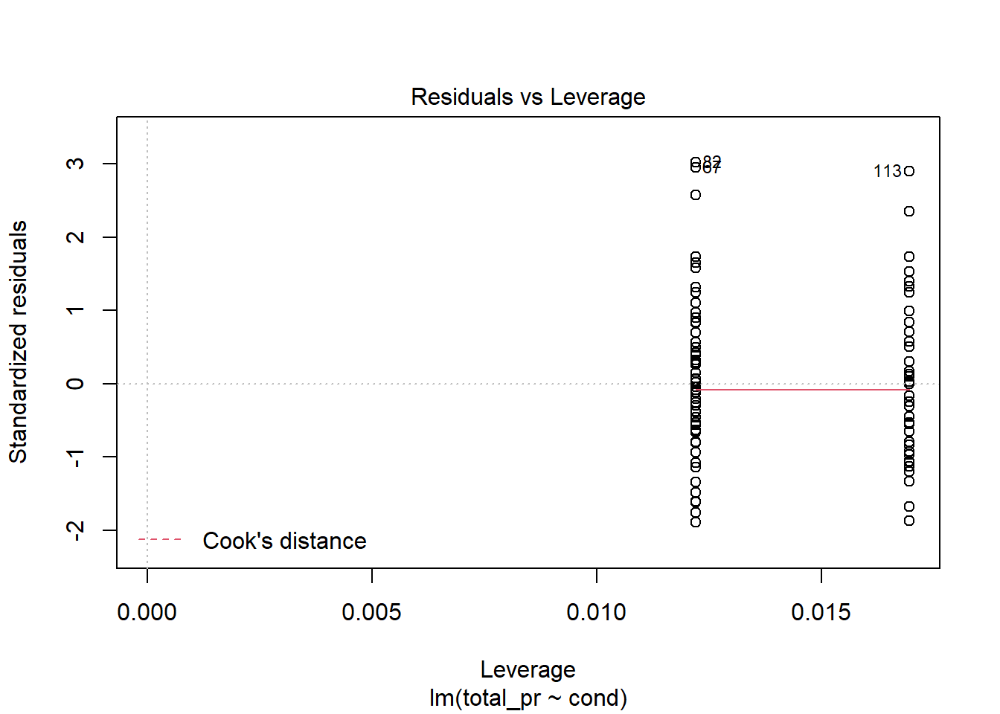
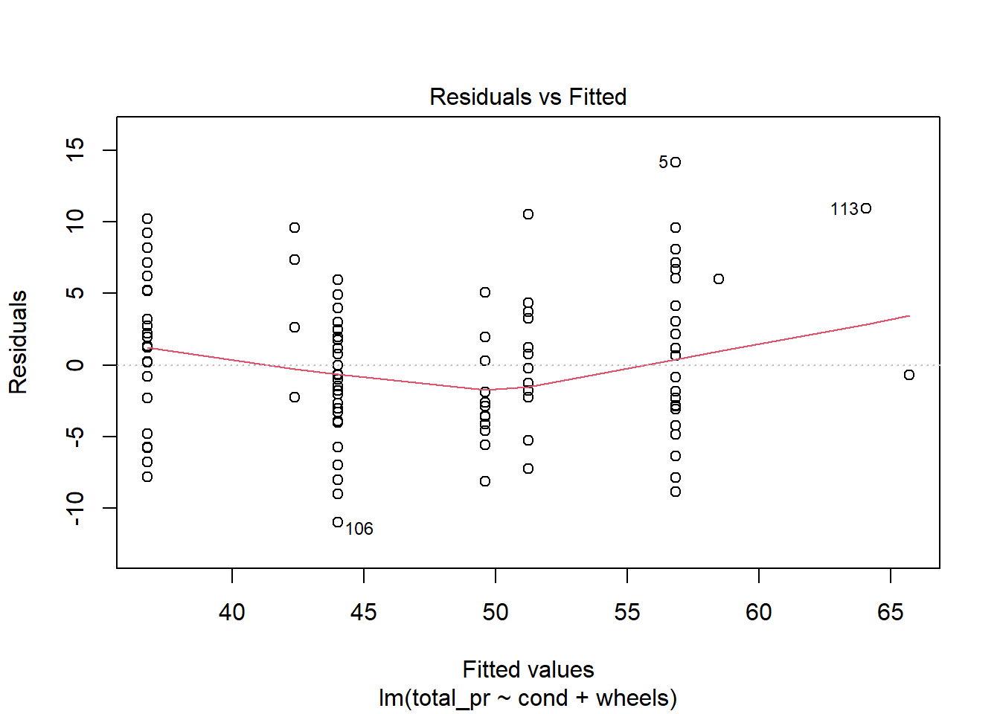
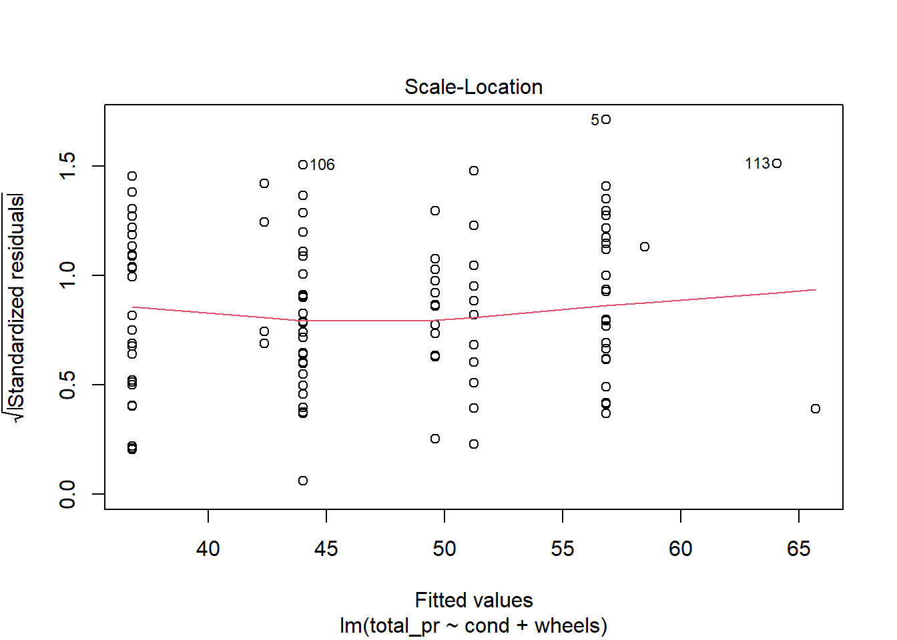
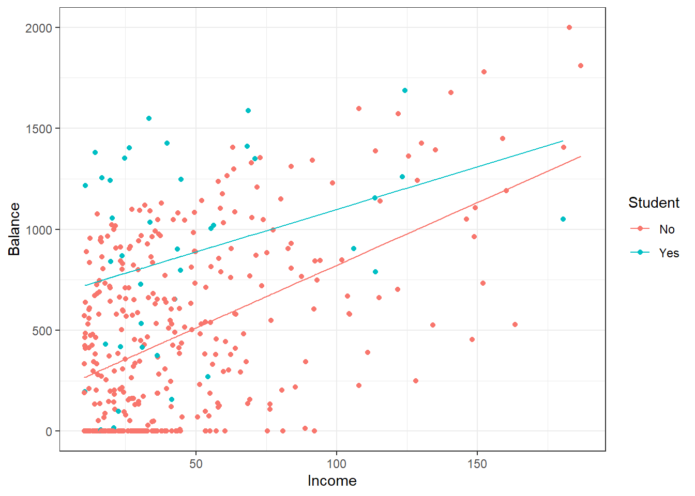
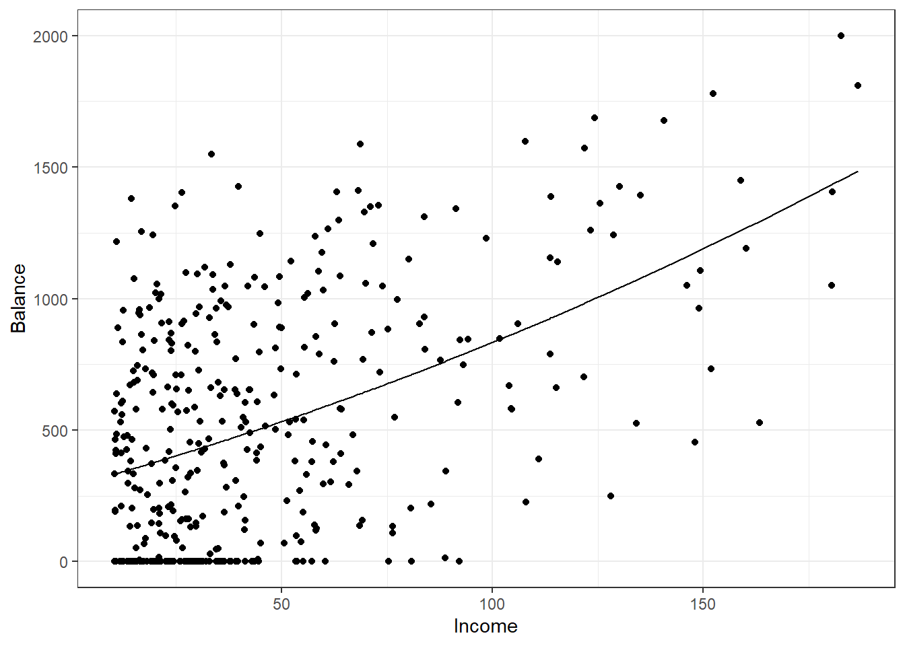

# Multiple Linear Regression {#LRMULTI}

## Objectives

1) Create and interpret a model with multiple predictors and check assumptions.  
2) Generate and interpret confidence intervals for estimates.  
3) Explain adjusted $R^2$ and multi-collinearity.  
4) Interpret regression coefficients for a linear model with multiple predictors.    
5) Build and interpret models with higher order terms.

## Introduction to multiple regression  

The principles of simple linear regression lay the foundation for more sophisticated regression methods used in a wide range of challenging settings. In our last two chapters, we will explore multiple regression, which introduces the possibility of more than one predictor.

## Multiple regression  

Multiple regression extends simple two-variable regression to the case that still has one response but many predictors (denoted $x_1$, $x_2$, $x_3$, ...). The method is motivated by scenarios where many variables may be simultaneously connected to an output.

To explore and explain these ideas, we will consider Ebay auctions of a video game called **Mario Kart** for the Nintendo Wii. The outcome variable of interest is the total price of an auction, which is the highest bid plus the shipping cost. We will try to determine how total price is related to each characteristic in an auction while simultaneously controlling for other variables. For instance, with all other characteristics held constant, are longer auctions associated with higher or lower prices? And, on average, how much more do buyers tend to pay for additional Wii wheels (plastic steering wheels that attach to the Wii controller) in auctions? Multiple regression will help us answer these and other questions.

The data set is in the file `mariokart.csv` in the `data` folder. This data set includes results from 141 auctions.^[Diez DM, Barr CD, and \c{C}etinkaya-Rundel M. 2012. `openintro`: OpenIntro data sets and supplemental functions. http://cran.r-project.org/web/packages/openintro] Ten observations from this data set are shown in the `R` code below. Note that we force the first column to be interpreted as a character string since it is the identification code for each sale and has no numeric meaning. Just as in the case of simple linear regression, multiple regression also allows for categorical variables with many levels. Although we do have this type of variable in this data set, we will leave the discussion of these types of variables in multiple regression for advanced regression or machine learning courses.


```r
mariokart <-read_csv("data/mariokart.csv", col_types = list(col_character()))
head(mariokart,n=10)
```

```
## # A tibble: 10 x 12
##    id        duration n_bids cond  start_pr ship_pr total_pr ship_sp seller_rate
##    <chr>        <dbl>  <dbl> <chr>    <dbl>   <dbl>    <dbl> <chr>         <dbl>
##  1 15037742~        3     20 new       0.99    4        51.6 standa~        1580
##  2 26048337~        7     13 used      0.99    3.99     37.0 firstC~         365
##  3 32043234~        3     16 new       0.99    3.5      45.5 firstC~         998
##  4 28040522~        3     18 new       0.99    0        44   standa~           7
##  5 17039222~        1     20 new       0.01    0        71   media           820
##  6 36019515~        3     19 new       0.99    4        45   standa~      270144
##  7 12047772~        1     13 used      0.01    0        37.0 standa~        7284
##  8 30035550~        1     15 new       1       2.99     54.0 upsGro~        4858
##  9 20039206~        3     29 used      0.99    4        47   priori~          27
## 10 33036416~        7      8 used     20.0     4        50   firstC~         201
## # ... with 3 more variables: stock_photo <chr>, wheels <dbl>, title <chr>
```

We are only interested in `total_pr`, `cond`, `stock_photo`, `duration`, and `wheels`. These variables are described in the following list:

1. `total_pr`: final auction price plus shipping costs, in US dollars  
2. `cond`: a two-level categorical factor variable  
3. `stock_photo`: a two-level categorical factor variable  
4. `duration`: the length of the auction, in days, taking values from 1 to 10  
5. `wheels`: the number of Wii wheels included with the auction (a **Wii wheel** is a plastic racing wheel that holds the Wii controller and is an optional but helpful accessory for playing Mario Kart)   

### A single-variable model for the Mario Kart data  

Let's fit a linear regression model with the game's condition as a predictor of auction price. Before we start let's change `cond` and `stock_photo` into factors.


```r
mariokart <- mariokart %>%
  mutate(cond=factor(cond),stock_photo=factor(stock_photo))
```

Next let's summarize the data.


```r
inspect(mariokart)
```

```
## 
## categorical variables:  
##          name     class levels   n missing
## 1          id character    143 143       0
## 2        cond    factor      2 143       0
## 3     ship_sp character      8 143       0
## 4 stock_photo    factor      2 143       0
## 5       title character     80 142       1
##                                    distribution
## 1 110439174663 (0.7%) ...                      
## 2 used (58.7%), new (41.3%)                    
## 3 standard (23.1%), upsGround (21.7%) ...      
## 4 yes (73.4%), no (26.6%)                      
## 5  (%) ...                                     
## 
## quantitative variables:  
##             name   class   min      Q1 median      Q3       max         mean
## ...1    duration numeric  1.00   1.000    3.0    7.00     10.00     3.769231
## ...2      n_bids numeric  1.00  10.000   14.0   17.00     29.00    13.538462
## ...3    start_pr numeric  0.01   0.990    1.0   10.00     69.95     8.777203
## ...4     ship_pr numeric  0.00   0.000    3.0    4.00     25.51     3.143706
## ...5    total_pr numeric 28.98  41.175   46.5   53.99    326.51    49.880490
## ...6 seller_rate numeric  0.00 109.000  820.0 4858.00 270144.00 15898.419580
## ...7      wheels numeric  0.00   0.000    1.0    2.00      4.00     1.146853
##                sd   n missing
## ...1 2.585693e+00 143       0
## ...2 5.878786e+00 143       0
## ...3 1.506745e+01 143       0
## ...4 3.213179e+00 143       0
## ...5 2.568856e+01 143       0
## ...6 5.184032e+04 143       0
## ...7 8.471829e-01 143       0
```

Finally, let's plot the data.


```r
mariokart %>% 
  gf_boxplot(total_pr~cond) %>%
  gf_theme(theme_bw()) %>%
  gf_labs(title="Ebay Auction Prices",x="Condition", y="Total Price")
```

<div class="figure">

<p class="caption">(\#fig:box301-fig)Total price of Mario Kart on Ebay for each condition.</p>
</div>

We have several outliers that may impact our analysis, Figure \@ref(fig:box301-fig).

Now let's build the model.


```r
mario_mod <- lm(total_pr~cond,data=mariokart)
```


```r
summary(mario_mod)
```

```
## 
## Call:
## lm(formula = total_pr ~ cond, data = mariokart)
## 
## Residuals:
##     Min      1Q  Median      3Q     Max 
## -18.168  -7.771  -3.148   1.857 279.362 
## 
## Coefficients:
##             Estimate Std. Error t value Pr(>|t|)    
## (Intercept)   53.771      3.329  16.153   <2e-16 ***
## condused      -6.623      4.343  -1.525     0.13    
## ---
## Signif. codes:  0 '***' 0.001 '**' 0.01 '*' 0.05 '.' 0.1 ' ' 1
## 
## Residual standard error: 25.57 on 141 degrees of freedom
## Multiple R-squared:  0.01622,	Adjusted R-squared:  0.009244 
## F-statistic: 2.325 on 1 and 141 DF,  p-value: 0.1296
```

The model may be written as  

$$
\hat{\text{totalprice}} = 53.771 - 6.623 \times \text{condused}
$$  

A scatterplot for price versus game condition is shown in Figure \@ref(fig:scat301-fig). Since the predictor is binary, the scatterplot is not appropriate but we will look at it for reference.  


```r
mariokart %>%
  gf_point(total_pr~cond) %>%
  gf_theme(theme_classic()) %>%
  gf_labs(title="Ebay Auction Prices",x="Condition", y="Total Price")
```

<div class="figure">

<p class="caption">(\#fig:scat301-fig)Scatterplot of total price of Mario Kart on Ebay versus condition.</p>
</div>

The largest outlier probably is significantly impacting the relationship in the model. If we find the mean and median for the two groups, we will see this.


```r
mariokart %>%
  group_by(cond) %>%
  summarize(xbar=mean(total_pr), stand_dev=sd(total_pr),xmedian=median(total_pr))
```

```
## # A tibble: 2 x 4
##   cond   xbar stand_dev xmedian
##   <fct> <dbl>     <dbl>   <dbl>
## 1 new    53.8      7.44    54.0
## 2 used   47.1     32.7     42.8
```

It appears that **used** items have a right skewed distribution where their average is higher because of at least one of the outliers.

There are at least two outliers in the plot. Let's gather more information about them.


```r
mariokart %>%
  filter(total_pr > 100)
```

```
## # A tibble: 2 x 12
##   id         duration n_bids cond  start_pr ship_pr total_pr ship_sp seller_rate
##   <chr>         <dbl>  <dbl> <fct>    <dbl>   <dbl>    <dbl> <chr>         <dbl>
## 1 110439174~        7     22 used      1       25.5     327. parcel          115
## 2 130335427~        3     27 used      6.95     4       118. parcel           41
## # ... with 3 more variables: stock_photo <fct>, wheels <dbl>, title <chr>
```

If you look at the variable `title` there were additional items in the sale for these two observations. Let's remove those two outliers and run the model again. Note that the reason we are removing them is not because they are annoying us and messing up our model. It is because we don't think they are representative of the population of interest. Figure \@ref(fig:scat302-fig) is a boxplot of the data with the outliers dropped.


```r
mariokart_new <- mariokart %>%
  filter(total_pr <= 100) %>% 
  select(total_pr,cond,stock_photo,duration,wheels)
```


```r
summary(mariokart_new)
```

```
##     total_pr       cond    stock_photo    duration          wheels     
##  Min.   :28.98   new :59   no : 36     Min.   : 1.000   Min.   :0.000  
##  1st Qu.:41.00   used:82   yes:105     1st Qu.: 1.000   1st Qu.:0.000  
##  Median :46.03                         Median : 3.000   Median :1.000  
##  Mean   :47.43                         Mean   : 3.752   Mean   :1.149  
##  3rd Qu.:53.99                         3rd Qu.: 7.000   3rd Qu.:2.000  
##  Max.   :75.00                         Max.   :10.000   Max.   :4.000
```


```r
mariokart_new %>% 
  gf_boxplot(total_pr~cond) %>%
  gf_theme(theme_bw()) %>%
  gf_labs(title="Ebay Auction Prices",subtitle="Outliers removed",x="Condition", y="Total Price")
```

<div class="figure">

<p class="caption">(\#fig:scat302-fig)Boxplot of total price and condition with outliers removed.</p>
</div>


```r
mario_mod2 <- lm(total_pr~cond,data=mariokart_new)
```


```r
summary(mario_mod2)
```

```
## 
## Call:
## lm(formula = total_pr ~ cond, data = mariokart_new)
## 
## Residuals:
##      Min       1Q   Median       3Q      Max 
## -13.8911  -5.8311   0.1289   4.1289  22.1489 
## 
## Coefficients:
##             Estimate Std. Error t value Pr(>|t|)    
## (Intercept)  53.7707     0.9596  56.034  < 2e-16 ***
## condused    -10.8996     1.2583  -8.662 1.06e-14 ***
## ---
## Signif. codes:  0 '***' 0.001 '**' 0.01 '*' 0.05 '.' 0.1 ' ' 1
## 
## Residual standard error: 7.371 on 139 degrees of freedom
## Multiple R-squared:  0.3506,	Adjusted R-squared:  0.3459 
## F-statistic: 75.03 on 1 and 139 DF,  p-value: 1.056e-14
```

Notice how much the residual standard error has decreased and likewise the $R$-squared has increased.   

The model may be written as:  

$$
\hat{total price} = 53.771 - 10.90 \times condused
$$

Now we see that the average price for a used items is \$10.90 less than the average of new items. 

> **Exercise**:  
Does the linear model seem reasonable? Which assumptions should you check?

The model does seem reasonable in the sense that the assumptions on the errors is plausible. The residuals indicate some skewness to the right which may be driven predominantly by the skewness in the new items, Figure \@ref(fig:qq301-fig). 


```r
plot(mario_mod2,2)
```

<div class="figure">

<p class="caption">(\#fig:qq301-fig)Check of normality using quantile-quantile plot.</p>
</div>

The normality assumption is somewhat suspect but we have more than 100 data points so the short tails of the distribution are not a concern. The shape of this curve indicates a positive skew.


```r
plot(mario_mod2,3)
```

<div class="figure">

<p class="caption">(\#fig:diag301-fig)Residual plot to assess equal variance assumption.</p>
</div>

From Figure \@ref(fig:diag301-fig), equal variance seems reasonable. 


```r
plot(mario_mod2,5)
```

<div class="figure">

<p class="caption">(\#fig:diag302-fig)Residual plot for checking leverage points.</p>
</div>

No high leverage points, Figure \@ref(fig:diag302-fig). 

No need to check linearity, we only have two different values for the explanatory variable.

> *Example*: Interpretation  
Interpret the coefficient for the game's condition in the model. Is this coefficient significantly different from 0?

Note that `cond` is a two-level categorical variable and the reference level is `new`. So - 10.90 means that the model predicts an extra \$10.90 on average for those games that are new versus those that are used. Examining the regression output, we can see that the $p$-value for `cond` is very close to zero, indicating there is strong evidence that the coefficient is different from zero when using this simple one-variable model.

### Including and assessing many variables in a model  

Sometimes there are underlying structures or relationships between predictor variables. For instance, new games sold on Ebay tend to come with more Wii wheels, which may have led to higher prices for those auctions. We would like to fit a model that includes all potentially important variables simultaneously. This would help us evaluate the relationship between a predictor variable and the outcome while controlling for the potential influence of other variables. This is the strategy used in **multiple regression**. While we remain cautious about making any causal interpretations using multiple regression, such models are a common first step in providing evidence of a causal connection.

We want to construct a model that accounts for not only the game condition, but simultaneously accounts for three other variables: `stock_photo`, `duration`, and `wheels`. This model can be represented as:

$$
\widehat{\text{totalprice}}
	= \beta_0 + \beta_1 \times \text{cond} + \beta_2 \times \text{stockphoto} 
	+ \beta_3 \times  \text{duration} +
		\beta_4 \times  \text{wheels} 
$$	

or:

\begin{equation} 
 \hat{y}
	= \beta_0 + \beta_1 x_1 + \beta_2 x_2 +
		\beta_3 x_3 + \beta_4 x_4
  (\#eq:multilr)
\end{equation} 


In Equation \@ref(eq:multilr), $y$ represents the total price, $x_1$ indicates whether the game is new, $x_2$ indicates whether a stock photo was used, $x_3$ is the duration of the auction, and $x_4$ is the number of Wii wheels included with the game. Just as with the single predictor case, a multiple regression model may be missing important components or it might not precisely represent the relationship between the outcome and the available explanatory variables. While no model is perfect, we wish to explore the possibility that this model may fit the data reasonably well.

We estimate the parameters $\beta_0$, $\beta_1$, ..., $\beta_4$ in the same way as we did in the case of a single predictor. We select $b_0$, $b_1$, ..., $b_4$ that minimize the sum of the squared residuals:

$$
\text{SSE} = e_1^2 + e_2^2 + \dots + e_{141}^2
	= \sum_{i=1}^{141} e_i^2
	 = \sum_{i=1}^{141} \left(y_i - \hat{y}_i\right)^2
$$  

In our problem, there are 141 residuals, one for each observation. We use a computer to minimize the sum and compute point estimates.


```r
mario_mod_multi <- lm(total_pr~., data=mariokart_new)
```

The formula `total_pr~.` uses a *dot*. This means we want to use all the predictors. We could have also used the following code:


```r
mario_mod_multi <- lm(total_pr~cond+stock_photo+duration+wheels, data=mariokart_new)
```

Recall, the `+` symbol does not mean to literally add the predictors together. It is not a mathematical operation but a formula operation that means to include the predictor.

You can view a summary of the model using the `summmary()` function.


```r
summary(mario_mod_multi)
```

```
## 
## Call:
## lm(formula = total_pr ~ ., data = mariokart_new)
## 
## Residuals:
##      Min       1Q   Median       3Q      Max 
## -11.3788  -2.9854  -0.9654   2.6915  14.0346 
## 
## Coefficients:
##                Estimate Std. Error t value Pr(>|t|)    
## (Intercept)    41.34153    1.71167  24.153  < 2e-16 ***
## condused       -5.13056    1.05112  -4.881 2.91e-06 ***
## stock_photoyes  1.08031    1.05682   1.022    0.308    
## duration       -0.02681    0.19041  -0.141    0.888    
## wheels          7.28518    0.55469  13.134  < 2e-16 ***
## ---
## Signif. codes:  0 '***' 0.001 '**' 0.01 '*' 0.05 '.' 0.1 ' ' 1
## 
## Residual standard error: 4.901 on 136 degrees of freedom
## Multiple R-squared:  0.719,	Adjusted R-squared:  0.7108 
## F-statistic: 87.01 on 4 and 136 DF,  p-value: < 2.2e-16
```

Which we can summarize in a tibble using the **broom** package.  

<table>
<caption>(\#tab:tab301)Multiple regression coefficients.</caption>
 <thead>
  <tr>
   <th style="text-align:left;"> term </th>
   <th style="text-align:right;"> estimate </th>
   <th style="text-align:right;"> std.error </th>
   <th style="text-align:right;"> statistic </th>
   <th style="text-align:right;"> p.value </th>
  </tr>
 </thead>
<tbody>
  <tr>
   <td style="text-align:left;"> (Intercept) </td>
   <td style="text-align:right;"> 41.3415318 </td>
   <td style="text-align:right;"> 1.7116684 </td>
   <td style="text-align:right;"> 24.1527693 </td>
   <td style="text-align:right;"> 0.0000000 </td>
  </tr>
  <tr>
   <td style="text-align:left;"> condused </td>
   <td style="text-align:right;"> -5.1305641 </td>
   <td style="text-align:right;"> 1.0511238 </td>
   <td style="text-align:right;"> -4.8810276 </td>
   <td style="text-align:right;"> 0.0000029 </td>
  </tr>
  <tr>
   <td style="text-align:left;"> stock_photoyes </td>
   <td style="text-align:right;"> 1.0803108 </td>
   <td style="text-align:right;"> 1.0568238 </td>
   <td style="text-align:right;"> 1.0222241 </td>
   <td style="text-align:right;"> 0.3084897 </td>
  </tr>
  <tr>
   <td style="text-align:left;"> duration </td>
   <td style="text-align:right;"> -0.0268075 </td>
   <td style="text-align:right;"> 0.1904122 </td>
   <td style="text-align:right;"> -0.1407868 </td>
   <td style="text-align:right;"> 0.8882467 </td>
  </tr>
  <tr>
   <td style="text-align:left;"> wheels </td>
   <td style="text-align:right;"> 7.2851779 </td>
   <td style="text-align:right;"> 0.5546928 </td>
   <td style="text-align:right;"> 13.1337172 </td>
   <td style="text-align:right;"> 0.0000000 </td>
  </tr>
</tbody>
</table>

Using this output, Table \@ref(tab:tab301), we identify the point estimates $b_i$ of each $\beta_i$, just as we did in the one-predictor case.


> **Multiple regression model**  
A multiple regression model is a linear model with many predictors. 

In general, we write the model as

$$
\hat{y} = \beta_0 + \beta_1 x_1 + \beta_2 x_2 + \cdots + \beta_k x_k %+ \epsilon
$$

when there are $k$ predictors. We often estimate the $\beta_i$ parameters using a computer.

> **Exercise**: 
Write out the the multiple regression model using the point estimates from regression output. How many predictors are there in this model?^[$\hat{y} = 41.34 + - 5.13x_1 + 1.08x_2 - 0.03x_3 + 7.29x_4$, and there are $k=4$ predictor variables.]

> **Exercise**:  
What does $\beta_4$, the coefficient of variable $x_4$ (Wii wheels), represent? What is the point estimate of $\beta_4$?^[It is the average difference in auction price for each additional Wii wheel included when holding the other variables constant. The point estimate is $b_4 = 7.29$.]  


>**Exercise**:  
Compute the residual of the first observation in the dataframe using the regression equation. 


```r
mario_mod_multi$residuals[1]
```

```
##        1 
## 1.923402
```

The **broom** package has a function `augment()` that will calculate the predicted and residuals.


```r
library(broom)
```


```r
augment(mario_mod_multi) %>%
  head(1)
```

```
## # A tibble: 1 x 11
##   total_pr cond  stock_photo duration wheels .fitted .resid   .hat .sigma
##      <dbl> <fct> <fct>          <dbl>  <dbl>   <dbl>  <dbl>  <dbl>  <dbl>
## 1     51.6 new   yes                3      1    49.6   1.92 0.0215   4.92
## # ... with 2 more variables: .cooksd <dbl>, .std.resid <dbl>
```


$e_i = y_i - \hat{y_i} = 51.55 - 49.62 = 1.93$

>*Example*:  
We estimated a coefficient for `cond` as $b_1 = - 10.90$ with a standard error of $SE_{b_1} = 1.26$ when using simple linear regression. Why might there be a difference between that estimate and the one in the multiple regression setting?

If we examined the data carefully, we would see that some predictors are correlated. For instance, when we estimated the connection of the outcome `total_pr` and predictor `cond` using simple linear regression, we were unable to control for other variables like the number of Wii wheels included in the auction. That model was biased by the confounding variable `wheels`. When we use both variables, this particular underlying and unintentional bias is reduced or eliminated (though bias from other confounding variables may still remain).

The previous example describes a common issue in multiple regression: correlation among predictor variables. We say the two predictor variables are **collinear** (pronounced as **co-linear**) when they are correlated, and this collinearity complicates model estimation. While it is impossible to prevent collinearity from arising in observational data, experiments are usually designed to prevent predictors from being collinear.

> **Exercise**:  
The estimated value of the intercept is 41.34, and one might be tempted to make some interpretation of this coefficient, such as, it is the model's predicted price when each of the variables take a value of zero: the game is new, the primary image is not a stock photo, the auction duration is zero days, and there are no wheels included. Is there any value gained by making this interpretation?^[Three of the variables (`cond`, `stock_photo`, and `wheels`) do take value 0, but the auction duration is always one or more days. If the auction is not up for any days, then no one can bid on it! That means the total auction price would always be zero for such an auction; the interpretation of the intercept in this setting is not insightful.]

### Inference  

From the printout of the model summary, we can see that both the `stock_photo` and `duration` variables are not significantly different from zero. Thus we may want to drop them from the model. In a machine learning course, you explore different ways to determine the best model. 

Likewise, we could generate confidence intervals for the coefficients:


```r
confint(mario_mod_multi)
```

```
##                     2.5 %     97.5 %
## (Intercept)    37.9566036 44.7264601
## condused       -7.2092253 -3.0519030
## stock_photoyes -1.0096225  3.1702442
## duration       -0.4033592  0.3497442
## wheels          6.1882392  8.3821165
```

This confirms that the `stock_photo` and `duration` may not have an impact on total price.

### Adjusted $R^2$ as a better estimate of explained variance

We first used $R^2$ in simple linear regression to determine the amount of variability, we used sum of squares and not mean squared errors, in the response that was explained by the model:
$$
R^2 = 1 - \frac{\text{sum of squares of residuals}}{\text{sum of squares of the outcome}}
$$
This equation remains valid in the multiple regression framework, but a small enhancement can often be even more informative.

>**Exercise**:
The variance of the residuals for the model is $4.901^2$, and the variance of the total price in all the auctions is 83.06. Estimate the $R^2$ for this model.^[$R^2 = 1 - \frac{24.0198}{83.06} = 0.7108$.]

To get the $R^2$ we need the sum of squares and not variance, so we multiply by the appropriate degrees of freedom.  


```r
1-(24.0198*136)/(83.05864*140)
```

```
## [1] 0.7190717
```


```r
summary(mario_mod_multi)$r.squared
```

```
## [1] 0.7190261
```


This strategy for estimating $R^2$ is acceptable when there is just a single variable. However, it becomes less helpful when there are many variables. The regular $R^2$ is actually a biased estimate of the amount of variability explained by the model. To get a better estimate, we use the adjusted $R^2$.

>**Adjusted $\mathbf{R^2}$ as a tool for model assessment**:    
The adjusted $\mathbf{R^2}$ is computed as: 
$$
R_{adj}^{2} = 1-\frac{\text{sum of squares of residuals} / (n-k-1)}{\text{sum of squares of the outcome} / (n-1)}
$$
where $n$ is the number of cases used to fit the model and $k$ is the number of predictor variables in the model.

Because $k$ is never negative, the adjusted $R^2$ will be smaller -- often times just a little smaller -- than the unadjusted $R^2$. The reasoning behind the adjusted $R^2$ lies in the **degrees of freedom** associated with each variance. ^[In multiple regression, the degrees of freedom associated with the variance of the estimate of the residuals is $n-k-1$, not $n-1$. For instance, if we were to make predictions for new data using our current model, we would find that the unadjusted $R^2$ is an overly optimistic estimate of the reduction in variance in the response, and using the degrees of freedom in the adjusted $R^2$ formula helps correct this bias.]

> **Exercise**:  
Suppose you added another predictor to the model, but the variance of the errors didn't go down. What would happen to the $R^2$? What would happen to the adjusted $R^2$?^[The unadjusted $R^2$ would stay the same and the adjusted $R^2$ would go down. Note that unadjusted $R^2$ never decreases by adding another predictor, it can only stay the same or increase. The adjusted $R^2$ increases only if the addition of a predictor reduces the variance of the error larger than add one to $k$ in denominator.]

Again, in a machine learning course, you will spend more time on how to select models. Using internal metrics of performance such as $p$-values or adjusted $R$ squared are one way but using external measures of predictive performance such as **cross validation** or **hold out** sets will be introduced.

### Reduced model

Now let's drop `duration` from the model and compare to our previous model:


```r
mario_mod_multi2 <- lm(total_pr~cond+stock_photo+wheels, data=mariokart_new)
```

And the summary:


```r
summary(mario_mod_multi2)
```

```
## 
## Call:
## lm(formula = total_pr ~ cond + stock_photo + wheels, data = mariokart_new)
## 
## Residuals:
##     Min      1Q  Median      3Q     Max 
## -11.454  -2.959  -0.949   2.712  14.061 
## 
## Coefficients:
##                Estimate Std. Error t value Pr(>|t|)    
## (Intercept)     41.2245     1.4911  27.648  < 2e-16 ***
## condused        -5.1763     0.9961  -5.196 7.21e-07 ***
## stock_photoyes   1.1177     1.0192   1.097    0.275    
## wheels           7.2984     0.5448  13.397  < 2e-16 ***
## ---
## Signif. codes:  0 '***' 0.001 '**' 0.01 '*' 0.05 '.' 0.1 ' ' 1
## 
## Residual standard error: 4.884 on 137 degrees of freedom
## Multiple R-squared:  0.719,	Adjusted R-squared:  0.7128 
## F-statistic: 116.8 on 3 and 137 DF,  p-value: < 2.2e-16
```
As a reminder, the previous model summary is:


```r
summary(mario_mod_multi)
```

```
## 
## Call:
## lm(formula = total_pr ~ ., data = mariokart_new)
## 
## Residuals:
##      Min       1Q   Median       3Q      Max 
## -11.3788  -2.9854  -0.9654   2.6915  14.0346 
## 
## Coefficients:
##                Estimate Std. Error t value Pr(>|t|)    
## (Intercept)    41.34153    1.71167  24.153  < 2e-16 ***
## condused       -5.13056    1.05112  -4.881 2.91e-06 ***
## stock_photoyes  1.08031    1.05682   1.022    0.308    
## duration       -0.02681    0.19041  -0.141    0.888    
## wheels          7.28518    0.55469  13.134  < 2e-16 ***
## ---
## Signif. codes:  0 '***' 0.001 '**' 0.01 '*' 0.05 '.' 0.1 ' ' 1
## 
## Residual standard error: 4.901 on 136 degrees of freedom
## Multiple R-squared:  0.719,	Adjusted R-squared:  0.7108 
## F-statistic: 87.01 on 4 and 136 DF,  p-value: < 2.2e-16
```

Notice that the adjusted $R^2$ improved by dropping `duration`. Finally, let's drop `stock_photo`.


```r
mario_mod_multi3 <- lm(total_pr~cond+wheels, data=mariokart_new)
```


```r
summary(mario_mod_multi3)
```

```
## 
## Call:
## lm(formula = total_pr ~ cond + wheels, data = mariokart_new)
## 
## Residuals:
##      Min       1Q   Median       3Q      Max 
## -11.0078  -3.0754  -0.8254   2.9822  14.1646 
## 
## Coefficients:
##             Estimate Std. Error t value Pr(>|t|)    
## (Intercept)  42.3698     1.0651  39.780  < 2e-16 ***
## condused     -5.5848     0.9245  -6.041 1.35e-08 ***
## wheels        7.2328     0.5419  13.347  < 2e-16 ***
## ---
## Signif. codes:  0 '***' 0.001 '**' 0.01 '*' 0.05 '.' 0.1 ' ' 1
## 
## Residual standard error: 4.887 on 138 degrees of freedom
## Multiple R-squared:  0.7165,	Adjusted R-squared:  0.7124 
## F-statistic: 174.4 on 2 and 138 DF,  p-value: < 2.2e-16
```

Though the adjusted $R^2$ dropped a little, it is only in the fourth decimal place and thus essentially the same value. We therefore will go with this model. 

### Confidence and prediction intervals

Let's suppose we want to predict the average total price for a Mario Kart sale with 2 wheels and in new condition. We can again use the `predict()` function.


```r
predict(mario_mod_multi3,newdata=data.frame(cond="new",wheels=2),interval = "confidence")
```

```
##        fit      lwr      upr
## 1 56.83544 55.49789 58.17299
```

We are 95\% confident that the average price of a Mario Kart sale for a new item with 2 wheels will be between 55.50 and 58.17.

>**Exercise**:
Find and interpret the prediction interval for a new Mario Kart with 2 wheels.  


```r
predict(mario_mod_multi3,newdata=data.frame(cond="new",wheels=2),interval = "prediction")
```

```
##        fit      lwr      upr
## 1 56.83544 47.07941 66.59147
```
We are 95\% confident that the price of a Mario Kart sale for a new item with 2 wheels will be between 47.07 and 66.59.

### Diagnostics

The diagnostics for the model are similar to what we did in a previous lesson. Nothing in these plots gives us concern; however, there is one leverage point, Figure \@ref(fig:diag305-fig).


```r
plot(mario_mod_multi3)
```

<div class="figure">

<p class="caption">(\#fig:diag305-fig)Diagnostic residual plots for multiple regression model.</p>
</div>


## Interaction and Higher Order Terms

As a final short topic we want to explore **feature engineering**. Thus far we have not done any transformation to the predictors in the data set except maybe making categorical variables into factors. In data analysis competitions, such as Kaggle, feature engineering is often one of the most important steps. In a machine learning course, you will look at different tools but in this book we will look at simple transformations such as higher order terms and interactions. 

To make this section more relevant, we are going to switch to a different data set. Load the library **ISLR**.


```r
library(ISLR)
```

The data set of interest is `Credit`. Use the help menu to read about the variables. This is a simulated data set of credit card debt.


```r
glimpse(Credit)
```

```
## Rows: 400
## Columns: 12
## $ ID        <int> 1, 2, 3, 4, 5, 6, 7, 8, 9, 10, 11, 12, 13, 14, 15, 16, 17, 1~
## $ Income    <dbl> 14.891, 106.025, 104.593, 148.924, 55.882, 80.180, 20.996, 7~
## $ Limit     <int> 3606, 6645, 7075, 9504, 4897, 8047, 3388, 7114, 3300, 6819, ~
## $ Rating    <int> 283, 483, 514, 681, 357, 569, 259, 512, 266, 491, 589, 138, ~
## $ Cards     <int> 2, 3, 4, 3, 2, 4, 2, 2, 5, 3, 4, 3, 1, 1, 2, 3, 3, 3, 1, 2, ~
## $ Age       <int> 34, 82, 71, 36, 68, 77, 37, 87, 66, 41, 30, 64, 57, 49, 75, ~
## $ Education <int> 11, 15, 11, 11, 16, 10, 12, 9, 13, 19, 14, 16, 7, 9, 13, 15,~
## $ Gender    <fct>  Male, Female,  Male, Female,  Male,  Male, Female,  Male, F~
## $ Student   <fct> No, Yes, No, No, No, No, No, No, No, Yes, No, No, No, No, No~
## $ Married   <fct> Yes, Yes, No, No, Yes, No, No, No, No, Yes, Yes, No, Yes, Ye~
## $ Ethnicity <fct> Caucasian, Asian, Asian, Asian, Caucasian, Caucasian, Africa~
## $ Balance   <int> 333, 903, 580, 964, 331, 1151, 203, 872, 279, 1350, 1407, 0,~
```

Notice that `ID` is being treated as an integer. We could change it to a character since it is a label, but for our work in this chapter we will not bother.  

Suppose we suspected that there is a relationship between `Balance`, the response, and the predictors `Income` and `Student`. Note: we actually are using this model for educational purposes and did not go through a model selection process. 

The first model simply has these predictors in the model.


```r
credit_mod1<-lm(Balance~Income+Student,data=Credit)
```


```r
summary(credit_mod1)
```

```
## 
## Call:
## lm(formula = Balance ~ Income + Student, data = Credit)
## 
## Residuals:
##     Min      1Q  Median      3Q     Max 
## -762.37 -331.38  -45.04  323.60  818.28 
## 
## Coefficients:
##             Estimate Std. Error t value Pr(>|t|)    
## (Intercept) 211.1430    32.4572   6.505 2.34e-10 ***
## Income        5.9843     0.5566  10.751  < 2e-16 ***
## StudentYes  382.6705    65.3108   5.859 9.78e-09 ***
## ---
## Signif. codes:  0 '***' 0.001 '**' 0.01 '*' 0.05 '.' 0.1 ' ' 1
## 
## Residual standard error: 391.8 on 397 degrees of freedom
## Multiple R-squared:  0.2775,	Adjusted R-squared:  0.2738 
## F-statistic: 76.22 on 2 and 397 DF,  p-value: < 2.2e-16
```

Let's plot the data and the regression line. The impact of putting in the categorical variable `Student` is to just shift the intercept. The slope remains the same, Figure \@ref(fig:scat305-fig).


```r
augment(credit_mod1) %>%
  gf_point(Balance~Income,color=~Student) %>%
  gf_line(.fitted~Income,data=subset(augment(credit_mod1), Student == "Yes"),color=~Student)%>%
  gf_line(.fitted~Income,data=subset(augment(credit_mod1), Student == "No"),color=~Student) %>%
  gf_theme(theme_bw())
```

<div class="figure">

<p class="caption">(\#fig:scat305-fig)Scatterplot of credit card balance for income and student status.</p>
</div>

>**Exercise**:  
Write the equation for the regression model.

$$
\mbox{E}(Balance)=\beta_0 + \beta_1*\text{Income}+ \beta_2*\text{(Student=Yes)} 
$$

or 

$$
\mbox{E}(Balance)=211.14 + 5.98*\text{Income}+ 382.67*\text{(Student=Yes)} 
$$

If the observation is a student, then the intercept is increased by 382.67.

In this next case, we would want to include an interaction term in the model: an **interaction** term allows the slope to change as well. To include an interaction term when building a model in `R`, we use `*`. 


```r
credit_mod2<-lm(Balance~Income*Student,data=Credit)
```


```r
summary(credit_mod2)
```

```
## 
## Call:
## lm(formula = Balance ~ Income * Student, data = Credit)
## 
## Residuals:
##     Min      1Q  Median      3Q     Max 
## -773.39 -325.70  -41.13  321.65  814.04 
## 
## Coefficients:
##                   Estimate Std. Error t value Pr(>|t|)    
## (Intercept)       200.6232    33.6984   5.953 5.79e-09 ***
## Income              6.2182     0.5921  10.502  < 2e-16 ***
## StudentYes        476.6758   104.3512   4.568 6.59e-06 ***
## Income:StudentYes  -1.9992     1.7313  -1.155    0.249    
## ---
## Signif. codes:  0 '***' 0.001 '**' 0.01 '*' 0.05 '.' 0.1 ' ' 1
## 
## Residual standard error: 391.6 on 396 degrees of freedom
## Multiple R-squared:  0.2799,	Adjusted R-squared:  0.2744 
## F-statistic:  51.3 on 3 and 396 DF,  p-value: < 2.2e-16
```


```r
augment(credit_mod2) %>%
  gf_point(Balance~Income,color=~Student) %>%
  gf_line(.fitted~Income,data=subset(augment(credit_mod2), Student == "Yes"),color=~Student)%>%
  gf_line(.fitted~Income,data=subset(augment(credit_mod2), Student == "No"),color=~Student) %>%
  gf_theme(theme_bw())
```

<div class="figure">

<p class="caption">(\#fig:scat306-fig)Scatterplot of credit card balance for income and student status with an interaction term.</p>
</div>

Now we have a different slope and intercept for each case of the `Student` variable, Figure \@ref(fig:scat306-fig). Thus there is a synergy or interaction between these variables. The student status changes the impact of `Income` on `Balance`. If you are a student, then for every increase in income of 1 the balance increase by 4.219 on average. If you are not a student, every increase in income of 1 increases the average balance by 6.2182. 

Furthermore, if you suspect that perhaps a curved relationship exists between two variables, we could include a higher order term. As an example, let's add a quadratic term for `Income` to our model (without the interaction). To do this in `R`, we need to wrap the higher order term in `I()`. If we include a higher order term, we usually want to include the lower order terms as well; a better approach is to make the decision on what to include using predictive performance.


```r
credit_mod3<-lm(Balance~Income+I(Income^2),data=Credit)
```


```r
summary(credit_mod3)
```

```
## 
## Call:
## lm(formula = Balance ~ Income + I(Income^2), data = Credit)
## 
## Residuals:
##     Min      1Q  Median      3Q     Max 
## -782.88 -361.40  -54.98  316.26 1104.39 
## 
## Coefficients:
##             Estimate Std. Error t value Pr(>|t|)    
## (Intercept) 285.3973    54.1720   5.268 2.26e-07 ***
## Income        4.3972     1.9078   2.305   0.0217 *  
## I(Income^2)   0.0109     0.0120   0.908   0.3642    
## ---
## Signif. codes:  0 '***' 0.001 '**' 0.01 '*' 0.05 '.' 0.1 ' ' 1
## 
## Residual standard error: 408 on 397 degrees of freedom
## Multiple R-squared:  0.2166,	Adjusted R-squared:  0.2127 
## F-statistic: 54.88 on 2 and 397 DF,  p-value: < 2.2e-16
```


```r
augment(credit_mod3) %>%
  gf_point(Balance~Income) %>%
  gf_line(.fitted~Income) %>%
  gf_theme(theme_bw())
```

<div class="figure">

<p class="caption">(\#fig:scat307-fig)Scatterplot of credit card balance for income with a quadratic fit.</p>
</div>

There is not much of a quadratic relationship, Figure \@ref(fig:scat307-fig).

### Summary  

In this chapter we have extended the linear regression model by allowing multiple predictors. This allows us to account for confounding variables and make more sophisticated models. The interpretation and evaluation of the model changes.

## Homework Problems  

1. The `mtcars` data set contains average mileage (mpg) and other information about specific makes and models of cars. (This data set is built-in to `R`; for more information about this data set, reference the documentation with `?mtcars`). 

a. Build and interpret the coefficients of a model fitting `mpg` against displacement (`disp`), horsepower (`hp`), rear axle ratio (`drat`), and weight in 1000 lbs (`wt`).   
b. Given your model, what is the expected mpg for a vehicle with a displacement of 170, a horsepower of 100, a `drat` of 3.80 and a wt of 2,900 lbs. Construct a 95% confidence interval and prediction interval for that expected mpg.   
c. Repeat part (b) with a bootstrap for the confidence interval.

2. Is that the best model for predicting mpg? Try a variety of different models. You could explore higher order terms or even interactions. One place to start is by using the `pairs()` function on `mtcars` to plot a large pairwise scatterplot. How high could you get adjusted $R$-squared? Keep in mind that is only one measure of fit. 
